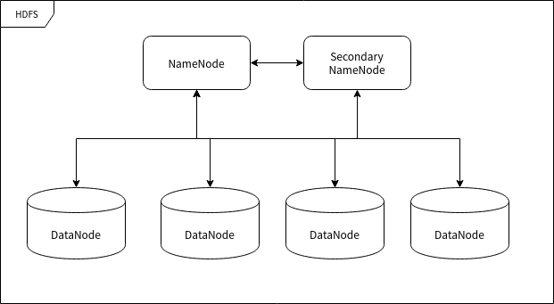

# Hadoop

Hadoop 是一个开源的分布式计算和存储框架，由 Apache 基金会开发和维护。

## 相关概念

### HDFS

Hadoop Distributed File System，Hadoop 分布式文件系统，简称 HDFS。

**命名节点 (NameNode)**

​		命名节点 (NameNode) 是用于指挥其它节点存储的节点。任何一个"文件系统"(File System, FS) 都需要具备根据文件路径映射到文件的功能，命名节点就是用于储存这些映射信息并提供映射服务的计算机，在整个 HDFS 系统中扮演"管理员"的角色，因此一个 HDFS 集群中只有一个命名节点。

**数据节点 (DataNode)**

​		数据节点 (DataNode) 使用来储存数据块的节点。当一个文件被命名节点承认并分块之后将会被储存到被分配的数据节点中去。数据节点具有储存数据、读写数据的功能，其中存储的数据块比较类似于硬盘中的"扇区"概念，是 HDFS 存储的基本单位。

**副命名节点 (Secondary NameNode)**

​		副命名节点 (Secondary NameNode) 别名"次命名节点"，是命名节点的"秘书"。这个形容很贴切，因为它并不能代替命名节点的工作，无论命名节点是否有能力继续工作。它主要负责分摊命名节点的压力、备份命名节点的状态并执行一些管理工作，如果命名节点要求它这样做的话。如果命名节点坏掉了，它也可以提供备份数据以恢复命名节点。副命名节点可以有多个。




### MapReduce

MapReduce 的含义就像它的名字一样浅显：Map 和 Reduce (映射和规约) 


## 安装配置

[Apache Hadoop](https://hadoop.apache.org/releases.html)

3.4.x 只支持Java 8和Java 11

### 前置环境

```shell
# Java 运行环境
scp H:\Packages\Linux\Java\jdk-8u441-linux-x64.tar.gz young@192.168.31.101:/home/young/packages/
sudo tar -zxvf /home/young/packages/jdk-8u441-linux-x64.tar.gz -C /opt/apps/
sudo mv /opt/apps/jdk1.8.0_441 /opt/apps/jdk1.8.0

# SSH 环境
systemctl enable ssh && systemctl start ssh
```


### 文件部署

```shell
scp E:\Need2Sync\Packages\Linux\Hadoop\hadoop-3.4.1.tar.gz young@192.168.31.101:/home/young/packages/

cd /opt/apps/
sudo tar -zxvf /home/young/packages/hadoop-3.4.1.tar.gz -C ./
sudo mv hadoop-3.4.1 hadoop

# 是否成功
hadoop version
# Hadoop 3.4.1
# Source code repository https://github.com/apache/hadoop.git -r 4d7825309348956336b8f06a08322b78422849b1
# Compiled by mthakur on 2024-10-09T14:57Z
# Compiled on platform linux-x86_64
# Compiled with protoc 3.23.4
# From source with checksum 7292fe9dba5e2e44e3a9f763fce3e680
# This command was run using /opt/apps/hadoop/share/hadoop/common/hadoop-common-3.4.1.jar

# 创建运行 Hadoop 的用户
sudo useradd -r -g apps -s /bin/bash -m hadoop
sudo passwd hadoop

sudo mkdir /opt/data/hadoop
sudo mkdir /opt/temp/hadoop
sudo chown -R hadoop:apps /opt/apps/hadoop
sudo chown -R hadoop:apps /opt/data/hadoop
sudo chown -R hadoop:apps /opt/temp/hadoop

# 配置管理员权限
sudo vim /etc/sudoers
hadoop  ALL=(ALL)       ALL
```


### 配置

- workers	记录所有的数据节点的主机名或 IP 地址
- core-site.xml	Hadoop 核心配置
- hdfs-site.xml	HDFS 配置项
- mapred-site.xml	MapReduce 配置项
- yarn-site.xml	YARN 配置项，为 MapReduce 提供资源管理服务


在每个节点进行以下配置


#### workers

`vim $HADOOP_HOME/etc/hadoop/workers `

```shell
192.168.31.102
192.168.31.103
```


#### core-site.xml

`vim $HADOOP_HOME/etc/hadoop/core-site.xml `

```xml
    <!-- 配置 HDFS 主机地址与端口号 -->
    <property>
        <name>fs.defaultFS</name>
        <value>hdfs://192.168.31.101:9000</value>
    </property>
    <!-- 配置 Hadoop 的临时文件目录 -->
    <property>
        <name>hadoop.tmp.dir</name>
        <value>file:///opt/data/hadoop/tmp</value>
    </property>
```


#### hdfs-site.xml

`vim $HADOOP_HOME/etc/hadoop/hdfs-site.xml `

```xml
    <!-- 每个数据块复制 2 份存储 -->
    <property>
        <name>dfs.replication</name>
        <value>2</value>
    </property>
    
    <!-- 设置储存命名信息的目录 -->
    <property>
        <name>dfs.namenode.name.dir</name>
        <value>file:///opt/data/hadoop/hdfs/name</value>
    </property>
```


#### hadoop-env.sh

`vim $HADOOP_HOME/etc/hadoop/hadoop-env.sh`

```shell
export JAVA_HOME=/opt/apps/jdk1.8.0
export HADOOP_PID_DIR=/opt/temp/hadoop

# NameNode 内存限制
export HDFS_NAMENODE_OPTS="-Xmx4g -Xms4g"

# DataNode 内存限制
export HDFS_DATANODE_OPTS="-Xmx2g -Xms2g"

# ResourceManager 内存限制
export YARN_RESOURCEMANAGER_OPTS="-Xmx2g -Xms2g"

# NodeManager 内存限制
export YARN_NODEMANAGER_OPTS="-Xmx2g -Xms2g"

# 历史服务器内存
export MAPRED_HISTORYSERVER_OPTS="-Xmx2g"
```


#### 环境变量

`sudo vim /etc/profile`

`source /etc/profile`

```shell
export HADOOP_HOME="/opt/apps/hadoop"
export PATH=$PATH:$HADOOP_HOME/bin:$HADOOP_HOME/sbin
```


### 设置SSH免密登录

```shell
su hadoop
# 在NameNode上生成密钥对
ssh-keygen -t rsa -P "" -f ~/.ssh/id_rsa
# 并将公钥复制到所有节点（包括自己）
ssh-copy-id -i ~/.ssh/id_rsa.pub hadoop@localhost
ssh-copy-id -i ~/.ssh/id_rsa.pub hadoop@192.168.31.102
ssh-copy-id -i ~/.ssh/id_rsa.pub hadoop@192.168.31.103

# 测试，应该不需要密码
ssh hadoop@192.168.31.102
```


### 初始化

```shell
# 在命名节点中

su hadoop

# 格式化 HDFS
hdfs namenode -format
```


### 服务管理

#### 启动

```shell
# 只需要在在NameNode启动 HDFS，会在NameNode启动NameNode\Secondary NameNode，自动远程启动其它两台DataNode启动DataNode
$HADOOP_HOME/sbin/start-dfs.sh
$HADOOP_HOME/sbin/stop-dfs.sh
# 启动分三个步骤，分别启动 NameNode、DataNode 和 Secondary NameNode
# 命名节点不存在 DataNode 进程
# 运行 jps 查看 Java 进程
```


#### systemctl 

1、创建启动脚本

`vim /home/hadoop/start-dfs.sh.simple`

`sudo chmod +x /home/hadoop/start-dfs.sh.simple`

```shell
#!/bin/bash

/opt/apps/hadoop/sbin/start-dfs.sh
PID_FILE="/opt/temp/hadoop/hadoop-hadoop-namenode.pid"

sleep 5

while true; do
    # 检查文件是否存在且有内容
    if [[ -f "$PID_FILE" && -s "$PID_FILE" ]]; then
        # echo "文件已准备就绪"
        sleep 10
    else
		exit 0
    fi
done

exit 1
```


2、配置 systemctl 服务

`sudo vim /etc/systemd/system/hadoop.service`

[hadoop.service](../files/scripts/server/hadoop.service)


#### 服务管理命令

```shell
# 检查语法错误
systemd-analyze verify /etc/systemd/system/hadoop.service
# 重载 systemd 配置
sudo systemctl daemon-reload
# 设置开机自启
sudo systemctl enable hadoop

# 启动
sudo systemctl start hadoop
# 停止
sudo systemctl stop hadoop
# 查看状态
sudo systemctl status hadoop
```


## HDFS

### 常用命令

#### 基础文件操作

| **命令**               | **作用**     | **示例**                                                     | **关键参数**                                   |
| :--------------------- | :----------- | :----------------------------------------------------------- | :--------------------------------------------- |
| **`hdfs dfs -ls`**     | 列出目录内容 | `hdfs dfs -ls /user` `hdfs dfs -ls -R /data`                 | `-R` 递归显示 `-h` 人性化显示大小              |
| **`hdfs dfs -mkdir`**  | 创建目录     | `hdfs dfs -mkdir /input` `hdfs dfs -mkdir -p /project/raw`   | `-p` 创建多级目录                              |
| **`hdfs dfs -put`**    | 上传文件     | `hdfs dfs -put log.txt /data/` `hdfs dfs -put -f *.csv /input` | `-f` 覆盖已存在文件                            |
| **`hdfs dfs -get`**    | 下载文件     | `hdfs dfs -get /output/result.csv .` `hdfs dfs -get -ignoreCrc /tmp/data` | `-ignoreCrc` 跳过校验                          |
| **`hdfs dfs -cat`**    | 查看文件内容 | `hdfs dfs -cat /logs/system.log` `hdfs dfs -cat -ignoreCrc /tmp/test` |                                                |
| **`hdfs dfs -tail`**   | 查看文件尾部 | `hdfs dfs -tail -f /logs/real.log`                           | `-f` 实时追踪更新                              |
| **`hdfs dfs -cp`**     | 复制文件     | `hdfs dfs -cp /src/data /backup/` `hdfs dfs -cp -f file1 file2` | `-f` 强制覆盖                                  |
| **`hdfs dfs -mv`**     | 移动/重命名  | `hdfs dfs -mv /old /new_location`                            |                                                |
| **`hdfs dfs -rm`**     | 删除文件     | `hdfs dfs -rm /tmp/junk.txt` `hdfs dfs -rm -r /expired_data` | `-r` 递归删除目录 `-skipTrash` 直接删除(慎用!) |
| **`hdfs dfs -touchz`** | 创建空文件   | `hdfs dfs -touchz /_SUCCESS`                                 |                                                |


#### 空间与权限管理

| **命令**               | **作用**     | **示例**                                             | **说明**                          |
| :--------------------- | :----------- | :--------------------------------------------------- | :-------------------------------- |
| **`hdfs dfs -du`**     | 查看目录大小 | `hdfs dfs -du -h /user/hive` `hdfs dfs -du -s /data` | `-h` 人性化显示 `-s` 显示汇总大小 |
| **`hdfs dfs -df`**     | 磁盘空间统计 | `hdfs dfs -df -h /`                                  | `-h` 以GB/MB显示                  |
| **`hdfs dfs -count`**  | 统计文件数量 | `hdfs dfs -count /input`                             | 输出：目录数 文件数 总大小        |
| **`hdfs dfs -chmod`**  | 修改权限     | `hdfs dfs -chmod -R 755 /scripts`                    | 权限格式：755 或 u+x              |
| **`hdfs dfs -chown`**  | 修改所有者   | `hdfs dfs -chown -R hive:hadoop /warehouse`          | 格式：`用户:组`                   |
| **`hdfs dfs -setrep`** | 修改副本数   | `hdfs dfs -setrep -w 2 /critical/data`               | `-w` 等待操作完成                 |


#### 文件内容操作

| **命令**                     | **作用**     | **示例**                                                     | **特殊用途**            |
| :--------------------------- | :----------- | :----------------------------------------------------------- | :---------------------- |
| **`hdfs dfs -text`**         | 查看压缩文件 | `hdfs dfs -text /data/2023.gz`                               | 自动解压gz/snappy等格式 |
| **`hdfs dfs -appendToFile`** | 追加内容     | `echo "new" >> local.txt` `hdfs dfs -appendToFile local.txt /hdfs/log` | 小文件追加操作          |
| **`hdfs dfs -checksum`**     | 文件校验和   | `hdfs dfs -checksum /file`                                   | 验证文件完整性          |


#### 高级管理命令

| **命令**                      | **作用**     | **示例**                                                     | **场景说明**      |
| :---------------------------- | :----------- | :----------------------------------------------------------- | :---------------- |
| **`hdfs dfsadmin -report`**   | 集群状态报告 | `hdfs dfsadmin -report`                                      | 显示节点状态/空间 |
| **`hdfs dfsadmin -safemode`** | 安全模式操作 | `hdfs dfsadmin -safemode enter` `hdfs dfsadmin -safemode get` | **维护时使用**    |
| **`hdfs fsck /`**             | 文件系统检查 | `hdfs fsck / -files -blocks -locations`                      | 检查块健康状态    |
| **`hdfs balancer`**           | 数据均衡     | `hdfs balancer -threshold 10`                                | 磁盘使用率均衡    |


```shell
## 批量操作
# 上传整个目录（保留目录结构）
hdfs dfs -put local_dir /hdfs/parent/
# 下载匹配文件
hdfs dfs -get /logs/2023-*.log .

## 安全删除
# 先移到回收站（默认开启）
hdfs dfs -rm -r /tmp/old_data
# 紧急跳过回收站（慎用！）
hdfs dfs -rm -r -skipTrash /corrupted_data

## 回收站机制
# 默认保留周期：fs.trash.interval=1440（分钟）
# 恢复文件
hdfs dfs -mv /user/.Trash/current/path/file /restore/

## 空间分析
# 查找大文件（前10名）
hdfs dfs -du -h / | sort -h | tail -n 10
# 统计用户存储
hdfs dfs -count -q -h /user/*

## 纠删码管理 (Hadoop 3.0+)
# 设置纠删码策略
hdfs ec -setPolicy -path /cold_data -policy RS-6-3-1024k
# 查看策略
hdfs ec -listPolicies

## 权限
# 跨集群迁移时保留权限
hdfs dfs -cp -p /source /dest

## 性能影响
# 避免小文件操作（合并后再处理）
# 大文件使用-Ddfs.blocksize=256m指定块大小
```


# Hive

## 相关概念

​		Hive 是一个构建在 Hadoop 生态系统之上的**数据仓库软件**，主要用于**简化大数据集的查询和分析**。它的核心思想是将结构化的数据文件映射为数据库表，并提供类似 SQL 的查询语言（称为 HiveQL 或 HQL）来进行操作。


### 核心作用

1. **简化大数据分析：** 让熟悉 SQL 的开发者和分析师能够利用 SQL 技能去查询和分析存储在 Hadoop HDFS 或兼容存储系统（如 S3、ADLS）中的海量数据，无需学习复杂的 Java MapReduce 编程。
2. **数据汇总：** 高效地执行数据聚合、汇总和报告生成。
3. **批处理：** 主要设计用于处理大规模批量数据（ETL - 提取、转换、加载），而不是实时或低延迟的交互式查询（虽然新版本在改进这一点）。
4. **数据仓库：** 在 Hadoop 上构建数据仓库基础设施，用于存储、管理和分析历史数据。
5. **数据抽象：** 提供表结构的逻辑视图，将用户与底层数据存储的物理格式（如文本文件、SequenceFile、ORC、Parquet）和位置分离开来。


### 核心原理

1. **元数据存储：**
   - Hive 的核心组件之一是 **元存储**。它本质上是一个关系型数据库（通常是 MySQL、PostgreSQL 或 Derby），用于存储：
     - **表定义：** 表名、列名、数据类型。
     - **表与数据的映射关系：** 表对应的 HDFS 文件路径。
     - **分区信息：** 如何将表数据按目录结构划分（例如按日期分区）。
     - **模式信息：** 数据的结构。
     - **序列化/反序列化方法：** 如何将文件中的数据行读取（反序列化）成内存中的对象，以及如何将内存中的对象写入（序列化）到文件。
   - 元存储使得 HiveQL 能够理解数据的结构。
2. **SQL 方言：**
   - Hive 提供 **HiveQL**，一种类似 SQL 的查询语言。用户使用 HiveQL 提交查询（如 `SELECT`, `JOIN`, `GROUP BY`, `CREATE TABLE`）。
3. **查询编译与执行：**
   - **Driver：** 接收用户提交的 HiveQL 查询。
   - **编译器：**
     - **解析：** 检查 HiveQL 语句的语法。
     - **语义分析：** 利用元存储验证表、列的存在性和类型兼容性。
     - **逻辑计划生成：** 将查询转换为抽象语法树，然后生成一个逻辑查询计划（描述要执行的操作，但不管具体执行方式）。
     - **优化：** 对逻辑计划进行优化（如谓词下推、列裁剪）。
     - **物理计划生成：** 将优化后的逻辑计划转换为物理执行计划。**这是关键步骤：**
       - 传统上，物理计划被编译成一个或多个 **MapReduce 作业**。
       - 现代 Hive 版本默认或支持使用 **Tez** 或 **Spark** 作为执行引擎，生成对应的 DAG（有向无环图）任务。
   - **执行引擎：**
     - 传统：**MapReduce：** 物理计划被提交给 Hadoop YARN 资源管理器，调度 MapReduce 任务在集群节点上执行。Map 任务读取数据、处理并输出键值对；Reduce 任务对 Map 的输出进行汇总处理。
     - 现代：**Tez / Spark：** 物理计划被转换为更高效的 Tez DAG 或 Spark RDD/Dataset 操作，然后提交给 YARN 执行。这些引擎避免了 MapReduce 中间结果频繁写磁盘的开销，显著提升性能。
     - **LLAP：** Hive 2.0+ 引入的 **Live Long and Process** 守护进程，在集群节点上常驻内存，缓存数据和查询片段，提供混合执行模式（部分内存计算 + 部分 YARN 任务），极大提升了交互式查询的性能。
4. **数据存储与访问：**
   - 实际数据通常存储在 **HDFS** 或其他分布式文件系统上。
   - Hive **不拥有**自己的存储引擎。它只是管理数据的元信息（表结构、位置），并定义如何读取/写入这些文件。
   - 执行引擎（MapReduce/Tez/Spark）根据物理计划，读取 HDFS 上的文件，执行计算，并将结果写回 HDFS 或返回给用户。
   - Hive 支持多种文件格式（TextFile, SequenceFile, RCFile, ORC, Parquet）和压缩算法（Snappy, Gzip, LZO），其中 **ORC** 和 **Parquet** 是列式存储格式，能显著提升分析查询的性能。


### 与 Hadoop 的关系

Hive 与 Hadoop 的关系是**紧密依赖和构建其上**的关系：

1. **基石：**
   - **存储：** Hive **依赖** Hadoop 的核心组件 **HDFS** 作为其底层的主要分布式文件存储系统。Hive 表的数据物理上存储在 HDFS 上。
   - **计算：** Hive **依赖** Hadoop 的 **YARN** 作为其资源管理和作业调度框架。无论是传统的 MapReduce 作业，还是 Tez 或 Spark 任务（在 YARN 上运行），都需要 YARN 来分配集群资源（CPU, 内存）并管理任务的生命周期。
   - **计算模型：** Hive 最初的执行引擎直接建立在 **MapReduce** 计算模型之上。虽然现在有更优的 Tez/Spark 替代，MapReduce 仍然是其历史和兼容性的基础。
2. **抽象层：**
   - Hive 可以看作是在 Hadoop 原生组件（HDFS, MapReduce/YARN）之上提供的一个**高级抽象层**。
   - 它将对大数据集的复杂 MapReduce/Tez/Spark 处理逻辑**封装**在简单的 HiveQL 语句背后。用户写 SQL，Hive 负责将其翻译成能在 Hadoop 集群上高效执行的分布式计算任务。
3. **生态系统核心成员：**
   - Hive 是 Hadoop 生态系统（Hadoop Ecosystem）中最核心、使用最广泛的组件之一。它极大地降低了使用 Hadoop 进行数据分析的门槛，推动了 Hadoop 在企业数据仓库和批处理分析领域的普及。


### 与 RDBMS 的区别

| 特性               | Hive                                                         | RDBMS                                                        |
| :----------------- | :----------------------------------------------------------- | :----------------------------------------------------------- |
| **设计目标与场景** | **大数据批处理分析（OLAP）**。处理存储在分布式文件系统（如 HDFS）上的 **PB 级** 历史数据，用于数据仓库、报表、挖掘。 | **在线事务处理（OLTP）** 和部分分析（OLAP）。处理 **GB 到 TB 级** 的**结构化**数据，支持高频、低延迟的增删改查操作。 |
| **数据规模**       | 海量（**PB+**），存储在可扩展的分布式文件系统上。            | 通常较小（**GB 到 TB**），存储在本地文件系统或 SAN/NAS 上。  |
| **数据存储位置**   | **外部存储**：数据存储在 **HDFS/S3** 等分布式文件系统上。Hive 只管理**元数据**（表结构、位置）。 | **内部存储**：数据存储在数据库**自己管理**的存储引擎（如 InnoDB）的文件中。数据库拥有数据。 |
| **查询延迟**       | **高延迟**（分钟到小时级）。处理海量数据需要启动分布式作业（MapReduce/Tez/Spark），涉及磁盘 I/O 和网络传输。LLAP 可提升交互式查询速度。 | **低延迟**（毫秒到秒级）。优化器高效，数据常驻内存/本地磁盘，索引加速。 |
| **数据写入模式**   | **读时模式**：写入数据时**不验证**数据是否符合表模式。加载数据只是移动文件。模式验证在**查询时**进行。灵活但易出错。 | **写时模式**：写入数据时**严格验证**数据是否符合模式（数据类型、约束）。保证数据一致性。 |
| **事务支持**       | **有限支持**（Hive 0.13+）。主要用于 ETL 过程中的原子性插入。**不是核心设计目标**，性能开销大。ACID 特性不如 RDBMS 完善和高效。 | **核心功能**。提供完整的 **ACID**（原子性、一致性、隔离性、持久性）事务支持，是保证数据一致性的基础。 |
| **更新/删除**      | **支持有限**（Hive 0.14+）。在事务表上支持 `UPDATE` 和 `DELETE`，但**效率低**（重写文件）。主要用于修正错误，**不适合高频操作**。 | **核心操作**。高效支持 `UPDATE` 和 `DELETE`（原地更新或标记删除）。 |
| **索引**           | **支持有限**（位图索引、紧凑索引等），但**不常用且效果有限**。主要依赖**全表扫描/分区/分桶** 和 **列式存储格式**（ORC/Parquet）来优化查询。 | **核心优化手段**。提供多种高效索引（B-tree, Hash 等），显著加速点查和范围查询。 |
| **执行引擎**       | 将 HiveQL **编译成分布式计算作业**（MapReduce / **Tez** / **Spark**），在 **YARN** 集群上执行。涉及启动开销、磁盘 I/O、网络 Shuffle。 | 使用**高度优化的专用查询引擎**，直接在本地或共享存储上执行，大量利用内存缓存和索引。 |
| **扩展性**         | **横向扩展（Scale-out）**：通过增加集群节点（廉价硬件）线性扩展存储和计算能力。 | **纵向扩展（Scale-up）**：通过升级单机硬件（CPU、内存、SSD）提升性能。集群（如 RAC）复杂且昂贵。 |
| **数据格式**       | 处理**多种格式**（文本、JSON、CSV、二进制如 ORC/Parquet）。强调**列式存储**以优化分析查询。 | 通常使用**专有或高度优化的行式存储格式**（有时支持列式）。   |
| **适用操作**       | 擅长**批量加载（`LOAD`, `INSERT OVERWRITE`）** 和**复杂查询**（多表 JOIN、聚合 GROUP BY）。 | 擅长**高频小事务**（`INSERT`, `UPDATE`, `DELETE`, `SELECT` 单行/小范围）。 |
| **容错性**         | 高（依赖底层 HDFS 副本和计算框架的重试机制）。               | 通常依赖硬件冗余（RAID）、复制和备份。                       |


## 安装配置

1. **版本兼容性：**
   - **Hive 版本需要匹配 Hadoop 版本：** 这是最关键的关系。不同版本的 Hive 编译时通常**依赖特定版本范围的 Hadoop 客户端库**。使用不兼容的 Hadoop 版本运行 Hive 可能导致各种错误，从类加载失败到运行时异常。
   - **兼容性映射：**
     - **Hive 1.x：** 主要兼容 Hadoop 1.x (已过时) 和 Hadoop 2.x (尤其是 2.3.0 到 2.9.x 范围)。部分 Hive 1.2.x 可能能运行在较新的 Hadoop 2.10.x 上，但需要验证。
     - **Hive 2.x：** 设计目标是与 Hadoop 2.x 兼容。具体支持的子版本范围会因 Hive 2.x 的具体版本而异（如 Hive 2.1.x, 2.3.x）。常见兼容于 Hadoop 2.6.x 到 2.10.x。
     - **Hive 3.x：** 这是目前的主流稳定版本。它主要针对 **Hadoop 3.x** 进行了优化和支持。Hive 3.1.x 通常需要 Hadoop 3.x (如 3.1.x, 3.2.x, 3.3.x)。**Hive 3.x 不再支持 Hadoop 2.x！** 这是一个重要的分水岭。
   - **如何确定兼容性？**
     - **官方文档：** 查看你计划安装的 **Hive 版本的官方发行说明**。里面会明确指出它需要或兼容哪些 Hadoop 版本。这是最权威的来源。
     - **`hadoop.version` 属性：** Hive 的 `pom.xml` (构建文件) 或发行包中的 `lib` 目录下包含的 Hadoop 客户端 JAR 文件版本，暗示了它编译和测试所针对的 Hadoop 版本。
     - **社区经验：** 用户社区和各大 Hadoop 发行版供应商（如 Cloudera CDP, Hortonworks HDP/Ambari, Amazon EMR）会测试并发布经过验证的 Hive + Hadoop 组合。


### 文件部署

[Apache Archive Distribution Directory](https://archive.apache.org/dist/hive/)

```shell
scp E:\Need2Sync\Packages\Linux\Hive\apache-hive-4.0.1-bin.tar.gz young@192.168.31.101:/home/young/packages/
scp E:\Need2Sync\Packages\Linux\Mysql\Connector\mysql-connector-j-8.0.31.jar young@192.168.31.101:/home/young/packages/

cd /opt/apps/
sudo tar -zxvf /home/young/packages/apache-hive-4.0.1-bin.tar.gz -C ./
sudo mv apache-hive-4.0.1-bin hive

# 创建运行 Hive 的用户
sudo useradd -r -g apps -s /bin/bash -m hive
sudo passwd hive

# sudo mkdir /opt/data/hadoop
# sudo mkdir /opt/temp/hadoop
sudo chown -R hadoop:apps /opt/apps/hive
# sudo chown -R hadoop:apps /opt/data/hadoop
# sudo chown -R hadoop:apps /opt/temp/hadoop
```


### 配置


#### 环境变量

`sudo vim /etc/profile`

`source /etc/profile`

```shell
export HIVE_HOME=/opt/apps/hive
export PATH=$PATH:$HIVE_HOME/bin
```


#### Hadoop 权限

```shell
# 创建 Hive 在 HDFS 上的工作目录
hadoop fs -mkdir -p /user/hive/warehouse
hadoop fs -mkdir -p /tmp

# 赋予读写权限
hadoop fs -chmod g+w /user/hive/warehouse
hadoop fs -chmod g+w /tmp
#  根据实际用户修改
hadoop fs -chown -R hive:apps /user/hive
```


## 常用 SQL

### 时间

```sql
-- 字符串转时间戳
-- 标准格式转换
SELECT CAST('2023-10-27 14:30:05' AS TIMESTAMP); 
-- 自定义格式转换
SELECT TO_TIMESTAMP('2023/27/10 14.30.05', 'yyyy/dd/MM/ HH.mm.ss'); 
SELECT FROM_UNIXTIME(1698414605); -- 秒级时间戳，秒级以下需要截断

-- 时间戳格式化
SELECT DATE_FORMAT(CURRENT_TIMESTAMP(), 'yyyy-MM-dd');
SELECT DATE_FORMAT('2023-10-27 14:30:05', 'HH:mm');
SELECT DATE_FORMAT('2023-10-27 14:30:05.123', 'yyyyMMdd_HHmmss.SSS');

-- 截取部分时间
SELECT YEAR('2023-10-27 14:30:05');        -- 2023
SELECT MONTH('2023-10-27 14:30:05');       -- 10
SELECT DAY('2023-10-27 14:30:05');         -- 27
SELECT HOUR('2023-10-27 14:30:05');        -- 14
SELECT MINUTE('2023-10-27 14:30:05');      -- 30
SELECT SECOND('2023-10-27 14:30:05');      -- 05

SELECT WEEKOFYEAR('2023-10-27');     -- 当年第几周（43）
SELECT QUARTER('2023-10-27');        -- 季度（4）
SELECT DAYOFWEEK('2023-10-27');      -- 周几（1=周日, 2=周一,...,7=周六）

SELECT DATE_FORMAT('2023-10-27 14:30:05.123', 'SSS');  -- 123

-- 时间计算
SELECT DATE_ADD('2023-10-27', 7);    -- 2023-11-03（加7天）
SELECT DATE_SUB('2023-10-27', 7);    -- 2023-10-20（减7天）
-- 加1小时
SELECT CURRENT_TIMESTAMP() + INTERVAL 1 HOUR;  -- Hive 2.1.0+
-- 通用方法（通过秒数加减）
SELECT FROM_UNIXTIME(UNIX_TIMESTAMP() + 3600); -- 加1小时
-- 时间差
SELECT DATEDIFF('2023-10-30', '2023-10-27');  -- 3（天数差）
```


**常用格式化符号**

| 符号   | 含义          | 示例 |
| :----- | :------------ | :--- |
| `yyyy` | 4位年份       | 2023 |
| `MM`   | 月份（01-12） | 10   |
| `dd`   | 日期（01-31） | 27   |
| `HH`   | 小时（00-23） | 14   |
| `mm`   | 分钟（00-59） | 30   |
| `ss`   | 秒（00-59）   | 05   |
| `SSS`  | 毫秒          | 123  |


# Flink


## 相关概念


## 安装配置

[Downloads | Apache Flink](https://flink.apache.org/zh/downloads/)

### Standalone-HA

#### 规划

服务器01： JobManager+TaskManager

服务器02： JobManager+TaskManager

服务器03： TaskManager


#### 文件部署

```shell
scp E:\Need2Sync\Packages\Linux\Flink\flink-1.20.2-bin-scala_2.12.tgz young@192.168.31.101:/home/young/packages/

cd /opt/apps/
sudo tar -zxf /home/young/packages/flink-1.20.2-bin-scala_2.12.tgz -C ./
sudo mv flink-1.20.2 flink

# 创建运行 Hadoop 的用户
sudo useradd -r -g apps -s /bin/bash -m flink
sudo passwd flink

sudo mkdir -p /opt/data/flink/{checkpoints,savepoints,ha,logs}
sudo mkdir /opt/temp/flink
sudo chown -R flink:apps /opt/apps/flink
sudo chown -R flink:apps /opt/data/flink
sudo chown -R flink:apps /opt/temp/flink

# 配置管理员权限
sudo vim /etc/sudoers
flink  ALL=(ALL)       ALL
```


#### 配置

##### flink-conf.yaml

`vim /opt/apps/flink/conf/flink-conf.yaml`

```yaml
# 基础配置
# These parameters are required for Java 17 support.
# They can be safely removed when using Java 8/11.
env.java.opts.all: --add-exports=java.base/sun.net.util=ALL-UNNAMED --add-exports=java.rmi/sun.rmi.registry=ALL-UNNAMED --add-exports=jdk.compiler/com.sun.tools.javac.api=ALL-UNNAMED --add-exports=jdk.compiler/com.sun.tools.javac.file=ALL-UNNAMED --add-exports=jdk.compiler/com.sun.tools.javac.parser=ALL-UNNAMED --add-exports=jdk.compiler/com.sun.tools.javac.tree=ALL-UNNAMED --add-exports=jdk.compiler/com.sun.tools.javac.util=ALL-UNNAMED --add-exports=java.security.jgss/sun.security.krb5=ALL-UNNAMED --add-opens=java.base/java.lang=ALL-UNNAMED --add-opens=java.base/java.net=ALL-UNNAMED --add-opens=java.base/java.io=ALL-UNNAMED --add-opens=java.base/java.nio=ALL-UNNAMED --add-opens=java.base/sun.nio.ch=ALL-UNNAMED --add-opens=java.base/java.lang.reflect=ALL-UNNAMED --add-opens=java.base/java.text=ALL-UNNAMED --add-opens=java.base/java.time=ALL-UNNAMED --add-opens=java.base/java.util=ALL-UNNAMED --add-opens=java.base/java.util.concurrent=ALL-UNNAMED --add-opens=java.base/java.util.concurrent.atomic=ALL-UNNAMED --add-opens=java.base/java.util.concurrent.locks=ALL-UNNAMED

env.pid.dir: /opt/temp/flink

# 配置高可用居群不需要配置 jobmanager.rpc.address，由ZK动态分配
# jobmanager.rpc.address: localhost
jobmanager.rpc.port: 6123
# jobmanager.bind-host: 0.0.0.0
jobmanager.memory.process.size: 1600m
# taskmanager.bind-host: 0.0.0.0
taskmanager.host: localhost
taskmanager.memory.process.size: 2048m
taskmanager.numberOfTaskSlots: 2
rest.address: 0.0.0.0
rest.port: 8081
parallelism.default: 2

# 高可用配置
high-availability: zookeeper
high-availability.storageDir: file:///opt/data/flink/ha
# high-availability.storageDir: hdfs://namenode:8020/flink/ha  # HA元数据存储路径
high-availability.zookeeper.quorum: 192.168.31.101:2181,192.168.31.102:2181,192.168.31.103:2181
# high-availability.zookeeper.path.root: /flink
high-availability.cluster-id: flink-cluster

# 检查点配置
state.backend: filesystem
state.checkpoints.dir: file:///opt/data/flink/checkpoints
# state.backend.fs.checkpointdir: hdfs://namenode:8020/flink/checkpoints
state.savepoints.dir: file:///opt/data/flink/savepoints
# state.backend.fs.savepointdir: hdfs://namenode:8020/flink/savepoints
# execution.checkpointing.interval: 10000

# 日志配置
# web.log.path: /data/flink/logs

# 安全配置（可选）
# security.ssl.internal.enabled: true
# security.ssl.internal.keystore: /opt/flink/conf/keystore.jks
# security.ssl.internal.truststore: /opt/flink/conf/truststore.jks
```


##### masters

配置 masters 文件（JobManager 节点）

`vim /opt/apps/flink/conf/masters `

```
192.168.31.101:8081
192.168.31.102:8081
```


##### workers

配置 workers 文件（TaskManager 节点）

`vim /opt/apps/flink/conf/workers `

```
192.168.31.101
192.168.31.102
192.168.31.103
```


#### 设置SSH免密登录

```shell
su flink
# 在其中一个节点生成密钥对
ssh-keygen -t rsa -P "" -f ~/.ssh/id_rsa
# 并将公钥复制到所有节点（包括自己）
ssh-copy-id -i ~/.ssh/id_rsa.pub flink@localhost
ssh-copy-id -i ~/.ssh/id_rsa.pub flink@192.168.31.102
ssh-copy-id -i ~/.ssh/id_rsa.pub flink@192.168.31.103

# 测试，应该不需要密码
ssh flink@192.168.31.102
```


#### 服务管理

##### 启动

```shell
# 只需要在JobManager，会在JobManager启动StandaloneSessionClusterEntrypoint\TaskManagerRunner
# 自动远程启动其它两台StandaloneSessionClusterEntrypoint\TaskManagerRunner
/opt/apps/flink/bin/start-cluster.sh
/opt/apps/flink/bin/stop-cluster.sh
```


##### systemctl

1、创建启动脚本

`vim /home/flink/start-cluster.sh.simple`

`sudo chmod +x /home/flink/start-cluster.sh.simple`

```shell
#!/bin/bash

/opt/apps/flink/bin/start-cluster.sh
PID_FILE="/opt/temp/flink/flink-flink-standalonesession.pid"

sleep 5

while true; do
    # 检查文件是否存在且有内容
    if [[ -f "$PID_FILE" && -s "$PID_FILE" ]]; then
        # echo "文件已准备就绪"
        sleep 10
    else
		exit 0
    fi
done

exit 1
```


2、配置 systemctl 服务

`sudo vim /etc/systemd/system/flink.service`

[flink.service](../files/scripts/server/flink.service)


##### 服务管理命令

```shell
# 检查语法错误
systemd-analyze verify /etc/systemd/system/flink.service
# 重载 systemd 配置
sudo systemctl daemon-reload
# 设置开机自启
sudo systemctl enable flink

# 启动
sudo systemctl start flink
# 停止
sudo systemctl stop flink
# 查看状态
sudo systemctl status flink
```


#### 测试

访问 WebUI

http://192.168.31.101:8081/#/job-manager/config


执行 WC

/opt/apps/flink/bin/flink run  /opt/apps/flink/examples/batch/WordCount.jar
