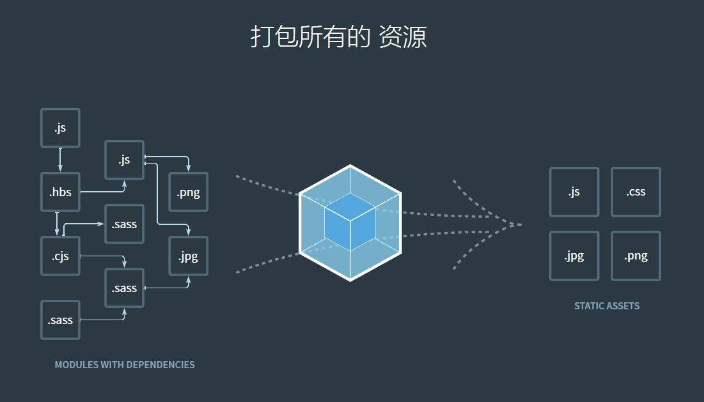

# Node.js

## 简述

[官方文档](https://nodejs.org/en/docs/)

Node.js 是一个基于 Chrome V8 引擎的 JavaScript 运行环境。 
Node.js 使用了一个事件驱动、非阻塞式 I/O 的模型，使其轻量又高效。 

Node.js 是一个让 JavaScript 运行在服务端的开发平台，它让 JavaScript 成为与PHP、Python、Perl、Ruby 等服务端语言平起平坐的脚本语言。发布于2009年5月，由Ryan Dahl开发，实质是对Chrome V8引擎进行了封装。

Node.js 对一些特殊用例进行优化，提供替代的API，使得V8在非浏览器环境下运行得更好。V8引擎执行 JavaScript 的速度非常快，性能非常好。Node.js 是一个基于 Chrome JavaScript 运行时建立的平台， 用于方便地搭建响应速度快、易于扩展的网络应用。Node 使用事件驱动， 非阻塞 I/O 模型而得以轻量和高效，非常适合在分布式设备上运行数据密集型的实时应用


## 下载安装

在[官网下载](https://nodejs.org/en/download/)解压安装包，解压之后配置它的根目录到系统环境变量里

版本检验：运行—>cmd

ES6

```shell
node --version
# 输出版本号
```


## NPM

npm是随同Node.js一起安装的包管理工具，能解决Node.js代码部署上的很多问题，常见的使用场景有以下几种：

- 允许用户从 npm 服务器下载别人编写的第三方包到本地使用。
- 允许用户从 npm 服务器下载并安装别人编写的命令行程序-cli到本地使用。
- 允许用户将自己编写的包或命令行程序上传到NPM服务器供别人使用。

由于新版的 node.js 已经集成了 npm，所以之前 npm 也一并安装好了。同样可以通过输入 npm -v 命令来测试是否成功安装。

版本检验：运行—>cmd

```shell
$ npm -v
# 输出版本号
```


### 使用npm初始化项目

**第一步**

先新建一个项目目录，然后在命令行窗口切换到项目目录

**第二步**

在命令行窗口输入命令 

```shell
npm init
npm init -y #新建项目时以下信息全部使用默认值
```

命令行里会以交互的形式让你填一些项目的介绍信息，依次介绍如下：（不知道怎么填的直接回车、回车...）

- name 项目名称(默认项目文件夹名)
- version 项目的版本号(1.0.0)
- description 项目的描述信息
- entry point 项目的入口文件(index.js)
- test command 项目启动时脚本命令
- git repository 如果你有 Git 地址，可以将这个项目放到你的 Git 仓库里
- keywords 关键词
- author 作者叫啥(一般写邮箱地址)
- license 项目要发行的时候需要的证书，平时玩玩忽略它


**第三步**

在项目目录下会自动生成 package.json 文件，打开可以看到刚才配置的项目信息。

package.json 文件里记录项目的描述信息：项目作者、项目描述、项目依赖哪些包、插件配置信息等等


### 使用npm安装模块

#### 安装

使用 npm 安装模块之后在项目中就不用手动下载模块了，然后就可以直接在项目中导入使用

以 jquery 为例

在编写普通项目时要先下载 jquery.js 然后使用如下标签引入 jquery

```html
<script src="https://code.jquery.com/jquery-3.4.1.min.js"></script>
```

在 npm 项目中使用下面的命令就可以导入 jquery 包而不需要手动下载了

```shell
npm install <Module Name>
# npm install=npm i
# 例如安装jquery: npm install jquery
# 安装好后写入package.json的dependencies中（生产环境依赖）
npm install
# 安装项目全部依赖
```

模块名可以在 [npm官网](https://www.npmjs.com/support) 搜索查到，例如需要 jquery，直接搜索 jquery 就好

安装好之后，jquery 包就放在了项目目录下的 node_modules 目录中

不指定版本号时默认使用最新版本号

如果 npm 安装失败，请先卸载干净再重新安装

#### 手动指定版本号

```shell
npm install <name>@<version>
# 例如安装jquery3.2.1: npm install jquery@3.2.1
```

#### 选项

```shell
npm install <name> --save
# --save=-S
# 安装好后只写入package.json的dependencies中（生产环境依赖）
npm install <name> --save-dev
# --save-dev=-D
# 安装好只后写入package.json的devDepencies中（开发环境依赖）
npm install <name> -global
# -global=-g
# 全局安装，安装后的包位于系统预设目录下
```

**开发依赖：devDependencies**
开发环境依赖，仅次于dependencies的使用频率！它的对象定义和dependencies一样，只不过它里面的包只用于开发环境，不用于生产环境，这些包通常是单元测试或者打包工具等，例如gulp, grunt, webpack, moca, coffee等

**生产依赖：dependencies**
应用依赖，或者叫做业务依赖，这是我们最常用的依赖包管理对象！它用于指定应用依赖的外部包，这些依赖是应用发布后正常执行时所需要的，但不包含测试时或者本地打包时所使用的包。


#### package-lock.json

第一次安装后会生成 package-lock.json 关于 [package-lock.json](../files/HTML/202312/001.pdf)


### 使用 npm 更新模块

```shell
npm update [<name>][-g]/[--save][-dev]
# update、up、upgrade
```


### 使用 npm 卸载模块

```shell
npm uninstall [<name>][-g]/[--save][-dev]
# update、remove、rm、r, un、unlink
```


### 搜索

```shell
npm search [<name>]
# search、s、se、find
```


### 版本信息

```shell
npm view jquery versions      	# 查看 npm 服务器上 jQuery 的所有版本号
npm view jquery version       	# 查看最新的 jQuery 版本号
npm view jquery					# 查看 jquery 的相关信息
npm info jquery					# 查看 jquery 的相关信息
npm ls jquery 					# 看本地安装的jQuery版本信息
npm ls jquery -g   				# 看全局安装的jQuery版本信息
```


### 发布

​		使用该功能可以将我们自己的模块发布到 npm 以供其他人使用，在发布之前我们必须在 npm 上有一个自己的账号，通常我们可以使用以下命令来进行注册和发布：

```shell
npm adduser                # npm 账号注册，以邮箱方式
npm publish <name>         # npm 模块发布
```


### 查看模块信息

```shell
npm list/ls/la/ll [-g]	# 查看项目或全局下已安装的各模块之间的依赖关系图
npm list -g --depth 0	# 查看全局已安装模块
npm root [-g]	# 查看项目或全局中模块安装的路径
npm view <name> <属性名称>
# 查看模块的注册信息，例如包名称（name）、版本号（version）、描述（description）、作者（author）、版权（license）等等信息。例如 npm view jquery description
npm repo <name>	# Repo URL
npm docs <name>	# 官方文档
```


### Config命令

```shell
npm config set prefix <path>	# 更改 npm 全局安装路径
npm config set registry <URL>	# 更改npm镜像源
```


### Set命令

```shell
ng set --global packageManager=yarn		# 更换包管理器
```


### 其它常用命令

```shell
npm help	# 帮助
npm -h		# 快速搜索某一个命令的详情语法
npm cache clean		# 清除缓存
npm cache verify	# 验证缓存
npm run <command>	#Script，执行在 package.json 中 scripts 属性下定义的脚本
```


## Yarn

yarn是由 Facebook、Google、Exponent 和 Tilde 联合推出了一个新的 JS 包管理工具


### 安装 yarn

在官网[下载安装包](https://yarn.bootcss.com/docs/install/) 

**注意：不论哪种安装方法，都需要先安装 node.js**

验证安装

```shell
yarn --version
```

### 使用yarn初始化项目

**第一步**

先新建一个项目目录，然后在命令行窗口切换到项目目录

**第二步**

在命令行窗口输入命令 

```shell
npm init
npm init -y #新建项目时以下信息全部使用默认值
```

**第三步**

在项目目录下会自动生成 package.json 文件，打开可以看到刚才配置的项目信息。

package.json 文件里记录项目的描述信息：项目作者、项目描述、项目依赖哪些包、插件配置信息等等


###  常用命令

**添加依赖包**

```shell
yarn add [package]
yarn add [package]@[version]
yarn add [package]@[tag]
```


**将依赖项添加到不同依赖项类别中**

分别添加到 `devDependencies`、`peerDependencies` 和 `optionalDependencies` 类别中：

```shell
yarn add [package] --dev
yarn add [package] --peer
yarn add [package] --optional
```


**升级依赖包**

```shell
yarn upgrade [package]
yarn upgrade [package]@[version]
yarn upgrade [package]@[tag]
```

 

**移除依赖包**

```shell
yarn remove [package]
```

 

**安装项目的全部依赖**

```shell
yarn
```

或者

```shell
yarn install
```


# webpack

## 开始

### webpack 是什么

webpack 的核心是现代 JavaScript 应用程序的*静态模块捆绑(打包)器*。

当 webpack 处理您的应用程序：分析你的项目结构，找到 JavaScript 模块以及其它的一些浏览器不能直接运行的拓展语言（Scss，TypeScript 等），并将其转换和打包为合适的格式供浏览器使用。它会在内部构建一个依赖关系图，它映射您的项目所需的每个模块并生成一个或多个包


### webpack 的工作方式

​		webpack 把你的项目当做一个整体，通过一个给定的主文件（如：index.js），webpack 将从这个文件开始找到你的项目的所有依赖文件，使用 loaders 加载器处理它们，最后打包为一个（或多个）浏览器可识别的 JavaScript 文件




### 为什要使用 webPack

​		现今的很多网页其实可以看做是功能丰富的应用，它们拥有着复杂的 JavaScript 代码和一大堆依赖包。为了简化开发的复杂度，前端社区涌现出了很多好的实践方法：

- 模块化，让我们可以把复杂的程序细化为小的文件;

- 类似于 TypeScript 这种在 JavaScript 基础上拓展的开发语言：使我们能够实现目前版本的 JavaScript 不能直接使用的特性，并且之后还能转换为 JavaScript 文件使浏览器可以识别；

- Scss，less 等 CSS 预处理器

- ...

这些改进确实大大的提高了我们的开发效率，但是利用它们开发的文件往往需要进行额外的处理才能让浏览器识别,而手动处理又是非常繁琐的，这就为 webpack 一类的打包工具的出现提供了需求。		

webpack 不是唯一的模块捆绑器。如果您选择使用 webpack 或下面的任何捆绑(打包)器，可阅读[捆绑(打包)器功能比较表](https://webpack.js.org/comparison/)来了解 webpack 与其他竞争对手的优劣


### 安装 webpack

**在开始之前，请确保安装了 Node.js 的最新版本**

本地安装最新版本或特定版本

**建议本地安装**

```shell
npm install --save-dev webpack
npm install --save-dev webpack@<version>
```

全局安装

```shell
npm install --global webpack
# 不推荐全局安装 webpack。这会将你项目中的 webpack 锁定到指定版本，并且在使用不同的 webpack 版本的项目中，可能会导致构建失败
```

安装热部署工具

```shell
npm install webpack-dev-server --save-dev
```

如果你使用 webpack 4+ 版本，你还需要安装 CLI

```shell
npm install --save-dev webpack-cli
```


## Hello World

首先使用 npm 初始化项目 (demo_01) 以及安装好 webpack、-cli

一、新建 webpack.config.js 文件并输入以下内容

```js
const path = require('path');

module.exports = {
  entry: './src/index.js',	//入口
  output: {
    filename: 'main.js',//出口 ./dist/main.js
    path: path.resolve(__dirname, 'dist')
  }
};
```


二、新建一个文件夹 ./src 用来存放原始数据和我们将写的JavaScript模块

在 ./src 里面新建一个 math.js 并输入以下内容

```javascript
export function square(x) {
  return x * x;
}
  
export function cube(x) {
  return x * x * x;
}
```

index.js

```javascript
import { cube } from './math.js';

function component() {
    const element = document.createElement('div');

    element.innerHTML = [
        'Hello webpack!',
        '5 cubed is equal to ' + cube(5)
    ].join('\n\n');
    return element;
}

document.body.appendChild(component());
```


三、新建一个文件夹 ./dist 新建一个 index.html 并输入以下内容

```html
<!DOCTYPE html>
<html>
    <head>
        <title>vue</title>
        <meta charset="UTF-8"></meta>
        <meta name="viewport" content="width=device-width,initial-scale=1.0"></meta>
        <meta http-equiv="X-UA-Compatible" content="ie=edge"></meta>
    </head>
    
<body>
	<script type="text/javascript" src="main.js"></script></body>
</html>
```


四、在项目目录下输入以下命令来构建项目

```shell
npx webpack
# 如果 webpack.config.js 存在，则 webpack 命令默认选择它
```

或

```shell
npx webpack --config webpack.config.js
# 我们在 --config 此处使用此选项仅表示您可以传递任何名称的配置
```

构建成功后将看到如下信息

```shell
Hash: 3eea9308bd765ef786ab
Version: webpack 4.41.2
Time: 458ms
Built at: 2019-11-27 23:52:41
  Asset     Size  Chunks             Chunk Names
main.js  1.1 KiB       0  [emitted]  main
Entrypoint main = main.js
[0] ./src/index.js + 1 modules 409 bytes {0} [built]
    | ./src/index.js 297 bytes [built]
    | ./src/math.js 112 bytes [built]
```


## 使用 npm 脚本构建项目

在npm的 package.json 中的 scripts 添加一条 "build": "webpack" ，完整内容如下

```json
{
  "name": "demo_01",
  "version": "1.0.0",
  "description": "",
  "main": "index.js",
  "scripts": {
    "test": "echo \"Error: no test specified\" && exit 1",
    "build":"webpack --config webpack.config.js"
  },
  "keywords": [],
  "author": "",
  "license": "ISC",
  "devDependencies": {
    "webpack": "^4.41.2",
    "webpack-cli": "^3.3.10"
  }
}
```

现在 npm run build 可以使用该命令代替我们之前使用的命令 npx webpack 。请注意，scripts 我们可以按照与之相同的方式引用本地安装的 npm 软件包 npx 。这个约定是大多数基于 npm 的项目的标准，因为它允许所有贡献者使用相同的一组公共脚本（每个脚本都有 --config 必要的标记）


## 核心知识

### 入口

**入口点entry**指示 webpack 应使用哪个模块开始构建其内部的依赖关系图。webpack 将找出入口点所依赖的其他模块和库（直接和间接）。

默认情况下，其值为 ./src/index.js ，但您可以通过在 webpack 配置中配置 entry 属性来指定不同的（或多个入口点）。例如：

webpack.config.js

```js
module.exports = {
  entry: './src/index.js' //默认值为./src/index.js
};
```


### 输出

该输出属性告诉 webpack 在哪里输出创建以及如何命名这些文件。它默认 ./dist/main.js 为主输出文件和 ./dist 为任何其他生成文件的文件夹。

您可以通过 output 在配置中指定字段来配置此过程的这一部分：

webpack.config.js

```javascript
const path = require('path');

module.exports = {
  entry: './src/index.js',
  output: {
    filename: 'main.js'
    path: path.resolve(__dirname, 'dist'),
  }
};
```

在上面的示例中，我们使用 output.filename 和 output.path 属性告诉 webpack 我们的包的名称以及我们希望它输出到的位置。如果您想知道在顶部导入的路径模块，它是一个核心 Node.js 模块，用于操作文件路径


### 加载器

​		开箱即用，webpack 只能理解 JavaScript 和 JSON 文件。加载器允许 webpack 处理其他类型的文件，并将其转换为有效的模块。

​		**注意**，import 任何类型的模块（例如 .css 文件）的功能都是特定于 webpack 的功能，其他捆绑器或任务运行器可能不支持。我们认为这种语言的扩展是有保证的，因为它允许开发人员构建更准确的依赖图

​		webpack 将所有静态资源都视为模块，比如 JavaScript、CSS、LESS、JSX、CoffeeScript、图片等，从而可以对其进行统一管理。为此，webpack 引入了加载器 (Loaders) 的概念，每一种资源都可以通过对应的加载器处理成模块。webpack 的加载器之间可以进行串联，一个加载器的输出可以成为另一个加载器的输入。比如，LESS文件先通过 less-loader 处理成 CSS，然后再通过 css-loader 加载成 CSS 模块，最后由 style-loader 加载器对其做最后的处理，这样在运行时可以通过style标签将其应用到最终的浏览器环境。

加载器使用之前要先安装

```shell
npm install style-loader --save-dev
npm install css-loader --save-dev
```

为了让 webpack 识别资源应该用哪种加载器去载入，需要在配置文件中进行配置

webpack.config.js

```javascript
const path = require('path');

module.exports = {
  entry: './src/index.js',
  output: {
    filename: 'main.js',
    path: path.resolve(__dirname, 'dist')
  },
  module: {
      rules: [
        {test: /\.css$/,use: ['style-loader', 'css-loader']}
      ]
  }
};
```

webpack 配置中有两个属性：

1. 该 test 属性标识应转换哪个或哪些文件
2. 该 use 属性指示应使用哪个加载程序进行转换

**注意**：使用正则表达式匹配文件时 `/\.txt$/` 与 `'/\.txt$/'` 或者 `"/\.txt$/"` 不同


### 插件

虽然加载器用于转换某些类型的模块，但可以利用插件执行更广泛的任务，如捆绑优化，资产管理和环境变量注入。

要使用插件，您需要将 require() 其添加到 plugins 数组中。大多数插件都可以通过选项进行自定义。由于您可以在配置中多次使用插件用于不同目的，因此您需要通过使用 new 运算符调用它来创建它的实例。

插件使用之前要先安装插件

```shell
npm install html-webpack-plugin --save-dev
npm install webpack-dev-server --save-dev
```

webpack.config.js

```javascript
const HtmlWebpackPlugin = require('html-webpack-plugin'); //installed via npm
const webpack = require('webpack'); //to access built-in plugins

module.exports = {
  entry: './src/index.js',
  output: {
    filename: 'main.js',
    path: path.resolve(__dirname, 'dist')
  },
  module: {
      rules: [
        {test: /\.css$/,use: ['style-loader', 'css-loader']}
      ]
  },
  plugins: [
    new HtmlWebpackPlugin({template: './src/index.html'})
  ]
};
```

在上面的示例中， html-webpack-plugin 通过自动注入所有生成的包来为应用程序生成HTML文件。

> webpack 提供了许多开箱即用的插件！查看[插件列表](https://webpack.js.org/plugins)。

在 webpack 配置中使用插件非常简单。但是，有许多用例值得进一步探索。


### 模式

通过设定 mode 参数设置为 development (开发模式)， production (生产模式) 或者 none ，您可以启用对应于每个环境的 webpack 内置的优化。默认值为 production 。

```javascript
module.exports = {
  mode: 'production'
};
```

详细了解[此处](https://webpack.js.org/configuration/mode)的[模式配置](https://webpack.js.org/configuration/mode)以及对每个值进行的优化。


## Asset Management

在例子 demo_01 项目的基础上。让我们尝试合并一些其他资产，比如样式、图片、字体、xml 等。

在webpack之前，前端开发人员将使用 grunt 和 gulp 等工具来处理这些资产，并将它们从/src文件夹移到/dist或/build目录中。Javascript模块也使用了同样的思想，但是 webpack 之类的工具将动态捆绑所有依赖项（创建所谓的依赖图）。这很好，因为现在每个模块都明确声明了它的依赖关系，我们将避免捆绑未使用的模块。

webpack 最出色的功能之一就是，除了 JavaScript，还可以通过 loader 引入任何其他类型的文件。也就是说，以上列出的那些 JavaScript 的优点（例如显式依赖），同样可以用来构建网站或 web 应用程序中的所有非 JavaScript 内容。让我们从 CSS 开始起步，或许你可能已经熟悉了这个设置过程。


### 加载器 (loader) 概念

loader 用于对模块的源代码进行转换。loader 可以使你在 import 或"加载"模块时预处理文件。因此，loader 类似于其他构建工具中“任务 (task) ”，并提供了处理前端构建步骤的强大方法。loader 可以将文件从不同的语言（如 TypeScript）转换为 JavaScript，或将内联图像转换为 data URL。loader 甚至允许你直接在 JavaScript 模块中 import CSS 文件！


#### 使用 loader 的步骤

##### **安装相对应的 loader**

```shell
npm install css-loader --save-dev
npm install style-loader --save-dev
```


##### 三种使用 loader 的方式

在你的应用程序中，有三种使用 loader 的方式：

- [配置](https://www.webpackjs.com/concepts/loaders/#configuration)（推荐）：在 webpack.config.js 文件中指定 loader。
- [内联](https://www.webpackjs.com/concepts/loaders/#inline)：在每个 import 语句中显式指定 loader。
- [CLI](https://www.webpackjs.com/concepts/loaders/#cli)：在 shell 命令中指定它们。

**配置[Configuration]**

module.rules 允许你在  webpack.config.js  配置文件中指定多个 loader。 这是展示 loader 的一种简明方式，并且有助于使代码变得简洁。同时让你对各个 loader 有个全局概览：

```js
module: {
  rules: [
    { test: /\.css$/, 
      use: [ 'style-loader','css-loader'] 
    }
  ]
}
```

**内联**

可以在 import 语句或任何等效于 "import" 的方式中指定 loader。使用 ! 将资源中的 loader 分开。分开的每个部分都相对于当前目录解析。

```js
import Styles from 'style-loader!css-loader?modules!./styles.css';
```

通过前置所有规则及使用 !，可以对应覆盖到配置中的任意 loader。

选项可以传递查询参数，例如 ?key=value&foo=bar ，或者一个 JSON 对象，例如 ?{"key":"value","foo":"bar"}。

> 尽可能使用 module.rules，因为这样可以减少源码中的代码量，并且可以在出错时，更快地调试和定位 loader 中的问题。

**CLI**

你也可以通过 CLI 使用 loader：

```sh
webpack --module-bind jade-loader --module-bind 'css=style-loader!css-loader'
```

这会对 .jade 文件使用 jade-loader，对 .css 文件使用 style-loader 和 css-loader。


### 改进Hello World 加载 CSS

我们将在 Hello World (demo_01) 的基础上改进为（demo_02)

#### 安装相对应的 loader

css需要两个 loader

```shell
npm install css-loader --save-dev
npm install style-loader --save-dev
```

#### 使用 loader

然后在webpack.config.js文件中添加module模块用来指示 webpack 对每个 .css 使用  css-loader ，以及对所有 .ts 文件使用 ts-loader

webpack.config.js

```javascript
const path = require('path');

module.exports = {
  mode: 'production',
  entry: './src/index.js',
  output: {
    filename: 'main.js',
    path: path.resolve(__dirname, 'dist')
  },
  module: {
    rules: [
      { test: /\.css$/, 
        use: [ 'style-loader','css-loader'] 
      }
    ]
  }
};
```

这使您可以 import './style.css 进入依赖于该样式的文件。现在，当运行该模块时，含有 CSS 字符串的 `<style>`标签，将被插入到 html 文件的 `<head>` 中


#### 新建 CSS 并导入

新建 ./src/css/style.css 并输入以下内容

```css
.hello{
    color:red;
}
```

修改 ./src/index.js 为如下内容

```javascript
import { cube } from './math.js';
import './css/style.css';

function component() {
    const element = document.createElement('div');

    element.innerHTML = [
        'Hello webpack!',
        '5 cubed is equal to ' + cube(5)
    ].join('\n\n');
    element.classList.add('hello');
    return element;
}

document.body.appendChild(component());
```

运行 npm run build 打开 ./dist/index.html 可以看到输出的文字变成了红色。要查看 webpack 做了什么，请检查页面（不要查看页面源代码，因为它不会显示结果），并查看页面的 head 标签。它应该包含我们在 index.js 中导入的 style 块元素


### 改进Hello World 加载图片

#### 安装相对应的 loader

```shell
npm install file-loader --save-dev
```

#### 使用 loader

webpack.config.js

```javascript
  module: {
    rules: [
      { test: /\.css$/, 
        use: [ 'style-loader','css-loader'] 
      },
      {
        test: /\.(png|svg|jpg|gif)$/,
        use: ['file-loader']
      }
    ]
  }
```

现在，当您 import MyImage from  './my-image.png'，该图像将被处理并添加到您的 output 目录中，并且MyImage 变量将包含处理后该图像的最终URL。使用css-loader时，如上所示，url('./my-image.png') CSS 中会出现类似的过程。加载程序将识别这是一个本地文件，并将 './my-image.png' 路径替换为 output 目录中图像的最终路径。在 html-loader 处理``相同的方式


#### 添加一张图片

复制一张图片 ./src/img/background.jpg

修改 ./src/index.js 为如下内容

```javascript
import { cube } from './math.js';
import './css/style.css';
import background from './img/background.jpg';

function component() {
    const element = document.createElement('div');

    element.innerHTML = [
        'Hello webpack!',
        '5 cubed is equal to ' + cube(5)
    ].join('\n\n');
    element.classList.add('hello');
    const myBackground = new Image();
    myBackground.src = background;
    element.appendChild(myBackground);
    return element;
}

document.body.appendChild(component());
```

修改 ./src/css/style.css 为如下内容

```css
.hello{
    color:red;
    background: url('../img/background.jpg');
}
```

运行 npm run build 打开 ./dist/index.html 如果一切顺利，现在可以看到添加的背景图片。如果你检查此元素，你将看到实际的文件名已更改为类似 29f3cf2c56d50c1f78667bf51e08a4b4.jpg 的随机编码名称。这意味着webpack在文件 src 夹中找到了我们的文件并进行了处理！

> 合乎逻辑下一步是，压缩和优化你的图像。查看[image-webpack-loader](https://github.com/tcoopman/image-webpack-loader)和[url-loader](https://webpack.js.org/loaders/url-loader)，了解有关如何增强图像加载过程的更多信息。


### 改进Hello World 加载字体

#### 安装相对应的 loader

```shell
npm install file-loader --save-dev
```

#### 使用 loader

webpack.config.js

```javascript
module: {
  rules: [
    { test: /\.css$/, 
      use: [ 'style-loader','css-loader'] 
    },
    {
      test: /\.(png|svg|jpg|gif)$/,
      use: ['file-loader']
    },
    {
      test: /\.(woff|woff2|eot|ttf|otf)$/,
      use: ['file-loader']
    }
  ]
}
```


#### 将一些字体文件添加到项目中

添加字体文件 ./src/font/FZZJ-KFTXKJW.ttf

修改 ./src/css/style.css 为如下内容

```javascript
@font-face {
    font-family: 'MyFont';
    src:  url('../font/FZZJ-KFTXKJW.ttf');
    font-weight: 600;
    font-style: normal;
}
.hello{
    color:red;
    background: url('../img/background.jpg');
    font-family: 'MyFont';
}
```

运行 npm run build 打开 ./dist/index.html 可以看到输出的文字的字体改变了


### 改进Hello World 加载数据

此外，可以加载的有用资源还有数据，如 JSON 文件，CSV、TSV 和 XML。类似于 NodeJS，JSON 支持实际上是内置的，也就是说 import Data from './data.json'  默认将正常运行。要导入 CSV、TSV 和 XML，你可以使用 csv-loader和xml-loader。让我们处理这三类文件

#### 安装相对应的 loader

```shell
npm install csv-loader xml-loader --save-dev
```

#### 使用 loader

webpack.config.js

```javascript
module: {
  rules: [
    { test: /\.css$/, 
      use: [ 'style-loader','css-loader'] 
    },
    {
      test: /\.(png|svg|jpg|gif)$/,
      use: ['file-loader']
    },
    {
      test: /\.(woff|woff2|eot|ttf|otf)$/,
      use: ['file-loader']
    },
    {
      test: /\.(csv|tsv)$/,
      use: ['csv-loader']
    },
    {
      test: /\.xml$/,
      use: ['xml-loader']
    }
  ]
}
```


#### 将一些数据文件添加到项目中

添加字体文件 ./src/data/data.xml

修改 ./src/data/data.xml 为如下内容

```xml
<?xml version="1.0" encoding="UTF-8"?>
<note>
  <to>Mary</to>
  <from>John</from>
  <heading>Reminder</heading>
  <body>Call Cindy on Tuesday</body>
</note>
```

现在，你可以 import 这四种类型的数据 (JSON, CSV, TSV, XML) 中的任何一种，所导入的 Data 变量将包含可直接使用的已解析 JSON

./src/index.js

```javascript
import { cube } from './math.js';
import './css/style.css';
import background from './img/background.jpg';
import Data from './data/data.xml'

function component() {
    const element = document.createElement('div');

    element.innerHTML = [
        'Hello webpack!',
        '5 cubed is equal to ' + cube(5)
    ].join('\n\n');
    element.classList.add('hello');
    const myBackground = new Image();
    myBackground.src = background;
    element.appendChild(myBackground);
    return element;
}

document.body.appendChild(component());

console.log(Data);
```

运行 npm run build 打开 ./dist/index.html 查看控制台，你应该能够看到你导入的数据被打印在了上面

> *在使用* [d3](https://github.com/d3) *等工具来实现某些数据可视化时，预加载数据会非常有用。我们可以不用再发送 ajax 请求，然后于运行时解析数据，而是在构建过程中将其提前载入并打包到模块中，以便浏览器加载模块后，可以立即从模块中解析数据。*


### 常用加载器

#### 文档[Files]

- [`raw-loader`](https://webpack.js.org/loaders/raw-loader) 加载文件的原始内容（utf-8）
- [`val-loader`](https://webpack.js.org/loaders/val-loader) 将代码作为模块执行，并将导出视为JS代码
- [`url-loader`](https://webpack.js.org/loaders/url-loader)像文件加载器一样工作，但如果文件小于限制，则可以返回[数据URL](https://tools.ietf.org/html/rfc2397)
- [`file-loader`](https://webpack.js.org/loaders/file-loader) 将文件发送到输出文件夹并返回（相对）URL
- [`ref-loader`](https://www.npmjs.com/package/ref-loader) 手动创建任何文件之间的依赖关系

#### JSON

- [`json-loader`](https://webpack.js.org/loaders/json-loader)加载[JSON](http://json.org/)文件（默认包含）
- [`json5-loader`](https://webpack.js.org/loaders/json5-loader)加载并转换[JSON 5](https://json5.org/)文件
- [`cson-loader`](https://github.com/awnist/cson-loader)加载并转换[CSON](https://github.com/bevry/cson#what-is-cson)文件

#### 转换编译[Transpiling]

- [`script-loader`](https://webpack.js.org/loaders/script-loader) 在全局上下文中执行一次JavaScript文件（如在脚本标记中），不解析需求
- [`babel-loader`](https://webpack.js.org/loaders/babel-loader)加载ES2015 +代码并使用[Babel](https://babeljs.io/)转换为ES5
- [`buble-loader`](https://github.com/sairion/buble-loader)加载ES2015 +代码并使用[Bublé](https://buble.surge.sh/guide/)转换为ES5
- [`traceur-loader`](https://github.com/jupl/traceur-loader)加载ES2015 +代码并使用[Traceur](https://github.com/google/traceur-compiler#readme)转换为ES5
- [`ts-loader`](https://github.com/TypeStrong/ts-loader)或者像JavaScript一样[`awesome-typescript-loader`](https://github.com/s-panferov/awesome-typescript-loader)加载[TypeScript](https://www.typescriptlang.org/) 2.0+
- [`coffee-loader`](https://webpack.js.org/loaders/coffee-loader)像JavaScript一样加载[CoffeeScript](http://coffeescript.org/)
- [`fengari-loader`](https://github.com/fengari-lua/fengari-loader/)使用[fengari](https://fengari.io/)加载Lua代码

#### 模板[Templating]

- [`html-loader`](https://webpack.js.org/loaders/html-loader) 将HTML导出为字符串，需要引用静态资源
- [`pug-loader`](https://github.com/pugjs/pug-loader) 加载Pug和Jade模板并返回一个函数
- [`markdown-loader`](https://github.com/peerigon/markdown-loader) 将Markdown编译为HTML
- [`react-markdown-loader`](https://github.com/javiercf/react-markdown-loader) 使用markdown-parse解析器将Markdown编译为React组件
- [`posthtml-loader`](https://github.com/posthtml/posthtml-loader)使用[PostHTML](https://github.com/posthtml/posthtml)加载和转换HTML文件
- [`handlebars-loader`](https://github.com/pcardune/handlebars-loader) 将Handlebars编译为HTML
- [`markup-inline-loader`](https://github.com/asnowwolf/markup-inline-loader)将SVG / MathML文件内联到HTML。在应用图标字体或将CSS动画应用于SVG时非常有用。
- [`twig-loader`](https://github.com/zimmo-be/twig-loader) 编译Twig模板并返回一个函数

#### 样式[Styling]

- [`style-loader`](https://webpack.js.org/loaders/style-loader) 将模块的导出作为样式添加到DOM
- [`css-loader`](https://webpack.js.org/loaders/css-loader) 使用已解析的导入加载CSS文件并返回CSS代码
- [`less-loader`](https://webpack.js.org/loaders/less-loader) 加载并编译LESS文件
- [`sass-loader`](https://webpack.js.org/loaders/sass-loader) 加载并编译SASS / SCSS文件
- [`postcss-loader`](https://webpack.js.org/loaders/postcss-loader)使用[PostCSS](http://postcss.org/)加载和转换CSS / SSS文件
- [`stylus-loader`](https://github.com/shama/stylus-loader) 加载并编译Stylus文件

#### 清理和测试[Linting &&Testing]

- [`mocha-loader`](https://webpack.js.org/loaders/mocha-loader)使用[mocha进行](https://mochajs.org/)测试（Browser / NodeJS）
- [`eslint-loader`](https://github.com/webpack-contrib/eslint-loader)用于使用[ESLint绘制](https://eslint.org/)代码的[PreLoader](https://eslint.org/)
- [`jshint-loader`](https://webpack.js.org/loaders/jshint-loader)预加载器使用掉毛代码[JSHint](http://jshint.com/about/)
- [`jscs-loader`](https://github.com/unindented/jscs-loader)使用[JSCS](http://jscs.info/)进行代码样式检查的PreLoader
- [`coverjs-loader`](https://webpack.js.org/loaders/coverjs-loader)PreLoader使用[CoverJS](https://github.com/arian/CoverJS)确定测试覆盖率

#### 框架[Frameworks]

- [`vue-loader`](https://github.com/vuejs/vue-loader)加载并编译[Vue组件](https://vuejs.org/v2/guide/components.html)
- [`polymer-loader`](https://github.com/webpack-contrib/polymer-webpack-loader)使用选择的预处理器和`require()`Web组件（如一流模块）处理HTML和CSS
- [`angular2-template-loader`](https://github.com/TheLarkInn/angular2-template-loader)加载并编译[角度](https://angular.io/)组件

#### Awesome

有关更多第三方加载器，请参阅[awesome-webpack](https://github.com/webpack-contrib/awesome-webpack#loaders)中的列表


## Output Management

我们在 index.html 文件中手动引入所有资源，然而随着应用程序增长，并且一旦开始对文件名使用哈希 (hash) ]并输出多个 bundle，手动地对 index.html 文件进行管理，一切就会变得困难起来。然而，可以通过一些插件，会使这个过程更容易操控


### 用法(Usage)

在 webpack 中配置 output 属性的最低要求是，将它的值设置为一个对象，包括以下两点：

- filename 用于输出文件的文件名。
- 目标输出目录 path 的绝对路径。

webpack.config.js

```javascript
const config = {
  output: {
    filename: 'bundle.js',
    path: '/home/proj/public/assets'
  }
};

module.exports = config;
```

此配置将一个单独的 bundle.js 文件输出到 /home/proj/public/assets 目录中


### 多个入口起点

如果配置创建了多个单独的 "chunk"（例如，使用多个入口起点或使用像 CommonsChunkPlugin 这样的插件），则应该使用占位符 (substitutions) 来确保每个文件具有唯一的名称。

```javascript
{
  entry: {
    app: './src/app.js',
    search: './src/search.js'
  },
  output: {
    filename: '[name].js',
    path: __dirname + '/dist'
  }
}

// 根据entry的name：app和search,生成output的[name].js文件：./dist/app.js, ./dist/search.js
```


### 高级进阶

以下是使用 CDN 和资源 hash 的复杂示例：

webpack.config.js

```javascript
output: {
  path: "/home/proj/cdn/assets/[hash]",
  publicPath: "http://cdn.example.com/assets/[hash]/"
}
```

在编译时不知道最终输出文件的 `publicPath` 的情况下，`publicPath` 可以留空，并且在入口起点文件运行时动态设置。如果你在编译时不知道 `publicPath`，你可以先忽略它，并且在入口起点设置 `__webpack_public_path__`。

```javascript
__webpack_public_path__ = myRuntimePublicPath

// 剩余的应用程序入口
```


### Hello World

首先使用 npm 初始化项目 (demo_03) 以及安装好 webpack、-cli

新建文件 ./src/print.js

```js
export default function printMe() {
  alert('I get called from print.js!');
}
```

新建文件 ./src/index.js

```javascript
import printMe from './print.js';

function component() {
    const element = document.createElement('div');
    var btn = document.createElement('button');

    element.innerHTML = [
        'Hello webpack!'
    ].join('\n\n');

    btn.innerHTML = 'Click me and check the console!';
    btn.onclick = printMe;
    element.appendChild(btn);

    return element;
}

document.body.appendChild(component());
```

现在调整配置。我们将在 entry 添加 ./src/print.js 作为新的入口起点（print），然后修改 output，以便根据入口起点名称动态生成 bundle 名称

webpack.config.js

```javascript
const path = require('path');

module.exports = {
  mode: 'production',
  entry: {
    app:'./src/index.js',
    print:'./src/print.js'
  },
  output: {
    filename: '[name].bundle.js',
    path: path.resolve(__dirname, 'dist')
  }
};
```

./dist/index.html

```html
<!DOCTYPE html>
<html>
    <head>
        <title>Output Management</title>
        <meta charset="UTF-8"></meta>
        <meta name="viewport" content="width=device-width,initial-scale=1.0"></meta>
        <meta http-equiv="X-UA-Compatible" content="ie=edge"></meta>
        <script type="text/javascript" src="./print.bundle.js"></script>
    </head>
    
<body>
    <script type="text/javascript" src="./app.bundle.js"></script>
</body>
</html>
```

执行 npm run build，构建成功后我们可以看到，webpack 生成 print.bundle.js 和 app.bundle.js 文件，这也和我们在 index.html 文件中指定的文件名称相对应。如果你在浏览器中打开 index.html，就可以看到在点击按钮时会发生什么。

**但是，如果我们更改了我们的一个入口起点的名称，甚至添加了一个新的名称，会发生什么？生成的包将被重命名在一个构建中，但是我们的 index.html 文件仍然会引用旧的名字。我们用 HtmlWebpackPlugin 插件来解决这个问题。**


### 插件 (plugins) 概念

plugins 选项用于以各种方式自定义 webpack 构建过程。webpack 附带了各种内置插件，可以通过 webpack.[plugin-name] 访问这些插件。

#### plugins 使用3大步骤

##### 安装插件


```bash
npm install --save-dev html-webpack-plugin
```

##### 在webpack.config.js配置文件中导入非 webpack 自带默认插件

```js
const HtmlWebpackPlugin = require('html-webpack-plugin');
```

##### **在 webpack.config.js配置文件中添加插件**

由于插件可以携带参数/选项，你必须在 webpack.config.js 配置中，向 plugins 属性传入 new 实例。
webpack 插件列表。例如，当多个 bundle 共享一些相同的依赖，CommonsChunkPlugin 有助于提取这些依赖到共享的 bundle 中，来避免重复打包。可以像这样添加：plugins:array

```js
plugins: [
  new HtmlWebpackPlugin({
	title: 'Output Management'
  }),
  new webpack.optimize.CommonsChunkPlugin({
    name: 'vendor',
    filename: 'vendor-[hash].min.js',
  })
]
```

CommonsChunkPlugin为webpack 自带默认插件所以可以不需要require直接new，HtmlWebpackPlugin为第三方插件则需要require再new。


### 使用插件改进Hello World

[插件 html-webpack-plugin 的详解.pdf](../files/HTML/202312/002.pdf)

该插件将为您生成一个HTML5文件，其中包含 webpack 使用 script 标记的正文中的所有包。

这个插件用来简化创建服务于 webpack bundle 的 HTML 文件，尤其是对于在文件名中包含了 hash 值，而这个值在每次编译的时候都发生变化的情况。你既可以让这个插件来帮助你自动生成 HTML 文件，也可以使用 lodash 模板加载生成的 bundles，或者自己加载这些 bundles。

#### 安装插件

```shell
npm install html-webpack-plugin --save-dev 
npm install clean-webpack-plugin --save-dev
```


配置 webpack.config.js

```javascript
const path = require('path');
const HtmlWebpackPlugin = require('html-webpack-plugin');
const {CleanWebpackPlugin} = require('clean-webpack-plugin');

module.exports = {
  mode: 'production',
  entry: {
    app:'./src/index.js',
    print:'./src/print.js'
  },
  output: {
    filename: '[name].bundle.[hash].js',
    path: path.resolve(__dirname, 'dist')
  },
  plugins:[
    new CleanWebpackPlugin(),
    new HtmlWebpackPlugin({title: 'Output Management'})
  ]
};
```

CleanWebpackPlugin 插件会在构建前清理掉 /dist 文件夹内的文件

HtmlWebpackPlugin 会生成一个index.html并包含你所使用的打包好的 js 文件，假如已经有 index.html 文件还在的话它会用新生成的 index.html 文件，把我们的原来的替换。让我们看下在执行 npm run build 后会发生什么

```shell
Hash: 204f5490b269f391975b
Version: webpack 4.41.2
Time: 787ms
Built at: 2019-11-28 14:57:37
                               Asset       Size  Chunks                         Chunk Names
  app.bundle.204f5490b269f391975b.js   1.31 KiB    0, 1  [emitted] [immutable]  app
                          index.html  296 bytes          [emitted]
print.bundle.204f5490b269f391975b.js   1.02 KiB       1  [emitted] [immutable]  print
Entrypoint app = app.bundle.204f5490b269f391975b.js
Entrypoint print = print.bundle.204f5490b269f391975b.js
[0] ./src/print.js 79 bytes {0} {1} [built]
[1] ./src/index.js 422 bytes {0} [built]
Child html-webpack-plugin for "index.html":
     1 asset
    Entrypoint undefined = index.html
    [2] (webpack)/buildin/global.js 472 bytes {0} [built]
    [3] (webpack)/buildin/module.js 497 bytes {0} [built]
        + 2 hidden modules
```

CleanWebpackPlugin 清理掉了旧的文件

HtmlWebpackPlugin 创建了一个全新的文件，所有的 bundle 会自动添加到 html 中


### 插件列表

请查看[这个页面](https://www.webpackjs.com/plugins)获取插件列表和对应文档，但请注意这只是其中一部分，社区中还有许多插件。

[`HtmlWebpackPlugin`](https://github.com/jantimon/html-webpack-plugin) 仓库

**注意：本页面仅讨论使用插件，如果你有兴趣编写自己的插件，请访问[编写一个插件【高级扩展】](https://www.webpackjs.com/development/how-to-write-a-plugin/)页面。**


### Manifest[**分离清单**]

你可能会感兴趣，webpack及其插件似乎“知道”应该哪些文件生成。答案是，通过 manifest，webpack 能够对「你的模块映射到输出 bundle 的过程」保持追踪。如果你对通过其他方式来管理 webpack 的[输出](https://www.webpackjs.com/configuration/output)更感兴趣，那么首先了解 manifest 是个好的开始。

通过使用 [`WebpackManifestPlugin`](https://github.com/danethurber/webpack-manifest-plugin)，可以直接将数据提取到一个 json 文件，以供使用。


 [manifest 的概念页面](https://www.webpackjs.com/concepts/manifest)，以及通过[缓存指南](https://www.webpackjs.com/guides/caching)来弄清如何与长期缓存相关联。

#### manifest概念

在使用 webpack 构建的典型应用程序或站点中，有三种主要的代码类型：

1. 你或你的团队编写的源码。
2. 你的源码会依赖的任何第三方的 library 或 "vendor" 代码。
3. webpack 的 runtime 和 *manifest*，管理所有模块的交互。

下面将重点介绍这三个部分中的最后部分，runtime 和 manifest。

#### Runtime

如上所述，我们这里只简略地介绍一下。runtime，以及伴随的 manifest 数据，主要是指：在浏览器运行时，webpack 用来连接模块化的应用程序的所有代码。runtime 包含：在模块交互时，连接模块所需的加载和解析逻辑。包括浏览器中的已加载模块的连接，以及懒加载模块的执行逻辑。

#### Manifest

那么，一旦你的应用程序中，形如 `index.html` 文件、一些 bundle 和各种资源加载到浏览器中，会发生什么？你精心安排的 `/src` 目录的文件结构现在已经不存在，所以 webpack 如何管理所有模块之间的交互呢？这就是 manifest 数据用途的由来……

当编译器(compiler)开始执行、解析和映射应用程序时，它会保留所有模块的详细要点。这个数据集合称为 "Manifest"，当完成打包并发送到浏览器时，会在运行时通过 Manifest 来解析和加载模块。无论你选择哪种[模块语法](https://www.webpackjs.com/api/module-methods)，那些 `import` 或 `require` 语句现在都已经转换为 `__webpack_require__` 方法，此方法指向模块标识符(module identifier)。通过使用 manifest 中的数据，runtime 将能够查询模块标识符，检索出背后对应的模块。

#### 问题

所以，现在你应该对 webpack 在幕后工作有一点了解。“但是，这对我有什么影响呢？”，你可能会问。答案是大多数情况下没有。runtime 做自己该做的，使用 manifest 来执行其操作，然后，一旦你的应用程序加载到浏览器中，所有内容将展现出魔幻般运行。然而，如果你决定通过使用浏览器缓存来改善项目的性能，理解这一过程将突然变得尤为重要。

通过使用 bundle 计算出内容散列(content hash)作为文件名称，这样在内容或文件修改时，浏览器中将通过新的内容散列指向新的文件，从而使缓存无效。一旦你开始这样做，你会立即注意到一些有趣的行为。即使表面上某些内容没有修改，计算出的哈希还是会改变。这是因为，runtime 和 manifest 的注入在每次构建都会发生变化。

查看*管理构建文件*指南的 [manifest 部分](https://www.webpackjs.com/guides/output-management#the-manifest)，了解如何提取 manifest，并阅读下面的指南，以了解更多长效缓存错综复杂之处。

------

#### 进一步阅读

- [分离 Manifest](https://survivejs.com/webpack/optimizing/separating-manifest/)
- [使用 webpack 提供可预测的长效缓存](https://medium.com/webpack/predictable-long-term-caching-with-webpack-d3eee1d3fa31)
- [缓存](https://www.webpackjs.com/guides/caching)


## Mode

### 模式 (model) 概念

提供 mode 配置选项，告知 webpack 使用相应模式的内置优化

### 用法

只在配置 webpack.config.js 中提供 mode 选项：

```javascript
module.exports = {
  mode: 'production'
};
```

或者从 CLI 参数中传递：

```bash
webpack --mode=production
```

支持以下字符串值：

| 选项        | 描述                                                         |
| ----------- | ------------------------------------------------------------ |
| development | 会将 process.env.NODE_ENV 的值设为 development。启用 NamedChunksPlugin 和 NamedModulesPlugin。 |
| production  | 会将 process.env.NODE_ENV 的值设为 production。启用 FlagDependencyUsagePlugin, FlagIncludedChunksPlugin`, `ModuleConcatenationPlugin, NoEmitOnErrorsPlugin, OccurrenceOrderPlugin, SideEffectsFlagPlugin 和 UglifyJsPlugin。 |

**注意，只设置 NODE_ENV，则不会自动设置 mode**

### Hello World

本例在 Output Management 的例子 demo_03 上修改为 demo_04

**修改 webpack.config.js 为 webpack.config.pro.js 用于生产环境配置** 

```javascript
const path = require('path');
const HtmlWebpackPlugin = require('html-webpack-plugin');
const {CleanWebpackPlugin} = require('clean-webpack-plugin');

module.exports = {
  mode: 'production',
  entry: {
    app:'./src/index.js',
    print:'./src/print.js'
  },
  output: {
    filename: '[name].bundle.[hash].js',
    path: path.resolve(__dirname, 'dist')
  },
  plugins:[
    new CleanWebpackPlugin(),
    new HtmlWebpackPlugin({title: 'Output Management'})
  ]
};
```

**添加 webpack.config.dev.js 用于开发环境配置**

```javascript
const path = require('path');
const HtmlWebpackPlugin = require('html-webpack-plugin');
const {CleanWebpackPlugin} = require('clean-webpack-plugin');

module.exports = {
  mode: 'development',
  entry: {
    app:'./src/index.js',
    print:'./src/print.js'
  },
  output: {
    filename: '[name].bundle.[hash].js',
    path: path.resolve(__dirname, 'dist')
  },
  plugins:[
    new CleanWebpackPlugin(),
    new HtmlWebpackPlugin({title: 'Output Management'})
  ]
};

```

修改 package.json 的 scripts

```json
"scripts": {
    "test": "echo \"Error: no test specified\" && exit 1",
    "dev":"webpack --config webpack.config.dev.js",
    "pro":"webpack --config webpack.config.pro.js"
  }
```

运行以下命令构建项目

```shell
npm run dev
# 以开发模式运行
npm run pro
# 以生产模式运行
```


## devtool

### 使用source maps追踪错误

​		当 webpack 打包源代码时，可能会很难追踪到错误和警告在源代码中的原始位置

​		例如，如果将三个源文件（a.js , b.js 和 c.js）打包到一个 bundle（bundle.js）中，而其中一个源文件包含一个错误，那么堆栈跟踪就会简单地指向到 bundle.js 。这并通常没有太多帮助，因为你可能需要准确地知道错误来自于哪个源文件

​		为了更容易地追踪错误和警告，JavaScript 提供了 source map 功能，将编译后的代码映射回原始源代码。如果一个错误来自于 b.js，source map 就会明确的告诉你

### source maps 选项

​		**你可以直接使用 SourceMapDevToolPlugin / EvalSourceMapDevToolPlugin 来替代使用 devtool 选项，因为它有更多的选项。切勿同时使用 devtool 选项和 SourceMapDevToolPlugin/ EvalSourceMapDevToolPlugin 插件。devtool 选项在内部添加过这些插件，所以你最终将应用两次插件**

| devtool                        | 构建速度 | 重新构建速度 | 生产环境 | 品质(quality)          |
| ------------------------------ | -------- | ------------ | -------- | ---------------------- |
| (none)                         | +++      | +++          | yes      | 打包后的代码           |
| eval                           | +++      | +++          | no       | 生成后的代码           |
| cheap-eval-source-map          | +        | ++           | no       | 转换过的代码（仅限行） |
| cheap-module-eval-source-map   | o        | ++           | no       | 原始源代码（仅限行）   |
| eval-source-map                | --       | +            | no       | 原始源代码             |
| cheap-source-map               | +        | o            | no       | 转换过的代码（仅限行） |
| cheap-module-source-map        | o        | -            | no       | 原始源代码（仅限行）   |
| inline-cheap-source-map        | +        | o            | no       | 转换过的代码（仅限行） |
| inline-cheap-module-source-map | o        | -            | no       | 原始源代码（仅限行）   |
| source-map                     | --       | --           | yes      | 原始源代码             |
| inline-source-map              | --       | --           | no       | 原始源代码             |
| hidden-source-map              | --       | --           | yes      | 原始源代码             |
| nosources-source-map           | --       | --           | yes      | 无源代码内容           |

+++ 非常快速, ++ 快速, + 比较快, o 中等, - 比较慢, -- 慢

#### 品质说明 (quality)

打包后的代码 - 将所有生成的代码视为一大块代码。你看不到相互分离的模块。

生成后的代码 - 每个模块相互分离，并用模块名称进行注释。可以看到 webpack 生成的代码。示例：你会看到类似 var module_WEBPACK_IMPORTED_MODULE_1__ = _webpack_require_(42); module_WEBPACK_IMPORTED_MODULE_1__.a();，而不是 import {test} from "module"; test();。

转换过的代码 - 每个模块相互分离，并用模块名称进行注释。可以看到 webpack 转换前、loader 转译后的代码。示例：你会看到类似 import {test} from "module"; var A = function(_test) { ... }(test);，而不是 import {test} from "module"; class A extends test {}。

原始源代码 - 每个模块相互分离，并用模块名称进行注释。你会看到转译之前的代码，正如编写它时。这取决于 loader 支持。

无源代码内容 - source map 中不包含源代码内容。浏览器通常会尝试从 web 服务器或文件系统加载源代码。你必须确保正确设置 [output.devtoolModuleFilenameTemplate](https://www.webpackjs.com/configuration/output/#output-devtoolmodulefilenametemplate)，以匹配源代码的 url。

（仅限行） - source map 被简化为每行一个映射。这通常意味着每个语句只有一个映射（假设你使用这种方式）。这会妨碍你在语句级别上调试执行，也会妨碍你在每行的一些列上设置断点。与压缩后的代码组合后，映射关系是不可能实现的，因为压缩工具通常只会输出一行。

#### 对于开发环境

以下选项非常适合开发环境：

eval ： 每个模块都使用 eval() 执行，并且都有 //@ sourceURL。此选项会非常快地构建。主要缺点是，由于会映射到转换后的代码，而不是映射到原始代码（没有从 loader 中获取 source map），所以不能正确的显示行数。

eval-source-map ： 每个模块使用 eval() 执行，并且 source map 转换为 DataUrl 后添加到 eval() 中。初始化 source map 时比较慢，但是会在重新构建时提供比较快的速度，并且生成实际的文件。行数能够正确映射，因为会映射到原始代码中。它会生成用于开发环境的最佳品质的 source map。

cheap-eval-source-map ： 类似 eval-source-map，每个模块使用 eval() 执行。这是 "cheap(低开销)" 的 source map，因为它没有生成列映射(column mapping)，只是映射行数。它会忽略源自 loader 的 source map，并且仅显示转译后的代码，就像 eval devtool。

cheap-module-eval-source-map ： 类似 cheap-eval-source-map，并且，在这种情况下，源自 loader 的 source map 会得到更好的处理结果。然而，loader source map 会被简化为每行一个映射 (mapping)。

#### 特定场景

以下选项对于开发环境和生产环境并不理想。他们是一些特定场景下需要的，例如，针对一些第三方工具。

inline-source-map ： source map 转换为 DataUrl 后添加到 bundle 中。

cheap-source-map ： 没有列映射 (column mapping) 的 source map，忽略 loader source map。

inline-cheap-source-map ： 类似 cheap-source-map，但是 source map 转换为 DataUrl 后添加到 bundle 中。

cheap-module-source-map ： 没有列映射(column mapping)的 source map，将 loader source map 简化为每行一个映射(mapping)。

inline-cheap-module-source-map ： 类似 cheap-module-source-map，但是 source mapp 转换为 DataUrl 添加到 bundle 中。

#### 对于生产环境

这些选项通常用于生产环境中：

(none)（省略 devtool 选项）： 不生成 source map。这是一个不错的选择。

source-map ： 整个 source map 作为一个单独的文件生成。它为 bundle 添加了一个引用注释，以便开发工具知道在哪里可以找到它。

**你应该将你的服务器配置为，不允许普通用户访问 source map 文件**！

hidden-source-map ： 与 source-map 相同，但不会为 bundle 添加引用注释。如果你只想 source map 映射那些源自错误报告的错误堆栈跟踪信息，但不想为浏览器开发工具暴露你的 source map，这个选项会很有用。

**你不应将 source map 文件部署到 web 服务器。而是只将其用于错误报告工具。**

nosources-source-map ： 创建的 source map 不包含 sourcesContent (源代码内容)。它可以用来映射客户端上的堆栈跟踪，而无须暴露所有的源代码。你可以将 source map 文件部署到 web 服务器。

**这仍然会暴露反编译后的文件名和结构，但它不会暴露原始代码。**

**在使用 uglifyjs-webpack-plugin 时，你必须提供 sourceMap：true 选项来启用 source map 支持。**


### Hello World

本例使用 Mode 的例子 demo_04 改进为 demo_05

这里我们使用 inline-source-map 选项

#### 下载 inline-source-map

```shell
npm install inline-source-map --save-dev
```

#### 配置webpack.config.dev.js

增加 devtool 的配置

```javascript
const path = require('path');
const HtmlWebpackPlugin = require('html-webpack-plugin');
const {CleanWebpackPlugin} = require('clean-webpack-plugin');

module.exports = {
  mode: 'development',
  entry: {
    app:'./src/index.js',
    print:'./src/print.js'
  },
  devtool: 'inline-source-map',
  output: {
    filename: '[name].bundle.[hash].js',
    path: path.resolve(__dirname, 'dist')
  },
  plugins:[
    new CleanWebpackPlugin(),
    new HtmlWebpackPlugin({title: 'Output Management'})
  ]
};
```

现在让我们确保我们有一些东西需要调试，所以让我们在 print.js 文件中创建一个错误

./src/print.js

```javascript
export default function printMe() {
  // alert('I get called from print.js!');
  laert('I get called from print.js!');
}
```

运行 npm run dev ，然后在浏览器中打开生成的index.html文件并点击按钮。查看控制台中查看显示错误的位置。错误应该是这样的：

```
SCRIPT5009: SCRIPT5009: 'laert' is not defined
app.bundle.63a65f03f74f188f9c69.js (132,3)
```

我们可以看到该错误还包含对发生错误的 file (print.js) 和行号 (132,3) 的引用


### 选择一个开发工具

**一些文本编辑器具有“安全写入”功能，可能会干扰以下某些工具。阅读最后的 调整文本编辑器 以解决这些问题**

每次要编译代码时，手动运行 npm run build 就会变得很麻烦。

webpack 中有几个不同的选项，可以帮助你在代码发生变化后自动编译代码：

1. webpack's Watch Mode
2. webpack-dev-server
3. webpack-dev-middleware

多数场景中，你可能需要使用 webpack-dev-server，但是不妨探讨一下以上的所有选项

#### 使用观察模式

你可以指示 webpack "watch" 依赖图中的所有文件以进行更改。如果其中一个文件被更新，代码将被重新编译，所以你不必手动运行整个构建。

我们添加一个用于启动 webpack 的观察模式的 npm script 脚本：

package.json

```json
"scripts": {
  "test": "echo \"Error: no test specified\" && exit 1",
  "dev": "webpack --config webpack.config.dev.js",
  "pro": "webpack --config webpack.config.pro.js",
  "watch": "webpack --watch --config webpack.config.dev.js"
}
```

现在，你可以在命令行中运行 npm run watch，就会看到 webpack 编译代码，然而却不会退出命令行。这是因为 script 脚本还在观察文件。

现在，webpack 观察文件的同时，我们先移除我们之前引入的错误：

**src/print.js**

```javascript
export default function printMe() {
  alert('I get called from print.js!');
  // laert('I get called from print.js!');
}
```

现在,保存文件并检查终端窗口。应该可以看到 webpack 自动重新编译修改后的模块！

唯一的缺点是，为了看到修改后的实际效果，你需要刷新浏览器。如果能够自动刷新浏览器就更好了，可以尝试使用 webpack-dev-server，恰好可以实现我们想要的功能。

#### 使用 webpack-dev-server

webpack-dev-server 为你提供了一个简单的 web 服务器，并且能够实时重新加载(live reloading)。

首先先安装 webpack-dev-server

```bash
npm install --save-dev webpack-dev-server
```

修改配置文件，添加 devServer 告诉开发服务器(dev server)，在哪里查找文件：

webpack.config.dev.js

```javascript
const path = require('path');
const HtmlWebpackPlugin = require('html-webpack-plugin');
const {CleanWebpackPlugin} = require('clean-webpack-plugin');

module.exports = {
  mode: 'development',
  entry: {
    app:'./src/index.js',
    print:'./src/print.js'
  },
  devtool: 'inline-source-map',
  devServer: {
    contentBase: path.join(__dirname, "dist"),
    compress: true,
    port: 9000
  },
  output: {
    filename: '[name].bundle.[hash].js',
    path: path.resolve(__dirname, 'dist')
  },
  plugins:[
    new CleanWebpackPlugin(),
    new HtmlWebpackPlugin({title: 'Output Management'})
  ]
};
```

以上配置告知 webpack-dev-server，在 localhost:9000 下建立服务，将 dist 目录下的文件，作为可访问文件。

让我们在 scripts 添加一个 start 脚本，可以直接运行开发服务器(dev server)：

package.json

```json
{
  "name": "demo_05",
  "version": "1.0.0",
  "description": "",
  "private": true,
  "scripts": {
    "test": "echo \"Error: no test specified\" && exit 1",
    "dev": "webpack --config webpack.config.dev.js",
    "pro": "webpack --config webpack.config.pro.js",
    "watch": "webpack --watch --config webpack.config.dev.js --watch",
    "start": "webpack-dev-server --open --config webpack.config.dev.js"
  },
  "keywords": [],
  "author": "",
  "license": "ISC",
  "devDependencies": {
    "clean-webpack-plugin": "^3.0.0",
    "html-webpack-plugin": "^3.2.0",
    "inline-source-map": "^0.6.2",
    "webpack": "^4.41.2",
    "webpack-cli": "^3.3.10",
    "webpack-dev-server": "^3.9.0"
  }
}
```

现在，我们可以在命令行中运行 npm run start，就会看到浏览器自动加载页面。如果现在修改和保存任意源文件，web 服务器就会自动重新加载编译后的代码。试一下！

webpack-dev-server 带有许多可配置的选项。转到[相关文档](https://www.webpackjs.com/configuration/dev-server)以了解更多。


#### 使用 webpack-dev-middleware

我们在使用webpack 编译文件时，每次改动文件都要去重新编译，是不是很麻烦，这时候我们就用到了webpack-dev-middleware 插件，该插件对更改的文件进行监控，编译, 一般和 webpack-hot-middleware 配合使用，实现热加载功能。

webpack-dev-middleware 的作用就是，生成一个与 webpack 的 compiler 绑定的中间件，然后在 express 启动的服务 app 中调用这个中间件。

这个中间件的作用呢，简单总结为以下三点：

- 监听变更:通过 watch mode，监听资源的变更，然后自动打包（如何实现，见下文详解);
- 快速编译:走内存；
- 返回中间件，支持 express 的 use 格式。

**特别注明：**webpack 明明可以用 watch mode，可以实现一样的效果，但是为什么还需要这个中间件呢？
答案:第二点所提到的，采用了内存方式。如果，只依赖 webpack 的 watch mode 来监听文件变更，自动打包，每次变更，都将新文件打包到本地，就会很慢。

webpack-dev-middleware 是一个容器 (wrapper) ，它可以把 webpack 处理后的文件传递给一个服务器(server)。 webpack-dev-server 在内部使用了它，同时，它也可以作为一个单独的包来使用，以便进行更多自定义设置来实现更多的需求。接下来是一个 webpack-dev-middleware 配合 express server 的示例。

首先，安装 express 和 webpack-dev-middleware：

```bash
npm install express webpack-dev-middleware --save-dev
```

接下来我们需要对 webpack 的配置文件做一些调整，以确保中间件 (middleware) 功能能够正确启用：

webpack.config.dev.js

添加 publicPath: '/'

```json
const path = require('path');
const HtmlWebpackPlugin = require('html-webpack-plugin');
const {CleanWebpackPlugin} = require('clean-webpack-plugin');

module.exports = {
  mode: 'development',
  entry: {
    app:'./src/index.js',
    print:'./src/print.js'
  },
  devtool: 'inline-source-map',
  devServer: {
    contentBase: path.join(__dirname, "dist"),
    compress: true,
    port: 9000
  },
  output: {
    filename: '[name].bundle.[hash].js',
    path: path.resolve(__dirname, 'dist'),
    publicPath: '/'
  },
  plugins:[
    new CleanWebpackPlugin(),
    new HtmlWebpackPlugin({title: 'Output Management'})
  ]
};
```

publicPath 也会在服务器脚本用到，以确保文件资源能够在 http://localhost:3000 下正确访问，我们稍后再设置端口号。下一步就是设置我们自定义的 express 服务：

添加 ./server.js

server.js

```js
const express = require('express');
const webpack = require('webpack');
const webpackDevMiddleware = require('webpack-dev-middleware');

const app = express();
const config = require('./webpack.config.dev.js');
const compiler = webpack(config);

// Tell express to use the webpack-dev-middleware and use the webpack.config.js
// configuration file as a base.
app.use(webpackDevMiddleware(compiler, {
  publicPath: config.output.publicPath
}));

// Serve the files on port 3000.
app.listen(3000, function () {
  console.log('Example app listening on port 3000!\n');
});
```

现在，添加一个 server 脚本 ，以使我们更方便地运行服务：

package.json

```json
{
  "name": "demo_05",
  "version": "1.0.0",
  "description": "",
  "private": true,
  "scripts": {
    "test": "echo \"Error: no test specified\" && exit 1",
    "dev": "webpack --config webpack.config.dev.js",
    "pro": "webpack --config webpack.config.pro.js",
    "watch": "webpack --watch --config webpack.config.dev.js --watch",
    "start": "webpack-dev-server --open --config webpack.config.dev.js",
    "server": "node server.js"
  },
  "keywords": [],
  "author": "",
  "license": "ISC",
  "devDependencies": {
    "clean-webpack-plugin": "^3.0.0",
    "express": "^4.17.1",
    "html-webpack-plugin": "^3.2.0",
    "inline-source-map": "^0.6.2",
    "webpack": "^4.41.2",
    "webpack-cli": "^3.3.10",
    "webpack-dev-middleware": "^3.7.2",
    "webpack-dev-server": "^3.9.0"
  }
}

```

现在，在你的终端执行 npm run server，将会有类似如下信息输出：

```bash
Example app listening on port 3000!

i ｢wdm｣: Hash: 34bd6aa075c3d7e7f6b4
Version: webpack 4.41.2
Time: 480ms
Built at: 2019-11-28 20:31:38
                               Asset       Size  Chunks                         Chunk Names
  app.bundle.34bd6aa075c3d7e7f6b4.js   10.7 KiB     app  [emitted] [immutable]  app
                          index.html  298 bytes          [emitted]
print.bundle.34bd6aa075c3d7e7f6b4.js    9.1 KiB   print  [emitted] [immutable]  print
Entrypoint app = app.bundle.34bd6aa075c3d7e7f6b4.js
Entrypoint print = print.bundle.34bd6aa075c3d7e7f6b4.js
[./src/index.js] 422 bytes {app} [built]
[./src/print.js] 123 bytes {print} {app} [built]
Child html-webpack-plugin for "index.html":
         Asset     Size  Chunks  Chunk Names
    index.html  534 KiB       0
    Entrypoint undefined = index.html
    [./node_modules/html-webpack-plugin/lib/loader.js!./node_modules/html-webpack-plugin/default_index.ejs] 376 bytes {0} [built]
    [./node_modules/lodash/lodash.js] 528 KiB {0} [built]
    [./node_modules/webpack/buildin/global.js] (webpack)/buildin/global.js 472 bytes {0} [built]
    [./node_modules/webpack/buildin/module.js] (webpack)/buildin/module.js 497 bytes {0} [built]
i ｢wdm｣: Compiled successfully.
```

现在，打开浏览器，跳转到 http://localhost:3000，你应该看到你的webpack 应用程序已经运行！

**如果想要了解更多关于模块热替换(Hot Module Replacement)的机制，我们推荐你查看[模块热替换(Hot Module Replacement)](https://www.webpackjs.com/guides/hot-module-replacement/)指南。**


#### 调整文本编辑器

使用自动编译代码时，可能会在保存文件时遇到一些问题。某些编辑器具有“安全写入”功能，可能会影响重新编译。

要在一些常见的编辑器中禁用此功能，请查看以下列表：

- Sublime Text 3 - 在用户首选项(user preferences)中添加 atomic_save: "false"。

- IntelliJ - 在首选项(preferences)中使用搜索，查找到 "safe write" 并且禁用它。

- Vim - 在设置(settings)中增加 :set backupcopy=yes。

- WebStorm - 在 Preferences > Appearance & Behavior > System Settings 中取消选中 Use "safe write"。

- VSCode - 自动保存代码置：进入>VSCode>文件>首选项>设置>搜索关键字“save”找到如下：File：Auto Save 有4种选择：

  1、off：关闭自动保存，这是默认选项

  2、afterDelay：会每隔若干秒保存一次

  3、OnFocusChange： 编辑器是去焦点时自动保存文件，比如说你打开了多个文件，你编辑好了A，然后切换到B文件，那么此时A文件会自动保存

  4、OnWindowChange：窗口失去焦点时会自动保存文件。也就是说你从VSCode切换到其他软件时会自动保存文件


## Hot Module Replacement

模块热替换 (Hot Module Replacement 或 HMR) 是 webpack 提供的最有用的功能之一。它允许在运行时更新各种模块，而无需进行完全刷新。

**HMR 不适用于生产环境，这意味着它应当只在开发环境使用。更多详细信息，请查看[生产环境构建指南](https://www.webpackjs.com/guides/production)**

### 模块热替换概念

模块热替换(HMR - Hot Module Replacement)功能会在应用程序运行过程中替换、添加或删除模块，而无需重新加载整个页面。主要是通过以下几种方式，来显著加快开发速度：

- 保留在完全重新加载页面时丢失的应用程序状态。
- 只更新变更内容，以节省宝贵的开发时间。
- 调整样式更加快速 - 几乎相当于在浏览器调试器中更改样式。


### HMR 的工作原理

#### 在应用程序中

通过以下步骤，可以做到在应用程序中置换(swap in and out)模块：

1. 应用程序代码要求 HMR runtime 检查更新。
2. HMR runtime（异步）下载更新，然后通知应用程序代码。
3. 应用程序代码要求 HMR runtime 应用更新。
4. HMR runtime（同步）应用更新。

你可以设置 HMR，以使此进程自动触发更新，或者你可以选择要求在用户交互时进行更新。

#### 在编译器中

除了普通资源，编译器(compiler)需要发出 "update"，以允许更新之前的版本到新的版本。"update" 由两部分组成：

1. 更新后的 manifest(JSON)
2. 一个或多个更新后的 chunk (JavaScript)

manifest 包括新的编译 hash 和所有的待更新 chunk 目录。每个更新 chunk 都含有对应于此 chunk 的全部更新模块（或一个 flag 用于表明此模块要被移除）的代码。

编译器确保模块 ID 和 chunk ID 在这些构建之间保持一致。通常将这些 ID 存储在内存中（例如，使用 webpack-dev-server 时），但是也可能将它们存储在一个 JSON 文件中。

#### 在模块中

HMR 是可选功能，只会影响包含 HMR 代码的模块。举个例子，通过 style-loader 为 style 样式追加补丁。为了运行追加补丁，style-loader 实现了 HMR 接口；当它通过 HMR 接收到更新，它会使用新的样式替换旧的样式。

类似的，当在一个模块中实现了 HMR 接口，你可以描述出当模块被更新后发生了什么。然而在多数情况下，不需要强制在每个模块中写入 HMR 代码。如果一个模块没有 HMR 处理函数，更新就会冒泡 (bubble up) 。这意味着一个简单的处理函数能够对整个模块树 (complete module tree) 进行更新。如果在这个模块树中，一个单独的模块被更新，那么整组依赖模块都会被重新加载。

有关 module.hot 接口的详细信息，请查看 [HMR API 页面](https://www.webpackjs.com/api/hot-module-replacement)。

#### 在 HMR Runtime 中

这些事情比较有技术性……如果你对其内部不感兴趣，可以随时跳到 [HMR API 页面](https://www.webpackjs.com/api/hot-module-replacement)或 [HMR 指南](https://www.webpackjs.com/guides/hot-module-replacement)。

对于模块系统的 runtime，附加的代码被发送到 parents 和 children 跟踪模块。在管理方面，runtime 支持两个方法 check 和 apply 。

check 发送 HTTP 请求来更新 manifest。如果请求失败，说明没有可用更新。如果请求成功，待更新 chunk 会和当前加载过的 chunk 进行比较。对每个加载过的 chunk，会下载相对应的待更新 chunk。当所有待更新 chunk 完成下载，就会准备切换到 ready 状态。

apply 方法将所有被更新模块标记为无效。对于每个无效模块，都需要在模块中有一个更新处理函数 (update handler) ，或者在它的父级模块们中有更新处理函数。否则，无效标记冒泡，并也使父级无效。每个冒泡继续，直到到达应用程序入口起点，或者到达带有更新处理函数的模块（以最先到达为准，冒泡停止）。如果它从入口起点开始冒泡，则此过程失败。

之后，所有无效模块都被（通过 dispose 处理函数）处理和解除加载。然后更新当前 hash，并且调用所有 "accept" 处理函数。runtime 切换回 闲置 状态 (idle state) ，一切照常继续。


### 启用 HMR

本例使用 devtool 的例子 demo_05 改进为 demo_06

如果你正在[使用 webpack-dev-middleware](https://webpack.js.org/guides/development#using-webpack-dev-middleware)，请查看 [webpack-hot-middleware](https://github.com/webpack-contrib/webpack-hot-middleware) 程序包以在你的自定义开发服务器上启用HMR

此功能非常适合生产力。我们需要做的就是更新我们的 webpack-dev-server 配置，并使用webpack的内置HMR插件。我们还将删除 print.js 该 index.js 模块现在将使用的入口点。

修改 webpack.config.dev.js 的 entry 和 devServer 增加 hot: true

webpack.config.dev.js

```javascript
entry: {
  app:'./src/index.js'
},
devtool: 'inline-source-map',
devServer: {
  contentBase: path.join(__dirname, "dist"),
  compress: true,
  port: 9000,
  hot: true
}
```

你可以使用CLI使用以下命令修改 webpack-dev-server 配置：`webpack-dev-server --hotOnly

**注意：webpack-dev-server 中 hot 和 hotOnly 的差别：hot 和 hotOnly 的区别是在某些模块不支持热更新的情况下，前者会自动刷新页面，后者不会刷新页面，而是在控制台输出热更新失败**

修改 index.js 为如下内容

```javascript
import printMe from './print.js';

function component() {
    const element = document.createElement('div');
    var btn = document.createElement('button');

    element.innerHTML = [
        'Hello webpack!'
    ].join('\n\n');

    btn.innerHTML = 'Click me and check the console!';
    btn.onclick = printMe;
    element.appendChild(btn);

    return element;
}

let element=component();
document.body.appendChild(element);

if (module.hot) {
    module.hot.accept('./print.js', function() {
        console.log('Accepting the updated printMe module!');
        document.body.removeChild(element);
        element=component();// 更新时重新渲染按钮
        document.body.appendChild(element);
    })
}
```

现在让我们运行 npm run start 然后修改 print.js 

```javascript
export default function printMe() {
  console.log('Updating print.js...');
}
```

修改完保存后页面自动刷新，查看 consloe 输入如下内容

```
# 信息
2[WDS] App updated. Recompiling...
[WDS] App hot update...
# 日志
[HMR] Checking for updates on the server...
Accepting the updated printMe module!
[HMR] Updated modules:
[HMR]  - ./src/print.js
[HMR] App is up to date
```


### 通过Node.js API 启用HMR

当使用 webpack dev server 和 Node.js API 时，不要将 dev server 选项放在 webpack 配置对象(webpack config object)中。而是，在创建选项时，将其作为第二个参数传递。例如：

```javascript
new WebpackDevServer(compiler, options)
```

想要启用 HMR，还需要修改 webpack 配置对象，使其包含 HMR 入口起点。webpack-dev-server package 中具有一个叫做 addDevServerEntrypoints 的方法，你可以通过使用这个方法来实现。这是关于如何使用的一个小例子：

将 webpack.config.dev.js 中的 devServer 删除掉

新建文件 ./dev-server.js

dev-server.js

```javascript
const path = require('path');
const webpackDevServer = require('webpack-dev-server');
const webpack = require('webpack');

const config = require('./webpack.config.dev.js');
const options = {
  contentBase: path.join(__dirname, "dist"),
  host: 'localhost',
  hot: true
};

webpackDevServer.addDevServerEntrypoints(config, options);
const compiler = webpack(config);
const server = new webpackDevServer(compiler, options);

server.listen(5000, 'localhost', () => {
  console.log('dev server listening on port 5000');
});
```

在 package.json 中添加一条 script

```json
"server": "node dev-server.js"
```

现在让我们运行 npm run start 然后修改 print.js 会发现 console 输出了同样的内容


### HMR与Stylesheets

在CSS的帮助下，用CSS替换热模块实际上相当简单 style-loader。当CSS依赖项更新时，此加载程序使用module.hot.accept 后台修补`<style>`标记。

首先，让我们使用以下命令安装两个加载器：

```bash
npm install style-loader css-loader --save-dev
```

现在让我们更新配置文件以使用加载器。

webpack.config.dev.js

```javascript
module: {
  rules: [
    {
      test: /\.css$/,
      use: ['style-loader', 'css-loader']
    }
  ]
}
```

添加一个样式文件 ./src/style.css 

```css
body {
  background: red;
}
```

在 ./src/index.js 引用 css 样式

```css
import './styles.css';
```

现在让我们运行 npm run start  ，启动之后修改 style.css 

```css
background: blue;
```

可以看到页面背景颜色更改而页面并不完全刷新


### 其他代码和框架

社区中有许多其他的加载器和示例，使 HMR 能够与各种框架和库平滑地交互...

- [React Hot Loader](https://github.com/gaearon/react-hot-loader)：Tweak 实时反应组件。
- [Vue Loader](https://github.com/vuejs/vue-loader)：这个加载器支持开箱即用的 vue 组件的 HMR。
- [Elm Hot webpack Loader](https://github.com/klazuka/elm-hot-webpack-loader)：支持 Elm 编程语言的 HMR。
- [角度HMR](https://github.com/gdi2290/angular-hmr)：无需装载机！只需对主要的 NgModule 文件进行简单的更改即可完全控制 HMR API。
- [Svelte Loader](https://github.com/sveltejs/svelte-loader)：这个加载器支持开箱即用的 Svelte 组件的 HMR


## tree shaking


​		前端中的tree-shaking可以理解为通过工具"摇"我们的JS文件，将其中用不到的代码（模块）"摇"掉，这样来达到删除无用代码的目的，是一个性能优化的范畴。

[tree shaking原理](../files/HTML/202312/003.pdf)


### tree-shaking 的目的

简单来说，为了增强用户体验，用户打开页面所需等待的时间是非常重要的一环。而在用户打开页面所需等待的时间，有一部分时间就是用来加载远程文件，包括 HTML、JavaScript、CSS 以及图片资源等文件。


taobao

如图就是淘宝页面在初始加载时所加载的资源，此处只截取部分。

**因此，tree-shaking 的目的，就是通过减少 web 项目中 JavaScript 的无用代码，以达到减少用户打开页面所需的等待时间，来增强用户体验**。对于消除无用代码，并不是 JavaScript 专利，事实上业界对于该项操作有一个名字，叫做死码删除 DCE (dead code elemination)，然而与其说 tree-shaking 是 DCE 的一种实现，不如说 tree-shaking 从另外一个思路达到了 DCE 的目的。

*tree shaking* 是一个术语，通常用于描述移除 JavaScript 上下文中的未引用代码 (dead-code) 。它依赖于 ES2015 模块系统中的静态结构特性，例如 import 和 export。这个术语和概念实际上是兴起于 ES2015 模块打包工具 rollup。

新的 webpack 4 正式版本，扩展了这个检测能力，通过 package.json 的 "sideEffects" 属性作为标记，向 compiler 提供提示，表明项目中的哪些文件是 "pure(纯的 ES2015 模块)"，由此可以安全地删除文件中未使用的部分。


### Hello World

本例使用 devtool 的例子 demo_05 改进为 demo_07

删除掉 ./src/print.js 然后在项目中添加一个新的通用模块文件 ./src/math.js，此文件导出两个函数：

```javascript
export function square(x) {
  return x * x;
}
  
export function cube(x) {
  return x * x * x;
}
```

将 mode 配置选项设置为 development 以确保未压缩捆绑包，修改入口为 index.js

webpack.config.dev.js

```javascript
mode: 'development',
optimization: {
  usedExports: true
},entry: {
  app:'./src/index.js'
},
```

更新 index.js 为

```javascript
import {cube} from './math.js';

function component() {
    const element = document.createElement('div');
    var btn = document.createElement('button');

    element.innerHTML = [
        'Hello webpack! <bt/>',
        '5 cubed is equal to ' + cube(5)
    ].join('\n\n');

    element.appendChild(btn);
    return element;
}

let element=component();
document.body.appendChild(element);
```

**注意，我们并未从 ./src/math.js 模块中 import 导入 square 方法。这个功能是所谓的“未引用代码 (dead code) ”，也就是说，应该删除掉未被引用的 export。现在让我们运行我们的npm 脚本 npm run start，并检查输出的 bundle：**

dist/bundle.js (around lines 100)

```javascript
/***/ (function(module, __webpack_exports__, __webpack_require__) {

"use strict";
/* unused harmony export square */
/* harmony export (binding) */ __webpack_require__.d(__webpack_exports__, "a", function() { return cube; });
function square(x) {
  return x * x;
}
  
function cube(x) {
  return x * x * x;
}

/***/ })
```

注意，上面的 unused harmony export square 注释。如果你看下面的代码，你会注意到 square 没有被导入，但是，它仍然被包含在 bundle 中。我们将在下一节中解决这个问题。


[tree-shaking 学习笔记](../files/notes/202312/001.MD)


# ES6

[官网](http://es6-features.org/#Constants)

## 简述

ECMAScript 6.0（以下简称 ES6）是 JavaScript 语言的下一代标准，已经在 2015 年 6 月正式发布了。它的目标，是使得 JavaScript 语言可以用来编写复杂的大型应用程序，成为企业级开发语言。


## ES6 声明变量的六种方法

ES5 只有两种声明变量的方法：`var`命令和`function`命令。ES6 除了添加`let`和`const`命令，后面章节还会提到，另外两种声明变量的方法：`import`命令和`class`命令。所以，ES6 一共有 6 种声明变量的方法

| 关键字    | 声明         | 修改                     | 作用域         |
| --------- | ------------ | ------------------------ | -------------- |
| **var**   | 可以重复声明 | 无法限制修改（可以修改） | 没有块级作用域 |
| **let**   | 不能重复声明 | 变量--可以修改           | 块级作用域     |
| **const** | 不能重复声明 | 常量--不可以修改         | 块级作用域     |


## 箭头函数

```
() => {}
```

- =>的左边：为函数的参数列表。只有一个参数可以省略()，没有参数或多个参数则不可省略()。
- =>的右边：为函数的返回值。
  - 如果箭头函数直接返回一个对象，必须在对象外面加上括号 ()
  - 如果箭头函数体只有一行语句，且不需要返回值void，就不用写大括号 {} 了


## export 和 import

export命令用于规定模块的对外接口，import命令用于输入其他模块提供的功能

### export default 和 export

export 和 export default 实现的功能相同，即：可用于导出（暴露）常量、函数、文件、模块等，以便其他文件调用

**export default**: 

​		每个模块定义只能有一个default，它是唯一的，每个被导出的模块只包含一个default元素， //所以export default命令在模块内只被允许使用一次。(默认输出就不需要name了，但是一个js文件中只能有一个export default)

**export**

​		基本用法是放置在一个"声明"之前，或一组由{}语法（注意，此处的{}语法与对象无关）


# vue

## 指令

指令 (Directives) 是带有 v- 前缀的特殊特性。指令特性的值预期是**单个 JavaScript 表达式** (v-for 是例外情况)。指令的职责是，当表达式的值改变时，将其产生的连带影响，响应式地作用于 DOM

| 名称     | 作用                                                         | 缩写 |
| -------- | ------------------------------------------------------------ | ---- |
| v-once   | 执行一次性地插值，当数据改变时，插值处的内容不会更新         |      |
| v-html=  | 输出含有 html 代码的文本会将html文本代码解释为 html 代码     |      |
| v-bind:  | 绑定元素属性                                                 | :    |
| v-if=    | 根据表达式 的值的真假来插入/移除元素                         | @    |
| v-on:    | 用于监听 DOM 事件                                            |      |
| v-model= | 在表单`<input>`、`<textarea>`及`<select>`元素上创建双向数据绑定。它会根据控件类型自动选取正确的方法来更新元素<br/> v-model 会忽略所有表单元素的 value、checked、selected 特性的初始值而总是将 Vue 实例的数据作为数据来源 |      |
| v-show=  | 根据条件展示元素，带有 v-show 的元素始终会被渲染并保留在 DOM 中。v-show只是简单地切换元素的 CSS 属性 display |      |
| v-for=   | 用 v-for 指令基于一个数组来渲染一个列表，也可以用 v-for 来遍历一个对象的属性 |      |


```html
<div id="app_01">
    <h3>v-once 行一次性地插值，当数据改变时，插值处的内容不会更新</h3>
    <p>{{message}}</p>
    <p v-once>{{message}}</p>
</div>
<script>
    let vm_01=new Vue({
        el:"#app_01",
        data:{
            message:0
        }
    });
    vm_01.message=1;
</script>

<div id="app_04">
    <h3>使用javascript表达式,每个绑定都只能包含单个表达式,v-for 是例外情况</h3>
    <p>{{ok?'YES':'NO'}}</p>
    <button type="button" v-bind:id="'id_'+id" onclick="getId()">点击获取id</button>
</div>
<script>
    let vm_04=new Vue({
        el:"#app_04",
        data:{
            ok:true,
            id:10
        }
    })
</script>

<h3>修饰符 prevent</h3>
<div id="app_07">
    <form @submit.prevent="onSubmit" action="http://www.baidu.com/s" method="GET">
        <input type="text" name="wd" value=""/>
        <input type="submit" value="提交"/>
    </form>
</div>
<script>
    let vm_07=new Vue({
        el:"#app_07",
        data:{}
    })
</script>
```


### v-once

```html
<div id="app_01">
    <h3>v-once 行一次性地插值，当数据改变时，插值处的内容不会更新</h3>
    <p>{{message}}</p>
    <p v-once>{{message}}</p>
</div>
<script>
    let vm_01=new Vue({
        el:"#app_01",
        data:{
            message:0
        }
    });
    vm_01.message=1;
</script>
```

### v-html

```html
<div id="app_02">
    <h3>v-html 显示原始html 双大括号会将数据解释为普通文本，而非 HTML 代码</h3>
    <p>{{html}}</p>
    <p v-html="html"></p>
</div>
<script>
    let vm_02=new Vue({
        el:"#app_02",
        data:{
            html:"<h1>标题</h1>"
        }
    })
</script>
```

### v-bind

```html
<div id="app_03">
    <h3>v-bind 绑定属性 v-bind: 缩写为 :</h3>
    <button type="button" v-bind:id="dynamicId" onclick="getId()">点击获取id</button>
    <button type="button" id="disabledButton" :disabled="isButtonDisabled" onclick="getId()">按钮不可用</button>
    <!-- <button type="button" :[attributeName]="style" onclick="getId()">点击获取id</button> -->
</div>
<script>
    let vm_03=new Vue({
        el:"#app_03",
        data:{
            dynamicId:0,
            isButtonDisabled:true,
            attributeName:"id"
        }
    })
    vm_03.dynamicId=1;
</script>
```


### v-if 

```html
<div id="app_05">
    <h3>v-if 指令将根据表达式 seen 的值的真假来插入/移除元素</h3>
    <p v-if="seen">现在你看到我了</p>
</div>
<script>
    let vm_05=new Vue({
        el:"#app_05",
        data:{
            seen:true
        }
    })
</script>

<h1>条件渲染</h1>
<div id="app_01">
    <h3>条件渲染</h3>
    <p v-if="ok">v-if 指令用于条件性地渲染一块内容。这块内容只会在指令的表达式返回 truthy 值的时候被渲染</p>
    <p v-else-if="else_if">v-else-if，顾名思义，充当 v-if 的“else-if 块”，可以连续使用,v-else-if 必须紧跟在带 v-if 或者 v-else-if 的元素之后,否则它将不会被识别</p>
    <p v-else>使用 v-else 指令来表示 v-if 的“else 块”,v-else 元素必须紧跟在带 v-if 或者 v-else-if 的元素的后面,否则它将不会被识别</p>
    <template v-if="show">
        <h1>template</h1>
        <p>因为 v-if 是一个指令，所以必须将它添加到一个元素上。但是如果想切换多个元素呢</p>
        <p>此时可以把一个 template 元素当做不可见的包裹元素，并在上面使用 v-if。最终的渲染结果将不包含 template 元素</p>
    </template>
</div>
<script>
    let vm_01=new Vue({
        el:"#app_01",
        data:{
            ok:true,
            else_if:true,
            show:true
        }
    });
</script>

<div id="app_02">
    <h3>用 key 管理可复用的元素</h3>
    <p>Vue 会尽可能高效地渲染元素，通常会复用已有元素而不是从头开始渲染,两个模板使用了相同的元素，input 不会被替换掉——仅仅是替换了它的 placeholder</p>
    <template v-if="loginType === 'username'">
        <label>Username</label>
        <input placeholder="输入你的用户名">
    </template>
    <template v-else>
        <label>Email</label>
        <input placeholder="输入你的邮箱地址">
    </template>
    <p> Vue 为你提供了一种方式来表达“这两个元素是完全独立的，不要复用它们”。只需添加一个具有唯一值的 key 属性即可</p>
    <template v-if="loginType === 'username'">
        <label>Username</label>
        <input placeholder="输入你的用户名" key="name">
    </template>
    <template v-else>
        <label>Email</label>
        <input placeholder="输入你的邮箱地址" key="email">
    </template>
    <br/><br/>
    <button type="button" @click="change()">更换登陆方式</button>
</div>
<script>
    let vm_02=new Vue({
        el:"#app_02",
        data:{
            loginType:"username"
        },
        methods:{
            change:function(){
                "username"===this.loginType?this.loginType="useremail":this.loginType="username";
            }
        }
    });
</script>
```

### v-show

```html
<div id="app_03">
    <h3>v-show</h3>
    <p v-show="seen">
        另一个用于根据条件展示元素的选项是 v-show 指令。用法大致一样
        <br/>不同的是带有 v-show 的元素始终会被渲染并保留在 DOM 中。v-show 只是简单地切换元素的 CSS 属性 display<br/><br/>
        v-if 是“真正”的条件渲染，因为它会确保在切换过程中条件块内的事件监听器和子组件适当地被销毁和重建。<br/>
        v-if 也是惰性的：如果在初始渲染时条件为假，则什么也不做——直到条件第一次变为真时，才会开始渲染条件块。<br/>
        相比之下，v-show 就简单得多——不管初始条件是什么，元素总是会被渲染，并且只是简单地基于 CSS 进行切换。<br/>
        一般来说，v-if 有更高的切换开销，而 v-show 有更高的初始渲染开销。<br/>
        因此，如果需要非常频繁地切换，则使用 v-show 较好；如果在运行时条件很少改变，则使用 v-if 较好
    </p>
</div>
<script>
    let vm_03=new Vue({
        el:"#app_03",
        data:{
            seen:true
        }
    });
</script>
```


### v-for

```html
<h1>列表渲染</h1>
<div id="app_01">
    <h3>用 v-for 把一个数组对应为一组元素</h3>
    <ul>
        <li v-for="(item,index) in items" :key="index">
            {{ item.message }}
        </li>
    </ul>
</div>
<script>
    let vm_01=new Vue({
        el:"#app_01",
        data:{
            items: [
                { message: 'Foo' },
                { message: 'Bar' }
            ]
        }
    });
</script>

<div id="app_02">
    <h3>在 v-for 里使用对象</h3>
    <ul>
        <li v-for="value_01 in object">
            {{ value_01 }}
        </li>
    </ul>
    <ul>
        <li v-for="(value_02,name_02) in object">
            {{ name_02 }}:{{ value_02 }}
        </li>
    </ul>
    <ul>
        <li v-for="(value_03,name_03,index_03) in object">
            {{ index_03 }}:{{ name_03 }}:{{ value_03 }}
        </li>
    </ul>
</div>
<script>
    let vm_02=new Vue({
        el:"#app_02",
        data:{
            object: {
            title: 'How to do lists in Vue',
            author: 'Jane Doe',
            publishedAt: '2016-04-10'
            }
        }
    });
</script>

<h1>数组更新检测</h1>
<div id="app_03">
    <h3>变异方法</h3>
    <p>Vue 将被侦听的数组的变异方法进行了包裹，所以它们也将会触发视图更新。变异方法会改变调用了这些方法的原始数组。这些被包裹过的方法包括：</p>
    <ul>
        <li v-for="item_03 in mutation_method">
            {{ item_03 }}
        </li>
    </ul>
    <p>相比之下，也有非变异 (non-mutating method) 方法，例如 filter()、concat() 和 slice() 。它们不会改变原始数组，而总是返回一个新数组。当使用非变异方法时，可以用新数组替换旧数组</p>
    <ul>
        <li v-for="item_04 in non_mutation_method">
                {{ item_04 }}
        </li>
    </ul>
</div>
<script>
    let vm_03=new Vue({
        el:"#app_03",
        data:{
            mutation_method:["push()","pop()","shift()","unshift()","splice()","sort()"],
            non_mutation_method:["filter()","concat()","slice()"]
        }
    });
    vm_03.mutation_method.push("reverse()");
</script>

<div id="app_04">
    <h3>注意事项</h3>
    <p>
        由于 JavaScript 的限制，Vue 不能检测以下数组的变动：<br/>
        当你利用索引直接设置一个数组项时，例如：vm.items[indexOfItem] = newValue<br/>
        当你修改数组的长度时，例如：vm.items.length = newLength
    </p>
    <ul>
        <li v-for="item_05 in items_01">
            {{ item_05 }}
        </li>
    </ul>
    <p>
        为了解决第一类问题，使用Vue.set(vm.items, indexOfItem, newValue)和vm.items.splice(indexOfItem, 1, newValue);<br/>
        都可以实现和 vm.items[indexOfItem] = newValue 相同的效果，同时也将在响应式系统内触发状态更新<br/>
        为了解决第二类问题，你可以使用 splice：vm.items.splice(newLength)
    </p>
    <ul>
        <li v-for="item_06 in items_02">
            {{ item_06 }}
        </li>
    </ul>
</div>
<script>
    let vm_04=new Vue({
        el:"#app_04",
        data:{
            items_01:['a','b','c'],
            items_02:['a','b','c']
        }
    });
    //非响应式
    vm_04.items_01[0]='x';
    vm_04.items_01.length=2;

    Vue.set(vm_04.items_02, 0, 'x');
    vm_04.items_02.splice(1, 1, 'y');
    vm_04.items_02.splice(2);
</script>

<h1>对象更新检测</h1>
<div id="app_05">
    <h3>注意事项</h3>
    <p>
        由于 JavaScript 的限制，Vue 不能检测对象属性的添加或删除<br/>
        对于已经创建的实例，Vue 不允许动态添加根级别的响应式属性。<br/>
        但是，可以使用 Vue.set(object, propertyName, value) 方法向嵌套对象添加响应式属性
    </p>
    <ul>
        <li v-for="item_7,name_7 in items">{{name_7}}:{{item_7}}</li>
    </ul>
    <p>
        有时你可能需要为已有对象赋值多个新属性，比如使用 Object.assign() 或 _.extend()。<br/>
        在这种情况下，你应该用两个对象的属性创建一个新的对象
    </p>
    <ul>
        <li v-for="item_8,name_8 in user">{{name_8}}:{{item_8}}</li>
    </ul>
</div>
<script>
    let vm_05=new Vue({
        el:"#app_05",
        data:{
            items:{
                a:0
            },
            user:{
                name:"jack"
            }
        }
    });
    Vue.set(vm_05.items, "b", 1);
    // Object.assign(vm_05.user, {不要像这样：
    //     age: 27,
    //     favoriteColor: 'Vue Green'
    // })
    vm_05.user = Object.assign({}, vm_05.user, {//你应该这样
        age: 27,
        favoriteColor: 'Vue Green'
    })
</script>

<h1>在 v-for 里使用值范围</h1>
<div id="app_06">
        <span v-for="n in 10">{{ n }} </span>
</div>
<script>
    let vm_06=new Vue({
        el:"#app_06"
    })
</script>

<h1>显示过滤/排序后的结果</h1>
<div id="app_07">
    <li v-for="n in evenNumbers">{{ n }}</li>
    <p>在计算属性不适用的情况下 (例如，在嵌套 v-for 循环中) 你可以使用一个方法</p>
    <li v-for="n in even(numbers)">{{ n }}</li>
</div>
<script>
    let vm_07=new Vue({
        el:"#app_07",
        data: {
            numbers: [ 1, 2, 3, 4, 5 ]
        },
        computed: {
            evenNumbers: function () {
                return this.numbers.filter(function (number) {
                    return number % 2 === 0;
                })
            }
        },
        methods: {
            even: function (numbers) {
                return numbers.filter(function (number) {
                    return number % 2 === 0;
                })
            }
        }
    });

</script>

<h1>在 template 上使用 v-for</h1>
<div id="app_08">
    <ul>
        <template v-for="item in items">
            <li>{{ item.msg }}</li>
        </template>
    </ul>
</div>
<script>
    let vm_08=new Vue({
        el:"#app_08",
        data:{
            items:[
                {msg:'a'},
                {msg:'b'}
            ]
        }
    })
</script>
```


### v-on

```html
<div id="app_06">
    <h3>v-on 绑定事件 v-on: 缩写为 @</h3>
    <button type="button" id="'v-on'" v-on:click="getId">点击获取id</button>
    <button type="button" id="'@v-on'" @click="getId">点击获取id</button>
</div>
<script>
    let vm_06=new Vue({
        el:"#app_06",
        data:{},
        methods:{
            getId:()=>{
                alert(event.target.getAttribute("id"));
            }
        }
    })
</script>
```


### v-model

```html
   <h1>表单输入绑定</h1>
    <div id="app_01">
        <h3>文本</h3>
        <input v-model="message_01" placeholder="请输入内容">
        <p>输入的内容为:{{message_01}}</p>
        <span>输入的多行文本为:</span>
        <p style="white-space: pre-line;">{{ message_02 }}</p>
        <br>
        <textarea v-model="message_02" placeholder="请输入多行文本"></textarea>
    </div>
    <script>
        let vm_01=new Vue({
            el:"#app_01",
            data:{
                message_01:"",
                message_02:""
            }
        });
    </script>

    <div id="app_02">
        <h3>复选框</h3>
        <input type="checkbox" id="checkbox" v-model="checked_01">
        <label>{{ checked_01 }}</label><br/>

        <input type="checkbox" id="jack" value="Jack" v-model="checkedNames">
        <label>Jack</label>
        <input type="checkbox" id="john" value="John" v-model="checkedNames">
        <label>John</label>
        <input type="checkbox" id="mike" value="Mike" v-model="checkedNames">
        <label>Mike</label>
        <span>勾选的名字: {{ checkedNames }}</span>
    </div>
    <script>
        let vm_02=new Vue({
            el:"#app_02",
            data:{
                checked_01:true,
                checkedNames:[]
            }
        });
    </script>

    <div id="app_03">
        <h3>单选按钮</h3>
        <input type="radio" value="One" v-model="picked_01">
        <label>One</label>
        <br>
        <input type="radio" value="Two" v-model="picked_01">
        <label>Two</label>
        <br>
        <span>选择: {{ picked_01 }}</span>
    </div>
    <script>
        let vm_03=new Vue({
            el:"#app_03",
            data:{
                picked_01:""
            }
        });
    </script>

    <div id="app_04">
        <h3>选择框</h3>
        <select v-model="selected_01">
            <option disabled value="">请选择</option>
            <option value="a">A</option>
            <option value="b">B</option>
            <option value="c">C</option>
        </select>
        <span>选择: {{ selected_01 }}</span><br/><br/>

        <select v-model="selected_02" multiple style="width: 50px;">
            <option>X</option>
            <option>Y</option>
            <option>Z</option>
        </select>
        <br>
        <span>选择: {{ selected_02 }}</span><br/><br/>

        <select v-model="selected_03">
        <option v-for="option in options" v-bind:value="option.value">
            {{ option.text }}
        </option>
        </select>
        <span>选择: {{ selected_03 }}</span>
    </div>
    <script>
        let vm_04=new Vue({
            el:"#app_04",
            data:{
                selected_01:"",
                selected_02:[],
                selected_03:"A",
                options: [
                    { text: 'One', value: 'A' },
                    { text: 'Two', value: 'B' },
                    { text: 'Three', value: 'C' }
                ]
            }
        });
    </script>

    <div id="app_05">
        <h3>选择框</h3>
        <select v-model="selected_01">
            <option disabled value="">请选择</option>
            <option>A</option>
            <option>B</option>
            <option>C</option>
        </select>
        <span>选择: {{ selected_01 }}</span><br/><br/>

        <select v-model="selected_02" multiple style="width: 50px;">
            <option>X</option>
            <option>Y</option>
            <option>Z</option>
        </select>
        <br>
        <span>选择: {{ selected_02 }}</span><br/><br/>

        <select v-model="selected_03">
        <option v-for="option in options" v-bind:value="option.value">
            {{ option.text }}
        </option>
        </select>
        <span>选择: {{ selected_03 }}</span>
    </div>
    <script>
        let vm_05=new Vue({
            el:"#app_05",
            data:{
                selected_01:"",
                selected_02:[],
                selected_03:"A",
                options: [
                    { text: 'One', value: 'A' },
                    { text: 'Two', value: 'B' },
                    { text: 'Three', value: 'C' }
                ]
            }
        });
    </script>

<div id="app_06">
    <h3>修饰符</h3>
    <p>
        在默认情况下，v-model 在每次 input 事件触发后将输入框的值与数据进行同步 (除了上述输入法组合文字时)。<br/>
        你可以添加 lazy 修饰符，从而转变为使用 change 事件进行同步
    </p>
    <p>在“change”时而非“input”时更新</p>
    <input v-model.lazy="message_06" >
    <p>你输入的内容:{{message_06}}</p>
    <br/>
    <p>如果想自动将用户的输入值转为数值类型，可以给 v-model 添加 number 修饰符</p>
    <input v-model.number="age_06" type="number">
    <p>你输入的内容:{{age_06}}</p>
    <br/>
    <p>如果要自动过滤用户输入的首尾空白字符，可以给 v-model 添加 trim 修饰符</p>
    <input v-model.trim="message_07">
    <p>你输入的内容:{{message_07}}</p>
</div>
<script>
    let vm_06=new Vue({
        el:"#app_06",
        data:{
            message_06:"",
            age_06:0,
            message_07:""
        }
    });
</script>
```


## 组件

### 组件基础

#### 定义一个基本组件

```html
<script>
    // 这里有两种组件的注册类型：全局注册和局部注册全局注册，这里使用全局注册
    Vue.component("button_counter", {
        data: ()=>{// data 必须是一个函数,每个实例可以维护一份被返回对象的独立的拷贝
            return {
                count: 0
            }
        },
        template: "<button @click='count++''>点击了 {{ count }} 次</button>"
    })
</script>
<div id="app_01">
    <button_counter></button_counter>
    <button_counter></button_counter>
    <button_counter></button_counter>
</div>
<script>
    let vm_01=new Vue({
        el:"#app_01",
    })
</script>
```

#### 通过 Prop 向子组件传递数据

```html
<script>
    Vue.component("blog_post", {
        props: ["id","post"],// 通过 Prop 向子组件传递数据
        template: "<div><h3>{{ post.title }}</h3><p>{{ id }}</p><div v-html=\"post.content\"></div></div>"
    })
    // 模板的内容包裹在一个父元素内，否则 Vue 会显示一个错误，
    // 并解释道 every component must have a single root element (每个组件必须只有一个根元素)
</script>
<div id="app_02">
    <blog_post v-for="blog_021 in blogs_021" :id="blog_021.id" :post="blog_021"></blog_post>
</div>
<script>
    let vm_02=new Vue({
        el:"#app_02",
        data:{
            blogs_021:[
                {id:0,title:"标题1",content:"内容1"},
                {id:1,title:"标题2",content:"内容2"},
                {id:2,title:"标题3",content:"内容3"}
            ]
        }
    })
</script>
```

#### 监听子组件事件

```html
<script>
    Vue.component("blog_post2", {
        template: "<div>博客<button @click=\"$emit('enlarge-text',0.1)\">放大字体</button></div>"
        // 子组件可以通过调用内建的 $emit 方法 并传入事件名称来触发一个事件
        // 使事件抛出一个值，这时可以使用 $emit 的第二个参数来提供这个值
    })
</script>
<div id="app_03">
    <blog_post2 :style="{ fontSize: postFontSize + 'em' }" @enlarge-text="onEnlargeText"></blog_post2>
    <!--
        父级组件就会接收该事件
        当在父级组件监听这个事件的时候，我们可以通过 $event 访问到被抛出的这个值（@enlarge-text="postFontSize+=$event"），如果这个事件处理函数是一个方法，那么这个值将会作为第一个参数传入这个方法：
    -->
</div>
<script>
    let vm_03=new Vue({
        el:"#app_03",
        data:{
            postFontSize: 1
        },
        methods:{
            onEnlargeText:function(enlargeAmount){
                this.postFontSize += enlargeAmount;
            }
        }
    })
</script>
```

#### 在组件上使用 v-model

记住

```html
<input v-model="searchText">
```

等价于

```html
<input
  v-bind:value="searchText"
  v-on:input="searchText = $event.target.value"
>
```

写成组件

```html
Vue.component('custom_input', {
  props: ['value'],
  template: `
    <input
      v-bind:value="value"
      v-on:input="$emit('input', $event.target.value)"
    >
  `
})

<custom_input v-model="searchText"></custom_input>
```

#### 通过插槽分发内容

 HTML 元素一样，我们经常需要向一个组件传递内容，像这样

```html
<alert_box>
  通过插槽分发内容
</alert_box>
```

通过 `<slot>` 元素即可实现

```html
<script>
    Vue.component("alert_box", {
        template: "<div><slot></slot></div>"
    })
</script>
<div id="app_05">
    <alert_box>通过插槽分发内容</alert_box>
</div>
<script>
    let vm_05=new Vue({
        el:"#app_05",
        data:{
            
        }
    })
</script>
```

### 组件注册

自定义组件名时(最好)字母全小写且必须包含一个连字符

#### 全局注册

```html
<script>
    Vue.component("component_a", {template: "<div>组件A</div>"})
    Vue.component("component_b", {template: "<div>组件B</div>"})
    Vue.component("component_c", {template: "<div> <component_b></component_b> 组件C</div>"})
</script>
```

这些组件是全局注册的。也就是说它们在注册之后可以用在任何新创建的 Vue 根实例 (new Vue) 的模板中


#### 局部注册

全局注册往往是不够理想的。比如，如果你使用一个像 webpack 这样的构建系统，全局注册所有的组件意味着即便你已经不再使用一个组件了，它仍然会被包含在你最终的构建结果中。这造成了用户下载的 JavaScript 的无谓的增加

```html
<script>
    let componentA2={template: "<div>组件A</div>"};
    let componentB2={template: "<div>组件B</div>"};//局部注册的组件在其子组件中不可用
    let componentC2={
        template: "<div><component_b2></component_b2>组件C</div>",
        components:{"component_b2":componentB2}//果你希望 ComponentB 在 ComponentC 中可用，则你需要这样写
        };
</script>
```

#### 基础组件的自动化全局注册

如果你使用了 webpack (或在内部使用了 webpack 的 Vue CLI 3+)，那么就可以使用 require.context 只全局注册这些非常通用的基础组件。这里有一份可以让你在应用入口文件 (比如 src/main.js) 中全局导入基础组件的示例代码：

```javascript
import Vue from 'vue'
import upperFirst from 'lodash/upperFirst'
import camelCase from 'lodash/camelCase'

const requireComponent = require.context(
  // 其组件目录的相对路径
  './components',
  // 是否查询其子目录
  false,
  // 匹配基础组件文件名的正则表达式
  /Base[A-Z]\w+\.(vue|js)$/
)

requireComponent.keys().forEach(fileName => {
  // 获取组件配置
  const componentConfig = requireComponent(fileName)

  // 获取组件的 PascalCase 命名
  const componentName = upperFirst(
    camelCase(
      // 获取和目录深度无关的文件名
      fileName
        .split('/')
        .pop()
        .replace(/\.\w+$/, '')
    )
  )

  // 全局注册组件
  Vue.component(
    componentName,
    // 如果这个组件选项是通过 `export default` 导出的，
    // 那么就会优先使用 `.default`，
    // 否则回退到使用模块的根。
    componentConfig.default || componentConfig
  )
})
```

**全局注册的行为必须在根 Vue 实例 (通过 new Vue) 创建之前发生**


#### Prop


## 使用 webpack 构建一个 vue 项目

### 安装 Vue CLI

安装过的不需要重复安装

```shell
#1.安装Vue CLI
npm install -g @vue/cli
# OR
yarn global add @vue/cli

#2.检查vue版本
vue --version

#3.安装Vue CLI init
npm install -g @vue/cli-init
```


### 创建 webpack 项目

```shell
#初始化 webpack 项目在目录 ../project-name 里
vue init webpack project-name

? Project name project-name
? Project description vue webpack
? Author imyxiong <imyxiong@163.com>
? Vue build standalone
? Install vue-router? Yes
? Use ESLint to lint your code? No
? Set up unit tests No
? Setup e2e tests with Nightwatch? No
? Should we run `npm install` for you after the project has been created? (recommended) npm

   vue-cli · Generated "cloudcode".


# Installing project dependencies ...

# Project initialization finished!
# ========================

To get started:

  cd project-name
  npm run dev
```


### 引入Element-ui组件

```shell
npm i element-ui -S
```

在src/main.js添加如下

```javascript
import ElementUI from 'element-ui';
import 'element-ui/lib/theme-chalk/index.css';
Vue.use(ElementUI);
```


### 引入axios

```shell
npm i axios -S
```

添加文件src/utils/http.js

```javascript
import axios from 'axios'

const VueAxios = {
    vm: {},
    // eslint-disable-next-line no-unused-vars
    install (Vue, instance) {
      if (this.installed) {
        return
      }
      this.installed = true
  
      if (!instance) {
        // eslint-disable-next-line no-console
        console.error('You have to install axios')
        return
      }
  
      Vue.axios = instance
  
      Object.defineProperties(Vue.prototype, {
        axios: {
          get: function get () {
            return instance
          }
        },
        $http: {
          get: function get () {
            return instance
          }
        }
      })
    }
  }

  const instance = axios.create({
    baseURL: '/api',
    timeout: 10000,
    headers: {'Content-type': 'application/json'}
  });

  const err = (error) => {
    if (error.response) {
      if (error.response.status === 403) {
        // notification.error({
        //   message: 'Forbidden',
        //   description: data.message
        // })
        console.log("Forbidden",error.response.data.message)
      }
      if (error.response.status === 401 ){//&& !(data.result && data.result.isLogin)) {
        console.log("Unauthorized",'Authorization verification failed')
        // notification.error({
        //   message: 'Unauthorized',
        //   description: 'Authorization verification failed'
        // })
        // if (token) {
        //   store.dispatch('Logout').then(() => {
        //     setTimeout(() => {
        //       window.location.reload()
        //     }, 1500)
        //   })
        // }
      }
    }
    return Promise.reject(error)
  }

  // request interceptor
  instance.interceptors.request.use(config => {
    // const token = Vue.ls.get(ACCESS_TOKEN)
    // if (token) {
    //   config.headers['Access-Token'] = token // 让每个请求携带自定义 token 请根据实际情况自行修改
    // }
    return config
  }, err)
  
  // response interceptor
  instance.interceptors.response.use((response) => {
    return response.data
  }, err)
  
  const installer = {
    vm: {},
    install (Vue) {
      Vue.use(VueAxios, instance)
    }
  }
  
  export {
    installer as VueAxios,
    instance as axios
  }


```

在src/main.js添加如下

```javascript
import { VueAxios } from './utils/http'
Vue.use(VueAxios);
```


# vue3

## 快速搭建一个vue工程

```shell
## 1.创建命令
npm create vue@latest

## 2.具体配置
## 配置项目名称
√ Project name: CommonAuth
## 是否添加TypeScript支持
√ Add TypeScript?  Yes
## 是否添加JSX支持
√ Add JSX Support?  No
## 是否添加路由环境
√ Add Vue Router for Single Page Application development?  No
## 是否添加pinia环境
√ Add Pinia for state management?  No
## 是否添加单元测试
√ Add Vitest for Unit Testing?  No
## 是否添加端到端测试方案
√ Add an End-to-End Testing Solution? » No
## 是否添加ESLint语法检查
√ Add ESLint for code quality?  Yes
## 是否添加Prettiert代码格式化
√ Add Prettier for code formatting?  No
```


### 环境准备

**node.js**

在开始之前，请确保已经正确安装了 node.js


**Vue CLI**

```shell
yarn global add @vue/cli
# OR
npm install -g @vue/cli
# 对于 Vue 3.x 的项目，需要使用 Vue CLI v4.5 以上的版本。
# 查看版本号
vue -V
```


### 创建项目

```shell
npm init vite-app uums
# 选择vue3项目
npm install
npm run dev
```

**TypeScript**

```shell
npm install typescript -D
```

然后在项目根目录创建 **tsconfig.json** 文件

```json
{
  "include": [
      "src/**/*.ts",
      "src/**/*.tsx",
      "src/**/*.vue",
  ],
  "exclude": [
      "node_modules"
  ],
  "compilerOptions": {
    // 与 Vue 的浏览器支持保持一致
    "target": "esnext",
    "useDefineForClassFields": true,
    // 如果使用 webpack 2+ 或 rollup，可以利用 tree-shake:
    "module": "esnext",
    "moduleResolution": "node",
    // 这可以对 `this` 上的数据 property 进行更严格的推断
    "strict": true,
    "jsx": "preserve",
    "sourceMap": true,
    "resolveJsonModule": true,
    "esModuleInterop": true,
    "lib": ["esnext","dom"]
  }
}
```

然后把 src 目录下的 **main.js 文件名改为 main.ts**，以及其他 js 文件改为 ts 后缀（config.js => config.ts）

并编写 .d.ts 文件 **shims-vue.d.ts** 放到 src 目录下，和 main.ts 平级

```typescript
/* shims-vue.d.ts */
declare module '*.vue' {
  import { defineComponent } from 'vue';

  const component: ReturnType<typeof defineComponent>;
  export default component;
}
```

修改根目录下的 index.html 文件，将 <script> 标签的 src 地址改为 "/src/main.ts"


配置

对 Vite 进行配置，需要在根目录创建一个 config 文件，命名为 vite.config.ts

这里主要配置 Vite 服务器的打包保存地址，打包分解，端口号，是否自动打开浏览器，远程请求地址代理目标，目录别名，全局样式配置等。

```typescript
import { defineConfig, loadEnv } from 'vite'
import vue from '@vitejs/plugin-vue'
// import vitePluginImp from 'vite-plugin-imp'
import path from 'path'

// https://vitejs.dev/config/
export default({command, mode}) => {
    return defineConfig({
        plugins: [vue()],
        server: {
            // 服务器主机名，如果允许外部访问，可设置为"0.0.0.0"
            host: '0.0.0.0',
            // port: Number(loadEnv(mode, process.cwd()).VITE_APP_PORT),
            port: 3000,
            // 端口被占用直接退出
            strictPort: true,
            https: false,
            // 在开发服务器启动时自动在浏览器中打开应用程序
            open: true,
            proxy: {
              '/api':
                {
                    // target: loadEnv(mode, process.cwd()).VITE_APP_BASE_URL,
                    target: 'http://xxx.xxx.xx',
                    // 跨域配置
                    changeOrigin: true,
                    rewrite: (path) => path.replace(/^\/api/, '')
                }
            },
            hmr: {
                // 不屏蔽服务器报错
                overlay: false
            }
        },
        // 设置项目文件导入路径
        resolve: {
            // 目录别名
            alias: {
                '@': path.resolve(__dirname, './src')
            }
        },
        css: {
            // css预处理器
            preprocessorOptions: {
                // 引入 var.scss 这样就可以在全局中使用 var.scss 中预定义的变量了
                // 给导入的路径最后加上;
                scss: {
                    // addtionalData: '@import "@/assets/styles/global.scss";'
                }
            }
        },
        build: {
            // 分块打包，分解块，将大块分解成更小的块
            chunkSizeWarningLimit: 1500,
            rollupOptions: {
                output: {
                    manualChunks(id) {
                        if(id.includes('node_modules')){
                            return id.toString().split('node_modules/')[1].split('/')[0].toString();
                        }
                    }
                }
            }
        }
    })
}
```


# Angular(11)

## 安装

```shell
#安装
npm install -g @angular/cli@11.0.0
安装组件
npm install
#启动
npm start
```


# Electron

## 使用 vue 创建项目

先使用 webpack 构建一个 vue 项目

然后安装 electron

```
npm install electron
```

创建主程序入口(main.js)和配置程序入口(build/webpack.base.conf.js)

src/main/main.js

```js
// Modules to control application life and create native browser window
const {app, BrowserWindow} = require('electron')
const path = require('path')

function createWindow () {
  // Create the browser window.
  const mainWindow = new BrowserWindow({
    width: 1440,
    height: 900,
    useContentSize: true,
    webPreferences:{
      nodeIntegration:true
   }
  })

  // and load the index.html of the app.
  mainWindow.loadFile('index.html')

  // Open the DevTools.
  // mainWindow.webContents.openDevTools()
}

// This method will be called when Electron has finished
// initialization and is ready to create browser windows.
// Some APIs can only be used after this event occurs.
app.whenReady().then(createWindow)

// Quit when all windows are closed.
app.on('window-all-closed', function () {
  // On macOS it is common for applications and their menu bar
  // to stay active until the user quits explicitly with Cmd + Q
  if (process.platform !== 'darwin') app.quit()
})

app.on('activate', function () {
  // On macOS it's common to re-create a window in the app when the
  // dock icon is clicked and there are no other windows open.
  if (BrowserWindow.getAllWindows().length === 0) createWindow()
})

// In this file you can include the rest of your app's specific main process
// code. You can also put them in separate files and require them here.

```

修改 build/webpack.base.conf.js 的 entry 为上面的mian.js


# TypeScript


# CSS

设置背景透明文字不透明可将背景设置为整个：background-color: rgba(0,0,0,0.5);
超出部分显示省略号	white-space: nowrap;
	overflow: hidden;
	text-overflow: ellipsis;
triangle{
	width: 0;
	height: 0;
	border: 40px solid red;
	border-top-color: black;
	border-bottom-color:aqua;/*把以下三个设置为透明(transparent)就可以显示为一个倒三角了*/
	border-left-color:blue;
	border-right-color:chartreuse
}
x方向溢出使文本换行:word-break:break-all;

1.一般嵌套在内层标签的在上层。按排版，后插入的标签在上层。
2.当用position定位后的元素，可以用z-index来设置标签的层次，哪个标签z-index属性值大，那个标签在最上层
3、实现隐藏滚动条同时又可以滚动
	a).element::-webkit-scrollbar {display:none} 	只兼容移动浏览器（Chrome 和 Safari）
	b)在容器外面再嵌套一层 overflow:hidden 内部内容再限制尺寸和外部嵌套层一样，就变相隐藏了
4、实现背景图片半透明，内容不透明
	第一个就是利用伪元素::before,我们通过给伪元素添加背景并且将伪元素的设置伪元素的背景透明度来实现
	 body{
            		background-image:url(images/bird.jpg);
            		background-repeat: no-repeat;
            		background-size:100%;
        	}
        	.login_box::before{
            		content:"";
            		/*-webkit-filter: opacity(50%);  
            		filter: opacity(50%); */
            		background-image:url(images/love.jpg);
            		opacity:0.5;//透明度设置
            		z-index:-1;
            		background-size:500px 300px;
            		width:500px; 
            		height:300px;
            		position:absolute;
            		//一定要设置position:absolute,这样才能设置z-index，让背景处于内容的下一层
           		top:0px;
            		left:0px;
            		border-radius:40px;
        	}
        	.login_box{
            		position:fixed;
            		left:50%;
            		top:200px;
            		width:500px;
            		height:300px;
            		margin-left:-250px;
            		border-radius:40px;
            		box-shadow: 10px 10px 5px #888;
            		border:1px solid #666;
		text-align:center;
        	}
5.使div完全贴合浏览器:
	body {
   	 	margin: 0;
	}
	
7.div内的元素float之后不能撑开父元素
	在父元素添加overflow:hidden;


### 居中

```css
/* 水平居中 */
.level_center{
    width: 100px; /* 需要为定值 */
    height: 100px;
    display: block;
    margin: 0 auto;
}

/* 使用定位和负边距居中 */
.level_center{
    width: 98%;
    height: 100%;
    /* 水平居中 */
    position: absolute;
    left: 50%;
    transform: translateX(-50%);
    /* 水平和垂直居中 */
    position: absolute;
    top: 50%;
    left: 50%;
    transform: translate(-50%, -50%);
}

/* 水平垂直居中 */
.level_center {
    width: 600px; height: 400px;
	/* 需要父元素设置 position: absolute; */
    position: absolute; 
    left: 0; top: 0; right: 0; bottom: 0;
    margin: auto;
}

/* 子元素水平垂直居中 */
.showImagePanel{
    width: 100px;
    height: 100px;
    /* 使子元素垂直/水平居中 */
    /* 主轴的方向 */
    flex-direction: column;
    display:flex;
    /* 子元素相对父元素垂直（交叉轴）居中 */
    align-items:center;
    /* 子元素相对父元素水平（主轴）居中 */
    justify-content:center;
}
```


# JavaScript

1、页面加载之后立即执行一段 JavaScript：<body onload="load()">

2、监听事件：addEventListener(event,function,boolean) 
<div class="demo"></div>
<script>
    var demo=document.querySelector(".demo")
    demo.addEventListener('click',function(){
        console.log(this)  // this指向当前DOM对象
    },false)
</script>
绑定同一事件处理函数并且第三个参数一致，只会执行一次
<div class="demo"></div>
<script>
    var demo=document.querySelector(".demo")

    function demoFunc(){
        console.log(123)
    }
    
    demo.addEventListener('click',demoFunc,false)//注意click没有on，其它也一样，函数不用加双引号
    demo.addEventListener('click',demoFunc,false)  // 只能打印一次‘123’
</script>
打印结果：123
绑定同一事件处理函数但第三个参数不一致，会执行两次
<div class="demo"></div>
<script>
    var demo=document.querySelector(".demo")

    function demoFunc(){
        console.log(123)
    }
    
    demo.addEventListener('click',demoFunc,false)
    demo.addEventListener('click',demoFunc,true)  // 打印两次‘123’
</script>

3、不论鼠标指针穿过被选元素或其子元素，都会触发 mouseover 事件。
只有在鼠标指针穿过被选元素时，才会触发 mouseenter 事件

4、使<a>标签不转跳<a href = "javascript:void(0);" onclick ="js_method()">文本</a>
5、使用js转跳超链接
	window.location.assign("../index.html");
	window.location.replace("../index.html");
	window.location.href = "../index.html";
6、使用js提交表单
	document.getElementById("<form>标签的id").submit();
7. 获取触发事件的元素
	window.event.target;
	8.插入标签
	document.getElementById("box")innerHTML = "<p>这是p标签</p>";
	9.JSON
	浏览器支持的转换方式(Firefox，chrome，opera，safari，ie9，ie8)等浏览器(ie7和ie6没有JSON对象，推荐采用JSON官方的方式)：
	JSON.parse(jsonstr); //可以将json字符串转换成json对象 
	JSON.stringify(jsonobj); //可以将json对象转换成json对符串
	创建JSON
	var json = [];
	var row1 = {};
	var key1="abc";

	row1[key1]= "1";//这种方法key可用使用变量

	row1.name = "jyy";

	var row2 = {id:'2',name:'abc'}

	json.push(row1);
	json.push(row2);
	遍历
	for(var p in j){//遍历json对象的每个key/value对,p为key
    		alert(p + " " + j[p]);
	}
	删除(例如删除key为id)
	for(var p in j){//遍历json对象的每个key/value对,p为key
    		delete j[p][id];
	}


# JQuery


1、jquery实现左右滑动
$(document).ready(function(){
            $('#toggle').click(function(){
                $('.left').animate({width:'toggle'},350);
            });
        });
2、jq改变<div>的内容
	$("#<div>的id").html("内容");
3、获取input的值
	$(" #<input>的id").val();
4、实时监听<input>
	$("#<input>的id").bind(
		"input propertychange",
		function(){
       			要执行的动作;
		}
	);
5.获取调用当前函数的元素
	$(event.target)


## CSS3实现32种基本图形


```css
圆形
   #Circle{
     width:100px;
     height:100px;
     float: left;
     background: #6fee1d;
     -moz-border-radius: 50px;
     -webkit-border-radius: 50px;
     border-radius: 50px;
   }
椭圆形
  #Oval {     
	width: 200px;     
	height: 100px;     
	float: left;     
	background: #e9880c;     
	-webkit-border-radius: 100px / 50px;    
	 -moz-border-radius: 100px / 50px;     
	border-radius: 100px / 50px;   
}

三角形

  #Triangle {
     width: 0;
     height: 0;
     float: left;
     border-bottom: 100px solid #fcf706;
     border-left: 50px solid transparent;
     border-right: 50px solid transparent;
   }

倒三角形

  #InvertedTriangle {
     width: 0;
     height: 0;
     float: left;
     border-top: 100px solid #30a3bf;
     border-left: 50px solid transparent;
     border-right: 50px solid transparent;
   }

左三角形

   #LeftTriangle {
     width: 0;
     height: 0;
     float: left;
     border-top: 50px solid transparent;
     border-right: 100px solid #466f20;
     border-bottom: 50px solid transparent;
   }

右三角形

  #RightTriangle {
     width: 0;
     height: 0;
     float: left;
     border-top: 50px solid transparent;
     border-left: 100px solid #800820;
     border-bottom: 50px solid transparent;
   }

菱形

  #Diamond {
    width: 100px;
    height: 100px;
    float: left;
    background: #8e00ff;
    /* Rotate */
    -webkit-transform: rotate(-45deg);
    -moz-transform: rotate(-45deg);
    -ms-transform: rotate(-45deg);
    -o-transform: rotate(-45deg);
    transform: rotate(-45deg);
    /* Rotate Origin */
    -webkit-transform-origin: 0 100%;
    -moz-transform-origin: 0 100%;
    -ms-transform-origin: 0 100%;
    -o-transform-origin: 0 100%;
    transform-origin: 0 100%;
    margin: 40px 0 10px 240px;
   }

梯形

   #Trapezium {
    height: 0;
    width: 100px;
    float: left;
    border-bottom: 100px solid #dc2500;
    border-left: 50px solid transparent;
    border-right: 50px solid transparent;
   }

长方形

   #Rectangle {
    height: 50px;
    width: 100px;
    float: left;
    background: #afe05d;
   }

正方形

   #Square {
    height: 100px;
    width: 100px;
    float: left;
    background: #b02089;
   }

圆环

   #Ring {
    width: 100px;
    height: 100px;
    float: left;
    background-color: white;
    border-radius: 80px;
    border:5px #ffd700 solid;
   }

平行四边形

   #Parallelogram {
    width: 120px;
    height: 80px;
    float: left;
    margin-left: 10px;
    -webkit-transform: skew(30deg);
    -moz-transform: skew(230deg);
    -o-transform: skew(30deg);
    transform: skew(30deg);
    background-color: #2eda01;
   }

五角星

  #FiveStar {
     width: 0;
     height: 0;
     float: left;
     margin: 20px 20px;
     color: #ff0012;
     position: relative;
     display: block;
     border-right: 80px solid transparent;
     border-bottom: 60px solid #ff0012;
     border-left: 80px solid transparent;
     -moz-transform: rotate(35deg);
     -webkit-transform: rotate(35deg);
     -ms-transform: rotate(35deg);
     -o-transform: rotate(35deg);
   }
   #FiveStar:before {
     height: 0;
     width: 0;
     content: '';
     position: absolute;
     display: block;
     top: -35px;
     left: -50px;
     border-bottom: 60px solid #ff0012;
     border-left: 20px solid transparent;
     border-right: 20px solid transparent;
     -webkit-transform: rotate(-35deg);
     -moz-transform: rotate(-35deg);
     -ms-transform: rotate(-35deg);
     -o-transform: rotate(-35deg);
   }
   #FiveStar:after {
     width: 0;
     height: 0;
     content: '';
     position: absolute;
     display: block;
     top: 3px;
     left: -85px;
     color: #ff0012;
     border-right: 80px solid transparent;
     border-bottom: 60px solid #ff0012;
     border-left: 80px solid transparent;
     -webkit-transform: rotate(-70deg);
     -moz-transform: rotate(-70deg);
     -ms-transform: rotate(-70deg);
     -o-transform: rotate(-70deg);
   }

六角星

   #SixStar{
     width: 0;
     height: 0;
     float: left;
     border-left: 50px solid transparent;
     border-right: 50px solid transparent;
     border-bottom: 100px solid #cfd810;
     position: relative;
    }
    #SixStar:after{
     width: 0;
     height: 0;
     content: "";
     border-top: 100px solid #cfd810;
     border-left: 50px solid transparent;
     border-right: 50px solid transparent;
     position: absolute;
     top: 30px;
     left: -50px;
    }

五边形

   #Hexagon {
      width: 100px;
      height: 55px;
      float: left;
      background: #000001;
      position: relative;
      margin: 10px auto;
    }
    #Hexagon:before {
      content: "";
      width: 0;
      height: 0;
      position: absolute;
      top: -25px;
      left: 0;
      border-left: 50px solid transparent;
      border-right: 50px solid transparent;
      border-bottom: 25px solid #000001;
   }
   #Hexagon:after {
     content: "";
     width: 0;
     height: 0;
     position: absolute;
     bottom: -25px;
     left: 0;
     border-left: 50px solid transparent;
     border-right: 50px solid transparent;
     border-top: 25px solid #000001;
   }

六边形

   #Hexagon {
      width: 100px;
      height: 55px;
      float: left;
      background: #000001;
      position: relative;
      margin: 10px auto;
    }
    #Hexagon:before {
      content: "";
      width: 0;
      height: 0;
      position: absolute;
      top: -25px;
      left: 0;
      border-left: 50px solid transparent;
      border-right: 50px solid transparent;
      border-bottom: 25px solid #000001;
   }
   #Hexagon:after {
     content: "";
     width: 0;
     height: 0;
     position: absolute;
     bottom: -25px;
     left: 0;
     border-left: 50px solid transparent;
     border-right: 50px solid transparent;
     border-top: 25px solid #000001;
   }

八边形

  #Octagon{
    width: 100px;
    height: 100px;
    float: left;
    margin: 10px 10px;
    background-color: #66e006;
    position: relative;
   }
   #Octagon:before{
    width: 42px;
    height: 0;
    top: 0;
    left: 0;
    position: absolute;
    content: "";
    border-left: 29px solid #ffffff;
    border-right: 29px solid #ffffff;
    border-bottom: 29px solid #66e006;
   }
   #Octagon:after{
    width: 42px;
    height: 0;
    left: 0;
    bottom: 0;
    position: absolute;
    content: "";
    border-left: 29px solid #ffffff;
    border-right: 29px solid #ffffff;
    border-top: 29px solid #66e006;
   }

心形

  #Heart {
    float: left;
    position: relative;
   }
   #Heart:before, #Heart:after {
    content: "";
    width: 70px;
    height: 115px;
    position: absolute;
    background: red;
    left: 70px;
    top: 0;
    -webkit-border-radius: 50px 50px 0 0;
    -moz-border-radius: 50px 50px 0 0;
    border-radius: 50px 50px 0 0;
    -webkit-transform: rotate(-45deg);
    -moz-transform: rotate(-45deg);
    -ms-transform: rotate(-45deg);
    -o-transform: rotate(-45deg);
    transform: rotate(-45deg);
    -webkit-transform-origin: 0 100%;
    -moz-transform-origin: 0 100%;
    -ms-transform-origin: 0 100%;
    -o-transform-origin: 0 100%;
    transform-origin: 0 100%;
  }
  #Heart:after {
    left: 0;
    -webkit-transform: rotate(45deg);
    -moz-transform: rotate(45deg);
    -ms-transform: rotate(45deg);
    -o-transform: rotate(45deg);
    transform: rotate(45deg);
    -webkit-transform-origin: 100% 100%;
    -moz-transform-origin: 100% 100%;
    -ms-transform-origin: 100% 100%;
    -o-transform-origin: 100% 100%;
    transform-origin: 100% 100%;
   }

蛋形

  #Egg {
    width: 100px;
    height: 160px;
    float: left;
    background: #ffb028;
    display: block;
    -webkit-border-radius: 60px 60px 60px 60px / 100px 100px 68px 68px;
    border-radius: 50% 50% 50% 50% / 60% 60% 40% 40%;
   }

无穷符号

  #Infinity {
    width: 220px;
    height: 100px;
    float: left;
    position: relative;
   }
   #Infinity:before, #Infinity:after {
    content: "";
    width: 60px;
    height: 60px;
    position: absolute;
    top: 0;
    left: 0;
    border: 20px solid #008bb0;
    -moz-border-radius: 50px 50px 0;
    border-radius: 50px 50px 0 50px;
    -webkit-transform: rotate(-45deg);
    -moz-transform: rotate(-45deg);
    -ms-transform: rotate(-45deg);
    -o-transform: rotate(-45deg);
    transform: rotate(-45deg);
   }
   #Infinity:after {
    left: auto;
    right: 0;
    -moz-border-radius: 50px 50px 50px 0;
    border-radius: 50px 50px 50px 0;
    -webkit-transform: rotate(45deg);
    -moz-transform: rotate(45deg);
    -ms-transform: rotate(45deg);
    -o-transform: rotate(45deg);
    transform: rotate(45deg);
   }

消息提示框

  #CommentBubble {
     width: 140px;
     height: 100px;
     margin: 30px 20px;
     float: left;
     background: #8867b9;
     position: relative;
     -moz-border-radius: 12px;
     -webkit-border-radius: 12px;
     border-radius: 12px;
   }
   #CommentBubble:before {
     content: "";
     width: 0;
     height: 0;
     right: 100%;
     top: 38px;
     position: absolute;
     border-top: 13px solid transparent;
     border-right: 26px solid #8867b9;
     border-bottom: 13px solid transparent;
   }

钻石

   #Diamonds{
     width: 50px;
     height: 0;
     float: left;
     border-style: solid;
     border-color: transparent transparent #9aff02 transparent;
     border-width: 0 25px 25px 25px;
     position: relative;
     margin: 20px 0 50px 0;
   }
   #Diamonds:after{
     width: 0;
     height: 0;
     top: 25px;
     left: -25px;
     border-style: solid;
     border-color: #9aff02 transparent transparent transparent;
     border-width: 70px 50px 0 50px;
     position: absolute;
     content: "";
    }

八卦图

   #EightDiagrams{
     width: 96px;
     height: 48px;
     margin: 20px 20px;
     float: left;
     background-color: #ffffff;
     border-color: #000000;
     border-style: solid;
     border-width: 2px 2px 50px 2px;
     border-radius: 100%;
     position: relative;
    }
    #EightDiagrams:before {
     width: 12px;
     height: 12px;
     top: 50%;
     left: 0;
     content: "";
     position: absolute;
     background-color: #ffffff;
     border: 18px solid #000000;
     border-radius: 100%;
    }
    #EightDiagrams:after {
     width: 12px;
     height: 12px;
     top: 50%;
     left: 50%;
     background-color: #000000;
     border: 18px solid #ffffff;
     border-radius:100%;
     content: "";
     position: absolute;
    }

食豆人

    #PacMan {
     width: 0;
     height: 0;
     float: left;
     border-right: 60px solid transparent;
     border-left: 60px solid #300fed;
     border-top: 60px solid #300fed;
     border-bottom: 60px solid #300fed;
     border-top-left-radius: 60px;
     border-top-right-radius: 60px;
     border-bottom-left-radius: 60px;
     border-bottom-right-radius: 60px;
    }

扇形

   #Sector {
      width:0;
      height:0;
      float: left;
      background-color: #ffffff;
      border-left: 70px solid transparent;
      border-right: 70px solid transparent;
      border-top: 100px solid #ab9ed1;
      border-radius:50%;
    }

月牙

   #CrescentMoon{
      width:80px;
      height:80px;
      float: left;
      background-color: #ffffff;
      border-radius:50%;
      box-shadow: 15px 15px 0 0 #9600d2;
    }

顶左直角三角形

   #TopLeftTriangle {
      width: 0px;
      height: 0px;
      margin: 10px 10px;
      float: left;
      border-top: 100px solid #7efde1;
      border-right: 100px solid transparent;
    }

顶右直角三角形 

    #TopRightTriangle {
      width: 0px;
      height: 0px;
      margin: 10px 10px;
      float: left;
      border-top: 100px solid #400526;
      border-left: 100px solid transparent;
    }

底左直角三角形 

   #BottomLeftTriangle {
     width: 0px;
     height: 0px;
     margin: 10px 10px;
     float: left;
     border-bottom: 100px solid #600ffe;
     border-right: 100px solid transparent;
    }

底右直角三角形 

   #BottomRightTriangle {
     width: 0px;
     height: 0px;
     margin: 10px 10px;
     float: left;
     border-bottom: 100px solid #ff7578;
     border-left: 100px solid transparent;
    }

八角形

    #Burst8 {

     width: 80px;

     height: 80px;

     margin: 10px 10px;

     float: left;

     background-color: #cf7668;

     position: relative;

     transform:rotate(20deg);

     -webkit-transform:rotate(20deg);

     -ms-transform:rotate(20deg);

     -moz-transform:rotate(20deg);

     -o-transform:rotate(20deg);

    }

    #Burst8:before{
     width: 80px;
     height: 80px;
     top: 0;
     left: 0;
     background-color: #cf7668;
     position: absolute;
     content: "";
     transform:rotate(135deg);
     -webkit-transform:rotate(135deg);
     -ms-transform:rotate(135deg);
     -moz-transform:rotate(135deg);
     -o-transform:rotate(135deg);
    }

十二角形

   #Burst12 {

      width: 80px;

      height: 80px;

      margin: 20px 20px;

      float: left;

      background-color: #a8ff26;

      position: relative;

      text-align: center;

    }

    #Burst12:before, #Burst12:after{

      width: 80px;

      height: 80px;

      top: 0;

      left: 0;

      background-color: #a8ff26;

      position: absolute;

      content: "";

    }

    #Burst12:before{

      transform:rotate(30deg);

      -webkit-transform:rotate(30deg);

      -ms-transform:rotate(30deg);

      -moz-transform:rotate(30deg);

      -o-transform:rotate(30deg);

    }

    #Burst12:after{
      transform:rotate(60deg);
      -webkit-transform:rotate(60deg);
      -ms-transform:rotate(60deg);
      -moz-transform:rotate(60deg);
      -o-transform:rotate(60deg);
    }


```


