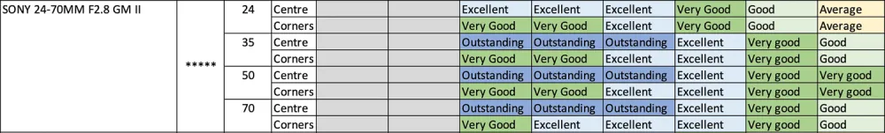
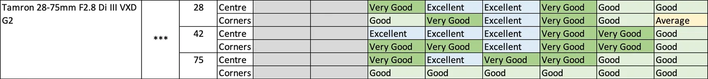
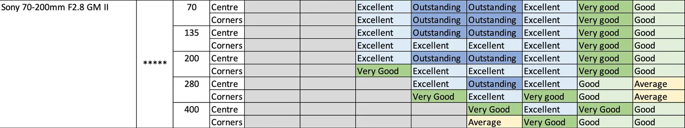
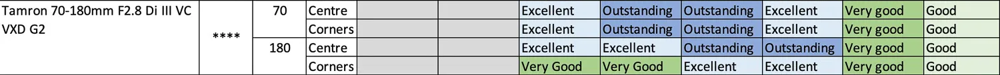
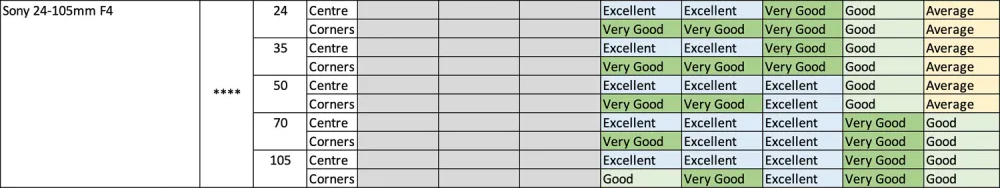
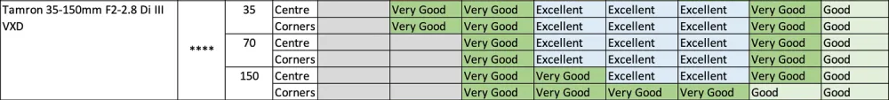
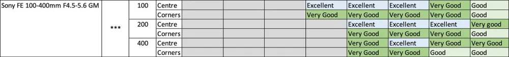
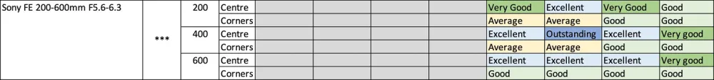
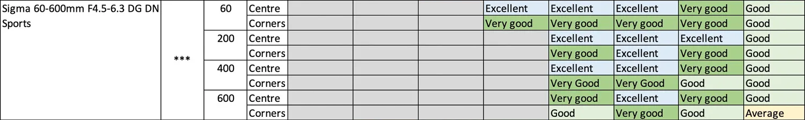
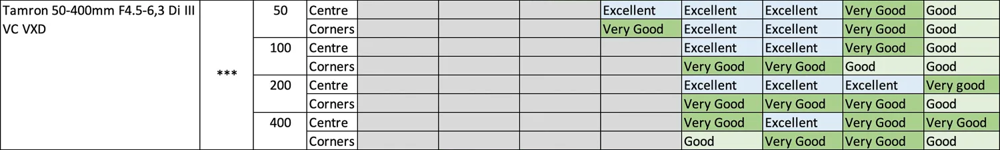

## 公式


- 静态（F4/F8）
  - ISO：档位尽可能小的最大 ISO（50/100, 64/125/400, 80/160/500, 200/640, 250/800, 320/1000）
    - 曝光时间：不超过 1/焦距s
      - 拍照
    - 曝光时间：超过 1/焦距s
      - 3、加长[曝光时间]（锐度可能降低/模糊），<= 1/50s
        - 拍照
      - 2、提高[ISO]（噪点可能明显增加）直到曝光时间不超过阈值， < 3200
        - 拍照
      - 1、加长[曝光时间] + 提高[ISO]
        - 拍照
- 动态（光圈最大）


```
x y
3183 2081
3548 2896
365 815
133225 + 664225 = 797450

7008(pix) / 893(pix) = 7.84(x) * 66.8(m) = 523.71(m)
400000(m/h) = 111.11(m/s)
523.71(m) / 111.11(m/s) = 4.71(s)
4.71(s) / 7008(pix) = 6.72 / 10000 = 1/1488.1(s)

4672(pix) / 893(pix) = 5.23(x) * 66.8(m) = 349.36(m)
400000(m/h) = 111.11(m/s)
349.36(m) / 111.11(m/s) = 3.144(s)
3.144(s) / 4672(pix) = 6.72 / 10000 = 1/1488.1(s)
```


## 焦距-视角

| 焦距(mm) | 视角(°) | tan(/2)  |
| -------- | ------- | -------- |
| 800      | 3°05'   |          |
| 600      | 4°10'   |          |
| 500      | 5°      |          |
| 400      | 6°10'   |          |
| 300      | 8°15'   |          |
| 240      | 10°     |          |
| 200      | 12°     |          |
| 135      | 18°     |          |
| 125      | 19°     |          |
| 105      | 22°     | 0.194380 |
| 100      | 24°     |          |
| 90       | 26°     |          |
| 85       | 28°     |          |
| 80       | 30°     |          |
| 70       | 34°     |          |
| 50       | 46°     |          |
| 35       | 63°     |          |
| 27       | 76°     |          |
| 25       | 75°     |          |
| 24       | 84°     |          |
| 23       | 86°     |          |
| 20       | 94°     |          |
| 18       | 99.5°   |          |
| 17       | 104°    |          |
| 16       | 105.6°  |          |
| 14       | 114°    |          |
| 12       | 120°    |          |
| 11       | 125°    |          |
| 15鱼眼    | 180°    |          |


# A7M4

[A7M4 ISO-Nosie](../pictures/摄影/001.jpg)

[A7M4 视频 ISO 基准](../pictures/摄影/002.png)


# A7R5

## 色调

设置 -> 曝光/颜色 -> 颜色/色调 -> 创意外观

选择适合的滤镜效果（可以调节滤镜参数）

- ST：默认标准，还原真实色彩
- PT：饱和度比ST略高，色彩鲜明，色调不夸张，适用范围广
- NT：满满的电影氛围感，低饱和低对比，记录日常很有感觉
- VV：色彩浓郁，对比度高，适合色彩丰富的场景
- VV2：对比度比VV低，画面更明亮
- FL：胶片感浓郁，很适合树林蓝天等场景，胶片蓝和胶片绿质感出众，拍人像也很优秀
- IN：低饱和低对比，文艺风的福音，自带日系哑光效果，拍摄人像很有氛围感，拍摄花朵也很好看（如图3）
- SH：比IN明亮清新，适合日系小清新风格
- BW：经典黑白色调，明暗对比恰到好处，随手拍大片的即视感
- SE：复古棕色调，适合复古场景，很有格调


## 对焦跟踪

设置 -> 操作自定义 -> 自定义键/转盘设置 -> 后侧1

分配 `设置 -> 对焦 -> 对焦区域 -> 跟踪开启 + AF开启` 给 AF-ON 按钮

拍摄静态物体时，使用 AF-ON 按钮对焦并持续按住，可以移动画面并保持焦点在之前的对焦区域


## 视频

 

| 模式         | 裁切 | 采样        | 读出速度(ms) |
| ------------ | ---- | ----------- | ------------ |
| 4K24P        | 1    | 4.8K 超采样 | 18.6         |
| 4K60P        | 1.24 | 3.8K 欠采样 | 15           |
| S35模式4K24P | 1.52 | 6.3K 超采样 | 30.9         |
| 8K24P        | 1.24 | 7.6K 欠采样 | 38.1         |


# 镜头选购指南与参考

## 索尼

https://sonyalpha.blog/

### **评级说明**

- Outstanding
  - 在这个等级上，您可以充分发挥61Mpix传感器的潜力
  - 即使在具有出色对比度的 100% 裁剪上，一切都很清晰
  - 很少有镜头能在整个画面上达到这个等级
- Excellent
  - 在这个等级上，您可以获得出色的结果，只有与出色的镜头进行比较，您才能看到您可以做得更好一点
  - 该等级将充分利用A1的50Mpix或索尼A42RIII的42Mpix的全部潜力。
  - 该级别的镜头在索尼A7RIV上完全没问题
- Very Good
  - 在这个等级下，你仍然可以得到非常好的结果，但是当观看100%的61Mpix裁剪时，预计会开始出现一些柔和度。
  - 该等级将充分利用A7IV的33Mpix或索尼A7III的24Mpix的全部潜力。
  - 该等级的镜头不足以在任何光圈下利用A7REV，但如果照片中没有大量裁剪，仍然可以提供良好的效果
  - 通常，一些优秀的素数在使用时会属于这一类 全开
- Good
  - 在此等级下，整体观看时图像仍然不错，但在100%下查看时缺乏清晰度。
  - 这些镜头仍然推荐用于A7III，但不建议在A7RIII上使用。
  - 这些镜头不足以用于A7RIV
- Average
  - 当光圈关闭时，这些镜头几乎无法达到非常好的效果，而且通常它们甚至不在整个画面上
  - 这些镜头不足以用于A7RIII，A7RIV
  - 这些镜头在A7III上是可以接受的，但不能利用24Mpix的潜力。
- Bad
  - 当在所有物体（A7III，A7RIII，A7RIV）上以100%查看时，这些结果会很差
  - 只有看电视还行，电脑如果不放大


### 光圈锐度表
























