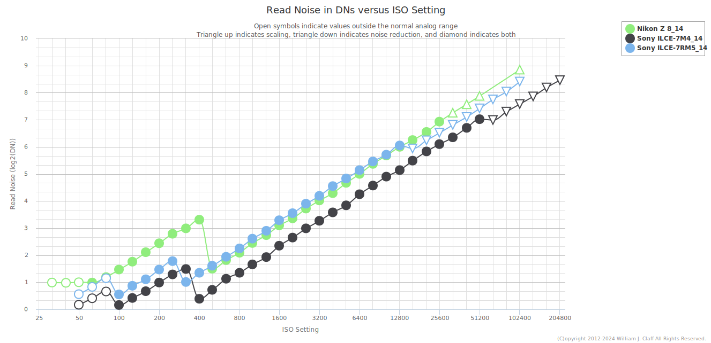
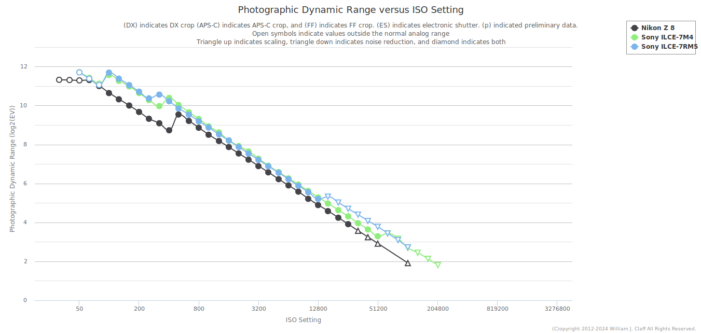
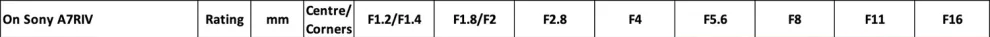

## 公式


- 静态（F4/F8）
  - ISO：档位尽可能小的最大 ISO（50/100, 64/125/400, 80/160/500, 200/640, 250/800, 320/1000）
    - 曝光时间：不超过 1/焦距s
      - 拍照
    - 曝光时间：超过 1/焦距s
      - 3、加长[曝光时间]（锐度可能降低/模糊），<= 1/50s
        - 拍照
      - 2、提高[ISO]（噪点可能明显增加）直到曝光时间不超过阈值， < 3200
        - 拍照
      - 1、加长[曝光时间] + 提高[ISO]
        - 拍照
- 动态（光圈最大）


```
x y
3183 2081
3548 2896
365 815
133225 + 664225 = 797450

7008(pix) / 893(pix) = 7.84(x) * 66.8(m) = 523.71(m)
400000(m/h) = 111.11(m/s)
523.71(m) / 111.11(m/s) = 4.71(s)
4.71(s) / 7008(pix) = 6.72 / 10000 = 1/1488.1(s)

4672(pix) / 893(pix) = 5.23(x) * 66.8(m) = 349.36(m)
400000(m/h) = 111.11(m/s)
349.36(m) / 111.11(m/s) = 3.144(s)
3.144(s) / 4672(pix) = 6.72 / 10000 = 1/1488.1(s)
```


## 焦距-视角

| 焦距(mm) | 视角(°) | tan(/2)  |
| -------- | ------- | -------- |
| 800      | 3°05'   |          |
| 600      | 4°10'   |          |
| 500      | 5°      |          |
| 400      | 6°10'   |          |
| 300      | 8°15'   |          |
| 240      | 10°     |          |
| 200      | 12°     |          |
| 135      | 18°     |          |
| 125      | 19°     |          |
| 105      | 22°     | 0.194380 |
| 100      | 24°     |          |
| 90       | 26°     |          |
| 85       | 28°     |          |
| 80       | 30°     |          |
| 70       | 34°     |          |
| 50       | 46°     |          |
| 35       | 63°     |          |
| 27       | 76°     |          |
| 25       | 75°     |          |
| 24       | 84°     |          |
| 23       | 86°     |          |
| 20       | 94°     |          |
| 18       | 99.5°   |          |
| 17       | 104°    |          |
| 16       | 105.6°  |          |
| 14       | 114°    |          |
| 12       | 120°    |          |
| 11       | 125°    |          |
| 15鱼眼    | 180°    |          |


## 光圈

整档光圈：F1 、F1.4、F2、F2.8、F4、F5.6、F8、F11、F16、F22、F32、F45、F64

- 每档之间的F数值相差 1.4 倍
- 相邻整档光圈通光量相差一倍
- 其它档位为中间档，例如：F3.2、F3.5、F4.5、F5.0、F6.3、F7.1、F9、F10，按照 1/3 档进行步进


| T\Ev\F | 1    | 1.4  | 2    | 2.8  | 4    | 5.6  | 8    | 11   | 16   | 22   | 32   | 45   | 64   |
| ------ | ---- | ---- | ---- | ---- | ---- | ---- | ---- | ---- | ---- | ---- | ---- | ---- | ---- |
| 1      | 0    | 1    | 2    | 3    | 4    | 5    | 6    | 7    | 8    | 9    | 10   | 11   | 12   |
| 1/2    | 1    | 2    | 3    | 4    | 5    | 6    | 7    | 8    | 9    | 10   | 11   | 12   | 13   |
| 1/4    | 2    | 3    | 4    | 5    | 6    | 7    | 8    | 9    | 10   | 11   | 12   | 13   | 14   |
| 1/8    | 3    | 4    | 5    | 6    | 7    | 8    | 9    | 10   | 11   | 12   | 13   | 14   | 15   |
| 1/15   | 4    | 5    | 6    | 7    | 8    | 9    | 10   | 11   | 12   | 13   | 14   | 15   | 16   |
| 1/30   | 5    | 6    | 7    | 8    | 9    | 10   | 11   | 12   | 13   | 14   | 15   | 16   | 17   |
| 1/60   | 6    | 7    | 8    | 9    | 10   | 11   | 12   | 13   | 14   | 15   | 16   | 17   | 18   |
| 1/125  | 7    | 8    | 9    | 10   | 11   | 12   | 13   | 14   | 15   | 16   | 17   | 18   | 19   |
| 1/250  | 8    | 9    | 10   | 11   | 12   | 13   | 14   | 15   | 16   | 17   | 18   | 19   | 20   |
| 1/500  | 9    | 10   | 11   | 12   | 13   | 14   | 15   | 16   | 17   | 18   | 19   | 20   | 21   |
| 1/1000 | 10   | 11   | 12   | 13   | 14   | 15   | 16   | 17   | 18   | 19   | 20   | 21   | 22   |
| 1/2000 | 11   | 12   | 13   | 14   | 15   | 16   | 17   | 18   | 19   | 20   | 21   | 22   | 23   |
| 1/4000 | 12   | 13   | 14   | 15   | 16   | 17   | 18   | 19   | 20   | 21   | 22   | 23   | 24   |
| 1/8000 | 13   | 14   | 15   | 16   | 17   | 18   | 19   | 20   | 21   | 22   | 23   | 24   | 25   |


# A7M4






## Base ISO

| Gamma       | ISO1 | ISO2 |
| ----------- | ---- | ---- |
| 拍照        | 100  | 400  |
| Movie       | 100  | 320  |
| Still       | 100  | 320  |
| ITU709      | 100  | 400  |
| ITU709 800% | 800  | 3200 |
| Cine1       | 80   | 320  |
| Cine2       | 64   | 250  |
| Cine3       | 100  | 400  |
| Cine4       | 125  | 500  |
| S-Log2      | 800  | 3200 |
| S-Log3      | 800  | 3200 |
| HLG         | 125  | 500  |
| HLG1        | 64   | 250  |
| HLG2        | 100  | 400  |
| HLG3        | 125  | 500  |
| S-Cinetone  | 125  | 500  |


# A7R5


## Base ISO


## 色调

设置 -> 曝光/颜色 -> 颜色/色调 -> 创意外观

选择适合的滤镜效果（可以调节滤镜参数）

- ST：默认标准，还原真实色彩
- PT：饱和度比ST略高，色彩鲜明，色调不夸张，适用范围广
- NT：满满的电影氛围感，低饱和低对比，记录日常很有感觉
- VV：色彩浓郁，对比度高，适合色彩丰富的场景
- VV2：对比度比VV低，画面更明亮
- FL：胶片感浓郁，很适合树林蓝天等场景，胶片蓝和胶片绿质感出众，拍人像也很优秀
- IN：低饱和低对比，文艺风的福音，自带日系哑光效果，拍摄人像很有氛围感，拍摄花朵也很好看（如图3）
- SH：比IN明亮清新，适合日系小清新风格
- BW：经典黑白色调，明暗对比恰到好处，随手拍大片的即视感
- SE：复古棕色调，适合复古场景，很有格调


## 对焦跟踪

设置 -> 操作自定义 -> 自定义键/转盘设置 -> 后侧1

分配 `设置 -> 对焦 -> 对焦区域 -> 跟踪开启 + AF开启` 给 AF-ON 按钮

拍摄静态物体时，使用 AF-ON 按钮对焦并持续按住，可以移动画面并保持焦点在之前的对焦区域


## 视频

 

| 模式         | 裁切 | 采样        | 读出速度(ms) |
| ------------ | ---- | ----------- | ------------ |
| 4K24P        | 1    | 4.8K 超采样 | 18.6         |
| 4K60P        | 1.24 | 3.8K 欠采样 | 15           |
| S35模式4K24P | 1.52 | 6.3K 超采样 | 30.9         |
| 8K24P        | 1.24 | 7.6K 欠采样 | 38.1         |


| 机内格式           | XAVC HS | XAVC S         | XAVC S-I       |
| ------------------ | ------- | -------------- | -------------- |
| 编码格式           | H.265   | H.264 帧间压缩 | H.264 帧内压缩 |
| 画质               | 优秀    | 优良           | 最佳           |
| 文件大小           | 较小    | 较小           | 较大           |
| 剪辑对电脑性能要求 | 较高    | 友好           | 友好           |


# 镜头选购指南与参考

## 索尼

https://sonyalpha.blog/

### **评级说明**

- Outstanding
  - 在这个等级上，您可以充分发挥61Mpix传感器的潜力
  - 即使在具有出色对比度的 100% 裁剪上，一切都很清晰
  - 很少有镜头能在整个画面上达到这个等级
- Excellent
  - 在这个等级上，您可以获得出色的结果，只有与出色的镜头进行比较，您才能看到您可以做得更好一点
  - 该等级将充分利用A1的50Mpix或索尼A42RIII的42Mpix的全部潜力。
  - 该级别的镜头在索尼A7RIV上完全没问题
- Very Good
  - 在这个等级下，你仍然可以得到非常好的结果，但是当观看100%的61Mpix裁剪时，预计会开始出现一些柔和度。
  - 该等级将充分利用A7IV的33Mpix或索尼A7III的24Mpix的全部潜力。
  - 该等级的镜头不足以在任何光圈下利用A7REV，但如果照片中没有大量裁剪，仍然可以提供良好的效果
  - 通常，一些优秀的素数在使用时会属于这一类 全开
- Good
  - 在此等级下，整体观看时图像仍然不错，但在100%下查看时缺乏清晰度。
  - 这些镜头仍然推荐用于A7III，但不建议在A7RIII上使用。
  - 这些镜头不足以用于A7RIV
- Average
  - 当光圈关闭时，这些镜头几乎无法达到非常好的效果，而且通常它们甚至不在整个画面上
  - 这些镜头不足以用于A7RIII，A7RIV
  - 这些镜头在A7III上是可以接受的，但不能利用24Mpix的潜力。
- Bad
  - 当在所有物体（A7III，A7RIII，A7RIV）上以100%查看时，这些结果会很差
  - 只有看电视还行，电脑如果不放大


### 光圈锐度表




# 后期

## 调色

品红色(青绿色) - 红色 - 橙色(蓝紫色)

黄绿色(蓝紫色) - 绿色 - 青绿色(紫红色)

青色(橙黄色) - 蓝色 - 紫色(绿黄色)


### 还原

饱和度：所有像素点都增加饱和度

自然饱和度：饱和度不够的像素点增加饱和度

只调整高光部分的饱和度：在校准中调整影响高光的原色的饱和度

1. 提亮暗部：增加阴影、增加黑色，直到和拍摄环境的亮度
2. 调整色温：还原拍摄时的色温，调整色调
3. 增加饱和度：压暗中间灰，增加去除薄雾。颜色分级：降低中间调明亮度
4. 照片美化（继续增加饱和度）：校准中增加红原色和绿原色的饱和度


### 黑金

1. 色相:暖色向橙色靠拢
2. 饱和度:冷色饱和度都去掉
3. 调整冷色的明亮度。
4. 降低曝光，增加清晰度，去除薄雾。


### 青橙

1. 校准面板中色相:将蓝原色降低，
2. 混色器（HSL）中的色相:将暖色向橙色靠拢，将冷色向青色靠拢
3. 明亮度:冷色降低
4. 饱和度:降低
5. 清晰度增加


ACR

高光：局部调整工具，影响画面中最亮的一部分

白色：全局调整工具

阴影：局部调整工具，整体的变化较小

黑色：全局调整工具，变化程度与范围都则明显更大
