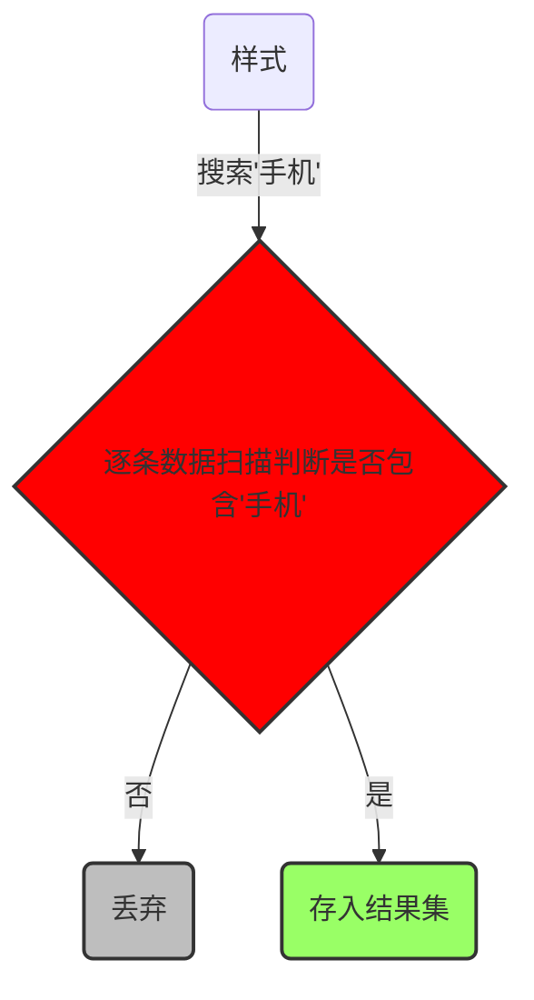
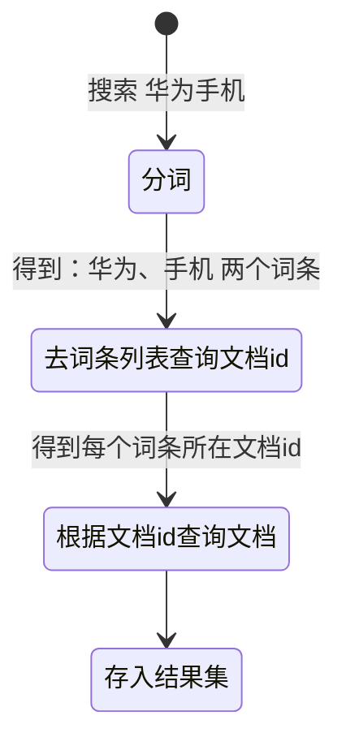

# 服务高可用代理+负载均衡

## HAProxy

 HAProxy 提供高可用性、负载均衡以及基于TCP和HTTP应用的代理，支持虚拟主机，它是免费、快速并且可靠的一种解决方案。HAProxy 特别适用于那些负载特大的web站点，这些站点通常又需要会话保持或七层处理。HAProxy 运行在当前的硬件上，完全可以支持数以万计的并发连接。

[Nginx 与 HAProxy 的区别](https://cloud.tencent.com/developer/article/2124089)

### 安装配置部署管理

[HAproxy 配置详解](https://cloud.tencent.com/developer/article/2034982)

#### 安装

```shell
wget -c https://www.haproxy.org/download/2.8/src/haproxy-2.8.3.tar.gz
sudo tar -zxvf haproxy-2.8.3.tar.gz -C /opt/apps

cd /opt/apps/haproxy-2.8.3
sudo make ARCH=x86_64 TARGET=linux-glibc USE_PCRE=1 USE_OPENSSL=1 USE_ZLIB=1 PREFIX=/opt/apps/haproxy
# ARCH=x86_64 #CPU架构，arch命令查看
# TARGET=linux-glibc #通用linux内核
# USE_PCRE=1 #PCRE支持正则表达式，用于用户请求的uri
# USE_OPENSSL=1 #https，证书
# USE_ZLIB=1 #开启压缩
# USE_SYSTEMD=1 #使用systemd启动haproxy主进程
# USE_CPU_AFFINITY=1 #CPU亲和性，让haproxy指定的进程工作在指定的CPU核心上
# USE_LUA=1 LUA_INC=/usr/local/src/lua-5.3.5/src LUA_LIB=/usr/local/src/lua-5.3.5/src #开启lua，及lua和lua库所在路径
# PREFIX=/opt/apps/haproxy #指定安装路径

sudo make install PREFIX=/opt/apps/haproxy

sudo rm -r /opt/apps/haproxy-2.8.3
```


#### 配置

[/opt/apps/haproxy/haproxy.cfg](../files/config/haproxy.cfg)


#### 创建用户（组）

```shell
sudo groupadd -r apps
sudo useradd -r -g apps -s /bin/false haproxy

sudo mkdir /opt/temp/haproxy/
sudo touch /opt/temp/haproxy/haproxy.pid
sudo mkdir /var/log/haproxy/
sudo chown -R haproxy:root /opt/apps/haproxy
sudo chown -R haproxy:root /opt/temp/haproxy
sudo chown -R haproxy:root /var/log/haproxy
```


#### 服务管理

手动

```shell
# 启动
sudo /opt/apps/haproxy/sbin/haproxy -f /opt/apps/haproxy/haproxy.cfg

ps aux | grep 'haproxy'
# 或者
cat /opt/temp/haproxy/haproxy.pid

sudo kill -9 PID
```


自动

编写[脚本](../files/scripts/server/haproxy.server)文件放在 base_dir 目录下 `/opt/apps/haproxy/haproxy.server`

配置参考 Linux -> 服务管理  -> 系统启动时自动运行服务


启动之后在浏览器打开[链接](http://localhost:15672/)，默认用户名/密码是 geust/geust 。

使用默认的用户 guest / guest （此也为管理员用户）登陆，会发现无法登陆，报错：User can only log in via localhost。那是因为默认是限制了guest用户只能在本机登陆，也就是只能登陆 localhost:15672。可以通过修改配置文件rabbitmq.conf，取消这个限制： loopback_users 这个项就是控制访问的，如果只是取消 guest 用户的话，只需要 loopback_users.guest = false 即可。


## Keepalived

### 简介

[Keepalived 介绍、安装及配置详解](https://blog.csdn.net/Jailman/article/details/128528844)

Keepalived 起初是为 LVS(Linux Virtual Server) 设计的专门用来监控集群系统中各个服务节点的状态如果某个服务节点出现异常或者工作出现故障,Keepalived 将检测到,并将出现故障的服务节点从集群系统中剔除,而在故障节点恢复正常后,Keepalived 又可以自动将该服务节点重新加入集群中，这些工作全部自动完成。这部分功能类似于 Nginx 等反向代理的应用探活功能实现后端服务高可用。
后来又加入了 VRRP(Virtual Router Redundancy Protocol) 的功能，虚拟路由协议出现的目的是为了解决静态路由出现的单点故障问题，通过VRRP可以实现网络不间断稳定运行，因此 Keepalived 一方面具有服务器状态检测和故障隔离功能，另一方面也有 HA cluster 功能；这个功能实现各种中间件高可用。


[debian11 安装 keepalived](https://blog.csdn.net/weixin_44298261/article/details/112056315)

### 安装配置部署管理

#### 安装

[Keepalived for Linux](https://www.keepalived.org/download.html)

```shell
wget -c https://www.keepalived.org/software/keepalived-2.1.5.tar.gz
sudo tar -zxvf keepalived-2.1.5.tar.gz -C /opt/apps/
cd /opt/apps/keepalived-2.1.5
sudo apt update
sudo apt install curl gcc libssl-dev libnl-3-dev libnl-genl-3-dev libsnmp-dev
sudo ./configure --prefix=/opt/apps/keepalived
sudo make
sudo make install
cd .. && sudo rm -r /opt/apps/keepalived-2.1.5
```


#### 配置

[keepalived.conf.sample](../files/config/keepalived.conf.sample)

[keepalived.conf](../files/config/keepalived.conf)

[check_haproxy.sh](../files/scripts/check_haproxy.sh)


主备配置 router_id、vrrp_instance state、priority 应要不同


#### 创建用户（组）

```shell
sudo groupadd -r apps
# sudo useradd -r -g apps -s /bin/false keepalived

sudo mkdir /opt/temp/keepalived/
# sudo chown -R keepalived:root /opt/apps/keepalived
# sudo chown -R keepalived:root /opt/temp/keepalived
sudo chmod +x /opt/apps/keepalived/check_haproxy.sh
```


#### 服务管理

手动

```shell
# 查看启动参数
sudo /opt/apps/keepalived/sbin/keepalived --help
#   -f, --use-file=FILE          Use the specified configuration file
#                                 default '/opt/apps/keepalived/etc/keepalived/keepalived.conf'
#                                      or '/etc/keepalived/keepalived.conf'
#   -P, --vrrp                   Only run with VRRP subsystem
#   -C, --check                  Only run with Health-checker subsystem
#       --all                    Force all child processes to run, even if have no configuration
#   -l, --log-console            Log messages to local console
#   -D, --log-detail             Detailed log messages
#   -S, --log-facility=([0-7]|local[0-7]|user|daemon)
#                                Set syslog facility to LOG_LOCAL[0-7], user or daemon (default)
#   -G, --no-syslog              Don't log via syslog
#   -u, --umask=MASK             umask for file creation (in numeric form)
#   -X, --release-vips           Drop VIP on transition from signal.
#   -V, --dont-release-vrrp      Don't remove VRRP VIPs and VROUTEs on daemon stop
#   -I, --dont-release-ipvs      Don't remove IPVS topology on daemon stop
#   -R, --dont-respawn           Don't respawn child processes
#   -n, --dont-fork              Don't fork the daemon process
#   -d, --dump-conf              Dump the configuration data
#   -p, --pid=FILE               Use specified pidfile for parent process
#   -r, --vrrp_pid=FILE          Use specified pidfile for VRRP child process
#   -T, --genhash                Enter into genhash utility mode (this should be the first option used).
#   -c, --checkers_pid=FILE      Use specified pidfile for checkers child process
#   -a, --address-monitoring     Report all address additions/deletions notified via netlink
#   -s, --namespace=NAME         Run in network namespace NAME (overrides config)
#   -m, --core-dump              Produce core dump if terminate abnormally
#   -M, --core-dump-pattern=PATN Also set /proc/sys/kernel/core_pattern to PATN (default 'core')
#   -e, --all-config             Error if any configuration file missing (same as includet)
#   -i, --config-id id           Skip any configuration lines beginning '@' that don't match id
#                                 or any lines beginning @^ that do match.
#                                 The config-id defaults to the node name if option not used
#       --signum=SIGFUNC         Return signal number for STOP, RELOAD, DATA, STATS, STATS_CLEAR
#   -t, --config-test[=LOG_FILE] Check the configuration for obvious errors, output to
#                                 stderr by default
#   -v, --version                Display the version number
#   -h, --help                   Display this help message
  
# 启动
bash /opt/apps/keepalived/sbin/keepalived -f /opt/apps/keepalived/etc/keepalived/keepalived.conf -p /opt/temp/keepalived/keepalived.pid -r /opt/temp/keepalived/keepalived.vrrp.pid -D -S 0

ps aux | grep 'keepalived'
# 或者
cat /opt/temp/keepalived/keepalived.pid

sudo kill -9 PID

# 日志
sudo cat /var/log/local.0.log
sudo cat /var/log/user.log
sudo cat /var/log/daemon.log
```


自动

编写[脚本](../files/scripts/server/keepalived.server)文件放在 base_dir 目录下 `/opt/apps/keepalived/keepalived.server`

配置参考 Linux -> 服务管理  -> 系统启动时自动运行服务


# Redis

## 安装配置部署管理

### 安装

先从 redis [官网](https://redis.io/download/)下载 tar.gz 包

```shell
# 先从 redis [官网](https://redis.io//)下载 tar.gz 包
wget -c https://download.redis.io/releases/redis-6.0.8.tar.gz
tar -zxvf redis-6.0.8.tar.gz -C /opt/apps/
sudo mv /opt/apps/redis-6.0.8 /opt/apps/redis
cd /opt/apps/redis
# 编译
sudo make
# 安装
cd src
sudo make install PREFIX=/opt/apps/redis
# 如果出现 /bin/sh: 1: pkg-config: not found
# 则 sudo apt install pkg-config
```


### 配置

conf/redis.conf

```properties
# 命令行模式搜索 :/关键词
# 配置redis为后台启动
daemonize yes
# 注释掉下面这个配置让其它主机能访问本机redis
bind 127.0.0.1
# 配置为no让其它主机的redis-cli能访问本机redis
protected-mode no
# 配置密码
# 在 SECURITY 下添加
requirepass 123456
# 数据库备份文件存放目录
dir /opt/data/redis/
# 在dir目录生成appendonly.aof文件，将每一次写操作请求都追加到appendonly.aof 文件中
appendonly yes
# 日志文件
logfile /var/log/redis/redis.log
# pid 文件
pidfile /opt/temp/redis/redis.pid
```


### 创建用户（组）

```shell
sudo groupadd -r apps
sudo useradd -r -g apps -s /bin/false redis

sudo mkdir /opt/data/redis
sudo mkdir /opt/temp/redis
sudo mkdir /var/log/redis
sudo chown -R redis:root /opt/apps/redis
sudo chown -R redis:root /opt/data/redis
sudo chown -R redis:root /opt/temp/redis
sudo chown -R redis:root /var/log/redis
```


### 服务管理

手动

```sh
# 启动redis
redis-server /opt/apps/redis/conf/redis.conf 
# 使用redis-cli客户端检测连接
# 需要输入中文时加参数 --raw
# -h:主机
# -p:端口
# -a:密码
redis-cli -h localhost -p 6379 --raw
$ auth xxxxxx
# 停止redis
redis-cli -a 123456 shutdown
# 或
kill -9 PID
# 检测后台进程是否存在
ps -ef |grep redis
# 检测6379端口是否在监听
ss -apnl | grep 6379
```


编写[脚本](../files/scripts/server/redis.server)文件放在 base_dir 目录下 `/opt/apps/redis/redis.server`

配置参考 Linux -> 服务管理  -> 系统启动时自动运行服务


Windows 连接 Redis 没有官方的工具

[Windows 非官方连接 Redis 工具](https://github.com/tporadowski/redis/releases)


## 集群


### 主从模式

特点

- 主数据库可以进行读写操作，当读写操作导致数据变化时会自动将数据同步给从数据库 
- 从数据库一般都是只读的，并且接收主数据库同步过来的数据 
- 一个master可以拥有多个slave，但是一个slave只能对应一个master 
- slave挂了不影响其他slave的读和master的读和写，重新启动后会将数据从master同步过来 
- master挂了以后，不影响slave的读，但redis不再提供写服务，master重启后redis将重新对外提供写服务 
- master挂了以后，不会在slave节点中重新选一个master


#### 环境准备

准备三台redis，并按单机安装好

192.168.31.158

192.168.31.6

192.168.31.166


#### master

```sh
# vim redis.conf

requirepass 123456              #设置master连接密码，slave可省略
```


#### slave

```sh
#redis.conf
masterauth 123456               #slave连接master密码，master可省略
replicaof 192.168.31.158 6379
```


#### 启动

启动所有redis即可


#### 查看集群状态

mater

```sh
localhost:6379> info replication
# Replication
role:master
connected_slaves:2
slave0:ip=192.168.31.6,port=6379,state=online,offset=42,lag=1
slave1:ip=192.168.31.166,port=6379,state=online,offset=42,lag=0
master_replid:0ba44d160b1fcb968f2e19a90445a88f0895db0a
master_replid2:0000000000000000000000000000000000000000
master_repl_offset:42
second_repl_offset:-1
repl_backlog_active:1
repl_backlog_size:1048576
repl_backlog_first_byte_offset:1
repl_backlog_histlen:42
```

slave

```sh
localhost:6379> info replication
# Replication
role:slave
master_host:192.168.31.158
master_port:6379
master_link_status:up
master_last_io_seconds_ago:1
master_sync_in_progress:0
slave_repl_offset:28
slave_priority:100
slave_read_only:1
connected_slaves:0
master_replid:0ba44d160b1fcb968f2e19a90445a88f0895db0a
master_replid2:0000000000000000000000000000000000000000
master_repl_offset:28
second_repl_offset:-1
repl_backlog_active:1
repl_backlog_size:1048576
repl_backlog_first_byte_offset:1
repl_backlog_histlen:28
```


在master节点写入的数据，很快就同步到slave节点上，而且在slave节点上无法写入数据


### Sentinel模式

特点

- sentinel模式是建立在主从模式的基础上，如果只有一个Redis节点，sentinel就没有任何意义 
- 当master挂了以后，sentinel会在slave中选择一个做为master，并修改它们的配置文件，其他slave的配置文件也会被修改，比如slaveof属性会指向新的master 
- 当master重新启动后，它将不再是master而是做为slave接收新的master的同步数据 
- sentinel因为也是一个进程有挂掉的可能，所以sentinel也会启动多个形成一个sentinel集群 
- 多sentinel配置的时候，sentinel之间也会自动监控 
- 当主从模式配置密码时，sentinel也会同步将配置信息修改到配置文件中，不需要担心 
- 一个sentinel或sentinel集群可以管理多个主从Redis，多个sentinel也可以监控同一个redis 
- sentinel最好不要和Redis部署在同一台机器，不然Redis的服务器挂了以后，sentinel也挂了

工作机制

- 每个sentinel以每秒钟一次的频率向它所知的master，slave以及其他sentinel实例发送一个 PING 命令  

- 如果一个实例距离最后一次有效回复 PING 命令的时间超过 down-after-milliseconds 选项所指定的值， 则这个实例会被sentinel标记为主观下线。  
- 如果一个master被标记为主观下线，则正在监视这个master的所有sentinel要以每秒一次的频率确认master的确进入了主观下线状态 
- 当有足够数量的sentinel（大于等于配置文件指定的值）在指定的时间范围内确认master的确进入了主观下线状态， 则master会被标记为客观下线  
- 在一般情况下， 每个sentinel会以每 10 秒一次的频率向它已知的所有master，slave发送 INFO 命令  
- 当master被sentinel标记为客观下线时，sentinel向下线的master的所有slave发送 INFO 命令的频率会从 10 秒一次改为 1 秒一次  
- 若没有足够数量的sentinel同意master已经下线，master的客观下线状态就会被移除；  若master重新向sentinel的 PING 命令返回有效回复，master的主观下线状态就会被移除


#### 环境准备

安装并配置好redis为主从集群

master-192.168.31.158

slave-192.168.31.6

slave-192.168.31.166


#### 配置sentinel

每个redis的sentinel配置如下

```properties
# vim /opt/latest/redis/conf/sentinel.conf
daemonize yes
logfile "/var/log/redis/sentinel.log"
# sentinel工作目录
# mkdir /opt/data/redis/sentinel
dir "/opt/data/redis/sentinel"
# 判断master失效至少需要2个sentinel同意，建议设置为n/2+1，n为sentinel个数
sentinel monitor cluster_master 192.168.31.158 6379 2
sentinel auth-pass cluster_master 123456
# 判断master主观下线时间，默认30s
sentinel down-after-milliseconds cluster_master 30000
```


#### 启动

先启动redis再启动sentinel

```sh
redis-sentinel /opt/latest/redis/conf/sentinel.conf
```


```sh
# tail /var/log/redis/sentinel.log
771:X 18 Oct 2020 17:48:29.223 # Sentinel ID is d32ed4a00783925dadd9d595c8d10defbd8a2408
771:X 18 Oct 2020 17:48:29.223 # +monitor master mymaster 192.168.31.158 6379 quorum 2
771:X 18 Oct 2020 17:48:29.224 * +slave slave 192.168.31.6:6379 192.168.31.6 6379 @ mymaster 192.168.31.158 6379
771:X 18 Oct 2020 17:48:29.271 * +slave slave 192.168.31.166:6379 192.168.31.166 6379 @ mymaster 192.168.31.158 6379
771:X 18 Oct 2020 17:48:33.816 * +sentinel sentinel d58ab4765cb67d70eaa25a79e39144811a53e50f 192.168.31.6 26379 @ mymaster 192.168.31.158 6379
771:X 18 Oct 2020 17:48:36.398 * +sentinel sentinel 90f2f21dc115bc849c3df0abb3728aca9051445d 192.168.31.166 26379 @ mymaster 192.168.31.158 6379

```


#### master宕机演示

关闭master 

redis-cli -a 123456 shutdown

从日志中可以看到，master已经从192.168.31.156转移到192.168.31.6上

```sh
# tail /var/log/redis/sentinel.log
771:X 18 Oct 2020 17:51:46.023 # +new-epoch 1
771:X 18 Oct 2020 17:51:46.023 # +try-failover master mymaster 192.168.31.158 6379
771:X 18 Oct 2020 17:51:46.069 # +vote-for-leader d32ed4a00783925dadd9d595c8d10defbd8a2408 1
771:X 18 Oct 2020 17:51:46.070 # d58ab4765cb67d70eaa25a79e39144811a53e50f voted for d58ab4765cb67d70eaa25a79e39144811a53e50f 1
771:X 18 Oct 2020 17:51:46.099 # 90f2f21dc115bc849c3df0abb3728aca9051445d voted for d58ab4765cb67d70eaa25a79e39144811a53e50f 1
771:X 18 Oct 2020 17:51:46.385 # +config-update-from sentinel d58ab4765cb67d70eaa25a79e39144811a53e50f 192.168.31.6 26379 @ mymaster 192.168.31.158 6379
771:X 18 Oct 2020 17:51:46.385 # +switch-master mymaster 192.168.31.158 6379 192.168.31.6 6379
771:X 18 Oct 2020 17:51:46.385 * +slave slave 192.168.31.166:6379 192.168.31.166 6379 @ mymaster 192.168.31.6 6379
771:X 18 Oct 2020 17:51:46.385 * +slave slave 192.168.31.158:6379 192.168.31.158 6379 @ mymaster 192.168.31.6 6379
771:X 18 Oct 2020 17:52:16.386 # +sdown slave 192.168.31.158:6379 192.168.31.158 6379 @ mymaster 192.168.31.6 6379
```


#### Sentinel模式下的几个事件

```
+reset-master ：主服务器已被重置。
+slave ：一个新的从服务器已经被 Sentinel 识别并关联。
+failover-state-reconf-slaves ：故障转移状态切换到了 reconf-slaves 状态。
+failover-detected ：另一个 Sentinel 开始了一次故障转移操作，或者一个从服务器转换成了主服务器。
+slave-reconf-sent ：领头（leader）的 Sentinel 向实例发送了 [SLAVEOF](/commands/slaveof.html) 命令，为实例设置新的主服务器。
+slave-reconf-inprog ：实例正在将自己设置为指定主服务器的从服务器，但相应的同步过程仍未完成。
+slave-reconf-done ：从服务器已经成功完成对新主服务器的同步。
-dup-sentinel ：对给定主服务器进行监视的一个或多个 Sentinel 已经因为重复出现而被移除 —— 当 Sentinel 实例重启的时候，就会出现这种情况。
+sentinel ：一个监视给定主服务器的新 Sentinel 已经被识别并添加。
+sdown ：给定的实例现在处于主观下线状态。
-sdown ：给定的实例已经不再处于主观下线状态。
+odown ：给定的实例现在处于客观下线状态。
-odown ：给定的实例已经不再处于客观下线状态。
+new-epoch ：当前的纪元（epoch）已经被更新。
+try-failover ：一个新的故障迁移操作正在执行中，等待被大多数 Sentinel 选中（waiting to be elected by the majority）。
+elected-leader ：赢得指定纪元的选举，可以进行故障迁移操作了。
+failover-state-select-slave ：故障转移操作现在处于 select-slave 状态 —— Sentinel 正在寻找可以升级为主服务器的从服务器。
no-good-slave ：Sentinel 操作未能找到适合进行升级的从服务器。Sentinel 会在一段时间之后再次尝试寻找合适的从服务器来进行升级，又或者直接放弃执行故障转移操作。
selected-slave ：Sentinel 顺利找到适合进行升级的从服务器。
failover-state-send-slaveof-noone ：Sentinel 正在将指定的从服务器升级为主服务器，等待升级功能完成。
failover-end-for-timeout ：故障转移因为超时而中止，不过最终所有从服务器都会开始复制新的主服务器（slaves will eventually be configured to replicate with the new master anyway）。
failover-end ：故障转移操作顺利完成。所有从服务器都开始复制新的主服务器了。
+switch-master ：配置变更，主服务器的 IP 和地址已经改变。 这是绝大多数外部用户都关心的信息。
+tilt ：进入 tilt 模式。
-tilt ：退出 tilt 模式。
```


### Cluster模式

sentinel模式基本可以满足一般生产的需求，具备高可用性。但是当数据量过大到一台服务器存放不下的情况时，主从模式或sentinel模式就不能满足需求了，这个时候需要对存储的数据进行分片，将数据存储到多个Redis实例中。cluster模式的出现就是为了解决单机Redis容量有限的问题，将Redis的数据根据一定的规则分配到多台机器。

cluster可以说是sentinel和主从模式的结合体，通过cluster可以实现主从和master重选功能，所以如果配置两个副本三个分片的话，就需要六个Redis实例。因为Redis的数据是根据一定规则分配到cluster的不同机器的，当数据量过大时，可以新增机器进行扩容。

使用集群，只需要将redis配置文件中的`cluster-enable`配置打开即可。每个集群中至少需要三个主数据库才能正常运行，新增节点非常方便。

特点

- 多个redis节点网络互联，数据共享 
- 所有的节点都是一主一从（也可以是一主多从），其中从不提供服务，仅作为备用 
- 不支持同时处理多个key（如MSET/MGET），因为redis需要把key均匀分布在各个节点上，  并发量很高的情况下同时创建key-value会降低性能并导致不可预测的行为   
- 支持在线增加、删除节点 
- 客户端可以连接任何一个主节点进行读写


#### 环境准备

准备6台机器

192.168.31.158:7001

192.168.31.158:7002

192.168.31.6:7003

192.168.31.6:7004

192.168.31.166:7005

192.168.31.166:7006


#### 配置

```properties
# vim /opt/latest/redis/conf/redis_cluster_7001.conf
bind 192.168.30.128
port 7001
daemonize yes
pidfile "/var/run/redis_7001.pid"
logfile "/var/log/redis/redis_7001.log"
dir "/opt/data/redis/cluster/7001"
#replicaof 192.168.31.158 6379
masterauth 123456
requirepass 123456
appendonly yes
cluster-enabled yes
cluster-config-file nodes-7001.conf
cluster-node-timeout 15000
```

其它机器配置与此一致，port、bind、file根据机器修改

#### 启动

将所有机器的redis启动

```sh
redis-server /opt/latest/redis/conf/redis_cluster_7001.conf
```


#### 创建集群

```sh
redis-cli -a 123456 --cluster create 192.168.31.158:7001 192.168.31.158:7002 192.168.31.6:7003 192.168.31.6:7004 192.168.31.166:7005 192.168.31.166:7006 --cluster-replicas 1

Warning: Using a password with '-a' or '-u' option on the command line interface may not be safe.
>>> Performing hash slots allocation on 6 nodes...
Master[0] -> Slots 0 - 5460
Master[1] -> Slots 5461 - 10922
Master[2] -> Slots 10923 - 16383
Adding replica 192.168.31.6:7004 to 192.168.31.158:7001
Adding replica 192.168.31.166:7006 to 192.168.31.6:7003
Adding replica 192.168.31.158:7002 to 192.168.31.166:7005
M: f15bdfcd4b2040032891f0afa3cc1d4a2e0de839 192.168.31.158:7001
   slots:[0-5460] (5461 slots) master
S: 1f0d055b6db9768862d89b3604de680c9e92d648 192.168.31.158:7002
   replicates 39c1054b33b3cb39eaa984e2f91d5ab047241d7e
M: 1a60cc7b1df0dfe347489c553183c682a117437b 192.168.31.6:7003
   slots:[5461-10922] (5462 slots) master
S: 373134949e7bde96648217c9f225a45e1e2d2c27 192.168.31.6:7004
   replicates f15bdfcd4b2040032891f0afa3cc1d4a2e0de839
M: 39c1054b33b3cb39eaa984e2f91d5ab047241d7e 192.168.31.166:7005
   slots:[10923-16383] (5461 slots) master
S: b683b4b39241a66f177b31a902c95d88594daea2 192.168.31.166:7006
   replicates 1a60cc7b1df0dfe347489c553183c682a117437b
Can I set the above configuration? (type 'yes' to accept): yes
>>> Nodes configuration updated
>>> Assign a different config epoch to each node
>>> Sending CLUSTER MEET messages to join the cluster
Waiting for the cluster to join

```


自动生成配置文件

```sh
# vim /opt/data/redis/cluster/7001/nodes-7001.conf

39c1054b33b3cb39eaa984e2f91d5ab047241d7e 192.168.31.166:7005@17005 master - 0 1603115418000 5 connected 10923-16383
f15bdfcd4b2040032891f0afa3cc1d4a2e0de839 192.168.31.158:7001@17001 myself,master - 0 1603115417000 1 connected 0-5460
373134949e7bde96648217c9f225a45e1e2d2c27 192.168.31.6:7004@17004 slave f15bdfcd4b2040032891f0afa3cc1d4a2e0de839 0 1603115417000 1 connected
1a60cc7b1df0dfe347489c553183c682a117437b 192.168.31.6:7003@17003 master - 0 1603115419201 3 connected 5461-10922
1f0d055b6db9768862d89b3604de680c9e92d648 192.168.31.158:7002@17002 slave 39c1054b33b3cb39eaa984e2f91d5ab047241d7e 0 1603115418195 5 connected
b683b4b39241a66f177b31a902c95d88594daea2 192.168.31.166:7006@17006 slave 1a60cc7b1df0dfe347489c553183c682a117437b 0 1603115418000 W3 connected
vars currentEpoch 6 lastVoteEpoch 0
```


#### 集群操作

```sh
# 登陆集群
redis-cli -c -h 192.168.31.158 -p 7001 -a 123456
# 查看集群信息
192.168.31.158:7001> CLUSTER INFO
# 列出节点信息
192.168.31.158:7001> CLUSTER NODES
# 增加节点,新加入节点要先配置
192.168.31.158:7001> CLUSTER MEET 192.168.31.130 7007
# 将新增的192.168.31.130:7007节点身份改为192.168.31.158:7001的slave
redis-cli -c -h 192.168.31.130 -p 7007 -a 123456 cluster replicate f15bdfcd4b2040032891f0afa3cc1d4a2e0de839
# 也可以登入节点更改
192.168.31.130:7007> CLUSTER REPLICATE f15bdfcd4b2040032891f0afa3cc1d4a2e0de839
# 删除节点
# 不能删除自己的master节点
# 可以删除其它的master节点
# 可以删除其它的slave节点
192.168.31.130:7007> CLUSTER FORGET f15bdfcd4b2040032891f0afa3cc1d4a2e0de839
# 如果没有删除节点配置文件执行以下指令恢复被被删除节点
192.168.31.130:7007> CLUSTER SAVECONFIG 
```


## 操作

```shell
# 选择第一个数据库（默认为0）
SELECT 0
# 查看当前数据库下的所有键值对
KEYS *
```


# Zookeeper

## 操作


## 单机

### 安装

打[开zookeeper下载页面](https://zookeeper.apache.org/releases.html)选择一个版本下载。

将下载好的文件解压到/opt/zookeeper目录下

```sh
tar -zxvf apache-zookeeper-3.6.1-bin.tar.gz -C /opt/zookeeper/
```

创建软连接

```shell
ln -s /opt/zookeeper/apache-zookeeper-3.6.1-bin /opt/zookeeper/zookeeper
```

### 配置

复制/opt/zookeeper/zookeeper/conf/zoo_sample.cfg为/opt/zookeeper/zookeeper/conf/zoo.cfg并修改为如下

```properties
# The number of milliseconds of each tick
# 服务器心跳时间
tickTime=2000
# The number of ticks that the initial 
# synchronization phase can take
# 投票选举新Leader的初始化时间
initLimit=10
# The number of ticks that can pass between 
# sending a request and getting an acknowledgement
syncLimit=5
# the directory where the snapshot is stored.
# do not use /tmp for storage, /tmp here is just 
# example sakes.
# 数据目录(需要自己新建)
# dataDir=/tmp/zookeeper
dataDir=/opt/zookeeper/data
# 日志目录(需要自己新建)
dataLogDir=/var/log/zookeeper
# the port at which the clients will connect
# 对外服务端口
clientPort=2181
# the maximum number of client connections.
# increase this if you need to handle more clients
#maxClientCnxns=60
#
# Be sure to read the maintenance section of the 
# administrator guide before turning on autopurge.
#
# http://zookeeper.apache.org/doc/current/zookeeperAdmin.html#sc_maintenance
#
# The number of snapshots to retain in dataDir
#autopurge.snapRetainCount=3
# Purge task interval in hours
# Set to "0" to disable auto purge feature
#autopurge.purgeInterval=1

## Metrics Providers
#
# https://prometheus.io Metrics Exporter
#metricsProvider.className=org.apache.zookeeper.metrics.prometheus.PrometheusMetricsProvider
#metricsProvider.httpPort=7000
#metricsProvider.exportJvmInfo=true
```


### 创建文件夹&添加用户

```sh
sudo mkdir /opt/zookeeper/data
sudo mkdir /var/log/zookeeper

sudo groupadd -r appgroup
sudo useradd -r -g appgroup -s /bin/bash mysql
sudo passwd zookeeper
chown -R zookeeper:appgroup /opt/zookeeper
chown -R zookeeper:appgroup /var/log/zookeeper
```


### 启动

执行/opt/zookeeper/zookeeper/bin/zkServer.sh

```shell
Usage: zkServer.sh [--config <conf-dir>] {start|start-foreground|stop|version|restart|status|print-cmd}
```

```shell
# 启动
su zookeeper
zookeeper@server-1:/opt/zookeeper/zookeeper/bin$ ./zkServer.sh start
ZooKeeper JMX enabled by default
Using config: /opt/zookeeper/zookeeper/bin/../conf/zoo.cfg
Starting zookeeper ... STARTED 
# 查看zookeeper是否启动
zookeeper@server-1:/opt/zookeeper/zookeeper/bin$ jps -l
733 sun.tools.jps.Jps
685 org.apache.zookeeper.server.quorum.QuorumPeerMain
# 如果jps -l没有看到zookeeper则查看logs目录下输出的日志
```


## 集群

### 环境准备

准备三台机器

ip地址如下

server-1:192.168.31.158

server-2:192.168.31.6

server-3:192.168.31.166

### 配置

在zookeeper的data目录下新建myid文件内容分别为0,1,2。这个文件就是记录每个服务器的ID

/opt/zookeeper/zookeeper/conf/zoo.cfg比单机的配置多如下内容

```properties
# server.服务器ID=服务器IP地址:服务器之间通信端口:服务器之间投票选举端口
server.0=192.168.31.158:2888:3888
server.1=192.168.31.6:2888:3888
server.2=192.168.31.166:2888:3888
```

### 启动

/opt/zookeeper/zookeeper/bin/zkServer.sh start

分别启动每个zookeeper，启动后查询一下运行状态

```shell
zookeeper@server-1:~$ /opt/latest/zookeeper/bin/zkServer.sh start
ZooKeeper JMX enabled by default
Using config: /opt/latest/zookeeper/bin/../conf/zoo.cfg
Starting zookeeper ... STARTED

zookeeper@server-1:~$ /opt/latest/zookeeper/bin/zkServer.sh status
ZooKeeper JMX enabled by default
Using config: /opt/latest/zookeeper/bin/../conf/zoo.cfg
Client port found: 2181. Client address: localhost.
Mode: leader
```

```shell
zookeeper@server-2:~$ /opt/latest/zookeeper/bin/zkServer.sh start
ZooKeeper JMX enabled by default
Using config: /opt/latest/zookeeper/bin/../conf/zoo.cfg
Starting zookeeper ... STARTED

zookeeper@server-2:~$ /opt/latest/zookeeper/bin/zkServer.sh status
ZooKeeper JMX enabled by default
Using config: /opt/latest/zookeeper/bin/../conf/zoo.cfg
Client port found: 2181. Client address: localhost.
Mode: follower
```

```shell
zookeeper@server-3:~$ /opt/latest/zookeeper/bin/zkServer.sh start
ZooKeeper JMX enabled by default
Using config: /opt/latest/zookeeper/bin/../conf/zoo.cfg
Starting zookeeper ... STARTED

zookeeper@server-3:~$ /opt/latest/zookeeper/bin/zkServer.sh status
ZooKeeper JMX enabled by default
Using config: /opt/latest/zookeeper/bin/../conf/zoo.cfg
Client port found: 2181. Client address: localhost.
Mode: follower
```


# MQ

## 简介

### 概述

MQ 全称 Message Queue（消息队列），是在消息的传输过程中保存消息的容器/中间件。

分布式系统通信两种方式：直接远程调用和借助第三方完成间接通信，MQ 属于后者，多用于分布式系统之间进
行通信。

发送方称为生产者，接收方称为消费者。


### 优势

- 应用解耦：提高系统容错性和可维护性
- 异步提速：提升用户体验和系统吞吐量
- 削峰填谷：提高系统稳定性


### **劣势**

- 系统可用性降低：系统引入的外部依赖越多，系统稳定性越差。一旦 MQ 宕机，就会对业务造成影响。如何保证MQ的高可用？
- 系统复杂度提高：MQ 的加入大大增加了系统的复杂度，以前系统间是同步的远程调用，现在是通过 MQ 进行异步调用。如何保证消息没有被重复消费？怎么处理消息丢失情况？那么保证消息传递的顺序性？
- 一致性问题：A 系统处理完业务，通过 MQ 给 B、C、D 三个系统发消息数据，如果 B 系统 C 系统处理成功，D 系统处理
  失败。如何保证消息数据处理的一致性？


### 使用条件

既然 MQ 有优势也有劣势，那么使用 MQ 需要满足什么条件呢？

- 生产者不需要从消费者处获得反馈。引入消息队列之前的直接调用，其接口的返回值应该为空，这才让明
  明下层的动作还没做，上层却当成动作做完了继续往后走，即所谓异步成为了可能。
- 容许短暂的不一致性。
- 确实是用了有效果。即解耦、提速、削峰这些方面的收益，超过加入MQ，管理MQ这些成本。


### 应用场景

- 异步处理。把消息放入消息中间件中，等到需要的时候再去处理。
- 流量削峰。例如秒杀活动，在短时间内访问量急剧增加，使用消息队列，当消息队列满了就拒绝响应，跳转到错误页面，这样就可以使得系统不会因为超负载而崩溃。
- 日志处理
- 应用解耦。假设某个服务A需要给许多个服务（B、C、D）发送消息，当某个服务（例如B）不需要发送消息了，服务A需要改代码再次部署；当新加入一个服务（服务E）需要服务A的消息的时候，也需要改代码重新部署；另外服务A也要考虑其他服务挂掉，没有收到消息怎么办？要不要重新发送呢？是不是很麻烦，使用 MQ 发布订阅模式，服务A只生产消息发送到 MQ，B、C、D 从 MQ 中读取消息，需要 A 的消息就订阅，不需要了就取消订阅，服务 A 不再操心其他的事情，使用这种方式可以降低服务或者系统之间的耦合。


### 常见的 MQ

​		目前业界有很多的 MQ 产品，例如 RabbitMQ、RocketMQ、ActiveMQ、Kafka、 ZeroMQ、MetaMq 等也有直接使用 Redis 充当消息队列的案例，而这些消息队列产品，各有侧重，在实际选型时，需要结合自身需求及 MQ 产品特征，综合考虑。

|                | RabbitMQ                                                     | ActiveMQ                                 | RocketMQ                  | Kafka                                               |
| -------------- | ------------------------------------------------------------ | ---------------------------------------- | ------------------------- | --------------------------------------------------- |
| 公司/社区      | Rabbit                                                       | Apache                                   | 阿里                      | Apache                                              |
| 开发语言       | Erlang                                                       | Java                                     | Java                      | Scala&Java                                          |
| 协议支持       | AMQP、XMPP、SMTP、STOMP                                      | OpenWire、STOMP、REST、XMPP、AMQP        | 自定义                    | 自定义协议，社区封装了 HTTP 协议支持                |
| 客户端支持语言 | 官方支持 Erlang，Java,Ruby 等,社区产出多种 API，几乎支持所有语言 | Java，C，C++，Python，PHP，Perl，.net 等 | Java，C++（不成熟）       | 官方支持  Java，社区产出多种 API，如 PHP，Python 等 |
| 单机吞吐量     | 万级（其次）                                                 | 万级（最差）                             | 十万级（最好）            | 十万级（次之）                                      |
| 消息延迟       | 微秒级                                                       | 毫秒级                                   | 毫秒级                    | 毫秒以内                                            |
| 功能特性       | 并发能力强，性能极其好延时低，社区活跃，管理界面丰富。       | 老牌产品，成熟度高文档较多               | MQ 功能比较完备，扩展性佳 | 只支持主要的 MQ 功能毕竟是为大数据领域准备的。      |


### JMS

- JMS 即 Java 消息服务(JavaMessage Service) 应用程序接口，是一个 Java 平台中关于面向消息中间件的 API
- JMS 是 JavaEE 规范中的一种，类比 JDBC
- 很多消息中间件都实现了 JMS 规范，例如：ActiveMQ。RabbitMQ 官方没有提供 JMS 的实现包，但是开源社区有


## RabbitMQ

​		2007年，Rabbit 技术公司基于AMQP 标准开发的 RabbitMQ 1.0 发布。RabbitMQ 采用 Erlang 语言开发Erlang 语言由 Ericson 设计，专门为开发高并发和分布式系统的一种语言，在电信领域使用广泛。

### 概述

#### RabbitMQ 的特点

- 开源、性能优秀，稳定性保障
- 提供可靠性消息投递模式、返回模式
- 与 Spring AMQP 完美整合，API 丰富
- 集群模式丰富，表达式配置，HA 模式，镜像队列模型
- 保证数据不丢失的前提做到高可靠性、可用性


#### AMQP

​		AMQP，即 Advanced Message Queuing Protocol（高级消息队列协议），是一个网络协议，具有现代特征的二进制协议，是应用层协议的一个开放标准，为面向消息的中间件设计。基于此协议的客户端与消息中间件可传递消息，并不受客户端/中间件不同产品，不同的开发语言等条件的限制。2006年，AMQP 规范发布。类比HTTP。

AMQP 协议中的重要概念：

- Message：消息，应用程序和服务器之间传送的数据，消息可以非常简单，也可以很复杂。有Properties和Body组成。Properties为外包装，可以对消息进行修饰，比如消息的优先级、延迟等高级特性；Body就是消息体内容。
- Producer：生产者，
- Consumer：消费者，
- Connection：连接，应用程序与 Broker 的网络连接，TCP/IP 连接。AMQP 连接通常是长连接，当一个应用不再需要连接到 AMQP 代理的时候，需要释放掉 AMQP 连接，而不是直接将 TCP 连接关闭。
- Channel：信道，是建立在 Connection 连接之上的一种轻量级的连接，消息读写等操作在信道中进行。客户端可以建立多个信道，每个信道代表一个会话任务。如果每一次访问 MQ 都建立一个Connection，在消息量大的时候建立 TCP Connection 的开销将是巨大的，效率也较低。Channel 是在 Connection 内部建立的逻辑连接，如果应用程序支持多线程，通常每个 Thread 创建单独的 Channel 进行通讯，AMQP method 包含了Channelid 帮助客户端和 Message Broker 识别 Channel，所以 Channel 之间是完全隔离的。Channel 作为轻量级的 Connection 极大减少了操作系统建立 TCP Connection 的开销。
- Exchange：交换器，接收消息，按照路由规则，匹配查询表中的 RoutingKey，将消息路由到一个或者多个队列。如果路由不到，或者返回给生产者，或者直接丢弃。RabbitMQ 常用的交换器常用类型有 direct(point-to-point)、topic(public-subscribe)、fanout(multicast)、headers 四种。
- Virtual Host：虚拟主机，用于逻辑隔离。一个虚拟主机里面可以有若干个 Exchange 和 Queue，同一个虚拟主机里面不能有相同名称的 Exchange 或 Queue。

- Binding：绑定，交换器和消息队列之间的虚拟连接，绑定中可以包含一个或者多个 RoutingKey。
- RoutingKey：路由键，生产者将消息发送给交换器的时候，会发送一个RoutingKey，用来指定路由规则，这样交换器就知道把消息发送到哪个队列。路由键通常为一个“.”分割的字符串，例如“com.rabbitmq”。
- Queue：消息队列，用来保存消息，供消费者消费。
- Broker：接收客户端的连接，实现 AMQP 实体服务。

> 我们完全可以直接使用 Connection 就能完成信道的工作，为什么还要引入信道呢?

> 试想这样一个场景， 一个应用程序中有很多个线程需要从 RabbitMQ 中消费消息，或者生产消息，那么必然需要建立很多个 Connection，也就是许多个 TCP 连接。然而对于操作系统而言，建立和销毁 TCP 连接是非常昂贵的开销，如果遇到使用高峰，性能瓶颈也随之显现。 RabbitMQ 采用 TCP 连接复用的方式，不仅可以减少性能开销，同时也便于管理 。


正如图中所看到的，AMQP协议模型有三部分组成：生产者、消费者和服务端。

生产者是投递消息的一方，首先连接到 Server，建立一个连接，开启一个信道；然后生产者声明交换器和队列，设置相关属性，并通过路由键将交换器和队列进行绑定。同理，消费者也需要进行建立连接，开启信道等操作，便于接收消息。

接着生产者就可以发送消息，发送到服务端中的虚拟主机，虚拟主机中的交换器根据路由键选择路由规则，然后发送到不同的消息队列中，这样订阅了消息队列的消费者就可以获取到消息，进行消费。

最后还要关闭信道和连接。


#### 常用交换器

##### Direct Exchange

该类型的交换器将所有发送到该交换器的消息被转发到RoutingKey指定的队列中，也就是说路由到BindingKey和RoutingKey完全匹配的队列中。

##### Topic Exchange

该类型的交换器将所有发送到Topic Exchange的消息被转发到所有RoutingKey中指定的Topic的队列上面。

Exchange将RoutingKey和某Topic进行模糊匹配，其中“*”用来匹配一个词，“#”用于匹配一个或者多个词。例如“com.#”能匹配到“com.rabbitmq.oa”和“com.rabbitmq”；而"login.*"只能匹配到“com.rabbitmq”。

当一个队列的绑定键为 "#"（井号） 的时候，这个队列将会无视消息的路由键，接收所有的消息。
当 * (星号) 和 # (井号) 这两个特殊字符都未在绑定键中出现的时候，此时主题交换机就拥有的直连交换机的行为。
所以主题交换机也就实现了扇形交换机的功能，和直连交换机的功能。

##### Fanout Exchange

该类型不处理路由键，会把所有发送到交换器的消息路由到所有绑定的队列中。优点是转发消息最快，性能最好。

##### Headers Exchange

该类型的交换器不依赖路由规则来路由消息，而是根据消息内容中的headers属性进行匹配。headers类型交换器性能差，在实际中并不常用。

另外还有 Default Exchange 默认交换机，Dead Letter Exchange 死信交换机


#### 6 种工作模式

RabbitMQ 提供了 6 种工作模式：简单模式、work queues、Publish/Subscribe（发布与订阅模式）、Routing（路由模式）、Topics（主题模式）、RPC程调用模式（远程调用，不太算 MQ）。

[官网对应模式介绍](https://www.rabbitmq.com/getstarted.html)

##### 简单模式


##### work queues


##### Publish/Subscribe


##### Routing


##### Topics


##### RPC


### 安装配置部署管理

[官网](https://www.rabbitmq.com)

[Erlang 与 RabbitMQ 的版本对照](https://www.rabbitmq.com/which-erlang.html)

#### 安装


##### 安装 Erlang

```shell
# 安装erlang
# erlang deb包下载官网 https://www.erlang-solutions.com/resources/download.html
wget -c http://packages.erlang-solutions.com/erlang/debian/pool/esl-erlang_25.3-2~debian~bullseye_amd64.deb
# 如果出现依赖不满足则运行 sudo apt -f install 后再安装
# 卸载 sudo dpkg -r package_name
sudo dpkg -i esl-erlang_23.0-1~debian~buster_amd64.deb
# 查看信息
young@server-1:~$ erl
Erlang/OTP 23 [erts-11.0] [source] [64-bit] [smp:1:1] [ds:1:1:10] [async-threads:1] [hipe]

Eshell V11.0  (abort with ^G)
1>
```


##### 安装 RabbitMQ

```shell
# 从这里https://github.com/rabbitmq/rabbitmq-server/tags查看下载链接
wget -c https://github.com/rabbitmq/rabbitmq-server/releases/download/v3.12.6/rabbitmq-server-generic-unix-3.12.6.tar.xz
# 解压
sudo tar -xvJf rabbitmq-server-generic-unix-3.12.6.tar.xz -C /opt/apps/
sudo mv /opt/apps/rabbitmq_server-3.12.6 /opt/apps/rabbitmq
# 配置环境 /etc/profile 添加下面配置
export RABBITMQ_HOME="/opt/apps/rabbitmq"
export PATH=$PATH:$RABBITMQ_HOME/sbin
source /etc/profile

# 配置可视化监控管理后台插件
su -
rabbitmq-plugins enable rabbitmq_management
# 输出
# rabbitmq_management
# The following plugins have been configured:
#   rabbitmq_management
#   rabbitmq_management_agent
#   rabbitmq_web_dispatch
# Applying plugin configuration to rabbit@server01...
# The following plugins have been enabled:
#   rabbitmq_management
#   rabbitmq_management_agent
#   rabbitmq_web_dispatch
# 
# set 3 plugins.
# Offline change; changes will take effect at broker restart.
```


#### 配置

[Configuration — RabbitMQ](https://www.rabbitmq.com/configure.html)

[RabbitMQ 生产环境配置详解-腾讯云开发者社区-腾讯云 (tencent.com)](https://cloud.tencent.com/developer/article/2057667)

##### rabbitmq.conf

默认 rabbitmq 是没有配置文件的，需要去官方 github上，复制一个配置文件模版过来。

[rabbitmq.conf.example](https://github.com/rabbitmq/rabbitmq-server/blob/main/deps/rabbit/docs/rabbitmq.conf.example)


[/opt/apps/rabbitmq/etc/rabbitmq/rabbitmq.conf](../files/config/rabbitmq.conf)

查看配置项 `cat /opt/apps/rabbitmq/etc/rabbitmq/rabbitmq.conf | grep ^[^#]`


##### rabbitmq-env.conf

注意 `key=value` 键值对之间不要留空格

[/opt/apps/rabbitmq/etc/rabbitmq/rabbitmq-env.conf](../files/config/rabbitmq-env.conf)


#### 创建用户（组）

```shell
sudo groupadd -r apps
sudo useradd -r -g apps -s /bin/false rabbitmq

sudo mkdir /var/log/rabbitmq/
sudo mkdir /home/rabbitmq/
sudo chown -R rabbitmq:root /opt/apps/rabbitmq
sudo chown -R rabbitmq:root /var/log/rabbitmq
sudo chown -R rabbitmq:root /home/rabbitmq
```


#### 服务管理

手动

```shell
# cd /opt/apps/rabbitmq
# 启动
sudo -u rabbitmq nohup /opt/apps/rabbitmq/sbin/rabbitmq-server

# 后台启动
sudo -u rabbitmq rabbitmq-server -detached

ps aux | grep 'rabbitmq'
sudo kill -9 PID
```


自动

编写[脚本](../files/scripts/server/rabbitmq.server)文件放在 base_dir 目录下 `/opt/apps/rabbitmq/rabbitmq.server`

配置参考 Linux -> 服务管理  -> 系统启动时自动运行服务


启动之后在浏览器打开[链接](http://localhost:15672/)，默认用户名/密码是 geust/geust 。

使用默认的用户 guest / guest （此也为管理员用户）登陆，会发现无法登陆，报错：User can only log in via localhost。那是因为默认是限制了guest用户只能在本机登陆，也就是只能登陆 localhost:15672。可以通过修改配置文件rabbitmq.conf，取消这个限制： loopback_users 这个项就是控制访问的，如果只是取消 guest 用户的话，只需要 loopback_users.guest = false 即可。


#### RabbitMQ 默认端口号

- 4369 (epmd), 25672 (Erlang distribution)
- 5672, 5671 (AMQP 0-9-1 without and with TLS)
- 15672 (if management plugin is enabled)
- 61613, 61614 (if STOMP is enabled)
- 1883, 8883 (if MQTT is enabled)


#### 常用命令行操作

```shell
# 启动服务
rabbitmq-server
# 后台启动服务
rabbitmq-server -detached
# 停止服务
sudo -u rabbitmq /opt/apps/rabbitmq/sbin/./rabbitmqctl stop

# 查看命令使用帮助
sudo -u rabbitmq /opt/apps/rabbitmq/sbin/./rabbitmqctl help set_permissions

## 插件管理
# 插件列表
rabbitmq-plugins list 
# 启动插件 （XXX为插件名）
rabbitmq-plugins enable XXX
# 停用插件
rabbitmq-plugins disable XXX

## 用户管理
# 添加用户
rabbitmqctl add_user username password
# 删除用户
rabbitmqctl delete_user username
# 修改密码
rabbitmqctl change_password username newpassword
# 设置用户角色
rabbitmqctl set_user_tags username tag
# 用户设置为管理员
sudo -u rabbitmq /opt/apps/rabbitmq/sbin/./rabbitmqctl set_user_tags username administrator
# 列出用户
rabbitmqctl list_users

## 权限管理
# 设置用户权限
rabbitmqctl [--node <node>] [--longnames] [--quiet] set_permissions [--vhost <vhost>] <username> <conf> <write> <read>
# conf: 一个正则匹配哪些资源能被该用户访问
# write：一个正则匹配哪些资源能被该用户写入
# read：一个正则匹配哪些资源能被该用户读取

# 设置在所有虚拟主机拥有所有资源的读写权限
sudo -u rabbitmq /opt/apps/rabbitmq/sbin/./rabbitmqctl set_permissions -p / admin ".*" ".*" ".*"
# 列出所有用户权限
rabbitmqctl list_permissions
# 查看制定用户权限
rabbitmqctl list_user_permissions username
# 清除用户权限
rabbitmqctl clear_permissions [-p vhostpath] username
```


### 延迟队列

[Community Plugins](https://www.rabbitmq.com/community-plugins.html)


```shell
# 下载插件
wget -c https://github.com/rabbitmq/rabbitmq-delayed-message-exchange/releases/download/v3.12.0/rabbitmq_delayed_message_exchange-3.12.0.ez
# 解压缩文件
sudo unzip rabbitmq_delayed_message_exchange-3.12.0.ez -d /opt/apps/rabbitmq/plugins
# 启用插件
sudo /opt/apps/rabbitmq/sbin/./rabbitmq-plugins enable rabbitmq_delayed_message_exchange
# 重启
sudo service rabbitmq restart

sudo -u rabbitmq /opt/apps/rabbitmq/sbin/./rabbitmqctl force_boot
This cluster node was shut down while other nodes were still running.
To avoid losing data, you should start the other nodes first, then
start this one. To force this node to start, first invoke
"rabbitmqctl force_boot". If you do so, any changes made on other
cluster nodes after this one was shut down may be lost.

```


### 集群

[HAProxy+Keepalived搭建RabbitMQ高可用集群](https://zhuanlan.zhihu.com/p/345479364)

#### RabbitMQ

##### .erlang.cookie

```shell
# .erlang.cookie 的内容同步
# .erlang.cookie 默认在当前用户根目录下，是隐藏文件，只读文件。
# 权限要先改成777，改完以后还原成400
# 将集群的机器内容改为一致，或者把一台机器.erlang.cookie上传到其他机器。
sudo chmod 777 /home/rabbitmq/.erlang.cookie
vim /home/rabbitmq/.erlang.cookie
chmod 400 /home/rabbitmq/.erlang.cookie
```


##### host

```shell
sudo vim /etc/hosts
192.168.31.101 server01
192.168.31.102 server02
192.168.31.103 server03

# 重启网络
sudo service networking restart
```


##### 配置集群

```shell
# 101
sudo -u rabbitmq /opt/apps/rabbitmq/sbin/./rabbitmqctl start_app

# 102\103
sudo -u rabbitmq /opt/apps/rabbitmq/sbin/./rabbitmqctl stop_app
sudo -u rabbitmq /opt/apps/rabbitmq/sbin/./rabbitmqctl join_cluster --ram rabbit@server01
sudo -u rabbitmq /opt/apps/rabbitmq/sbin/./rabbitmqctl start_app

# 查看集群状态
sudo -u rabbitmq /opt/apps/rabbitmq/sbin/./rabbitmqctl cluster_status

/opt/apps/rabbitmq/var/lib/rabbitmq/mnesia/rabbit@server02/cluster_nodes.config
```


##### 设置镜像队列

```shell
# 设置队列同步策略
rabbitmqctl set_policy [-p Vhost] Name Pattern Definition [Priority]
# -p Vhost：可选参数，针对指定 vhost 下的 queue 进行设置
# Name：策略名称
# Pattern：队列匹配规则（正则表达式），如果是匹配所有队列，则为 '^'
# Definition：镜像定义，包括三个部分：ha-mode、ha-params、ha-sync-mode
#     ha-mode：指明镜像队列的模式，有效值为 all/exactly/nodes
#         all：表示在集群所有的节点上进行镜像，也就是同步所有匹配的队列
#         exactly：表示在指定个数的节点上进行镜像，节点的个数由 ha-params 指定
#         nodes：表示在指定的节点上进行镜像，节点名称通过 ha-params 指定
#     ha-params：ha-mode 模式需要用到的参数
#     ha-sync-mode：镜像队列中消息的同步方式，有效值为：automatic、manually
# Priority：可选参数， policy 的优先级，如果有两个或多个 Policy 都作用到同一个交换器或者队列上，且这些 Policy 的优先级都是一样的，则参数项最多的 Policy 优先。如果参数一样多，则最后添加的 Policy 优先


# 列出默认虚拟机中所有的 Policy
rabbitmqctl list_policies [-p vhost]

# 清除指定的 Policy
rabbitmqctl clear_policy [-p vhost] {name}

# 同步所有队列
# 在所有机器上执行
sudo -u rabbitmq /opt/apps/rabbitmq/sbin/./rabbitmqctl set_policy ha-policy-all "^" '{"ha-mode":"all"}'
```


#### 配置 HAProxy+Keepalive


### Spring Boot

#### pom.xml

```xml
<dependency>
	<groupId>org.springframework.boot</groupId>
	<artifactId>spring-boot-starter-amqp</artifactId>
</dependency>
<dependency>
	<groupId>org.springframework.boot</groupId>
	<artifactId>spring-boot-starter-web</artifactId>
</dependency>
```

#### application.properties

```properties
server.servlet.encoding.force=true
server.servlet.encoding.charset=UTF-8
server.servlet.encoding.enabled=true
server.tomcat.uri-encoding=UTF-8
server.port=8080
spring.application.name=rabbitmq-producer

# rabbitmq
spring.rabbitmq.host=192.168.31.158
spring.rabbitmq.port=5672
spring.rabbitmq.username=admin
spring.rabbitmq.password=123456
```

#### Direct Exchange

##### config

```java
import org.springframework.amqp.core.Binding;
import org.springframework.amqp.core.BindingBuilder;
import org.springframework.amqp.core.DirectExchange;
import org.springframework.amqp.core.Queue;
import org.springframework.context.annotation.Bean;
import org.springframework.context.annotation.Configuration;

@Configuration
public class DirectExchangeConfig {
	 //队列 起名：TestDirectQueue
    @Bean
    public Queue TestDirectQueue() {
        // durable:是否持久化,默认是false,持久化队列：会被存储在磁盘上，当消息代理重启时仍然存在，暂存队列：当前连接有效
        // exclusive:默认也是false，只能被当前创建的连接使用，而且当连接关闭后队列即被删除。此参考优先级高于durable
        // autoDelete:是否自动删除，当没有生产者或者消费者使用此队列，该队列会自动删除。
    	// public Queue(String name, boolean durable, boolean exclusive, boolean autoDelete)
        // return new Queue("TestDirectQueue",true,true,false);
 
        //一般设置一下队列的持久化就好,其余两个就是默认false
        return new Queue("TestDirectQueue",true);
    }
 
    //Direct交换机 起名：TestDirectExchange
    @Bean
    DirectExchange TestDirectExchange() {
    	// public DirectExchange(String name, boolean durable, boolean autoDelete, Map<String, Object> arguments)
        // return new DirectExchange("TestDirectExchange",true,true);
        return new DirectExchange("TestDirectExchange",true,false);
    }
 
    //绑定  将队列和交换机绑定, 并设置用于匹配键：TestDirectRoutingKey
    @Bean
    Binding bindingDirect() {
        return BindingBuilder.bind(TestDirectQueue()).to(TestDirectExchange()).with("TestDirectRoutingKey");
    }
 
    @Bean
    DirectExchange lonelyDirectExchange() {
        return new DirectExchange("lonelyDirectExchange");
    }
}

```

##### producer

```java
@RestController
@RequestMapping("/rabbitmq")
public class ProducerController {
	private final RabbitTemplate rabbitTemplate;
	public ProducerController(RabbitTemplate rabbitTemplate) {
		this.rabbitTemplate=rabbitTemplate;
	}
	
	@GetMapping("/direct/{msg}")
	public Map<String,Object> sendByDirect(@PathVariable("msg") String msg) {
        String createTime = LocalDateTime.now().format(DateTimeFormatter.ofPattern("yyyy-MM-dd HH:mm:ss"));
        Map<String,Object> map=new HashMap<>();
        map.put("time",createTime);
        map.put("msg",msg);
//        将消息携带绑定键值：TestDirectRoutingKey 发送到交换机TestDirectExchange
        rabbitTemplate.convertAndSend("TestDirectExchange", "TestDirectRoutingKey", map);
		return map;
	}
}
```

##### consumer

```java
@RestController
@RequestMapping("/rabbitmq")
public class ConsumerController {

	public ConsumerController() {
		
	}
	//监听的队列名称 TestDirectQueue
	@RabbitListener(queues = "TestDirectQueue")
	@RabbitHandler
    public void direct(Map<String,Object> msg) {
        System.out.println("direct消费者收到消息:" + msg.toString());
    }
}
```

#### Topic Exchange

##### config

```java
@Configuration
public class TopicExchangeConfig {
    //绑定键
    public final static String topic = "topic.topic";
    public final static String matchTopic = "topic.match";
 
    @Bean
    public Queue TestTopicQueue() {
        return new Queue(TopicExchangeConfig.topic);
    }
 
    @Bean
    public Queue TestMatchTopicQueue() {
        return new Queue(TopicExchangeConfig.matchTopic);
    }
 
    @Bean
    TopicExchange TestTopicExchange() {
        return new TopicExchange("TestTopicExchange");
    }
 
    //将firstQueue和topicExchange绑定,而且绑定的键值为topic.man
    //这样只要是消息携带的路由键是topic.man,才会分发到该队列
    @Bean
    Binding bindingExchange() {
        return BindingBuilder.bind(TestTopicQueue()).to(TestTopicExchange()).with(topic);
    }
 
    //将secondQueue和topicExchange绑定,而且绑定的键值为用上通配路由键规则topic.#
    // 这样只要是消息携带的路由键是以topic.开头,都会分发到该队列
    @Bean
    Binding bindingMatchExchange() {
        return BindingBuilder.bind(TestMatchTopicQueue()).to(TestTopicExchange()).with("topic.#");
    }

}
```

##### producer

```java
@RestController
@RequestMapping("/rabbitmq")
public class ProducerController {
    public final static String topic = "topic.topic";
    public final static String matchTopic = "topic.match";
	private final RabbitTemplate rabbitTemplate;
	public ProducerController(RabbitTemplate rabbitTemplate) {
		this.rabbitTemplate=rabbitTemplate;
	}
	
	@GetMapping("/topic/normal/{msg}")
	public Map<String,Object> sendByTopic(@PathVariable("msg") String msg) {
        String createTime = LocalDateTime.now().format(DateTimeFormatter.ofPattern("yyyy-MM-dd HH:mm:ss"));
        Map<String,Object> map=new HashMap<>();
        map.put("time",createTime);
        map.put("msg",msg);
        rabbitTemplate.convertAndSend("TestTopicExchange", topic, map);
		return map;
	}
	
	@GetMapping("/topic/match/{msg}")
	public Map<String,Object> sendByMatchTopic(@PathVariable("msg") String msg) {
        String createTime = LocalDateTime.now().format(DateTimeFormatter.ofPattern("yyyy-MM-dd HH:mm:ss"));
        Map<String,Object> map=new HashMap<>();
        map.put("time",createTime);
        map.put("msg",msg);
        rabbitTemplate.convertAndSend("TestTopicExchange", matchTopic, map);
		return map;
	}
}
```

##### consumer

```java
@RestController
@RequestMapping("/rabbitmq")
public class ConsumerController {

	public ConsumerController() {
		
	}
	//监听的队列名称 topic.topic
	@RabbitListener(queues = "topic.topic")
	@RabbitHandler
    public void topic(Map<String,Object> msg) {
        System.out.println("topic消费者收到消息:" + msg.toString());
    }
	@RabbitListener(queues = "topic.match")
	@RabbitHandler
    public void matchTopic(Map<String,Object> msg) {
        System.out.println("matchTopic消费者收到消息:" + msg.toString());
    }
}
```


#### Fanout Exchange

##### config

```java
@Configuration
public class FanoutExchangeConfig {
	 
    /**
     *  创建三个队列 ：fanout.A   fanout.B  fanout.C
     *  将三个队列都绑定在交换机 fanoutExchange 上
     *  因为是扇型交换机, 路由键无需配置,配置也不起作用
     */
 
    @Bean
    public Queue queueA() {
        return new Queue("fanout.A");
    }
 
    @Bean
    public Queue queueB() {
        return new Queue("fanout.B");
    }
 
    @Bean
    public Queue queueC() {
        return new Queue("fanout.C");
    }
 
    @Bean
    FanoutExchange fanoutExchange() {
        return new FanoutExchange("TestFanoutExchange");
    }
 
    @Bean
    Binding bindingExchangeA() {
        return BindingBuilder.bind(queueA()).to(fanoutExchange());
    }
 
    @Bean
    Binding bindingExchangeB() {
        return BindingBuilder.bind(queueB()).to(fanoutExchange());
    }
 
    @Bean
    Binding bindingExchangeC() {
        return BindingBuilder.bind(queueC()).to(fanoutExchange());
    }
}
```

##### producer

```java
@RestController
@RequestMapping("/rabbitmq")
public class ProducerController {
	private final RabbitTemplate rabbitTemplate;
	public ProducerController(RabbitTemplate rabbitTemplate) {
		this.rabbitTemplate=rabbitTemplate;
	}

	@GetMapping("/fanout/{msg}")
	public Map<String,Object> sendByFanout(@PathVariable("msg") String msg) {
        String createTime = LocalDateTime.now().format(DateTimeFormatter.ofPattern("yyyy-MM-dd HH:mm:ss"));
        Map<String,Object> map=new HashMap<>();
        map.put("time",createTime);
        map.put("msg",msg);
        rabbitTemplate.convertAndSend("TestFanoutExchange", null, map);
		return map;
	}
}

```

##### consumer

```java
@RestController
@RequestMapping("/rabbitmq")
public class ConsumerController {

	public ConsumerController() {
		
	}
	//监听的队列名称 fanout.A
	@RabbitListener(queues = "fanout.A")
	@RabbitHandler
    public void fanoutA(Map<String,Object> msg) {
        System.out.println("fanout.A消费者收到消息:" + msg.toString());
    }
	@RabbitListener(queues = "fanout.B")
	@RabbitHandler
    public void fanoutB(Map<String,Object> msg) {
        System.out.println("fanout.B消费者收到消息:" + msg.toString());
    }
	@RabbitListener(queues = "fanout.C")
	@RabbitHandler
    public void fanoutC(Map<String,Object> msg) {
        System.out.println("fanout.C消费者收到消息:" + msg.toString());
    }
}
```

#### 生产者消息确认

##### application.properties

消息生产者增加如下配置

```properties
#		/**
#		 * Use {@code RabbitTemplate#waitForConfirms()} (or {@code waitForConfirmsOrDie()}
#		 * within scoped operations.
#		 */
#		SIMPLE,
#
#		/**
#		 * Use with {@code CorrelationData} to correlate confirmations with sent
#		 * messsages.
#		 */
#		CORRELATED,
#
#		/**
#		 * Publisher confirms are disabled (default).
#		 */
#		NONE
spring.rabbitmq.publisher-confirm-type=CORRELATED
spring.rabbitmq.publisher-returns=true
```

##### config

消息生产者增加如下配置类

```java
@Configuration
public class RabbitConfig {
    @Bean
    public RabbitTemplate createRabbitTemplate(ConnectionFactory connectionFactory){
        RabbitTemplate rabbitTemplate = new RabbitTemplate();
        rabbitTemplate.setConnectionFactory(connectionFactory);
        //设置开启Mandatory,才能触发回调函数,无论消息推送结果怎么样都强制调用回调函数
        rabbitTemplate.setMandatory(true);
 
        rabbitTemplate.setConfirmCallback(new RabbitTemplate.ConfirmCallback() {
            @Override
            public void confirm(CorrelationData correlationData, boolean ack, String cause) {
                System.out.println("ConfirmCallback:     "+"相关数据："+correlationData);
                System.out.println("ConfirmCallback:     "+"确认情况："+ack);
                System.out.println("ConfirmCallback:     "+"原因："+cause);
            }
        });
        rabbitTemplate.setReturnCallback(new RabbitTemplate.ReturnCallback() {
            @Override
            public void returnedMessage(Message message, int replyCode, String replyText, String exchange, String routingKey) {
                System.out.println("ReturnCallback:     "+"消息："+message);
                System.out.println("ReturnCallback:     "+"回应码："+replyCode);
                System.out.println("ReturnCallback:     "+"回应信息："+replyText);
                System.out.println("ReturnCallback:     "+"交换机："+exchange);
                System.out.println("ReturnCallback:     "+"路由键："+routingKey);
            }
        });
        return rabbitTemplate;
    }
 
}
```

##### 测试

###### 消息推送到server，但是在server里找不到交换机

```java
@RestController
@RequestMapping("/rabbitmq")
public class ProducerController {
	private final RabbitTemplate rabbitTemplate;
	public ProducerController(RabbitTemplate rabbitTemplate) {
		this.rabbitTemplate=rabbitTemplate;
	}
	//消息推送到server，但是在server里找不到交换机
	@GetMapping("/test/no/exist/exchange")
	public Map<String,Object> testNoExistExchange() {
        String createTime = LocalDateTime.now().format(DateTimeFormatter.ofPattern("yyyy-MM-dd HH:mm:ss"));
        Map<String,Object> map=new HashMap<>();
        map.put("time",createTime);
        map.put("msg","testNoExistExchange");
        rabbitTemplate.convertAndSend("non-existent-exchange", "TestDirectRoutingKey", map);
		return map;
	}
}
```

```
ConfirmCallback:  相关数据：null
ConfirmCallback:  确认情况：false
ConfirmCallback:  原因：channel error; protocol method: #method<channel.close>(reply-code=404, reply-text=NOT_FOUND - no exchange 'non-existent-exchange' in vhost '/', class-id=60, method-id=40)
```

这种情况触发的是 ConfirmCallback 回调函数。

###### 消息推送到server，找到交换机了，但是没找到队列

先配置一个没有绑定Queue的Exchange

```java
@Bean
DirectExchange TestNoExistQueue() {
    return new DirectExchange("TestNoExistQueue");
}
```

```java
@RestController
@RequestMapping("/rabbitmq")
public class ProducerController {
	private final RabbitTemplate rabbitTemplate;
	public ProducerController(RabbitTemplate rabbitTemplate) {
		this.rabbitTemplate=rabbitTemplate;
	}
	//消息推送到server，找到交换机了，但是没找到队列  
	@GetMapping("/test/no/exist/queue")
	public Map<String,Object> testNoExistQueue() {
        String createTime = LocalDateTime.now().format(DateTimeFormatter.ofPattern("yyyy-MM-dd HH:mm:ss"));
        Map<String,Object> map=new HashMap<>();
        map.put("time",createTime);
        map.put("msg","TestNoExistQueue");
        rabbitTemplate.convertAndSend("TestNoExistQueue", "TestDirectRoutingKey", map);
		return map;
	}
}
```

```
ReturnCallback:  消息：(Body:'{msg=TestNoExistQueue, time=2020-09-20 18:59:37}' MessageProperties [headers={}, contentType=application/x-java-serialized-object, contentLength=0, receivedDeliveryMode=PERSISTENT, priority=0, deliveryTag=0])
ReturnCallback:  回应码：312
ReturnCallback:  回应信息：NO_ROUTE
ReturnCallback:  交换机：TestNoExistQueue
ReturnCallback:  路由键：TestDirectRoutingKey
ConfirmCallback:  相关数据：null
ConfirmCallback:  确认情况：true
ConfirmCallback:  原因：null
```

这种情况触发的是 ConfirmCallback和RetrunCallback两个回调函数。

###### 消息推送到sever，交换机和队列啥都没找到

这种情况和找不到交换机情况回调是一致的,这种情况触发的是 ConfirmCallback 回调函数。

###### 消息推送成功

```
ConfirmCallback:  相关数据：null
ConfirmCallback:  确认情况：true
ConfirmCallback:  原因：null
```

这种情况触发的是 ConfirmCallback 回调函数。


#### 消费者消息确认

##### 自动确认

这也是默认的消息确认情况。 AcknowledgeMode.NONE
RabbitMQ成功将消息发出（即将消息成功写入TCP Socket）中立即认为本次投递已经被正确处理，不管消费者端是否成功处理本次投递。
所以这种情况如果消费端消费逻辑抛出异常，也就是消费端没有处理成功这条消息，那么就相当于丢失了消息。
一般这种情况我们都是使用try catch捕捉异常后，打印日志用于追踪数据，这样找出对应数据再做后续处理。

##### 根据情况确认

略.......

##### 手动确认 

消费者收到消息后，手动调用basic.ack/basic.nack/basic.reject后，RabbitMQ收到这些消息后，才认为本次投递成功。
basic.ack用于肯定确认 
basic.nack用于否定确认（注意：这是AMQP 0-9-1的RabbitMQ扩展） 
basic.reject用于否定确认，但与basic.nack相比有一个限制:一次只能拒绝单条消息 

消费者端以上的3个方法都表示消息已经被正确投递，但是basic.ack表示消息已经被正确处理。
而basic.nack,basic.reject表示没有被正确处理。

###### basic.nack

channel.basicNack(deliveryTag, false, true);
第一个参数是当前消息得到的数据的唯一id;
第二个参数是指是否针对多条消息；如果是true，也就是说一次性针对当前通道的消息的tagID小于当前这条消息的，都拒绝确认。
第三个参数是指是否重新入列，也就是指不确认的消息是否重新丢回到队列里面去。

同样使用不确认后重新入列这个确认模式要谨慎，因为这里可能因为考虑不周出现消息一直被重新丢回去的情况，导致积压。

###### basic.reject

channel.basicReject(deliveryTag, true); 拒绝消费当前消息，如果第二参数传入true，就是将数据重新丢回队列里，那么下次还会消费这消息。设置false，就是告诉服务器，我已经知道这条消息数据了，因为一些原因拒绝它，而且服务器也把这个消息丢掉就行。 下次不想再消费这条消息了。

使用拒绝后重新入列这个确认模式要谨慎，因为一般都是出现异常的时候，catch异常再拒绝入列，选择是否重入列。

但是如果使用不当会导致一些每次都被你重入列的消息一直消费-入列-消费-入列这样循环，会导致消息积压。

###### config

AckReceiver.java

```java
@Component
public class AckReceiver implements ChannelAwareMessageListener {

	public void onMessage(Message message, Channel channel) throws Exception {
		long deliveryTag = message.getMessageProperties().getDeliveryTag();
		try {
            System.out.println("消费的主题消息来自Queue：" + message.getMessageProperties().getConsumerQueue());
			System.out.println("收到消息：" + message.toString());
			channel.basicAck(deliveryTag, true);
//			channel.basicReject(deliveryTag, true);//为true会重新放回队列
		} catch (Exception e) {
			channel.basicReject(deliveryTag, false);
			e.printStackTrace();
		}
	}
}
```

RabbitConfig.java

```java
@Configuration
public class RabbitConfig {
    private final CachingConnectionFactory connectionFactory;
//  消息接收处理类
    private final AckReceiver ackReceiver;
    public RabbitConfig(CachingConnectionFactory connectionFactory,AckReceiver ackReceiver) {
    	this.connectionFactory=connectionFactory;
    	this.ackReceiver=ackReceiver;
    }
 
    @Bean
    public SimpleMessageListenerContainer simpleMessageListenerContainer() {
        SimpleMessageListenerContainer container = new SimpleMessageListenerContainer(connectionFactory);
        container.setConcurrentConsumers(1);
        container.setMaxConcurrentConsumers(1);
//        RabbitMQ默认是自动确认，这里改为手动确认消息
        container.setAcknowledgeMode(AcknowledgeMode.MANUAL);
//        设置一个队列
        container.setQueueNames("TestDirectQueue");
//        如果同时设置多个如下： 前提是队列都是必须已经创建存在的
//        container.setQueueNames("TestDirectQueue","TestDirectQueue2","TestDirectQueue3");
 
//        另一种设置队列的方法,如果使用这种情况,那么要设置多个,就使用addQueues
//        container.setQueues(new Queue("TestDirectQueue",true));
//        container.addQueues(new Queue("TestDirectQueue2",true));
//        container.addQueues(new Queue("TestDirectQueue3",true));
        container.setMessageListener(ackReceiver);
        return container;
    }
}
```

使用TestDirectQueue从生产者向消费者发送一条消息后

```
收到消息：(Body:'{msg=hello fanout, time=2020-09-21 00:24:23}' MessageProperties [headers={spring_listener_return_correlation=e10dc627-c242-47a8-98ec-15e8f159e90c}, contentType=application/x-java-serialized-object, contentLength=0, receivedDeliveryMode=PERSISTENT, priority=0, redelivered=false, receivedExchange=TestDirectExchange, receivedRoutingKey=TestDirectRoutingKey, deliveryTag=1, consumerTag=amq.ctag-supViLFcsMFb43jqYbME2g, consumerQueue=TestDirectQueue])
消费的主题消息来自：TestDirectQueue
```


## Kafka

### 概述

### 操作


### 单机

#### 安装

参考[kafka安装及配置过程](https://blog.csdn.net/u013310119/article/details/112346575)

配置好jdk

**安装好Zookeeper，Zookeeper的版本要与Zookeeper中libs的Zookeeper的jar包版本一致**

打开[kafka下载页面](http://kafka.apache.org/downloads)选择一个版本进行下载

将下载好的文件解压到/opt/kafka目录下

创建软连接

```shell
ln -s /opt/kafka/kafka_2.13-2.6.0 /opt/kafka/kafka
```


#### 创建文件夹&添加用户

```sh
sudo mkdir /opt/kafka/data

sudo groupadd -r appgroup
sudo useradd -r -g appgroup -s /bin/bash kafka
sudo passwd kafka
chown -R kafka:appgroup /opt/kafka
```


#### 配置

/opt/kafka/kafka/config/server.properties

broker.id

listeners

log.dirs

zookeeper.connect

```properties
############################# Server Basics #############################

# The id of the broker. This must be set to a unique integer for each broker.
# 表示broker的编号，如果集群中有多个broker，则每个broker的编号需要设置为不同,默认-1
broker.id=0

############################# Socket Server Settings #############################

# The address the socket server listens on. It will get the value returned from 
# java.net.InetAddress.getCanonicalHostName() if not configured.
# broker对外提供的服务入口地址
# 监听列表，borker对外提供服务时绑定的ip和端口。多个以逗号,隔开如果监听器名称不是一个安全的协议listener.security.protocol.map也必须设置。主机名称设置0.0.0.0绑定所有的接口，主机名称为空则绑定默认接口。如：PLAINTEXT://:9092,SSL://:9091,CLIENT://0.0.0.0:9092,REPLICATION://localhost:9093
listeners=PLAINTEXT://:9092

# Hostname and port the broker will advertise to producers and consumers. If not set, 
# it uses the value for "listeners" if configured.  Otherwise, it will use the value
# returned from java.net.InetAddress.getCanonicalHostName().
#advertised.listeners=PLAINTEXT://your.host.name:9092

# Maps listener names to security protocols, the default is for them to be the same. See the config documen tation for more details
#listener.security.protocol.map=PLAINTEXT:PLAINTEXT,SSL:SSL,SASL_PLAINTEXT:SASL_PLAINTEXT,SASL_SSL:SASL_SSL

# The number of threads that the server uses for receiving requests from the network and sending responses to the network
num.network.threads=3

# The number of threads that the server uses for processing requests, which may include disk I/O
num.io.threads=8

# The send buffer (SO_SNDBUF) used by the socket server
socket.send.buffer.bytes=102400

# The receive buffer (SO_RCVBUF) used by the socket server
socket.receive.buffer.bytes=102400

# The maximum size of a request that the socket server will accept (protection against OOM)
socket.request.max.bytes=104857600


############################# Log Basics #############################

# A comma separated list of directories under which to store log files
# 存放消息日志文件目录
log.dirs=/opt/kafka/data

# The default number of log partitions per topic. More partitions allow greater
# parallelism for consumption, but this will also result in more files across
# the brokers.
# 为新建Topic的默认Partition数量，partition数量提升，一定程度上可以提升并发性，数值应该小于等于broker的数量
num.partitions=1

# The number of threads per data directory to be used for log recovery at startup and flushing at shutdown.
# This value is recommended to be increased for installations with data dirs located in RAID array.
num.recovery.threads.per.data.dir=1

############################# Internal Topic Settings  #############################
# The replication factor for the group metadata internal topics "__consumer_offsets" and "__transaction_sta te"
# For anything other than development testing, a value greater than 1 is recommended to ensure availability such as 3.
offsets.topic.replication.factor=1
transaction.state.log.replication.factor=1
transaction.state.log.min.isr=1

############################# Log Flush Policy #############################

# Messages are immediately written to the filesystem but by default we only fsync() to sync
# the OS cache lazily. The following configurations control the flush of data to disk.
# There are a few important trade-offs here:
#    1. Durability: Unflushed data may be lost if you are not using replication.
#    2. Latency: Very large flush intervals may lead to latency spikes when the flush does occur as there will be a lot of data to flush.
#    3. Throughput: The flush is generally the most expensive operation, and a small flush interval may lead to excessive seeks.
# The settings below allow one to configure the flush policy to flush data after a period of time or
# every N messages (or both). This can be done globally and overridden on a per-topic basis.

# The number of messages to accept before forcing a flush of data to disk
#log.flush.interval.messages=10000

# The maximum amount of time a message can sit in a log before we force a flush
#log.flush.interval.ms=1000
# 服务器接受单个消息的最大大小，默认1000012约等于976.6KB
message.max.bytes=1000000

############################# Log Retention Policy #############################
# 启用删除策略
log.cleanup.policy=delete

# The following configurations control the disposal of log segments. The policy can
# be set to delete segments after a period of time, or after a given size has accumulated.
# A segment will be deleted whenever *either* of these criteria are met. Deletion always happens
# from the end of the log.

# The minimum age of a log file to be eligible for deletion due to age
# 超过指定时间后清理数据
log.retention.hours=168

# A size-based retention policy for logs. Segments are pruned from the log unless the remaining
# segments drop below log.retention.bytes. Functions independently of log.retention.hours.
# 超过指定大小后，删除旧消息
log.retention.bytes=1073741824

# The maximum size of a log segment file. When this size is reached a new log segment will be created.
log.segment.bytes=1073741824

# The interval at which log segments are checked to see if they can be deleted according
# to the retention policies
log.retention.check.interval.ms=300000

############################# Zookeeper #############################

# Zookeeper connection string (see zookeeper docs for details).
# This is a comma separated host:port pairs, each corresponding to a zk
# server. e.g. "127.0.0.1:3000,127.0.0.1:3001,127.0.0.1:3002".
# You can also append an optional chroot string to the urls to specify the
# root directory for all kafka znodes.
# kafka所需zookeeper集群地址,集群地址以逗号,隔开
zookeeper.connect=localhost:2181

# Timeout in ms for connecting to zookeeper
zookeeper.connection.timeout.ms=18000


############################# Group Coordinator Settings #############################

# The following configuration specifies the time, in milliseconds, that the GroupCoordinator will delay the initial consumer rebalance.
# The rebalance will be further delayed by the value of group.initial.rebalance.delay.ms as new members joi n the group, up to a maximum of max.poll.interval.ms.
# The default value for this is 3 seconds.
# We override this to 0 here as it makes for a better out-of-the-box experience for development and testing
.
# However, in production environments the default value of 3 seconds is more suitable as this will help to avoid unnecessary, and potentially expensive, rebalances during application startup.
group.initial.rebalance.delay.ms=0

```


#### 启动

```shell
/opt/kafka/kafka/bin/kafka-server-start.sh /opt/kafka/kafka/config/server.properties
# 后台启动
#/opt/kafka/kafka/bin/kafka-server-start.sh -daemon /opt/kafka/kafka/config/server.properties
# 启动成功
[2020-08-29 16:03:13,113] INFO [KafkaServer id=0] started (kafka.server.KafkaServer)
# 查看启动情况
young@server-1:~$ jps -l
1880 kafka.Kafka
2284 sun.tools.jps.Jps
1484 org.apache.zookeeper.server.quorum.QuorumPeerMain
```


### 集群

#### 环境准备

准备三台机器

ip地址如下

server-1:192.168.31.158

server-2:192.168.31.6

server-3:192.168.31.166

#### 配置

集群配置与单机配置有以下区别

```properties
# 集群内必须唯一,为集群内的kafka分配唯一id
borker.id=0
# 配置为zookeeper集群，每个配置用逗号,隔开
zookeeper.connect=192.168.31.158:2181,192.168.31.6:2181,192.168.31.166:2181
# 主机ip地址
host.name=192.168.31.158
# 为新建Topic的默认Partition数量，partition数量提升，一定程度上可以提升并发性，数值应该小于等于broker的数量
num.partitions=3
listeners=PLAINTEXT://192.168.31.158:9092
advertised.listeners=PLAINTEXT://192.168.31.158:9092
# listeners就是主要用来定义Kafka Broker的Listener的配置项，用于本机监听。
# advertised.listeners参数的作用就是将Broker的Listener信息发布到Zookeeper供客户端使用监听，是真正的对外代理地址。如果没有设置，会用listeners。
# 外部连接访问这个，需要设置这个值，
# 如 java/spring 代码连接kafka ，如果不设置advertised.listeners，就连接不上 报错：
# Connection to node 1 (localhost/127.0.0.1:9092) could not be established. Broker may not be available.
```

#### 启动

/opt/latest/kafka/bin/kafka-server-start.sh /opt/latest/kafka/config/server.properties

启动后查看状态

```shell
young@server-1:~$ jps -l
935 kafka.Kafka
845 org.apache.zookeeper.server.quorum.QuorumPeerMain
1343 sun.tools.jps.Jps
```

```shell
young@server-2:~$ jps -l
970 org.apache.zookeeper.server.quorum.QuorumPeerMain
1053 kafka.Kafka
1455 sun.tools.jps.Jps
```

```shell
young@server-3:~$ jps -l
1041 kafka.Kafka
1443 sun.tools.jps.Jps
958 org.apache.zookeeper.server.quorum.QuorumPeerMain
```


### 使用

#### 命令行

创建topic

bin/kafka-topics.sh --zookeeper localhost:2181 --create --topic testtopic --partitions 2 --replication-factor 1

--zookeeper ：指定kafka所连接的zookeeper服务地址，多个zookeeper使用逗号,分隔

--create ：创建topic的命令

--topic ：指定所要创建topic的名称

 --partitions ：指定了分区个数，每个线程处理一个分区

--replication-factor：指定副本因子，副本数，每个副本分布在不同节点，不能超过总结点数。如只有一个节点。创建时指定副本数为2，就会报错。

删除topic

```shell
bin/kafka-topics.sh --delete --zookeeper localhost:2181 --topic testtopic
Topic testtopic is marked for deletion.
Note: This will have no impact if delete.topic.enable is not set to true.
```


展示所有topic

bin/kafka-topics.sh --zookeeper localhost:2181 --list


查看topic详情，不指定topic 则查询所有

bin/kafka-topics.sh --zookeeper localhost:2181 --describe --topic testtopic


查看正在同步的主题

通过--describe 和 under-replicated-partitions命令组合查看under-replication状态


启用消费端接收消息

bin/kafka-console-consumer.sh --bootstrap-server localhost:9092 --topic testtopic


生产端发送消息

bin/kafka-console-producer.sh --broker-list localhost:9092 --topic testtopic


查看topic元数据信息的方法

topic元数据信息保存在zookeeper节点中

```shell
/opt/latest/zookeeper/bin/zkCli.sh -server  localhost:2181
Connecting to localhost:2181
# ......
[zk: localhost:2181(CONNECTED) 0] get /brokers/topics/testtopic
{"version":2,"partitions":{"0":[0],"1":[0]},"adding_replicas":{},"removing_replicas":{}}
```


修改主题

```shell
# 增加配置
bin/kafka-topics.sh --alter --zookeeper localhost:2181 --topic testtopic --config flush.messages=1
WARNING: Altering topic configuration from this script has been deprecated and may be removed in future releases.
         Going forward, please use kafka-configs.sh for this functionality
Updated config for topic testtopic.

# 删除配置
bin/kafka-topics.sh --alter --zookeeper localhost:2181 --topic testtopic --delete-config flush.messages
WARNING: Altering topic configuration from this script has been deprecated and may be removed in future releases.
         Going forward, please use kafka-configs.sh for this functionality
Updated config for topic testtopic.
```


增加分区

```shell
bin/kafka-topics.sh --alter --zookeeper localhost:2181 --topic testtopic --partitions 3
# 修改分区数时，只能增加分区数，减少分区数会报错
WARNING: If partitions are increased for a topic that has a key, the partition logic or ordering of the messages will be affected
Error while executing topic command : The number of partitions for a topic can only be increased. Topic testtopic currently has 2 partitions, 1 would not be an increase.
[2020-08-29 21:29:02,719] ERROR org.apache.kafka.common.errors.InvalidPartitionsException: The number of partitions for a topic can only be increased. Topic testtopic currently has 2 partitions, 1 would not be an increase.
```


其它主题参数配置

见官方文档：http://kafka.apache.org/documentation/#topicconfigs


消费组管理

查看消费组

bin/kafka-consumer-groups.sh --bootstrap-server localhost:9092 --list

查看消费组详情

bin/kafka-consumer-groups.sh --bootstrap-server localhost:9092 --describe --group group.test

查看消费组当前的状态

bin/kafka-consumer-groups.sh --bootstrap-server localhost:9092 --describe --group group.test --state

消费组内成员信息

bin/kafka-consumer-groups.sh --bootstrap-server localhost:9092 --describe --group group.test --members

删除消费组，如果有消费者在使用则会删除失败

bin/kafka-consumer-groups.sh --bootstrap-server localhost:9092 --delete --group group.test

消费位移管理

重置消费位移，前提是没有消费者在消费

bin/kafka-consumer-groups.sh --bootstrap-server localhost:9092 --group group.test --all-topics --reset-offsets --to-earliest --execute


#### Java

pom.xml

```xml
		<!-- https://mvnrepository.com/artifact/org.apache.kafka/kafka-clients -->
		<dependency>
		    <groupId>org.apache.kafka</groupId>
		    <artifactId>kafka-clients</artifactId>
		    <version>2.6.0</version>
		</dependency>
		<!-- https://mvnrepository.com/artifact/org.apache.kafka/kafka -->
		<dependency>
		    <groupId>org.apache.kafka</groupId>
		    <artifactId>kafka_2.13</artifactId>
		    <version>2.6.0</version>
		    <exclusions>
		    	<exclusion>
		    		<groupId>org.apache.zookeeper</groupId>
		    		<artifactId>zookeeper</artifactId>
		    	</exclusion>
		    	<exclusion>
		    		<groupId>org.slf4j</groupId>
		    		<artifactId>slf4j-log4j12</artifactId>
		    	</exclusion>
		    	<exclusion>
		    		<groupId>log4j</groupId>
		    		<artifactId>log4j</artifactId>
		    	</exclusion>
		    </exclusions>
		</dependency>
<!--
spark-streaming
spark-streaming-kafka
spark-sql
spark-sql-kafka
-->
```

Producer

```java
public class Producer {
	private static final String brokerList="192.168.31.158:9092";
	private static final String topic="testtopic";
	public static void main(String[] args) throws InterruptedException, ExecutionException {
		Properties properties=new Properties();
//		properties.put("key.serializer","org.apache.kafka.common.serialization.StringSerializer");
		properties.put(ProducerConfig.KEY_SERIALIZER_CLASS_CONFIG,StringSerializer.class.getName());
		properties.put(ProducerConfig.RETRIES_CONFIG,3);
//		properties.put("value.serializer","org.apache.kafka.common.serialization.StringSerializer");
		properties.put(ProducerConfig.VALUE_SERIALIZER_CLASS_CONFIG,StringSerializer.class.getName());
//		properties.put("bootstrap.servers",brokerList);
		properties.put(ProducerConfig.BOOTSTRAP_SERVERS_CONFIG,brokerList);
		KafkaProducer<String,String>producer=new KafkaProducer<String,String>(properties);
		ProducerRecord<String,String>record=new ProducerRecord<String,String>(topic,"kafka-demo","hello kafka");
//		//同步发送
//		Future<RecordMetadata>future=producer.send(record);
//		RecordMetadata recordMetadata=future.get();
//		System.out.println("topic:"+recordMetadata.topic());
//		System.out.println("partition:"+recordMetadata.partition());
//		System.out.println("offset:"+recordMetadata.offset());
		//异步发送
		producer.send(record,new Callback() {
			public void onCompletion(RecordMetadata metadata, Exception exception) {
				if(null==exception) {
					System.out.println("topic:"+metadata.topic());
					System.out.println("partition:"+metadata.partition());
					System.out.println("offset:"+metadata.offset());
				}
			}
		});
		producer.close();
	}
}
```

Consumer

```java
public class Consumer {
	private static final String brokerList="192.168.31.158:9092";
	private static final String topic="testtopic";
	private static final String groupId="group.test";
	public static void main(String[] args) {
		Properties properties=new Properties();
//		properties.put("key.deserializer","org.apache.kafka.common.serialization.StringDeserializer");
		properties.put(ConsumerConfig.KEY_DESERIALIZER_CLASS_CONFIG,StringDeserializer.class.getName());
//		properties.put("value.deserializer","org.apache.kafka.common.serialization.StringDeserializer");
		properties.put(ConsumerConfig.VALUE_DESERIALIZER_CLASS_CONFIG,StringDeserializer.class.getName());
//		properties.put("bootstrap.servers",brokerList);
		properties.put(ConsumerConfig.BOOTSTRAP_SERVERS_CONFIG,brokerList);
//		properties.put("group.id",groupId);
		properties.put(ConsumerConfig.GROUP_ID_CONFIG,groupId);
		KafkaConsumer<String,String>consumer=new KafkaConsumer<String,String>(properties);
		consumer.subscribe(Collections.singletonList(topic));
		while(true) {
			ConsumerRecords<String, String>records=consumer.poll(Duration.ofMillis(1000));
			for(ConsumerRecord<String,String> record:records) {
				System.out.println(record.value());
			}
		}
	}
}
```

报错java.net.UnknownHostException:server-1

则修改C:\Windows\System32\drivers\etc\hosts

增加以下行

192.168.31.158 server-1


#### SpringBoot

##### 创建一个SpringBoot项目

创建SpringBoot项目kafka_spring_demo

##### pom.xml

```xml
		<dependency>
			<groupId>org.springframework.kafka</groupId>
			<artifactId>spring-kafka</artifactId>
		</dependency>
```

##### application.properties

```properties
# kafka producer
# kafka集群需要使用逗号,隔开
# spring.kafka.bootstrapServers=192.168.31.158:9092,192.168.31.6:29092,192.168.31.166:9092
spring.kafka.bootstrapServers=192.168.31.158:9092
# kafka事务支持,使用事务需要配置该项
# spring.kafka.producer.transaction-id-prefix=kafka_tx.

# kafka consumer
# spring.kafka.consumer.bootstrapServers=192.168.31.158:2181,192.168.31.6:2181,192.168.31.166:2181
spring.kafka.consumer.bootstrapServers=192.168.31.158:9092

```

##### KafkaSpringDemoController

```java
@RestController
@RequestMapping("/kafka")
public class KafkaSpringDemoController {
	@Autowired
	private KafkaTemplate<String, String> kafkaTemplate;
	private static final String topic="testtopic";

	@GetMapping("/producer/{msg}")
	public String sendToKafka(@PathVariable("msg") String msg) {
		kafkaTemplate.send(topic,msg);
		return "send success: "+msg;
	}
	
	//编码支持事务
	@GetMapping("/producer/tran/{msg}")
	public String sendToKafkaWithTran(@PathVariable("msg") String msg) {
		kafkaTemplate.executeInTransaction(t->{
			t.send(topic,msg);
			if("error".equals(msg)) {
				throw new RuntimeException("input is error!");
			}
			t.send(topic,msg+msg);
			return true;
		});
		return "send success: "+msg;
	}
	
	//注解支持事务
	@GetMapping("/producer/tran/annotation/{msg}")
	@Transactional(rollbackFor=RuntimeException.class)
	public String sendToKafkaWithTranAnnotation(@PathVariable("msg") String msg) {
		kafkaTemplate.send(topic, msg);
		if ("error".equals(msg)) {
			throw new RuntimeException("input is error!");
		}
		kafkaTemplate.send(topic, msg + msg);
		return "send success: "+msg;
	}
	
	@KafkaListener(id="",topics=topic,groupId="group.test")
	public void listener(String msg) {
		System.out.println("msg: "+msg);
	}
}
```


`

### 生产者


#### 序列化器


##### kafka提供的序列化器

都实现了接口org.apache.kafka.common.serialization.Serializer

- org.apache.kafka.common.serialization.StringSerializer
- org.apache.kafka.common.serialization.IntegerSerializer
- org.apache.kafka.common.serialization.BytesSerializer
- .....具体可以查看kafka-client包的org.apache.kafka.common.serialization包下

##### 自定义序列化器


#### 分区器


#### 拦截器


### 消费者


#### 必要参数


#### 订阅主题和分区


#### 反序列化器


#### 位移提交

重复消费

消息丢失

自动提交

同步提交

异步提交


### 分区


### kafka存储


### 稳定性


数据管道Connect


# ElasticSearch


## 安装配置部署管理

### ElasticSearch

#### 安装

[Elasticsearch详解与安装 - 知乎 (zhihu.com)](https://zhuanlan.zhihu.com/p/640397546)

[Download Elasticsearch](https://www.elastic.co/cn/downloads/elasticsearch)

```shell
sudo wget -c https://artifacts.elastic.co/downloads/elasticsearch/elasticsearch-8.10.0-linux-x86_64.tar.gz -O /home/young/packages/elasticsearch-8.10.0-linux-x86_64.tar.gz

sudo tar -zxvf /home/young/packages/elasticsearch-8.10.0-linux-x86_64.tar.gz -C /opt/apps

sudo mv /opt/apps/elasticsearch-8.10.0 /opt/apps/elasticsearch
```


#### 配置

[Elasticsearch：配置选项_es network.host 配置](https://blog.csdn.net/UbuntuTouch/article/details/129736026)

[config/elasticsearch.yml](../files/config/Data/ElasticSearch.yml)


config/jvm.options

```properties
# specify an alternative path for JVM fatal error logs
# -XX:ErrorFile=logs/hs_err_pid%p.log
# 改为
-XX:ErrorFile=/var/log/elasticsearch/hs_err_pid%p.log

## GC logging
# -Xlog:gc*,gc+age=trace,safepoint:file=logs/gc.log:utctime,level,pid,tags:filecount=32,filesize=64m
# 改为
-Xlog:gc*,gc+age=trace,safepoint:file=/var/log/elasticsearch/gc.log:utctime,level,pid,tags:filecount=32,filesize=64m
```


config/jvm.options.d/my.jvm.options

```properties
-Xms1g
-Xmx1g
```


sudo vim /etc/sysctl.conf

vm.max_map_count=262144


#### 创建用户（组）

```shell
sudo groupadd -r apps
sudo useradd -r -g apps -s /bin/false elasticsearch

sudo mkdir /opt/data/elasticsearch
sudo mkdir /var/log/elasticsearch
sudo chown -R elasticsearch:root /opt/apps/elasticsearch
sudo chown -R elasticsearch:root /opt/data/elasticsearch
sudo chown -R elasticsearch:root /var/log/elasticsearch
```


#### 服务管理

手动

```sh
# 启动 elasticsearch
sudo -u elasticsearch bin/elasticsearch
kill -9 PID
# 检测后台进程是否存在
ps -ef |grep elasticsearch
```


编写[脚本](../files/scripts/server/elasticsearch.server)文件放在 base_dir 目录下 `/opt/apps/elasticsearch/elasticsearch.server`

配置参考 Linux -> 服务管理  -> 系统启动时自动运行服务


#### 集群

单机配置加上以下配置

config/elasticsearch.yml

```properties
# Use a descriptive name for your cluster:
# 同一个集群下的节点集群名要一致
cluster.name: es-cluster
#
# Pass an initial list of hosts to perform discovery when this node is started:
# The default list of hosts is ["127.0.0.1", "[::1]"]
# 其它节点地址
discovery.seed_hosts: ["192.168.31.102", "192.168.31.103"]
#
# Bootstrap the cluster using an initial set of master-eligible nodes:
# masetr 候选者
cluster.initial_master_nodes: ["es-node-101", "es-node-102", "es-node-103"]

```


最小节点数

这个配置就是告诉 Elasticsearch 当没有足够 master 候选节点的时候，就不要进行 master 节点选举，等 master 候选节点足够了才进行选举。

master 候选节点个数 / 2 + 1 

PUT /_cluster/settings
{
    "persistent" : {
        "discovery.zen.minimum_master_nodes" : 2
    }
}


### IK 分词器

#### 安装

[elasticsearch-analysis-ik](https://github.com/medcl/elasticsearch-analysis-ik/releases)

需要安装和 ES 版本一致

##### 在线安装

```shell
cd /opt/apps/elasticsearch/

bin/elasticsearch-plugin install https://github.com/medcl/elasticsearch-analysis-ik/releases/download/v8.10.0/elasticsearch-analysis-ik-8.10.0.zip

sudo service elasticsearch restart
```


##### 离线安装

```shell
cd /opt/apps/elasticsearch/plugins

sudo wget -c https://github.com/medcl/elasticsearch-analysis-ik/releases/download/v8.10.0/elasticsearch-analysis-ik-8.10.0.zip

sudo unzip elasticsearch-analysis-ik-8.10.0.zip -d /opt/apps/elasticsearch/plugins/ik

sudo rm elasticsearch-analysis-ik-8.10.0.zip

sudo service elasticsearch restart
```


## 应用场景

### 日志系统

​		日志系统应该是 ElasitcSearch 使用最广泛的场景之一了，ElasitcSearch 支持海量数据的存储和查询， 特别适合日志搜索场景。广泛使用的 ELK 套件(ElasitcSearch 、Logstash、Kibana)是日志系统最经典的案例，使用 Logstash 和 Beats 组件进行日志收集，ElasitcSearch 存储和查询应用日志，Kibana 提供日志的可视化搜索界面。


### 信息检索

​		相对于传统关系型数据库，ElasitcSearch 拥有强大的全文检索能力，并提供了简单易用的 RESTful API 和各种语言客户端。只需要几毫秒的时间，即可在 PB 级结构化和非结构化的数据中找到匹配信息。 ElasitcSearch 为搜索而生，用于搭建全文搜索系统是自然而然的事情，它能够提供快速的索引和 搜索功能，还有相关的评分功能、分词插件等，支持丰富的搜索特性，可以用于搭建大型的搜索引擎， 更加常用语实现站内搜索，例如银行 App、购物 App 等站内商品、服务搜索。


### 数据分析

​		ElasitcSearch 支持数据分析，例如强大的数据聚合功能，通过搭配 Kibana，提供诸如直方图、统计分组、范围聚合等方便使用的功能，能够快速实现一些数据报表等功能。


## ElasticSearch 的发展

### Lucene

Lucene 是一个 Java 语言的搜索引擎类库，是 Apache 公司的顶级项目，由 DougCutting 于1999年研发。

官网地址: https://lucene.apache.org/

Lucene 的优势：

- 易扩展
- 高性能（基于倒排索引）


Lucene 的缺点：

- 只限于 Java 语言开发
- 学习曲线陡峭
- 不支持水平扩展


### ElasticSearch

2004年 Shay Banon 基于 Lucene 开发了 Compass。

2010年 Shay Banon 重写了 Compass，取名为 ElasticSearch。

官网地址: https://www.elastic.co/cn/

目前最新的版本是: 8.10.0

相比与 Lucene，ElasticSearch 具备下列优势：

- 支持分布式，可水平扩展
- 提供 Restful 接口，可被任何语言调用


### ELK

以 ElasitcSearch 为核心的技术栈，包括 Beats、Logstash、Kibana、ElasitcSearch 


### 正向索引和倒排索引

有如下表（tb_goods）

| id   | title      | price |
| ---- | ---------- | ----- |
| 1    | 小米手机   | 3499  |
| 2    | 华为手机   | 4999  |
| 3    | 华为充电器 | 49    |
| 4    | 小米手环   | 299   |
| ...  | ...        | ...   |


正向索引

基于文档 id 创建索引。查询词条时必须先找到文档，而后判断是否包含词条


`select * from tb_goods where title like '%手机%'`

逐条数据扫描判断是否包含关键词`手机`

搜索`华为手机`流程图




倒排索引

对文档内容分词，对词条创建索引，并记录词条所在文档的信息。查询时先根据词条查询到文档 id，而后获取到文档。


文档（document）：每条数据就是一个文档

词条（term）：文档按照语义分成的词语

存储数据时先把文档（document）中的内容分成词条（term）保存在一张新表中


| 词条（term） | 文档 id |
| ------------ | ------- |
| 手机         | 1,2     |
| 小米         | 1,4     |
| 华为         | 2,3     |
| ...          | ...     |


搜索`华为手机`流程图




## 概念

Mysql：擅长事务类型操作，可以确保数据的安全和一致性

ElasticSearch：擅长海量数据的搜索、分析、计算


用 Mysql 中的数据库与表的概念与 ES 的概念进行对比， 可能并不是十分的恰当和吻合，但是可以有助于对这些概念的理解。

| ElasticSearch   | Mysql            | 说明                                                         |
| --------------- | ---------------- | ------------------------------------------------------------ |
| index           | database         | 索引（index）就是相同类型文档（document）的集合，类似数据库的表（table） |
| type            | table            | ES5.x版本中，一个Index下可以创建多个 Type，ES6.x版本中，一个Index下可以创建一个 Type，ES7.x版本中，一个Index下没有 Type |
| document        | row              | 文档 （document），就是一条条的数据，类似数据库中的行（row），文档都是 JSON 格式 |
| field           | column           | 字段 （field），就是 JSON 文档中的字段，类似数据库中的列（column） |
| 字段定义mapping | 表结构定义schema | mapping（映射）是索引中文档的约束，例如字段类型约束。类似数据库的表结构（schema） |
| SQL             | DSL              | DSL 是 ElasticSearch 提供的 JSON 风格的请求语句，用来操作 ElasticSearch ，实现 CRUD |

> 说明：ES6后面的版本中为了提高数据存储的效率逐渐取消了type，因此index实际上在现在的ES中既有库的概念也有表的概念。


### Index

​		索引（index）类似于关系型数据库里的“数据库”——它是我们存储和索引关联数据的地方。索引名称必须是全部小写，不能以下划线开头，不能包含逗号，在同一个索引中，同一个字段只能定义一个数据类型。ES6.X 后面版本 index 实际上在现在的 ES 中既有库的概念也有表的概念。


#### 索引模板

https://www.elastic.co/guide/en/elasticsearch/reference/current/index.html

Elasticsearch提供了索引模板，模版主要定义如下：

```json
PUT /索引库名称
{
  // 模板优先级
  "order": 0,
  // 模板匹配的名称方式，匹配所有"book-"开头的索引
  "index_patterns": "book-*",
  // 索引设置
  "settings": {},
  // 索引中各字段的映射定义
  "mappings": {},
  // 索引的别名
  "aliases": {}
}
```


```json
{
  // 模板优先级
  "order": 0,
  // 模板匹配的名称方式，匹配所有"book-"开头的索引
  "index_patterns": "book-*",
  // 索引设置
  "settings": {
    "index": {
      // 自定义的分析器
      "analysis": {...},
      // 主分片的个数
      "number_of_shards": "3",
      // 主分片的拷贝分片个数
      "number_of_replicas": "1",
      // 刷新时间
      "refresh_interval": "5s"
    }
  },
  // 索引中各字段的映射定义
  "mappings": {

  },
  // 索引的别名
  "aliases": {...}
}
```


查看所有索引库

/_cat/indices


### Document

​		ES 是面向文档的，文档是 ES 中可搜索的最小单位，ES 的文档由一个或多个字段组成，类似于关系型数据库中的一行记录，但 ES 的文档是以 JSON 进行序列化并保存的，每个 JSON 对象由一个或多个字段组成，字段类型可以是布尔，数值，字符串、二进制、日期等数据类型。 


#### 文档操作

##### 新增文档

```json
// // ES 每个文档都有唯一的 id ,这个 id 可以由我们自己指定，也可以由 ES 自动生成
POST /索引库名/_doc/文档 id
{
  "字段1": "字段值",
  "字段2": "字段值",
  "字段3": {
    "子属性1": "字段值",
    "子属性2": "字段值"
  },
  // ...
}
```


##### 查看文档

```json
GET /索引库名/_doc/文档 id


{
  // 文档所在索引名称
  "_index" : "test_logs2",
  // 文档所属类型，es7.0以后只有为 _doc
  "_type" : "_doc",
  // 文档唯一id
  "_id" : "1",
  // 文档版本,如果对文档进行修改，则该字段会增加
  "_version" : 1,
  "_seq_no" : 0,
  "_primary_term" : 1,
  "found" : true,
  // 相关性打分
  // 原始json数据
  "_source" : {
    "uid" : 1,
    "username" : "test"
  }
}
```


##### 修改文档

方式一：全量修改，会删除旧文档（存在则删除），添加新文档

```json
PUT /索引库名/_doc/文档 id
{
  "字段1": "字段值",
  "字段2": "字段值",
  "字段3": {
    "子属性1": "字段值",
    "子属性2": "字段值"
  },
  // ...
}
```


方式二：增量修改，修改指定字段值

```json
POST /索引库名/_update/文档 id
{
  "doc": {
    "字段名": "新字段值",
    // ...
  }
}
```


##### 删除文档

```json
DELETE /索引库名/_doc/文档 id

```


### Field


### Mapping

```json
PUT /索引库名称
{
  // ...
  // 索引中各字段的映射定义
  "mappings": {
    // 字段的映射
    "properties": {
      "字段名1": {
        "type": "text",
        "analyzer": "ik_smart"
      },
      "字段名2": {
        "type": "keyword",
        // 该字段是否需要被检索，默认：true
        "index": true,
          // 是否需要额外存储，默认：false
        "store": false
      },
      "字段名3": {
        "type": "date",
        "format": "yyyy-MM-dd HH:mm:ss"
      },
      "字段名4": {
        "type": "object",
        "properties": {
          "子字段名": {
            "type": "keyword",
            "index": "false"
          }
        }
      }
    }
  },
  // ...
}
```


#### 数据类型（type）

[Field data types | Elasticsearch Guide [8.10\] | Elastic](https://www.elastic.co/guide/en/elasticsearch/reference/8.10/mapping-types.html)

##### 字符串类型

有两种字符串类型：text 和 keyword。

- text

text 类型适用于需要被全文检索的字段，例如新闻正文、邮件内容等比较长的文字，text 类型会被 Lucene 分词器（Analyzer）处理为一个个词项，并使用 Lucene 倒排索引存储，text 字段不能被用于排序，如果需要使用该类型的字段只需要在定义映射时指定 JSON 中对应字段的 type 为 text。

- keyword

keyword 适合简短、结构化字符串，例如主机名、姓名、商品名、品牌、国家、ip 地址称等， 可以用于过滤、排序、聚合检索，也可以用于精确查询。 


##### 数字类型

- long
- integer
- short
- byte
- double
- float
- half_float
- scaled_float


##### 日期类型

- date

```console
"yyyy-MM-dd HH:mm:ss||yyyy-MM-dd||epoch_millis"
```

在 ES 中日期可以为格式化的日期字符串或者时间戳。

格式化的日期字符串：例如 2020-03-17 00:00、2020/03/17 

时间戳：1970-01-01 00:00:00 UTC 的差值，单位毫秒或者秒。


##### 布尔类型

- boolean

JSON 文档中同样存在布尔类型，不过 JSON 字符串类型也可以被 ES 转换为布尔类型存储， 前提是字符串的取值为 true 或者 false，布尔类型常用于检索中的过滤条件。 


##### 范围类型

范围类型可以用来表达一个数据的区间，可以分为5种：

- integer_range
- float_range
- long_range
- double_range
- date_range


##### 对象类型

使用大括号对 `{}` 括起来的对象 

- object


#### 索引（index）

是否使用该字段创建索引，默认值为 `true`


#### 分词器（analyzer）

使用哪种分词器，值为分词器名称。

如：`standard`、`ik_smart`、`ik_max_word`


#### 子字段（properties）

该字段的子字段


#### 索引库操作

##### 新增索引库

```json
PUT /索引库名
{
  "mappings": {}
}
```


##### 查看索引库

```json
GET /索引库名
```


##### 修改索引库

```json
# 索引库和 mapping 一旦创建无法修改，但是可以添加新的字段，语法如下:
PUT /索引库名/_mapping
{
  "properties": {
    "新字段名": {
      "type": "integer"
    }
  }
}
```


##### 删除索引库

```json
DELETE /索引库名
```


## SpringBoot 整合 ES

SpringBoot 整合 ES 有两种方案，ES 官方提供的 [Elasticsearch Java API Client](https://www.elastic.co/guide/en/elasticsearch/client/java-api-client/current/index.html) 和 Spring 提供的 [Spring Data Elasticsearch](https://spring.io/projects/spring-data-elasticsearch) 

ES 官方：更新及时，灵活。缺点：项目中需要二次封装

Spring：高度封装。缺点：更新不及时可能无法使用ES的新 API


### 方法一

旧版本的 API 是使用 High Level Rest Client，新版本使用 Elasticsearch Java API Client

#### 导入依赖

版本号要与 ES 版本号相同

```xml
<dependency>
    <groupId>co.elastic.clients</groupId>
    <artifactId>elasticsearch-java</artifactId>
    <version>8.10.4</version>
    <exclusions>
        <exclusion>
            <groupId>org.elasticsearch.client</groupId>
            <artifactId>elasticsearch-rest-client</artifactId>
        </exclusion>
    </exclusions>
</dependency>
<dependency>
    <groupId>org.elasticsearch.client</groupId>
    <artifactId>elasticsearch-rest-client</artifactId>
    <version>8.10.4</version>
</dependency>
```


#### 配置

配置文件如下，后续所有 ES 操作都通过 ElasticsearchClient 对象

[Common configuration] | Elastic](https://www.elastic.co/guide/en/elasticsearch/client/java-api-client/current/java-rest-low-config.html)

```java
@Configuration
public class ElasticSearchConfig {
    @Bean
    public ElasticsearchClient elasticsearchClient(){
//        BasicCredentialsProvider credsProv = new BasicCredentialsProvider();
//        credsProv.setCredentials(AuthScope.ANY, new UsernamePasswordCredentials("", ""));

        RestClient client = RestClient
                .builder(new HttpHost("192.168.31.90", 10519, "http"))
//                .setHttpClientConfigCallback(hc -> hc.setDefaultCredentialsProvider(credsProv))
                .build();
        ElasticsearchTransport transport = new RestClientTransport(client, new JacksonJsonpMapper());
        return new ElasticsearchClient(transport);
    }
}
```


#### 操作 ES

##### 索引

```json
{
  "properties": {
    "name": {
      "type": "text",
      "analyzer": "standard"
    },
    "info": {
      "type": "text",
      "analyzer": "standard"
    },
    "price": {
      "type": "scaled_float",
      "scaling_factor": 100,
      "index": "false"
    },
    "create_date": {
      "type": "date",
      "format": "yyyy-MM-dd HH:mm:ss||yyyy-MM-dd"
    }
  }
}
```


```java
@SpringBootTest
@TestMethodOrder(MethodOrderer.OrderAnnotation.class)
public class ElasticSearchIndexTest {
    @Autowired
    private ElasticsearchClient client;

    @Test
    @Order(1)
    public void createIndex() throws IOException {
//        try (BufferedReader br = new BufferedReader(new InputStreamReader(this.getClass().getClassLoader().getResourceAsStream("json/CreateIndex.json"), StandardCharsets.UTF_8))) {
//            CreateIndexResponse response = client.indices().create(r -> r
//                    .index(ElasticSearchConstants.DEMO_INDEX_ES_DEMO_GOODS)
//                    .mappings(map -> map.withJson(br)) // 读取json文件
//            );
//            System.out.println(response);
//        }

        CreateIndexResponse response = client.indices().create(r -> r
                        .index(ElasticSearchConstants.DEMO_INDEX_ES_DEMO_GOODS)
//                    .mappings(map -> map.withJson(br)) // 读取json文件
                        .mappings(
                                map -> map.properties("name",
                                                p -> p.text(
                                                        t -> t.index(true).analyzer("ik_smart")
                                                ))
                                        .properties("info",
                                                p -> p.text(
                                                        t -> t.index(true).analyzer("ik_smart")
                                                ))
                                        .properties("price",
                                                p -> p.scaledFloat(
                                                        t -> t.scalingFactor(100.0).index(false)
                                                ))
                                        .properties("create_date",
                                                p -> p.date(
                                                        t -> t.format("yyyy-MM-dd HH:mm:ss||yyyy-MM-dd")
                                                ))
                        )
        );
        System.out.println(response);
    }

    @Test
    @Order(2)
    public void existsIndex() throws IOException {
        BooleanResponse response = client.indices().exists(r -> r.index(ElasticSearchConstants.DEMO_INDEX_ES_DEMO_GOODS));
        System.out.println(response);
    }

    @Test
    @Order(3)
    public void queryIndex() throws IOException {
        GetIndexResponse response = client.indices().get(r -> r.index(ElasticSearchConstants.DEMO_INDEX_ES_DEMO_GOODS));
        System.out.println(response);
    }

    @Test
    @Order(4)
    public void deleteIndex() throws IOException {
        DeleteIndexResponse response = client.indices().delete(r -> r.index(ElasticSearchConstants.DEMO_INDEX_ES_DEMO_GOODS));
        System.out.println(response);
    }

}
```


##### 文档

```java
@Data
@AllArgsConstructor
@NoArgsConstructor
public class GoodsVO {

    /**
     * 商品名
     */
    private String name;

    /**
     * 商品信息
     */
    private String info;

    /**
     * 商品价格
     */
    private BigDecimal price;

    /**
     * 商品日期
     */
    @JsonFormat(pattern = "yyyy-MM-dd HH:mm:ss", timezone = "GMT+8")
    @JsonSerialize(using = LocalDateTimeSerializer.class)
    @JsonDeserialize(using = LocalDateTimeDeserializer.class)
    private LocalDateTime createDate;
}
```


```java
@SpringBootTest
@TestMethodOrder(MethodOrderer.OrderAnnotation.class)
public class ElasticSearchDocumentTest {
    @Autowired
    private ElasticsearchClient client;

    private DateTimeFormatter dtf = DateTimeFormatter.ofPattern("yyyy-MM-dd HH:mm:ss");

    private String name = "小米%d Pro";
    private String info = "小米%d Pro是小米于2022年12月11日发布的手机产品；于2022年12月14日正式开售。";
    private BigDecimal price = new BigDecimal(3999.99);
    private LocalDateTime createDate = LocalDateTime.parse("2022-12-11 00:00:00", dtf);

    private GoodsVO goodsVO = new GoodsVO(String.format(name, 13), String.format(info, 13), price, createDate);

    @Test
    @Order(1)
    public void createDocument() throws IOException {
        IndexResponse response = client.index(request -> request
                .index(ElasticSearchConstants.DEMO_INDEX_ES_DEMO_GOODS)
                .id("1")
                .document(goodsVO));
        System.out.println(response);
    }

    @Test
    @Order(2)
    public void batchCreateDocument() throws IOException {
        List<BulkOperation> bulkOperationList = new ArrayList<>(5);
        for(int i = 12;i > 7; i--){
            int finalI = i;
            bulkOperationList.add(BulkOperation.of(o -> o.index(index -> index.document(
                    new GoodsVO(String.format(name, finalI), String.format(info, finalI), price, createDate)
            ))));
        }
        BulkResponse response = client.bulk(request -> request
                .index(ElasticSearchConstants.DEMO_INDEX_ES_DEMO_GOODS)
                .operations(bulkOperationList));
        System.out.println(response);
    }

    @Test
    @Order(3)
    public void existsDocument() throws IOException {
        BooleanResponse response = client.exists(request -> request
                .index(ElasticSearchConstants.DEMO_INDEX_ES_DEMO_GOODS)
                .id("1"));
        System.out.println(response);
    }

    @Test
    @Order(4)
    public void queryDocument() throws IOException {
        // 根据 id 查询
        GetResponse<GoodsVO> response = client.get(request -> request
                .index(ElasticSearchConstants.DEMO_INDEX_ES_DEMO_GOODS)
                .id("1"),
                GoodsVO.class);
        System.out.println(response);
    }

    @Test
    @Order(4)
    public void searchDocument() throws IOException {
        Query nameQuery = MatchQuery.of(m -> m.field("name").query("小米15"))._toQuery();
        Query priceQuery = MatchQuery.of(m -> m.field("price").query(3999.99))._toQuery();
        // 搜索
        SearchResponse<GoodsVO> response = client.search(request -> request
                        .index(ElasticSearchConstants.DEMO_INDEX_ES_DEMO_GOODS)
                        .query(q ->
//                                q.matchAll(m -> m) // 搜索全部
//                                q.match(m -> m.field("name").query("小米15")) // 查询 name = 小米 的数据
                                q.bool(b -> b.must(nameQuery, priceQuery)) // 嵌套查询
                        )
                        .sort(s -> s.field(f -> f.field("price").order(SortOrder.Asc))) //排序字段1
                        .sort(s -> s.field(f -> f.field("create_date").order(SortOrder.Desc))) //排序字段2
                        .from(0).size(20), // 浅分页，类似 mysql 的 limit 参见：https://www.elastic.co/guide/en/elasticsearch/reference/current/paginate-search-results.html
                GoodsVO.class);
        System.out.println(response.hits().total().value()); //数量
        response.hits().hits().forEach(h -> {
            GoodsVO goods = h.source(); // 实体类
            System.out.println(goods);
        });
    }

    @Test
    @Order(5)
    public void updateDocument() throws IOException {
        goodsVO.setCreateDate(LocalDateTime.parse("2022-12-14 00:00:00", dtf));
        UpdateResponse<GoodsVO> response = client.update(request -> request
                .index(ElasticSearchConstants.DEMO_INDEX_ES_DEMO_GOODS)
                .id("1")
                .doc(goodsVO),
                GoodsVO.class);
        System.out.println(response);
    }

    @Test
    @Order(6)
    public void deleteDocument() throws IOException {
        DeleteResponse response = client.delete(request -> request
                        .index(ElasticSearchConstants.DEMO_INDEX_ES_DEMO_GOODS)
                        .id("1"));
        System.out.println(response);
    }
}
```


| 字段名称   | 备注                             |
| ---------- | -------------------------------- |
| createDate | 创建时间                         |
| sendDate   | 发送时间                         |
| longCode   | 发送的长号码，如“1069886622”     |
| mobile     | 如：13812341234                  |
| corpName   | 发送公司名称，需要分词检索       |
| smsContent | 发送公司名称，需要分词检索       |
| state      | 短信下发状态：0 成功 1失败       |
| operatorId | 运营商编号：1 移动 2 联通 3 电信 |
| province   | 省份                             |
| ipAddr     | 下发服务器IP地址                 |
| replyTotal | 短信状态报告返回时长（秒）       |
| fee        | 扣费（分）                       |


### 方式二

需要安装支持的 ES 版本，[参考](https://docs.spring.io/spring-data/elasticsearch/reference/elasticsearch/versions.html)

#### 导入依赖

```xml
<dependency>
    <groupId>org.springframework.boot</groupId>
    <artifactId>spring-boot-starter-data-elasticsearch</artifactId>
</dependency>
```


#### 配置

```yaml
spring:
  elasticsearch:
    uris: http://192.168.31.90:10519
#    username: xxx
#    password: xxx
```


#### 操作 ES

##### 实体

```java
@Data
@AllArgsConstructor
@NoArgsConstructor
@Document(indexName = "es_demo_goods")
public class GoodsPO {
    @Id
    private String id;

    /**
     * 商品名
     */
    @Field(type = FieldType.Text)
    private String name;

    /**
     * 商品信息
     */
    @Field(type = FieldType.Text)
    private String info;

    /**
     * 商品价格
     */
    @Field(type = FieldType.Scaled_Float)
    private BigDecimal price;

    /**
     * 商品日期
     */
    @Field(name = "create_date", type = FieldType.Date, format = {DateFormat.year_month_day, DateFormat.date_hour_minute_second})
    private LocalDateTime createDate;
}
```


##### 索引

```java
@SpringBootTest
public class ElasticSearchIndexTest {
    @Autowired
    private ElasticsearchRestTemplate template;

    @Test
    public void existsIndex() {
        IndexOperations idxOpt = template.indexOps(GoodsPO.class);
        boolean idxExist = idxOpt.exists();             // 索引是否存在
        System.out.println("exists: " + idxExist);
    }

    @Test
    public void createIndex() {
        IndexOperations idxOpt = template.indexOps(GoodsPO.class);
        boolean createSuccess = idxOpt.create();        // 创建索引
        System.out.println("create: " + createSuccess);
    }

    @Test
    public void deleteIndex() {
        IndexOperations idxOpt = template.indexOps(GoodsPO.class);
        boolean deleted = idxOpt.delete();              // 删除索引
        System.out.println("delete: " + deleted);
    }

}
```


##### 文档

```java
@SpringBootTest
public class ElasticSearchDocumentTest {
    @Autowired
    private ElasticsearchRestTemplate template;

    private DateTimeFormatter dtf = DateTimeFormatter.ofPattern("yyyy-MM-dd HH:mm:ss");

    private String name = "小米%d Pro";
    private String info = "小米%d Pro是小米于2022年12月11日发布的手机产品；于2022年12月14日正式开售。";
    private BigDecimal price = new BigDecimal(3999.99);
    private LocalDateTime createDate = LocalDateTime.parse("2022-12-11 00:00:00", dtf);

    private GoodsPO goods = new GoodsPO(null, String.format(name, 13), String.format(info, 13), price, createDate);

    @Test
    public void createDocument() {
        goods.setId("1");
        System.out.println(goods);
        GoodsPO result = template.save(goods);
        System.out.println(result);
    }

    @Test
    public void batchCreateDocument() {
        List<GoodsPO> goodList = new ArrayList<>(5);
        for(int i = 12;i > 7; i--){
            int finalI = i;
            goodList.add(new GoodsPO(String.valueOf(finalI), String.format(name, finalI), String.format(info, finalI), price, createDate));
        }
        Iterable<GoodsPO> resultList = template.save(goodList);
        for(GoodsPO goods:resultList){
            System.out.println(goods);
        }
    }

    @Test
    public void existsDocument() {
        boolean exist = template.exists("1", GoodsPO.class);
        System.out.println(exist);
    }

    @Test
    public void queryDocument() {
        // 根据 id 查询
        GoodsPO goodsPO = template.get("1", GoodsPO.class);
        System.out.println(goodsPO);
    }

    @Test
    public void searchDocument() {
        // https://blog.csdn.net/xiao_gu_yu/article/details/137009722
        Criteria criteria = new Criteria();
        criteria.and(new Criteria("name").is("小米"));
        criteria.and(new Criteria("price").is(3999.99));

        Query query = new CriteriaQuery(criteria)
                .addSort(Sort.by(new Order(Sort.Direction.ASC, "price")))
                .addSort(Sort.by(new Order(Sort.Direction.DESC, "create_date")))
                .setPageable(PageRequest.of(0, 20));
        query.addSourceFilter(new FetchSourceFilterBuilder().withExcludes("info").build()); // 不需要查询的字段
        SearchHits<GoodsPO> searchHits = template.search(query, GoodsPO.class);
        System.out.println(searchHits.getTotalHits()); //数量
        for(SearchHit<GoodsPO> searchHit:searchHits){
            GoodsPO goods = searchHit.getContent();
            System.out.println(goods);
        }
    }

    @Test
    public void updateDocument() {
        Document document = Document.create();
        document.put("create_date", LocalDateTime.parse("2022-12-14 00:00:00", dtf));
        template.update(UpdateQuery.builder("1").withDocument(document).build(), IndexCoordinates.of("es_demo_goods"));
    }

    @Test
    public void deleteDocument() {
        goods.setId("1");
        String delete = template.delete(goods);
        System.out.println(delete);
    }
}
```


# ProFTPD

[官网](http://www.proftpd.org/)


## 安装

```shell
sudo wget -c ftp://ftp.proftpd.org/distrib/source/proftpd-1.3.8.tar.gz
sudo tar -zxvf proftpd-1.3.8.tar.gz -C /opt/apps
cd /opt/apps/proftpd-1.3.8 
# nls是 mod_lang，文档：http://www.proftpd.org/docs/modules/mod_lang.html
sudo ./configure --enable-nls --prefix=/opt/apps/proftpd
sudo make
# msgfmt：未找到命令
# sudo apt update
# sudo apt install gettext
sudo make install
cd /opt/apps/proftpd
sudo rm -r /opt/apps/proftpd-1.3.8 

sudo mkdir /home/proftpd
sudo mkdir /var/log/proftpd
```


## 配置

### 创建虚拟用户

```shell
# name 是登陆 ftp 的用户名 file 是密码文件位置  home 是 ftp 用户的根目录
sudo /opt/apps/proftpd/bin/ftpasswd --passwd --uid=1001 --gid=101 --home=/home/proftpd --shell=/sbin/nologin --file=/opt/apps/proftpd/etc/ftpd.passwd --name=proftpd
 
# 创建用户组，生成配置文件 member 将创建的用户添加到用户组中
sudo /opt/apps/proftpd/bin/ftpasswd --group --file=/opt/apps/proftpd/etc/ftpd.group --gid=101 --name=ftp_groups --member=proftp
```


### 配置文件

[ProFTPD：Limit配置.pdf](../files/HTML/ProFTPD/ProFTPD：Limit配置.pdf)

[/opt/apps/proftpd/etc/proftpd.conf](../files/config/proftpd.conf)

[Centos、Proftpd无法使用正确的用户名和密码登录-腾讯云开发者社区-腾讯云 (tencent.com)](https://cloud.tencent.com/developer/ask/sof/101600515)

## 创建用户（组）

```shell
sudo groupadd -r apps
sudo groupadd ftps
sudo useradd -r -g apps -s /bin/false proftpd
sudo useradd -g ftps -s /bin/bash -m ftper
passwd ftper
sudo usermod -aG ftps young

sudo chown -R proftpd:root /opt/apps/proftpd
sudo chown -R proftpd:root /var/log/proftpd
```


## 服务管理

```shell
sudo sbin/proftpd
# 启动 proftpd
sudo /opt/apps/proftpd/sbin/proftpd
kill -9 PID
# 检测后台进程是否存在
ps -ef |grep proftpd
# 关闭 FTP 服务后，会在 /etc 下生成文件shutmsg，若要重新开放FTP服务，需要把 /etc/shutmsg 删除
# 或者执行
/opt/apps/proftpd/sbin/ftpshut -R

# ftpshut
# 用于在指定时间后关闭 FTP 服务
# ftpshut [-d][-l][关闭时间]["警告信息"]
# 30分钟后，关闭FTP服务。关闭前20分钟不再接受任何新的ftp连接，已经建立的在服务关闭前10分钟强制断线，并在客户端显示“FTP Server Will shutdown”
ftpshut -l 20 -d 10 +30 "FTP Server Will shutdown"

# ftpshut 会产生 /etc/shutmsg，只要删除这个文件 FTP 又可以重新提供服务
# 或执行命令重启
ftpshut -R
```


编写[脚本](../files/scripts/server/proftpd.server)文件放在 base_dir 目录下 `/opt/apps/proftpd/proftpd.server`

配置参考 Linux -> 服务管理  -> 系统启动时自动运行服务