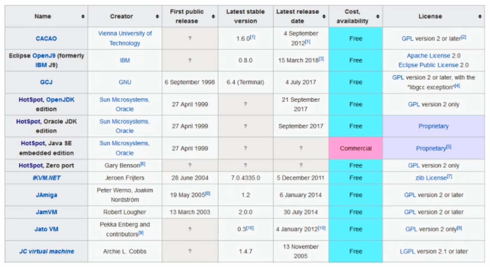
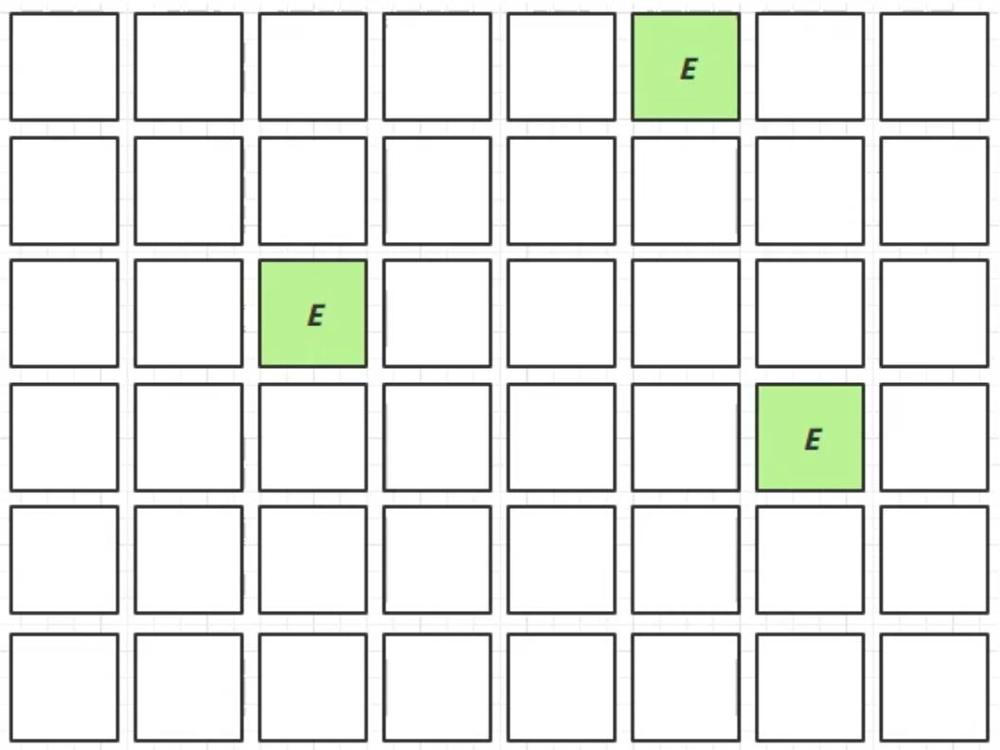
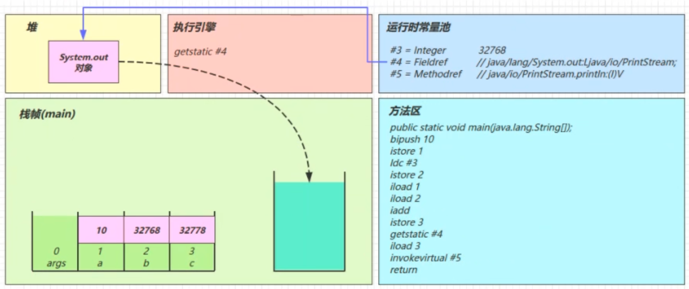
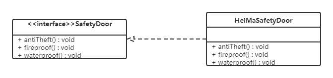
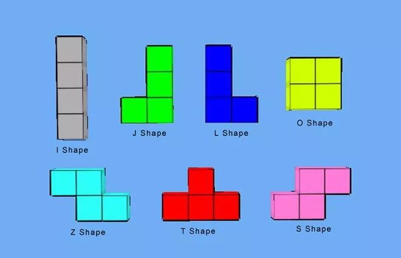
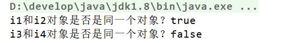
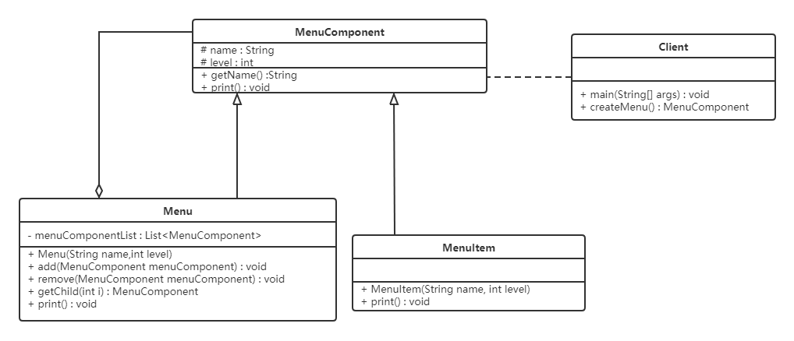
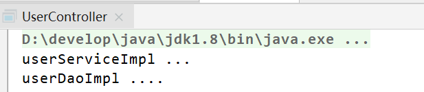

# Windows

## 密钥

ee2 ee7 是网络拥堵多输入几次 1023是输错


### WIN7 

#### Ultimate

BBV2J-GYP7B-V3BKC-4848Q-VMQRM


### WIN10

#### Enterprise

N8XTK V4FM8 27F63 XVFP9 BKMPF

8KNTW-GF66M-QJ46J-W3CKP-3YH2F


#### Enterprise LTSC

**NY6WQ-7FH9P-4T224-FK48J-33YJP**

**DFJ6N-239D6-HD9TC-Q9TB4-7H8R2**

**62NVX-68KFM-W8GFR-G2P3C-XTRFH**


#### Enterprise LTSC 2021

3TGJD-7N7DF-XBBJH-DGW4J-HMMJ2

BWN89 X2FBH X4JT9 Q7T4J RYCGC


### Microsoft Office

#### Pro Plus 2016

3RN22-74K8R-26HVW-7QTV4-GXX7C


## WIN7 激活


```shell
slmgr -ipk 33PXH-7Y6KF-2VJC9-XBBR8-HVTHH
slmgr -skms zh.us.to
slmgr -ato
slmgr -xpr
```


## WIN10 激活

```shell
slmgr -ipk M7XTQ-FN8P6-TTKYV-9D4CC-J462D
# MBQRK-FNDW8-B7GF4-V9PCW-6MV77
slmgr -skms kms.03k.org
slmgr -ato
slmgr -dlv
```


## 软件安装配置

### 安装 Microsoft Store 程序

1. 打开 [在线应用商店](https://apps.microsoft.com/store/apps?hl=zh-cn&gl=cn)，搜索应用程序
2. 复制要安装程序页面的 URL 地址到 [rg-adguard.net](https://store.rg-adguard.net/)，选择 Retail 后搜索
3. 下载合适自己系统的 `*Framework*.Appx`、`*Runtime*.Appx`、`*VCLibs*.Appx`、`UI.Xaml.appx`、`.AppsBundle`、`.Msixbundle` 包并放入同一个文件夹
4. 以管理员身份打开 powershell 并进入安装包目录
5. 执行 `Add-AppxPackage *`
6. 如果报错则根据报错提示解决


### 删除 Microsoft Store 程序

1. 以管理员身份打开 powershell 
2. 输入 `Get-AppxPackage *WindowsStore* | Remove-AppxPackage`


### 更改程序默认安装位置

1. 打开 regedit
2. 找到计算机 `\HKEY_LOCAL_MACHINE\SOFTWARE\Microsoft\Windows\CurrentVersion`
    - ProgramFilesDir
    - ProgramFilesDir (x86)
    - ProgramW6432Dir
3. 修改为想要安装的位置
4. 完成


### 杜比音效驱动

设置-》安全和更新-》恢复-》高级启动 -》疑难解答-》高级选项-》查看更多恢复选项-》启动设置-》重启-》F7（重启之后只有一次效果）

先在 设备管理器 对原有音频驱动进行 禁用设备

点击8aag01ww.exe 默认安装，最后不要勾选Install Dolby Home......

按顺序安装Drivers.msi和DTPC.msi

安装完成后再重复一次(1操作)


### OpenSSH

1. [下载OpenSSH](https://github.com/PowerShell/Win32-OpenSSH/releases) 
2. 解压文件
3. 配置 ssh.exe 所在目录到系统环境变量
4. 打开 cmd，然后输入 ssh 命令并回车，如果出现 ssh 命令帮助提示则表示安装成功！


### git

1. [下载 Portable 版 git](https://github.com/git-for-windows/git/releases)
2. 解压文件

3. 配置 解压目录、解压目录/bin、解压目录/usr/bin 到系统环境变量
4. 打开 cmd，然后输入 git --version 命令并回车，如果出现版本号则表示安装成功！


### Typora

1. [官网](https://typora.io/releases/all)下载 [typora 安装包](../files/typora-setup-x64-1.3.8.exe)
2. 安装
3. 复制 [winmm.dll](..\files\winmm.dll) 文件到 Typora.exe 平级的目录


### Navicat

#### 15

1. 从[官网](https://www.navicat.com.cn/products/)下载 Navicat Premium 15 并安装
2. 打开[注册机](..\files\navicat15Cracker.zip) ，Patch勾选Backup、Host和Navicat v12，然后点击Patch按钮
3. 找到 Navicat 安装路径下的 navicat.exe，选中并点击打开此时出现如下弹窗：
    - 提示navicat.exe - x64 -> Cracked.
4. License, Product and Language 
    - License 为 Enterprise
    - Products 为 premium
    - Languages为English（其它语言版本请自选）
5. Release License 确保 Release Version 为 Site license
6. Keygen / Offline Activation 中 Your Name 和 Your Organization 可以任意填写或者默认
6. 点击 Generate，将自动生成 Serial Keygen（即注册码）
7. 打开 Navicat ，点击菜单栏的帮助，选择注册，在注册窗口键处填入生成的 Serial Keygen（即注册码）
8. 点击激活 -> 点击手动激活
9. 将 Navicat 手动激活窗口的请求码框中内容复制到注册机 Request Code 框中，点击 Activation Code 下面的Generate按钮
10. 将注册机 Activation Code 处生成的激活码内容复制到 Navicat 手动激活窗口的激活码框中
11. 点击激活按钮
12. 提示Navicat现已激活


#### 16

1. 从[官网](https://www.navicat.com.cn/products/)下载 Navicat Premium 16 并安装

2. 以管理员身份打开[注册机](..\files\navicat16Cracker.zip)，Applied Path 选择安装目录根路径后点击 Patch。成功之后，提示是否将 rsa 私钥导出来，导不导都无所谓。此时注册机不要关闭

3. 断网后启动 navicat，试用提醒界面点击注册。

4. 在注册机上点击 Generate 生成注册码并填入 navicat，点击激活后在弹出的页面选择手动激活。

5. 将请求码复制到注册机后点击生成激活码

6. 将激活码复制回 navicat 再点击激活即可


### JDK

#### 安装配置

1. 从[官网](https://www.oracle.com/technetwork/java/javase/downloads/index.html)下载 JDK 程序包并解压

2. 配置系统环境变量

    - 新建 JAVA_HOME 变量 ，变量值填写 JDK 的安装目录(例如 `D:\Insert\JDK\jdk1.8.0`)

    - 新建 CLASSPATH 变量，变量值填写 `.;%JAVA_HOME%\lib;%JAVA_HOME%\lib\tools.jar`(jdk1.8)

    - 到 path 变量添加 `%JAVA_HOME%\bin;%JAVA_HOME%\jre\bin;` jdk11及新版本为 `%JAVA_HOME%\bin\`

 > 注意：如果重启后检查 java 版本发现没有配置到 java 环境，则直接将路径配置到 path 变量中

3. 重启操作系统，运行 cmd 输入 java -version，若显示版本信息，则说明安装和配置成功


#### 更改 JDK 之后若无法启动 eclipse

可以修改 eclipse 安装目录下的 eclipse.ini 的 JDK 路径

```properties
JAVA_HOME=D:\root\profession\install\JDK\jdk_11
CLASSPATH=.;D:\root\profession\install\JDK\jdk_11\lib
```


#### JDK11 生成 JRE

1、用 cmd 打开 JDK 目录

2、运行以下命令会在 JDK 目录生成 JRE

```shell
bin\jlink.exe --module-path jmods --add-modules java.desktop --output jre
```


### Maven

#### 安装配置

1. [官网](https://maven.apache.org/download.cgi)下载 Maven 程序包

2. 解压 Maven 程序包

3. 配置 %MAVEN_HONE%\bin; 环境变量

4. 重启操作系统，启动console，输入mvn –v

5. 配置 conf/settings.xml
     - 配置本地仓库 localRepository

6. 配置 Maven 编译 Java 版本

   ```xml
   <profile>
    <id>jdk-1.8</id>
    <activation>
    <activeByDefault>true</activeByDefault>
    <jdk>1.8</jdk>
    </activation>
    <properties>
      <maven.compiler.source>1.8</maven.compiler.source>
      <maven.compiler.target>1.8</maven.compiler.target>
      <maven.compiler.compilerVersion>1.8</maven.compiler.compilerVersion>
    </properties>
   </profile>
   ```

7. 配置远程仓库地址

   ```xml
   <mirror>
   　　<id>aliyunmaven</id>
   　　<mirrorOf>central</mirrorOf>
   　　<name>aliyun maven</name>
   　　<url>http://maven.aliyun.com/nexus/content/repositories/central/</url>
   </mirror>
   ```


#### 问题

##### role: org.apache.maven.model.validation.ModelValidator

解决 IDEA 版本和 Maven 版本不符合，试图降低 Maven 版本


##### Cannot resolve plugin org.apache.maven.plugins:maven-site-plugin:3.8.1

在本地 repo 目录中找到 org/apache/maven/plugins/，删除目录下的 maven-resources-plugin，然后重新导入让它自动下载


### 浏览器

[Edge 离线安装包](https://www.microsoft.com/zh-cn/edge/business-pages/download)

[Chrome 离线安装包](https://www.google.com/chrome/?platform=win64&extra=stablechannel&standalone=1)

[Firefox 离线安装包](https://www.firefox.com.cn/download/#product-desktop-release)


## v2rayN

订阅地址

https://www.x-max.xyz/link/QHFIvzo3kfsyyYFu?sub=3

https://api.wdnmd.uk/link/JkZLonNHcruWCqUq?sub=3

https://api.x-max.icu/link


[subscribe](../files/v2rayN.subscribe.txt)


## Tampermonkey

1、从 Microsoft store 下载 [Tampermonkey](https://microsoftedge.microsoft.com/addons/search/Tampermonkey) 并安装
2、从 Microsoft store下载 IDM integration Module 并安装
3、下载 IDM(internet download manager) 破解版
4、在 Edge 浏览器->扩展开启 Tampermonkey 和 IDM integration Module
5、将以下脚本加入 Tampermonkey

[网盘助手.user.js](..\files\网盘助手.user.js)


## 禁止驱动更新

首先，Win+R运行，调出运行框，输入“gpedit.msc”打开组策略。
依次找到：
计算机配置-管理模版-系统-设备安装--设备安装限制
接着在右侧找到“阻止使用与下列设备安装程序类相匹配的驱动程序安装设备”，双击右键“编辑”或者双击，打开设置对话框。
勾选“已启用”后点击“显示”输入设备的类GUID（这里有一点要注意的：不要勾选“也适用于匹配已安装的设备”）
至于这个类GUID要怎么来的？这里接着教你，点击开始菜单，找到“设置”，在“设置”窗体中找到“关于”，点击右侧的“设备管理器”

在打开的“设备管理器”中找到你要禁止更新的设备
右键打开“属性”对话框。转到详细信息选项卡，即可在“属性：”下拉列表中找到对应的数据。直接在组策略中输入该值即可

回到原来已经打开的组策略对话框，输入该设备的类GUID值后点击确定即可


## Windows10 锁屏壁纸

C:\Users\skyline\AppData\Local\Packages\Microsoft.Windows.ContentDeliveryManager_cw5n1h2txyewy\LocalState\Assets
win10任务栏图标存放于C:\Users（用户文件夹）\用户名\AppData\Roaming\Microsoft\Internet Explorer\Quick Launch\User Pinned\TaskBar\


## 杀死占用某个端口的程序

```shell
netstat -aon|findstr "端口号"
taskkill -PID 进程号 -F
```


## 你需要来自 SYSTEM 的权限才能删除

- 右键该 文件夹 -> 属性 -> 安全 -> 高级，可以看到最上面的所有者是 system
- 点击 更改 -> 高级 -> 立即查找 -> 在下方的框框找到当前账户 -> 确认 -> 确认
- 勾选下面两项后 确定  ->  确定 关闭属性
  - 替换子容器和对象的所有者 
  - 使用可从此对象继承的审核项目替换所有子对象的审核项目
- 右键该 文件夹 -> 属性 -> 安全 -> 编辑 -> 选中刚刚设置的账户 -> 勾选完全控制 -> 确定 -> 确定


## 文件名大小写敏感

```shell
fsutil.exe file SetCaseSensitiveInfo "C:\Users\Juan\Desktop" disable
```


## 查看域名对应 IP

[(11条消息) 命令行模拟DNS域名解析全过程_dns解析命令_Lambda丶雨辰的博客-CSDN博客](https://blog.csdn.net/qq_43294932/article/details/125968640)


## 设置访问域名固定 IP

记事本打开 C:\Windows\System32\drivers\etc\hosts

```bash
20.205.243.166 github.com
```

由于hosts是系统文件，有可能你没有权限写入。遇到这种情况，先将其保存在其他地方（比如，桌面上）。再确保未自动添加扩展名。接下来，将其拖入C:\Windows\System32\drivers\etc\文件夹，将原来的hosts文件覆盖掉即可。


## 缺少 VCRUNTIME140.dll

安装 Visual C++ Redistributable 2015


# Linux


## Bash

[如何在 Bash 脚本中使用强大的 Linux test 命令 - 知乎 (zhihu.com)](https://zhuanlan.zhihu.com/p/517323666)

[Bash技巧：介绍 $0、$1、$2、$#、$@、$*、$? 的含义_$0 bash_一口Linux的博客-CSDN博客](https://blog.csdn.net/daocaokafei/article/details/117337183)

[bash - 从字符串中提取第一个数字 - IT工具网 (coder.work)](https://www.coder.work/article/2580342)

[bash的三种引号_bash引号_清规欲的博客-CSDN博客](https://blog.csdn.net/qingguiyu/article/details/49800549)

[linux-三种引号 - wandoubaguo - 博客园 (cnblogs.com)](https://www.cnblogs.com/wandoubaguo/p/17289489.html)

[1.bash-转义&引号 - Leo'sblog - 博客园 (cnblogs.com)](https://www.cnblogs.com/cn-leoblog/p/15415841.html)


## 镜像源

文件 `/etc/apt/sources.list`

如果遇到无法拉取 HTTPS 源的情况，请先使用 HTTP 源并安装 `sudo apt install apt-transport-https ca-certificates`

### 清华镜像源

[清华大学开源软件镜像站 | 镜像站使用帮助](https://mirrors.tuna.tsinghua.edu.cn/help/debian/)

#### debian 10

```properties
# 默认注释了源码镜像以提高 apt update 速度，如有需要可自行取消注释
deb https://mirrors.tuna.tsinghua.edu.cn/debian/ buster main contrib non-free
# deb-src https://mirrors.tuna.tsinghua.edu.cn/debian/ buster main contrib non-free

deb https://mirrors.tuna.tsinghua.edu.cn/debian/ buster-updates main contrib non-free
# deb-src https://mirrors.tuna.tsinghua.edu.cn/debian/ buster-updates main contrib non-free

deb https://mirrors.tuna.tsinghua.edu.cn/debian/ buster-backports main contrib non-free
# deb-src https://mirrors.tuna.tsinghua.edu.cn/debian/ buster-backports main contrib non-free

deb https://mirrors.tuna.tsinghua.edu.cn/debian-security buster/updates main contrib non-free
# deb-src https://mirrors.tuna.tsinghua.edu.cn/debian-security buster/updates main contrib non-free

# deb https://security.debian.org/debian-security buster/updates main contrib non-free
# # deb-src https://security.debian.org/debian-security buster/updates main contrib non-free
```


#### debian 11

```properties
# 默认注释了源码镜像以提高 apt update 速度，如有需要可自行取消注释
deb https://mirrors.tuna.tsinghua.edu.cn/debian/ bullseye main contrib non-free
# deb-src https://mirrors.tuna.tsinghua.edu.cn/debian/ bullseye main contrib non-free

deb https://mirrors.tuna.tsinghua.edu.cn/debian/ bullseye-updates main contrib non-free
# deb-src https://mirrors.tuna.tsinghua.edu.cn/debian/ bullseye-updates main contrib non-free

deb https://mirrors.tuna.tsinghua.edu.cn/debian/ bullseye-backports main contrib non-free
# deb-src https://mirrors.tuna.tsinghua.edu.cn/debian/ bullseye-backports main contrib non-free

deb https://mirrors.tuna.tsinghua.edu.cn/debian-security bullseye-security main contrib non-free
# deb-src https://mirrors.tuna.tsinghua.edu.cn/debian-security bullseye-security main contrib non-free

# deb https://security.debian.org/debian-security bullseye-security main contrib non-free
# # deb-src https://security.debian.org/debian-security bullseye-security main contrib non-free
```


## 服务器


### 101

| APP                         | Version | Port                                                         | Proxy Port                               | FRP(1,41,31,23,11)  | Nginx 负载均衡 |
| --------------------------- | ------- | ------------------------------------------------------------ | ---------------------------------------- | ------------------- | -------------- |
| ssh                         |         | 22                                                           | -                                        | 11068               |                |
| ProFTPD                     | 1.3.8   | 21, 11990-11999                                              | -                                        | 11057, 11990-11999  |                |
| HAProxy                     | 2.8.3   | 9188                                                         | -                                        | 11672               |                |
| MySql                       | 8.0.31  | 3306                                                         | -                                        | 11282               |                |
| Redis                       | 7.2.0   | 6379                                                         | -                                        | 11599               |                |
| ElasticSearch               | 8.10.4  | 9208[http], 9308[tcp]                                        | 10519, 10550                             | 11519, 11550        |                |
| ElasticSearch               | 7.17.7  | 9207[http], 9307[tcp]                                        | 10508, 10539                             | 11508, 11539        |                |
| Nacos                       | 2.2.3   | 8840[dashboard], 9840[grpc-client], 9841[grpc-server]        | 18848(10668), 19848(10709), 19849(10720) | 11668, 11709, 11720 | 是             |
| Sentinel                    | 1.8.6   | 8050[dashboard], 8719[api-server]                            | 10443, 10667                             | 11443, 11667        |                |
| Seata                       | 1.7.0   | 7090[dashboard], 8090[server]                                | 10494, 10535                             | 11494, 11535        | 是             |
| RabbitMQ                    | 3.12.6  | 15672[management], 5672[AMQP 0-9-1 without TLS], 5671[AMQP 0-9-1 with TLS] | 10575, 10574, 10563,                     | 11575, 11574, 11563 |                |
| Zipkin                      | 2.24.3  | 9411[dashboard]                                              | 10527                                    | 11527               |                |
| Nginx                       | 1.24.0  | 80                                                           |                                          |                     |                |
| Zookeeper                   | 3.8.4   | 2181                                                         | -                                        | 11308               |                |
| Kafka                       | 3.8.0   | 9092                                                         | -                                        | 11598               |                |
| MicArray_Sound_Localization |         | 10001、10002、10003                                          | -                                        | 11012、11023、11034 |                |


### 102

| APP           | Version | Port                                                         | FRP(1,41,31,23,11)  |
| ------------- | ------- | ------------------------------------------------------------ | ------------------- |
| ssh           |         | 22                                                           | 12068               |
| ProFTPD       | 1.3.8   | 21, 12990-12999                                              | 12057, 12990-12999  |
| HAProxy       | 2.8.3   | 9188                                                         | 12672               |
| ElasticSearch | 8.10.4  | 9208[http], 9308[tcp]                                        | 12519, 12550        |
| ElasticSearch | 7.17.7  | 9207[http], 9307[tcp]                                        | 12508, 12539        |
| Nacos         | 2.2.3   | 8840[dashboard], 9840[grpc-client], 9841[grpc-server]        | 12668, 12709, 12720 |
| Seata         | 1.7.0   | 7090[dashboard], 8090[server]                                | 12494, 12535        |
| RabbitMQ      | 3.12.6  | 5672[AMQP 0-9-1 without TLS], 5671[AMQP 0-9-1 with TLS],15672[management] | 12574, 12563, 12575 |
| Zipkin        | 2.24.3  | 9411[dashboard]                                              | 12527               |
| Zookeeper     | 3.8.4   | 2181                                                         | 12308               |
| Kafka         | 3.8.0   | 9092                                                         | 12598               |


### 103

| APP           | Version | Port                                                         | FRP(1,41,31,23,11)  |
| ------------- | ------- | ------------------------------------------------------------ | ------------------- |
| ssh           |         | 22                                                           | 13068               |
| ProFTPD       | 1.3.8   | 21, 13990-13999                                              | 13057, 13990-13999  |
| HAProxy       | 2.8.3   | 9188                                                         | 13672               |
| ElasticSearch | 8.10.4  | 9208[http], 9308[tcp]                                        | 13519, 13550        |
| ElasticSearch | 7.17.7  | 9207[http], 9307[tcp]                                        | 12508, 12539        |
| Nacos         | 2.2.3   | 8840[dashboard], 9840[grpc-client], 9841[grpc-server]        | 13668, 13709, 13720 |
| Seata         | 1.7.0   | 7090[dashboard], 8090[server]                                | 13494, 13535        |
| RabbitMQ      | 3.12.6  | 5672[AMQP 0-9-1 without TLS], 5671[AMQP 0-9-1 with TLS],15672[management] | 13574, 13563, 13575 |
| Zipkin        | 2.24.3  | 9411[dashboard]                                              | 13527               |
| Zookeeper     | 3.8.4   | 2181                                                         | 13308               |
| Kafka         | 3.8.0   | 9092                                                         | 13598               |


## 常用命令

[Linux 命令大全 | 菜鸟教程 (runoob.com)](https://www.runoob.com/linux/linux-command-manual.html)


#### 系统管理

##### useradd

```sh
#添加mysql用户(,-s )
sudo useradd -r -g appgroup -s /bin/bash mysql
sudo useradd -g root -s /bin/bash -m young
# -c：加上备注文字，备注文字保存在passwd的备注栏中
# -d：指定用户登入时的主目录，替换系统默认值/home/<用户名>
# -D：变更预设值
# -e：指定账号的失效日期，日期格式为MM/DD/YY，例如06/30/12。缺省表示永久有效
# -f：指定在密码过期后多少天即关闭该账号。如果为0账号立即被停用；如果为-1则账号一直可用。默认值为-1
# -g：指定用户所属的群组。值可以使组名也可以是GID。用户组必须已经存在的，期默认值为100，即users
# -G：指定用户所属的附加群组
# -m：自动建立用户的登入目录
# -M：不要自动建立用户的登入目录
# -n：取消建立以用户名称为名的群组
# -r：建立系统账号
# -s：指定用户登入后所使用的shell。默认值为/bin/bash
#	/bin/false参数指定用户仅拥有所有权,而没有登录权限
# -u：指定用户ID号。该值在系统中必须是唯一的，如果同时有-o选项，则可以重复使用其他用户的标识号。0~499默认是保留给系统用户账号使用的，所以该值必须大于499
```


##### userdel

```sh
userdel 选项 用户名
# -r 把用户的主目录一起删除
```


##### usermod 

```sh
usermod 选项 用户名
# 常用的选项包括-c, -d, -m, -g, -G, -s, -u以及-o等，这些选项的意义与useradd命令中的选项一样，可以为用户指定新的资源值。
# 另外，有些系统可以使用选项：-l 新用户名
# -g GROUP 改用户的主要组
# -G GROUP1 GROUP2 ... 将用户的组设置为这些组，并将用户从-G选项后未列出的组中删除。如果要用户添加到新组时，请配合 -a (append) 使用选项
```


##### passwd

```sh
passwd 选项 用户名
# -l 锁定口令，即禁用账号。
# -u 口令解锁。
# -d 使账号无口令。
# -f 强迫用户下次登录时修改口令。
# 如果默认用户名，则修改当前用户的口令
```


##### groupadd

```sh
sudo groupadd appgroup
-f,--force 如果指定的组已经存在，此选项将失明了仅以成功状态退出。当与-g一起使用，并且指定的GID_MIN已经存在时，选择另一个唯一的GID（即-g关闭）。
-g,--gid GID 这个值必须是唯一的，除非使用-o选项。但必须是非负的。默认值是使用大于或等于GID_MIN的最小值，并且大于每个其他组。
-K,--key KEY=VALUE 重写/etc/login.defs默认值（GID_MIN，GID_MAX和其他）。可以指定多个K选项。示例：-K GID_MIN=100 –KGID_MAX=499。注意：-K GID_MIN=10,GID_MAX=499不能工作。
-o,--non-unique 此选项允许添加一个非唯一的GID值。
-p,--password PASSWORD 为新组使用此加密过的密码。默认为禁用密码。注意：不推荐使用这个选项，因为密码（或加密过的密码）会被用户通过列出这个过程而看到。您应该确保密码符合系统的密码政策。
-r,--system 创建一个系统组。新的系统组数字标识符在SYS_GID_MIN到SYS_GID_MAX范围内选择，定义在login.defs中而不是GID_MIN到GID_MAX。
-R,--root CHROOT_DIR 将修改应用到CHROOT_DIR目录，并使用配置。
```


##### ps

[Linux系统中ps命令的详细介绍：概念、原理、参数介绍、使用方法、显示信息字段含义_linux ps_二进制coder的博客-CSDN博客](https://blog.csdn.net/qq_37037348/article/details/131491031)

[linux 命令：ps 详解_ps -eo_yspg_217的博客-CSDN博客](https://blog.csdn.net/yspg_217/article/details/121845366)

[Linux之ps命令基本使用 (ngui.cc)](https://www.ngui.cc/el/3473592.html?action=onClick)

[通过20个实例掌握 Linux PS 命令 - 知乎 (zhihu.com)](https://zhuanlan.zhihu.com/p/583560458)


#### 文件/磁盘

##### tar

[参考](https://www.runoob.com/linux/linux-comm-tar.html)

```sh
# 常用参数
# -c, --create 创建一个新归档
# -x, --extract, --get 从归档中解出文件
# -f, --file=ARCHIVE 使用归档文件
# -z, --gzip, --gunzip, --ungzip 通过 gzip 过滤归档
# -C, --directory=DIR 改变至目录 DIR
# -v, --verbose 详细地列出处理的文件

# 解压缩 tar.bz2 格式的压缩文件到当前目录
tar -jxvf .tar.bz2
# 解压缩 tar.gz 格式的压缩文件到 /home 目录
tar -zxvf .tar.gz -C /home
# 解压缩 tar.xz
tar -xvJf .tar.xz

# 压缩与解压的唯一区别就是解压参数为-x，压缩参数为-c
# 将当前目录下的所有文件压缩
tar -zcvf test.tar.gz ./
# -C 压缩时，使用相对路径，不包含目录结果 /home/username/
# . 压缩相对目录后的所有文件
tar -zcvf .tar.gz -C /home/username/ .

```


##### unzip

```sh
unzip [-cflptuvz][-agCjLMnoqsVX][-P <密码>][.zip文件][文件][-d <目录>][-x <文件>] 或 unzip [-Z]
# -c 将解压缩的结果显示到屏幕上，并对字符做适当的转换。
# -f 更新现有的文件。
# -l 显示压缩文件内所包含的文件。
# -p 与-c参数类似，会将解压缩的结果显示到屏幕上，但不会执行任何的转换。
# -t 检查压缩文件是否正确。
# -u 与-f参数类似，但是除了更新现有的文件外，也会将压缩文件中的其他文件解压缩到目录中。
# -v 执行时显示详细的信息。
# -z 仅显示压缩文件的备注文字。
# -a 对文本文件进行必要的字符转换。
# -b 不要对文本文件进行字符转换。
# -C 压缩文件中的文件名称区分大小写。
# -j 不处理压缩文件中原有的目录路径。
# -L 将压缩文件中的全部文件名改为小写。
# -M 将输出结果送到more程序处理。
# -n 解压缩时不要覆盖原有的文件。
# -o 不必先询问用户，unzip执行后覆盖原有文件。
# -P<密码> 使用zip的密码选项。
# -q 执行时不显示任何信息。
# -s 将文件名中的空白字符转换为底线字符。
# -V 保留VMS的文件版本信息。
# -X 解压缩时同时回存文件原来的UID/GID。
# [.zip文件] 指定.zip压缩文件。
# [文件] 指定要处理.zip压缩文件中的哪些文件。
# -d<目录> 指定文件解压缩后所要存储的目录。
# -x<文件> 指定不要处理.zip压缩文件中的哪些文件。
# -Z unzip -Z等于执行zipinfo指令。
```


##### fdisk

```shell
# 查看所有分区的大小
fdisk -l
```


#### 请求/连接

[参考](https://www.cnblogs.com/sx66/p/11887022.html)

##### wget

```shell
# -c 断点续传
wget -c url
# -O 下载并以不同的文件名保存
wget -O alias_name url 
# -b 后台下载
wget -b url
# 查看后台下载进度
tail -f wget-log
# 测试下载链接是否有效
wget –spider url
```


##### curl

[参考](https://blog.csdn.net/angle_chen123/article/details/120675472)

```shell
# 常用参数
# -H 代表header头
# -X 是指定什么类型请求(POST/GET/HEAD/DELETE/PUT/PATCH)
# -d 代表传输什么数据

# 发送 GET 请求
curl URL?age=1&name=json
# 发送 POST 请求
curl -X POST -d 'age=1&name=json' URL
# 发送 json 格式请求
curl -H "Content-Type: application/json" -X POST -d '{"age":1,"name":"json"}' URL
# json 文件内容作为数据发送 json 格式请求
curl -H "Content-Type: application/json" -X POST -d @jsoninfo.json URL
# 输出保存到文件
curl URL >> output.json
```


##### ssh

[参考](https://linux265.com/course/linux-command-ssh.html)

```shell
# 常用命令
# 使用 username 账号登录 ip 主机
ssh username@ip
# 指定端口，默认 22
ssh username@ip -p port
```


##### scp

[参考](https://www.runoob.com/linux/linux-comm-scp.html)

```shell
# 常用命令
# 从本地复制文件到远程
scp local_file remote_username@remote_ip:remote_folder/remote_file
scp local_file remote_ip:remote_folder/remote_file
# 从本地复制文件夹到远程
scp -r local_folder remote_username@remote_ip:remote_folder 
scp -r local_folder remote_ip:remote_folder 
# 从远程复制到本地
# 从远程复制到本地，只要将从本地复制到远程的命令的后2个参数调换顺序即可
```


#### 网络

查看 ip 地址

ip addr show

sudo apt install net-tools

ifconfig -a


### 更改计算机名称

```sh
sudo vim /etc/hosts
sudo vim /etc/hostname
```

带下划线的不允许作为节点名

修改之前最好先用hostname命令测试下，免得启动不了机器


### 查看端口是否被占用

lsof -i:端口号

netstat -tunlp |grep 端口号


### nohup 后台执行命令

nohup 是no hang up 的缩写，就是不挂断的意思。 nohup命令：如果你正在运行一个进程，而且你觉得在退出帐户时该进程还不会结束，那么可以使用nohup命令。 该命令可以在你退出帐户/关闭终端之后继续运行相应的进程。 在缺省情况下该作业的所有输出都被重定向到一个名为nohup.out的文件中。

语法：nohup Command [ Arg … ] [　& ]
全称：no hung up
功能：不挂断地运行命令

& 放在启动参数后面表示设置此进程为后台进程
默认情况下，进程是前台进程，这时就把Shell给占据了

如果不将 nohup 命令的输出重定向，输出将附加到当前目录的 nohup.out 文件中。
如果当前目录的 nohup.out 文件不可写，输出重定向到 $HOME/nohup.out 文件中。

nohup和&结合使用，就可以实现使命令永久地在后台执行的功能

只有nohup，不加&，是关闭标准输入，终端不再能够接收任何输入（标准输入），
重定向标准输出和标准错误到当前目录下的nohup.out文件，即使关闭shell退出当前session依然继续运行

输出重定向

nohup command > out.file 2>&1 &
command > out.file 是将command的输出重定向到out.file文件，
即输出内容不打印到屏幕上，而是输出到out.file文件中。

2>&1 是将标准错误（2）重定向到标准输出（&1），标准输出（&1）再被重定向输入到out.file文件中。

0 – stdin (standard input)，1 – stdout (standard output)，2 – stderr (standard error) 

Linux下还有一个特殊的文件/dev/null，它就像一个无底洞，所有重定向到它的信息都会消失得无影无踪。


## 命令工具安装

### sudo

```shell
su -
apt update
apt install sudo
```


### GCC

`sudo apt install build-essential`

如果运行 apt update 之后仍然报错 E: 无法定位软件包 build-essential，可能是镜像源的问题，更换镜像源即可


### vim

`sudo apt install vim`


### curl

`sudo apt install curl`


### unzip

`sudo apt install unzip`


## 内网穿透


[参考](https://www.bilibili.com/read/cv24453460)


##### 简介

FRP是Fast Reverse Proxy的缩写，它是一款开源、高性能、跨平台的内网穿透工具。 FRP允许您通过安全地穿透NAT和防火墙来访问您的本地服务器，以便您可以从任何地方访问您的应用程序和服务。它的工作方式是将来自互联网的请求转发给本地网络中的应用程序，从而使应用程序看起来好像直接在互联网上运行。


##### 基本环境

可以有公网IP的实体机（比如vps等） 目标设备（就是你内网中的机器）


##### 版本

[下载 frp](https://github.com/fatedier/frp/releases/download/v0.51.2/frp_0.51.2_linux_amd64.tar.gz)

查看相应的架构型号，按照不同型号下载不同把版本

```shell
arch
# X86_64
# 如果是“X86_64“即可选择”amd64”
```


##### 安装配置部署管理

###### 服务端配置

下载 frp 安装包并解压到 `/opt/apps/frp/`

关注下面几个文件

frps

frps.ini

frpc

frpc.ini 前两文件，s结尾代表server，分别是服务端程序和服务端配置文件，

后两个文件，c结尾代表client。分别是客户端程序和客户端配置文件。

我们当前操作的是服务端（也就说，公网服务作为部署frp的服务端）

配置 frps.ini

```properties
[common]
# 于客户端和服务端连接的端口
bind_port = 7000 
authentication_timeout = 0
# 服务端 web 页面的端口，如 7500 端口，在配置完成服务启动后可以通过浏览器访问 x.x.x.x:7500 （其中x.x.x.x为公网服务的IP）查看frp服务运行信息
dashboard_port = 7500

# 服务端加了 客户端必须添加，也可以都不设置
token = token 

dashboard_user = frp
dashboard_pwd = Senna&frp@P1
# 可自定义，用于反向代理 HTTP 主机时使用
vhost_http_port = 10080
# 可自定义，用于反向代理 HTTPS 主机时使用
vhost_https_port = 10443

# 子域名
# subdomain_host = frp.com 

# 自定义404 页面，绝对路径
#custom_404_page = /frp/404.html 

# 允许客户端绑定的端口，不设置则不限制
allow_ports = 10000-40000
# 端口代理数量
max_pool_count = 100
log_file = /var/log/frp/frps.log
log_level = info
log_max_days = 3
```


###### 客户端安装配置

下载 frp 安装包并解压到 `/opt/apps/frp/`

编辑配置 frpc.ini

```properties
[common]
# 公网 ip 地址，vps
server_addr = 1.12.251.106
# frp 服务的 bind_port
server_port = 7000
token = token
log_file = /var/log/frp/frpc.log
log_level = info
log_max_days = 3

[mysql]
# tcp/http/https
# 没有域名情况下使用 tcp
type = tcp
local_ip = 127.0.0.1
# 本地服务端口
local_port = 22
# 远程访问端口
remote_port = 11022

# 有域名配置
[web]
type = http
local_ip = 127.0.0.1
local_port = 80
remote_port = 80
custom_domains = www.demo1.com
```


###### 创建用户（组）

```shell
sudo groupadd -r apps
sudo useradd -r -g apps -s /bin/false frp

sudo mkdir /var/log/frp
sudo chmod -R 755 /opt/apps/frp
sudo chmod -R 755 /var/log/frp
sudo chown -R frp:root /opt/apps/frp
sudo chown -R frp:root /var/log/frp
```


###### 服务管理

手动

```shell
# 启动服务端
sudo -u frp nohup /opt/apps/frp/frps -c /opt/apps/frp/frps.ini
# 启动客户端
sudo -u frp nohup /opt/apps/frp/frpc -c /opt/apps/frp/frpc.ini

# 停止服务
ps aux | grep 'frp'
sudo kill -9 PID
```


自动

编写[脚本](../files/scripts/server/frpc.server)文件放在 base_dir 目录下 `/opt/apps/frp/frpc.server`

配置参考 Linux -> 服务管理  -> 系统启动时自动运行服务


## 设置用户为 sudoer


需要先安装 `sudo`

### 方式一

方法一：直接配置为 sudoer

```shell
su -
vi /etc/sudoers
# 找到“root ALL=(ALL:ALL) ALL”一行，在下面插入新的一行，内容是“username  ALL=(ALL:ALL) ALL”
# “:wq!”保存并退出
# 第一个ALL是指网络中的主机，我们后面把它改成了主机名，它指明用户可以在此主机上执行后面的命令。
# 第二个括号里的ALL是指目标用户，也就是以谁的身份去执行命令。
# 最后一个ALL是指命令名
```


### 方法二

先将 sudo 组配置到 `/etc/sudoers` 再添加用户到 sudo 组中

```shell
sudo groupadd sudoers
sudo usermod -aG sudoers username

vi /etc/sudoers
# 在文件中添加 %sudoers ALL=(ALL:ALL) ALL
```


## JDK

[Java Downloads | Oracle 中国](https://www.oracle.com/cn/java/technologies/downloads/)


一. 下载 jdk-11_linux-x64_bin.tar.gz 并解压 (tar -xzvf) -C到 /opt/install/

```sh
# 解压文件
sudo tar -xzvf jdk-17.0.4.1_linux-x64_bin.tar.gz -C /opt/jdk/
sudo mv /opt/jdk/jdk-17.0.4.1 /opt/jdk/17.0.4.1
# 创建符号链接指向最新版
sudo ln -s /opt/jdk/17.0.4.1 /opt/jdk/jdk

# 编辑文件 /etc/profile 
export JAVA_HOME="/opt/jdk/jdk"
export PATH=$PATH:$JAVA_HOME/bin
# jdk1.8配置如下
export JAVA_HOME="/opt/jdk/jdk"
export CLASSPATH=.:$JAVA_HOME/jre/lib/rt.jar:$JAVA_HOME/lib/dt.jar:$JAVA_HOME/lib/tools.jar
export PATH=$PATH:$JAVA_HOME/bin

# 使用环境变量生效，不必重新登录
source /etc/profile

# 使用以下命令检查环境值
echo $JAVA_HOME
# output:/opt/jdk/jdk

# 配置为系统上的默认设置
sudo update-alternatives --install "/usr/bin/java" "java" "/opt/jdk/jdk/bin/java" 1
sudo update-alternatives --install "/usr/bin/javac" "javac" "/opt/jdk/jdk/bin/javac" 1
# jdk1.8
# sudo update-alternatives --install "/usr/bin/javaws" "javaws" "/opt/jdk/jdk/bin/javaws" 1

# 更正可执行文件的权限和所有权
sudo chmod a+x /usr/bin/java
sudo chmod a+x /usr/bin/javac
# sudo chmod a+x /usr/bin/javaws
sudo chown -R root: /opt/jdk/

# 选择默认 JDK
update-alternatives --config java
# 如果您看到以下消息:
# There is only one alternative in link group java (providing /usr/bin/java): /opt/jdk/jdk/bin/java
# 这意味着您以前从未安装过 Java, 您刚才已经安装了它
# 如果您看到另一条消息, 其中包含要选择的 java 版本, 则您之前已安装了另一个 java 版本

# 验证 JDK 版本
java -version
java version "17.0.4.1" 2022-08-18 LTS
Java(TM) SE Runtime Environment (build 17.0.4.1+1-LTS-2)
Java HotSpot(TM) 64-Bit Server VM (build 17.0.4.1+1-LTS-2, mixed mode, sharing)
```


## 服务管理

### 服务管理脚本编写

[app.example.server](../files/scripts/server/app.example.server)

[app.example.2.server](../files/scripts/server/app.example.2.server)


### 系统启动时自动运行服务

#### 方式一

[Linux之init.d、rc.d文件夹说明](../files/HTML/20230821/001.pdf)

```shell
# 环境为 Debian 11

# 更正文件夹及文件权限
sudo chmod +x /opt/apps/frp
sudo chmod +x /opt/apps/frp/frpc.server

# 将 frp 进程放入系统进程中
sudo ln -s /opt/apps/frp/frpc.server /etc/init.d/frpc
# 注册服务
sudo update-rc.d frpc defaults
# 查看目录下是否有相应的软链，没有则手动创建
ls -l /etc/rc?.d/
sudo ln -s /etc/init.d/frpc /etc/rc0.d/K01frpc
sudo ln -s /etc/init.d/frpc /etc/rc1.d/K01frpc
sudo ln -s /etc/init.d/frpc /etc/rc2.d/S01frpc
sudo ln -s /etc/init.d/frpc /etc/rc3.d/S01frpc
sudo ln -s /etc/init.d/frpc /etc/rc4.d/S01frpc
sudo ln -s /etc/init.d/frpc /etc/rc5.d/S01frpc
sudo ln -s /etc/init.d/frpc /etc/rc6.d/S01frpc

# 启动、停止、重新启动服务
sudo service frpc start
sudo service frpc stop
sudo service frpc restart
sudo service frpc status
# 或
sudo systemctl start frpc.service
sudo systemctl stop frpc.service
sudo systemctl restart frpc.service
sudo systemctl status frpc.service

# 脚本有更新时运行这个
# 这个命令会重新装载所有守护进程的unit文件，然后重新生成依赖关系树
sudo systemctl daemon-reload
```


#### 方式二

编辑/新增 `/etc/rc.local` 并 `sudo chmod +x /etc/rc.local`


样例

```shell
#!/bin/bash

nohup  /opt/nginx/sbin/nginx > /var/log/nginx/nginx.nohup.log  2>&1 &

exit 0
```


#### 自定义systemctl服务

服务单元文件存放位置

systemd服务单元文件通常存放在以下两个目录之一：

\- **系统级服务**：`/etc/systemd/system/`（管理员自定义服务优先存放位置，自定义服务应放在该目录下）

\- **软件包安装的服务**：`/usr/lib/systemd/system/`（一般不要直接修改这里）


##### 创建服务单元文件

```shell
[Unit]
# 必填：服务描述
Description=My Custom Python Application

# 强依赖的服务（如果依赖服务启动失败，本服务也不会启动），强依赖MySQL
# Requires=mysql.service

# 弱依赖（尽可能启动依赖服务，但不强制）
# Wants=mysql.service

# 定义启动顺序，表示在网络启动后运行，多个服务用空格分隔
After=network.target

# 冲突服务（不能同时运行）
# Conflicts=old-service.service


[Service]
# Type：进程类型（常用 simple 或 forking）
#   simple：默认类型，前台运行的服务。启动后立即视为活动状态，ExecStart 的进程是主进程
#   forking：传统后台守护进程，ExecStart 的进程会 fork 子进程后退出
#   oneshot：执行单次任务，任务完成后服务自动停止（非守护进程）
#   dbus：D-Bus 服务，获取 D-Bus 名称后启动
#   notify：服务就绪时发送通知，需要服务支持 sd_notify()
#   idle：延迟启动（系统空闲时），避免与其他服务启动竞争
Type=simple

# 运行用户/组
User=www-data
Group=www-data

# 应用的工作目录
WorkingDirectory=/opt/myapp

# 绝对路径启动命令（最重要！）
ExecStart=/usr/bin/python3 /opt/myapp/app.py

# 可选：重载配置时执行的命令
# ExecReload=

# 可选：停止服务时执行的命令
# ExecStop=/usr/bin/kill -TERM $MAINPID

# 重启策略（常用 on-failure 或 always）
#   no: 不重启
#   on-success: 成功退出时重启
#   on-failure: 非正常退出时重启（退出码非0）（推荐）
#   always: 总是重启
Restart=on-failure

# 重启前等待时间
RestartSec=5s

# 可选：设置环境变量（可多次使用）
# Environment="DEBUG=false"
# Environment="PORT=8080"
# EnvironmentFile=/etc/myapp/env.conf

## 可选：内存限制
# MemoryMax=1G
# MemoryHigh=800M
# MemoryLimit=512M

## 可选：CPU 限制
# 最多使用 1.5 个核心
# CPUQuota=150%
# CPU 时间权重
# CPUWeight=50

## 可选：IO 限制
# IOWeight=20
# DeviceAllow=/dev/nvme0n1 rw

## 可选：文件系统保护
# 禁止访问 /home /root
# ProtectHome=yes
# 只读访问系统目录
# ProtectSystem=strict

## 可选：能力限制
# CapabilityBoundingSet=CAP_NET_BIND_SERVICE
# NoNewPrivileges=yes

## 可选：命名空间隔离
# PrivateTmp=yes
# PrivateDevices=yes
# PrivateUsers=yes

## 定时任务替代 cron，WantedBy指定为timers.target
# [Timer]
# OnCalendar=daily
# Persistent=true

[Install]
# 在系统进入运行级别模式时启动
# 定义服务所属的 target（相当于传统运行级别）
#   multi-user.target：级别 3，标准文本模式（无图形界面）
#   graphical.target：级别 5，图形界面模式
#   default.target：系统默认，通常指向 graphical.target
#   network.target：网络就绪后启动
#   timers.target：定时器服务
#   sysinit.target：系统初始化早期阶段
WantedBy=multi-user.target
```


##### 重载配置并启用服务

```shell
# 创建文件后执行：
# 检查语法错误
systemd-analyze verify /etc/systemd/system/hadoop.service
# 重载 systemd 配置（必须！）
sudo systemctl daemon-reload
# 启用开机自启
sudo systemctl enable hadoop.service
# 立即启动服务
sudo systemctl start hadoop.service
# 检查状态
sudo systemctl status hadoop.service
```


##### 调试与日志查看

```shell
# 实时日志
sudo journalctl -u hadoop.service -f

# 本次启动以来的日志
sudo journalctl -u hadoop.service -b

# 查看上一次启动的日志（包含上次关机记录）
sudo journalctl -u hadoop.service -b -1

journalctl -u hadoop.service -xe

# 测试服务启动
sudo systemctl start my-custom-service --dry-run

# 检查服务依赖
systemd-analyze critical-chain my-custom-service
```


##### 服务管理常用命令

| 操作 | 命令 |
|------|------|
| 启动 | `sudo systemctl start myapp` |
| 停止 | `sudo systemctl stop myapp` |
| 重启 | `sudo systemctl restart myapp` |
| 重载配置 | `sudo systemctl reload myapp`（需服务支持） |
| 禁用开机启动 | `sudo systemctl disable myapp` |
| 查看是否启用 | `systemctl is-enabled myapp` |


## 问题

### Shell 终端乱码

```shell
# 查看当前字符集
# 如果不是 zh_CN.UTF-8，则设置为 zh_CN.UTF-8
# 如果是 zh_CN.UTF-8 仍然乱码，则设置为 en_US.UTF-8
echo $LANG
sudo vim /etc/profile
# export LANG=en_US.UTF-8
source /etc/profile
```


### 无法进入系统

ACPI BIOS Error (bug): Could not resolve symbol [_SB.PCI0.GP17.VGA.LCD._BCM.AFN7]...

开机进入 GNU GRUB 界面时按下 E 键进入编辑

找到 linux 开头的一行，在末尾添加 `acpi_backlight=vendor`

按 Ctrl+X 则会按照刚刚修改的参数引导系统启动

进入系统后，打开文件 `/etc/default/grub`  将刚刚添加的参数添加到 `GRUB_CMDLINE_LINUX_DEFAULT` 末尾


/dev/nvme0n1p4: clean，......

添加内核启动参数 `nomodeset`

方法同上


## 编译遇到的错误

```shell
# fatal error: zlib.h: 没有那个文件或目录
sudo apt install zlib1g-dev
# fatal error: pcre.h: 没有那个文件或目录
sudo apt install libpcre3-dev
# fatal error: openssl/bn.h: 没有那个文件或目录
sudo apt install libssl-dev
# msgfmt：未找到命令
sudo apt install gettext

GRUB_DEFAULT=0
GRUB_TIMEOUT=5
GRUB_DISTRIBUTOR=`lsb_release -i -s 2> /dev/null || echo Debian`
GRUB_CMDLINE_LINUX_DEFAULT="quiet acpi_backlight=vendor nomodeset"
GRUB_CMDLINE_LINUX=""


```


## 更新内核


```shell
sudo apt update
sudo apt-cache search linux-image
sudo apt install linux-image-6.1.0-0.deb11.11-amd64 linux-headers-6.1.0-0.deb11.11-amd64
sudo apt autoremove linux-image-5.10.0-22-amd64 linux-headers-5.10.0-22-amd64
sudo apt autoremove linux-image-5.10.0-24-amd64 linux-headers-5.10.0-24-amd64
sudo update-grub
uname -r
```


## 误删 /usr/bin 恢复

```shell
1、使用相同镜像创建一个U盘启动器
2、使用相同镜像创建一台虚拟机
3、将虚拟机中的/usr/bin文件夹拷贝到U盘启动器中 sudo cp -r -L /usr/bin /mnt/usb/
4、插入U盘，使用U盘启动，在安装界面进入shell，然后挂载设备(nvme0n1p、sha...)。如果都不是硬盘设备则去安装界面进入硬盘分区后退出再操作
5、将U盘(/cdrom)中之前拷贝的bin拷贝到硬盘中的/usr目录下
6、重启，使用硬盘启动并进入恢复模式
7、执行以下命令
sudo chown root:root /usr/bin/*
sudo chmod 4755 su
sudo chmod 4755 sudo
8、重启进入系统
9、查看虚拟机/usr/bin目录的文件权限，并对主机上的文件权限进行相应修改
ls -l /usr/bin | grep '^[^l]rws'
-rwsr-xr-x
sudo chmod 4755 sudo
ls -l /usr/bin | grep '^l'
lrwxrwxrwx
sudo ln -sf whatis apropos

sudo update-alternatives --install "/usr/bin/java" "java" "/opt/apps/jdk/bin/java" 1
sudo update-alternatives --install "/usr/bin/javac" "javac" "/opt/apps/jdk/bin/javac" 1
sudo chmod a+x /usr/bin/java
sudo chmod a+x /usr/bin/javac

sudo ln -s /opt/apps/mysql/bin/mysql /usr/bin/mysql
```


# JVM

## 简介

### 什么是JVM

Java Virtual Machine - java 程序的运行环境（java 二进制字节码的运行环境）

### 好处

- 一次编写，到处运行
- 自动内存管理，垃圾回收功能
- 数组下标越界检查
- 多态
- ...

### jvm jre jdk 比较


### 常见的JVM




### JVM 基本结构


## 内存结构

### 程序计数器（PC Register）

#### 定义

Program Counter Register 程序计数器（寄存器）

#### 特点

- 线程私有
- 不会内存溢出

#### 作用

记住下一条jvm指令的执行地址


### 虚拟机栈（JVM Stacks）

#### 定义

Java Virtual Machine Stacks （Java 虚拟机栈）

- 每个线程运行时所需的内存，称为虚拟机栈
- 每个栈由多个栈帧（Frame）组成，对应每次方法调用时所占用的内存
- 每个线程只能有一个活动的栈帧，对应当前正在执行的那个方法

栈帧：每个方法运行时需要的内存（参数、局部变量、返回地址）


#### 特点

- 线程私有

#### 相关 JVM 参数

-Xss size

Linux/x64(64-bit): 1024 KB

macOS(64-bit): 1024 KB

Oracle Solaris/x64(64-bit): 1024 KB

Windows: 根据虚拟内存决定


#### 栈内存溢出

##### 栈帧过多导致栈内存溢出

递归没有正确设置递归出口、类循环引用时进行序列化

##### 栈帧过大


#### 线程运行诊断

##### CPU占用过多

```sh
nohup java -jar test.jar > runoob.log 2>&1 &
# 2>&1 解释：

# 将标准错误 2 重定向到标准输出 &1 ，标准输出 &1 再被重定向输入到 runoob.log 文件中。

# 0 – stdin (standard input，标准输入)
# 1 – stdout (standard output，标准输出)
# 2 – stderr (standard error，标准错误输出)
top
# 获取PID
ps H -eo pid, tid, %cpu | grep PID
# 通过PID获取线程
jstack tid
# 通过 java 工具获取线程信息
# 将tid转16进制，通过匹配 jstack 输出的 nid 定位到对应线程，查看对应占用cpu过多的源码
```


##### 程序长时间无响应

**死锁**

通过 jstack 获取死锁信息


#### 问题辨析

垃圾回收是否涉及栈内存？

不涉及，方法调用结束栈帧出栈后自动释放栈帧内存。

栈内存分配越大越好吗？

不一定，栈内存和线程数成反比，栈内存越大线程数越少。

方法内的局部变量是否线程安全？

如果方法内局部变量没有逃离方法的作用范围，则是线程安全的。

如果局部变量引用了对象，并逃离方法的作用范围，则需要考虑线程安全问题。如果返回的是基本数据类型则没有线程安全问题。


### 本地方法栈（Native Method Stacks）

#### 定义

本地方法运行需要的内存

#### 特点

- 线程私有

### 堆（Heap）

#### 定义

通过 new 关键字创建对象都会使用堆内存

#### 特点

- 它是线程共享的，堆中对象都需要考虑线程安全问题
- 有垃圾回收机制

#### 堆内存溢出

java.lang.OutOfMemoryError:  GC overhead limit exceeded

垃圾回收器花费超过 98% 的时间只回收了不到 %2 的堆空间时将报这个错。使用JVM参数 -XX:-UseGCOverheadLimit 关闭该错误。

java.lang.OutOfMemoryError: Java heap space

堆空间内存不足错误。


#### 相关 JVM 参数

-Xmx size 设置最大堆大小

-Xmx8m

-Xms size 设置初始堆大小

-Xms8m


#### 堆内存诊断

##### jps

查看当前系统中有哪些 java 进程。


##### jmap

查看堆内存占用情况，只能查询某个时刻的堆内存信息。

```sh
jps
# 查看 java 进程
jmap -heap pid
# 查看堆内存信息
```


##### jconsole

图形界面，多功能的监测工具，可以连续监测。

```sh
jconsole
# 连接到启动的应用
```


##### jvisualvm

堆 Dump 保存快照，查找分析占用内存过多的对象。

```sh
jvisualvm
# 连接到启动的应用
```


### 方法区（Method Area）

#### 定义

通过 new 关键字创建对象都会使用堆内存

存放类结构相关信息，例如运行时常量池，成员变量，方法数据，方法和构造函数的代码，特殊方法（类构造器）。

方法区在JVM启动时被创建，逻辑上是堆的一部分

HotSpot 在 java 1.8之前的永久代和 1.8 之后的元空间都是方法区的一种实现。

内存不足时抛出内存不足异常。

#### 组成

HotSpot 方法区实现:


#### 方法区内存溢出

##### 例子

1.8 之前

-XX:MaxPermSize=8m

1.8 之后

-XX:MaxMetaspaceSize=8m

```java
public class Demo extends ClassLoader{ // 可以用来加载类的二进制字节码
    public static void main(String[] args){
        int j = 0;
        try{
            Demo demo = new Demo();
            for(int i = 0; i < 20000; i++, j++){
                // ClassWriter 作用是生成类的二进制字节码
                ClassWriter cw = new ClassWriter(0);
                // 版本号，类修饰符，类名，包名，父类，接口
                cw.visit(Opcodes.V1_8, Opcodes.ACC_PUBLIC, "Class"+i,null,"lava/lang/Object", null);
                // 类的二进制字节码
                byte[] code = cw.toByteArray();
                // 执行类加载
                test.defineClass("Class"+i, code,0,code.length);
            }
        } finally{
            System.out.println(j);
        }
    }
}

// java.lang.OutOfMemoryError: PermGen space
// java.lang.OutOfMemoryError: Metaspace
```


##### 出现场景

- spring
- mybatis

使用 CGLib 生成代理类，mybatis 接口实现类等


#### 相关 JVM 参数

设置方法区大小

1.8 之前

-XX:MaxPermSize=size

-XX:MaxPermSize=8m

1.8 之后

-XX:MaxMetaspaceSize=size

-XX:MaxMetaspaceSize=8m


#### 运行时常量池

- 常量池，就是一张表，虚拟机指令根据这张常量表找到要执行的类名、方法名、参数类型、字面量等信息
- 运行时常量池，常量池是 *.class 文件中的，当该类被加载，它的常量池信息就会被放入运行时常量池，并把里面的符号地址变为真实地址。

```java
// 二进制字节码（类基本信息，常量池，类方法定义，包含了虚拟机指令）
public class JavaApp {
    public static void main(String [] args){
        System.out.println("hello world");
    }
}

// 反编译二进制字节码
// PS D:\develop\code\java\jvm\out\production\jvm> javap -v .\JavaApp.class
// Classfile /D:/develop/code/java/jvm/out/production/jvm/JavaApp.class
//   Last modified 2022年6月27日; size 524 bytes
//   MD5 checksum 7c885a2b9385027997581b72fac41fd9
//   Compiled from "JavaApp.java"
//类基本信息
// public class JavaApp
//   minor version: 0
//   major version: 55
//   flags: (0x0021) ACC_PUBLIC, ACC_SUPER
//   this_class: #5                          // JavaApp
//   super_class: #6                         // java/lang/Object
//   interfaces: 0, fields: 0, methods: 2, attributes: 1
//常量池
// Constant pool:
//    #1 = Methodref          #6.#20         // java/lang/Object."<init>":()V
//    #2 = Fieldref           #21.#22        // java/lang/System.out:Ljava/io/PrintStream;
//    #3 = String             #23            // hello world
//    #4 = Methodref          #24.#25        // java/io/PrintStream.println:(Ljava/lang/String;)V
//    #5 = Class              #26            // JavaApp
//    #6 = Class              #27            // java/lang/Object
//    #7 = Utf8               <init>
//    #8 = Utf8               ()V
//    #9 = Utf8               Code
//   #10 = Utf8               LineNumberTable
//   #11 = Utf8               LocalVariableTable
//   #12 = Utf8               this
//   #13 = Utf8               LJavaApp;
//   #14 = Utf8               main
//   #15 = Utf8               ([Ljava/lang/String;)V
//   #16 = Utf8               args
//   #17 = Utf8               [Ljava/lang/String;
//   #18 = Utf8               SourceFile
//   #19 = Utf8               JavaApp.java
//   #20 = NameAndType        #7:#8          // "<init>":()V
//   #21 = Class              #28            // java/lang/System
//   #22 = NameAndType        #29:#30        // out:Ljava/io/PrintStream;
//   #23 = Utf8               hello world
//   #24 = Class              #31            // java/io/PrintStream
//   #25 = NameAndType        #32:#33        // println:(Ljava/lang/String;)V
//   #26 = Utf8               JavaApp
//   #27 = Utf8               java/lang/Object
//   #28 = Utf8               java/lang/System
//   #29 = Utf8               out
//   #30 = Utf8               Ljava/io/PrintStream;
//   #31 = Utf8               java/io/PrintStream
//   #32 = Utf8               println
//   #33 = Utf8               (Ljava/lang/String;)V
//类方法定义
// {
//   public JavaApp();
//     descriptor: ()V
//     flags: (0x0001) ACC_PUBLIC
//     Code:
//       stack=1, locals=1, args_size=1
//虚拟机指令
//          0: aload_0
//          1: invokespecial #1                  // Method java/lang/Object."<init>":()V
//          4: return
//       LineNumberTable:
//         line 1: 0
//       LocalVariableTable:
//         Start  Length  Slot  Name   Signature
//             0       5     0  this   LJavaApp;
// 
//   public static void main(java.lang.String[]);
//     descriptor: ([Ljava/lang/String;)V
//     flags: (0x0009) ACC_PUBLIC, ACC_STATIC
//     Code:
//       stack=2, locals=1, args_size=1
//虚拟机指令
//          0: getstatic     #2                  // Field java/lang/System.out:Ljava/io/PrintStream;
//          3: ldc           #3                  // String hello world
//          5: invokevirtual #4                  // Method java/io/PrintStream.println:(Ljava/lang/String;)V
//          8: return
//       LineNumberTable:
//         line 3: 0
//         line 4: 8
//       LocalVariableTable:
//         Start  Length  Slot  Name   Signature
//             0       9     0  args   [Ljava/lang/String;
// }
// SourceFile: "JavaApp.java"


```


#### StringTable

```java
public class JavaApp {
    public static void main(String [] args){
        String s1 = "a";
        String s2 = "b";
        String s3 = "a" + "b";
        String s4 = s1 + s2;
        String s5 = "ab";
        String s6 = s4.intern();
        System.out.println(s3 == s4); // false
        System.out.println(s3 == s5); // true
        System.out.println(s3 == s6); // true

        String x2 = new String("c") + new String("d");
        String x1 = "cd";
        x2.intern();
        System.out.println(x1 == x2); // false
    }
}
```

常量池中的字符串仅是符号，第一次用到时才会把字符串从常量池中放入 StringTable 并变为对象。

StringTable 是一个哈希表，可以避免重复创建字符串对象。

字符串变量拼接的原理是 StringBuilder(1.8) ，从反编译知道。

字符串常量拼接的原理是编译器优化。

可以使用 intern 方法，将 StringTable 中还没有的字符串对象放入 StringTable 中。

##### intern()

1.8 将字符串对象尝试放入 StringTable 中，如果有则不放入，如果没有则放入 StringTable，然后返回 StringTable 中的对象。


1.6 将字符串对象尝试放入 StringTable 中，如果有则不放入，如果没有则将此对象复制一份，再放入 StringTable，然后返回 StringTable 中的对象。

```java
public class JavaApp {
    public static void main(String [] args){
        String x2 = new String("c") + new String("d");
        String x1 = "cd";
        String x3 = x2.intern();
        //1.6 1.8
        System.out.println(x1 == x2); // false
        System.out.println(x1 == x3); // true
    }
}

public class JavaApp {
    public static void main(String [] args){
        String x2 = new String("c") + new String("d");
        String x3 = x2.intern();
        String x1 = "cd";
        // 1.6
        System.out.println(x1 == x2); // false
        System.out.println(x1 == x3); // true
        // 1.8
        System.out.println(x1 == x2); // true
        System.out.println(x1 == x3); // true
    }
}
```


#### StringTable 位置

从 1.7 开始， StringTable 从永久代中移动到堆中，由于永久代的垃圾回收需要 Full GC ，转移到堆中，只需要 Mirror GC 就可以进行回收 StringTable 中的对象。

##### 证明案例

分别在 1.6 和 1.8 的环境下向 StringTable 不断添加字符串，导致 StringTable 内存溢出。

```java
// 1.8 设置 -Xmx10m -XX:-UseGCOverheadLimit
// 1.6 设置 -XX:MaxPermSize=10m
public class JavaApp {
    public static void main(String [] args){
        List<String> list = new ArrayList<>();
        int i = 0;
        try{
            for(int j = 0;j<260000;j++){
                list.add(String.valueOf(j).intern());
                i++;
            }
        }catch (Throwable e){
            e.printStackTrace();
        }finally {
            System.out.println(i);
        }
    }
}

// 在 1.6 中为  java.lang.OutOfMemoryError: PermGen space
// 在 1.8 中为 java.lang.OutOfMemoryError: Java heap space
```


#### StringTable 垃圾回收

```java
// -Xmx10m ：设置堆内存大小
// -XX:+PrintStringTableStatistics ：打印 StringTable 统计信息
// -XX:+PrintGCDetails -verbose:gx ：打印垃圾回收信息
public class JavaApp {
    public static void main(String [] args){
        int i = 0;
        try{
            
        }catch (Throwable e){
            e.printStackTrace();
        }finally {
            System.out.println(i);
        }
    }
}
// [0.002s][warning][gc] -XX:+PrintGCDetails is deprecated. Will use -Xlog:gc* instead.
// [0.021s][info   ][gc,heap] Heap region size: 1M
// [0.022s][info   ][gc     ] Using G1
// [0.022s][info   ][gc,heap,coops] Heap address: 0x00000000ff600000, size: 10 MB, Compressed Oops mode: 32-bit
// 0
// [0.134s][info   ][gc,heap,exit ] Heap
// [0.134s][info   ][gc,heap,exit ]  garbage-first heap   total 10240K, used 1024K [0x00000000ff600000, 0x0000000100000000)
// [0.134s][info   ][gc,heap,exit ]   region size 1024K, 2 young (2048K), 0 survivors (0K)
// [0.134s][info   ][gc,heap,exit ]  Metaspace       used 6380K, capacity 6443K, committed 6528K, reserved 1056768K
// [0.134s][info   ][gc,heap,exit ]   class space    used 559K, capacity 570K, committed 640K, reserved 1048576K
// SymbolTable statistics:
// Number of buckets       :     20011 =    160088 bytes, each 8
// Number of entries       :     26605 =    638520 bytes, each 24
// Number of literals      :     26605 =   1125416 bytes, avg  42.301
// Total footprint         :           =   1924024 bytes
// Average bucket size     :     1.330
// Variance of bucket size :     1.336
// Std. dev. of bucket size:     1.156
// Maximum bucket size     :         9
// StringTable statistics:
// Number of buckets       :     65536 =    524288 bytes, each 8
// Number of entries       :      2926 =     46816 bytes, each 16
// Number of literals      :      2926 =    242696 bytes, avg  82.945 // 字符串对象数量
// Total footprsize_t         :           =    813800 bytes
// Average bucket size     :     0.045
// Variance of bucket size :     0.045
// Std. dev. of bucket size:     0.212
// Maximum bucket size     :         2
```


将大量字符串加入到 StringTable 中，会发现 StringTable 中有些字符串对象被回收了

```java
// -Xmx10m ：设置堆内存大小
// -XX:+PrintStringTableStatistics ：打印 StringTable 统计信息
// -XX:+PrintGCDetails -verbose:gx ：打印垃圾回收信息
public class JavaApp {
    public static void main(String [] args){
        int i = 0;
        try{
            for(int j = 0;j<50000;j++){
                String.valueOf(j).intern();
                i++;
            }
        }catch (Throwable e){
            e.printStackTrace();
        }finally {
            System.out.println(i);
        }
    }
}
// [0.002s][warning][gc] -XX:+PrintGCDetails is deprecated. Will use -Xlog:gc* instead.
// [0.005s][info   ][gc,heap] Heap region size: 1M
// [0.006s][info   ][gc     ] Using G1
// [0.006s][info   ][gc,heap,coops] Heap address: 0x00000000ff600000, size: 10 MB, Compressed Oops mode: 32-bit
// [0.108s][info   ][gc,start     ] GC(0) Pause Young (Normal) (G1 Evacuation Pause)
// [0.108s][info   ][gc,task      ] GC(0) Using 2 workers of 13 for evacuation
// [0.114s][info   ][gc,phases    ] GC(0)   Pre Evacuate Collection Set: 0.0ms
// [0.114s][info   ][gc,phases    ] GC(0)   Evacuate Collection Set: 6.3ms
// [0.114s][info   ][gc,phases    ] GC(0)   Post Evacuate Collection Set: 0.1ms
// [0.114s][info   ][gc,phases    ] GC(0)   Other: 0.2ms
// [0.114s][info   ][gc,heap      ] GC(0) Eden regions: 4->0(1)
// [0.114s][info   ][gc,heap      ] GC(0) Survivor regions: 0->1(1)
// [0.114s][info   ][gc,heap      ] GC(0) Old regions: 0->3
// [0.114s][info   ][gc,heap      ] GC(0) Humongous regions: 0->0
// [0.114s][info   ][gc,metaspace ] GC(0) Metaspace: 6420K->6420K(1056768K)
// [0.114s][info   ][gc           ] GC(0) Pause Young (Normal) (G1 Evacuation Pause) 4M->3M(10M) 6.590ms
// [0.114s][info   ][gc,cpu       ] GC(0) User=0.00s Sys=0.00s Real=0.01s
// 50000
// [0.117s][info   ][gc,heap,exit ] Heap
// [0.117s][info   ][gc,heap,exit ]  garbage-first heap   total 10240K, used 3100K [0x00000000ff600000, 0x0000000100000000)
// [0.117s][info   ][gc,heap,exit ]   region size 1024K, 2 young (2048K), 1 survivors (1024K)
// [0.117s][info   ][gc,heap,exit ]  Metaspace       used 6439K, capacity 6539K, committed 6784K, reserved 1056768K
// [0.117s][info   ][gc,heap,exit ]   class space    used 564K, capacity 602K, committed 640K, reserved 1048576K
// SymbolTable statistics:
// Number of buckets       :     20011 =    160088 bytes, each 8
// Number of entries       :     26688 =    640512 bytes, each 24
// Number of literals      :     26688 =   1127872 bytes, avg  42.261
// Total footprint         :           =   1928472 bytes
// Average bucket size     :     1.334
// Variance of bucket size :     1.340
// Std. dev. of bucket size:     1.158
// Maximum bucket size     :         9
// StringTable statistics:
// Number of buckets       :     65536 =    524288 bytes, each 8
// Number of entries       :     52920 =    846720 bytes, each 16
// Number of literals      :     52920 =   2642672 bytes, avg  49.937 // 字符串对象数量
// Total footprsize_t         :           =   4013680 bytes
// Average bucket size     :     0.807
// Variance of bucket size :     1.567
// Std. dev. of bucket size:     1.252
// Maximum bucket size     :         7
```


#### StringTable 性能调优

**减小哈希冲突**

-XX:StringTableSize=200000 ：设置 HashTable bucket 大小

**重复使用的字符串考虑入池**

```java
// -XX:StringTableSize=200000 ：设置 HashTable bucket 大小
// -XX:+PrintStringTableStatistics ：打印 StringTable 统计信息
public class JavaApp {
    public static void main(String [] args){
        long start = System.nanoTime();
        for(int j = 0;j<400000;j++){
            String.valueOf(j).intern();
        }
        System.out.println("cost:"+(System.nanoTime()-start)/1000000);
    }
}
// 设置 HashTable bucket 大小为 200000
// cost:90
// SymbolTable statistics:
// Number of buckets       :     20011 =    160088 bytes, each 8
// Number of entries       :     27108 =    650592 bytes, each 24
// Number of literals      :     27108 =   1149848 bytes, avg  42.417
// Total footprint         :           =   1960528 bytes
// Average bucket size     :     1.355
// Variance of bucket size :     1.359
// Std. dev. of bucket size:     1.166
// Maximum bucket size     :         9
// StringTable statistics:
// Number of buckets       :    262144 =   2097152 bytes, each 8
// Number of entries       :    402971 =   6447536 bytes, each 16
// Number of literals      :    402971 =  19446096 bytes, avg  48.257
// Total footprsize_t         :           =  27990784 bytes
// Average bucket size     :     1.537
// Variance of bucket size :     1.529
// Std. dev. of bucket size:     1.237
// Maximum bucket size     :         7

// 不设置 HashTable bucket
// cost:193
// SymbolTable statistics:
// Number of buckets       :     20011 =    160088 bytes, each 8
// Number of entries       :     27108 =    650592 bytes, each 24
// Number of literals      :     27108 =   1149848 bytes, avg  42.417
// Total footprint         :           =   1960528 bytes
// Average bucket size     :     1.355
// Variance of bucket size :     1.359
// Std. dev. of bucket size:     1.166
// Maximum bucket size     :         9
// StringTable statistics:
// Number of buckets       :     65536 =    524288 bytes, each 8
// Number of entries       :    402971 =   6447536 bytes, each 16
// Number of literals      :    402971 =  19446096 bytes, avg  48.257
// Total footprsize_t         :           =  26417920 bytes
// Average bucket size     :     6.149
// Variance of bucket size :    17.513
// Std. dev. of bucket size:     4.185
// Maximum bucket size     :        19
```


## 直接内存

#### 定义

Direct Memory

- 常见于 NIO 操作时，用于数据缓冲区
- 分别配回收陈本较高，但读写性能高
- 不受 JVM 内存回收管理


#### 应用


```java

public class JavaApp {

    private static final String FROM = "E:\\downloads\\youtube\\Sig M18.mp4";

    private static final String TO = "E:\\downloads\\youtube\\Sig M18.mp4.bak";

    private static final int _1MB = 1024 * 1024;

    public static void main(String [] args) throws IOException {
        io();
        directBuffer();
    }

    private static void directBuffer() throws IOException {
        long start = System.nanoTime();
        try(FileChannel from = new FileInputStream(FROM).getChannel();
            FileChannel to = new FileOutputStream(TO).getChannel();){
            ByteBuffer buf = ByteBuffer.allocateDirect(_1MB);
            while (true) {
                int len = from.read(buf);
                if(-1 == len){
                    break;
                }
                buf.flip();
                to.write(buf);
                buf.clear();
            }
        }
        System.out.println("directBuffer 用时:"+(System.nanoTime()-start) / 1000000.0);
    }

    private static void io() throws IOException {
        long start = System.nanoTime();
        try(FileInputStream from = new FileInputStream(FROM);
            FileOutputStream to = new FileOutputStream(TO);){
            byte[] buf = new byte[_1MB];
            while (true) {
                int len = from.read(buf);
                if(-1 == len){
                    break;
                }
                to.write(buf, 0 , len);
            }
        }
        System.out.println("io 用时:"+(System.nanoTime()-start) / 1000000.0);
    }
}

// io 用时:310.6705
// directBuffer 用时:160.1515
```


阻塞 IO


NIO


#### 分配和回收原理

使用了 Unsafe 对象完成直接内存的分配和回收，并且回收需要主动调用 freeMemory 方法。

ByteBuffer 的实现类内部，使用了 Cleaner （虚引用）来监测 ByteBuffer 对象，一旦 ByteBuffer 对象被垃圾回收，那么就会由 ReferenceHandler 线程通过 Cleaner 的 clean方法调用 freeMemory 来释放直接内存。


##### 内存申请和释放

```java
public class JavaApp {

    private static final int _1GB = 1024 * 1024 * 1024;

    public static void main(String [] args) throws NoSuchFieldException, IllegalAccessException, IOException {
        Unsafe unsafe = getUnsafe();
        // 分配内存
        long base = unsafe.allocateMemory(_1GB);
        unsafe.setMemory(base, _1GB, (byte)0);
        System.in.read();
        // 释放内存
        unsafe.freeMemory(base);
        System.in.read();
    }

    public static Unsafe getUnsafe() throws NoSuchFieldException, IllegalAccessException {
        Field field = Unsafe.class.getDeclaredField("theUnsafe");
        field.setAccessible(true);
        return (Unsafe) field.get(null);
    }
}
```


##### ByteBuffer 的申请与释放

```java
public class JavaApp {

    private static final int _1GB = 1024 * 1024 * 1024;

    public static void main(String [] args) throws IOException {
        ByteBuffer byteBuffer = ByteBuffer.allocateDirect(_1GB);
        System.out.println("分配完毕");
        System.in.read();
        System.out.println("开始释放");
        byteBuffer = null;
        System.gc();
    }
}
```

在方法 allocateDirect 中创建了对象 DirectByteBuffer

```java
public static ByteBuffer allocateDirect(int capacity) {
    return new DirectByteBuffer(capacity);
}
```

在对象 DirectByteBuffer 的构造函数中 进行了内存分配。

```java
DirectByteBuffer(int cap) {                   // package-private

    super(-1, 0, cap, cap);
    boolean pa = VM.isDirectMemoryPageAligned();
    int ps = Bits.pageSize();
    long size = Math.max(1L, (long)cap + (pa ? ps : 0));
    Bits.reserveMemory(size, cap);

    long base = 0;
    try {
        base = UNSAFE.allocateMemory(size);
    } catch (OutOfMemoryError x) {
        Bits.unreserveMemory(size, cap);
        throw x;
    }
    UNSAFE.setMemory(base, size, (byte) 0);
    if (pa && (base % ps != 0)) {
        // Round up to page boundary
        address = base + ps - (base & (ps - 1));
    } else {
        address = base;
    }
    cleaner = Cleaner.create(this, new Deallocator(base, size, cap));
    att = null;
}
```

并将当前 DirectByteBuffer 对象和虚引用对象  Cleaner 关联，当当前 DirectByteBuffer 对象被垃圾回收器回收时会触发虚引用函数的 clean() 函数。

```java
public void clean() {
    if (!remove(this))
        return;
    try {
        thunk.run();
    } catch (final Throwable x) {
        AccessController.doPrivileged(new PrivilegedAction<>() {
            public Void run() {
                if (System.err != null)
                    new Error("Cleaner terminated abnormally", x)
                    .printStackTrace();
                System.exit(1);
                return null;
            }});
    }
}
```

clean() 函数会调用 Deallocator 进行内存释放。

```java
private static class Deallocator implements Runnable
{

    private long address;
    private long size;
    private int capacity;

    private Deallocator(long address, long size, int capacity) {
        assert (address != 0);
        this.address = address;
        this.size = size;
        this.capacity = capacity;
    }

    public void run() {
        if (address == 0) {
            // Paranoia
            return;
        }
        UNSAFE.freeMemory(address);
        address = 0;
        Bits.unreserveMemory(size, capacity);
    }

}
```

##### 内存溢出

```java
public class JavaApp {

    private static final int _100MB = 100 * 1024 * 1024;

    public static void main(String [] args) {
        List<ByteBuffer> list = new ArrayList<>(100);
        int i = 0;
        try{
            while(true){
                ByteBuffer byteBuffer = ByteBuffer.allocateDirect(_100MB);
                list.add(byteBuffer);
                i++;
            }
        } finally {
            System.out.println(i);
        }
    }
}

// 39
// Exception in thread "main" java.lang.OutOfMemoryError: Direct buffer memory
// 	at java.base/java.nio.Bits.reserveMemory(Bits.java:175)
// 	at java.base/java.nio.DirectByteBuffer.<init>(DirectByteBuffer.java:118)
// 	at java.base/java.nio.ByteBuffer.allocateDirect(ByteBuffer.java:318)
// 	at JavaApp.main(JavaApp.java:15)
```


#### 禁用显式垃圾回收对直接内存的影响

调用 System.gc(); 通知 GC 进行垃圾回收，执行的时 Full GC。会对程序造成较大影响。

禁用显式垃圾回收时无法手动通知 GC 进行垃圾回收，从而无法及时回收直接内存。只能等到 GC 自动进行垃圾回收时才能将直接内存回收。

在禁用显式垃圾回收时可以手动调用释放内存。

```java
// -XX:+DisableExplicitGC 禁用显式垃圾回收
public class JavaApp {

    private static final int _1GB = 1024 * 1024 * 1024;

    public static void main(String [] args) throws IOException {
        ByteBuffer byteBuffer = ByteBuffer.allocateDirect(_1GB);
        System.out.println("分配完毕");
        System.in.read();
        System.out.println("开始释放");
        byteBuffer = null;
        System.gc(); // 无效
        System.in.read();
    }
}
```


## 执行引擎

### 垃圾回收器

#### 如何判断对象可以回收

##### 引用计数法

根据对象被引用的数量决定是否回收该对象，当被引用的数量为 0 时，则可以对该对象进行垃圾回收。

###### 出现的问题

当多个对象出现循环引用时，这些对象由于被引用的数量都不可能为 0 ，所以无法回收这些对象。


##### 可达性分析算法

对堆中的对象进行扫描，判断是否能够沿着 GC Root 对象 为起点的引用链找到该对象，如果找不到，则标记当前对象为可回收对象，否则不回收当前对象。


###### 根对象（GC Root 对象）

**案例**

使用 Memory Analyzer 内存分析工具寻找根对象

**1、运行程序**

```java
public class JavaApp {

    public static void main(String [] args) throws IOException {
        List<Object> list = new ArrayList<>();
        list.add("a");
        list.add("b");
        System.out.println(1);
        System.in.read();

        list = null;
        System.out.println(2);
        System.in.read();
        System.out.println("end");
    }
}
```

**2、使用 jps 查看 java 进程**

```sh
PS D:\develop\code\java\jvm> jps
20912 Jps
21220 Launcher
8388
17708 JavaApp
```

**3、使用 jmap 抓取堆快照**

```sh
# format:二进制格式，存活的对象（抓取之前会进行一次垃圾回收），保存文件
PS D:\develop\code\java\jvm> jmap -dump:format=b,live,file=JavaApp.dump.bin 17708
Heap dump file created
# list 被置为空之后抓取
PS D:\develop\code\java\jvm> jmap -dump:format=b,live,file=JavaApp2.dump.bin 17708 
Heap dump file created
```

**4、使用 mat 打开两份堆快照**

打开 Open Query Browser -> Java Basics -> GC Roots 可以看到根对象被分为几大类


线程内的局部变量所引用的对象都可以作为根对象


当对象没有被引用时，对象将被回收


##### 四种引用

###### 强引用（StrongReference）

只有所有 GC Roots 对象都不通过强引用引用该对象，该对象才能被垃圾回收。

```java
Object object = new Object();
String str = "scc";
//都是强引用
```

###### 软引用(SoftReference)

仅有软引用引用该对象时，在垃圾回收后，内存仍然不足时会再次发起垃圾回收，回收软引用对象。

可以配合引用队列来释放软引用自身。

###### 软引用示例

```java
// -Xmx20m
public class JavaApp {
    private static final int _4MB = 4 * 1024 * 1024;
    public static void main(String [] args) {
        List<SoftReference<byte[]>> list = new ArrayList();
        for(int i = 0; i<5;i++){
            SoftReference<byte[]> ref = new SoftReference<>(new byte[_4MB]);
            System.out.println(ref.get());
            list.add(ref);
            System.out.println(list.size());
        }
        System.out.println("循环结束:"+list.size());
        for(SoftReference<byte[]> ref:list){
            System.out.println(ref.get());
        }
    }
}
// 结果如下
// [B@4c203ea1
// 1
// [B@27f674d
// 2
// [B@1d251891
// 3
// [B@48140564
// 4
// [B@58ceff1
// 5
// 循环结束:5
// null
// null
// null
// [B@48140564
// [B@58ceff1

// 垃圾回收详细信息
// [0.002s][warning][gc] -XX:+PrintGCDetails is deprecated. Will use -Xlog:gc* instead.
// [0.020s][info   ][gc,heap] Heap region size: 1M
// [0.021s][info   ][gc     ] Using G1
// [0.021s][info   ][gc,heap,coops] Heap address: 0x00000000fec00000, size: 20 MB, Compressed Oops mode: 32-bit
// [B@4c203ea1
// 1
// [0.147s][info   ][gc,start     ] GC(0) Pause Young (Concurrent Start) (G1 Humongous Allocation)
// [0.147s][info   ][gc,task      ] GC(0) Using 2 workers of 13 for evacuation
// [0.148s][info   ][gc,phases    ] GC(0)   Pre Evacuate Collection Set: 0.0ms
// [0.148s][info   ][gc,phases    ] GC(0)   Evacuate Collection Set: 1.3ms
// [0.148s][info   ][gc,phases    ] GC(0)   Post Evacuate Collection Set: 0.1ms
// [0.148s][info   ][gc,phases    ] GC(0)   Other: 0.2ms
// [0.148s][info   ][gc,heap      ] GC(0) Eden regions: 3->0(8)
// [0.148s][info   ][gc,heap      ] GC(0) Survivor regions: 0->1(2)
// [0.148s][info   ][gc,heap      ] GC(0) Old regions: 0->0
// [0.148s][info   ][gc,heap      ] GC(0) Humongous regions: 5->5
// [0.148s][info   ][gc,metaspace ] GC(0) Metaspace: 6369K->6369K(1056768K)
// [0.148s][info   ][gc           ] GC(0) Pause Young (Concurrent Start) (G1 Humongous Allocation) 7M->5M(20M) 1.644ms
// [0.148s][info   ][gc,cpu       ] GC(0) User=0.03s Sys=0.00s Real=0.00s
// [0.148s][info   ][gc           ] GC(1) Concurrent Cycle
// [0.148s][info   ][gc,marking   ] GC(1) Concurrent Clear Claimed Marks
// [0.149s][info   ][gc,marking   ] GC(1) Concurrent Clear Claimed Marks 0.004ms
// [0.149s][info   ][gc,marking   ] GC(1) Concurrent Scan Root Regions
// [0.150s][info   ][gc,marking   ] GC(1) Concurrent Scan Root Regions 0.861ms
// [0.150s][info   ][gc,marking   ] GC(1) Concurrent Mark (0.150s)
// [0.150s][info   ][gc,marking   ] GC(1) Concurrent Mark From Roots
// [0.150s][info   ][gc,task      ] GC(1) Using 3 workers of 3 for marking
// [0.150s][info   ][gc,marking   ] GC(1) Concurrent Mark From Roots 0.331ms
// [0.150s][info   ][gc,marking   ] GC(1) Concurrent Preclean
// [0.150s][info   ][gc,marking   ] GC(1) Concurrent Preclean 0.040ms
// [0.150s][info   ][gc,marking   ] GC(1) Concurrent Mark (0.150s, 0.150s) 0.388ms
// [B@27f674d[0.150s][info   ][gc,start     ] GC(1) Pause Remark
// [0.151s][info   ][gc,stringtable] GC(1) Cleaned string and symbol table, strings: 2932 processed, 0 removed, symbols: 26618 processed, 0 removed
// [0.151s][info   ][gc            ] GC(1) Pause Remark 11M->11M(20M) 1.032ms
// [0.151s][info   ][gc,cpu        ] GC(1) User=0.00s Sys=0.00s Real=0.00s
// [0.151s][info   ][gc,marking    ] GC(1) Concurrent Rebuild Remembered Sets
// [0.151s][info   ][gc,marking    ] GC(1) Concurrent Rebuild Remembered Sets 0.035ms
// [0.151s][info   ][gc,start      ] GC(1) Pause Cleanup
// [0.151s][info   ][gc            ] GC(1) Pause Cleanup 11M->11M(20M) 0.024ms
// [0.151s][info   ][gc,cpu        ] GC(1) User=0.00s Sys=0.00s Real=0.00s
// [0.151s][info   ][gc,marking    ] GC(1) Concurrent Cleanup for Next Mark
// 
// 2
// [0.151s][info   ][gc,marking    ] GC(1) Concurrent Cleanup for Next Mark 0.091ms
// [0.151s][info   ][gc            ] GC(1) Concurrent Cycle 2.818ms
// [B@1d251891
// 3
// [0.153s][info   ][gc,start      ] GC(2) Pause Young (Concurrent Start) (G1 Humongous Allocation)
// [0.153s][info   ][gc,task       ] GC(2) Using 2 workers of 13 for evacuation
// [0.154s][info   ][gc,phases     ] GC(2)   Pre Evacuate Collection Set: 0.0ms
// [0.154s][info   ][gc,phases     ] GC(2)   Evacuate Collection Set: 0.8ms
// [0.154s][info   ][gc,phases     ] GC(2)   Post Evacuate Collection Set: 0.1ms
// [0.154s][info   ][gc,phases     ] GC(2)   Other: 0.1ms
// [0.154s][info   ][gc,heap       ] GC(2) Eden regions: 1->0(1)
// [0.154s][info   ][gc,heap       ] GC(2) Survivor regions: 1->1(2)
// [0.154s][info   ][gc,heap       ] GC(2) Old regions: 0->0
// [0.154s][info   ][gc,heap       ] GC(2) Humongous regions: 15->15
// [0.154s][info   ][gc,metaspace  ] GC(2) Metaspace: 6419K->6419K(1056768K)
// [0.154s][info   ][gc            ] GC(2) Pause Young (Concurrent Start) (G1 Humongous Allocation) 16M->16M(20M) 1.069ms
// [0.154s][info   ][gc,cpu        ] GC(2) User=0.00s Sys=0.00s Real=0.00s
// [0.154s][info   ][gc            ] GC(3) Concurrent Cycle
// [0.154s][info   ][gc,marking    ] GC(3) Concurrent Clear Claimed Marks
// [0.154s][info   ][gc,marking    ] GC(3) Concurrent Clear Claimed Marks 0.005ms
// [0.154s][info   ][gc,marking    ] GC(3) Concurrent Scan Root Regions
// [0.155s][info   ][gc,marking    ] GC(3) Concurrent Scan Root Regions 0.545ms
// [0.155s][info   ][gc,marking    ] GC(3) Concurrent Mark (0.155s)
// [0.155s][info   ][gc,marking    ] GC(3) Concurrent Mark From Roots
// [0.155s][info   ][gc,start      ] GC(4) Pause Young (Normal) (G1 Humongous Allocation)
// [0.155s][info   ][gc,task       ] GC(3) Using 3 workers of 3 for marking
// [0.155s][info   ][gc,task       ] GC(4) Using 2 workers of 13 for evacuation
// [0.155s][info   ][gc,phases     ] GC(4)   Pre Evacuate Collection Set: 0.5ms
// [0.155s][info   ][gc,phases     ] GC(4)   Evacuate Collection Set: 0.8ms
// [0.155s][info   ][gc,phases     ] GC(4)   Post Evacuate Collection Set: 0.0ms
// [0.155s][info   ][gc,phases     ] GC(4)   Other: 0.1ms
// [0.155s][info   ][gc,heap       ] GC(4) Eden regions: 0->0(1)
// [0.155s][info   ][gc,heap       ] GC(4) Survivor regions: 1->1(1)
// [0.155s][info   ][gc,heap       ] GC(4) Old regions: 0->1
// [0.155s][info   ][gc,heap       ] GC(4) Humongous regions: 15->15
// [0.155s][info   ][gc,metaspace  ] GC(4) Metaspace: 6419K->6419K(1056768K)
// [0.155s][info   ][gc            ] GC(4) Pause Young (Normal) (G1 Humongous Allocation) 16M->16M(20M) 0.890ms
// [0.155s][info   ][gc,cpu        ] GC(4) User=0.00s Sys=0.00s Real=0.00s
// [0.156s][info   ][gc,task       ] GC(5) Using 2 workers of 13 for full compaction
// [0.156s][info   ][gc,start      ] GC(5) Pause Full (G1 Humongous Allocation)
// [0.156s][info   ][gc,phases,start] GC(5) Phase 1: Mark live objects
// [0.157s][info   ][gc,stringtable ] GC(5) Cleaned string and symbol table, strings: 2933 processed, 3 removed, symbols: 26667 processed, 0 removed
// [0.157s][info   ][gc,phases      ] GC(5) Phase 1: Mark live objects 1.068ms
// [0.157s][info   ][gc,phases,start] GC(5) Phase 2: Prepare for compaction
// [0.157s][info   ][gc,phases      ] GC(5) Phase 2: Prepare for compaction 0.168ms
// [0.157s][info   ][gc,phases,start] GC(5) Phase 3: Adjust pointers
// [0.157s][info   ][gc,phases      ] GC(5) Phase 3: Adjust pointers 0.356ms
// [0.157s][info   ][gc,phases,start] GC(5) Phase 4: Compact heap
// [0.158s][info   ][gc,phases      ] GC(5) Phase 4: Compact heap 0.205ms
// [0.158s][info   ][gc,heap        ] GC(5) Eden regions: 0->0(1)
// [0.158s][info   ][gc,heap        ] GC(5) Survivor regions: 1->0(1)
// [0.158s][info   ][gc,heap        ] GC(5) Old regions: 1->2
// [0.158s][info   ][gc,heap        ] GC(5) Humongous regions: 15->15
// [0.158s][info   ][gc,metaspace   ] GC(5) Metaspace: 6419K->6419K(1056768K)
// [0.158s][info   ][gc             ] GC(5) Pause Full (G1 Humongous Allocation) 16M->15M(20M) 2.052ms
// [0.158s][info   ][gc,cpu         ] GC(5) User=0.00s Sys=0.00s Real=0.00s
// [0.158s][info   ][gc,task        ] GC(6) Using 2 workers of 13 for full compaction
// [0.158s][info   ][gc,start       ] GC(6) Pause Full (G1 Humongous Allocation)
// [0.158s][info   ][gc,phases,start] GC(6) Phase 1: Mark live objects
// [0.159s][info   ][gc,stringtable ] GC(6) Cleaned string and symbol table, strings: 2930 processed, 2 removed, symbols: 26667 processed, 0 removed
// [0.159s][info   ][gc,phases      ] GC(6) Phase 1: Mark live objects 0.727ms
// [0.159s][info   ][gc,phases,start] GC(6) Phase 2: Prepare for compaction
// [0.159s][info   ][gc,phases      ] GC(6) Phase 2: Prepare for compaction 0.148ms
// [0.159s][info   ][gc,phases,start] GC(6) Phase 3: Adjust pointers
// [0.159s][info   ][gc,phases      ] GC(6) Phase 3: Adjust pointers 0.311ms
// [0.159s][info   ][gc,phases,start] GC(6) Phase 4: Compact heap
// [0.159s][info   ][gc,phases      ] GC(6) Phase 4: Compact heap 0.190ms
// [0.160s][info   ][gc,heap        ] GC(6) Eden regions: 0->0(1)
// [0.160s][info   ][gc,heap        ] GC(6) Survivor regions: 0->0(1)
// [0.160s][info   ][gc,heap        ] GC(6) Old regions: 2->2
// [0.160s][info   ][gc,heap        ] GC(6) Humongous regions: 15->0
// [0.160s][info   ][gc,metaspace   ] GC(6) Metaspace: 6419K->6419K(1056768K)
// [0.160s][info   ][gc             ] GC(6) Pause Full (G1 Humongous Allocation) 15M->0M(8M) 1.838ms
// [0.160s][info   ][gc,cpu         ] GC(6) User=0.00s Sys=0.00s Real=0.00s
// [0.160s][info   ][gc,marking     ] GC(3) Concurrent Mark From Roots 5.160ms
// [0.160s][info   ][gc,marking     ] GC(3) Concurrent Mark Abort
// [0.160s][info   ][gc             ] GC(3) Concurrent Cycle 5.757ms
// [B@48140564
// 4
// [0.160s][info   ][gc,start       ] GC(7) Pause Young (Concurrent Start) (G1 Humongous Allocation)
// [0.160s][info   ][gc,task        ] GC(7) Using 2 workers of 13 for evacuation
// [0.161s][info   ][gc,phases      ] GC(7)   Pre Evacuate Collection Set: 0.0ms
// [0.161s][info   ][gc,phases      ] GC(7)   Evacuate Collection Set: 0.1ms
// [0.161s][info   ][gc,phases      ] GC(7)   Post Evacuate Collection Set: 0.0ms
// [0.161s][info   ][gc,phases      ] GC(7)   Other: 0.1ms
// [0.161s][info   ][gc,heap        ] GC(7) Eden regions: 1->0(1)
// [0.161s][info   ][gc,heap        ] GC(7) Survivor regions: 0->1(1)
// [0.161s][info   ][gc,heap        ] GC(7) Old regions: 2->2
// [0.161s][info   ][gc,heap        ] GC(7) Humongous regions: 5->5
// [0.161s][info   ][gc,metaspace   ] GC(7) Metaspace: 6419K->6419K(1056768K)
// [0.161s][info   ][gc             ] GC(7) Pause Young (Concurrent Start) (G1 Humongous Allocation) 5M->5M(9M) 0.251ms
// [0.161s][info   ][gc,cpu         ] GC(7) User=0.00s Sys=0.00s Real=0.00s
// [0.161s][info   ][gc             ] GC(8) Concurrent Cycle
// [0.161s][info   ][gc,marking     ] GC(8) Concurrent Clear Claimed Marks
// [0.161s][info   ][gc,marking     ] GC(8) Concurrent Clear Claimed Marks 0.004ms
// [0.161s][info   ][gc,marking     ] GC(8) Concurrent Scan Root Regions
// [0.161s][info   ][gc,marking     ] GC(8) Concurrent Scan Root Regions 0.028ms
// [0.161s][info   ][gc,marking     ] GC(8) Concurrent Mark (0.161s)
// [0.161s][info   ][gc,marking     ] GC(8) Concurrent Mark From Roots
// [0.161s][info   ][gc,task        ] GC(8) Using 3 workers of 3 for marking
// [0.162s][info   ][gc,marking     ] GC(8) Concurrent Mark From Roots 1.270ms
// [0.162s][info   ][gc,marking     ] GC(8) Concurrent Preclean
// [0.162s][info   ][gc,marking     ] GC(8) Concurrent Preclean 0.037ms
// [0.162s][info   ][gc,marking     ] GC(8) Concurrent Mark (0.161s, 0.162s) 1.323ms
// [0.162s][info   ][gc,start       ] GC(8) Pause Remark
// [0.163s][info   ][gc,stringtable ] GC(8) Cleaned string and symbol table, strings: 2928 processed, 0 removed, symbols: 26667 processed, 0 removed
// [0.163s][info   ][gc             ] GC(8) Pause Remark 10M->10M(14M) 0.846ms
// [0.163s][info   ][gc,cpu         ] GC(8) User=0.00s Sys=0.00s Real=0.00s
// [0.163s][info   ][gc,marking     ] GC(8) Concurrent Rebuild Remembered Sets
// [B@58ceff1
// 5
// [0.163s][info   ][gc,marking     ] GC(8) Concurrent Rebuild Remembered Sets 0.426ms
// [0.164s][info   ][gc,start       ] GC(8) Pause Cleanup
// [0.164s][info   ][gc             ] GC(8) Pause Cleanup 10M->10M(14M) 0.027ms
// [0.164s][info   ][gc,cpu         ] GC(8) User=0.00s Sys=0.00s Real=0.00s
// [0.164s][info   ][gc,marking     ] GC(8) Concurrent Cleanup for Next Mark
// [0.164s][info   ][gc,marking     ] GC(8) Concurrent Cleanup for Next Mark 0.042ms
// [0.164s][info   ][gc             ] GC(8) Concurrent Cycle 2.887ms
// 循环结束:5
// null
// null
// null
// [B@48140564
// [B@58ceff1
// [0.175s][info   ][gc,heap,exit   ] Heap
// [0.175s][info   ][gc,heap,exit   ]  garbage-first heap   total 14336K, used 11241K [0x00000000fec00000, 0x0000000100000000)
// [0.175s][info   ][gc,heap,exit   ]   region size 1024K, 2 young (2048K), 1 survivors (1024K)
// [0.175s][info   ][gc,heap,exit   ]  Metaspace       used 6686K, capacity 6766K, committed 7040K, reserved 1056768K
// [0.175s][info   ][gc,heap,exit   ]   class space    used 593K, capacity 614K, committed 640K, reserved 1048576K
// 
```

###### 软引用配合引用队列使用

```java
// -Xmx20m -XX:+PrintGCDetails -verbose:gc
public class JavaApp {
    private static final int _4MB = 4 * 1024 * 1024;
    public static void main(String [] args) {
        List<SoftReference<byte[]>> list = new ArrayList();
        ReferenceQueue<byte[]> queue = new ReferenceQueue<>();
        for(int i = 0; i<5;i++){
            // 关联了引用队列，当软引用所关联的 byte[] 被垃圾回收时，软引用会自己加入到 queue 中去
            SoftReference<byte[]> ref = new SoftReference<>(new byte[_4MB], queue);
            System.out.println(ref.get());
            list.add(ref);
            System.out.println(list.size());
        }
        System.out.println("循环结束:"+list.size());

        Reference<? extends byte[]> poll = queue.poll();
        while(poll != null){
            list.remove(poll);
            poll = queue.poll();
        }

        for(SoftReference<byte[]> ref:list){
            System.out.println(ref.get());
        }
    }
}

// [B@7c75222b
// 1
// [B@4c203ea1
// 2
// [B@27f674d
// 3
// [B@1d251891
// 4
// [B@48140564
// 5
// 循环结束:5
// [B@1d251891
// [B@48140564
```


###### 弱引用(WeakReference)

仅有弱引用引用该对象时，在垃圾回收时，无论内存是否充足，都会回收弱引用对象。

可以配合引用队列来释放弱引用自身。

###### 弱引用示例

```java
// -Xmx20m -XX:+PrintGCDetails -verbose:gc
public class JavaApp {
    private static final int _4MB = 4 * 1024 * 1024;
    public static void main(String [] args) {
        List<WeakReference<byte[]>> list = new ArrayList();
        for(int i = 0; i<5;i++){
            WeakReference<byte[]> ref = new WeakReference<>(new byte[_4MB]);
            list.add(ref);
            for(WeakReference<byte[]> w:list){
                System.out.print(w.get());
            }
            System.out.println(list.size());
        }
        System.out.println("循环结束:"+list.size());
    }
}
```


###### 弱引用配合引用队列使用

与软引用类似


###### 虚引用(PhantomReference)

- 不会决定对象的生命周期
- 任何时候都可能被垃圾收集器回收
- 跟踪对象被垃圾收集器回收的活动,起哨兵作用
- 必须和引用队列`ReferenceQueue`联合使用
- 主要用来跟踪对象被垃圾回收的活动

​    当垃圾回收器准备回收一个对象时，如果发现它还有虚引用，就会把这个虚引用加入到与之 关联的引用队列中。由 Reference Handler 线程调用虚引用的相关方法。

```java
Object obj = new Object();
ReferenceQueue queue = new ReferenceQueue();
PhantomReference reference = new PhantomReference(obj, queue);
//强引用对象滞空，保留软引用
obj = null;
```

###### 终结器引用

无需手动编码，但其内部配合引用队列使用，在垃圾回收时，终结器引用入队（被引用对象暂时没有被回收），再由 Finalizer 线程通过终结器引用找到被引用对象并调用它的finalize 方法，第二次 GC 时才能回收被引用对象。


#### 垃圾回收算法

在垃圾回收过程中垃圾回收器会根据不同的情况使用不同的垃圾回收算法

##### 标记清除

Mark Sweep

优点

速度快

缺点

会产生内存碎片


##### 标记整理

Mark Compact

优点

不会产生内存碎片

缺点

整理内存过程中需要移动对象，速度较慢


##### 复制

Copy

优点

不会产生内存碎片

缺点

需要占用双倍内存空间


#### 分代垃圾回收


- 新对象首先分配在伊甸园区域
- 新生代空间不足时，触发 Minor GC，伊甸园和幸存区 From 中存活（可达性分析算法）的对象使用复制算法复制到幸存区 To 中，存活的对象年龄加1，然后在逻辑上交换 From 和 To
- Minor GC 会引发 stop the world(STW)。暂停其它用户线程，等垃圾回收结束后，用户线程才能继续运行
- 当对象年龄超过阈值时，会晋升到老年代，最大寿命为 15。（在对象头中保存年龄的字段大小为 4bit，所以最大为 15 ）
- 当老年代空间不足时，会先尝试触发 Minor GC，如果之后空间仍不足，那么将触发 Full GC，STW 的时间更长（对象多、回收算法不同）
- Full GC 后空间仍然不足，将抛出内存不足异常


##### 相关 JVM 参数

| 含义                | 参数                                                        |
| ------------------- | ----------------------------------------------------------- |
| 堆初始大小          | -Xms                                                        |
| 堆最大大小          | -Xmx 或 -XX:MaxHeapSize=size                                |
| 新生代大小          | -Xmn 或 -XX:NewSize=size + -XX:MaxNewSize=size              |
| 幸存区比例（动态）  | -XX:InitialSurvivorRatio=ratio 和 -XX:UseAdaptiveSizePolicy |
| 幸存区比例          | -XX:SurvivorRatio=ratio（伊甸园的占比）                     |
| 晋升阈值            | -XX:MaxTenuringThreshold=threshold                          |
| 晋升详情            | -XX:PrintTenuringDistribution                               |
| GC 详情             | -XX:PrintGCDetails -verbose:gc                              |
| Full GC 前 Minor GC | -XX:+ScavengeBeforeFullGC                                   |


##### GC 分析

###### 不进行垃圾回收

伊甸园存放初始对象，占用 28%

幸存区 from 、幸存区 to 占用 0%

```java
// -Xms20m -Xmx20m -Xmn10m -XX:+UseSerialGC -XX:+PrintGCDetails -verbose:gc
public class JavaApp {
    private static final int _512KB = 512 * 1024;
    private static final int _1MB = 1024 * 1024;
    private static final int _6MB = 6 * _1MB;
    private static final int _7MB = 7 * _1MB;
    private static final int _8MB = 8 * _1MB;
    public static void main(String [] args) {
        
    }
}

// [0.003s][warning][gc] -XX:+PrintGCDetails is deprecated. Will use -Xlog:gc* instead.
// [0.034s][info   ][gc] Using Serial
// [0.034s][info   ][gc,heap,coops] Heap address: 0x00000000fec00000, size: 20 MB, Compressed Oops mode: 32-bit
// [0.159s][info   ][gc,heap,exit ] Heap
// [0.159s][info   ][gc,heap,exit ]  def new generation   total 9216K, used 2351K [0x00000000fec00000, 0x00000000ff600000, 0x00000000ff600000)
// [0.159s][info   ][gc,heap,exit ]   eden space 8192K,  28% used [0x00000000fec00000, 0x00000000fee4bf00, 0x00000000ff400000)
// [0.159s][info   ][gc,heap,exit ]   from space 1024K,   0% used [0x00000000ff400000, 0x00000000ff400000, 0x00000000ff500000)
// [0.159s][info   ][gc,heap,exit ]   to   space 1024K,   0% used [0x00000000ff500000, 0x00000000ff500000, 0x00000000ff600000)
// [0.159s][info   ][gc,heap,exit ]  tenured generation   total 10240K, used 0K [0x00000000ff600000, 0x0000000100000000, 0x0000000100000000)
// [0.159s][info   ][gc,heap,exit ]    the space 10240K,   0% used [0x00000000ff600000, 0x00000000ff600000, 0x00000000ff600200, 0x0000000100000000)
// [0.159s][info   ][gc,heap,exit ]  Metaspace       used 6371K, capacity 6443K, committed 6528K, reserved 1056768K
// [0.159s][info   ][gc,heap,exit ]   class space    used 559K, capacity 570K, committed 640K, reserved 1048576K
```

###### 一次垃圾回收

新增 7 MB 对象

先对新生代进行垃圾回收，2351K->966K

不能被回收的对象放在幸存区 from，占用 94%

新对象放在伊甸园，占用 92%

```java
// -Xms20m -Xmx20m -Xmn10m -XX:+UseSerialGC -XX:+PrintGCDetails -verbose:gc
public class JavaApp {
    private static final int _512KB = 512 * 1024;
    private static final int _1MB = 1024 * 1024;
    private static final int _6MB = 6 * _1MB;
    private static final int _7MB = 7 * _1MB;
    private static final int _8MB = 8 * _1MB;
    public static void main(String [] args) {
        List<byte[]> list = new ArrayList<>();
        list.add(new byte[_7MB]);
    }
}

// [0.003s][warning][gc] -XX:+PrintGCDetails is deprecated. Will use -Xlog:gc* instead.
// [0.006s][info   ][gc] Using Serial
// [0.006s][info   ][gc,heap,coops] Heap address: 0x00000000fec00000, size: 20 MB, Compressed Oops mode: 32-bit
// [0.093s][info   ][gc,start     ] GC(0) Pause Young (Allocation Failure)
// [0.094s][info   ][gc,heap      ] GC(0) DefNew: 2351K->966K(9216K)
// [0.094s][info   ][gc,heap      ] GC(0) Tenured: 0K->0K(10240K)
// [0.094s][info   ][gc,metaspace ] GC(0) Metaspace: 6386K->6386K(1056768K)
// [0.094s][info   ][gc           ] GC(0) Pause Young (Allocation Failure) 2M->0M(19M) 1.597ms
// [0.094s][info   ][gc,cpu       ] GC(0) User=0.00s Sys=0.00s Real=0.00s
// [0.096s][info   ][gc,heap,exit ] Heap
// [0.096s][info   ][gc,heap,exit ]  def new generation   total 9216K, used 8517K [0x00000000fec00000, 0x00000000ff600000, 0x00000000ff600000)
// [0.096s][info   ][gc,heap,exit ]   eden space 8192K,  92% used [0x00000000fec00000, 0x00000000ff35fb00, 0x00000000ff400000)
// [0.096s][info   ][gc,heap,exit ]   from space 1024K,  94% used [0x00000000ff500000, 0x00000000ff5f1a80, 0x00000000ff600000)
// [0.096s][info   ][gc,heap,exit ]   to   space 1024K,   0% used [0x00000000ff400000, 0x00000000ff400000, 0x00000000ff500000)
// [0.096s][info   ][gc,heap,exit ]  tenured generation   total 10240K, used 0K [0x00000000ff600000, 0x0000000100000000, 0x0000000100000000)
// [0.096s][info   ][gc,heap,exit ]    the space 10240K,   0% used [0x00000000ff600000, 0x00000000ff600000, 0x00000000ff600200, 0x0000000100000000)
// [0.096s][info   ][gc,heap,exit ]  Metaspace       used 6434K, capacity 6539K, committed 6784K, reserved 1056768K
// [0.096s][info   ][gc,heap,exit ]   class space    used 564K, capacity 602K, committed 640K, reserved 1048576K
```

###### 两次垃圾回收

第一次垃圾回收：幸存对象放在幸存区 from

第二次垃圾回收：发现新生代放不下 7MB 的大对象，直接将大对象放在老年代

```java
// -Xms20m -Xmx20m -Xmn10m -XX:+UseSerialGC -XX:+PrintGCDetails -verbose:gc
public class JavaApp {
    private static final int _512KB = 512 * 1024;
    private static final int _1MB = 1024 * 1024;
    private static final int _6MB = 6 * _1MB;
    private static final int _7MB = 7 * _1MB;
    private static final int _8MB = 8 * _1MB;
    public static void main(String [] args) {
        List<byte[]> list = new ArrayList<>();
        list.add(new byte[_7MB]);
        list.add(new byte[_1MB]);
    }
}

// [0.002s][warning][gc] -XX:+PrintGCDetails is deprecated. Will use -Xlog:gc* instead.
// [0.006s][info   ][gc] Using Serial
// [0.006s][info   ][gc,heap,coops] Heap address: 0x00000000fec00000, size: 20 MB, Compressed Oops mode: 32-bit
// [0.097s][info   ][gc,start     ] GC(0) Pause Young (Allocation Failure)
// [0.098s][info   ][gc,heap      ] GC(0) DefNew: 2351K->967K(9216K)
// [0.098s][info   ][gc,heap      ] GC(0) Tenured: 0K->0K(10240K)
// [0.098s][info   ][gc,metaspace ] GC(0) Metaspace: 6393K->6393K(1056768K)
// [0.098s][info   ][gc           ] GC(0) Pause Young (Allocation Failure) 2M->0M(19M) 1.501ms
// [0.098s][info   ][gc,cpu       ] GC(0) User=0.02s Sys=0.00s Real=0.00s
// [0.100s][info   ][gc,start     ] GC(1) Pause Young (Allocation Failure)
// [0.104s][info   ][gc,heap      ] GC(1) DefNew: 8462K->24K(9216K)
// [0.104s][info   ][gc,heap      ] GC(1) Tenured: 0K->8134K(10240K)
// [0.104s][info   ][gc,metaspace ] GC(1) Metaspace: 6413K->6413K(1056768K)
// [0.104s][info   ][gc           ] GC(1) Pause Young (Allocation Failure) 8M->7M(19M) 3.613ms
// [0.104s][info   ][gc,cpu       ] GC(1) User=0.00s Sys=0.00s Real=0.00s
// [0.104s][info   ][gc,heap,exit ] Heap
// [0.104s][info   ][gc,heap,exit ]  def new generation   total 9216K, used 1265K [0x00000000fec00000, 0x00000000ff600000, 0x00000000ff600000)
// [0.104s][info   ][gc,heap,exit ]   eden space 8192K,  15% used [0x00000000fec00000, 0x00000000fed362b0, 0x00000000ff400000)
// [0.104s][info   ][gc,heap,exit ]   from space 1024K,   2% used [0x00000000ff400000, 0x00000000ff4062c0, 0x00000000ff500000)
// [0.104s][info   ][gc,heap,exit ]   to   space 1024K,   0% used [0x00000000ff500000, 0x00000000ff500000, 0x00000000ff600000)
// [0.104s][info   ][gc,heap,exit ]  tenured generation   total 10240K, used 8134K [0x00000000ff600000, 0x0000000100000000, 0x0000000100000000)
// [0.104s][info   ][gc,heap,exit ]    the space 10240K,  79% used [0x00000000ff600000, 0x00000000ffdf1818, 0x00000000ffdf1a00, 0x0000000100000000)
// [0.104s][info   ][gc,heap,exit ]  Metaspace       used 6428K, capacity 6539K, committed 6784K, reserved 1056768K
// [0.104s][info   ][gc,heap,exit ]   class space    used 564K, capacity 602K, committed 640K, reserved 1048576K
```

###### 大对象

发现新生代放不下 8MB 的大对象，直接将大对象放在老年代，而不是将大对象放在新生代

```java
// -Xms20m -Xmx20m -Xmn10m -XX:+UseSerialGC -XX:+PrintGCDetails -verbose:gc
public class JavaApp {
    private static final int _512KB = 512 * 1024;
    private static final int _1MB = 1024 * 1024;
    private static final int _6MB = 6 * _1MB;
    private static final int _7MB = 7 * _1MB;
    private static final int _8MB = 8 * _1MB;
    public static void main(String [] args) {
        List<byte[]> list = new ArrayList<>();
        list.add(new byte[_8MB]);
    }
}

// [0.002s][warning][gc] -XX:+PrintGCDetails is deprecated. Will use -Xlog:gc* instead.
// [0.006s][info   ][gc] Using Serial
// [0.006s][info   ][gc,heap,coops] Heap address: 0x00000000fec00000, size: 20 MB, Compressed Oops mode: 32-bit
// [0.097s][info   ][gc,heap,exit ] Heap
// [0.097s][info   ][gc,heap,exit ]  def new generation   total 9216K, used 2515K [0x00000000fec00000, 0x00000000ff600000, 0x00000000ff600000)
// [0.097s][info   ][gc,heap,exit ]   eden space 8192K,  30% used [0x00000000fec00000, 0x00000000fee74e80, 0x00000000ff400000)
// [0.097s][info   ][gc,heap,exit ]   from space 1024K,   0% used [0x00000000ff400000, 0x00000000ff400000, 0x00000000ff500000)
// [0.097s][info   ][gc,heap,exit ]   to   space 1024K,   0% used [0x00000000ff500000, 0x00000000ff500000, 0x00000000ff600000)
// [0.097s][info   ][gc,heap,exit ]  tenured generation   total 10240K, used 8192K [0x00000000ff600000, 0x0000000100000000, 0x0000000100000000)
// [0.097s][info   ][gc,heap,exit ]    the space 10240K,  80% used [0x00000000ff600000, 0x00000000ffe00010, 0x00000000ffe00200, 0x0000000100000000)
// [0.097s][info   ][gc,heap,exit ]  Metaspace       used 6433K, capacity 6539K, committed 6784K, reserved 1056768K
// [0.097s][info   ][gc,heap,exit ]   class space    used 564K, capacity 602K, committed 640K, reserved 1048576K
```

###### 大对象OOM

存放第二个大对象时先触发了新生代 GC 后触发 Full GC 后发现内存还是不足导致 OOM。

```java
// -Xms20m -Xmx20m -Xmn10m -XX:+UseSerialGC -XX:+PrintGCDetails -verbose:gc
public class JavaApp {
    private static final int _512KB = 512 * 1024;
    private static final int _1MB = 1024 * 1024;
    private static final int _6MB = 6 * _1MB;
    private static final int _7MB = 7 * _1MB;
    private static final int _8MB = 8 * _1MB;
    public static void main(String [] args) {
        List<byte[]> list = new ArrayList<>();
        list.add(new byte[_8MB]);
        list.add(new byte[_8MB]);
    }
}

// [0.002s][warning][gc] -XX:+PrintGCDetails is deprecated. Will use -Xlog:gc* instead.
// [0.006s][info   ][gc] Using Serial
// [0.006s][info   ][gc,heap,coops] Heap address: 0x00000000fec00000, size: 20 MB, Compressed Oops mode: 32-bit
// [0.095s][info   ][gc,start     ] GC(0) Pause Young (Allocation Failure)
// [0.096s][info   ][gc,start     ] GC(1) Pause Full (Allocation Failure)
// [0.096s][info   ][gc,phases,start] GC(1) Phase 1: Mark live objects
// [0.098s][info   ][gc,phases      ] GC(1) Phase 1: Mark live objects 1.356ms
// [0.098s][info   ][gc,phases,start] GC(1) Phase 2: Compute new object addresses
// [0.098s][info   ][gc,phases      ] GC(1) Phase 2: Compute new object addresses 0.113ms
// [0.098s][info   ][gc,phases,start] GC(1) Phase 3: Adjust pointers
// [0.098s][info   ][gc,phases      ] GC(1) Phase 3: Adjust pointers 0.357ms
// [0.098s][info   ][gc,phases,start] GC(1) Phase 4: Move objects
// [0.099s][info   ][gc,phases      ] GC(1) Phase 4: Move objects 0.455ms
// [0.099s][info   ][gc             ] GC(1) Pause Full (Allocation Failure) 8M->8M(19M) 2.371ms
// [0.099s][info   ][gc,heap        ] GC(0) DefNew: 2351K->0K(9216K)
// [0.099s][info   ][gc,heap        ] GC(0) Tenured: 8192K->9183K(10240K)
// [0.099s][info   ][gc,metaspace   ] GC(0) Metaspace: 6418K->6418K(1056768K)
// [0.099s][info   ][gc             ] GC(0) Pause Young (Allocation Failure) 10M->8M(19M) 3.914ms
// [0.099s][info   ][gc,cpu         ] GC(0) User=0.00s Sys=0.00s Real=0.00s
// [0.099s][info   ][gc,start       ] GC(2) Pause Full (Allocation Failure)
// [0.099s][info   ][gc,phases,start] GC(2) Phase 1: Mark live objects
// [0.100s][info   ][gc,phases      ] GC(2) Phase 1: Mark live objects 0.726ms
// [0.100s][info   ][gc,phases,start] GC(2) Phase 2: Compute new object addresses
// [0.100s][info   ][gc,phases      ] GC(2) Phase 2: Compute new object addresses 0.112ms
// [0.100s][info   ][gc,phases,start] GC(2) Phase 3: Adjust pointers
// [0.100s][info   ][gc,phases      ] GC(2) Phase 3: Adjust pointers 0.345ms
// [0.100s][info   ][gc,phases,start] GC(2) Phase 4: Move objects
// [0.100s][info   ][gc,phases      ] GC(2) Phase 4: Move objects 0.111ms
// [0.100s][info   ][gc,heap        ] GC(2) DefNew: 0K->0K(9216K)
// [0.100s][info   ][gc,heap        ] GC(2) Tenured: 9183K->9169K(10240K)
// [0.100s][info   ][gc,metaspace   ] GC(2) Metaspace: 6418K->6418K(1056768K)
// [0.100s][info   ][gc             ] GC(2) Pause Full (Allocation Failure) 8M->8M(19M) 1.385ms
// [0.100s][info   ][gc,cpu         ] GC(2) User=0.00s Sys=0.00s Real=0.00s
// [0.101s][info   ][gc,heap,exit   ] Heap
// [0.101s][info   ][gc,heap,exit   ]  def new generation   total 9216K, used 218K [0x00000000fec00000, 0x00000000ff600000, 0x00000000ff600000)
// [0.101s][info   ][gc,heap,exit   ]   eden space 8192K,   2% used [0x00000000fec00000, 0x00000000fec36b58, 0x00000000ff400000)
// [0.101s][info   ][gc,heap,exit   ]   from space 1024K,   0% used [0x00000000ff500000, 0x00000000ff500000, 0x00000000ff600000)
// [0.101s][info   ][gc,heap,exit   ]   to   space 1024K,   0% used [0x00000000ff400000, 0x00000000ff400000, 0x00000000ff500000)
// [0.101s][info   ][gc,heap,exit   ]  tenured generation   total 10240K, used 9169K [0x00000000ff600000, 0x0000000100000000, 0x0000000100000000)
// [0.101s][info   ][gc,heap,exit   ]    the space 10240K,  89% used [0x00000000ff600000, 0x00000000ffef4618, 0x00000000ffef4800, 0x0000000100000000)
// [0.101s][info   ][gc,heap,exit   ]  Metaspace       used 6437K, capacity 6539K, committed 6784K, reserved 1056768K
// [0.101s][info   ][gc,heap,exit   ]   class space    used 565K, capacity 602K, committed 640K, reserved 1048576K
// Exception in thread "main" java.lang.OutOfMemoryError: Java heap space
// 	at JavaApp.main(JavaApp.java:14)
// 
// Process finished with exit code 1
```

###### 子线程 OOM 不会影响到主线程

```java
// -Xms20m -Xmx20m -Xmn10m -XX:+UseSerialGC -XX:+PrintGCDetails -verbose:gc
public class JavaApp {
    private static final int _512KB = 512 * 1024;
    private static final int _1MB = 1024 * 1024;
    private static final int _6MB = 6 * _1MB;
    private static final int _7MB = 7 * _1MB;
    private static final int _8MB = 8 * _1MB;
    public static void main(String [] args) throws InterruptedException {
        new Thread(()->{
            List<byte[]> list = new ArrayList<>();
            list.add(new byte[_8MB]);
            list.add(new byte[_8MB]);
        }).start();
        Thread.sleep(5000L);
    }
}

```


#### 垃圾回收器

##### 串行（Serial GC）

单线程

堆内存较小

Serial：新生代垃圾回收（复制回收算法）

SerialOld：老年代垃圾回收（标记整理回收算法）


##### 吞吐量优先（Parallel GC）

多线程

堆内存较大，多核 CPU

在单位时间内，STW 的时间最短

1.8 默认垃圾回收器

-XX:+UseParalleGC：新生代垃圾回收（复制回收算法），并行，垃圾回收过程用户线程不能同时运行

-XX:+UseParalleOlGC：老年代垃圾回收（标记整理回收算法），并行，垃圾回收过程用户线程不能同时运行

-XX:UseAdaptiveSizePolicy：动态调整幸存区比例

-XX:GCTimeRatio： 默认99，1/(1+ratio)*运行时间=垃圾回收最长时间，如果垃圾回收时长超过垃圾回收最长时间则会增大堆空间大小

-XXMaxGCPauseMillis：每次垃圾回收最长时间，如果垃圾回收时长超过每次垃圾回收最长时间则会减小堆空间大小

-XX:ParallelGCThreads：指定垃圾回收工作线程数


##### 响应时间优先（CMS）

多线程

堆内存较大，多核 CPU

尽可能让单次 STW 的时间最短

-XX:+UseParNewGC：新生代垃圾回收（复制回收算法）

-XX:+UseConcMarkSweepGC：老年代垃圾回收（标记清除回收算法），并发，垃圾回收过程的某些阶段用户线程也能同时运行。标记清除回收算法会产生比较多的内存碎片导致并发回收失败的问题，这时候会使用串行垃圾回收 SerialOld 进行垃圾回收

-XX:ParallelGCThreads：并行线程数

=XX:ConcGCThreads：并发线程数=XX:ParallelGCThreads*0.25

-XX:CMSInitiatingOccupancyFraction：进行垃圾回收的垃圾空间占比

-XX:+CMSScanvengeBeforeRemark：在重新标记前对新生代进行一次垃圾回收


初始标记：标记根对象

并发标记：标记

重新标记：


##### G1

###### 定义：Garbage First

- 2004 论文发布
- 2009 JDK 6u14 体验
- 2012 JDK 7u4 官方支持
- 2017 JDK 9 默认


###### 适用场景

同时注重吞吐量（Throughput）和低延迟（Low Latency），默认的暂停目标是 200 ms

超大堆内存，会将堆划分为多个大小相等的 Region

整体上是标记+整理算法，两个区域之间是复制算法


###### 相关 JVM 参数

| 含义                              | 参数                                       |
| --------------------------------- | ------------------------------------------ |
| 开启 G1 垃圾回收器                | -XX:+UseG1GC                               |
| 堆区域大小（2 的 n 次幂 MB）      | -XX:G1HeapRegionSize=size                  |
| 垃圾回收暂停目标                  | -XX:MaxGCPauseMillis=time                  |
| 老年代进行并发标记阈值（默认45%） | -XX:InitiatingHeapOccupancyPercent=percent |


###### G1 垃圾回收过程


先对新生代进行垃圾回收，经过一段时间后老年代的垃圾积累变多之后（达到某个阈值），在新生代垃圾回收的同时对老年代的垃圾对象进行标记，标记完成之后对新生代和老年代同时进行垃圾回收。


###### Young Collection

堆内存分为多个区域（Region），每个区域都独立作为伊甸园、幸存区和老年代。




当新生代堆内存达到阈值时进行垃圾回收，使用复制算法将存活对象复制到幸存区


经过多次新生代垃圾回收，一部分幸存区对象晋升到老年代


###### Young Collection 跨代引用

新生代回收的跨代引用（老年代引用新生代）问题


- 卡表 Remembered Set
- 在引用表更时通过 post-write barrier + dirty card queue
- concurrent refinement threads 更新 Remembered Set


###### Young Collection + Concurrent Mark

在 Young GC 时会进行 GC Root 的初始标记

老年代占用空间比例达到阈值时，进行并发标记（不会 STW）

-XX:InitiatingHeapOccupancyPercent=percent（默认45%）


###### Mixed Collection

会对 E、S、O 区域进行全面垃圾回收

最终标记（Remark）会 STW

拷贝存活（Evacuation）会 STW

老年代的垃圾回收会根据最大暂停时间进行有选择的垃圾回收，优先回收价值高的区域

-XX:MaxGCPauseMillis=ms


###### Remark

pre-write barrier + satb_mark_queue


##### Full GC

###### Serial GC

- 新生代内存不足发生的垃圾收集 - minor gc
- 老年代内存不足发生的垃圾收集 - full gc

###### Parallel GC

- 新生代内存不足发生的垃圾收集 - minor gc
- 老年代内存不足发生的垃圾收集 - full gc

###### CMS

- 新生代内存不足发生的垃圾收集 - minor gc
- 老年代内存不足（当并发标记时回收的速度比垃圾产生的速度快时不会产生 Full GC，当由于并发回收失败时，才会产生 Full GC）

###### G1

- 新生代内存不足发生的垃圾收集 - minor gc
- 老年代内存不足（当并发标记时回收的速度比垃圾产生的速度快时不会产生 Full GC，当由于并发回收失败时，才会产生 Full GC）


##### G1 优化

###### JDK 8u20 字符串去重

- 优点：节省大量内存
- 缺点：略微多占用了 cpu 时间，新生代回收时间略微增加

-XX:+UseStringDeduplication

```java
String s1 = new String("hello"); // char[]{'h','e','l','l','o'}
String s2 = new String("hello"); // char[]{'h','e','l','l','o'}
```


- 将所有新分配的字符串放入一个队列
- 当新生代回收时，G1 并发检查是否有字符串重复
- 如果他们的值一样，让他们引用同一个 char[]
- 注意，与String.intern()不一样，String.intern()关注的是字符串对象，而字符串去重关注的是 char[]，在 JAVA 内部，使用了不同的字符串表


###### JDK 8u40 并发标记类卸载

所有对象都经过并发标记后，就能知道哪些类不再被使用，当一个类加载器的所有类都不再使用，则卸载它所加载的所有类

-XX:+ClassUnloadingWithConcurrentMark 默认启用


###### JDK 8u60 回收巨型对象

一个对象大于 Region 的一半时，称之为巨型对象

G1 不会对巨型对象进行拷贝

回收时被优先考虑

G1 会跟踪老年代所有 incoming 引用，这样老年代 incoming 引用为0的巨型对象就可以在新生代垃圾回收时处理掉


###### JDK 9 并发标记起始时间的调整

- 并发标记必须在堆空间占满前完成，否则退化为 Full GC
- JDK 9 之前需要使用 -XX:InitiatingHeapOccupancyPercent
- JDK 9 可以动态调整 -XX:InitiatingHeapOccupancyPercent 用来设置初始值，进行数据采样并动态调整，总会添加一个安全的空档空间


###### JDK 9 更高效的回收

- 250+增强
- 180+bug修复

https://docs.oracle.com/en/java/javase/12/gctuning


###### JDK 9 更高效的回收


#### 垃圾回收器调优

java -XX:+PrintFlagsFinal -version | findstr "GC"

##### 新生代调优

新生代特点：

所有的 new 操作的内存分配非常廉价，线程内 new 的对象会保存在属于线程的一块内存

TLAB(thread-local allocation buffer)

死亡对象的回收代价时零

大部分对象用过即死

Minor GC 的时间远远低于 Full GC

Oracle 推荐设置新生代大小为整个堆空间的 25% ~ 50%

新生代能容纳所有 【并发量*（请求-响应）】的数据

幸存区大到能保留【当前活跃对象+需要晋升对象】

晋升阈值配置得当，让长时间存活对象尽快晋升

对象晋升阈值 -XX:MaxTenuringThreshold=threshold

打印存活对象信息 -XX:+PrintTenuringDistribution


##### 老年代调优

老年代的内存越大越好

先不尝试做调优，如果有 Full GC 则先尝试调优新生代

观察发生 Full GC 时老年代内存占用，将老年代内存预设调大 1/4 ~ 1/3

老年代垃圾回收内存占用阈值 -XX:CMSInitiatingOccupancyFraction=percent


##### 案例

案例1 Full GC 和 Minor GC 频繁（由于新生代过小，导致年龄未够的新生代对象提前晋升老年代。解决方案：调大新生代大小）

案例2 请求高峰期发生 Full GC，单次暂停时间特别长（CMS，CMS 重新标记阶段对象过多导致标记时间过长，使用 -XX:+CMSScavengeBeForeRemark 开启重新标记前进行新生代垃圾回收，减少标记对象数量）

案例3 老年代充裕的情况下，发生 Full GC（CMS jdk1.7，元空间内存不足导致 Full GC，增大元空间大小）


### 即时编译器(JIT)

#### 分层编译(TieredCompilation)


JVM 将执行状态分成了 5 个层次：

- 第 0 层，解释执行（Interpreter）
- 第 1 层，使用 C1 即时编译器编译执行（不带 profiling) 
- 第 2 层，使用 C1 即时编译器编译执行（带基本的 profiling）
- 第 3 层，使用 C1 即时编译器编译执行（带完全的 profiling）
- 第 4 层，使用 C2 即时编译器编译执行

>  profiling 是指在运行过程中收集一些程序执行状态的数据，例如【方法的调用次数】，【循环的回边次数】等 

即时编译器(JIT）与解释器的区别

- 解释器是将字节码解释为机器码，下次即使遇到相同的字节码，仍会执行重复的解释 
- JIT 是将一些热点字节码编译为机器码，并存入 Code Cache 下次遇到相同的代码，直接执行，无需再编译 
- 解释器是将字节码解释为针对所有平台都通用的机器码 
- JIT 会根据平台类型，生成平台特定的机器码 

对于占据大部分的不常用的代码，我们无需耗费时间将其编译成机器码，而是采取解释执行的方式运行；另 一方面对于仅占据小部分的热点代码，我们则可以将其编译成机器码以达到理想的运行速度。执行效率上简单比较一下 Interpreter < C1 < C2，总的目标是发现热点代码（hotspot 名称的由来）优化之。


#### 逃逸分析

##### 概念

一种确定指针动态范围的静态分析，它可以分析在程序的哪些地方可以访问到指针。

在JVM的即时编译语境下，逃逸分析将判断新建的对象是否逃逸。即时编译判断对象是否逃逸的依据：一种是对象是否被存入堆中（静态字段或者堆中对象的实例字段），另一种就是对象是否被传入未知代码。

对象逃逸示例

- 对象被复制给成员变量或者静态变量，可能被外部使用，此时变量就发生了逃逸
- 对象通过return语句返回。如果对象通过return语句返回了，此时的程序并不能确定这个对象后续会不会被使用，外部的线程可以访问到这个变量，此时对象也发生了逃逸
- ......


##### 优点

逃逸分析的优点总体上来说可以分为三个：对象可能分配在栈上、分离对象或标量替换、消除同步锁。

###### **对象可能分配在栈上**

JVM通过逃逸分析，分析出新对象的使用范围，就可能将对象在栈上进行分配。栈分配可以快速地在栈帧上创建和销毁对象，不用再将对象分配到堆空间，可以有效地减少 JVM 垃圾回收的压力。

###### **分离对象或标量替换**

当JVM通过逃逸分析，确定要将对象分配到栈上时，即时编译可以将对象打散，将对象替换为一个个很小的局部变量，我们将这个打散的过程叫做标量替换。将对象替换为一个个局部变量后，就可以非常方便的在栈上进行分配了。

###### **同步锁消除**

如果JVM通过逃逸分析，发现一个对象只能从一个线程被访问到，则访问这个对象时，可以不加同步锁。如果程序中使用了synchronized锁，则JVM会将synchronized锁消除。

**这里，需要注意的是：这种情况针对的是synchronized锁，而对于Lock锁，则JVM并不能消除。**

要开启同步消除，需要加上 -XX:+EliminateLocks 参数。因为这个参数依赖逃逸分析，所以同时要打开 -XX:+DoEscapeAnalysis 选项。

**所以，并不是所有的对象和数组，都是在堆上进行分配的，由于即时编译的存在，如果JVM发现某些对象没有逃逸出方法，就很有可能被优化成在栈上分配。**


```java
public class JavaApp {
    public static void main(String [] args) {
        for(int i = 0;i < 200; i++){
            long start = System.nanoTime();
            for(int j = 0;j < 1000; j++){
                new Object();
            }
            long end = System.nanoTime();
            System.out.printf("%d\t%d\n", i, (end - start));
        }
    }
}
// 这段代码的内循环运行了一定次数之后运行速度变快的原因是什么呢？ 
```


刚才的一种优化手段称之为【逃逸分析】，发现新建的对象是否逃逸。可以使用 -XX:-DoEscapeAnalysis 关闭逃逸分析，再运行刚才的示例观察结果


#### 方法内联（Inlining）

```java
private static int square(final int i) {
    return i * i;
}
System.out.println(square(9));
```


如果发现 square 是热点方法，并且长度不会太长时，会进行内联，所谓的内联就是把方法内代码 拷贝、粘贴到调用者的位置：

```
System.out.println(9 * 9);
```


还能够进行常量折叠（constant folding）的优化

```java
System.out.println(81);
```


例

```java
public class JavaApp {

    public static void main(String [] args) {
        int x = 0;
        for(int i = 0;i < 500; i++){
            long start = System.nanoTime();
            for(int j = 0;j < 1000; j++){
                x = square(9);
            }
            long end = System.nanoTime();
            System.out.printf("%d\t%d\t%d\n", i, x, (end - start));
        }
    }

    private static int square(final int i) {
        return i * i;
    }
}

// 分别设置下面两种 JVM 参数后观察输出情况
// 输出内联信息
// -XX:+UnlockDiagnosticVMOptions -XX:+PrintInlining

// 禁用内联
// -XX:CompileCommand=dontinline,*JavaApp.square
```


#### 字段优化

JMH 基准测试请参考：http://openjdk.java.net/projects/code-tools/jmh/

##### 样例代码

创建 maven 工程，添加依赖如下

```xml
<dependency>
    <groupId>org.openjdk.jmh</groupId>
    <artifactId>jmh-core</artifactId>
    <version>1.35</version>
</dependency>
<dependency>
    <groupId>org.openjdk.jmh</groupId>
    <artifactId>jmh-generator-annprocess</artifactId>
    <version>1.35</version>
</dependency>
```


```java
package test;

import org.openjdk.jmh.annotations.*;
import org.openjdk.jmh.runner.Runner;
import org.openjdk.jmh.runner.RunnerException;
import org.openjdk.jmh.runner.options.Options;
import org.openjdk.jmh.runner.options.OptionsBuilder;

import java.util.Random;
import java.util.concurrent.ThreadLocalRandom;

// 程序预热，方便 JIT 统计出热点代码
@Warmup(iterations = 2, time = 1)
// 进行五轮测试
@Measurement(iterations = 5,time = 1)
@State(Scope.Benchmark)
public class MyBenchmark {
    int [] elements = randomInts(1000);

    private static int[] randomInts(int size){
        Random random = ThreadLocalRandom.current();
        int[] values = new int[size];
        for(int i = 0; i < size; i++){
            values[i] = random.nextInt();
        }
        return values;
    }

    @Benchmark
    public void test1(){
        for(int i = 0; i < elements.length; i++){
            doSum(elements[1]);
        }
    }

    @Benchmark
    public void test2(){
        int [] local = this.elements;
        for(int i = 0;i < local.length; i++){
            doSum(elements[1]);
        }
    }

    @Benchmark
    public void test3(){
        for(int element:elements){
            doSum(element);
        }
    }

    static int sum = 0;

    @CompilerControl(CompilerControl.Mode.INLINE)
    static void doSum(int x){
        sum += x;
    }

    public static void main(String[] args) throws RunnerException {
        Options opt = new OptionsBuilder()
                .include(MyBenchmark.class.getSimpleName())
                .forks(1)
                .build();
        new Runner(opt).run();
    }
}

```


##### 结果

```shell
# 允许内联
						样本数 		  得分 		 误差    吞吐量
Benchmark           Mode  Cnt         Score         Error  Units
MyBenchmark.test1  thrpt    5  46665184.592 ± 2171282.544  ops/s
MyBenchmark.test2  thrpt    5  47003670.065 ± 2226975.078  ops/s
MyBenchmark.test3  thrpt    5   4330830.982 ±  178196.438  ops/s

# 不允许内联
Benchmark           Mode  Cnt       Score       Error  Units
MyBenchmark.test1  thrpt    5  581505.643 ± 19885.459  ops/s
MyBenchmark.test2  thrpt    5  390550.301 ± 12229.899  ops/s
MyBenchmark.test3  thrpt    5  696184.667 ± 18680.990  ops/s
```


##### 分析

test1 和 test2 关闭内联时差距为何变大了。

在刚才的示例中，doSum 方法是否内联会影响 elements 成员变量读取的优化：

如果 doSum 方法内联了，刚才的 test 方法会被优化成下面的样子（伪代码）：

```java
@Benchmark
public void test1(){
    // elements 首次读取会被缓存起来 -> int[] local
    for(int i = 0; i < elements.length; i++){// 后续 999 次 求长度 <- local
        sum += elements[1];// 1000 次取下标 i 的元素 <- local
    }
}
```

可以节省 1999 次 Field 读取操作

但如果 doSum 方法没有内联，则不会进行上面的内联优化


##### 结论

尽量使用局部变量，不要使用静态变量和全局变量

##### 练习

在内联情况下将 elements 添加 volatile 修饰符，观察测试结果


#### **关于面试题**

**Java中的对象一定是在堆上分配的吗？**


#### 反射优化

##### 样例

```java
package test;

import java.io.IOException;
import java.lang.reflect.InvocationTargetException;
import java.lang.reflect.Method;

public class JavaApp {
    public static void foo(){
        System.out.println("foo...");
    }

    public static void main(String[]args) throws NoSuchMethodException, InvocationTargetException, IllegalAccessException, IOException {
        Method foo = JavaApp.class.getMethod("foo");
        for(int i = 0; i <= 16; i++){
            System.out.printf("%d\t", i);
            foo.invoke(null);
        }
        System.in.read();
    }
}

```

样例中 前面 0~15 次调用的时间会比 16 次调用的时间长。

##### 源码解析

foo.invoke 前面 0~15 次调用使用的是 MethodAccessor 的 NativeMethodAccessorImpl 实现

```java
@CallerSensitive
public Object invoke(Object obj, Object... args)
    throws IllegalAccessException, IllegalArgumentException,
InvocationTargetException
{
    if (!override) {
        if (!Reflection.quickCheckMemberAccess(clazz, modifiers)) {
            Class<?> caller = Reflection.getCallerClass();
            checkAccess(caller, clazz, obj, modifiers);
        }
    }
    MethodAccessor ma = methodAccessor;             // read volatile

    if (ma == null) {
        ma = acquireMethodAccessor();
    }
    return ma.invoke(obj, args);
}

```

MethodAccessor 的几个实现类

- MethodAccessorImpl，抽象实现类，不用管
- DelegatingMethodAccessorImpl， 默认实现类，继承至 MethodAccessorImpl ，使用 MethodAccessorImpl 的子类去 invoke 函数
- NativeMethodAccessorImpl，实际 invoke 函数的类


NativeMethodAccessorImpl 源码

```java


class NativeMethodAccessorImpl extends MethodAccessorImpl {
    private final Method method;
    private DelegatingMethodAccessorImpl parent;
    private int numInvocations;

    NativeMethodAccessorImpl(Method var1) {
        this.method = var1;
    }

    public Object invoke(Object var1, Object[] var2) throws IllegalArgumentException, InvocationTargetException {
        // 方法的调用次数与膨胀阈值比较，膨胀阈值默认值为 15
        // 当调用次数大于阈值时，将会替换掉 invoke 函数的实现类
        // 运行期间动态生成新的方法访问器类
        if (++this.numInvocations > ReflectionFactory.inflationThreshold() && !ReflectUtil.isVMAnonymousClass(this.method.getDeclaringClass())) {
            MethodAccessorImpl var3 = (MethodAccessorImpl)(new MethodAccessorGenerator()).generateMethod(this.method.getDeclaringClass(), this.method.getName(), this.method.getParameterTypes(), this.method.getReturnType(), this.method.getExceptionTypes(), this.method.getModifiers());
            this.parent.setDelegate(var3);
        }

        return invoke0(this.method, var1, var2);
    }

    void setParent(DelegatingMethodAccessorImpl var1) {
        this.parent = var1;
    }

    private static native Object invoke0(Method var0, Object var1, Object[] var2);
}

```


查看动态生成的方法访问器类

[arthas-boot](https://github.com/alibaba/arthas)

下载：https://alibaba.github.io/arthas/arthas-boot.jar

在生成方法访问器类的地方打断点，使用 idea 的 Evaluate 执行 var3.getClass() 可以获取到生成的类的名字 sun.reflectGeneratedMethodAccessor1

java -jar arthas-boot.jar

连接到对应程序后执行：

jad sun.reflect.GeneratedMethodAccessor1

```java

ClassLoader:
+-sun.reflect.DelegatingClassLoader@22a71081
  +-sun.misc.Launcher$AppClassLoader@18b4aac2
    +-sun.misc.Launcher$ExtClassLoader@4fccd51b

Location:

/*
 * Decompiled with CFR.
 *
 * Could not load the following classes:
 *  test.JavaApp
 */
package sun.reflect;

import java.lang.reflect.InvocationTargetException;
import sun.reflect.MethodAccessorImpl;
import test.JavaApp;

public class GeneratedMethodAccessor1
extends MethodAccessorImpl {
    /*
     * Loose catch block
     */
    public Object invoke(Object object, Object[] objectArray) throws InvocationTargetException {
        block4: {
            if (objectArray == null || objectArray.length == 0) break block4;
            throw new IllegalArgumentException();
        }
        try {
            JavaApp.foo();
            return null;
        }
        catch (Throwable throwable) {
            throw new InvocationTargetException(throwable);
        }
        catch (ClassCastException | NullPointerException runtimeException) {
            throw new IllegalArgumentException(super.toString());
        }
    }
}
```

动态生成的方法访问器对要执行的方法进行直接调用，效率比反射调用高。


##### 注意

```java
private static void checkInitted() {
    if (!initted) {
        AccessController.doPrivileged(new PrivilegedAction<Void>() {
            public Void run() {
                if (System.out == null) {
                    return null;
                } else {
                    String var1 = System.getProperty("sun.reflect.noInflation");
                    if (var1 != null && var1.equals("true")) {
                        ReflectionFactory.noInflation = true;
                    }

                    var1 = System.getProperty("sun.reflect.inflationThreshold");
                    if (var1 != null) {
                        try {
                            ReflectionFactory.inflationThreshold = Integer.parseInt(var1);
                        } catch (NumberFormatException var3) {
                            throw new RuntimeException("Unable to parse property sun.reflect.inflationThreshold", var3);
                        }
                    }

                    ReflectionFactory.initted = true;
                    return null;
                }
            }
        });
    }
}
```

通过查看 ReflectionFactory 源码可知

- sun.reflect.noInflation 可以用来禁用膨胀（直接生成 GeneratedMethodAccessor1 ，但首次生成比较耗时，如果仅反射调用一次，不划算

- sun.reflect.inflation 可以修改膨胀阈值


### 解释器


## 类加载与字节码技术

### 类文件结构

```java
public class JavaApp {
    public static void main(String [] args) {
        System.out.println("hello world");
    }
}
// 编译:javac -parameters -d . JavaApp.java
root@server01:/media/sf_shared# od -t xC JavaApp.class 
0000000 ca fe ba be 00 00 00 37 00 22 0a 00 06 00 14 09
0000020 00 15 00 16 08 00 17 0a 00 18 00 19 07 00 1a 07
0000040 00 1b 01 00 06 3c 69 6e 69 74 3e 01 00 03 28 29
0000060 56 01 00 04 43 6f 64 65 01 00 0f 4c 69 6e 65 4e
0000100 75 6d 62 65 72 54 61 62 6c 65 01 00 12 4c 6f 63
0000120 61 6c 56 61 72 69 61 62 6c 65 54 61 62 6c 65 01
0000140 00 04 74 68 69 73 01 00 09 4c 4a 61 76 61 41 70
0000160 70 3b 01 00 04 6d 61 69 6e 01 00 16 28 5b 4c 6a
0000200 61 76 61 2f 6c 61 6e 67 2f 53 74 72 69 6e 67 3b
0000220 29 56 01 00 04 61 72 67 73 01 00 13 5b 4c 6a 61
0000240 76 61 2f 6c 61 6e 67 2f 53 74 72 69 6e 67 3b 01
0000260 00 0a 53 6f 75 72 63 65 46 69 6c 65 01 00 0c 4a
0000300 61 76 61 41 70 70 2e 6a 61 76 61 0c 00 07 00 08
0000320 07 00 1c 0c 00 1d 00 1e 01 00 0b 68 65 6c 6c 6f
0000340 20 77 6f 72 6c 64 07 00 1f 0c 00 20 00 21 01 00
0000360 07 4a 61 76 61 41 70 70 01 00 10 6a 61 76 61 2f
0000400 6c 61 6e 67 2f 4f 62 6a 65 63 74 01 00 10 6a 61
0000420 76 61 2f 6c 61 6e 67 2f 53 79 73 74 65 6d 01 00
0000440 03 6f 75 74 01 00 15 4c 6a 61 76 61 2f 69 6f 2f
0000460 50 72 69 6e 74 53 74 72 65 61 6d 3b 01 00 13 6a
0000500 61 76 61 2f 69 6f 2f 50 72 69 6e 74 53 74 72 65
0000520 61 6d 01 00 07 70 72 69 6e 74 6c 6e 01 00 15 28
0000540 4c 6a 61 76 61 2f 6c 61 6e 67 2f 53 74 72 69 6e
0000560 67 3b 29 56 00 21 00 05 00 06 00 00 00 00 00 02
0000600 00 01 00 07 00 08 00 01 00 09 00 00 00 2f 00 01
0000620 00 01 00 00 00 05 2a b7 00 01 b1 00 00 00 02 00
0000640 0a 00 00 00 06 00 01 00 00 00 01 00 0b 00 00 00
0000660 0c 00 01 00 00 00 05 00 0c 00 0d 00 00 00 09 00
0000700 0e 00 0f 00 01 00 09 00 00 00 37 00 02 00 01 00
0000720 00 00 09 b2 00 02 12 03 b6 00 04 b1 00 00 00 02
0000740 00 0a 00 00 00 0a 00 02 00 00 00 03 00 08 00 04
0000760 00 0b 00 00 00 0c 00 01 00 00 00 09 00 10 00 11
0001000 00 00 00 01 00 12 00 00 00 02 00 13

```


根据 JVM 规范，类文件结构如下

```
ClassFile {
	u4				magic;
	u2				minor_version;
	u2				major_version;
	u2				constant_pool_count;
	cp_info			constant_pool[constant_pool_count-1];
	u2				access_flags;
	u2				this_class;
	u2				super_class;
	u2				interfaces_count;
	u2				interfaces[interfaces_count];
	u2				fields_count;
	field_info		fields[fields_count];
	u2				methods_count;
	method_info		methods[methods_count];
	u2				attributes_count;
	attribute_info	attributes[attributes_count];
}
```


#### 魔数

0~3 字节，表示它是否是【class】类型文件

0000000 **ca fe ba be** 00 00 00 37 00 22 0a 00 06 00 14 09

#### 版本

4~7 字节，表示类的版本  

00 34（52）表示是 Java 8

00 37（55）表示是 Java 11

0000000 ca fe ba be **00 00 00 37** 00 22 0a 00 06 00 14 09

#### 常量池

| Constant Type               | Value |
| --------------------------- | ----- |
| CONSTANT_Class              | 7     |
| CONSTANT_Fieldref           | 9     |
| CONSTANT_Methodref          | 10    |
| CONSTANT_InterfaceMethodred | 11    |
| CONSTANT_String             | 8     |
| CONSTANT_Integer            | 3     |
| CONSTANT_Float              | 4     |
| CONSTANT_Long               | 5     |
| CONSTANT_Double             | 6     |
| CONSTANT_NameAndType        | 12    |
| CONSTANT_utf8               | 1     |
| CONSTANT_MethodHandle       | 15    |
| CONSTANT_MethodType         | 16    |
| CONSTANT_InvokeDynamic      | 18    |

8~9字节，表示常量池长度，00 22（34）表示常量池有 #1~#33项，注意 #0项不计入，也没有值

0000000 ca fe ba be 00 00 00 37 **00 22** 0a 00 06 00 14 09


第#1项 0a 表示一个 Method 信息，00 06（6） 和 00 14（20）表示它引用了常量池中#6和#20项来获得这个方法的【所属类】和【方法名】

0000000 ca fe ba be 00 00 00 37 00 22 **0a 00 06 00 14** 09


第#2项 09 表示一个 Field 信息，00 15（21） 和 00 16（22）表示它引用了常量池中 #21 和 #22 项来获得这个成员变量的【所属类】和【成员变量名】

0000000 ca fe ba be 00 00 00 37 00 22 0a 00 06 00 14 **09**

0000020 **00 15 00 16** 08 00 17 0a 00 18 00 19 07 00 1a 07


第#3项 08 表示一个字符串常量名称，00 17（23）表示它引用了常量池中#23项

0000020 00 15 00 16 **08 00 17** 0a 00 18 00 19 07 00 1a 07


第#4项 0a 表示一个 Method 信息，00 18（24） 和  00 19（25）表示它引用了常量池中 #24 和 #25 项来获得这个成员变量的【所属类】和【方法名】

0000020 00 15 00 16 08 00 17 **0a 00 18 00 19** 07 00 1a 07


第#5项 07 表示一个 Class 信息，00 1a（26）表示它引用了常量池中#26项

0000020 00 15 00 16 08 00 17 0a 00 18 00 19 **07 00 1a** 07


第#6项 07 表示一个 Class 信息，00 1b（27）表示它引用了常量池中#27项

0000020 00 15 00 16 08 00 17 0a 00 18 00 19 07 00 1a **07**

0000040 **00 1b** 01 00 06 3c 69 6e 69 74 3e 01 00 03 28 29


第#7项  01 表示一个 utf8 信息，00 06 表示长度，3c 69 6e 69 74 3e 是【<init>】

0000040 00 1b **01 00 06 3c 69 6e 69 74 3e** 01 00 03 28 29


第#8项  01 表示一个 utf8 信息，00 03 表示长度，28 29 56 是【()V】其实就是表示无参、无返回值

0000040 00 1b 01 00 06 3c 69 6e 69 74 3e **01 00 03 28 29**

0000060 **56** 01 00 04 43 6f 64 65 01 00 0f 4c 69 6e 65 4e


第#9项  01 表示一个 utf8 信息，00 04 表示长度，43 6f 64 65 是【Code】

0000060 56 **01 00 04 43 6f 64 65** 01 00 0f 4c 69 6e 65 4e


第#10项  01 表示一个 utf8 信息，00 0f（15） 表示长度，4c 69 6e 65 4e 75 6d 62 65 72 54 61 62 6c 65 是【LineNumberTable】

0000060 56 01 00 04 43 6f 64 65 **01 00 0f 4c 69 6e 65 4e**

0000100 **75 6d 62 65 72 54 61 62 6c 65** 01 00 12 4c 6f 63


第#11项  01 表示一个 utf8 信息，00 12（18） 表示长度，4c 6f 63 61 6c 56 61 72 69 61 62 6c 65 54 61 62 6c 65 是【LocalVariableTable】

0000100 75 6d 62 65 72 54 61 62 6c 65 **01 00 12 4c 6f 63**

0000120 **61 6c 56 61 72 69 61 62 6c 65 54 61 62 6c 65** 01


第#12项  01 表示一个 utf8 信息，00 04（4） 表示长度，74 68 69 73 是【this】

0000120 61 6c 56 61 72 69 61 62 6c 65 54 61 62 6c 65 **01**

0000140 **00 04 74 68 69 73** 01 00 09 4c 4a 61 76 61 41 70


第#13项  01 表示一个 utf8 信息，00 09（9） 表示长度，4c 4a 61 76 61 41 70 70 3b 是【LJavaApp;】

0000140 00 04 74 68 69 73 **01 00 09 4c 4a 61 76 61 41 70**

0000160 **70 3b** 01 00 04 6d 61 69 6e 01 00 16 28 5b 4c 6a


第#14项  01 表示一个 utf8 信息，00 04（4） 表示长度，6d 61 69 6e 是【main】

0000160 70 3b **01 00 04 6d 61 69 6e** 01 00 16 28 5b 4c 6a


第#15项  01 表示一个 utf8 信息，00 16（22） 表示长度，28 5b 4c 6a 61 76 61 2f 6c 61 6e 67 2f 53 74 72 69 6e 67 3b 29 56 是【([Ljava/lang/String;)V】

0000160 70 3b 01 00 04 6d 61 69 6e **01 00 16 28 5b 4c 6a**

0000200 **61 76 61 2f 6c 61 6e 67 2f 53 74 72 69 6e 67 3b**

0000220 **29 56** 01 00 04 61 72 67 73 01 00 13 5b 4c 6a 61


第#16项  01 表示一个 utf8 信息，00 04（4） 表示长度，61 72 67 73 是【args】

0000220 29 56 **01 00 04 61 72 67 73** 01 00 13 5b 4c 6a 61


第#17项  01 表示一个 utf8 信息，00 13（19） 表示长度，5b 4c 6a 61 76 61 2f 6c 61 6e 67 2f 53 74 72 69 6e 67 3b 是【[Ljava/lang/String;】

0000220 29 56 01 00 04 61 72 67 73 **01 00 13 5b 4c 6a 61**

0000240 **76 61 2f 6c 61 6e 67 2f 53 74 72 69 6e 67 3b** 01


第#18项  01 表示一个 utf8 信息，00 0a（10） 表示长度，53 6f 75 72 63 65 46 69 6c 65 是【SourceFile】

0000240 76 61 2f 6c 61 6e 67 2f 53 74 72 69 6e 67 3b **01**

0000260 **00 0a 53 6f 75 72 63 65 46 69 6c 65** 01 00 0c 4a


第#19项  01 表示一个 utf8 信息，00 0c（12） 表示长度，4a  61 76 61 41 70 70 2e 6a 61 76 61 是【JavaApp.java】

0000260 00 0a 53 6f 75 72 63 65 46 69 6c 65 **01 00 0c 4a**

0000300 **61 76 61 41 70 70 2e 6a 61 76 61** 0c 00 07 00 08


第#20项  0c 表示一个【名+类型】，00 07 00 08 引用了常量池中 #7 #8 两项

0000300 61 76 61 41 70 70 2e 6a 61 76 61 **0c 00 07 00 08**


第#21项 07 表示一个 Class 信息，00 1c（28）表示它引用了常量池中 #28 项

0000320 **07 00 1c** 0c 00 1d 00 1e 01 00 0b 68 65 6c 6c 6f


第#22项  0c 表示一个【名+类型】，00 1d（29） 00 1e（30） 引用了常量池中 #29#30两项

0000320 07 00 1c **0c 00 1d 00 1e** 01 00 0b 68 65 6c 6c 6f


第#23项  01 表示一个 utf8 信息，00 0b（11） 表示长度， 68 65 6c 6c 6f 20 77 6f 72 6c 64 是【hello world】

0000320 07 00 1c 0c 00 1d 00 1e **01 00 0b 68 65 6c 6c 6f**

0000340 **20 77 6f 72 6c 64** 07 00 1f 0c 00 20 00 21 01 00


第#24项 07 表示一个 Class 信息，00 1f（31）表示它引用了常量池中 #31项

0000340 20 77 6f 72 6c 64 **07 00 1f** 0c 00 20 00 21 01 00


第#25项  0c 表示一个【名+类型】，00 20（32） 00 21（33） 引用了常量池中 #32 #33两项

0000340 20 77 6f 72 6c 64 07 00 1f **0c 00 20 00 21** 01 00


第#26项  01 表示一个 utf8 信息，00 07 表示长度，4a 61 76 61 41 70 70 是【JavaApp】

0000340 20 77 6f 72 6c 64 07 00 1f 0c 00 20 00 21 **01 00**

0000360 **07 4a 61 76 61 41 70 70** 01 00 10 6a 61 76 61 2f


第#27项  01 表示一个 utf8 信息，00 10（16） 表示长度，6a 61 76 61 2f 6c 61 6e 67 2f 4f 62 6a 65 63 74 是【java/lang/Object】

0000360 07 4a 61 76 61 41 70 70 **01 00 10 6a 61 76 61 2f**

0000400 **6c 61 6e 67 2f 4f 62 6a 65 63 74** 01 00 10 6a 61


第#28项  01 表示一个 utf8 信息，00 10（16） 表示长度，6a 61 76 61 2f 6c 61 6e 67 2f 53 79 73 74 65 6d 是【java/lang/System】

0000400 6c 61 6e 67 2f 4f 62 6a 65 63 74 **01 00 10 6a 61**

0000420 **76 61 2f 6c 61 6e 67 2f 53 79 73 74 65 6d** 01 00


第#29项  01 表示一个 utf8 信息，00 03 表示长度，6f 75 74 是【out】

0000420 76 61 2f 6c 61 6e 67 2f 53 79 73 74 65 6d **01 00**

0000440 **03 6f 75 74** 01 00 15 4c 6a 61 76 61 2f 69 6f 2f


第#30项  01 表示一个 utf8 信息，00 15（21） 表示长度，4c 6a 61 76 61 2f 69 6f 2f 50 72 69 6e 74 53 74 72 65 61 6d 3b 是【Ljava/io/PrintStream;】

0000440 03 6f 75 74 **01 00 15 4c 6a 61 76 61 2f 69 6f 2f**

0000460 **50 72 69 6e 74 53 74 72 65 61 6d 3b** 01 00 13 6a


第#31项  01 表示一个 utf8 信息，00 13（19） 表示长度，6a 61 76 61 2f 69 6f 2f 50 72 69 6e 74 53 74 72 65 61 6d 是【java/io/PrintStream】

0000460 50 72 69 6e 74 53 74 72 65 61 6d 3b **01 00 13 6a**

0000500 **61 76 61 2f 69 6f 2f 50 72 69 6e 74 53 74 72 65**

0000520 **61 6d** 01 00 07 70 72 69 6e 74 6c 6e 01 00 15 28


第#32项  01 表示一个 utf8 信息，00 07（7）表示长度，70 72 69 6e 74 6c 6e 是【println】

0000520 61 6d **01 00 07 70 72 69 6e 74 6c 6e** 01 00 15 28


第#33项  01 表示一个 utf8 信息，00 15（21） 表示长度，28 4c 6a 61 76 61 2f 6c 61 6e 67 2f 53 74 72 69 6e 67 3b 29 56 是【(Ljava/lang/String;)V】

0000520 61 6d 01 00 07 70 72 69 6e 74 6c 6e **01 00 15 28**

0000540 **4c 6a 61 76 61 2f 6c 61 6e 67 2f 53 74 72 69 6e**

0000560 **67 3b 29 56** 00 21 00 05 00 06 00 00 00 00 00 02


#### 访问标识与继承信息


21 表示该 class 是一个类，公共的

0000560 67 3b 29 56 **00 21** 00 05 00 06 00 00 00 00 00 02


05 表示根据常量池中 #5 找到本类全限定名

0000560 67 3b 29 56 00 21 **00 05** 00 06 00 00 00 00 00 02


06 表示根据常量池中 #6 找到父类全限定名

0000560 67 3b 29 56 00 21 00 05 **00 06** 00 00 00 00 00 02


表示接口数量，本类为 0 

0000560 67 3b 29 56 00 21 00 05 00 06 **00 00** 00 00 00 02


| Flag Name      | Value  | Interpretation                                               |
| -------------- | ------ | ------------------------------------------------------------ |
| ACC_PUBLIC     | 0x0001 | Declared public; may be accessed from outside its package.   |
| ACC_FINAL      | 0x0010 | Declared final; no subclasses allowed.                       |
| ACC_SUPER      | 0x0020 | Threat superclass methods specially when invoked by the invokespecial instruction. |
| ACC_INTERFACE  | 0x0200 | Is an interface,not a class.                                 |
| ACC_ABSTRACT   | 0x0400 | Declared abstract; must not be instantiated.                 |
| ACC_SYNTHETIC  | 0x1000 | Declared synthetic; not present in the source code.          |
| ACC_ANNOTATION | 0x2000 | Declared as an annotation type.                              |
| ACC_ENUM       | 0x4000 | Declared as an enum type.                                    |


#### Field 信息

表示成员变量，本类为 0 

0000560 67 3b 29 56 00 21 00 05 00 06 00 00 **00 00** 00 02

| FieldType    | Type      | Interpretation                                               |
| ------------ | --------- | ------------------------------------------------------------ |
| B            | byte      | signed byte                                                  |
| C            | char      | Unicode character code point in the Basic Multilingual Plane,encoded with UTF-16 |
| D            | double    | double-percision floating-point value                        |
| F            | float     | single-percision floating-point value                        |
| I            | int       | integer                                                      |
| J            | long      | long integer                                                 |
| L ClassName; | reference | an instance of calss ClassName                               |
| S            | short     | signed short                                                 |
| Z            | boolean   | true or false                                                |
| [            | reference | one array dimension                                          |


#### Method 信息

00 02 表示方法数量，本类为 2

0000560 67 3b 29 56 00 21 00 05 00 06 00 00 00 00 **00 02**

一个方法由 访问修饰符，名称，参数描述，方法属性数量，方法属性组成

##### init

00 01 表示访问修饰符（根据访问标识为 public）

0000600 **00 01** 00 07 00 08 00 01 00 09 00 00 00 2f 00 01


00 07 表示引用了常量池 #07 项作为方法名称

0000600 00 01 **00 07** 00 08 00 01 00 09 00 00 00 2f 00 01


00 08 表示引用了常量池 #08 项作为方法参数描述

0000600 00 01 00 07 **00 08** 00 01 00 09 00 00 00 2f 00 01


00 01 表示方法属性数量，本方法是 1

0000600 00 01 00 07 00 08 **00 01** 00 09 00 00 00 2f 00 01


00 09 表示引用了常量池 #09 项，发现是【Code】属性，00 00 00 2f 表示此属性的长度是 47。

0000600 00 01 00 07 00 08 00 01 **00 09 00 00 00 2f 00 01**

0000620 **00 01 00 00 00 05 2a b7 00 01 b1 00 00 00 02 00**

0000640 **0a 00 00 00 06 00 01 00 00 00 01 00 0b 00 00 00**

0000660 **0c 00 01 00 00 00 05 00 0c 00 0d 00 00** 00 09 00

- 00 01 表示【操作数栈】最大深度。
- 00 01 表示【局部变量表】最大槽（slot）数。
- 00 00 00 05 表示字节码长度是 5。
- 2a b7 00 01 b1 是字节码指令。

00 00 00 02 表示方法细节属性数量是 2。

00 0a 表示引用了常量池 #10 项，发现是【LineNumberTable】属性。

- 00 00 00 06 表示此属性的总长度是 6。
- 00 01 表示【LineNumberTable】长度。
- 00 00 表示【字节码】行号 00 01【java 源码】行号。

00 0b 表示引用了常量池 #11 项，发现是【LocalVariableTable】属性。

- 00 00 00 0c 表示此属性的总长度是 12。
- 00 01 表示【LocalVariableTable】长度。
- 00 00 表示局部变量生命周期开始，相对于字节码的偏移量
- 00 05 表示局部变量覆盖的范围长度
- 00 0c 表示局部变量名称，本例引用了常量池 #12 项，是【this】。
- 00 0d 表示局部变量的类型，本例引用了常量池 #13 项，是【LJavaApp;】。
- 00 00 表示局部变量占有的槽位（slot）编号，本例是0。

##### main

00 09 表示访问修饰符（根据访问标识为 public static）

0000660 0c 00 01 00 00 00 05 00 0c 00 0d 00 00 **00 09** 00


00 0e 表示引用了常量池 #14 项作为方法名称

0000660 0c 00 01 00 00 00 05 00 0c 00 0d 00 00 00 09 **00**

0000700 **0e** 00 0f 00 01 00 09 00 00 00 37 00 02 00 01 00


00 0f 表示引用了常量池 #15 项作为方法参数描述

0000700 0e **00 0f** 00 01 00 09 00 00 00 37 00 02 00 01 00


00 01 表示方法属性数量，本方法是 1

0000700 0e 00 0f **00 01** 00 09 00 00 00 37 00 02 00 01 00


00 09 表示引用了常量池 #09 项，发现是【Code】属性，00 00 00 37 表示此属性的长度是 55。

0000700 0e 00 0f 00 01 **00 09 00 00 00 37 00 02 00 01 00**

0000720 **00 00 09 b2 00 02 12 03 b6 00 04 b1 00 00 00 02**

0000740 **00 0a 00 00 00 0a 00 02 00 00 00 03 00 08 00 04**

0000760 **00 0b 00 00 00 0c 00 01 00 00 00 09 00 10 00 11**

0001000 **00 00** 00 01 00 12 00 00 00 02 00 13

- 00 02 表示【操作数栈】最大深度。
- 00 01 表示【局部变量表】最大槽（slot）数。
- 00 00 00 09 表示字节码长度是 9。
- b2 00 02 12 03 b6 00 04 b1 是字节码指令。

00 00 00 02 表示方法细节属性数量是 2。

00 0a 表示引用了常量池 #10 项，发现是【LineNumberTable】属性。

- 00 00 00 0a 表示此属性的总长度是 10。
- 00 02 表示【LineNumberTable】长度。
- 00 00 表示【字节码】行号 00 03【java 源码】行号。
- 00 08 表示【字节码】行号 00 04【java 源码】行号。

00 0b 表示引用了常量池 #11 项，发现是【LocalVariableTable】属性。

- 00 00 00 0c 表示此属性的总长度是 12。
- 00 01 表示【LocalVariableTable】长度。
- 00 00 表示局部变量生命周期开始，相对于字节码的偏移量
- 00 09 表示局部变量覆盖的范围长度
- 00 10 表示局部变量名称，本例引用了常量池 #16 项，是【args】。
- 00 11 表示局部变量的类型，本例引用了常量池 #17 项，是[Ljava/lang/String;】。
- 00 00 表示局部变量占有的槽位（slot）编号，本例是0。


#### 附加信息

0001000 00 00 **00 01 00 12 00 00 00 02 00 13**

00 01 表示附加属性数量。

00 12 表示引用了常量池 #18 项，即【SourceFile】。

00 00 00 02 表示此属性的长度。

00 13 表示引用了常量池 #18 项，即【LJavaApp;】。


#### 参考文献

[Chapter 4. The class File Format (oracle.com)](https://docs.oracle.com/javase/specs/jvms/se8/html/jvms-4.html)


### 字节码指令

#### 指令列表

[JVM详解_指令集 - 简书 (jianshu.com)](https://www.jianshu.com/p/5718ebecff84)


[The Java® Virtual Machine Specification (oracle.com)](https://docs.oracle.com/javase/specs/jvms/se8/html/index.html)

#### 字节码解读

##### init

```shell
# 构造函数字节码指令
2a b7 00 01 b1
aload_0 = 42 (0x2a)
invokespecial = 183 (0xb7)
return = 177 (0xb1)
```

1. 2a => aload_0 加载 slot 0 的局部变量到操作数栈，即 this，做为下面的 invokespecial 构造方法调用的参数
2. b7 => invokespecial 预备调用构造方法
3. 00 01 引用常量池中 #1 项， 即【Method java/lang/Object."<init>":()V】
4. b1 => return 表示返回


##### main

main 函数字节码指令

```shell
# 构造函数字节码指令
b2 00 02 12 03 b6 00 04 b1
getstatic = 178 (0xb2)
ldc = 18 (0x12)
invokevirtual = 182 (0xb6)
return = 177 (0xb1)
```

1. b2 => getstatic 加载静态变量
2. 00 02 引用常量池中 #2 项， 即【java/lang/System.out:Ljava/io/PrintStream;】
3. 12 => ldc 加载参数
4. 03 引用常量池中 #3 项， 即【hello world】
5. b6 => invokevirtual 预备调用成员方法
6. 00 04 引用常量池中 #4 项， 即【Method java/io/PrintStream.println:(Ljava/lang/String;)V】
7. b1 => return 表示返回


#### javap 工具

```shell
# javap -v JavaApp.class
# -v 显示详细信息
E:\develop\code\java\jvm\out\production\jvm> javap -v JavaApp.class
Classfile /E:/develop/code/java/jvm/out/production/jvm/JavaApp.class
  Last modified 2022年8月17日; size 524 bytes
  MD5 checksum 7c885a2b9385027997581b72fac41fd9
  Compiled from "JavaApp.java"
public class JavaApp
  minor version: 0
  major version: 55
  flags: (0x0021) ACC_PUBLIC, ACC_SUPER
  this_class: #5                          // JavaApp
  super_class: #6                         // java/lang/Object
  interfaces: 0, fields: 0, methods: 2, attributes: 1
Constant pool:
   #1 = Methodref          #6.#20         // java/lang/Object."<init>":()V
   #2 = Fieldref           #21.#22        // java/lang/System.out:Ljava/io/PrintStream;
   #3 = String             #23            // hello world
   #4 = Methodref          #24.#25        // java/io/PrintStream.println:(Ljava/lang/String;)V
   #5 = Class              #26            // JavaApp
   #6 = Class              #27            // java/lang/Object
   #7 = Utf8               <init>
   #8 = Utf8               ()V
   #9 = Utf8               Code
  #10 = Utf8               LineNumberTable
  #11 = Utf8               LocalVariableTable
  #12 = Utf8               this
  #13 = Utf8               LJavaApp;
  #14 = Utf8               main
  #15 = Utf8               ([Ljava/lang/String;)V
  #16 = Utf8               args
  #17 = Utf8               [Ljava/lang/String;
  #18 = Utf8               SourceFile
  #19 = Utf8               JavaApp.java
  #20 = NameAndType        #7:#8          // "<init>":()V
  #21 = Class              #28            // java/lang/System
  #22 = NameAndType        #29:#30        // out:Ljava/io/PrintStream;
  #23 = Utf8               hello world
  #24 = Class              #31            // java/io/PrintStream
  #25 = NameAndType        #32:#33        // println:(Ljava/lang/String;)V
  #26 = Utf8               JavaApp
  #27 = Utf8               java/lang/Object
  #28 = Utf8               java/lang/System
  #29 = Utf8               out
  #30 = Utf8               Ljava/io/PrintStream;
  #31 = Utf8               java/io/PrintStream
  #32 = Utf8               println
  #33 = Utf8               (Ljava/lang/String;)V
{
  public JavaApp();
    descriptor: ()V
    flags: (0x0001) ACC_PUBLIC
    Code:
      stack=1, locals=1, args_size=1
         0: aload_0
         1: invokespecial #1                  // Method java/lang/Object."<init>":()V
         4: return
      LineNumberTable:
        line 1: 0
      LocalVariableTable:
        Start  Length  Slot  Name   Signature
            0       5     0  this   LJavaApp;

  public static void main(java.lang.String[]);
    descriptor: ([Ljava/lang/String;)V
    flags: (0x0009) ACC_PUBLIC, ACC_STATIC
    Code:
      stack=2, locals=1, args_size=1
         0: getstatic     #2                  // Field java/lang/System.out:Ljava/io/PrintStream;
         3: ldc           #3                  // String hello world
         5: invokevirtual #4                  // Method java/io/PrintStream.println:(Ljava/lang/String;)V
         8: return
      LineNumberTable:
        line 3: 0
        line 4: 8
      LocalVariableTable:
        Start  Length  Slot  Name   Signature
            0       9     0  args   [Ljava/lang/String;
}
SourceFile: "JavaApp.java"

```


#### 图解方法执行流程

##### 原始 java 代码

```java
public class JavaApp {
    public static void main(String [] args) {
        int a = 10;
        int b = Short.MAX_VALUE + 1;
        int c = a + b;
        System.out.println(c);
    }
}
```


##### 反编译后的字节码文件内容

```shell
PS E:\develop\code\java\jvm\out\production\jvm> javap -v JavaApp.class
Classfile /E:/develop/code/java/jvm/out/production/jvm/JavaApp.class
  Last modified 2022年8月24日; size 583 bytes
  MD5 checksum 8aebb6be38d08be95f671e48b13c6786
  Compiled from "JavaApp.java"
public class JavaApp
  minor version: 0
  major version: 55
  flags: (0x0021) ACC_PUBLIC, ACC_SUPER
  this_class: #6                          // JavaApp
  super_class: #7                         // java/lang/Object
  interfaces: 0, fields: 0, methods: 2, attributes: 1
Constant pool:
   #1 = Methodref          #7.#25         // java/lang/Object."<init>":()V
   #2 = Class              #26            // java/lang/Short
   #3 = Integer            32768
   #4 = Fieldref           #27.#28        // java/lang/System.out:Ljava/io/PrintStream;
   #5 = Methodref          #29.#30        // java/io/PrintStream.println:(I)V
   #6 = Class              #31            // JavaApp
   #7 = Class              #32            // java/lang/Object
   #8 = Utf8               <init>
   #9 = Utf8               ()V
  #10 = Utf8               Code
  #11 = Utf8               LineNumberTable
  #12 = Utf8               LocalVariableTable
  #13 = Utf8               this
  #14 = Utf8               LJavaApp;
  #15 = Utf8               main
  #16 = Utf8               ([Ljava/lang/String;)V
  #17 = Utf8               args
  #18 = Utf8               [Ljava/lang/String;
  #19 = Utf8               a
  #20 = Utf8               I
  #21 = Utf8               b
  #22 = Utf8               c
  #23 = Utf8               SourceFile
  #24 = Utf8               JavaApp.java
  #25 = NameAndType        #8:#9          // "<init>":()V
  #26 = Utf8               java/lang/Short
  #27 = Class              #33            // java/lang/System
  #28 = NameAndType        #34:#35        // out:Ljava/io/PrintStream;
  #29 = Class              #36            // java/io/PrintStream
  #30 = NameAndType        #37:#38        // println:(I)V
  #31 = Utf8               JavaApp
  #32 = Utf8               java/lang/Object
  #33 = Utf8               java/lang/System
  #34 = Utf8               out
  #35 = Utf8               Ljava/io/PrintStream;
  #36 = Utf8               java/io/PrintStream
  #37 = Utf8               println
  #38 = Utf8               (I)V
{
  public JavaApp();
    descriptor: ()V
    flags: (0x0001) ACC_PUBLIC
    Code:
      stack=1, locals=1, args_size=1
         0: aload_0
         1: invokespecial #1                  // Method java/lang/Object."<init>":()V
         4: return
      LineNumberTable:
        line 1: 0
      LocalVariableTable:
        Start  Length  Slot  Name   Signature
            0       5     0  this   LJavaApp;

  public static void main(java.lang.String[]);
    descriptor: ([Ljava/lang/String;)V
    flags: (0x0009) ACC_PUBLIC, ACC_STATIC
    Code:
      stack=2, locals=4, args_size=1
         0: bipush        10
         2: istore_1
         3: ldc           #3                  // int 32768
         5: istore_2
         6: iload_1
         7: iload_2
         8: iadd
         9: istore_3
        10: getstatic     #4                  // Field java/lang/System.out:Ljava/io/PrintStream;
        13: iload_3
        14: invokevirtual #5                  // Method java/io/PrintStream.println:(I)V
        17: return
      LineNumberTable:
        line 3: 0
        line 4: 3
        line 5: 6
        line 6: 10
        line 7: 17
      LocalVariableTable:
        Start  Length  Slot  Name   Signature
            0      18     0  args   [Ljava/lang/String;
            3      15     1     a   I
            6      12     2     b   I
           10       8     3     c   I
}
SourceFile: "JavaApp.java"

```


##### 常量池载入运行时常量池


##### 方法字节码载入方法区


main 线程开始运行，分配栈帧内存

stack=2, locals=4, args_size=1

栈帧左边绿色区域（局部变量表）：栈帧根据局部变量表的变量数量（locals）分配 4 个槽位。

栈帧右边蓝色区域（操作数栈）：根据最大栈深（stack）分配长度为 2 的栈。


##### 执行引擎开始执行字节码

###### bipush 10

- 将一个 byte 压入操作数栈（其长度会补齐 4 个字节），类似的指令还有：
- sipush 将一个 short 压入操作数栈（其长度会补齐 4 个字节）
- ldc 将一个 int 压入操作数栈
- ldc2_w 将一个 long 压入操作数栈（分两次压入，因为 long 是 8 个字节）
- 这里小的数字都是喝字节码指令存在一起，超过 short 范围的数字存入了常量池


###### istore_1

- 将操作数栈顶数据出栈，存入局部变量表的 slot 1


###### ldc #3

- 从常量池加载 #3 数据到操作数栈
- 注意 Short.MAX_VALUE 是 32767，所以 32768 = Short.MAX_VALUE + 1 实际是在编译期间计算好的


###### istore_2

将操作数栈顶数据出栈，存入局部变量表的 slot 2


###### iload_1


###### iload_2


###### iadd


###### istore_3


###### getstatic #4





###### iload_3


###### invokevirtual #5

- 找到常量池 #5 项
- 定位到方法区 Method java/io/PrintStream.println:(I)V 方法
- 生成新的栈帧（分配 locals、stack 等）
- 传递参数，执行新栈帧中的字节码


- 执行完毕，弹出栈帧

- 清楚 main 操作数栈内容


###### return

- 完成 main 方法调用，弹出 main 栈帧
- 程序结束


#### 分析 i++

##### 原始 java 代码

```java
public class JavaApp {
    public static void main(String [] args) {
        int a = 10;
        int b = a++ + ++a + a--;
        System.out.println(a);
        System.out.println(b);
    }
}

```


##### 反编译后的字节码文件内容

```shell
PS E:\develop\code\java\jvm\out\production\jvm> javap -v JavaApp.class
Classfile /E:/develop/code/java/jvm/out/production/jvm/JavaApp.class
  Last modified 2022年8月25日; size 558 bytes
  MD5 checksum 3e1b4120f5597e33e27729a437fac72f
  Compiled from "JavaApp.java"
public class JavaApp
  minor version: 0
  major version: 55
  flags: (0x0021) ACC_PUBLIC, ACC_SUPER
  this_class: #4                          // JavaApp
  super_class: #5                         // java/lang/Object
  interfaces: 0, fields: 0, methods: 2, attributes: 1
Constant pool:
   #1 = Methodref          #5.#22         // java/lang/Object."<init>":()V
   #2 = Fieldref           #23.#24        // java/lang/System.out:Ljava/io/PrintStream;
   #3 = Methodref          #25.#26        // java/io/PrintStream.println:(I)V
   #4 = Class              #27            // JavaApp
   #5 = Class              #28            // java/lang/Object
   #6 = Utf8               <init>
   #7 = Utf8               ()V
   #8 = Utf8               Code
   #9 = Utf8               LineNumberTable
  #10 = Utf8               LocalVariableTable
  #11 = Utf8               this
  #12 = Utf8               LJavaApp;
  #13 = Utf8               main
  #14 = Utf8               ([Ljava/lang/String;)V
  #15 = Utf8               args
  #16 = Utf8               [Ljava/lang/String;
  #17 = Utf8               a
  #18 = Utf8               I
  #19 = Utf8               b
  #20 = Utf8               SourceFile
  #21 = Utf8               JavaApp.java
  #22 = NameAndType        #6:#7          // "<init>":()V
  #23 = Class              #29            // java/lang/System
  #24 = NameAndType        #30:#31        // out:Ljava/io/PrintStream;
  #25 = Class              #32            // java/io/PrintStream
  #26 = NameAndType        #33:#34        // println:(I)V
  #27 = Utf8               JavaApp
  #28 = Utf8               java/lang/Object
  #29 = Utf8               java/lang/System
  #30 = Utf8               out
  #31 = Utf8               Ljava/io/PrintStream;
  #32 = Utf8               java/io/PrintStream
  #33 = Utf8               println
  #34 = Utf8               (I)V
{
  public JavaApp();
    descriptor: ()V
    flags: (0x0001) ACC_PUBLIC
    Code:
      stack=1, locals=1, args_size=1
         0: aload_0
         1: invokespecial #1                  // Method java/lang/Object."<init>":()V
         4: return
      LineNumberTable:
        line 1: 0
      LocalVariableTable:
        Start  Length  Slot  Name   Signature
            0       5     0  this   LJavaApp;

  public static void main(java.lang.String[]);
    descriptor: ([Ljava/lang/String;)V
    flags: (0x0009) ACC_PUBLIC, ACC_STATIC
    Code:
      stack=2, locals=3, args_size=1
         0: bipush        10
         2: istore_1
         3: iload_1
         4: iinc          1, 1
         7: iinc          1, 1
        10: iload_1
        11: iadd
        12: iload_1
        13: iinc          1, -1
        16: iadd
        17: istore_2
        18: getstatic     #2                  // Field java/lang/System.out:Ljava/io/PrintStream;
        21: iload_1
        22: invokevirtual #3                  // Method java/io/PrintStream.println:(I)V
        25: getstatic     #2                  // Field java/lang/System.out:Ljava/io/PrintStream;
        28: iload_2
        29: invokevirtual #3                  // Method java/io/PrintStream.println:(I)V
        32: return
      LineNumberTable:
        line 3: 0
        line 4: 3
        line 5: 18
        line 6: 25
        line 7: 32
      LocalVariableTable:
        Start  Length  Slot  Name   Signature
            0      33     0  args   [Ljava/lang/String;
            3      30     1     a   I
           18      15     2     b   I
}
SourceFile: "JavaApp.java"

```


##### 分析

注意 iinc 指令是直接在局部变量 slot 上进行运算

a++ 和 ++a 的区别是先执行 iload 还是先执行 iinc


#### 条件判断指令

##### 指令

| 指令 | 助记符    | 含义             |
| ---- | --------- | ---------------- |
| 0x99 | ifeq      | 判断是否 == 0    |
| 0x9a | ifne      | 判断是否 != 0    |
| 0x9b | iflt      | 判断是否 < 0     |
| 0x9c | ifge      | 判断是否 >= 0    |
| 0x9d | ifgt      | 判断是否 > 0     |
| 0x9e | ifle      | 判断是否 <= 0    |
| 0x9f | if_icmpeq | 两个 int 是否 == |
| 0xa0 | if_icmpne | 两个 int 是否 != |
| 0xa1 | if_icmplt | 两个 int 是否 <  |
| 0xa2 | if_icmpge | 两个 int 是否 >= |
| 0xa3 | if_icmpgt | 两个 int 是否 >  |
| 0xa4 | if_icmple | 两个 int 是否 <= |
| 0xa5 | if_icmpeq | 两个引用是否 ==  |
| 0xa6 | if_icmpne | 两个引用是否 !=  |
| 0xc6 | ifnull    | 判断是否 == null |
| 0xc7 | ifnonnull | 判断是否 != null |

说明：

- byte、short、char 都会按 int 比较，因为操作数栈都是 4 字节
- goto 用来进行跳转到指定行号的字节码
- long、float、double 的比较，查阅 [Chapter 6. The Java Virtual Machine Instruction Set (oracle.com)](https://docs.oracle.com/javase/specs/jvms/se8/html/jvms-6.html#jvms-6.5.lcmp)


##### java 源码

```java
public class JavaApp {
    public static void main(String [] args) {
        int a = 0;
        if(a == 0){
            a = 10;
        }else{
            a = 20;
        }
    }
}
```


##### 字节码

```shell
{
  public static void main(java.lang.String[]);
    descriptor: ([Ljava/lang/String;)V
    flags: (0x0009) ACC_PUBLIC, ACC_STATIC
    Code:
      stack=1, locals=2, args_size=1
         0: iconst_0
         1: istore_1
         2: iload_1
         3: ifne          12
         6: bipush        10
         8: istore_1
         9: goto          15
        12: bipush        20
        14: istore_1
        15: return
      LineNumberTable:
        line 3: 0
        line 4: 2
        line 5: 6
        line 7: 12
        line 9: 15
      LocalVariableTable:
        Start  Length  Slot  Name   Signature
            0      16     0  args   [Ljava/lang/String;
            2      14     1     a   I
      StackMapTable: number_of_entries = 2
        frame_type = 252 /* append */
          offset_delta = 12
          locals = [ int ]
        frame_type = 2 /* same */
}

```


#### 循环控制指令

##### 指令

循环控制使用的还是条件判断等基本指令


##### while

###### java 源码

```java
public class JavaApp {
    public static void main(String [] args) {
        int a = 0;
        while(a<10){
            a++;
        }
    }
}
```


###### 字节码

```shell
{
  public static void main(java.lang.String[]);
    descriptor: ([Ljava/lang/String;)V
    flags: (0x0009) ACC_PUBLIC, ACC_STATIC
    Code:
      stack=2, locals=2, args_size=1
         0: iconst_0
         1: istore_1
         2: iload_1
         3: bipush        10
         5: if_icmpge     14
         8: iinc          1, 1
        11: goto          2
        14: return
      LineNumberTable:
        line 3: 0
        line 4: 2
        line 5: 8
        line 7: 14
      LocalVariableTable:
        Start  Length  Slot  Name   Signature
            0      15     0  args   [Ljava/lang/String;
            2      13     1     a   I
      StackMapTable: number_of_entries = 2
        frame_type = 252 /* append */
          offset_delta = 2
          locals = [ int ]
        frame_type = 11 /* same */
}

```


##### do while

###### java 源码

```java
public class JavaApp {
    public static void main(String [] args) {
        int a = 0;
        do{
            a++;
        }
        while(a<10);
    }
}
```


###### 字节码

```shell
{
  public static void main(java.lang.String[]);
    descriptor: ([Ljava/lang/String;)V
    flags: (0x0009) ACC_PUBLIC, ACC_STATIC
    Code:
      stack=2, locals=2, args_size=1
         0: iconst_0
         1: istore_1
         2: iinc          1, 1
         5: iload_1
         6: bipush        10
         8: if_icmplt     2
        11: return
      LineNumberTable:
        line 3: 0
        line 5: 2
        line 7: 5
        line 8: 11
      LocalVariableTable:
        Start  Length  Slot  Name   Signature
            0      12     0  args   [Ljava/lang/String;
            2      10     1     a   I
      StackMapTable: number_of_entries = 1
        frame_type = 252 /* append */
          offset_delta = 2
          locals = [ int ]
}
```


##### for

###### java 源码

```java
public class JavaApp {
    public static void main(String [] args) {
        for(int a=0;a<10;a++){

        }
    }
}
```


###### 字节码

```shell
{
  public static void main(java.lang.String[]);
    descriptor: ([Ljava/lang/String;)V
    flags: (0x0009) ACC_PUBLIC, ACC_STATIC
    Code:
      stack=2, locals=2, args_size=1
         0: iconst_0
         1: istore_1
         2: iload_1
         3: bipush        10
         5: if_icmpge     14
         8: iinc          1, 1
        11: goto          2
        14: return
      LineNumberTable:
        line 3: 0
        line 6: 14
      LocalVariableTable:
        Start  Length  Slot  Name   Signature
            2      12     1     a   I
            0      15     0  args   [Ljava/lang/String;
      StackMapTable: number_of_entries = 2
        frame_type = 252 /* append */
          offset_delta = 2
          locals = [ int ]
        frame_type = 250 /* chop */
          offset_delta = 11
}
```


##### 注意

比较 while 和 for 的字节码，你会发现他们是一摸一样的，殊途同归


#### 分析 x++

##### 原始 java 代码

```java
public class JavaApp {
    public static void main(String [] args) {
        int i = 0;
        int x = 0;
        while (i < 10){
            x=x++;
            i++;
        }
        System.out.println(x);
    }
}
```


##### 反编译后的字节码文件内容

```shell
{
  public static void main(java.lang.String[]);
    descriptor: ([Ljava/lang/String;)V
    flags: (0x0009) ACC_PUBLIC, ACC_STATIC
    Code:
      stack=2, locals=3, args_size=1
         0: iconst_0
         1: istore_1
         2: iconst_0
         3: istore_2
         4: iload_1
         5: bipush        10
         7: if_icmpge     21
        10: iload_2
        11: iinc          2, 1
        14: istore_2
        15: iinc          1, 1
        18: goto          4
        21: getstatic     #7                  // Field java/lang/System.out:Ljava/io/PrintStream;
        24: iload_2
        25: invokevirtual #13                 // Method java/io/PrintStream.println:(I)V
        28: return
      LineNumberTable:
        line 3: 0
        line 4: 2
        line 5: 4
        line 6: 10
        line 7: 15
        line 9: 21
        line 10: 28
      LocalVariableTable:
        Start  Length  Slot  Name   Signature
            0      29     0  args   [Ljava/lang/String;
            2      27     1     i   I
            4      25     2     x   I
      StackMapTable: number_of_entries = 2
        frame_type = 253 /* append */
          offset_delta = 4
          locals = [ int, int ]
        frame_type = 16 /* same */
}
```


##### 分析

将 x 加载到操作数栈后对局部变量表中的 x 自增，然后再把操作数栈的 x 复制回局部变量表，所以 x 一直等于初始值。

```shell
2: iconst_0
3: istore_2
......
10: iload_2
11: iinc          2, 1
14: istore_2
```


#### 构造方法

##### <cinit>()V

```java
public class JavaApp {
    static int i = 10;
    static {
        i = 20;
    }

    static {
        i = 30;
    }

    public static void main(String [] args) {

    }
}
```

编译器会按照从上至下的顺序，收集所有 static 静态代码块和静态成员赋值的代码，合并为一个特殊的方法<cinit>()V

```shell
{
  static int i;
    descriptor: I
    flags: (0x0008) ACC_STATIC
    
  static {};
    descriptor: ()V
    flags: (0x0008) ACC_STATIC
    Code:
      stack=1, locals=0, args_size=0
         0: bipush        10
         2: putstatic     #7                  // Field i:I
         5: bipush        20
         7: putstatic     #7                  // Field i:I
        10: bipush        30
        12: putstatic     #7                  // Field i:I
        15: return
      LineNumberTable:
        line 2: 0
        line 4: 5
        line 8: 10
        line 9: 15
}
```

<cinit>()V 方法会在类加载的初始化阶段被调用


##### <init>()V

```java
public class JavaApp {
    private String a = "s1";
    {
        b=20;
    }

    private int b = 10;

    {
        a = "s2";
    }

    public JavaApp(String a, int b){
        this.a=a;
        this.b=b;
    }

    public static void main(String [] args) {
        JavaApp d=new JavaApp("s3", 30);
        System.out.println(d.a);
        System.out.println(d.b);
    }
}
```

编译器会按从上到下的顺序，收集所有 {} 代码块和成员变量赋值的代码，形成新的构造方法，但原始构造方法内的代码总在最后

```shell
{
  public JavaApp(java.lang.String, int);
    descriptor: (Ljava/lang/String;I)V
    flags: (0x0001) ACC_PUBLIC
    Code:
      stack=2, locals=3, args_size=3
         0: aload_0
         1: invokespecial #1                  // Method java/lang/Object."<init>":()V
         4: aload_0
         5: ldc           #7                  // String s1
         7: putfield      #9                  // Field a:Ljava/lang/String;
        10: aload_0
        11: bipush        20
        13: putfield      #15                 // Field b:I
        16: aload_0
        17: bipush        10
        19: putfield      #15                 // Field b:I
        22: aload_0
        23: ldc           #19                 // String s2
        25: putfield      #9                  // Field a:Ljava/lang/String;
        28: aload_0
        29: aload_1
        30: putfield      #9                  // Field a:Ljava/lang/String;
        33: aload_0
        34: iload_2
        35: putfield      #15                 // Field b:I
        38: return
      LineNumberTable:
        line 13: 0
        line 2: 4
        line 4: 10
        line 7: 16
        line 10: 22
        line 14: 28
        line 15: 33
        line 16: 38
      LocalVariableTable:
        Start  Length  Slot  Name   Signature
            0      39     0  this   LJavaApp;
            0      39     1     a   Ljava/lang/String;
            0      39     2     b   I
}

```


#### 方法调用

看一下几种不同的方法调用对应的字节码指令

对于构造方法和静态方法执行的是 invokespecial（静态绑定），其他方法执行的是 invokevirtual（动态绑定）。

构造方法和静态方法是确定的，不能被重载，所以在编译期间会被绑定。其他方法可以被重载，所以不能被静态绑定。

在java 8 中私有方法执行的是 invokespecial，在 java 11 中对 invokespecial 这个字节码指令作了修改，所以在 java 11 中私有方法执行的是 invokevirtual。

[Java为什么对private方法使用invokevirtual指令？ - 知乎 (zhihu.com)](https://www.zhihu.com/question/439794633/answer/1682842839)

```java
public class JavaApp {
    public JavaApp(){

    }

    private void test1(){

    }

    private final void test2(){

    }

    public void test3(){

    }

    public static void test4(){

    }

    public static void main(String [] args) {
        JavaApp d=new JavaApp();
        d.test1();
        d.test2();
        d.test3();
        d.test4();
        JavaApp.test4();
    }
}

```


```shell
# java 8
{
  public static void main(java.lang.String[]);
    descriptor: ([Ljava/lang/String;)V
    flags: (0x0009) ACC_PUBLIC, ACC_STATIC
    Code:
      stack=2, locals=2, args_size=1
         0: new           #2                  // class JavaApp
         3: dup
         4: invokespecial #3                  // Method "<init>":()V
         7: astore_1
         8: aload_1
         9: invokespecial #4                  // Method test1:()V
        12: aload_1
        13: invokespecial #5                  // Method test2:()V
        16: aload_1
        17: invokevirtual #6                  // Method test3:()V
        20: aload_1
        21: pop
        22: invokestatic  #7                  // Method test4:()V
        25: invokestatic  #7                  // Method test4:()V
        28: return
      LineNumberTable:
        line 23: 0
        line 24: 8
        line 25: 12
        line 26: 16
        line 27: 20
        line 28: 25
        line 29: 28
      LocalVariableTable:
        Start  Length  Slot  Name   Signature
            0      29     0  args   [Ljava/lang/String;
            8      21     1     d   LJavaApp;
}

# java 11及以上
{
  public static void main(java.lang.String[]);
    descriptor: ([Ljava/lang/String;)V
    flags: (0x0009) ACC_PUBLIC, ACC_STATIC
    Code:
      stack=2, locals=2, args_size=1
         0: new           #7                  // class JavaApp
         3: dup
         4: invokespecial #9                  // Method "<init>":()V
         7: astore_1
         8: aload_1
         9: invokevirtual #10                 // Method test1:()V
        12: aload_1
        13: invokevirtual #13                 // Method test2:()V
        16: aload_1
        17: invokevirtual #16                 // Method test3:()V
        20: aload_1
        21: pop
        22: invokestatic  #19                 // Method test4:()V
        25: invokestatic  #19                 // Method test4:()V
        28: return
      LineNumberTable:
        line 23: 0
        line 24: 8
        line 25: 12
        line 26: 16
        line 27: 20
        line 28: 25
        line 29: 28
      LocalVariableTable:
        Start  Length  Slot  Name   Signature
            0      29     0  args   [Ljava/lang/String;
            8      21     1     d   LJavaApp;
}

```


#### 多态的原理

##### java 代码

```java
import java.io.IOException;

/**
 * 演示多态原理，注意加上下面的 JVM 参数，禁用指针压缩
 * -XX:-UseCompressedOops -XX:-UseCompressedClassPointers
 */
public class JavaApp {

    public static void test(Animal animal){
        animal.eat();
        System.out.println(animal.toString());
    }

    public static void main(String [] args) throws IOException {
        test(new Cat());
        test(new Dog());
        System.in.read();
    }

}

abstract class Animal{
    public abstract void eat();

    @Override
    public String toString() {
        return "我是"+this.getClass().getSimpleName();
    }
}

class Dog extends Animal{
    @Override
    public void eat() {
        System.out.println("啃骨头");
    }
}

class Cat extends Animal{
    @Override
    public void eat() {
        System.out.println("吃鱼");
    }
}

```


##### 运行代码

停在 System.in.read() 方法上，这时运行 jps 获取进程 id


##### 运行 HSDB 工具

进入 JDK 安装目录，执行

```shell
./bin/java -cp ./lib/sa-jdi.jar sun.jvm.hotspot.HSDB
```

进入图形界面 -> File -> Attach to HotSpot process -> 进程 id


##### 查找某个对象的内存地址

打开 Tools -> Find Object By Query -> 输入

```sql
-- select 别名 from 类全限名 别名
select d from Dog d
-- 0x000002ada4c27a40
```


##### 查看对象内存结构

打开 Tools -> Inspector

输入类型指针地址后回车


查看对象 Class 的内存地址


打开 Windows -> Console 

输入 

```shell
# mem 开始地址 查看的word数
mem 0x000001e3a4227a40 2
# mark word
0x000001e3a4227a40: 0x0000000000000001 
# 对象的类型指针
0x000001e3a4227a48: 0x000001e3ff8241a0 
```


打开 Tools -> Inspector

输入类型指针地址后回车


##### vtable

多态方法存在一张叫做vtable的虚方法表中

静态方法，final方法，私有方法不会列在虚方法表中


vtable 与 对象的地址偏移量为 1b8 

0x000001E3FF824358

在对象头中可以看到 vtable 的长度


```shell
hsdb> mem 0x000001E3FF824358 6
# 该对象中支持多态的方法入口地址
# Object.finalize()
0x000001e3ff824358: 0x000001e3ff421b10 
# Object.equals()
0x000001e3ff824360: 0x000001e3ff4215e8 
# Animal.toString()
0x000001e3ff824368: 0x000001e3ff823758 
# Object.hashCode()
0x000001e3ff824370: 0x000001e3ff421540 
# Object.clone()
0x000001e3ff824378: 0x000001e3ff421678 
# Dog.eat()
0x000001e3ff824380: 0x000001e3ff824148 
```


##### 验证方法地址

Tools -> Class Browser

输入类名，点击下面的地址，可以看到 eat() 方法的地址等于 vtable 中的一个地址


点击父类，可以看到 toString() 方法的地址等于 vtable 中的一个地址


点击 Object 类，可以看到 finalize()、equals()、hashCode()、clone() 方法的地址等于 vtable 中的一个地址


##### 小结

当执行 invokevirtual 指令时

先通过栈帧中的对象引用找到对象

分析对象头，找到对象的实际 Class

Class 结构中有 vtable，它在类加载的链接阶段就已经根据方法的重写规则生成好了

查表得到方法的具体地址

执行方法的字节码


#### 异常处理

##### try-catch

Java 源码

```java
public class JavaApp {

    public static void main(String [] args) {
        int i = 0;
        try {
            i = 10;
        } catch (Exception e){
            i = 20;
        }
    }

}
```


主要字节码

```shell
{
  public static void main(java.lang.String[]);
    descriptor: ([Ljava/lang/String;)V
    flags: (0x0009) ACC_PUBLIC, ACC_STATIC
    Code:
      stack=1, locals=3, args_size=1
         0: iconst_0
         1: istore_1
         2: bipush        10
         4: istore_1
         5: goto          12
         8: astore_2
         9: bipush        20
        11: istore_1
        12: return
      Exception table:
         from    to  target type
             2     5     8   Class java/lang/Exception
      LineNumberTable:
        line 4: 0
        line 6: 2
        line 9: 5
        line 7: 8
        line 8: 9
        line 10: 12
      LocalVariableTable:
        Start  Length  Slot  Name   Signature
            9       3     2     e   Ljava/lang/Exception;
            0      13     0  args   [Ljava/lang/String;
            2      11     1     i   I
      StackMapTable: number_of_entries = 2
        frame_type = 255 /* full_frame */
          offset_delta = 8
          locals = [ class "[Ljava/lang/String;", int ]
          stack = [ class java/lang/Exception ]
        frame_type = 3 /* same */
}

```

 Exception table 内的代码 [from, to) 块出现异常与声明的异常类型（type）进行匹配，如果一致就会进入目标行（target）

第 8 行的字节码指令 astore_2 是将异常对象引用存入局部变量表的 Slot 2 位置


##### 多个 single-catch 块的情况

java 源码

```java
public class JavaApp {

    public static void main(String [] args) {
        int i = 0;
        try {
            i = 10;
        } catch (ArithmeticException e){
            i = 20;
        } catch (NullPointerException e){
            i = 30;
        } catch (Exception e){
            i = 40;
        }
    }

}
```


主要字节码

```shell
{
  public static void main(java.lang.String[]);
    descriptor: ([Ljava/lang/String;)V
    flags: (0x0009) ACC_PUBLIC, ACC_STATIC
    Code:
      stack=1, locals=3, args_size=1
         0: iconst_0
         1: istore_1
         2: bipush        10
         4: istore_1
         5: goto          26
         8: astore_2
         9: bipush        20
        11: istore_1
        12: goto          26
        15: astore_2
        16: bipush        30
        18: istore_1
        19: goto          26
        22: astore_2
        23: bipush        40
        25: istore_1
        26: return
      Exception table:
         from    to  target type
             2     5     8   Class java/lang/ArithmeticException
             2     5    15   Class java/lang/NullPointerException
             2     5    22   Class java/lang/Exception
      LineNumberTable:
        line 4: 0
        line 6: 2
        line 13: 5
        line 7: 8
        line 8: 9
        line 13: 12
        line 9: 15
        line 10: 16
        line 13: 19
        line 11: 22
        line 12: 23
        line 14: 26
      LocalVariableTable:
        Start  Length  Slot  Name   Signature
            9       3     2     e   Ljava/lang/ArithmeticException;
           16       3     2     e   Ljava/lang/NullPointerException;
           23       3     2     e   Ljava/lang/Exception;
            0      27     0  args   [Ljava/lang/String;
            2      25     1     i   I
      StackMapTable: number_of_entries = 4
        frame_type = 255 /* full_frame */
          offset_delta = 8
          locals = [ class "[Ljava/lang/String;", int ]
          stack = [ class java/lang/ArithmeticException ]
        frame_type = 70 /* same_locals_1_stack_item */
          stack = [ class java/lang/NullPointerException ]
        frame_type = 70 /* same_locals_1_stack_item */
          stack = [ class java/lang/Exception ]
        frame_type = 3 /* same */
}
```

 

因为异常出现时，只能进入 Exception table 中一个分支，所以局部变量表 Slot 2 位置被共用。


##### multi-catch 的情况

java 源码

```java
public class JavaApp {

    public static void main(String [] args) {
        try {
            Method test = JavaApp.class.getMethod("test");
            test.invoke(null);
        } catch (NoSuchMethodException | IllegalAccessException | InvocationTargetException e){
            e.printStackTrace();
        }
    }

    public static void test(){
        System.out.println("ok");
    }
}
```


主要字节码

```shell
{
  public static void main(java.lang.String[]);
    descriptor: ([Ljava/lang/String;)V
    flags: (0x0009) ACC_PUBLIC, ACC_STATIC
    Code:
      stack=3, locals=2, args_size=1
         0: ldc           #2                  // class JavaApp
         2: ldc           #3                  // String test
         4: iconst_0
         5: anewarray     #4                  // class java/lang/Class
         8: invokevirtual #5                  // Method java/lang/Class.getMethod:(Ljava/lang/String;[Ljava/lang/Class;)Ljava/lang/reflect/Method;
        11: astore_1
        12: aload_1
        13: aconst_null
        14: iconst_0
        15: anewarray     #6                  // class java/lang/Object
        18: invokevirtual #7                  // Method java/lang/reflect/Method.invoke:(Ljava/lang/Object;[Ljava/lang/Object;)Ljava/lang/Object;
        21: pop
        22: goto          30
        25: astore_1
        26: aload_1
        27: invokevirtual #11                 // Method java/lang/ReflectiveOperationException.printStackTrace:()V
        30: return
      Exception table:
         from    to  target type
             0    22    25   Class java/lang/NoSuchMethodException
             0    22    25   Class java/lang/IllegalAccessException
             0    22    25   Class java/lang/reflect/InvocationTargetException
      LineNumberTable:
        line 8: 0
        line 9: 12
        line 12: 22
        line 10: 25
        line 11: 26
        line 13: 30
      LocalVariableTable:
        Start  Length  Slot  Name   Signature
           12      10     1  test   Ljava/lang/reflect/Method;
           26       4     1     e   Ljava/lang/ReflectiveOperationException;
            0      31     0  args   [Ljava/lang/String;
      StackMapTable: number_of_entries = 2
        frame_type = 89 /* same_locals_1_stack_item */
          stack = [ class java/lang/ReflectiveOperationException ]
        frame_type = 4 /* same */

  public static void test();
    descriptor: ()V
    flags: (0x0009) ACC_PUBLIC, ACC_STATIC
    Code:
      stack=2, locals=0, args_size=0
         0: getstatic     #12                 // Field java/lang/System.out:Ljava/io/PrintStream;
         3: ldc           #13                 // String ok
         5: invokevirtual #14                 // Method java/io/PrintStream.println:(Ljava/lang/String;)V
         8: return
      LineNumberTable:
        line 16: 0
        line 17: 8
}
```

与多个 single-catch 情况相比异常处理的字节码为相同一段。


##### finally

java 源码

```java
public class JavaApp {

    public static void main(String [] args) {
        int i = 0;
        try {
            i = 10;
        } catch (Exception e){
            i = 20;
        } finally {
            i = 30;
        }
    }
}
```


主要字节码

```shell
{
  public static void main(java.lang.String[]);
    descriptor: ([Ljava/lang/String;)V
    flags: (0x0009) ACC_PUBLIC, ACC_STATIC
    Code:
      stack=1, locals=4, args_size=1
         0: iconst_0
         1: istore_1
         2: bipush        10
         4: istore_1
         5: bipush        30
         7: istore_1
         8: goto          27
        11: astore_2
        12: bipush        20
        14: istore_1
        15: bipush        30
        17: istore_1
        18: goto          27
        21: astore_3
        22: bipush        30
        24: istore_1
        25: aload_3
        26: athrow
        27: return
      Exception table:
         from    to  target type
             2     5    11   Class java/lang/Exception
             2     5    21   any
            11    15    21   any
      LineNumberTable:
        line 4: 0
        line 6: 2
        line 10: 5
        line 11: 8
        line 7: 11
        line 8: 12
        line 10: 15
        line 11: 18
        line 10: 21
        line 11: 25
        line 12: 27
      LocalVariableTable:
        Start  Length  Slot  Name   Signature
           12       3     2     e   Ljava/lang/Exception;
            0      28     0  args   [Ljava/lang/String;
            2      26     1     i   I
      StackMapTable: number_of_entries = 3
        frame_type = 255 /* full_frame */
          offset_delta = 11
          locals = [ class "[Ljava/lang/String;", int ]
          stack = [ class java/lang/Exception ]
        frame_type = 73 /* same_locals_1_stack_item */
          stack = [ class java/lang/Throwable ]
        frame_type = 5 /* same */
}
```


可以看到 finally 中的代码被复制了 3 份，分别放入 try 流程，catch 流程以及catch 剩余的异常类型流程。

athrow 当抛出了未被 catch 块捕获到的异常，或者 catch 块内的代码发生了异常。


##### finally 出现了 return

java 源码

```java
public class JavaApp {

    public static void main(String [] args) {
        int result = test();
        System.out.println(result);
    }

    public static int test(){
        try{
            return 10;
        } finally {
            return 20;
        }
    }
}
```


主要字节码

```shell
{
  public static int test();
    descriptor: ()I
    flags: (0x0009) ACC_PUBLIC, ACC_STATIC
    Code:
      stack=1, locals=2, args_size=0
         0: bipush        10
         2: istore_0
         3: bipush        20
         5: ireturn
         6: astore_1
         7: bipush        20
         9: ireturn
      Exception table:
         from    to  target type
             0     3     6   any
      LineNumberTable:
        line 10: 0
        line 12: 3
      StackMapTable: number_of_entries = 1
        frame_type = 70 /* same_locals_1_stack_item */
          stack = [ class java/lang/Throwable ]
}

```


由于 finally 中的 ireturn 被插入了所有可能的流程，因此返回结果肯定以 finally 的为准。

至于字节码中第 2 行，似乎没啥用，且看下个例子

跟上例中的 finally 相比，发现没有了 athrow ，这告诉我们：如果在 finally 中出现 retuen，会吞掉异常。

```java
public class JavaApp {

    public static void main(String [] args) {
        int result = test();
        System.out.println(result);
    }

    public static int test(){
        try{
            int i = 1/0;
            return 10;
        } finally {
            return 20;
        }
    }
}
```


##### finally 对返回值影响

java 源码

```java
public class JavaApp {

    public static void main(String [] args) {
        int result = test();
        System.out.println(result);
    }

    public static int test(){
        int i = 10;
        try{
            return i;
        } finally {
            i = 20;
        }
    }
}
```


主要字节码

```shell
{
  public static int test();
    descriptor: ()I
    flags: (0x0009) ACC_PUBLIC, ACC_STATIC
    Code:
      stack=1, locals=3, args_size=0
         0: bipush        10
         2: istore_0
         3: iload_0
         4: istore_1
         5: bipush        20
         7: istore_0
         8: iload_1
         9: ireturn
        10: astore_2
        11: bipush        20
        13: istore_0
        14: aload_2
        15: athrow
      Exception table:
         from    to  target type
             3     5    10   any
      LineNumberTable:
        line 9: 0
        line 11: 3
        line 13: 5
        line 11: 8
        line 13: 10
        line 14: 14
      LocalVariableTable:
        Start  Length  Slot  Name   Signature
            3      13     0     i   I
      StackMapTable: number_of_entries = 1
        frame_type = 255 /* full_frame */
          offset_delta = 10
          locals = [ int ]
          stack = [ class java/lang/Throwable ]
}
```


返回之前  4: istore_1，先把返回值暂存到 Slot 1，等到返回时，再把 Slot 1 中的值取出来。


##### synchronized

在同步时进行加锁解锁，为了保证加锁之后一定能将锁释放，使用了异常处理表进行异常处理，使得同步代码执行结束之后一定能释放锁。

- 注意：方法级别的 synchronized 不会在字节码指令中有所体现。

java 源码

```java
public class JavaApp {

    public static void main(String [] args) {
        Object lock = new Object();
        synchronized (lock){
            System.out.println("ok");
        }
    }
}
```


主要字节码

```shell
{
  public static void main(java.lang.String[]);
    descriptor: ([Ljava/lang/String;)V
    flags: (0x0009) ACC_PUBLIC, ACC_STATIC
    Code:
      stack=2, locals=4, args_size=1
         0: new           #2                  // class java/lang/Object
         3: dup
         4: invokespecial #1                  // Method java/lang/Object."<init>":()V
         7: astore_1
         8: aload_1
         9: dup
        10: astore_2				# 将锁对象存储在 Slot 2 给 monitorenter 使用
        11: monitorenter			
        12: getstatic     #3                  // Field java/lang/System.out:Ljava/io/PrintStream;
        15: ldc           #4                  // String ok
        17: invokevirtual #5                  // Method java/io/PrintStream.println:(Ljava/lang/String;)V
        20: aload_2					# 将 Slot 2 中的锁对象加载到操作数栈顶给 monitorexit 使用
        21: monitorexit
        22: goto          30
        25: astore_3
        26: aload_2
        27: monitorexit
        28: aload_3
        29: athrow
        30: return
      Exception table:
         from    to  target type
            12    22    25   any
            25    28    25   any
      LineNumberTable:
        line 4: 0
        line 5: 8
        line 6: 12
        line 7: 20
        line 8: 30
      LocalVariableTable:
        Start  Length  Slot  Name   Signature
            0      31     0  args   [Ljava/lang/String;
            8      23     1  lock   Ljava/lang/Object;
      StackMapTable: number_of_entries = 2
        frame_type = 255 /* full_frame */
          offset_delta = 25
          locals = [ class "[Ljava/lang/String;", class java/lang/Object, class java/lang/Object ]
          stack = [ class java/lang/Throwable ]
        frame_type = 250 /* chop */
          offset_delta = 4
}
SourceFile: "JavaApp.java"

```


### 编译期处理

所谓的语法糖，其实就是 java 编译器把 *.java 源码编译为 *.class 字节码的过程中，自动生成和转换的一些代码，主要是为了减轻程序员的负担，算是 java 编译器给我们的一个额外福利（给糖吃嘛）

注意，以下代码的分析，借助了 javap 工具， idea 的反编译功能， idea 插件 jclasslib 等工具．另外，编译器转换的结果直接就是 class 字节码，只是为了便于阅读，给出了几乎等价的 java 源码方式，并不是编译器还会转换出中间的 java 源码，切记。


#### 默认构造器

##### java 源码

```java
public class JavaApp {

    public static void main(String [] args) {

    }
}
```


##### 主要字节码

在类中没有实现构造函数的情况下，

编译之后自动生成无参构造函数，并在无参构造函数中调用父类无参构造函数。

```shell
{
  public JavaApp();
    descriptor: ()V
    flags: (0x0001) ACC_PUBLIC
    Code:
      stack=1, locals=1, args_size=1
         0: aload_0
         1: invokespecial #1                  // Method java/lang/Object."<init>":()V
         4: return
      LineNumberTable:
        line 1: 0
      LocalVariableTable:
        Start  Length  Slot  Name   Signature
            0       5     0  this   LJavaApp;
}
SourceFile: "JavaApp.java"

```


#### 自动拆装箱

这个特性是 JDK 5 开始加入的

##### 代码片段 1

```java
public class JavaApp {

    public static void main(String [] args) {
        Integer x = 1;
        int y = x;
    }
}
```

这段代码在 JDK 5 之前是无法编译通过的，必须改写为

##### 代码片段 2

```java
public class JavaApp {

    public static void main(String [] args) {
        Integer x = Integer.valueOf(1);
        int y = x.intValue();
    }
}
```

显然之前版本的代码太麻烦了，需要在基本类型和包装类型之间来回转换（尤其是集合类中操作的都是包装类型），因此这些转换的事情在 JDK 5 以后都由编译器在编译阶段完成。即 代码片段 1 都会在编译阶段被转换为 代码片段 2。

##### 代码片段 1 主要字节码

```shell
{
  public static void main(java.lang.String[]);
    descriptor: ([Ljava/lang/String;)V
    flags: (0x0009) ACC_PUBLIC, ACC_STATIC
    Code:
      stack=1, locals=3, args_size=1
         0: iconst_1
         1: invokestatic  #2                  // Method java/lang/Integer.valueOf:(I)Ljava/lang/Integer;
         4: astore_1
         5: aload_1
         6: invokevirtual #3                  // Method java/lang/Integer.intValue:()I
         9: istore_2
        10: return
      LineNumberTable:
        line 4: 0
        line 5: 5
        line 6: 10
      LocalVariableTable:
        Start  Length  Slot  Name   Signature
            0      11     0  args   [Ljava/lang/String;
            5       6     1     x   Ljava/lang/Integer;
           10       1     2     y   I
}
```


#### 泛型集合取值

##### 泛型擦除

泛型也是在 JDK 5 开始加入的特性，但 java 在编译泛型代码后会执行 泛型擦除 的动作，即泛型信息在编译为字节码之后就丢失了，实际的类型都当做了 Object 类型来处理：

```java
public class JavaApp {

    public static void main(String [] args) {
        List<Integer> list = new ArrayList<>();
        list.add(10);// 实际调用的是 List.add(Object e)
        Integer x = list.get(0);// 实际调用的是 Object obj = List.get(int index);
    }
}
```

所以在取值时，编译器真正生成的字节码中，还要额外做一个类型转换的操作：

```java
Integer x = (Integer)list.get(0);
```

主要字节码

```java
{
  public static void main(java.lang.String[]);
    descriptor: ([Ljava/lang/String;)V
    flags: (0x0009) ACC_PUBLIC, ACC_STATIC
    Code:
      stack=2, locals=3, args_size=1
         0: new           #2                  // class java/util/ArrayList
         3: dup
         4: invokespecial #3                  // Method java/util/ArrayList."<init>":()V
         7: astore_1
         8: aload_1
         9: bipush        10
        11: invokestatic  #4                  // Method java/lang/Integer.valueOf:(I)Ljava/lang/Integer;
        14: invokeinterface #5,  2            // InterfaceMethod java/util/List.add:(Ljava/lang/Object;)Z
        19: pop
        20: aload_1
        21: iconst_0
        22: invokeinterface #6,  2            // InterfaceMethod java/util/List.get:(I)Ljava/lang/Object;
        27: checkcast     #7                  // class java/lang/Integer
        30: astore_2
        31: return
      LineNumberTable:
        line 7: 0
        line 8: 8
        line 9: 20
        line 10: 31
      LocalVariableTable:
        Start  Length  Slot  Name   Signature
            0      32     0  args   [Ljava/lang/String;
            8      24     1  list   Ljava/util/List;
           31       1     2     x   Ljava/lang/Integer;
      LocalVariableTypeTable:
        Start  Length  Slot  Name   Signature
            8      24     1  list   Ljava/util/List<Ljava/lang/Integer;>;
}
```

如果前面的 x 变量类型修改为 int 基本类型那么最终生成的字节码是：

```java
int x = ((Integer)list.get(0)).intValue();
```

主要字节码

```shell
{
  public static void main(java.lang.String[]);
    descriptor: ([Ljava/lang/String;)V
    flags: (0x0009) ACC_PUBLIC, ACC_STATIC
    Code:
      stack=2, locals=3, args_size=1
         0: new           #2                  // class java/util/ArrayList
         3: dup
         4: invokespecial #3                  // Method java/util/ArrayList."<init>":()V
         7: astore_1
         8: aload_1
         9: bipush        10
        11: invokestatic  #4                  // Method java/lang/Integer.valueOf:(I)Ljava/lang/Integer;
        14: invokeinterface #5,  2            // InterfaceMethod java/util/List.add:(Ljava/lang/Object;)Z
        19: pop
        20: aload_1
        21: iconst_0
        22: invokeinterface #6,  2            // InterfaceMethod java/util/List.get:(I)Ljava/lang/Object;
        27: checkcast     #7                  // class java/lang/Integer
        30: invokevirtual #8                  // Method java/lang/Integer.intValue:()I
        33: istore_2
        34: return
      LineNumberTable:
        line 7: 0
        line 8: 8
        line 9: 20
        line 10: 34
      LocalVariableTable:
        Start  Length  Slot  Name   Signature
            0      35     0  args   [Ljava/lang/String;
            8      27     1  list   Ljava/util/List;
           34       1     2     x   I
      LocalVariableTypeTable:
        Start  Length  Slot  Name   Signature
            8      27     1  list   Ljava/util/List<Ljava/lang/Integer;>;
}
```

还好这些麻烦事都不用自己做。

##### 获取泛型信息

擦除的是字节码上的泛型信息，可以看到 LocalVariableTypeTable 仍然保留了方法参数泛型的信息。

局部变量的泛型信息无法获取，只有参数、返回值的泛型信息才能通过使用反射，够获得这些信息：

```java
public class JavaApp {

    public static void main(String [] args) throws NoSuchMethodException {
        Method test = JavaApp.class.getMethod("test", List.class, Map.class);
        Type[] types = test.getGenericParameterTypes();
        for(Type type:types){
            print(type);
        }
        print(test.getGenericReturnType());
    }

    private static void print(Type type){
        if(type instanceof ParameterizedType){ // 参数化类型
            ParameterizedType parameterizedType = (ParameterizedType) type;
            System.out.println("原始类型 - " + parameterizedType.getRawType());
            Type[] arguments = parameterizedType.getActualTypeArguments();
            for(int i = 0;i < arguments.length; i++){
                System.out.printf("泛型参数[%d] - %s\n", i, arguments[i]);
            }
        }
    }

    public Set<Integer> test(List<Integer> list, Map<Integer, Object> map){
        return null;
    }
}
```


#### 可变参数

可变参数也是 JDK 5 开始加入的新特性：

##### java 源码

###### 可变参数

```java
public class JavaApp {

    public static void main(String [] args) {
        foo("hello", "world");
    }

    private static void foo(String... args){
        String[] array = args;
        System.out.println(array);
    }
}
```

可变参数 String... args 其实是一个 String[] args，从代码中的赋值语句中就可以看出来。

同样 java 编译器会在编译期间将上述代码变换为：

```java
public class JavaApp {

    public static void main(String [] args) {
        foo(new String[]{"hello", "world"});
    }

    private static void foo(String[] args){
        String[] array = args;
        System.out.println(array);
    }
}
```

###### 注意

如果调用了 foo() 则等价代码为 foo(new String[]{})，创建了一个空数组，而不会传递 null 进去


##### 主要字节码

```shell
{
  public JavaApp();
    descriptor: ()V
    flags: (0x0001) ACC_PUBLIC
    Code:
      stack=1, locals=1, args_size=1
         0: aload_0
         1: invokespecial #1                  // Method java/lang/Object."<init>":()V
         4: return
      LineNumberTable:
        line 2: 0
      LocalVariableTable:
        Start  Length  Slot  Name   Signature
            0       5     0  this   LJavaApp;

  public static void main(java.lang.String[]);
    descriptor: ([Ljava/lang/String;)V
    flags: (0x0009) ACC_PUBLIC, ACC_STATIC
    Code:
      stack=4, locals=1, args_size=1
         0: iconst_2
         1: anewarray     #2                  // class java/lang/String
         4: dup
         5: iconst_0
         6: ldc           #3                  // String hello
         8: aastore
         9: dup
        10: iconst_1
        11: ldc           #4                  // String world
        13: aastore
        14: invokestatic  #5                  // Method foo:([Ljava/lang/String;)V
        17: return
      LineNumberTable:
        line 5: 0
        line 6: 17
      LocalVariableTable:
        Start  Length  Slot  Name   Signature
            0      18     0  args   [Ljava/lang/String;
}
```


#### foreach 循环

仍是 JDK 5 开始引入的语法糖

##### Java 源码

###### 数组的循环：

```java
public class JavaApp {

    public static void main(String [] args) {
        int[] array = {1, 2, 3, 4, 5};
        for(int e:array){
            System.out.println(e);
        }
    }
}
```

会被编译器转换为：

```java
public class JavaApp {

    public static void main(String [] args) {
        int[] array = {1, 2, 3, 4, 5};
        for(int i = 0:i < array.length; i++){
            int e = array[i];
            System.out.println(e);
        }
    }
}
```

###### 集合的循环：

```java
public class JavaApp {

    public static void main(String [] args) {
        List<Integer> list = Arrays.asList(1, 2, 3, 4, 5);
        for(Integer e:array){
            System.out.println(e);
        }
    }
}
```

实际被编译器转换为对迭代器的调用：

```java
public class JavaApp {

    public static void main(String [] args) {
        List<Integer> list = Arrays.asList(1, 2, 3, 4, 5);
        Iterator iter = list.iterator();
        while(iter.hasNext()){
        	Integer e = (Integer)iter.next();
        	System.out.println(e);
        }
    }
}
```

###### 注意

foreach 循环写法，能够配合数组，以及所有实现了 Iterable 接口的集合类一起使用，其中 Iterable 用来获取集合的迭代器（Iterator）


##### 主要字节码

```shell
{
  public static void main(java.lang.String[]);
    descriptor: ([Ljava/lang/String;)V
    flags: (0x0009) ACC_PUBLIC, ACC_STATIC
    Code:
      stack=4, locals=6, args_size=1
         0: iconst_5
         1: newarray       int
         3: dup
         4: iconst_0
         5: iconst_1
         6: iastore
         7: dup
         8: iconst_1
         9: iconst_2
        10: iastore
        11: dup
        12: iconst_2
        13: iconst_3
        14: iastore
        15: dup
        16: iconst_3
        17: iconst_4
        18: iastore
        19: dup
        20: iconst_4
        21: iconst_5
        22: iastore
        23: astore_1
        24: aload_1
        25: astore_2
        26: aload_2
        27: arraylength
        28: istore_3
        29: iconst_0
        30: istore        4
        32: iload         4
        34: iload_3
        35: if_icmpge     58
        38: aload_2
        39: iload         4
        41: iaload
        42: istore        5
        44: getstatic     #2                  // Field java/lang/System.out:Ljava/io/PrintStream;
        47: iload         5
        49: invokevirtual #3                  // Method java/io/PrintStream.println:(I)V
        52: iinc          4, 1
        55: goto          32
        58: return
      LineNumberTable:
        line 5: 0
        line 6: 24
        line 7: 44
        line 6: 52
        line 9: 58
      LocalVariableTable:
        Start  Length  Slot  Name   Signature
           44       8     5     e   I
            0      59     0  args   [Ljava/lang/String;
           24      35     1 array   [I
      StackMapTable: number_of_entries = 2
        frame_type = 255 /* full_frame */
          offset_delta = 32
          locals = [ class "[Ljava/lang/String;", class "[I", class "[I", int, int ]
          stack = []
        frame_type = 248 /* chop */
          offset_delta = 25
}
```


#### switch 字符串

##### java 源码

```java
public class JavaApp {

    public static void choose(String str){
        switch (str){
            case "hello":
                System.out.println("h");
                break;
            case "world":
                System.out.println("w");
                break;
        }
    }
}
```


会被编译器转换为：

```java
public class JavaApp {

    public static void choose(String str){
        byte x = -1;
        switch (str.hashCode()){
            case 99162322:
                if(str.equals("hello")){
                    x = 0;
                }
                break;
            case 113318802:
                if(str.equals("world")){
                    x = 1;
                }
                break;
        }
        switch (x){
            case 0:
                System.out.println("h");
                break;
            case 1:
                System.out.println("w");
                break;
        }
    }
}
```

可以看到，执行了两遍 wsitch，第一遍是根据字符串的 hashCode 和 equals 将字符串转换为相应 byte 类型，第二遍才是利用 byte 执行进行比较。

为什么第一遍时必须比较 hashCode，又利用 equals 比较呢？hashCode 是为了提高效率，减少可能的比较；而 equals 是为了防止 hashCode1 冲突，例如 BM 和 C. 这两个字符串的 hashCode 值都是2123。

##### 注意

swith 配合 String 和枚举使用时，变量不能为 null，原因是


##### 主要字节码

```shell
{
  public static void choose(java.lang.String);
    descriptor: (Ljava/lang/String;)V
    flags: (0x0009) ACC_PUBLIC, ACC_STATIC
    Code:
      stack=2, locals=3, args_size=1
         0: aload_0
         1: astore_1
         2: iconst_m1
         3: istore_2
         4: aload_1
         5: invokevirtual #4                  // Method java/lang/String.hashCode:()I
         8: lookupswitch  { // 2
                99162322: 36
               113318802: 50
                 default: 61
            }
        36: aload_1
        37: ldc           #2                  // String hello
        39: invokevirtual #5                  // Method java/lang/String.equals:(Ljava/lang/Object;)Z
        42: ifeq          61
        45: iconst_0
        46: istore_2
        47: goto          61
        50: aload_1
        51: ldc           #6                  // String world
        53: invokevirtual #5                  // Method java/lang/String.equals:(Ljava/lang/Object;)Z
        56: ifeq          61
        59: iconst_1
        60: istore_2
        61: iload_2
        62: lookupswitch  { // 2
                       0: 88
                       1: 99
                 default: 107
            }
        88: getstatic     #7                  // Field java/lang/System.out:Ljava/io/PrintStream;
        91: ldc           #8                  // String h
        93: invokevirtual #9                  // Method java/io/PrintStream.println:(Ljava/lang/String;)V
        96: goto          107
        99: getstatic     #7                  // Field java/lang/System.out:Ljava/io/PrintStream;
       102: ldc           #10                 // String w
       104: invokevirtual #9                  // Method java/io/PrintStream.println:(Ljava/lang/String;)V
       107: return
      LineNumberTable:
        line 9: 0
        line 11: 88
        line 12: 96
        line 14: 99
        line 17: 107
      LocalVariableTable:
        Start  Length  Slot  Name   Signature
            0     108     0   str   Ljava/lang/String;
      StackMapTable: number_of_entries = 6
        frame_type = 253 /* append */
          offset_delta = 36
          locals = [ class java/lang/String, int ]
        frame_type = 13 /* same */
        frame_type = 10 /* same */
        frame_type = 26 /* same */
        frame_type = 10 /* same */
        frame_type = 249 /* chop */
          offset_delta = 7
}
```


#### switch 枚举

##### Java 源码

```java
public class JavaApp {

    public static void choose(Sex sex){
        switch (sex){
            case MALE:
                System.out.println("男");
                break;
            case FEMALE:
                System.out.println("女");
                break;
        }
    }
}

enum Sex{
    MALE,FEMALE
}
```

会被编译器转换为：

```java
public class JavaApp {
	/**
	 * 定义一个合成类（仅 jvm 使用，对我们不可见）
	 * 用来映射枚举的 ordinal 与数组元素的关系
	 * 枚举的 ordinal 表示枚举对象的序号，从 0 开始
	 * 即 MALE 的 ordinal() = 0，FEMALE 的 ordinal() = 1
	 */
    public class $MAP {
        // 数组大小即为枚举元素个数，里面存储 case 用来对比的数字
        static int[] map = new int[2];
        static {
            map[Sex.MALE.ordinal()] = 1;
            map[Sex.FEMALE.ordinal()] = 2;
        }
    }
    
    public static void choose(Sex sex){
        int x = $MAP.amp[sex.ordinal()];
        switch (x){
            case 1:
                System.out.println("男");
                break;
            case 2:
                System.out.println("女");
                break;
        }
    }
}
```


##### 主要字节码

```shell
{
  public static void choose(Sex);
    descriptor: (LSex;)V
    flags: (0x0009) ACC_PUBLIC, ACC_STATIC
    Code:
      stack=2, locals=1, args_size=1
         0: getstatic     #4                  // Field JavaApp$1.$SwitchMap$Sex:[I
         3: aload_0
         4: invokevirtual #5                  // Method Sex.ordinal:()I
         7: iaload
         8: lookupswitch  { // 2
                       1: 36
                       2: 47
                 default: 55
            }
        36: getstatic     #6                  // Field java/lang/System.out:Ljava/io/PrintStream;
        39: ldc           #7                  // String 男
        41: invokevirtual #8                  // Method java/io/PrintStream.println:(Ljava/lang/String;)V
        44: goto          55
        47: getstatic     #6                  // Field java/lang/System.out:Ljava/io/PrintStream;
        50: ldc           #9                  // String 女
        52: invokevirtual #8                  // Method java/io/PrintStream.println:(Ljava/lang/String;)V
        55: return
      LineNumberTable:
        line 9: 0
        line 11: 36
        line 12: 44
        line 14: 47
        line 17: 55
      LocalVariableTable:
        Start  Length  Slot  Name   Signature
            0      56     0   sex   LSex;
      StackMapTable: number_of_entries = 3
        frame_type = 36 /* same */
        frame_type = 10 /* same */
        frame_type = 7 /* same */
}
```


#### 枚举类

JDK 7 新增了枚举类，以前面的性别枚举为例：

##### java 源码

```java
enum Sex{
    MALE,FEMALE
}
```


会被编译器转换为：

```java
public final class Sex extends Enum<Sex>{
    public static final Sex MALE;
    public static final Sex FEMALE;
    private static final Sex[] $VALUES;
    
    static {
        MALE = new Sex("MALE", 0);
        FEMALE = new Sex("FEMALE", 1);
        $VALUES = new Sex[]{MALE,FEMALE};
    }
    
    private Sex(String name, int ordinal){
        super(name, ordinal);
    }
    
    public static Sex[] values(){
        return $VALUES.clone();
    }
    
    public static Sex valueOf(String name){
        return Enum.valueOf(Sex.class, name)
    }
}
```


##### 主要字节码

```shell
public final class Sex extends java.lang.Enum<Sex>
  minor version: 0
  major version: 52
  flags: (0x4031) ACC_PUBLIC, ACC_FINAL, ACC_SUPER, ACC_ENUM
  this_class: #4                          // Sex
  super_class: #12                        // java/lang/Enum
  interfaces: 0, fields: 3, methods: 4, attributes: 2
Constant pool:
   #1 = Fieldref           #4.#36         // Sex.$VALUES:[LSex;
   #2 = Methodref          #37.#38        // "[LSex;".clone:()Ljava/lang/Object;
   #3 = Class              #17            // "[LSex;"
   #4 = Class              #39            // Sex
   #5 = Methodref          #12.#40        // java/lang/Enum.valueOf:(Ljava/lang/Class;Ljava/lang/String;)Ljava/lang/Enum;
   #6 = Methodref          #12.#41        // java/lang/Enum."<init>":(Ljava/lang/String;I)V
   #7 = String             #13            // MALE
   #8 = Methodref          #4.#41         // Sex."<init>":(Ljava/lang/String;I)V
   #9 = Fieldref           #4.#42         // Sex.MALE:LSex;
  #10 = String             #15            // FEMALE
  #11 = Fieldref           #4.#43         // Sex.FEMALE:LSex;
  #12 = Class              #44            // java/lang/Enum
  #13 = Utf8               MALE
  #14 = Utf8               LSex;
  #15 = Utf8               FEMALE
  #16 = Utf8               $VALUES
  #17 = Utf8               [LSex;
  #18 = Utf8               values
  #19 = Utf8               ()[LSex;
  #20 = Utf8               Code
  #21 = Utf8               LineNumberTable
  #22 = Utf8               valueOf
  #23 = Utf8               (Ljava/lang/String;)LSex;
  #24 = Utf8               LocalVariableTable
  #25 = Utf8               name
  #26 = Utf8               Ljava/lang/String;
  #27 = Utf8               <init>
  #28 = Utf8               (Ljava/lang/String;I)V
  #29 = Utf8               this
  #30 = Utf8               Signature
  #31 = Utf8               ()V
  #32 = Utf8               <clinit>
  #33 = Utf8               Ljava/lang/Enum<LSex;>;
  #34 = Utf8               SourceFile
  #35 = Utf8               Sex.java
  #36 = NameAndType        #16:#17        // $VALUES:[LSex;
  #37 = Class              #17            // "[LSex;"
  #38 = NameAndType        #45:#46        // clone:()Ljava/lang/Object;
  #39 = Utf8               Sex
  #40 = NameAndType        #22:#47        // valueOf:(Ljava/lang/Class;Ljava/lang/String;)Ljava/lang/Enum;
  #41 = NameAndType        #27:#28        // "<init>":(Ljava/lang/String;I)V
  #42 = NameAndType        #13:#14        // MALE:LSex;
  #43 = NameAndType        #15:#14        // FEMALE:LSex;
  #44 = Utf8               java/lang/Enum
  #45 = Utf8               clone
  #46 = Utf8               ()Ljava/lang/Object;
  #47 = Utf8               (Ljava/lang/Class;Ljava/lang/String;)Ljava/lang/Enum;
{
  public static final Sex MALE;
    descriptor: LSex;
    flags: (0x4019) ACC_PUBLIC, ACC_STATIC, ACC_FINAL, ACC_ENUM

  public static final Sex FEMALE;
    descriptor: LSex;
    flags: (0x4019) ACC_PUBLIC, ACC_STATIC, ACC_FINAL, ACC_ENUM

  public static Sex[] values();
    descriptor: ()[LSex;
    flags: (0x0009) ACC_PUBLIC, ACC_STATIC
    Code:
      stack=1, locals=0, args_size=0
         0: getstatic     #1                  // Field $VALUES:[LSex;
         3: invokevirtual #2                  // Method "[LSex;".clone:()Ljava/lang/Object;
         6: checkcast     #3                  // class "[LSex;"
         9: areturn
      LineNumberTable:
        line 1: 0

  public static Sex valueOf(java.lang.String);
    descriptor: (Ljava/lang/String;)LSex;
    flags: (0x0009) ACC_PUBLIC, ACC_STATIC
    Code:
      stack=2, locals=1, args_size=1
         0: ldc           #4                  // class Sex
         2: aload_0
         3: invokestatic  #5                  // Method java/lang/Enum.valueOf:(Ljava/lang/Class;Ljava/lang/String;)Ljava/lang/Enum;
         6: checkcast     #4                  // class Sex
         9: areturn
      LineNumberTable:
        line 1: 0
      LocalVariableTable:
        Start  Length  Slot  Name   Signature
            0      10     0  name   Ljava/lang/String;

  static {};
    descriptor: ()V
    flags: (0x0008) ACC_STATIC
    Code:
      stack=4, locals=0, args_size=0
         0: new           #4                  // class Sex
         3: dup
         4: ldc           #7                  // String MALE
         6: iconst_0
         7: invokespecial #8                  // Method "<init>":(Ljava/lang/String;I)V
        10: putstatic     #9                  // Field MALE:LSex;
        13: new           #4                  // class Sex
        16: dup
        17: ldc           #10                 // String FEMALE
        19: iconst_1
        20: invokespecial #8                  // Method "<init>":(Ljava/lang/String;I)V
        23: putstatic     #11                 // Field FEMALE:LSex;
        26: iconst_2
        27: anewarray     #4                  // class Sex
        30: dup
        31: iconst_0
        32: getstatic     #9                  // Field MALE:LSex;
        35: aastore
        36: dup
        37: iconst_1
        38: getstatic     #11                 // Field FEMALE:LSex;
        41: aastore
        42: putstatic     #1                  // Field $VALUES:[LSex;
        45: return
      LineNumberTable:
        line 2: 0
        line 1: 26
}
Signature: #33                          // Ljava/lang/Enum<LSex;>;
```


#### try-with-resources

JDK 7 开始新增了对需要关闭的资源处理的特殊语法 try-with-resources

```java
try(资源变量 = 创建资源对象){
    
}catch(){
    
}
```


##### java 源码

```java
public class JavaApp {

    public static void main(String [] args) {
        try(InputStream is = new FileInputStream("")) {

        } catch (IOException e){
            e.printStackTrace();
        }
    }

}
```


其中资源对象需要实现 AutoCloseable 接口，例如 InputStream、OutputStream、Connection、Statement、ResultSet 等接口都实现了 AutoCloseable ，使用 try-with-resources 可以不用写 finally 语句块，编译器会帮助生成关闭资源代码。

会被编译器转换为：

```java
public class JavaApp {

    public static void main(String [] args) {
        try{
			InputStream is = new FileInputStream("");
            Throwable t = null;
            try {
                
            } catch (Throwable e1) {
                t = e1;
                throw e1;
            } finally {
                if(is != null) {
                    if(t != null) {
                        try {
                            is.close();
                        } catch (Throwable e2) {
                            // 如果 close 出现异常，作为被压制异常添加
                            t.addSuppressed(e2);
                        }
                    } else {
                        is.close();
                    }
                }
            }
        } catch (IOException e){
            e.printStackTrace();
        }
    }

}
```


##### 压制异常

为什么要设计一个 addSuppressed(Throwable e)（添加被压制异常）的方法呢？是为了防止异常信息的丢失（想想 try-with-resources 生成的 finally 中如果抛出了异常）：

```java
public class MyResources implements AutoCloseable{

    @Override
    public void close() throws Exception {
        throw new Exception("close 异常");
    }
}

public class JavaApp {

    public static void main(String [] args) {
        try(MyResources resource = new MyResources()){
            int i = 1/0;
        } catch (Exception e){
            e.printStackTrace();
        }
    }

}

```

输出：

```shell
java.lang.ArithmeticException: / by zero
	at JavaApp.main(JavaApp.java:9)
	Suppressed: java.lang.Exception: close 异常
		at MyResources.close(MyResources.java:5)
		at JavaApp.main(JavaApp.java:10)
```

如上所示，两个异常信息都不会丢失。


##### 主要字节码

```shell
{
  public static void main(java.lang.String[]);
    descriptor: ([Ljava/lang/String;)V
    flags: (0x0009) ACC_PUBLIC, ACC_STATIC
    Code:
      stack=3, locals=4, args_size=1
         0: new           #2                  // class java/io/FileInputStream
         3: dup
         4: ldc           #3                  // String
         6: invokespecial #4                  // Method java/io/FileInputStream."<init>":(Ljava/lang/String;)V
         9: astore_1
        10: aconst_null
        11: astore_2
        12: aload_1
        13: ifnull        40
        16: aload_2
        17: ifnull        36
        20: aload_1
        21: invokevirtual #5                  // Method java/io/InputStream.close:()V
        24: goto          40
        27: astore_3
        28: aload_2
        29: aload_3
        30: invokevirtual #7                  // Method java/lang/Throwable.addSuppressed:(Ljava/lang/Throwable;)V
        33: goto          40
        36: aload_1
        37: invokevirtual #5                  // Method java/io/InputStream.close:()V
        40: goto          48
        43: astore_1
        44: aload_1
        45: invokevirtual #9                  // Method java/io/IOException.printStackTrace:()V
        48: return
      Exception table:
         from    to  target type
            20    24    27   Class java/lang/Throwable
             0    40    43   Class java/io/IOException
      LineNumberTable:
        line 8: 0
        line 10: 12
        line 12: 40
        line 10: 43
        line 11: 44
        line 13: 48
      LocalVariableTable:
        Start  Length  Slot  Name   Signature
           10      30     1    is   Ljava/io/InputStream;
           44       4     1     e   Ljava/io/IOException;
            0      49     0  args   [Ljava/lang/String;
      StackMapTable: number_of_entries = 5
        frame_type = 255 /* full_frame */
          offset_delta = 27
          locals = [ class "[Ljava/lang/String;", class java/io/InputStream, class java/lang/Throwable ]
          stack = [ class java/lang/Throwable ]
        frame_type = 8 /* same */
        frame_type = 249 /* chop */
          offset_delta = 3
        frame_type = 66 /* same_locals_1_stack_item */
          stack = [ class java/io/IOException ]
        frame_type = 4 /* same */
}
```


#### 方法重写时的桥接方法

我们都知道，方法重写时对返回值分两种情况：

- 父子类的返回值完全一致
- 子类返回值可以是父类返回值的子类

##### java 源码

```java
public class Parent{
    public Number age(){
        return 35;
    }
}

public class Child extends Parent{
    @Override
    public Integer age(){
        return 10;
    }
}

```


对于子类，java 编译器会做如下处理：

```java
public class Child extends Parent{
    public Integer age(){
        return 10;
    }
    // 此方法才是真正重写了父类 public Number age() 方法
    public synthetic bridge Number age(){
        return age();
    }
}
```

其中桥接方法比较特殊，仅对 java 虚拟机可见，并且与原来的 public Integer age() 没有命名冲突，可以用下面的反射代码来验证：

```java
public class JavaApp {

    public static void main(String [] args) {
        Method[] methods = Child.class.getDeclaredMethods();
        for(Method method : methods){
            System.out.println(method);
        }
    }

}
// 输出
// public java.lang.Integer Child.age()
// public java.lang.Number Child.age()
```


##### 主要字节码

```shell
{
  public java.lang.Integer age();
    descriptor: ()Ljava/lang/Integer;
    flags: (0x0001) ACC_PUBLIC
    Code:
      stack=1, locals=1, args_size=1
         0: bipush        10
         2: invokestatic  #2                  // Method java/lang/Integer.valueOf:(I)Ljava/lang/Integer;
         5: areturn
      LineNumberTable:
        line 4: 0
      LocalVariableTable:
        Start  Length  Slot  Name   Signature
            0       6     0  this   LChild;

  public java.lang.Number age();
    descriptor: ()Ljava/lang/Number;
    flags: (0x1041) ACC_PUBLIC, ACC_BRIDGE, ACC_SYNTHETIC
    Code:
      stack=1, locals=1, args_size=1
         0: aload_0
         1: invokevirtual #3                  // Method age:()Ljava/lang/Integer;
         4: areturn
      LineNumberTable:
        line 1: 0
      LocalVariableTable:
        Start  Length  Slot  Name   Signature
            0       5     0  this   LChild;
}
```


#### 匿名内部类

##### java 源码

```java
public class JavaApp {

    public static void main(String [] args) {
        Runnable runnable = new Runnable() {
            @Override
            public void run() {
                System.out.println("ok");
            }
        };
    }

}
```

会被编译器转换为：

```java
// 额外生成的类
final class JavaApp$1 implements Runable {
    JavaApp$1() {
        
    }
    public void run() {
        System.out.println("ok");
    }
}

public class JavaApp {

    public static void main(String [] args) {
        Runnable runnable = new JavaApp$1();
    }

}
```


##### 引用局部变量

```java
public class JavaApp {

    public static void main(String [] args) {
        test(1);
    }

    public static void test(final int x){
        Runnable runnable = new Runnable() {
            @Override
            public void run() {
                System.out.println("ok:" + x);
            }
        };
    }
}
```

会被编译器转换为：

```java
// 额外生成的类
final class JavaApp$1 implements Runable {
	int val$x;
    JavaApp$1(int x) {
        this.val$x = x;
    }
    public void run() {
        System.out.println("ok:" + this.val$x);
    }
}

public class JavaApp {

    public static void main(String [] args) {
        test(1);
    }

    public static void test(final int x){
        Runnable runnable = new JavaApp$1(x);;
    }
}
```


##### 主要字节码

```java
public class JavaApp
  minor version: 0
  major version: 52
  flags: (0x0021) ACC_PUBLIC, ACC_SUPER
  this_class: #4                          // JavaApp
  super_class: #5                         // java/lang/Object
  interfaces: 0, fields: 0, methods: 2, attributes: 2
Constant pool:
   #1 = Methodref          #5.#22         // java/lang/Object."<init>":()V
   #2 = Class              #23            // JavaApp$1
   #3 = Methodref          #2.#22         // JavaApp$1."<init>":()V
   #4 = Class              #24            // JavaApp
   #5 = Class              #25            // java/lang/Object
   #6 = Utf8               InnerClasses
   #7 = Utf8               <init>
   #8 = Utf8               ()V
   #9 = Utf8               Code
  #10 = Utf8               LineNumberTable
  #11 = Utf8               LocalVariableTable
  #12 = Utf8               this
  #13 = Utf8               LJavaApp;
  #14 = Utf8               main
  #15 = Utf8               ([Ljava/lang/String;)V
  #16 = Utf8               args
  #17 = Utf8               [Ljava/lang/String;
  #18 = Utf8               runnable
  #19 = Utf8               Ljava/lang/Runnable;
  #20 = Utf8               SourceFile
  #21 = Utf8               JavaApp.java
  #22 = NameAndType        #7:#8          // "<init>":()V
  #23 = Utf8               JavaApp$1
  #24 = Utf8               JavaApp
  #25 = Utf8               java/lang/Object
{
  public JavaApp();
    descriptor: ()V
    flags: (0x0001) ACC_PUBLIC
    Code:
      stack=1, locals=1, args_size=1
         0: aload_0
         1: invokespecial #1                  // Method java/lang/Object."<init>":()V
         4: return
      LineNumberTable:
        line 2: 0
      LocalVariableTable:
        Start  Length  Slot  Name   Signature
            0       5     0  this   LJavaApp;

  public static void main(java.lang.String[]);
    descriptor: ([Ljava/lang/String;)V
    flags: (0x0009) ACC_PUBLIC, ACC_STATIC
    Code:
      stack=2, locals=2, args_size=1
         0: new           #2                  // class JavaApp$1
         3: dup
         4: invokespecial #3                  // Method JavaApp$1."<init>":()V
         7: astore_1
         8: return
      LineNumberTable:
        line 5: 0
        line 11: 8
      LocalVariableTable:
        Start  Length  Slot  Name   Signature
            0       9     0  args   [Ljava/lang/String;
            8       1     1 runnable   Ljava/lang/Runnable;
}
InnerClasses:
  static #2;                              // class JavaApp$1
```


### 类加载阶段

#### 加载

- 将类的字节码载入方法区中，内部采用 C++ 的 instanceKlass 描述 Java 类，它的重要 field 有：

  - _java_mirror 即 java 的类镜像，例如对 String 来说，就是 String.class，作用是把 Klass 暴露给 Java 使用

  - _super 即父类

  - _fields 即成员变量

  - _methods 即方法

  - _constants 即常量池

  - _class_loader 即类加载器

  - _vtable 虚方法表

  - _itable 接口方法表


- 如果这个类还有父类没有加载，先加载父类
- 加载和链接可能是交替运行的


**注意**

- instanceKlass 这样的【元数据】是存储在方法区的（1.8后的元空间内），但_java_mirror 是存储在堆中
- 可以通过前面介绍的 HSDB 工具查看


#### 链接

- 验证：验证类是否符合 JVM 规范，安全性检查


用 UE 等支持二进制的编辑器修改字节码的魔数，在控制台运行

```shell
PS D:\develop\code\java\jvm\out\production\jvm> java JavaApp
错误: 加载主类 JavaApp 时出现 LinkageError
        java.lang.ClassFormatError: Incompatible magic value 3405691579 in class file JavaApp
```


- 准备：为 static 变量分配空间，设置默认值
  - static 变量在 JDK 7 之前存储于 instanceKlass 末尾，从JDK 7开始，存储于 _java_mirror 末尾 
  - static 变量分配空间和赋值是两个步骤，分配空间在准备阶段完成，赋值在初始化阶段完成
  - 如果 static 变量是 final 的基本类型，以及字符串常量，那么编译阶段值就确定了，赋值在准备阶段完成 
  - 如果 static 变量是 final 的，但属于引用类型，那么赋值也会在初始化阶段完成 


- 解析：将常量池中的符号引用解析为直接引用

```java
package load;

public class C {
    D d = new D();
    class D {

    }
}
```


```java
import load.C;
import java.io.IOException;

public class JavaApp {
    public static void main(String [] args) throws ClassNotFoundException, IOException {
        ClassLoader classLoader = JavaApp.class.getClassLoader();
        // classLoader 方法不会导致类的解析和初始化
        Class<?> c = classLoader.loadClass("load.C");
        System.in.read();
    }
}


```

Jps 查看 java 进程号

打开 HSDB -> Tools -> Class Browser 可以找得到 load.C 找不到 load.D

查看类 load.C 的常量池，发现 JVM_CONSTANT_UnresolvedClass load/C$D 未解析的一个类


```java
import load.C;
import java.io.IOException;

public class JavaApp {
    public static void main(String [] args) throws IOException {
        C c = new C();
        System.in.read();
    }
}

```

打开 HSDB 查看 load.C 的常量池，发现和类 load.D 相关的常量名不再为 未解析，而是具体的内存地址。


#### 初始化

##### <cinit>()v 方法

初始化即调用 <cinit>()v，虚拟机会保证这个类的【构造方法】的线程安全


##### 发生的时机

概括的说，类初始化是【懒惰的】

- main 方法所在的类，总会被首先初始化 
- 首次访问这个类的静态变量或静态方法时
- 子类初始化，如果父类还没初始化，会引发 
- 子类访问父类的静态变量，只会触发父类的初始化
- Class.farName 
- new 会导致初始化 

不会导致类初始化的情况

- 访问类的 static final 静态常量（基本类型和字符串）不会触发初始化 
- 类对象 .class 不会触发初始化 
- 创建该类的数组不会触发初始化 
- 类加载器的loadClass方法 
- Class.forNarne的参数2为 false 时 


##### 验证

```java
package load;

public class A {
    public static int a = 0;
    static {
        System.out.println("a init");
    }
}

```

```java
package load;

public class B extends A {
    public final static double b = 5.0;
    public static boolean c = false;
    static {
        System.out.println("b init");
    }
}

```

```java
import load.A;
import load.B;

public class JavaApp {
    static {
        System.out.println("main init");
    }
    public static void main(String [] args) throws ClassNotFoundException {
        // 静态常量（基本类型和字符串）不会触发初始化
        System.out.println(B.b);
        // 类对象 .class 不会触发初始化
        System.out.println(B.class);
        // 创建该类的数组不会触发初始化
        System.out.println(new B[0]);
        // 不会初始化类 B，但会加载 B、A
        ClassLoader c1 = Thread.currentThread().getContextClassLoader();
        c1.loadClass("load.B");
        // 不会初始化类 B，但会加载 B、A
        ClassLoader c2 = Thread.currentThread().getContextClassLoader();
        Class.forName("load.B",false, c2);

        // 首次访问这个类的静态变量或静态方法时
        System.out.println(A.a);
        // 子类初始化，如果父类还没初始化，会引发
        System.out.println(B.c);
        // 子类访问父类的静态变量，只会触发父类的初始化
        System.out.println(B.a);
        // 会初始化类 B，并先初始化类 A
        Class.forName("load.B");
    }
}
```


#### 练习

##### 静态常量初始化

从字节码分析，使用a，b，c 这三个常量是否会导致 E 初始化

```java
package load;

public class E {
    public static final int a = 10;
    public static final String b = "hello";
    public static final Integer c = 20;
}

import load.E;

public class JavaApp {

    public static void main(String [] args) {
        System.out.println(E.a);
        System.out.println(E.b);
        System.out.println(E.c);
    }
}

```

可以看到 a，b 两个常量的值是确定的，常量 c 的在初始化方法中进行赋值

```shell
  public static final int a;
    descriptor: I
    flags: (0x0019) ACC_PUBLIC, ACC_STATIC, ACC_FINAL
    ConstantValue: int 10

  public static final java.lang.String b;
    descriptor: Ljava/lang/String;
    flags: (0x0019) ACC_PUBLIC, ACC_STATIC, ACC_FINAL
    ConstantValue: String hello

  public static final java.lang.Integer c;
    descriptor: Ljava/lang/Integer;
    flags: (0x0019) ACC_PUBLIC, ACC_STATIC, ACC_FINAL

  public load.E();
    descriptor: ()V
    flags: (0x0001) ACC_PUBLIC
    Code:
      stack=1, locals=1, args_size=1
         0: aload_0
         1: invokespecial #1                  // Method java/lang/Object."<init>":()V
         4: return
      LineNumberTable:
        line 3: 0
      LocalVariableTable:
        Start  Length  Slot  Name   Signature
            0       5     0  this   Lload/E;

  static {};
    descriptor: ()V
    flags: (0x0008) ACC_STATIC
    Code:
      stack=1, locals=0, args_size=0
         0: bipush        20
         2: invokestatic  #2                  // Method java/lang/Integer.valueOf:(I)Ljava/lang/Integer;
         5: putstatic     #3                  // Field c:Ljava/lang/Integer;
         8: return
      LineNumberTable:
        line 6: 0
}
SourceFile: "E.java"

```


##### 懒惰初始化单例模式

```java
public class Singleton {
    private Singleton(){

    }
    // 内部类中保存单例
    private static class LazyHolder {
        static final Singleton INSTANCE = new Singleton();
    }
    // 第一次调用 getInstance 方法，才会导致内部类加载和初始化其静态成员
    public static Singleton getInstance(){
        return LazyHolder.INSTANCE;
    }
}
```

以上的实现特点是：

- 懒惰实例化
- 初始化时的线程安全是有保障的


### 类加载器

以 JDK 8 为例

| 名称                    | 加载哪的类            | 说明                          |
| ----------------------- | --------------------- | ----------------------------- |
| Bootstrap ClassLoader   | JAVA_HOME/jre/lib     | 无法直接访问                  |
| Extension ClassLoader   | JAVA_HOME/jre/lib/ext | 上级为 Bootstrap，显示为 null |
| Application ClassLoader | classpath             | 上级为 Extension              |
| 自定义加载器            | 自定义                | 上级为 Application            |


#### 启动类加载器

用 Bootstrap 类加载器加载类

```java
package load;

public class F {
    static {
        System.out.println("bootstarp F init");
    }
}

public class JavaApp {

    public static void main(String [] args) throws ClassNotFoundException {
        Class<?> clazz = Class.forName("load.F");
        System.out.println(clazz.getClassLoader());
    }
}

// 输出
// bootstarp F init
```

输出

```shell
# 在字节码输出目录执行
java -Xbootclasspath/a:. JavaApp
bootstarp F init
null
```


- -Xbootclasspath 表示设置 bootclasspath
- /a:. 表示将当前目录追加至 bootclasspath 之后
- 可以用这个办法替换核心类

  - java -Xbootclasspath:<new bootclasspath> ，完全替换掉原有加载路径

  - java -Xbootclasspath/a:<追加路径> ，后追加加载路径

  - java -Xbootclasspath/p:<追加路径> ，前追加加载路径


#### 扩展类加载器

```java
package load;

public class G {
    static {
        System.out.println("classpath G init");
    }
}

public class JavaApp {

    public static void main(String [] args) throws ClassNotFoundException {
        Class<?> clazz = Class.forName("load.G");
        System.out.println(clazz.getClassLoader());
    }
}

// 直接运行输出
// classpath G init
// sun.misc.Launcher$AppClassLoader@18b4aac2
```

然后修改一下 G 类的初始化输出并打包，然后放在目录 JAVA_HOME/jre/lib/ext 下

jar -cvf my.jar load\G.class

```java
package load;

public class G {
    static {
        System.out.println("ext G init");
    }
}
```

再运行一次程序，输出为

```shell
ext G init
sun.misc.Launcher$ExtClassLoader@330bedb4
```

说明加载的是扩展目录下的类，而不是自定义类。通过双亲委派模式加载了扩展目录下的 G 类。


#### 线程上下文类加载器

我们在使用 JDBC 时，都需要加载 Driver 驱动，不知道你有没有注意到，不写

```java
Class.forName("com.mysql.jdbs.Driver")
```

也是可以让 com.mysql.jdbc.Driver 正确加载的，你知道怎么做的吗？

我们追踪一下源码：

```java
public class DriverManager {
    // 注册驱动的集合
    private final static CopyOnWriteArrayList<DriverInfo> registeredDrivers = new CopyOnWriteArrayList<>();
    /**
     * 初始化驱动
     *
     */
    static {
        loadInitialDrivers();
        println("JDBC DriverManager initialized");
    }
}
```

看看 DriverManager 的类加载器

```java
System.out.println(DriverManager.class.getClassLoader());
// null
```

输出 null，表示它的类加载器是 Bootstrap ClassLoader，会到 JAVA_HOME/jre/lib 下搜索类，但 JAVA_HOME/jre/lib 下显然没有 mysql jdbc 的 jar 包，这样问题来了，在 DriverManager 的静态代码块中，怎么能正确加载 com.mysql.jdbs.Driver 呢？

继续看 loadInitialDrivers() 方法：

```java
    private static void loadInitialDrivers() {
        String drivers;
        try {
            drivers = AccessController.doPrivileged(new PrivilegedAction<String>() {
                public String run() {
                    return System.getProperty("jdbc.drivers");
                }
            });
        } catch (Exception ex) {
            drivers = null;
        }
        // If the driver is packaged as a Service Provider, load it.
        // Get all the drivers through the classloader
        // exposed as a java.sql.Driver.class service.
        // ServiceLoader.load() replaces the sun.misc.Providers()
		// 1) 使用 ServiceLoader 机制加载驱动，即 SPI
        AccessController.doPrivileged(new PrivilegedAction<Void>() {
            public Void run() {

                ServiceLoader<Driver> loadedDrivers = ServiceLoader.load(Driver.class);
                Iterator<Driver> driversIterator = loadedDrivers.iterator();

                /* Load these drivers, so that they can be instantiated.
                 * It may be the case that the driver class may not be there
                 * i.e. there may be a packaged driver with the service class
                 * as implementation of java.sql.Driver but the actual class
                 * may be missing. In that case a java.util.ServiceConfigurationError
                 * will be thrown at runtime by the VM trying to locate
                 * and load the service.
                 *
                 * Adding a try catch block to catch those runtime errors
                 * if driver not available in classpath but it's
                 * packaged as service and that service is there in classpath.
                 */
                try{
                    while(driversIterator.hasNext()) {
                        driversIterator.next();
                    }
                } catch(Throwable t) {
                // Do nothing
                }
                return null;
            }
        });

        println("DriverManager.initialize: jdbc.drivers = " + drivers);
		// 2) 使用 jdbc.drivers 定义的驱动名加载驱动
        if (drivers == null || drivers.equals("")) {
            return;
        }
        String[] driversList = drivers.split(":");
        println("number of Drivers:" + driversList.length);
        for (String aDriver : driversList) {
            try {
                println("DriverManager.Initialize: loading " + aDriver);
                // 这里的 ClassLoader.getSystemClassLoader()就是应用程序类加载器
                Class.forName(aDriver, true,
                        ClassLoader.getSystemClassLoader());
            } catch (Exception ex) {
                println("DriverManager.Initialize: load failed: " + ex);
            }
        }
    }
```

这里打破了双亲委派模式，DriverManager 使用的是启动类加载器加载，与 DriverManager 相关的类也应当使用启动类加载器加载。但是这里使用了应用程序加载器加载


##### ServiceLoader

ServiceLoader 实现了大名鼎鼎的 Service Provider Interface (SPI)

约定如下，在 jar 包的 META-INF/service 包下，以接口全限定名名为文件，文件内容是实现类名称

这样就可以使用

```java
ServiceLoader<接口类型> allImpls = ServiceLoader.load(接口类型.class);
Iterator<接口类型> iter = allImpls.iterator();
while(iter.hasNext()){
    iter.next();
}
```

通过 load 方法在文件中找到实现类，体现的是【面向接口编程+解耦】的思想，在下面一些框架中运用了此思想：

- JDBC
- Servlet 初始化器
- Spring 容器
- Dubbo （对 SPI 进行了扩展）

接着看 ServiceLoader.load 方法：

```java
public static <S> ServiceLoader<S> load(Class<S> service) {
    // 获取线程上下文类加载器
    ClassLoader cl = Thread.currentThread().getContextClassLoader();
    return ServiceLoader.load(service, cl);
}
```

线程上下文类加载器是当前线程使用的类加载器，默认就是应用程序类加载器，它内部又是由 Class.forName 调用了线程上下文类加载器完成类加载，具体代码在 ServiceLoader 的内部类 LazyIterator 中：

```java
private S nextService() {
    if (!hasNextService())
        throw new NoSuchElementException();
    String cn = nextName;
    nextName = null;
    Class<?> c = null;
    try {
        c = Class.forName(cn, false, loader);
    } catch (ClassNotFoundException x) {
        fail(service,
             "Provider " + cn + " not found");
    }
    if (!service.isAssignableFrom(c)) {
        fail(service,
             "Provider " + cn  + " not a subtype");
    }
    try {
        S p = service.cast(c.newInstance());
        providers.put(cn, p);
        return p;
    } catch (Throwable x) {
        fail(service,
             "Provider " + cn + " could not be instantiated",
             x);
    }
    throw new Error();          // This cannot happen
}
```


#### 自定义类加载器

##### 什么时候需要自定义类加载器 

- 想加载非classpath随意路径中的类文件
- 都是通过接口来使用实现，希望解藕时，常用在框架设计
- 这些类希望予以隔离，不同应用的同名类都可以加载，不冲突，常见于tomcat容器


##### 步骤

- 继承ClassLoader父类 
- 要遵从双亲委派机制，重写 findclass 方法
  - 注意不是重写 IoadClass 方法．否则不会走双亲委派机制
- 读取类文件的字节码
- 调用父类的 defineClass 方法来加载类
- 使用者调用该类加载器的 IoadClass 方法

##### 示例

###### 准备

准备好两个类文件放入 C:\Users\young\Desktop\temp\files\class 它实现了 java.util.Map 接口

```java
import java.util.AbstractMap;
import java.util.Map;
import java.util.Set;

public class MapImpl1 extends AbstractMap implements Map {

    static {
        System.out.println("MapImpl1 init");
    }

    @Override
    public Set<Entry> entrySet() {
        return null;
    }
}

import java.util.AbstractMap;
import java.util.Map;
import java.util.Set;

public class MapImpl2 extends AbstractMap implements Map {

    static {
        System.out.println("MapImpl2 init");
    }

    @Override
    public Set<Entry> entrySet() {
        return null;
    }
}

```

###### 编译

```shell
C:\Users\young\Desktop\temp\files\class>E:\Applications\Portable\Oracle\JDK\8u301\bin\javac MapImpl1.java

C:\Users\young\Desktop\temp\files\class>E:\Applications\Portable\Oracle\JDK\8u301\bin\javac MapImpl2.java
```


###### 定义类加载器

```java
package load;

import java.io.ByteArrayOutputStream;
import java.io.IOException;
import java.nio.file.Files;
import java.nio.file.Paths;

public class MyClassLoader extends ClassLoader{
    @Override
    protected Class<?> findClass(String name) throws ClassNotFoundException {
        String path = "C:\\Users\\young\\Desktop\\temp\\files\\class\\"+name+".class";
        ByteArrayOutputStream os = new ByteArrayOutputStream();
        try {
            Files.copy(Paths.get(path), os);
        } catch (IOException e) {
            e.printStackTrace();
            throw new ClassNotFoundException("类文件未找到", e);
        }
        byte[] bytes = os.toByteArray();
        return defineClass(name, bytes, 0, bytes.length);
    }
}

```


###### 检验

```java
import load.MyClassLoader;

public class JavaApp {

    public static void main(String [] args) throws ClassNotFoundException, InstantiationException, IllegalAccessException {
        MyClassLoader classLoader = new MyClassLoader();
        Class<?> c1 = classLoader.loadClass("MapImpl1");
        Class<?> c2 = classLoader.loadClass("MapImpl1");
        // 加载过一次之后不会重复加载同一个类
        System.out.println(c1 == c2);
        MyClassLoader classLoader2 = new MyClassLoader();
        Class<?> c3 = classLoader2.loadClass("MapImpl1");
        // 包名相同且类加载器为同一个对象才认为是完全一致的
        System.out.println(c1 == c3);
        // 打印初始化信息
        c1.newInstance();
    }
}

```


#### 双亲委派模式

所谓的双亲委派，就是指调用类加载器的 loadClass 方法时，查找类的规则。

双亲委派模式是指一个类在收到类加载请求后不会尝试自己加载这个类，而是把该类加载请求向上委派给其父类加载器去完成，其父类加载器在接收到该类加载请求后又会将其委派给自己的父类，以此类推，这样所有的类加载请求都被向上委派到启动类加载器中。若父类加载器在接收到类加载请求后发现自己也无法加载该类（通常原因是该类的Class文件在父类的类加载路径中不存在），则父类会将该信息反馈给子类并向下委派子类加载器加载该类，直到该类被成功加载，若找不到该类，则JVM会抛出ClassNotFoud异常。

**这里的双亲，翻译为上级似乎更为合适，因为它们并没有继承关系**


##### 源码分析

查看抽象类 `ClassLoader 的 `loadClass` 方法

```java

    /**
     * Loads the class with the specified <a href="#name">binary name</a>.  The
     * default implementation of this method searches for classes in the
     * following order:
     *
     * <ol>
     *
     *   <li><p> Invoke {@link #findLoadedClass(String)} to check if the class
     *   has already been loaded.  </p></li>
     *
     *   <li><p> Invoke the {@link #loadClass(String) <tt>loadClass</tt>} method
     *   on the parent class loader.  If the parent is <tt>null</tt> the class
     *   loader built-in to the virtual machine is used, instead.  </p></li>
     *
     *   <li><p> Invoke the {@link #findClass(String)} method to find the
     *   class.  </p></li>
     *
     * </ol>
     *
     * <p> If the class was found using the above steps, and the
     * <tt>resolve</tt> flag is true, this method will then invoke the {@link
     * #resolveClass(Class)} method on the resulting <tt>Class</tt> object.
     *
     * <p> Subclasses of <tt>ClassLoader</tt> are encouraged to override {@link
     * #findClass(String)}, rather than this method.  </p>
     *
     * <p> Unless overridden, this method synchronizes on the result of
     * {@link #getClassLoadingLock <tt>getClassLoadingLock</tt>} method
     * during the entire class loading process.
     *
     * @param  name
     *         The <a href="#name">binary name</a> of the class
     *
     * @param  resolve
     *         If <tt>true</tt> then resolve the class
     *
     * @return  The resulting <tt>Class</tt> object
     *
     * @throws  ClassNotFoundException
     *          If the class could not be found
     */
    protected Class<?> loadClass(String name, boolean resolve)
        throws ClassNotFoundException
    {
        synchronized (getClassLoadingLock(name)) {
            // 1.检查该类是否已经加载
            Class<?> c = findLoadedClass(name);
            if (c == null) {
                long t0 = System.nanoTime();
                try {
                    if (parent != null) {
                        // 2.有上级的话，委派上级 loadClass
                        c = parent.loadClass(name, false);
                    } else {
                        // 3.如果没有上级了 (ExtClassLoader), 则委派 BootstrapClassLoader
                        c = findBootstrapClassOrNull(name);
                    }
                } catch (ClassNotFoundException e) {
                    // 非空上级类加载器如果没有找到该类会抛出 ClassNotFoundException 异常
                }

                if (c == null) {
                    // 4.每一层都找不到，调用 findClass 方法（每个类加载器自己扩展）来加载
                    long t1 = System.nanoTime();
                    c = findClass(name);

                    // 记录耗时
                    sun.misc.PerfCounter.getParentDelegationTime().addTime(t1 - t0);
                    sun.misc.PerfCounter.getFindClassTime().addElapsedTimeFrom(t1);
                    sun.misc.PerfCounter.getFindClasses().increment();
                }
            }
            if (resolve) {
                resolveClass(c);
            }
            return c;
        }
    }
```


## 内存模型（JMM）

很多人将【java 内存结构】与【java 内存模型】傻傻分不清，【java 内存模型】是 Java Memory Model（JMM）的意思。

关于它的权威解释，[请参考](https://download.oracle.com/otn-pub/jcp/memory_model-1.0-pfd-spec-oth-JSpec/memory_model-1_0-pfd-spec.pdf) 

简单的说，JMM 定义了一套在多线程读写共享数据时（成员变量、数组）时，对数据的可见性、有序性和原子性的规则保障。


### java 内存模型


#### 原子性


#### 问题分析


#### 解决方法（synchronized）

synchronized（同步关键字）

- 一把锁只能同时被一个线程获取，没有获得锁的线程只能等待
- 同步代码块锁的锁对象为自己指定的锁对象
- 同步方法锁默认锁对象为 this，当前方法的实例对象
- 锁对象是 *.class 以及 synchronized 修饰的是 static 方法的时候，所有对象公用同一把锁
- synchronized修饰的方法，无论方法正常执行完毕还是抛出异常，都会释放锁

语法

```java
// 同步代码块
synchronized(对象){
    // 要作为原子操作的代码
}

// 同步方法
修饰符 synchronized 返回值 方法名(参数);
public synchronized void method()
public static synchronized void method();

```


用 synchronized 解决并发问题：

```java
public class JavaApp {
    static int i = 0;
    static Object obj = new Object();

    public static void main(String[]args) throws InterruptedException {
        Thread t1 = new Thread(() -> {
           for(int j = 0; j < 5000; j++){
               synchronized (obj){
                   i++;
               }
           }
        });

        Thread t2 = new Thread(() -> {
            for(int j = 0; j < 5000; j++){
                synchronized (obj){
                    i--;
                }
            }
        });

        t1.start();
        t2.start();

        t1.join();
        t2.join();
        System.out.println(i);
    }
}
```


#### 线程同步原理

每个 Java 对象都可以关联一个 Monitor 对象，如果使用 synchronized 给对象加锁（重量级锁）之后，该对象头的 Mark Word 中就被设置指向Monitor对象的指针。

Monitor 结构如下


- 刚开始 Monitor 中 Owner 为 null

- 当 Thread-2 执行 synchronized(obj) 就会将 Monitor 的所有者 Owner 置为 Thread-2，Monitor中只能有一个 Owner
- 在 Thread-2 上锁的过程中，如果 Thread-3，Thread-4，Thread-5 也来执行 synchronized(obj)，就会进入EntryList，此时线程状态变为BLOCKED状态
- Thread-2 执行完同步代码块的内容，然后唤醒 EntryList 中等待的线程来竞争锁，竞争是非公平的（synchronized是非公平锁）
- WaitSet 中的 Thread-0，Thread-1 是之前获得过锁的线程，此时的状态是 WAITING 状态，后面讲wait-notify 时会分析

> 注意
>
> synchronized 必须是进入同一个对象的 monitor 才有上述的效果
>
> 不加 synchronized 的对象不会关联 monitor ，不遵从以上规则


#### 加锁和释放锁的原理

Monitorenter 和Monitorexit 指令，会让对象在执行，使其锁计数器加1或者减1。每一个对象在同一时间只与一个 monitor (锁)相关联，而一个 monitor 在同一时间只能被一个线程获得，一个对象在尝试获得与这个对象相关联的 Monitor 锁的所有权的时候，monitorenter 指令会发生如下3中情况之一：

- monitor 计数器为0，意味着目前还没有被获得，那这个线程就会立刻获得然后把锁计数器+1，一旦+1，别的线程再想获取，就需要等待
- 如果这个 monitor 已经拿到了这个锁的所有权，又重入了这把锁，那锁计数器就会累加，变成2，并且随着重入的次数，会一直累加
- 这把锁已经被别的线程获取了，等待锁释放

Monitorexit 指令：释放对于 monitor 的所有权，释放过程很简单，就是讲 monitor 的计数器减1，如果减完以后，计数器不是0，则代表刚才是重入进来的，当前线程还继续持有这把锁的所有权，如果计数器变成0，则代表当前线程不再拥有该 monitor 的所有权，即释放锁。

**可重入原理：加锁次数计数器**

锁的重入性，即在同一锁程中，线程不需要再次获取同一把锁。

synchronized 先天具有重入性。每个对象拥有一个计数器，当线程获取该对象锁后，计数器就会加一，释放锁后就会将计数器减一。


### 可见性

#### 退不出的循环


main 线程对变量 run 的修改对于线程 t 不可见，导致线程 t 无法停止。

```java
public class JavaApp {
    static boolean run = true;

    public static void main(String[]args) throws InterruptedException {
        Thread t = new Thread(() -> {
           while(run){

           }
        });
        t.start();

        Thread.sleep(1000);
        run = false;
    }
}
```


为什么呢？

1.初始状态，t 线程刚开始从主内存读取了 run 的值到工作内存。


2.因为 t 线程要频繁从主内存中读取 run 的值，JIT 编译器会将 run 的值缓存到自己工作内存中的高速缓存中，减少对主存中 run 的访问，提高效率。


3.1秒之后，main 线程修改了 run 的值，并同步至内存，而 t 是从自己工作内存中的高速缓存中读取这个变量的值，结果永远是旧值


#### 解决方法（volatile）

volatile（易变关键字）

它可以用来修饰成员变量和静态变量，它可以避免线程从自己的工作缓存中查找变量的值，必须到主存中获取它的值，线程操作 volatile 变量都是直接操作主存。


#### 可见性

前面的例子体现的实际就是可见性，它保证的是在多个线程之间，一个线程对 volatile 变量的修改对另一个线程的可见，不能保证原子性，仅用在一个写线程，多个读线程的情况：

上例从字节码理解是这样的：

```java
getstatic	run	// 线程 t 获取 run true
getstatic	run	// 线程 t 获取 run true
getstatic	run	// 线程 t 获取 run true
getstatic	run	// 线程 t 获取 run true
getstatic	run	// 线程 main 修改 run 为 false
getstatic	run	// 线程 t 获取 run false
```

比较一下之前我们将线程安全是举的例子：两个线程一个 i++ 一个 i--

```java
// 假设 i 的初始值为 0 
getstatic	i // 线程 1-获取静态变量 i 的值，线程内 i = 0
getstatic	i // 线程 2-获取静态变量 i 的值，线程内 i = 0
iconst_1	  // 线程 1-准备常量 1
iadd		  // 线程 1-自增 线程内 i = 1;
putstatic	i // 线程 1-将修改后的值存入静态变量 i，静态变量 i = 1
iconst_1	  // 线程 2-准备常量 1
iadd		  // 线程 2-自减 线程内 i = -1;
putstatic	i // 线程 2-将修改后的值存入静态变量 i，静态变量 i = -1
```

#### 

#### 注意

synchronized 语句块既可以保证代码块的原子性，也同时保证代码块内变量的可见性。但缺点是 synchronized 是属于重量级操作，性能相对更低

如果在前面示例的死循环中加入 System.out.println(）会泼现即使不加 vointile 修饰符，线程t也能正确看到对 run 变量的修改了，想一想为什么？

> println() 方法内使用了 synchronized


### 有序性

#### 诡异的结果

```java
public class Actor{
    int num = 0;

    boolean ready = false;

    public int actor1(){
        if (ready) {
            return num + num;
        } else {
            return 1;
        }
    }

    public void actor2(){
        num = 2;
        ready = true;
    }
}
```

actor1()、actor2()分别使用两个线程调用，actor1() 可能会什么值？

情况 1：线程 1 先执行，这时 ready = false，所以进入 else 分支，结果为 1

情况 2：线程 2 先执行 num = 2，但没来得及执行 ready = false，线程 1 执行，还是进入 else 分支，结果为 1 

情况 3：线程 2 执行到 ready = true，线程 1 执行，这回进入 if 分支，结果为 4（这时候 num = 2 已经执行）

情况 4：线程 2 执行到 ready = true，线程 1 执行，这回进入 if 分支，结果为 0（这时候 num = 2 还未执行）

情况 4 叫做指令重排，是 JIT 编译器在运行时的一些优化，这个现象需要通过大量测试才能复现


借助并发压测工具 jcstress

创建一个 jcstress 骨架项目

```xml
<dependency>
    <groupId>org.openjdk.jcstress</groupId>
    <artifactId>jcstress-java-test-archetype</artifactId>
    <version>0.15</version>
</dependency>
```

编写如下测试类

```java
@JCStressTest
@Outcome(id = {"1", "4"}, expect = Expect.ACCEPTABLE, desc = "ok")
@Outcome(id = {"0"}, expect = Expect.ACCEPTABLE_INTERESTING, desc = "!!!!")
@State
public class ConcurrentTest{
    int num = 0;

    boolean ready = false;

    @Actor
    public void actor1(I_Result r){
        if (ready) {
            r.r1 = num + num;
        } else {
            r.r1 = 1;
        }
    }

    @Actor
    public void actor2(){
        num = 2;
        ready = true;
    }
}
```


先执行 `mvn clean install`

打包完成后执行 `E:\Applications\Portable\Oracle\JDK\8u301\bin\java -jar .\target\jcstress.jar`


#### 解决方法（volatile）

volatile 修饰变量后可以实现禁止指令重排序！

java 编译器会在生成指令系列时在适当的位置会插入内存屏障指令来禁止特定类型的处理器重排序。 为了实现 volatile 的内存语义，JMM 会限制特定类型的编译器和处理器重排序，JMM会针对编译器制定 volatile 重排序规则表：


需要注意的是：volatile 写是在前面和后面分别插入内存屏障，而 volatile 读操作是在后面插入两个内存屏障。

volatile 写


volatile 读


#### 有序性理解

在同一个线程内，JVM 会在不影响正确性的前提下，可以调整语句的执行顺序，思考下面一段代码

```java
static int i;
static int j;

// 在某个线程内执行如下赋值操作
i = ...; // 较为耗时的操作
j = ...;
```

可以看到，至于是先执行 i，还是先执行 j，对最终的结果不会产生影响。所以，上面代码真正执行时，既可以是

```java
i = ...; // 较为耗时的操作
j = ...;
```

也可以是

```java
j = ...;
i = ...; // 较为耗时的操作
```

这种特性称之为【指令重排】，多线程下【指令重排】会影响正确性，例如著名的 double-checked locking 模式实现单例

```java
public final class Singleton {
    private Singleton() {}
    private static Singleton INSTANCE = null;
    public static Singleton getInstance(){
        if(null == INSTANCE){
            synchronized (Singleton.class) {
                if(null == INSTANCE){
                    INSTANCE = new Singleton();
                }
            }
        }
        return INSTANCE;
    }
}

```

以上的实现特点是：

懒惰实例化

首次使用 getInstance() 才使用 synchronized 加锁，后续使用时无需加锁

但在多线程环境下，上面的代码是有问题的，`INSTANCE = new Singleton();` 对应的字节码为：

```shell
19: new           #3                  // class app/Singleton
22: dup
23: invokespecial #4                  // Method "<init>":()V
26: putstatic     #2                  // Field INSTANCE:Lapp/Singleton;
```

其中 23 26两个字节码的顺序不是固定的，也许 JVM 会优化为：先将引用地址赋值给 INSTANCE 静态变量后，再执行构造方法，如果两个线程t1，t2 按如下时间顺序执行：

```java
时间1 t1 线程执行到 INSTANCE = new Singleton();
时间2 t1 线程分配空间，为 Singleton 对象生成了引用地址（19）
时间3 t1 线程将引用地址赋值给 INSTANCE，这时，INSTANCE != null（26）
时间4 t2 线程进入 getInstance() 方法，发现 INSTANCE != null（synchronied 块外），直接返回 INSTANCE
时间5 t1 线程执行 Singleton 的构造方法（23）
```

这时 t1 还未完全将构造方法执行完毕，如果在构造方法中要执行很多初始化操作，那么 t2 拿到的将是一个未初始化完毕的单例

对 INSTANCE 使用 volatile 修饰即可，可以禁用指令重排，但要注意在 JDK 5 以上的版本的 volatile 才会真正有效


#### happens-before

happens-before 规定了哪些写操作对其它线程的读操作可见，它是可见性与有序性的一套规则总结：

线程解锁 m 之前对变量的写，对于接下来对 m 加锁的其它线程对该变量的读可见

```java
public class JavaApp {
    static int x;
    static Object m = new Object();
    public static void main(String[]args) {
        new Thread(() ->{
            synchronized (m) {
                x = 10;
            }
        }, "t1").start();
        new Thread(() ->{
            synchronized (m) {
                System.out.println(x);
            }
        }, "t2").start();
    }
}
```

线程对 volatile 变量的写，对接下来其它线程对该变量的读可见

```java
public class JavaApp {
    volatile static int x;
    public static void main(String[]args) {
        new Thread(() ->{
            x = 10;
        }, "t1").start();
        new Thread(() ->{
            System.out.println(x);
        }, "t2").start();
    }
}
```

线程 start 前对变量的写，对该线程 start 后对该变量的读可见

```java
public class JavaApp {
    static int x;
    public static void main(String[]args) {
        x = 10;
        new Thread(() ->{
            System.out.println(x);
        }, "t2").start();
    }
}
```

线程结束前对变量的写，对其它线程得知它结束后的读可见（比如其它线程调用 t1.isAlive() 或 t1.join() 等待它结束）

```java
public class JavaApp {
    static int x;
    public static void main(String[]args) throws InterruptedException {
        Thread t1 = new Thread(() ->{
            x = 10;
        }, "t1");
        t1.start();

        t1.join();
        System.out.println(x);
    }
}
```

线程 t1 打断 t2（interrupt）前对变量的写，对于其它线程得知 t2 被打断后对变量的读可见（通过 t2.interrupted 或 t2.isInterrupted）

```java
public class JavaApp {
    static int x;
    public static void main(String[]args) {
        Thread t2 = new Thread(() ->{
            while (true){
                if(Thread.currentThread().isInterrupted()){
                    System.out.println(x);
                    break;
                }
            }
        }, "t2");
        t2.start();

        new Thread(() ->{
            try {
                Thread.sleep(1000);
            } catch (InterruptedException e) {
                e.printStackTrace();
            }
            x = 10;
            t2.interrupt();
        }, "t1").start();

        while (!t2.isInterrupted()){
            Thread.yield();
        }
        System.out.println(x);
    }
}
```

对变量默认值（0，false，null）的写，对其它线程对该变量的读可见

具有传递性，如果 x hb -> y 并且 y hb -> z 那么有 x hb -> z

> 变量都是指成员变量或静态成员变量
>
> 参考[](https://download.oraele.com/otn-pub/jcp/memory_model-1.0-pfd-spec-oth-JSpec/memory model-1_0-pfd-spec?AuthParam=1562811549_4d4994cbd5b59d964cd2907ea22ca08b) 第 17 页

### CAS 与原子类


#### CAS

CAS 即 Compare And Swap，它体现的一种乐观锁的思想，比如多个线程要对一个共享 `int` 变量执行 `+1` 操作：

```java
while(true){
    int 旧值 = 共享变量; // 比如拿到了当前值 0
    int 结果 = 旧值 + 1; // 在旧值 0 的基础上增加 1，正确结果是 1
    /**
     * 这时候如果别的线程把共享变量修改成 5，本线程的正确结果 1 就作废了，这时候
     * compareAndSwap 返回 false，重新尝试，直到
     * compareAndSwap 返回 true，表示本线程做修改的同时，别的线程没有干扰
     */
    if(compareAndSwap(旧值,结果)){
        // 成功，退出循环
    }
}
```

获取共享变量时，为了保证该变量的可见性，需要使用voIflIe修饰。结合 CAS 和 volatile 可以实现无锁并发，适用于竞争不激烈、多核CPU的场景下。 

- 因为没有使用 synchronized，所以线程不会陷入阻塞，这是效率提升的因素之一 
- 但如果竟争激烈，可以想到重试必然频繁发生，反而效率会受影响

CAS底层依赖于一个 Unsafe 类来直接调用操作系统底层的 CAS 指令，下面是直接使用 Unsafe 对象进行线程安全保的一个例子 

```java
public class JavaApp {
    public static void main(String[]args) throws InterruptedException {
        DataContainer dc = new DataContainer();
        int count = 5;
        Thread t1 = new Thread(() -> {
           for(int i = 0; i < count; i++){
               dc.increase();
           }
        });
        t1.start();
        t1.join();
        System.out.println(dc.getData());
    }
}

class DataContainer{
    private volatile int data;
    static final Unsafe unsafe;
    static final long DATA_OFFSET;

    static {
        try{
            Field theUnsafe = Unsafe.class.getDeclaredField("theUnsafe");
            theUnsafe.setAccessible(true);
            unsafe = (Unsafe) theUnsafe.get(null);
        } catch (NoSuchFieldException | IllegalAccessException e){
            throw new Error(e);
        }
        try{
            // data 属性在 DataContainer 对象中的偏移量，用于 unsafe 直接访问该属性
            DATA_OFFSET = unsafe.objectFieldOffset(DataContainer.class.getDeclaredField("data"));
        } catch (NoSuchFieldException e) {
            throw new Error(e);
        }
    }

    public void increase(){
        int oldValue;
        while (true){
            oldValue = data;
            if(unsafe.compareAndSwapInt(this, DATA_OFFSET, oldValue, oldValue + 1)){
                return ;
            }
        }
    }

    public void decrease(){
        int oldValue;
        while (true){
            oldValue = data;
            if(unsafe.compareAndSwapInt(this, DATA_OFFSET, oldValue, oldValue - 1)){
                return ;
            }
        }
    }

    public int getData(){
        return data;
    }
}

```


#### 乐观锁与悲观锁

- CAS 是基于乐观锁的思想：最乐观的估计，不怕别的线程来修改共享变量，就算改了也没关系，我吃亏点再重试呗。 
- synchronized 是基于悲观锁的思想：最悲观的估计，得防看其它线程来修改共亨变量，我上了锁你们都别想改，我改完了解开锁，你们才有机会 。


#### 原子操作类

juc（java.util.concurrent）中提供了原子操作类，可以提供线程安全的操作，例如：AtomicInteger、AtomicBoolean 等，它们底层就是采用 CAS 技术 + volatile 来实现的。

可以使用 AtomicInteger 改写之前的例子：

```java
public class JavaApp {
    private static AtomicInteger i = new AtomicInteger(0);
    public static void main(String[]args) throws InterruptedException {
        DataContainer dc = new DataContainer();
        Thread t1 = new Thread(() -> {
           for(int i = 0; i < 5000; i++){
               i.getAndIncrease();
           }
        });
         Thread t2 = new Thread(() -> {
           for(int i = 0; i < 5000; i++){
               i.getAndDecrease();
           }
        });
        t1.start();
        t2.start();
        System.out.println(dc.getData());
    }
}
```


### synchronized 优化

Java HetSpot 虚拟机中每个对象都有对象头（包括 class 指针和 Mark Ward）。 Mark Ward 平时存储这个对 象的哈希码、分代年龄，当加锁时，这些信息就根据倩况被替换为标记位、线程锁记录指针、重量级锁指针、线程 ID 等内容 。

#### 轻量级锁

如果一个对象虽然有多线程访问但多线程访问的时间是错开的（也就是没有竞争），那么可以使用轻量级锁来优化。这就好比： 

学生（线程 A 用课本占座上了半节课，出门了（CPU时间到）回来一看发现课本没变，说明没有竟争，继续上他的课。

如果这期间有其它学生（线程 B）来了，会告知（线移 A）有并发访问，线程 A 随即升级为重量级锁，进入重量级锁的流程。

而重量级锁就不是那么用课本占座那么简单了，可以想象线程 A 走之前把座位用一个铁栅栏围起来，假设有两个方法同步块，利用同一个对象加锁

```java
public class JavaApp {
    private static Object object = new Object();
    public static void main(String[]args) {

    }
    public static void method1(){
        synchronized (object){
            method2();
        }
    }
    public static void method2(){
        synchronized (object){

        }
    }
}
```

每个线程都的栈帧都会包含一个锁记录的结构，内部可以存储锁定对象的 Mark Word

| 线程 1                                           | 对象 Mark Word                | 线程 2                                           |
| ------------------------------------------------ | ----------------------------- | ------------------------------------------------ |
| 访问同步块 A，把 Mark Word 赋值到线程 1 的锁记录 | 01（无锁）                    | -                                                |
| CAS 修改 Mark Word 为线程 1 锁记录地址           | 01（无锁）                    | -                                                |
| 成功（加锁）                                     | 00（轻量锁）线程 1 锁记录地址 | -                                                |
| 执行同步块 A                                     | 00（轻量锁）线程 1 锁记录地址 | -                                                |
| 访问同步块 B，把 Mark Word 复制到线程 1 的锁记录 | 00（轻量锁）线程 1 锁记录地址 | -                                                |
| CAS 修改 Mark Word 为线程 1 锁记录地址           | 00（轻量锁）线程 1 锁记录地址 | -                                                |
| 失败（发现是自己的锁）                           | 00（轻量锁）线程 1 锁记录地址 | -                                                |
| 锁重入                                           | 00（轻量锁）线程 1 锁记录地址 | -                                                |
| 执行同步块 B                                     | 00（轻量锁）线程 1 锁记录地址 | -                                                |
| 同步块 B 执行完毕                                | 00（轻量锁）线程 1 锁记录地址 | -                                                |
| 同步块 A 执行完毕                                | 00（轻量锁）线程 1 锁记录地址 | -                                                |
| 成功（解锁）                                     | 01（无锁）                    | -                                                |
| -                                                | 01（无锁）                    | 访问同步块 A，把 Mark Word 赋值到线程 2 的锁记录 |
| -                                                | 01（无锁）                    | CAS 修改 Mark Word 为线程 2 锁记录地址           |
| -                                                | 00（轻量锁）线程 2 锁记录地址 | 成功（加锁）                                     |
| ...                                              | ...                           | ...                                              |


#### 锁膨胀

如果再尝试加轻量级锁的过程中，CAS 操作无法成功，这时一种情况就是有其它线程为此对象加上了轻量级锁（有竞争），这时需要进行锁膨胀，将轻量级锁变为重量级锁。

```java
public class JavaApp {
    private static Object object = new Object();
    public static void main(String[]args) {

    }
    public static void method1(){
        synchronized (object){
            method2();
        }
    }
}

```


| 线程 1                                           | 对象 Mark Word                                           | 线程 2                                         |
| ------------------------------------------------ | -------------------------------------------------------- | ---------------------------------------------- |
| 访问同步块 A，把 Mark Word 赋值到线程 1 的锁记录 | 01（无锁）                                               | -                                              |
| CAS 修改 Mark Word 为线程 1 锁记录地址           | 01（无锁）                                               | -                                              |
| 成功（加锁）                                     | 00（轻量锁）线程 1 锁记录地址                            | -                                              |
| 执行同步块                                       | 00（轻量锁）线程 1 锁记录地址                            | -                                              |
| 执行同步块                                       | 00（轻量锁）线程 1 锁记录地址                            | 访问同步块，把 Mark Word 赋值到线程 2 的锁记录 |
| 执行同步块                                       | 00（轻量锁）线程 1 锁记录地址                            | CAS 修改 Mark Word 为线程 2 锁记录地址         |
| 执行同步块                                       | 00（轻量锁）线程 1 锁记录地址                            | 失败（发现别人已经占了锁）                     |
| 执行同步块                                       | 00（轻量锁）线程 1 锁记录地址                            | CAS 修改 Mark Word 为重量级锁                  |
| 执行同步块                                       | 10（重量锁）重量锁指针（用于唤醒那些竞争重量级锁的线程） | 阻塞中                                         |
| 执行完毕                                         | 10（重量锁）重量锁指针                                   | 阻塞中                                         |
| 失败（解锁）                                     | 10（重量锁）重量锁指针                                   | 阻塞中                                         |
| 释放重量锁，唤起阻塞线程竞争                     | 10（重量锁）                                             | 阻塞中                                         |
| -                                                | 10（重量锁）                                             | 竞争重量锁                                     |
| -                                                | 10（重量锁）                                             | 成功（加锁）                                   |
| ...                                              | ...                                                      | ...                                            |


#### 重量锁

重量级锁竟争的时候，还可以使用自旋来进行优化，如果当前线程自旋成功（即这时候持锁线程已经退出了同步块，释放了锁），这时当前线程就可以避免阻塞。

在 Java 6 之后自旋锁是自适应的，比如对象刚刚的一次自旋操作成功过，那么认为这次自旋成功的可能性会高，就多自旋几次；反之，就少自旋甚至不自旋，总之，比较智能。

- 自旋会占用 CPU 时间，单核 CPU 自旋就是浪费，多核 CPU 自旋才能发挥优势。 
- 好比等红灯时汽车是不是熄火，不熄火相当于自旋（等待时间短了划算），熄火了相当于阻塞（等待时间长了划算）
- Java 7 之后不能控制是否开启自旋功能


自旋重试成功的情况

| 线程 1（CPU 1 上）       | 对象 Mark Word         | 线程 2（CPU 2 上）       |
| ------------------------ | ---------------------- | ------------------------ |
| -                        | 10（重量锁）           | -                        |
| 访问同步块，获取 monitor | 10（重量锁）重量锁指针 | -                        |
| 成功（加锁）             | 10（重量锁）重量锁指针 | -                        |
| 执行同步块               | 10（重量锁）重量锁指针 | -                        |
| 执行同步块               | 10（重量锁）重量锁指针 | 访问同步块，获取 monitor |
| 执行同步块               | 10（重量锁）重量锁指针 | 自旋重试                 |
| 执行完毕                 | 10（重量锁）重量锁指针 | 自旋重试                 |
| 成功（解锁）             | 01（无锁）             | 自旋重试                 |
| -                        | 10（重量锁）重量锁指针 | 成功（加锁）             |
| -                        | 10（重量锁）重量锁指针 | 执行同步块               |
| -                        | ...                    | ...                      |

自旋重试失败的情况

| 线程 1（CPU 1 上）       | 对象 Mark Word         | 线程 2（CPU 2 上）       |
| ------------------------ | ---------------------- | ------------------------ |
| -                        | 10（重量锁）           | -                        |
| 访问同步块，获取 monitor | 10（重量锁）重量锁指针 | -                        |
| 成功（加锁）             | 10（重量锁）重量锁指针 | -                        |
| 执行同步块               | 10（重量锁）重量锁指针 | -                        |
| 执行同步块               | 10（重量锁）重量锁指针 | 访问同步块，获取 monitor |
| 执行同步块               | 10（重量锁）重量锁指针 | 自旋重试                 |
| 执行同步块               | 10（重量锁）重量锁指针 | 自旋重试                 |
| 执行同步块               | 10（重量锁）重量锁指针 | 自旋重试                 |
| 执行同步块               | 10（重量锁）重量锁指针 | 阻塞                     |
| ...                      | ...                    | ...                      |


#### 偏向锁

轻量级锁在没有竞争时（就自己这个线程），每次重入仍然需要执行 CAS 操作。Java 6 中引入了偏向锁来做进一步优化：只有第一次使用 CAS 将线程 ID 设置到对象的 Merk Word 头，之后发现这个线程 ID 是自己的就表示没有竞争，不用重新 CAS。

- 撤销偏向锁需要将持锁线程升级为轻量级锁，这个过程中所有线程需要暂停（STW）
- 访问对象的 hashCode 也会撤销偏向锁
- 如果对象虽然被多个线程访问，但没有竞争，这时偏向了线程 T1 的对象仍有机会重新偏向 T2，重偏向会重置对象的 Thread ID
- 撤销偏向和重偏向都是批量进行的，以类为单位
- 如果撤销偏向到达某个阈值，整个类的所有对象都会变为不可偏向的
- 可以主动使用 -XX：-UseBiasedLocking 禁用偏向锁

可以参考这篇 [论文](https://www.oracle.com/technetwork/java/biasedlocking-oopsia2006-wp-149958.pdf)

假设有两个同步块，利用同一个对象加锁

```java
public class JavaApp {
    private static Object object = new Object();
    public static void main(String[]args) {

    }
    public static void method1(){
        synchronized (object){
            method2();
        }
    }
    public static void method2(){
        synchronized (object){

        }
    }
}
```


| 线程 1                                       | 对象 Mark Word                  |
| -------------------------------------------- | ------------------------------- |
| 访问同步块 A，检查 Mark Word 中是否有线程 ID | 101 （无锁可偏向）              |
| 尝试加偏向锁                                 | 101 （无锁可偏向）对象 hashCode |
| 成功                                         | 101 （无锁可偏向）线程 ID       |
| 执行同步块 A                                 | 101 （无锁可偏向）线程 ID       |
| 访问同步块 B，检查 Mark Word 中是否有线程 ID | 101 （无锁可偏向）线程 ID       |
| 是自己的线程 ID，锁是自己的，无需做更多操作  | 101 （无锁可偏向）线程 ID       |
| 执行同步块 B                                 | 101 （无锁可偏向）线程 ID       |
| 执行完毕                                     | 101 （无锁可偏向）对象 hashCode |


#### 其它优化


##### 减少上锁时间

同步代码块尽量短。


##### 减少锁的粒度

将一个锁拆分为多个锁提高并发度，例如：

- ConcurrentHashMap
- LongAdder 分为 base 和 cells 两部分．没有并发争用的时候或者是 cells 数组正在初始化的时候，会使用 CAS 来累加值到 base．有并发争用，会初始化 cells 数组，数组有多少个 cell，就允许有多少线程并行修改，最后将数组中每个 cell 累加，再加上 base 就是最终的值
- LinkedBlockiugQueue 入队和出队使用不同的锁，相对于 LinkedBlockiugArray 只有一个锁效率要高 


##### 锁粗化

多次循环进入同步块不如同步块内多次循环

另外 JVM 可能会做如下优化，把多次 append 的加锁操作粗化为一次（因为都是对同一个对象加锁，没必要重入多次）

```java
new StringBuffer().append("a").append("b").append("c");
```


##### 锁消除

JVM 会进行代码的逃逸分析，例如某个加锁对象是方法内局部变量，不会被其它线程所访问到，这时候就会被即时编译器忽略掉所有同步操作。


##### 读写分离

CopyOnWriteArrayList

CopyOnWriteSet

参考

https://wiki.openjdk.java.net/display/HotSpot/Synchronization

http://luojinping.com/2015/07/09/java锁优化/

https://www.infoq.cn/article/java-se-16-synchronized

https://www.jianshu.com/p/9932047a89be

https://www.cnblogs.com/sheeva/p/6366782.html


# Mybatis

mybatis是一个持久层对象关系映射框架，apache旗下的项目

mybatis让程序员将主要精力放在sql上，通过mybatis提供的映射方式，自由灵活(半自动)生成满足需求的sql

mybatis可以将输入参数自动进行输入映射，将查询结果集灵活映射成java对象

原生JDBC问题

频繁链接和释放数据库浪费数据库资源影响数据库性能。

解决方案：使用数据库连接池

sql语句硬编码到代码中，不利于系统维护

解决方案：将sql语句配置到xml配置文件中

sql参数硬编码在代码中，不利于系统维护

解决方案：将sql语句和参数配置到xml配置文件中

获取结果集需要硬编码

解决方案：将查询结果映射为java对象

mybatis框架

SqlMapConfig.xml(mybatis的全局配置环境)

配置了数据源、事务等mybatis运行环境

配置映射文件(配置sql语句)

mapper.xml（映射文件）


SqlSessionFactory->SqlSession（接口）->Executor（接口）->MappedStatement(底层封装对象)->mysql

MappedStatement:对操作数据库存储封装，包括sql语句，输入参数，输出结果

Executor：有有两个实现：基本执行器、缓存执行器


## Mybatis

### 入门程序

mybatis_01

#### 1.新建一个maven项目

#### 2.导入如下包

```xml
	<!-- https://mvnrepository.com/artifact/org.mariadb.jdbc/mariadb-java-client -->
		<dependency>
		    <groupId>org.mariadb.jdbc</groupId>
		    <artifactId>mariadb-java-client</artifactId>
		    <version>2.6.0</version>
		</dependency>
		<!-- https://mvnrepository.com/artifact/org.ow2.asm/asm -->
		<dependency>
		    <groupId>org.ow2.asm</groupId>
		    <artifactId>asm</artifactId>
		    <version>8.0.1</version>
		</dependency>
		<!-- https://mvnrepository.com/artifact/cglib/cglib -->
		<dependency>
		    <groupId>cglib</groupId>
		    <artifactId>cglib</artifactId>
		    <version>3.3.0</version>
		</dependency>
		<!-- https://mvnrepository.com/artifact/commons-logging/commons-logging -->
		<dependency>
		    <groupId>commons-logging</groupId>
		    <artifactId>commons-logging</artifactId>
		    <version>1.2</version>
		</dependency>
		<!-- https://mvnrepository.com/artifact/org.javassist/javassist -->
		<dependency>
		    <groupId>org.javassist</groupId>
		    <artifactId>javassist</artifactId>
		    <version>3.27.0-GA</version>
		</dependency>
				<!-- https://mvnrepository.com/artifact/log4j/log4j -->
		<dependency>
		    <groupId>log4j</groupId>
		    <artifactId>log4j</artifactId>
		    <version>1.2.17</version>
		</dependency>
				<!-- https://mvnrepository.com/artifact/org.apache.logging.log4j/log4j-api -->
		<dependency>
		    <groupId>org.apache.logging.log4j</groupId>
		    <artifactId>log4j-api</artifactId>
		    <version>2.13.3</version>
		</dependency>
				<!-- https://mvnrepository.com/artifact/org.apache.logging.log4j/log4j-core -->
		<dependency>
		    <groupId>org.apache.logging.log4j</groupId>
		    <artifactId>log4j-core</artifactId>
		    <version>2.13.3</version>
		</dependency>
				<!-- https://mvnrepository.com/artifact/org.slf4j/slf4j-api -->
		<dependency>
		    <groupId>org.slf4j</groupId>
		    <artifactId>slf4j-api</artifactId>
		    <version>1.7.30</version>
		</dependency>
		<!-- https://mvnrepository.com/artifact/org.slf4j/slf4j-log4j12 -->
		<dependency>
		    <groupId>org.slf4j</groupId>
		    <artifactId>slf4j-log4j12</artifactId>
		    <version>1.7.30</version>
		    <scope>test</scope>
		</dependency>
				<!-- https://mvnrepository.com/artifact/org.mybatis/mybatis -->
		<dependency>
		    <groupId>org.mybatis</groupId>
		    <artifactId>mybatis</artifactId>
		    <version>3.5.4</version>
		</dependency>
				<!-- https://mvnrepository.com/artifact/junit/junit -->
		<dependency>
		    <groupId>junit</groupId>
		    <artifactId>junit</artifactId>
		    <version>4.13</version>
		    <scope>test</scope>
		</dependency>
```

#### 3.新建resources/config/SqlMapConfig.xml

```xml
<?xml version="1.0" encoding="UTF-8" ?>
<!DOCTYPE configuration
PUBLIC "-//mybatis.org//DTD Config 3.0//EN"
"http://mybatis.org/dtd/mybatis-3-config.dtd">
<configuration>
	<!-- 和spring整合后 environments配置将废除-->
	<environments default="development">
		<environment id="development">
			<!-- 使用jdbc事务管理-->
			<transactionManager type="JDBC" />
			<!-- 数据库连接池-->
			<dataSource type="POOLED">
				<property name="driver" value="com.mariadb.jdbc.Driver" />
				<property name="url"
				value="jdbc:mariadb://localhost:3306/mybatis_01?characterEncoding=utf-8" />
				<property name="username" value="root" />
				<property name="password" value="123456" />
			</dataSource>
		</environment>
	</environments>
</configuration>
```

#### 4.新建resources/config/log4j.properties

```properties
# Global logging configuration
log4j.rootLogger=DEBUG, stdout
# Console output...
log4j.appender.stdout=org.apache.log4j.ConsoleAppender
log4j.appender.stdout.layout=org.apache.log4j.PatternLayout
log4j.appender.stdout.layout.ConversionPattern=%5p [%t] - %m%n
```

#### 5.创建实体

User.java

```java
public class User {
	private int id;
	private String username;// 用户姓名
	private String sex;// 性别
	private Date birthday;// 生日
	private String address;// 地址
    //...getter setter
} 
```


#### 6.编写映射文件

映射文件命名XxxxMapper.xml

在映射文件中配置sql语句

UserMapper.xml

```xml
<?xml version="1.0" encoding="UTF-8" ?>
<!DOCTYPE mapper PUBLIC "-//mybatis.org//DTD Configuration 3.0//EN" "mybatis-3-mapper.dtd" >

<!-- namespace命名空间，作用就是对sql进行分类化管理 
注意：使用mapper代理方法开发，namespace有特殊重要作用
-->
<mapper namespace="user">
	<!-- 
		在映射文件中配置很多sql语句 
	-->
	<!-- 
		根据id查找用户信息
		id:标识映射文件的sql,称为statement的id
		将sql语句封装到mappedStatement对象中，
		所以将id称为statement的id,
		parameterType:指定输入参数类型
		resultType:输出结果所映射的java对象类型
		#{}:占位符,接收参数可以是简单类型，封装类型
		#{id}:id表示接收输入的参数，参数名为id,如果是简单类型，参数名可以为任意(value或其它)
	 -->
	<select id="findOneUserById" parameterType="int" resultType="demo.mybatis.entity.User">
		select * from user where id=#{id}
	</select>
	<!-- 
		查询多条结果
		resultType:单挑结果的数据类型
		select * from user where username like '%${name}%'
		${}:占位符,接收参数可以是简单类型，封装类型
		#{name}:name表示接收输入的参数，参数名为name,如果是简单类型，${}中只能使用value
		使用${name}拼接sql可能会引起sql注入
	 -->
	<select id="findUsersByName" parameterType="java.lang.String" resultType="demo.mybatis.entity.User">
		select * from user where username like concat('%',#{name},'%')
	</select>
	<!-- 
		自增id添加用户 
		parameterType:指定输入参数类型是pojo(包括用户信息)
		#{}中指定pojo的属性名，接收到pojo对象的属性值,mybatis通过OGNL获取对象的属性值
	 -->
	 <insert id="addUser" parameterType="demo.mybatis.entity.User">
	 	<!-- 
	 		将插入数据的主键返回，返回到user对象中
	 		select LAST_INSERT_ID():得到刚刚insert进去记录的主键值，只适用于自增主键
	 		keyProperty:将查询到的主键设置到parameterType指定的对象的哪个属性
	 		order:相对于insert的select LAST_INSERT_ID()的执行顺序
	 		resultType:指定select LAST_INSERT_ID()的返回类型
	 	 -->
	 	<selectKey keyProperty="id" order="AFTER" resultType="java.lang.Integer">
	 		select LAST_INSERT_ID()
	 	</selectKey>
	 	insert into user(id,username,sex,birthday,address) value(#{id},#{username},#{sex},#{birthday},#{address})
	 </insert>
	 	<!-- 
		手动id添加用户 
		使用mysql的uuid函数生成主键，需要修改表中id字段类型为string,长度设置成35位
		parameterType:指定输入参数类型是pojo(包括用户信息)
		#{}中指定pojo的属性名，接收到pojo对象的属性值,mybatis通过OGNL获取对象的属性值
	 -->
	 <!-- 
	 <insert id="addUser2" parameterType="demo.mybatis.entity.User">
	 -->
	 	<!-- 
	 		select UUID():从mysql中获得一个uuid主键
	 		执行过程：
	 		通过uuid()得到主键，将主键设置到user对象的id属性中
	 		然后在insert执行时，从user对象中取出id属性值
	 	 -->
	 <!-- 
	 	<selectKey keyProperty="id" order="BEFORE" resultType="java.lang.String">
	 		select UUID()
	 	</selectKey>
	 	insert into User(id,username,sex,birthday,address) value(#{id},#{username},#{sex},#{birthday},#{address})
	 </insert>
	-->
	<!-- 
		删除用户
		根据id删除用户
	-->
	<delete id="deleteUser" parameterType="java.lang.Integer">
		delete from user where id=#{id}
	</delete>
	
	<!-- 
		更新用户
		根据id更新用户
		parameterType:指定更新对象类型，注意:id必须存在
		#{id}:从输入user对象中获取id属性值
	-->
	<update id="updateUser" parameterType="demo.mybatis.entity.User">
		update user set username=#{username},sex=#{sex},birthday=#{birthday},address=#{address} where id=#{id}
	</update>
	 
</mapper>
```


#### 7.在mybatis配置文件SqlMapConfig.xml中的标签<configuration>内添加加载映射文件

```xml
<configuration>
	<!-- 加载映射文件 -->
	<mappers>
		<mapper resource="sqlmap/UserMapper.xml"/>
	</mappers>
</configuration>
```


8.编写dao

```java
public class UserDao {
	
	public SqlSession getSqlSession() throws IOException {
		//mybatis配置文件
		String resource="config/SqlMapConfig.xml";
		//得到配置文件流
		InputStream inputStream= Resources.getResourceAsStream(resource);
		//创建会话工厂,传入mybatis的配置文件信息
		SqlSessionFactory sqlSessionFactory=new SqlSessionFactoryBuilder().build(inputStream);
		//通过工厂得到SqlSession
		return sqlSessionFactory.openSession();
	}
	//根据id获取一个用户数据
	public void findOneUserById() throws IOException {
		SqlSession sqlSession=this.getSqlSession();
		//通过SqlSession操作数据库
		//第一个参数为映射文件中的statement的id,等于namespcae+"."+statement的id
		//第二个参数为指定和映射文件中所匹配的parameterType参数的类型
		//返回类型为与映射文件中的resultType类型
		User user=sqlSession.selectOne("user.findOneUserById", 1);
		System.out.println(user);
		sqlSession.close();
	}
	//根据用户名模糊查询多条用户数据
	public void findUsersByName() throws IOException {
		SqlSession sqlSession=this.getSqlSession();
		List<User> users=sqlSession.selectList("user.findUsersByName", "小");
		for(User user:users) {
			System.out.println(user);
		}
		sqlSession.close();
	}
	//添加用户数据
	public void addUser(User user) throws IOException {
		SqlSession sqlSession=this.getSqlSession();
		sqlSession.insert("user.addUser", user);
		System.out.println("id="+user.getId());
		//提交事务
		sqlSession.commit();
		sqlSession.close();
	}
	//根据id删除用户
	public void deleteUser(int id) throws IOException {
		SqlSession sqlSession=this.getSqlSession();
		sqlSession.delete("user.deleteUser", id);
		//提交事务
		sqlSession.commit();
		sqlSession.close();
	}
	//根据id修改用户数据
	public void updateUser(User user) throws IOException {
		SqlSession sqlSession=this.getSqlSession();
		sqlSession.update("user.updateUser", user);
		//提交事务
		sqlSession.commit();
		sqlSession.close();
	}
}
```


#### 测试

```java
public class TestUserDao {
	@Test
	public void testFindOneUserById() throws IOException {
		UserDao dao=new UserDao();
		dao.findOneUserById();
	}
	@Test
	public void testFindUsersByName() throws IOException {
		UserDao dao=new UserDao();
		dao.findUsersByName();
	}
	@Test
	public void testAddUser() throws IOException {
		UserDao dao=new UserDao();
		User user=new User();
		user.setAddress("天津");
		user.setBirthday(new Date());
//		user.setId(3);
		user.setSex("女");
		user.setUsername("小蓝");
		dao.addUser(user);
	}
	@Test
	public void testDeleteUser() throws IOException {
		UserDao dao=new UserDao();
		dao.deleteUser(5);
	}
	@Test
	public void testUpdateUser() throws IOException {
		UserDao dao=new UserDao();
		User user=new User();
		user.setAddress("北京");
		user.setBirthday(new Date());
		user.setId(3);
		user.setSex("女");
		user.setUsername("王小军");
		dao.updateUser(user);
	}
}

```


### mybatis和Hibernate的区别


Hibernate：是一个标准的ORM框架（对象关系映射），入门门槛高，不需要手动编写sql，对sql语句进行优化，修改比较困难

应用场景：适用于需求变化不多的中小型项目，比如后台管理系统


mybatis：专注sql本身，需要手动编写sql，sql优化、修改比较方便。mybatis是一个不完全的ORM框架，虽然需要自己写sql，mybatis也可以实现映射（输入映射、输出映射）

适用场景：适用需求项目比较多的项目，比如互联网项目


### API

#### SqlSessionFactoryBuilder

SqlSessionFactoryBuilder 用于创建 SqlSessionFacoty，SqlSessionFacoty 一旦创建完成就不 需要 SqlSessionFactoryBuilder 了，因为 SqlSession 是通过 SqlSessionFactory 生产，所以可以 将 SqlSessionFactoryBuilder 当成一个工具类使用，最佳使用范围是方法范围即方法体内局部变量

#### SqlSessionFactory

SqlSessionFactory 是 一 个 接 口 ， 接 口 中 定 义 了 openSession 的 不 同 重 载 方 法 ， SqlSessionFactory 的最佳使用范围是整个应用运行期间，一旦创建后可以重复使用，通常以 单例模式管理 SqlSessionFactory。


#### SqlSession

SqlSession是线程不安全的

SqlSession 中封装了对数据库的操作，如：查询、插入、更新、删除等。 通过 SqlSessionFactory 创建 SqlSession，而 SqlSessionFactory 是通过 SqlSessionFactoryBuilder 进行创建。

SqlSession 是一个面向用户的接口， sqlSession 中定义了数据库操作，默认使用 DefaultSqlSession 实现类。

执行过程如下： 

1、 加载数据源等配置信息 Environment environment = configuration.getEnvironment(); 

2、 创建数据库链接 

3、 创建事务对象 

4、 创建 Executor，SqlSession 所有操作都是通过 Executor 完成，mybatis 源码如下：

```java
if (ExecutorType.BATCH == executorType) {
executor = newBatchExecutor(this, transaction);
} elseif (ExecutorType.REUSE == executorType) {
executor = new ReuseExecutor(this, transaction);
} else {
executor = new SimpleExecutor(this, transaction);
}
if (cacheEnabled) {
executor = new CachingExecutor(executor, autoCommit);
}
```

5、 SqlSession 的实现类即 DefaultSqlSession，此对象中对操作数据库实质上用的是 Executor

结论： 每个线程都应该有它自己的 SqlSession 实例。SqlSession 的实例不能共享使用，它也是 线程不安全的。因此最佳的范围是请求或方法范围。绝对不能将 SqlSession 实例的引用放在 一个类的静态字段或实例字段中。 打开一个 SqlSession；使用完毕就要关闭它。通常把这个关闭操作放到 finally 块中以 确保每次都能执行关闭。如下：

```java
SqlSession session = sqlSessionFactory.openSession();
try {
	// do work
} finally {
	session.close();
}	
```


### mapper代理方法

开发规范

1、在UserMapper.xml中namespace等于mapper接口地址

<mapper namespcae="demo.mybatis.dao.IUserDao">

2、IUserDao.java接口中的方法名和UserMapper.xml中的statement的id一致

3、IUserDao.java中的方法输入参数类型和UserMapper.xml中的statement的parameterType指定的类型一致

4、IUserDao.java接口中的方法返回值类型和UserMapper.xml中statement的resultType指定的类型一致

1、将mybatis_01中的UserMapper.xml中的

```xml
<mapper namespace="user">
```

修改为

```xml
<mapper namespace="demo.mybatis.dao.IUserDao">
```

2、删除UserDao.java类，添加IUserDao.java接口

```java
public interface IUserDao {
	public User findOneUserById(int id);
	public List<User> findUsersByName(String name);
	public Integer addUser(User user);
	public void deleteUser(Integer id);
	public void updateUser(User user);
}
```

3、测试

```java
public class TestUserDao {
	private SqlSessionFactory sqlSessionFactory;
	@Before
	public void getSqlSessionFactory() throws IOException {
		//mybatis配置文件
		String resource="config/SqlMapConfig.xml";
		//得到配置文件流
		InputStream inputStream= Resources.getResourceAsStream(resource);
		//创建会话工厂,传入mybatis的配置文件信息
		sqlSessionFactory=new SqlSessionFactoryBuilder().build(inputStream);
	}
	@Test
	public void testFindOneUserById() throws IOException {
		SqlSession session=sqlSessionFactory.openSession();
		//获取mapper接口的代理对象
		IUserDao userDao = session.getMapper(IUserDao.class);
		//调用代理对象方法
		User user = userDao.findOneUserById(1);
		System.out.println(user);
		session.close();
	}
	@Test
	public void testFindUsersByName() throws IOException {
		SqlSession session=sqlSessionFactory.openSession();
		//获取mapper接口的代理对象
		IUserDao userDao = session.getMapper(IUserDao.class);
		//调用代理对象方法
		List<User> users = userDao.findUsersByName("小");
		for(User user:users) {
			System.out.println(user);
		}
		session.close();
	}
	@Test
	public void testAddUser() throws IOException {
		User user=new User();
		user.setAddress("天津");
		user.setBirthday(new Date());
		user.setSex("女");
		user.setUsername("小蓝");
		SqlSession session=sqlSessionFactory.openSession();
		//获取mapper接口的代理对象
		IUserDao userDao = session.getMapper(IUserDao.class);
		//调用代理对象方法
		userDao.addUser(user);
		
		session.commit();
		session.close();
	}
	@Test
	public void testDeleteUser() throws IOException {
		SqlSession session=sqlSessionFactory.openSession();
		//获取mapper接口的代理对象
		IUserDao userDao = session.getMapper(IUserDao.class);
		//调用代理对象方法
		userDao.deleteUser(6);
		
		session.commit();
		session.close();
	}
	@Test
	public void testUpdateUser() throws IOException {
		User user=new User();
		user.setAddress("北京");
		user.setBirthday(new Date());
		user.setId(3);
		user.setSex("男");
		user.setUsername("王小军");
		
		SqlSession session=sqlSessionFactory.openSession();
		//获取mapper接口的代理对象
		IUserDao userDao = session.getMapper(IUserDao.class);
		//调用代理对象方法
		userDao.updateUser(user);
		
		session.commit();
		session.close();
	}
}

```


### SqlMapConfig.xml

mybatis的全局配置文件，

#### 配置内容 

SqlMapConfig.xml 中配置的内容和顺序如下： 

properties（属性） 

settings（全局配置参数）

typeAliases（类型别名） 

typeHandlers（类型处理器） 

objectFactory（对象工厂） 

plugins（插件） 

environments（环境集合属性对象） 

environment（环境子属性对象） 

transactionManager（事务管理） 

dataSource（数据源） 

mappers（映射器）


#### properties

将数据库连接参数单独配置在db.properties中，只需要在SqlMapConfig.xml中加载db.properties的属性值，在SqlMapConfig.xml中就不需要对数据库参数进行硬编码。

将数据库的连接参数配置在db.properties中，原因：方便对参数进行统一管理，其它xml可以引用该db.properties

```xml
<!-- 加载属性文件 -->
	<properties resource="config/db.properties">
		<!-- properties中还可以配置一些属性-->
		<property name="" value=""></property>
	</properties>
```

注意： MyBatis 将按照下面的顺序来加载属性： 

在 properties 元素体内定义的属性首先被读取。 

然后会读取 properties 元素中 resource 或 url 加载的属性，它会覆盖已读取的同名属 性。 

最后读取 parameterType 传递的属性，它会覆盖已读取的同名属性。

 因此，通过 parameterType 传递的属性具有最高优先级，resource 或 url 加载的属性次之， 最低优先级的是 properties 元素体内定义的属性。


#### settings

mybatis框架在运行时可以调整一些运行参数

比如：开启二级缓存、延迟加载


#### typeAliases

在UserMapper.xml中，定义很多的statement，statement需要parameterType指定输入参数类型，需要resultType指定输出结果的映射类型。

如果在指定类型时输入类型全路径，不方便开发，可以针对parameterType或resultType指定的类型定义一些别名，在UserMapper.xml中通过定义别名方便开发。

mybatis 支持别名：

 别名 映射的类型

 _byte		 byte

 _long		 long 

_short		short

 _int			 int

 _integer	 int 

_double	 double 

_float		 float

 _boolean	 boolean 

string 		String 

byte			 Byte

 long 			Long

 short 			Short 

int 			Integer 

integer 			Integer

 double		 Double

 float 			Float

 boolean	 Boolean

 date		 Date 

decimal 		BigDecimal

 bigdecimal 		BigDecimal

自定义别名

```xml
	<!-- 
		定义别名
	 -->
	<typeAliases>
		<!-- 针对单个别名 -->
		<!-- <typeAlias type="demo.mybatis.entity.User" alias="user"></typeAlias> -->
		<!--
			批量定义别名
			指定包名，mybatis自动扫描包中的类自动定义别名，别名就是类名(首字母大写或小写都可以)
		-->
		<package name="demo.mybatis.entity"/>
	</typeAliases>
```


#### typeHandlers

mybatis中通过typeHandlers完成jdbc类型和java类型的转换

mybatis 自带的类型处理器基本上满足日常需求，不需要单独定义。 

mybatis 支持类型处理器： 

类型处理器 Java类型 JDBC类型 

BooleanTypeHandler Boolean，boolean 任何兼容的布尔值 

ByteTypeHandler Byte，byte 任何兼容的数字或字节类型 

ShortTypeHandler Short，short 任何兼容的数字或短整型

 IntegerTypeHandler Integer，int 任何兼容的数字和整型 

LongTypeHandler Long，long 任何兼容的数字或长整型

 FloatTypeHandler Float，float 任何兼容的数字或单精度浮 点型 

DoubleTypeHandler Double，double 任何兼容的数字或双精度浮 点型

 BigDecimalTypeHandler BigDecimal 任何兼容的数字或十进制小 数类型 

StringTypeHandler String CHAR和VARCHAR类型 

ClobTypeHandler String CLOB和LONGVARCHAR 类型 

NStringTypeHandler String NVARCHAR和NCHAR类型

 NClobTypeHandler String NCLOB类型 

ByteArrayTypeHandler byte[] 任何兼容的字节流类型 

BlobTypeHandler byte[] BLOB和 LONGVARBINARY类型 

DateTypeHandler Date（java.util） TIMESTAMP类型 

DateOnlyTypeHandler Date（java.util） DATE类型 

TimeOnlyTypeHandler Date（java.util） TIME类型 

SqlTimestampTypeHandler Timestamp（java.sql） TIMESTAMP类型 

SqlDateTypeHandler Date（java.sql） DATE类型 

SqlTimeTypeHandler Time（java.sql） TIME类型 

ObjectTypeHandler 任意 其他或未指定类型 

EnumTypeHandler Enumeration类型 VARCHAR-任何兼容的字符 串类型，作为代码存储（而 不是索引）。


#### mappers

```xml
	<!-- 加载映射文件 -->
	<mappers>
		<!-- 加载单个映射文件 -->
		<mapper resource="config/sqlmap/UserMapper.xml"/>
		<!-- 使用完全限定路径如： -->
		<mapper url="file:///D:\workspace_spingmvc\mybatis_01\config\sqlmap\User.xml" />
		<!-- 加载单个映射文件 -->
		<!-- 使用 mapper 接口类路径 如：注意：此种方法要求 mapper 接口名称和 mapper 映射文件名称相同，且放在同一个目录中。-->
		<mapper class="demo.mybatis.dao.IUserDao"/>
		<!-- 批量加载 -->
		<!-- 
			注册指定包下的所有 mapper 接口
			如：
			注意：此种方法要求 mapper 接口名称和 mapper 映射文件名称相同，且放在同一个目录中。
		 -->
		<package name="demo.mybatis.dao"/>
		
	</mappers>
```


#### objectFactory


#### plugins


#### environments


#### environment


#### transactionManager


#### dataSource


### Mapper.xml

Mapper.xml 映射文件中定义了操作数据库的 sql，每个 sql 是一个 statement，映射文件 是 mybatis 的核心

#### parameterType


#### resultType

输出 pojo 对象和输出 pojo 列表在 sql 中定义的 resultType 是一样的。 返回单个 pojo 对象要保证 sql 查询出来的结果集为单条，内部使用 session.selectOne 方法调 用，mapper 接口使用 pojo 对象作为方法返回值。 返回 pojo 列表表示查询出来的结果集可能为多条，内部使用 session.selectList 方法，mapper 接口使用 List对象作为方法返回值。


#### resultMap

resultType 可以指定 pojo 将查询结果映射为 pojo，但需要 pojo 的属性名和 sql 查询的列 名一致方可映射成功。 如果 sql 查询字段名和 pojo 的属性名不一致，可以通过 resultMap 将字段名和属性名作 一个对应关系 ，resultMap 实质上还需要将查询结果映射到 pojo 对象中。 resultMap 可以实现将查询结果映射为复杂类型的 pojo，比如在查询结果映射对象中包 括 pojo 和 list 实现一对一查询和一对多查询


在UserMapper.xml中定义resultMap

```xml
	<!-- 
		定义resultMap，将用户查询字段和user这个pojo的属性名做一个对应关系
		type:最终映射的java对象
		id：resultMap的唯一标识	
 	-->
	<resultMap type="user" id="usersListResultMap">
		<!-- 
			id标签：查询结果集的唯一标识（主键或唯一标识）
			result标签：普通列
			column：sql查询字段名（列名）
			property：pojo属性名
		 -->
		<id column="id_" property="id"></id>
		<result column="username_" property="username"></result>
		<result column="sex_" property="sex"></result>
		<result column="birthday_" property="birthday"></result>
		<result column="address_" property="address"></result>
	</resultMap>
```

使用resultMap

```xml
	<select id="findUsersListResultMap" parameterType="java.lang.String" resultMap="usersListResultMap">
		select id id_,username username_,sex sex_,birthday birthday_,address address_ from user where username like concat('%',#{name},'%')
	</select> 
```

定义查询接口

```java
public List<User> findUsersListResultMap(String name);
```

测试

```java
	@Test
	public void testFindUsersListResultMap() throws IOException {
		SqlSession session=sqlSessionFactory.openSession();
		//获取mapper接口的代理对象
		IUserDao userDao = session.getMapper(IUserDao.class);
		//调用代理对象方法
		List<User> users = userDao.findUsersListResultMap("小");
		for(User user:users) {
			System.out.println(user);
		}
		session.close();
	}
```


### 动态sql

#### if

通过 mybatis 提供的各种标签方法实现动态拼接 sql。

```xml
<select id="findUserList" parameterType="user" resultType="user">
	select * from user
    <!-- <where />可以自动处理第一个 and。 -->
    <where>
        <if test="id!=null and id!=''">
        	and id=#{id}
        </if>
        <if test="username!=null and username!=''">
        	and username like '%${username}%'
        </if>
    </where>
</select>
```


#### sql片段

Sql 中可将重复的 sql 提取出来，使用时用 include 引用即可，最终达到 sql 重用的目的，

##### 定义sql片段

```xml
<sql id="query_user_where">
    <if test="id!=null and id!=''">
    	and id=#{id}
    </if>
    <if test="username!=null and username!=''">
    	and username like '%${username}%'
    </if>
</sql>
```


##### 使用 include 引用

```xml
<select id="findUserList" parameterType="user" resultType="user">
	select * from user
    <where>
    	<include refid="query_user_where"/>
    </where>
</select>
```

注意：如果引用其它 mapper.xml 的 sql 片段，则在引用时需要加上 namespace，如下：

<include refid="namespace.sql 片段”/>


#### foreach

向 sql 传递数组或 List，mybatis 使用 foreach 解析


## MybatisPlus

MybatisPlus是一个Mybatis的增强工具，在Mybatis的基础上只做增强不做改变，为简化开发，提高效率而生。

修改mybatis使用MybatisPlus

1.导包

```xml
		<dependency>
		    <groupId>com.baomidou</groupId>
		    <artifactId>mybatis-plus</artifactId>
		    <version>3.3.2</version>
		</dependency>
```

2.继承BaseMapper

```java
public interface IUserMapper extends BaseMapper<User>
```


3.测试

```java
public class TestIUserMapper {
	private SqlSessionFactory sqlSessionFactory;
	@Before
	public void getSqlSessionFactory() throws IOException {
		//mybatis配置文件
		String resource="config/mybatis-config.xml";
		//得到配置文件流
		InputStream inputStream= Resources.getResourceAsStream(resource);
		//创建会话工厂,传入mybatis的配置文件信息
		sqlSessionFactory=new MybatisSqlSessionFactoryBuilder().build(inputStream);
	}
	@Test
	public void testFindAllUser() throws IOException {
		SqlSession session=sqlSessionFactory.openSession();
		//获取mapper接口的代理对象
		IUserMapper userMapper = session.getMapper(IUserMapper.class);
		//调用代理对象方法
		List<User> users = userMapper.selectList(null);
		for(User user:users) {
			System.out.println(user);
		}
		session.close();
	}
}
```


### Spring整合MybatisPlus

#### 1.导包

```xml
<properties>
		<project.build.sourceEncoding>UTF-8</project.build.sourceEncoding>
		<com.alibaba.druid.version>1.1.22</com.alibaba.druid.version>
		<mybatis.plus.version>3.3.2</mybatis.plus.version>
		<spring.version>5.0.8.RELEASE</spring.version>
		<mariadb.version>2.6.0</mariadb.version>
		<junit.version>4.12</junit.version>
		<aop.version>1.9.2</aop.version>
		<junit.version>4.12</junit.version>
	</properties>
	<dependencies>
		<!-- spring支持 -->
		<dependency>
			<groupId>org.springframework</groupId>
			<artifactId>spring-context</artifactId>
			<version>${spring.version}</version>
		</dependency>
		<!-- spring ORM支持 -->
		<dependency>
			<groupId>org.springframework</groupId>
			<artifactId>spring-orm</artifactId>
			<version>${spring.version}</version>
		</dependency>
		<!-- aspectj支持 <dependency> <groupId>org.aspectj</groupId> <artifactId>aspectjrt</artifactId> 
			<version>${aop.version}</version> </dependency> -->
		<dependency>
			<groupId>org.aspectj</groupId>
			<artifactId>aspectjweaver</artifactId>
			<version>${aop.version}</version>
		</dependency>
		<!-- mybatis-plus支持 -->
		<dependency>
		    <groupId>com.baomidou</groupId>
		    <artifactId>mybatis-plus</artifactId>
		    <version>${mybatis.plus.version}</version>
		</dependency>
		<!-- mysql数据库连接驱动 -->
		<dependency>
			<groupId>org.mariadb.jdbc</groupId>
			<artifactId>mariadb-java-client</artifactId>
			<version>${mariadb.version}</version>
		</dependency>
		<!-- https://mvnrepository.com/artifact/com.alibaba/druid -->
		<dependency>
		    <groupId>com.alibaba</groupId>
		    <artifactId>druid</artifactId>
		    <version>${com.alibaba.druid.version}</version>
		</dependency>
		<!-- junit测试支持 -->
		<dependency>
			<groupId>junit</groupId>
			<artifactId>junit</artifactId>
			<version>${junit.version}</version>
			<scope>test</scope>
		</dependency>
		<!-- spring测试支持 -->
		<dependency>
			<groupId>org.springframework</groupId>
			<artifactId>spring-test</artifactId>
			<version>${spring.version}</version>
			<scope>test</scope>
		</dependency>
	</dependencies>
```

#### 2.创建配置文件

##### db.properties

```properties
dataSource.driverClassName=org.mariadb.jdbc.Driver
dataSource.url=jdbc:mariadb://localhost:3306/mp?useSSL=false&serverTimezone=Hongkong&useUnicode=true&characterEncoding=utf-8&autoReconnect=true
dataSource.username=root
dataSource.password=123456
```

##### applicationContext-core.xml

```xml
<?xml version="1.0" encoding="UTF-8"?>
<beans 
xmlns="http://www.springframework.org/schema/beans"
xmlns:xsi="http://www.w3.org/2001/XMLSchema-instance"
xmlns:aop="http://www.springframework.org/schema/aop"
xmlns:context="http://www.springframework.org/schema/context"
xsi:schemaLocation="
http://www.springframework.org/schema/beans
http://www.springframework.org/schema/beans/spring-beans.xsd
http://www.springframework.org/schema/aop
http://www.springframework.org/schema/aop/spring-aop.xsd
http://www.springframework.org/schema/context
http://www.springframework.org/schema/context/spring-context.xsd">
	<!-- 启用扫描注解组件配置 ：自动启用注解配置 -->
	<!-- <context:component-scan base-package="cn.demo.spring.hibernate"/> -->
	<!-- 启用AOP切面自动代理 -->
	<aop:aspectj-autoproxy />
</beans>
```

##### applicationContext-orm.xml

```xml
<?xml version="1.0" encoding="UTF-8"?>
<beans 
xmlns="http://www.springframework.org/schema/beans"
xmlns:xsi="http://www.w3.org/2001/XMLSchema-instance"
xmlns:aop="http://www.springframework.org/schema/aop"
xmlns:context="http://www.springframework.org/schema/context"
xsi:schemaLocation="
http://www.springframework.org/schema/beans
http://www.springframework.org/schema/beans/spring-beans.xsd
http://www.springframework.org/schema/aop
http://www.springframework.org/schema/aop/spring-aop.xsd
http://www.springframework.org/schema/context
http://www.springframework.org/schema/context/spring-context.xsd">
	<!-- 1.引入公共配置文件 db.properties-->
	<context:property-placeholder location="classpath:db.properties"/>
	<!-- 2.配置数据源-->
	<bean id="dataSource" class="com.alibaba.druid.pool.DruidDataSource">  
		<property name="driverClassName" value="${dataSource.driverClassName}"/>  
		<property name="url" 			 value="${dataSource.url}"/>  
		<property name="username" 		 value="${dataSource.username}"/>  
		<property name="password" 		 value="${dataSource.password}"/> 
		<property name="maxActive" 		 value="10"/> 
		<property name="minIdle" 		 value="5"/> 
	</bean> 
	<!-- 3.配置会话工厂SqlSessionFactory，完成Spring与mybatis整合-->
	<bean id="sessionFactory" class="com.baomidou.mybatisplus.extension.spring.MybatisSqlSessionFactoryBean">
		<property name="dataSource" ref="dataSource" />
	</bean>
	<!-- 扫描mapper接口，使用的是mybatis原生扫描器 -->
	<bean class="org.mybatis.spring.mapper.MapperScannerConfigurer">
		<property name="basePackage" value="demo.mybatis.mapper" />
	</bean>
</beans>
```

#### 3.创建实体

```java
@TableName("tb_user")
public class User {
	private int id;
	private String username;// 用户姓名
	private String password;
	private String name;
	private String email;
	//省略getter、setter
}
```

#### 4.创建Mapper

```java
public interface IUserMapper extends BaseMapper<User> {
}
```

#### 5.测试

```java
@RunWith(SpringJUnit4ClassRunner.class)
@ContextConfiguration(
		locations= {
				"classpath:applicationContext-core.xml",
				"classpath:applicationContext-orm.xml"})
public class TestUserMapper {
	@Autowired
	private IUserMapper userMapper;
	@Test
	public void testFindAll() {
		List<User> users = userMapper.selectList(null);
		for(User user:users) {
			System.out.println(user);
		}
	}
}

```


### SpringBoot整合MybatisPlus

#### 1.创建一个SpringBoot项目


#### 2.导包

```xml
<!-- https://mvnrepository.com/artifact/com.baomidou/mybatis-plus-boot-starter -->
		<dependency>
		    <groupId>com.baomidou</groupId>
		    <artifactId>mybatis-plus-boot-starter</artifactId>
		    <version>3.3.2</version>
		</dependency>
		<dependency>
		    <groupId>junit</groupId>
		    <artifactId>junit</artifactId>
		    <!-- <version>4.13</version> -->
		    <scope>test</scope>
		</dependency>
```


3.编写配置文件

```properties
#mysql datasource
spring.datasource.url=jdbc:mariadb://localhost:3306/mp?useSSL=false&serverTimezone=Hongkong&useUnicode=true&characterEncoding=utf-8&autoReconnect=true
spring.datasource.username=root
spring.datasource.password=123456
spring.datasource.driverClassName=org.mariadb.jdbc.Driver
```


4.编写实体

```java
@TableName("tb_user")
public class User {
	private int id;
	private String username;
	private String password;
	private String name;
	private String email;
	//省略getter、setter
}
```

5.编写mapper

```java
@Mapper
@Reposiroty
public interface IUserMapper extends BaseMapper<User> {
}

```

6.编写测试

```java
@RunWith(SpringJUnit4ClassRunner.class)
@SpringBootTest
public class TestIUserMapper {
	@Autowired
	private IUserMapper userMapper;
	@Test
	public void testFindAllUser() throws IOException {
		//调用代理对象方法
		List<User> users = userMapper.selectList(null);
		for(User user:users) {
			System.out.println(user);
		}
	}
}
```


### 通用CRUD


## 面试题

https://blog.csdn.net/a745233700/article/details/80977133

https://www.cnblogs.com/qmillet/p/12523636.html


# Hibernate

https://blog.csdn.net/wu1317581750/article/details/81662929

https://www.cnblogs.com/Java3y/p/8535459.html


# 设计模式

## 设计模式概述

### 软件设计模式的产生背景

"设计模式"最初并不是出现在软件设计中，而是被用于建筑领域的设计中。

1977年美国著名建筑大师、加利福尼亚大学伯克利分校环境结构中心主任`克里斯托夫·亚历山大（Christopher Alexander）`在他的著作《建筑模式语言：城镇、建筑、构造》中描述了一些常见的建筑设计问题，并提出了 253 种关于对城镇、邻里、住宅、花园和房间等进行设计的基本模式。

1990年软件工程界开始研讨设计模式的话题，后来召开了多次关于设计模式的研讨会。直到1995 年，艾瑞克·伽马（ErichGamma）、理査德·海尔姆（Richard Helm）、拉尔夫·约翰森（Ralph Johnson）、约翰·威利斯迪斯（John Vlissides）等 4 位作者合作出版了《设计模式：可复用面向对象软件的基础》一书，在此书中收录了 23 个设计模式，这是设计模式领域里程碑的事件，导致了软件设计模式的突破。这 4 位作者在软件开发领域里也以他们的“四人组”（Gang of Four，GoF）著称。  

### 软件设计模式的概念

​		软件设计模式（Software Design Pattern），又称设计模式，是一套被反复使用、多数人知晓的、经过分类编目的、代码设计经验的总结。它描述了在软件设计过程中的一些不断重复发生的问题，以及该问题的解决方案。也就是说，它是解决特定问题的一系列套路，是前辈们的代码设计经验的总结，具有一定的普遍性，可以反复使用。

### 学习设计模式的必要性

​		设计模式的本质是面向对象设计原则的实际运用，是对类的封装性、继承性和多态性以及类的关联关系和组合关系的充分理解。

正确使用设计模式具有以下优点。

- 可以提高程序员的思维能力、编程能力和设计能力。
- 使程序设计更加标准化、代码编制更加工程化，使软件开发效率大大提高，从而缩短软件的开发周期。
- 使设计的代码可重用性高、可读性强、可靠性高、灵活性好、可维护性强。

### 设计模式分类

* **创建型模式**

  用于描述“怎样创建对象”，它的主要特点是“将对象的创建与使用分离”。GoF（四人组）书中提供了单例、原型、工厂方法、抽象工厂、建造者等 5 种创建型模式。

* **结构型模式**

  用于描述如何将类或对象按某种布局组成更大的结构，GoF（四人组）书中提供了代理、适配器、桥接、装饰、外观、享元、组合等 7 种结构型模式。

* **行为型模式**

  用于描述类或对象之间怎样相互协作共同完成单个对象无法单独完成的任务，以及怎样分配职责。GoF（四人组）书中提供了模板方法、策略、命令、职责链、状态、观察者、中介者、迭代器、访问者、备忘录、解释器等 11 种行为型模式。


## UML 图

​		统一建模语言（Unified Modeling Language，UML）是用来设计软件的可视化建模语言。它的特点是简单、统一、图形化、能表达软件设计中的动态与静态信息。

UML 从目标系统的不同角度出发，定义了用例图、类图、对象图、状态图、活动图、时序图、协作图、构件图、部署图等 9 种图。


### 类图概述

​		类图(Class diagram)是显示了模型的静态结构，特别是模型中存在的类、类的内部结构以及它们与其他类的关系等。类图不显示暂时性的信息。类图是面向对象建模的主要组成部分。

### 类图的作用

* 在软件工程中，类图是一种静态的结构图，描述了系统的类的集合，类的属性和类之间的关系，可以简化了人们对系统的理解；
* 类图是系统分析和设计阶段的重要产物，是系统编码和测试的重要模型。


### 类图表示法

#### 类的表示方式 

​		在UML类图中，类使用包含类名、属性(field) 和方法(method) 且带有分割线的矩形来表示，比如下图表示一个Employee类，它包含name,age和address这3个属性，以及work()方法。 


属性/方法名称前加的加号和减号表示了这个属性/方法的可见性，UML类图中表示可见性的符号有三种：

* +：表示public

* -：表示private

* #：表示protected

属性的完整表示方式是： **可见性  名称 ：类型 [ = 缺省值]**  

方法的完整表示方式是： **可见性  名称(参数列表) [ ： 返回类型]**

> 注意：
>
> ​	1，中括号中的内容表示是可选的
>
> ​	2，也有将类型放在变量名前面，返回值类型放在方法名前面

**举个栗子：**


上图Demo类定义了三个方法：

* method()方法：修饰符为public，没有参数，没有返回值。
* method1()方法：修饰符为private，没有参数，返回值类型为String。
* method2()方法：修饰符为protected，接收两个参数，第一个参数类型为int，第二个参数类型为String，返回值类型是int。

#### 类与类之间关系的表示方式

##### 关联关系

关联关系是对象之间的一种引用关系，用于表示一类对象与另一类对象之间的联系，如老师和学生、师傅和徒弟、丈夫和妻子等。关联关系是类与类之间最常用的一种关系，分为一般关联关系、聚合关系和组合关系。我们先介绍一般关联。

关联又可以分为单向关联，双向关联，自关联。

**1，单向关联**


在UML类图中单向关联用一个带箭头的实线表示。上图表示每个顾客都有一个地址，这通过让Customer类持有一个类型为Address的成员变量类实现。

**2，双向关联**


从上图中我们很容易看出，所谓的双向关联就是双方各自持有对方类型的成员变量。

在UML类图中，双向关联用一个不带箭头的直线表示。上图中在Customer类中维护一个List\<Product>，表示一个顾客可以购买多个商品；在Product类中维护一个Customer类型的成员变量表示这个产品被哪个顾客所购买。

**3，自关联**


自关联在UML类图中用一个带有箭头且指向自身的线表示。上图的意思就是Node类包含类型为Node的成员变量，也就是“自己包含自己”。


##### 聚合关系

聚合关系是关联关系的一种，是强关联关系，是整体和部分之间的关系。

聚合关系也是通过成员对象来实现的，其中成员对象是整体对象的一部分，但是成员对象可以脱离整体对象而独立存在。例如，学校与老师的关系，学校包含老师，但如果学校停办了，老师依然存在。

在 UML 类图中，聚合关系可以用带空心菱形的实线来表示，菱形指向整体。下图所示是大学和教师的关系图：


##### 组合关系

组合表示类之间的整体与部分的关系，但它是一种更强烈的聚合关系。

在组合关系中，整体对象可以控制部分对象的生命周期，一旦整体对象不存在，部分对象也将不存在，部分对象不能脱离整体对象而存在。例如，头和嘴的关系，没有了头，嘴也就不存在了。

在 UML 类图中，组合关系用带实心菱形的实线来表示，菱形指向整体。下图所示是头和嘴的关系图：


##### 依赖关系

依赖关系是一种使用关系，它是对象之间耦合度最弱的一种关联方式，是临时性的关联。在代码中，某个类的方法通过局部变量、方法的参数或者对静态方法的调用来访问另一个类（被依赖类）中的某些方法来完成一些职责。

在 UML 类图中，依赖关系使用带箭头的虚线来表示，箭头从使用类指向被依赖的类。下图所示是司机和汽车的关系图，司机驾驶汽车：


##### 继承关系

继承关系是对象之间耦合度最大的一种关系，表示一般与特殊的关系，是父类与子类之间的关系，是一种继承关系。

在 UML 类图中，泛化关系用带空心三角箭头的实线来表示，箭头从子类指向父类。在代码实现时，使用面向对象的继承机制来实现泛化关系。例如，Student 类和 Teacher 类都是 Person 类的子类，其类图如下图所示：


##### 实现关系

实现关系是接口与实现类之间的关系。在这种关系中，类实现了接口，类中的操作实现了接口中所声明的所有的抽象操作。

在 UML 类图中，实现关系使用带空心三角箭头的虚线来表示，箭头从实现类指向接口。例如，汽车和船实现了交通工具，其类图如图 9 所示。


  

## 软件设计原则

​		在软件开发中，为了提高软件系统的可维护性和可复用性，增加软件的可扩展性和灵活性，程序员要尽量根据6条原则来开发程序，从而提高软件开发效率、节约软件开发成本和维护成本。


### 单一职责原则

单一职责原则是最简单的面向对象设计原则，它用于控制类的粒度大小。单一职责原则定义如下：

**单一职责原则(Single Responsibility Principle, SRP)：一个类只负责一个功能领域中的相应职责，或者可以定义为：就一个类而言，应该只有一个引起它变化的原因。**


### 开闭原则

开闭原则是面向对象的可复用设计的第一块基石，它是最重要的面向对象设计原则。开闭原则由**Bertrand Meyer**于1988年提出，其定义如下：

**开闭原则(Open-Closed Principle, OCP)：一个软件实体应当对扩展开放，对修改关闭。即软件实体应尽量在不修改原有代码的情况下进行扩展。**

​		任何软件都需要面临一个很重要的问题，即它们的需求会随时间的推移而发生变化。当软件系统需要面对新的需求时，我们应该尽量保证系统的设计框架是稳定的。如果一个软件设计符合开闭原则，那么可以非常方便地对系统进行扩展，而且在扩展时无须修改现有代码，使得软件系统在拥有适应性和灵活性的同时具备较好的稳定性和延续性。随着软件规模越来越大，软件寿命越来越长，软件维护成本越来越高，设计满足开闭原则的软件系统也变得越来越重要。

​		为了满足开闭原则，需要对系统进行抽象化设计，**抽象化是开闭原则的关键**。在Java、C#等编程语言中，可以为系统定义一个相对稳定的抽象层，而将不同的实现行为移至具体的实现层中完成。在很多面向对象编程语言中都提供了接口、抽象类等机制，可以通过它们定义系统的抽象层，再通过具体类来进行扩展。如果需要修改系统的行为，无须对抽象层进行任何改动，只需要增加新的具体类来实现新的业务功能即可，实现在不修改已有代码的基础上扩展系统的功能，达到开闭原则的要求。


**对扩展开放，对修改关闭**。在程序需要进行拓展的时候，不能去修改原有的代码，实现一个热插拔的效果。简言之，是为了使程序的扩展性好，易于维护和升级。

想要达到这样的效果，我们需要使用接口和抽象类。

因为抽象灵活性好，适应性广，只要抽象的合理，可以基本保持软件架构的稳定。而软件中易变的细节可以从抽象派生来的实现类来进行扩展，当软件需要发生变化时，只需要根据需求重新派生一个实现类来扩展就可以了。

下面以 `搜狗输入法` 的皮肤为例介绍开闭原则的应用。

【例】`搜狗输入法` 的皮肤设计。

分析：`搜狗输入法` 的皮肤是输入法背景图片、窗口颜色和声音等元素的组合。用户可以根据自己的喜爱更换自己的输入法的皮肤，也可以从网上下载新的皮肤。这些皮肤有共同的特点，可以为其定义一个抽象类（AbstractSkin），而每个具体的皮肤（DefaultSpecificSkin和HeimaSpecificSkin）是其子类。用户窗体可以根据需要选择或者增加新的主题，而不需要修改原代码，所以它是满足开闭原则的。


### 里氏代换原则

​		里氏代换原则由2008年图灵奖得主、美国第一位计算机科学女博士**Barbara Liskov**教授和卡内基·梅隆大学Jeannette Wing教授于1994年提出。其严格表述如下：如果对每一个类型为S的对象o1，都有类型为T的对象o2，使得以T定义的所有程序P在所有的对象o1代换o2时，程序P的行为没有变化，那么类型S是类型T的子类型。这个定义比较拗口且难以理解，因此我们一般使用它的另一个通俗版定义：

**里氏代换原则(Liskov Substitution Principle, LSP)：所有引用基类（父类）的地方必须能透明地使用其子类的对象。**

​		里氏代换原则告诉我们，**在软件中将一个基类对象替换成它的子类对象，程序将不会产生任何错误和异常，反过来则不成立，如果一个软件实体使用的是一个子类对象的话，那么它不一定能够使用基类对象。**例如：我喜欢动物，那我一定喜欢狗，因为狗是动物的子类；但是我喜欢狗，不能据此断定我喜欢动物，因为我并不喜欢老鼠，虽然它也是动物。

​		例如有两个类，一个类为BaseClass，另一个是SubClass类，并且SubClass类是BaseClass类的子类，那么一个方法如果可以接受一个BaseClass类型的基类对象base的话，如：method1(base)，那么它必然可以接受一个BaseClass类型的子类对象sub，method1(sub)能够正常运行。反过来的代换不成立，如一个方法method2接受BaseClass类型的子类对象sub为参数：method2(sub)，那么一般而言不可以有method2(base)，除非是重载方法。

​		里氏代换原则是实现开闭原则的重要方式之一，由于使用基类对象的地方都可以使用子类对象，因此**在程序中尽量使用基类类型来对对象进行定义，而在运行时再确定其子类类型，用子类对象来替换父类对象**。

在使用里氏代换原则时需要注意如下几个问题：

   (1)子类的所有方法必须在父类中声明，或子类必须实现父类中声明的所有方法。根据里氏代换原则，为了保证系统的扩展性，在程序中通常使用父类来进行定义，如果一个方法只存在子类中，在父类中不提供相应的声明，则无法在以父类定义的对象中使用该方法。

   (2) 我们在运用里氏代换原则时，尽量把父类设计为抽象类或者接口，让子类继承父类或实现父接口，并实现在父类中声明的方法，运行时，子类实例替换父类实例，我们可以很方便地扩展系统的功能，同时无须修改原有子类的代码，增加新的功能可以通过增加一个新的子类来实现。里氏代换原则是开闭原则的具体实现手段之一。

   (3) Java语言中，在编译阶段，Java编译器会检查一个程序是否符合里氏代换原则，这是一个与实现无关的、纯语法意义上的检查，但Java编译器的检查是有局限的。


里氏代换原则是面向对象设计的基本原则之一。

里氏代换原则：任何基类可以出现的地方，子类一定可以出现。通俗理解：子类可以扩展父类的功能，但不能改变父类原有的功能。换句话说，子类继承父类时，除添加新的方法完成新增功能外，尽量不要重写父类的方法。

如果通过重写父类的方法来完成新的功能，这样写起来虽然简单，但是整个继承体系的可复用性会比较差，特别是运用多态比较频繁时，程序运行出错的概率会非常大。

下面看一个里氏替换原则中经典的一个例子

【例】正方形不是长方形。

在数学领域里，正方形毫无疑问是长方形，它是一个长宽相等的长方形。所以，我们开发的一个与几何图形相关的软件系统，就可以顺理成章的让正方形继承自长方形。


代码如下：

**长方形类（Rectangle）：**

```java
public class Rectangle {
    private double length;
    private double width;

    public double getLength() {
        return length;
    }

    public void setLength(double length) {
        this.length = length;
    }

    public double getWidth() {
        return width;
    }

    public void setWidth(double width) {
        this.width = width;
    }
}
```

**正方形（Square）：**

由于正方形的长和宽相同，所以在方法setLength和setWidth中，对长度和宽度都需要赋相同值。

```java
public class Square extends Rectangle {
    
    public void setWidth(double width) {
        super.setLength(width);
        super.setWidth(width);
    }

    public void setLength(double length) {
        super.setLength(length);
        super.setWidth(length);
    }
}
```

类RectangleDemo是我们的软件系统中的一个组件，它有一个resize方法依赖基类Rectangle，resize方法是RectandleDemo类中的一个方法，用来实现宽度逐渐增长的效果。

```java
public class RectangleDemo {
    
    public static void resize(Rectangle rectangle) {
        while (rectangle.getWidth() <= rectangle.getLength()) {
            rectangle.setWidth(rectangle.getWidth() + 1);
        }
    }

    //打印长方形的长和宽
    public static void printLengthAndWidth(Rectangle rectangle) {
        System.out.println(rectangle.getLength());
        System.out.println(rectangle.getWidth());
    }

    public static void main(String[] args) {
        Rectangle rectangle = new Rectangle();
        rectangle.setLength(20);
        rectangle.setWidth(10);
        resize(rectangle);
        printLengthAndWidth(rectangle);

        System.out.println("============");

        Rectangle rectangle1 = new Square();
        rectangle1.setLength(10);
        resize(rectangle1);
        printLengthAndWidth(rectangle1);
    }
}
```

我们运行一下这段代码就会发现，假如我们把一个普通长方形作为参数传入resize方法，就会看到长方形宽度逐渐增长的效果，当宽度大于长度,代码就会停止，这种行为的结果符合我们的预期；假如我们再把一个正方形作为参数传入resize方法后，就会看到正方形的宽度和长度都在不断增长，代码会一直运行下去，直至系统产生溢出错误。所以，普通的长方形是适合这段代码的，正方形不适合。
我们得出结论：在resize方法中，Rectangle类型的参数是不能被Square类型的参数所代替，如果进行了替换就得不到预期结果。因此，Square类和Rectangle类之间的继承关系违反了里氏代换原则，它们之间的继承关系不成立，正方形不是长方形。

如何改进呢？此时我们需要重新设计他们之间的关系。抽象出来一个四边形接口(Quadrilateral)，让Rectangle类和Square类实现Quadrilateral接口


### 依赖倒转原则

​	如果说开闭原则是面向对象设计的目标的话，那么依赖倒转原则就是面向对象设计的主要实现机制之一，它是系统抽象化的具体实现。依赖倒转原则是**Robert C. Martin**在1996年为“C++Reporter”所写的专栏Engineering Notebook的第三篇，后来加入到他在2002年出版的经典著作“**Agile Software Development, Principles, Patterns, and Practices**”一书中。依赖倒转原则定义如下：

**依赖倒转原则(Dependency Inversion Principle, DIP)：抽象不应该依赖于细节，细节应当依赖于抽象。换言之，要针对接口编程，而不是针对实现编程。**

​		依赖倒转原则要求我们在程序代码中传递参数时或在关联关系中，尽量引用层次高的抽象层类，即使用接口和抽象类进行变量类型声明、参数类型声明、方法返回类型声明，以及数据类型的转换等，而不要用具体类来做这些事情。为了确保该原则的应用，一个具体类应当只实现接口或抽象类中声明过的方法，而不要给出多余的方法，否则将无法调用到在子类中增加的新方法。

​		在引入抽象层后，系统将具有很好的灵活性，在程序中尽量使用抽象层进行编程，而将具体类写在配置文件中，这样一来，如果系统行为发生变化，只需要对抽象层进行扩展，并修改配置文件，而无须修改原有系统的源代码，在不修改的情况下来扩展系统的功能，满足开闭原则的要求。

​		在实现依赖倒转原则时，我们需要针对抽象层编程，而将具体类的对象通过**依赖注入(DependencyInjection, DI)**的方式注入到其他对象中，**依赖注入是指当一个对象要与其他对象发生依赖关系时，通过抽象来注入所依赖的对象**。常用的注入方式有三种，分别是：**构造注入，设值注入（Setter注入）和接口注入**。构造注入是指通过构造函数来传入具体类的对象，设值注入是指通过Setter方法来传入具体类的对象，而接口注入是指通过在接口中声明的业务方法来传入具体类的对象。这些方法在定义时使用的是抽象类型，在运行时再传入具体类型的对象，由子类对象来覆盖父类对象。


高层模块不应该依赖低层模块，两者都应该依赖其抽象；抽象不应该依赖细节，细节应该依赖抽象。简单的说就是要求对抽象进行编程，不要对实现进行编程，这样就降低了客户与实现模块间的耦合。

下面看一个例子来理解依赖倒转原则

【例】组装电脑

现要组装一台电脑，需要配件cpu，硬盘，内存条。只有这些配置都有了，计算机才能正常的运行。选择cpu有很多选择，如Intel，AMD等，硬盘可以选择希捷，西数等，内存条可以选择金士顿，海盗船等。

**类图如下：**


代码如下：

**希捷硬盘类（XiJieHardDisk）:**

```java
public class XiJieHardDisk implements HardDisk {

    public void save(String data) {
        System.out.println("使用希捷硬盘存储数据" + data);
    }

    public String get() {
        System.out.println("使用希捷希捷硬盘取数据");
        return "数据";
    }
}
```

**Intel处理器（IntelCpu）：**

```java
public class IntelCpu implements Cpu {

    public void run() {
        System.out.println("使用Intel处理器");
    }
}
```

**金士顿内存条（KingstonMemory）：**

```java
public class KingstonMemory implements Memory {

    public void save() {
        System.out.println("使用金士顿作为内存条");
    }
}
```

**电脑（Computer）：**

```java
public class Computer {

    private XiJieHardDisk hardDisk;
    private IntelCpu cpu;
    private KingstonMemory memory;

    public IntelCpu getCpu() {
        return cpu;
    }

    public void setCpu(IntelCpu cpu) {
        this.cpu = cpu;
    }

    public KingstonMemory getMemory() {
        return memory;
    }

    public void setMemory(KingstonMemory memory) {
        this.memory = memory;
    }

    public XiJieHardDisk getHardDisk() {
        return hardDisk;
    }

    public void setHardDisk(XiJieHardDisk hardDisk) {
        this.hardDisk = hardDisk;
    }

    public void run() {
        System.out.println("计算机工作");
        cpu.run();
        memory.save();
        String data = hardDisk.get();
        System.out.println("从硬盘中获取的数据为：" + data);
    }
}
```

**测试类（TestComputer）：**

测试类用来组装电脑。

```java
public class TestComputer {
    public static void main(String[] args) {
        Computer computer = new Computer();
        computer.setHardDisk(new XiJieHardDisk());
        computer.setCpu(new IntelCpu());
        computer.setMemory(new KingstonMemory());

        computer.run();
    }
}
```

上面代码可以看到已经组装了一台电脑，但是似乎组装的电脑的cpu只能是Intel的，内存条只能是金士顿的，硬盘只能是希捷的，这对用户肯定是不友好的，用户有了机箱肯定是想按照自己的喜好，选择自己喜欢的配件。

根据依赖倒转原则进行改进：

代码我们只需要修改Computer类，让Computer类依赖抽象（各个配件的接口），而不是依赖于各个组件具体的实现类。

**类图如下：**


**电脑（Computer）：**

```java
public class Computer {

    private HardDisk hardDisk;
    private Cpu cpu;
    private Memory memory;

    public HardDisk getHardDisk() {
        return hardDisk;
    }

    public void setHardDisk(HardDisk hardDisk) {
        this.hardDisk = hardDisk;
    }

    public Cpu getCpu() {
        return cpu;
    }

    public void setCpu(Cpu cpu) {
        this.cpu = cpu;
    }

    public Memory getMemory() {
        return memory;
    }

    public void setMemory(Memory memory) {
        this.memory = memory;
    }

    public void run() {
        System.out.println("计算机工作");
    }
}
```

面向对象的开发很好的解决了这个问题，一般情况下抽象的变化概率很小，让用户程序依赖于抽象，实现的细节也依赖于抽象。即使实现细节不断变动，只要抽象不变，客户程序就不需要变化。这大大降低了客户程序与实现细节的耦合度。


### 接口隔离原则

接口隔离原则定义如下：

**接口隔离原则(Interface Segregation Principle, ISP)：使用多个专门的接口，而不使用单一的总接口，即客户端不应该依赖那些它不需要的接口。**

​		根据接口隔离原则，当一个接口太大时，我们需要将它分割成一些更细小的接口，使用该接口的客户端仅需知道与之相关的方法即可。**每一个接口应该承担一种相对独立的角色，不干不该干的事，该干的事都要干。**这里的“接口”往往有两种不同的含义：一种是指一个类型所具有的方法特征的集合，仅仅是一种逻辑上的抽象；另外一种是指某种语言具体的“接口”定义，有严格的定义和结构，比如Java语言中的interface。对于这两种不同的含义，ISP的表达方式以及含义都有所不同：

   (1) 当把“接口”理解成一个类型所提供的所有方法特征的集合的时候，这就是一种逻辑上的概念，接口的划分将直接带来类型的划分。可以把接口理解成角色，一个接口只能代表一个角色，每个角色都有它特定的一个接口，此时，这个原则可以叫做“**角色隔离原则**”。

   (2) 如果把“接口”理解成狭义的特定语言的接口，那么ISP表达的意思是指**接口仅仅提供客户端需要的行为，客户端不需要的行为则隐藏起来，应当为客户端提供尽可能小的单独的接口，而不要提供大的总接口**。在面向对象编程语言中，实现一个接口就需要实现该接口中定义的所有方法，因此大的总接口使用起来不一定很方便，为了使接口的职责单一，需要将大接口中的方法根据其职责不同分别放在不同的小接口中，以确保每个接口使用起来都较为方便，并都承担某一单一角色。接口应该尽量细化，同时接口中的方法应该尽量少，每个接口中只包含一个客户端（如子模块或业务逻辑类）所需的方法即可，这种机制也称为“**定制服务**”，即为不同的客户端提供宽窄不同的接口。


客户端不应该被迫依赖于它不使用的方法；一个类对另一个类的依赖应该建立在最小的接口上。

下面看一个例子来理解接口隔离原则

【例】安全门案例

我们需要创建一个`黑马`品牌的安全门，该安全门具有防火、防水、防盗的功能。可以将防火，防水，防盗功能提取成一个接口，形成一套规范。类图如下：



上面的设计我们发现了它存在的问题，黑马品牌的安全门具有防盗，防水，防火的功能。现在如果我们还需要再创建一个传智品牌的安全门，而该安全门只具有防盗、防水功能呢？很显然如果实现SafetyDoor接口就违背了接口隔离原则，那么我们如何进行修改呢？看如下类图：


代码如下：

**AntiTheft（接口）：**

```java
public interface AntiTheft {
    void antiTheft();
}
```

**Fireproof（接口）：**

```java
public interface Fireproof {
    void fireproof();
}
```

**Waterproof（接口）：**

```java
public interface Waterproof {
    void waterproof();
}
```

**HeiMaSafetyDoor（类）：**

```java
public class HeiMaSafetyDoor implements AntiTheft,Fireproof,Waterproof {
    public void antiTheft() {
        System.out.println("防盗");
    }

    public void fireproof() {
        System.out.println("防火");
    }


    public void waterproof() {
        System.out.println("防水");
    }
}
```

**ItcastSafetyDoor（类）：**

```java
public class ItcastSafetyDoor implements AntiTheft,Fireproof {
    public void antiTheft() {
        System.out.println("防盗");
    }

    public void fireproof() {
        System.out.println("防火");
    }
}
```


### 迪米特法则

迪米特法则来自于1987年美国东北大学(Northeastern University)一个名为“Demeter”的研究项目。迪米特法则又称为最少知识原则(LeastKnowledge Principle, LKP)，其定义如下：

**迪米特法则(Law of Demeter, LoD)：一个软件实体应当尽可能少地与其他实体发生相互作用。**

​		如果一个系统符合迪米特法则，那么当其中某一个模块发生修改时，就会尽量少地影响其他模块，扩展会相对容易，这是对软件实体之间通信的限制，迪米特法则要求限制软件实体之间通信的宽度和深度。**迪米特法则可降低系统的耦合度，使类与类之间保持松散的耦合关系。**

​		迪米特法则还有几种定义形式，包括**：****不要和“陌生人”说话**、**只与你的直接朋友通信**等，在迪米特法则中，对于一个对象，其朋友包括以下几类：

   (1) 当前对象本身(this)；

   (2) 以参数形式传入到当前对象方法中的对象；

   (3) 当前对象的成员对象；

   (4) 如果当前对象的成员对象是一个集合，那么集合中的元素也都是朋友；

   (5) 当前对象所创建的对象。

​		任何一个对象，如果满足上面的条件之一，就是当前对象的“朋友”，否则就是“陌生人”。在应用迪米特法则时，一个对象只能与直接朋友发生交互，不要与“陌生人”发生直接交互，这样做可以降低系统的耦合度，一个对象的改变不会给太多其他对象带来影响。

​		迪米特法则要求我们在设计系统时，**应该尽量减少对象之间的交互，如果两个对象之间不必彼此直接通信，那么这两个对象就不应当发生任何直接的相互作用，如果其中的一个对象需要调用另一个对象的某一个方法的话，可以通过第三者转发这个调用**。简言之，就是**通过引入一个合理的第三者来降低现有对象之间的耦合度**。

​		在将迪米特法则运用到系统设计中时，要注意下面的几点：**在类的划分上，应当尽量创建松耦合的类，类之间的耦合度越低，就越有利于复用，一个处在松耦合中的类一旦被修改，不会对关联的类造成太大波及**；**在类的结构设计上，每一个类都应当尽量降低其成员变量和成员函数的访问权限**；**在类的设计上，只要有可能，一个类型应当设计成不变类**；**在对其他类的引用上，一个对象对其他对象的引用应当降到最低**。


迪米特法则又叫最少知识原则。

只和你的直接朋友交谈，不跟“陌生人”说话（Talk only to your immediate friends and not to strangers）。

其含义是：如果两个软件实体无须直接通信，那么就不应当发生直接的相互调用，可以通过第三方转发该调用。其目的是降低类之间的耦合度，提高模块的相对独立性。

迪米特法则中的“朋友”是指：当前对象本身、当前对象的成员对象、当前对象所创建的对象、当前对象的方法参数等，这些对象同当前对象存在关联、聚合或组合关系，可以直接访问这些对象的方法。

下面看一个例子来理解迪米特法则

【例】明星与经纪人的关系实例

明星由于全身心投入艺术，所以许多日常事务由经纪人负责处理，如和粉丝的见面会，和媒体公司的业务洽淡等。这里的经纪人是明星的朋友，而粉丝和媒体公司是陌生人，所以适合使用迪米特法则。

类图如下：


代码如下：

**明星类（Star）**

```java
public class Star {
    private String name;

    public Star(String name) {
        this.name=name;
    }

    public String getName() {
        return name;
    }
}
```

**粉丝类（Fans）**

```java
public class Fans {
    private String name;

    public Fans(String name) {
        this.name=name;
    }

    public String getName() {
        return name;
    }
}
```

**媒体公司类（Company）**

```java
public class Company {
    private String name;

    public Company(String name) {
        this.name=name;
    }

    public String getName() {
        return name;
    }
}
```

**经纪人类（Agent）**

```java
public class Agent {
    private Star star;
    private Fans fans;
    private Company company;

    public void setStar(Star star) {
        this.star = star;
    }

    public void setFans(Fans fans) {
        this.fans = fans;
    }

    public void setCompany(Company company) {
        this.company = company;
    }

    public void meeting() {
        System.out.println(fans.getName() + "与明星" + star.getName() + "见面了。");
    }

    public void business() {
        System.out.println(company.getName() + "与明星" + star.getName() + "洽淡业务。");
    }
}
```


### 合成复用原则

合成复用原则是指：尽量先使用组合或者聚合等关联关系来实现，其次才考虑使用继承关系来实现。

通常类的复用分为继承复用和合成复用两种。

继承复用虽然有简单和易实现的优点，但它也存在以下缺点：

1. 继承复用破坏了类的封装性。因为继承会将父类的实现细节暴露给子类，父类对子类是透明的，所以这种复用又称为“白箱”复用。
2. 子类与父类的耦合度高。父类的实现的任何改变都会导致子类的实现发生变化，这不利于类的扩展与维护。
3. 它限制了复用的灵活性。从父类继承而来的实现是静态的，在编译时已经定义，所以在运行时不可能发生变化。


采用组合或聚合复用时，可以将已有对象纳入新对象中，使之成为新对象的一部分，新对象可以调用已有对象的功能，它有以下优点：

1. 它维持了类的封装性。因为成分对象的内部细节是新对象看不见的，所以这种复用又称为“黑箱”复用。
2. 对象间的耦合度低。可以在类的成员位置声明抽象。
3. 复用的灵活性高。这种复用可以在运行时动态进行，新对象可以动态地引用与成分对象类型相同的对象。

下面看一个例子来理解合成复用原则

【例】汽车分类管理程序

汽车按“动力源”划分可分为汽油汽车、电动汽车等；按“颜色”划分可分为白色汽车、黑色汽车和红色汽车等。如果同时考虑这两种分类，其组合就很多。类图如下： 


从上面类图我们可以看到使用继承复用产生了很多子类，如果现在又有新的动力源或者新的颜色的话，就需要再定义新的类。我们试着将继承复用改为聚合复用看一下。


## 创建型模式（5 种）

创建型模式的主要关注点是“怎样创建对象？”，它的主要特点是“将对象的创建与使用分离”。

这样可以降低系统的耦合度，使用者不需要关注对象的创建细节。

### 单例模式

单例模式，它的定义就是确保某一个类只有一个实例，并且提供一个全局访问点。

单例模式具备典型的3个特点：1、只有一个实例。 2、自我实例化。 3、提供全局访问点。

​		在获取单例的时候，要保证不能产生多个实例对象，后面会详细讲到五种实现方式；
另一方面，在使用单例对象的时候，要注意单例对象内的实例变量是会被多线程共享的，推荐使用无状态的对象，不会因为多个线程的交替调度而破坏自身状态导致线程安全问题，比如我们常用的VO，DTO等（局部变量是在用户栈中的，而且用户栈本身就是线程私有的内存区域，所以不存在线程安全问题）。

> 单例设计模式分类两种：
>
> ​	饿汉式：类加载就会导致该单实例对象被创建	
>
> ​	懒汉式：类加载不会导致该单实例对象被创建，而是首次使用该对象时才会创建

#### 静态变量方式（饿汉式）

```java
/**
 * 饿汉式
 *      静态变量创建类的对象
 */
public class Singleton {
    //私有构造方法
    private Singleton() {}

    //在成员位置创建该类的对象
    private static Singleton instance = new Singleton();

    //对外提供静态方法获取该对象
    public static Singleton getInstance() {
        return instance;
    }
}
```

<font color='red'>说明：</font>

​	该方式在成员位置声明Singleton类型的静态变量，并创建Singleton类的对象instance。instance对象是随着类的加载而创建的。如果该对象足够大的话，而一直没有使用就会造成内存的浪费。

#### 静态代码块方式（饿汉式）

```java
/**
 * 饿汉式
 *      在静态代码块中创建该类对象
 */
public class Singleton {

    //私有构造方法
    private Singleton() {}

    //在成员位置创建该类的对象
    private static Singleton instance;

    static {
        instance = new Singleton();
    }

    //对外提供静态方法获取该对象
    public static Singleton getInstance() {
        return instance;
    }
}
```

<font color='red'>说明：</font>

​	该方式在成员位置声明Singleton类型的静态变量，而对象的创建是在静态代码块中，也是对着类的加载而创建。所以和饿汉式的方式1基本上一样，当然该方式也存在内存浪费问题。


#### 非同步方式（懒汉式）

```java
/**
 * 懒汉式
 *  线程不安全
 */
public class Singleton {
    //私有构造方法
    private Singleton() {}

    //在成员位置创建该类的对象
    private static Singleton instance;

    //对外提供静态方法获取该对象
    public static Singleton getInstance() {

        if(instance == null) {
            instance = new Singleton();
        }
        return instance;
    }
}
```

<font color='red'>说明：</font>

​	从上面代码我们可以看出该方式在成员位置声明Singleton类型的静态变量，并没有进行对象的赋值操作，那么什么时候赋值的呢？当调用getInstance()方法获取Singleton类的对象的时候才创建Singleton类的对象，这样就实现了懒加载的效果。但是，如果是多线程环境，会出现线程安全问题。


#### 同步方式（懒汉式）

```java
/**
 * 懒汉式
 *  线程安全
 */
public class Singleton {
    //私有构造方法
    private Singleton() {}

    //在成员位置创建该类的对象
    private static Singleton instance;

    //对外提供静态方法获取该对象
    public static synchronized Singleton getInstance() {

        if(instance == null) {
            instance = new Singleton();
        }
        return instance;
    }
}
```

<font color='red'>说明：</font>

​	该方式也实现了懒加载效果，同时又解决了线程安全问题。但是在getInstance()方法上添加了synchronized关键字，导致该方法的执行效果特别低。从上面代码我们可以看出，其实就是在初始化instance的时候才会出现线程安全问题，一旦初始化完成就不存在了。


#### 双重检查式（懒汉式）

再来讨论一下懒汉模式中加锁的问题，对于 `getInstance()` 方法来说，绝大部分的操作都是读操作，读操作是线程安全的，所以我们没必让每个线程必须持有锁才能调用该方法，我们需要调整加锁的时机。由此也产生了一种新的实现模式：双重检查锁模式

```java
/**
 * 双重检查方式
 */
public class Singleton { 

    //私有构造方法
    private Singleton() {}

    private static Singleton instance;

   //对外提供静态方法获取该对象
    public static Singleton getInstance() {
		//第一次判断，如果instance不为null，不进入抢锁阶段，直接返回实例
        if(instance == null) {
            synchronized (Singleton.class) {
                //抢到锁之后再次判断是否为null
                if(instance == null) {
                    instance = new Singleton();
                }
            }
        }
        return instance;
    }
}
```

双重检查锁模式是一种非常好的单例实现模式，解决了单例、性能、线程安全问题，上面的双重检测锁模式看上去完美无缺，其实是存在问题，在多线程的情况下，可能会出现空指针问题，出现问题的原因是JVM在实例化对象的时候会进行优化和指令重排序操作。

要解决双重检查锁模式带来空指针异常的问题，只需要使用 `volatile` 关键字, `volatile` 关键字可以保证可见性和有序性。

```java
/**
 * 双重检查方式
 */
public class Singleton {

    //私有构造方法
    private Singleton() {}

    private static volatile Singleton instance;

   //对外提供静态方法获取该对象
    public static Singleton getInstance() {
		//第一次判断，如果instance不为null，不进入抢锁阶段，直接返回实际
        if(instance == null) {
            synchronized (Singleton.class) {
                //抢到锁之后再次判断是否为空
                if(instance == null) {
                    instance = new Singleton();
                }
            }
        }
        return instance;
    }
}
```

<font color="red">小结：</font>

添加 `volatile` 关键字之后的双重检查锁模式是一种比较好的单例实现模式，能够保证在多线程的情况下线程安全也不会有性能问题。


#### 静态内部类式（懒汉式）

静态内部类单例模式中实例由内部类创建，由于 JVM 在加载外部类的过程中, 是不会加载静态内部类的, 只有内部类的属性/方法被调用时才会被加载, 并初始化其静态属性。静态属性由于被 `static` 修饰，保证只被实例化一次，并且严格保证实例化顺序。

```java
/**
 * 静态内部类方式
 */
public class Singleton {

    //私有构造方法
    private Singleton() {}

    private static class SingletonHolder {
        private static final Singleton INSTANCE = new Singleton();
    }

    //对外提供静态方法获取该对象
    public static Singleton getInstance() {
        return SingletonHolder.INSTANCE;
    }
}
```

<font color='red'>说明：</font>

​	第一次加载Singleton类时不会去初始化INSTANCE，只有第一次调用getInstance，虚拟机加载SingletonHolder

并初始化INSTANCE，这样不仅能确保线程安全，也能保证 Singleton 类的唯一性。

<font color="red">小结：</font>

​	静态内部类单例模式是一种优秀的单例模式，是开源项目中比较常用的一种单例模式。在没有加任何锁的情况下，保证了多线程下的安全，并且没有任何性能影响和空间的浪费。


#### 枚举方式（饿汉式）

枚举类实现单例模式是极力推荐的单例实现模式，因为枚举类型是线程安全的，并且只会装载一次，设计者充分的利用了枚举的这个特性来实现单例模式，枚举的写法非常简单，而且枚举类型是所用单例实现中唯一一种不会被破坏的单例实现模式。

```java
/**
 * 枚举方式
 */
public enum Singleton {
    INSTANCE;
}
```

<font color='red'>说明：</font>

​	枚举方式属于饿汉式方式。


#### 存在的问题

##### 问题演示

破坏单例模式：

使上面定义的单例类（Singleton）可以创建多个对象，枚举方式除外。有两种方式，分别是序列化和反射。

* 序列化反序列化

  **Singleton类：**

  ```java
  public class Singleton implements Serializable {
  
      //私有构造方法
      private Singleton() {}
  
      private static class SingletonHolder {
          private static final Singleton INSTANCE = new Singleton();
      }
  
      //对外提供静态方法获取该对象
      public static Singleton getInstance() {
          return SingletonHolder.INSTANCE;
      }
  }
  ```

  **Test类：**

  ```java
  public class Test {
      public static void main(String[] args) throws Exception {
          //往文件中写对象
          //writeObject2File();
          //从文件中读取对象
          Singleton s1 = readObjectFromFile();
          Singleton s2 = readObjectFromFile();
  
          //判断两个反序列化后的对象是否是同一个对象
          System.out.println(s1 == s2);
      }
  
      private static Singleton readObjectFromFile() throws Exception {
          //创建对象输入流对象
          ObjectInputStream ois = new ObjectInputStream(new FileInputStream("C:\\Users\\Think\\Desktop\\a.txt"));
          //第一个读取Singleton对象
          Singleton instance = (Singleton) ois.readObject();
  
          return instance;
      }
  
      public static void writeObject2File() throws Exception {
          //获取Singleton类的对象
          Singleton instance = Singleton.getInstance();
          //创建对象输出流
          ObjectOutputStream oos = new ObjectOutputStream(new FileOutputStream("C:\\Users\\Think\\Desktop\\a.txt"));
          //将instance对象写出到文件中
          oos.writeObject(instance);
      }
  }
  ```

  > 上面代码运行结果是`false`，表明序列化和反序列化已经破坏了单例设计模式。

* 反射

  **Singleton类：**

  ```java
  public class Singleton {
  
      //私有构造方法
      private Singleton() {}
      
      private static volatile Singleton instance;
  
      //对外提供静态方法获取该对象
      public static Singleton getInstance() {
  
          if(instance != null) {
              return instance;
          }
  
          synchronized (Singleton.class) {
              if(instance != null) {
                  return instance;
              }
              instance = new Singleton();
              return instance;
          }
      }
  }
  ```

  **Test类：**

  ```java
  public class Test {
      public static void main(String[] args) throws Exception {
          //获取Singleton类的字节码对象
          Class clazz = Singleton.class;
          //获取Singleton类的私有无参构造方法对象
          Constructor constructor = clazz.getDeclaredConstructor();
          //取消访问检查
          constructor.setAccessible(true);
  
          //创建Singleton类的对象s1
          Singleton s1 = (Singleton) constructor.newInstance();
          //创建Singleton类的对象s2
          Singleton s2 = (Singleton) constructor.newInstance();
  
          //判断通过反射创建的两个Singleton对象是否是同一个对象
          System.out.println(s1 == s2);
      }
  }
  ```

  > 上面代码运行结果是`false`，表明序列化和反序列化已经破坏了单例设计模式

> <font color="red">注意：</font>枚举方式不会出现这两个问题。


##### 问题的解决

* 序列化、反序列方式破坏单例模式的解决方法

  在Singleton类中添加`readResolve()`方法，在反序列化时被反射调用，如果定义了这个方法，就返回这个方法的值，如果没有定义，则返回新new出来的对象。

  **Singleton类：**

  ```java
  public class Singleton implements Serializable {
  
      //私有构造方法
      private Singleton() {}
  
      private static class SingletonHolder {
          private static final Singleton INSTANCE = new Singleton();
      }
  
      //对外提供静态方法获取该对象
      public static Singleton getInstance() {
          return SingletonHolder.INSTANCE;
      }
      
      /**
       * 下面是为了解决序列化反序列化破解单例模式
       */
      private Object readResolve() {
          return SingletonHolder.INSTANCE;
      }
  }
  ```

  **源码解析：**

  ObjectInputStream类

  ```java
  public final Object readObject() throws IOException, ClassNotFoundException{
      ...
      // if nested read, passHandle contains handle of enclosing object
      int outerHandle = passHandle;
      try {
          Object obj = readObject0(false);//重点查看readObject0方法
      .....
  }
      
  private Object readObject0(boolean unshared) throws IOException {
  	...
      try {
  		switch (tc) {
  			...
  			case TC_OBJECT:
  				return checkResolve(readOrdinaryObject(unshared));//重点查看readOrdinaryObject方法
  			...
          }
      } finally {
          depth--;
          bin.setBlockDataMode(oldMode);
      }    
  }
      
  private Object readOrdinaryObject(boolean unshared) throws IOException {
  	...
  	//isInstantiable 返回true，执行 desc.newInstance()，通过反射创建新的单例类，
      obj = desc.isInstantiable() ? desc.newInstance() : null; 
      ...
      // 在Singleton类中添加 readResolve 方法后 desc.hasReadResolveMethod() 方法执行结果为true
      if (obj != null && handles.lookupException(passHandle) == null && desc.hasReadResolveMethod()) {
      	// 通过反射调用 Singleton 类中的 readResolve 方法，将返回值赋值给rep变量
      	// 这样多次调用ObjectInputStream类中的readObject方法，继而就会调用我们定义的readResolve方法，所以返回的是同一个对象。
      	Object rep = desc.invokeReadResolve(obj);
       	...
      }
      return obj;
  }
  ```

* 反射方式破解单例的解决方法

  ```java
  public class Singleton {
  
      //私有构造方法
      private Singleton() {
          /*
             反射破解单例模式需要添加的代码
          */
          if(instance != null) {
              throw new RuntimeException();
          }
      }
      
      private static volatile Singleton instance;
  
      //对外提供静态方法获取该对象
      public static Singleton getInstance() {
  
          if(instance != null) {
              return instance;
          }
  
          synchronized (Singleton.class) {
              if(instance != null) {
                  return instance;
              }
              instance = new Singleton();
              return instance;
          }
      }
  }
  ```

  <font color="red">说明:</font>

  ​	这种方式比较好理解。当通过反射方式调用构造方法进行创建创建时，直接抛异常。不运行此中操作。


#### JDK源码解析-Runtime类

Runtime类就是使用的单例设计模式。

1. 通过源代码查看使用的是哪儿种单例模式

   ```java
   public class Runtime {
       private static Runtime currentRuntime = new Runtime();
   
       /**
        * Returns the runtime object associated with the current Java application.
        * Most of the methods of class <code>Runtime</code> are instance
        * methods and must be invoked with respect to the current runtime object.
        *
        * @return  the <code>Runtime</code> object associated with the current
        *          Java application.
        */
       public static Runtime getRuntime() {
           return currentRuntime;
       }
   
       /** Don't let anyone else instantiate this class */
       private Runtime() {}
       ...
   }
   ```

   从上面源代码中可以看出Runtime类使用的是饿汉式（静态属性）方式来实现单例模式的。

   

2. 使用Runtime类中的方法

   ```java
   public class RuntimeDemo {
       public static void main(String[] args) throws IOException {
           //获取Runtime类对象
           Runtime runtime = Runtime.getRuntime();
   
           //返回 Java 虚拟机中的内存总量。
           System.out.println(runtime.totalMemory());
           //返回 Java 虚拟机试图使用的最大内存量。
           System.out.println(runtime.maxMemory());
   
           //创建一个新的进程执行指定的字符串命令，返回进程对象
           Process process = runtime.exec("ipconfig");
           //获取命令执行后的结果，通过输入流获取
           InputStream inputStream = process.getInputStream();
           byte[] arr = new byte[1024 * 1024* 100];
           int b = inputStream.read(arr);
           System.out.println(new String(arr,0,b,"gbk"));
       }
   }
   ```

   


### 原型模式

#### 概述

用一个已经创建的实例作为原型，通过复制该原型对象来创建一个和原型对象相同的新对象。

原型类需要具备以下两个条件：

- 实现Cloneable接口。在java语言有一个Cloneable接口，它的作用只有一个，就是在运行时通知虚拟机可以安全地在实现了此接口的类上使用clone方法。在java虚拟机中，只有实现了这个接口的类才可以被拷贝，否则在运行时会抛出CloneNotSupportedException异常。
- 重写Object类中的clone方法。Java中，所有类的父类都是Object类，Object类中有一个clone方法，作用是返回对象的一个拷贝，但是其作用域protected类型的，一般的类无法调用，因此，Prototype类需要将clone方法的作用域修改为public类型。


优点：

​		 使用原型模式创建对象比直接new一个对象在性能上要好的多，因为Object类的clone方法是一个本地方法，它直接操作内存中的二进制流，特别是复制大对象时，性能的差别非常明显。

​		使用原型模式的另一个好处是简化对象的创建，使得创建对象就像我们在编辑文档时的复制粘贴一样简单。

​		因为以上优点，所以在需要重复地创建相似对象时可以考虑使用原型模式。比如需要在一个循环体内创建对象，假如对象创建过程比较复杂或者循环次数很多的话，使用原型模式不但可以简化创建过程，而且可以使系统的整体性能提高很多。

#### 结构

原型模式包含如下角色：

* 抽象原型类：规定了具体原型对象必须实现的的 clone() 方法。
* 具体原型类：实现抽象原型类的 clone() 方法，它是可被复制的对象。
* 访问类：使用具体原型类中的 clone() 方法来复制新的对象。

接口类图如下：


#### 实现

原型模式的克隆分为浅克隆和深克隆。

> 浅克隆：创建一个新对象，新对象的属性和原来对象完全相同，对于非基本类型属性，仍指向原有属性所指向的对象的内存地址。
>
> 深克隆：创建一个新对象，属性中引用的其他对象也会被克隆，不再指向原有对象地址。

​		使用原型模式复制对象不会调用类的构造方法。因为对象的复制是通过调用Object类的clone方法来完成的，它直接在内存中复制数据，因此不会调用到类的构造方法。不但构造方法中的代码不会执行，甚至连访问权限都对原型模式无效。还记得单例模式吗？单例模式中，只要将构造方法的访问权限设置为private型，就可以实现单例。**但是clone方法直接无视构造方法的权限**，所以，单例模式与原型模式是冲突的，在使用时要特别注意。
​		深拷贝与浅拷贝。Object类的clone方法只会拷贝对象中的基本的数据类型，对于数组、容器对象、引用对象等都不会拷贝，这就是浅拷贝。如果要实现深拷贝，必须将原型模式中的数组、容器对象、引用对象等另行拷贝。

​		**深拷贝与浅拷贝问题中，会发生深拷贝的有java中的8中基本类型以及他们的封装类型，另外还有String类型。其余的都是浅拷贝。**


Java中的Object类中提供了 `clone()` 方法来实现浅克隆。 Cloneable 接口是上面的类图中的抽象原型类，而实现了Cloneable接口的子实现类就是具体的原型类。代码如下：

**Realizetype（具体的原型类）：**

```java
public class Realizetype implements Cloneable {

    public Realizetype() {
        System.out.println("具体的原型对象创建完成！");
    }

    @Override
    protected Realizetype clone() throws CloneNotSupportedException {
        System.out.println("具体原型复制成功！");
        return (Realizetype) super.clone();
    }
}
```

**PrototypeTest（测试访问类）：**

```java
public class PrototypeTest {
    public static void main(String[] args) throws CloneNotSupportedException {
        Realizetype r1 = new Realizetype();
        Realizetype r2 = r1.clone();

        System.out.println("对象r1和r2是同一个对象？" + (r1 == r2));
    }
}
```

#### 案例

**用原型模式生成“三好学生”奖状**

同一学校的“三好学生”奖状除了获奖人姓名不同，其他都相同，可以使用原型模式复制多个“三好学生”奖状出来，然后在修改奖状上的名字即可。

类图如下：


代码如下：

```java
//奖状类
public class Citation implements Cloneable {
    private String name;

    public void setName(String name) {
        this.name = name;
    }

    public String getName() {
        return (this.name);
    }

    public void show() {
        System.out.println(name + "同学：在2020学年第一学期中表现优秀，被评为三好学生。特发此状！");
    }

    @Override
    public Citation clone() throws CloneNotSupportedException {
        return (Citation) super.clone();
    }
}

//测试访问类
public class CitationTest {
    public static void main(String[] args) throws CloneNotSupportedException {
        Citation c1 = new Citation();
        c1.setName("张三");

        //复制奖状
        Citation c2 = c1.clone();
        //将奖状的名字修改李四
        c2.setName("李四");

        c1.show();
        c2.show();
    }
}
```

#### 使用场景

* 对象的创建非常复杂，可以使用原型模式快捷的创建对象。
* 性能和安全要求比较高。

#### 扩展（深克隆）

将上面的“三好学生”奖状的案例中Citation类的name属性修改为Student类型的属性。代码如下：

```java
//奖状类
public class Citation implements Cloneable {
    private Student stu;

    public Student getStu() {
        return stu;
    }

    public void setStu(Student stu) {
        this.stu = stu;
    }

    void show() {
        System.out.println(stu.getName() + "同学：在2020学年第一学期中表现优秀，被评为三好学生。特发此状！");
    }

    @Override
    public Citation clone() throws CloneNotSupportedException {
        return (Citation) super.clone();
    }
}

//学生类
public class Student {
    private String name;
    private String address;

    public Student(String name, String address) {
        this.name = name;
        this.address = address;
    }

    public Student() {
    }

    public String getName() {
        return name;
    }

    public void setName(String name) {
        this.name = name;
    }

    public String getAddress() {
        return address;
    }

    public void setAddress(String address) {
        this.address = address;
    }
}

//测试类
public class CitationTest {
    public static void main(String[] args) throws CloneNotSupportedException {

        Citation c1 = new Citation();
        Student stu = new Student("张三", "西安");
        c1.setStu(stu);

        //复制奖状
        Citation c2 = c1.clone();
        //获取c2奖状所属学生对象
        Student stu1 = c2.getStu();
        stu1.setName("李四");

        //判断stu对象和stu1对象是否是同一个对象
        System.out.println("stu和stu1是同一个对象？" + (stu == stu1));

        c1.show();
        c2.show();
    }
}
```

运行结果为：


<font color="red">说明：</font>

​	stu对象和stu1对象是同一个对象，就会产生将stu1对象中name属性值改为“李四”，两个Citation（奖状）对象中显示的都是李四。这就是浅克隆的效果，对具体原型类（Citation）中的引用类型的属性进行引用的复制。这种情况需要使用深克隆，而进行深克隆需要使用对象流。代码如下：

```java
public class CitationTest1 {
    public static void main(String[] args) throws Exception {
        Citation c1 = new Citation();
        Student stu = new Student("张三", "西安");
        c1.setStu(stu);

        //创建对象输出流对象
        ObjectOutputStream oos = new ObjectOutputStream(new FileOutputStream("C:\\Users\\Think\\Desktop\\b.txt"));
        //将c1对象写出到文件中
        oos.writeObject(c1);
        oos.close();

        //创建对象出入流对象
        ObjectInputStream ois = new ObjectInputStream(new FileInputStream("C:\\Users\\Think\\Desktop\\b.txt"));
        //读取对象
        Citation c2 = (Citation) ois.readObject();
        //获取c2奖状所属学生对象
        Student stu1 = c2.getStu();
        stu1.setName("李四");

        //判断stu对象和stu1对象是否是同一个对象
        System.out.println("stu和stu1是同一个对象？" + (stu == stu1));

        c1.show();
        c2.show();
    }
}
```

运行结果为：


> 注意：Citation类和Student类必须实现Serializable接口，否则会抛NotSerializableException异常。


### 工厂模式

#### 概述

需求：设计一个咖啡店点餐系统。  

设计一个咖啡类（Coffee），并定义其两个子类（美式咖啡【AmericanCoffee】和拿铁咖啡【LatteCoffee】）；再设计一个咖啡店类（CoffeeStore），咖啡店具有点咖啡的功能。

具体类的设计如下：


在java中，万物皆对象，这些对象都需要创建，如果创建的时候直接new该对象，就会对该对象耦合严重，假如我们要更换对象，所有new对象的地方都需要修改一遍，这显然违背了软件设计的开闭原则。如果我们使用工厂来生产对象，我们就只和工厂打交道就可以了，彻底和对象解耦，如果要更换对象，直接在工厂里更换该对象即可，达到了与对象解耦的目的；所以说，工厂模式最大的优点就是：**解耦**。

#### 简单工厂模式

*不属于GOF的23种经典设计模式*

简单工厂不是一种设计模式，反而比较像是一种编程习惯。

##### 结构

简单工厂包含如下角色：

* 抽象产品 ：定义了产品的规范，描述了产品的主要特性和功能。
* 具体产品 ：实现或者继承抽象产品的子类
* 具体工厂 ：提供了创建产品的方法，调用者通过该方法来获取产品。

##### 实现

现在使用简单工厂对上面案例进行改进，类图如下：


工厂类代码如下：

```java
public class SimpleCoffeeFactory {

    public Coffee createCoffee(String type) {
        Coffee coffee = null;
        if("americano".equals(type)) {
            coffee = new AmericanoCoffee();
        } else if("latte".equals(type)) {
            coffee = new LatteCoffee();
        }
        return coffee;
    }
}
```

工厂（factory）处理创建对象的细节，一旦有了SimpleCoffeeFactory，CoffeeStore类中的orderCoffee()就变成此对象的客户，后期如果需要Coffee对象直接从工厂中获取即可。这样也就解除了和Coffee实现类的耦合，同时又产生了新的耦合，CoffeeStore对象和SimpleCoffeeFactory工厂对象的耦合，工厂对象和商品对象的耦合。

后期如果再加新品种的咖啡，我们势必要需求修改SimpleCoffeeFactory的代码，违反了开闭原则。工厂类的客户端可能有很多，比如创建美团外卖等，这样只需要修改工厂类的代码，省去其他的修改操作。

##### 优缺点

**优点：**

封装了创建对象的过程，可以通过参数直接获取对象。把对象的创建和业务逻辑层分开，这样以后就避免了修改客户代码，如果要实现新产品直接修改工厂类，而不需要在原代码中修改，这样就降低了客户代码修改的可能性，更加容易扩展。

**缺点：**

增加新产品时还是需要修改工厂类的代码，违背了“开闭原则”。

##### 扩展

**静态工厂**

在开发中也有一部分人将工厂类中的创建对象的功能定义为静态的，这个就是静态工厂模式，它也不是23种设计模式中的。代码如下：

```java
public class SimpleCoffeeFactory {

    public static Coffee createCoffee(String type) {
        Coffee coffee = null;
        if("americano".equals(type)) {
            coffee = new AmericanoCoffee();
        } else if("latte".equals(type)) {
            coffee = new LatteCoffee();
        }
        return coffe;
    }
}
```


#### 工厂方法模式

针对简单工厂方法中的缺点，使用工厂方法模式就可以完美的解决，完全遵循开闭原则。

定义一个用于创建对象的接口，让子类决定实例化哪个产品类对象。工厂方法使一个产品类的实例化延迟到其工厂的子类。

##### 结构

工厂方法模式的主要角色：

* 抽象工厂（AbstractFactory）：提供了创建产品的接口，调用者通过它访问具体工厂的工厂方法来创建产品。
* 具体工厂（ConcreteFactory）：主要是实现抽象工厂中的抽象方法，完成具体产品的创建。
* 抽象产品（Product）：定义了产品的规范，描述了产品的主要特性和功能。
* 具体产品（ConcreteProduct）：实现了抽象产品角色所定义的接口，由具体工厂来创建，它同具体工厂之间一一对应。

##### 实现

使用工厂方法模式对上例进行改进，类图如下：


代码如下：

抽象工厂：

```java
public interface CoffeeFactory {

    Coffee createCoffee();
}
```

具体工厂：

```java
public class LatteCoffeeFactory implements CoffeeFactory {

    public Coffee createCoffee() {
        return new LatteCoffee();
    }
}

public class AmericanCoffeeFactory implements CoffeeFactory {

    public Coffee createCoffee() {
        return new AmericanCoffee();
    }
}
```

咖啡店类：

```java
public class CoffeeStore {

    private CoffeeFactory factory;

    public CoffeeStore(CoffeeFactory factory) {
        this.factory = factory;
    }

    public Coffee orderCoffee(String type) {
        Coffee coffee = factory.createCoffee();
        coffee.addMilk();
        coffee.addsugar();
        return coffee;
    }
}
```

从以上的编写的代码可以看到，要增加产品类时也要相应地增加工厂类，不需要修改工厂类的代码了，这样就解决了简单工厂模式的缺点。

工厂方法模式是简单工厂模式的进一步抽象。由于使用了多态性，工厂方法模式保持了简单工厂模式的优点，而且克服了它的缺点。

##### 优缺点

**优点：**

- 用户只需要知道具体工厂的名称就可得到所要的产品，无须知道产品的具体创建过程；
- 在系统增加新的产品时只需要添加具体产品类和对应的具体工厂类，无须对原工厂进行任何修改，满足开闭原则；

**缺点：**

* 每增加一个产品就要增加一个具体产品类和一个对应的具体工厂类，这增加了系统的复杂度。


#### 抽象工厂模式

前面介绍的工厂方法模式中考虑的是一类产品的生产，如畜牧场只养动物、电视机厂只生产电视机、传智播客只培养计算机软件专业的学生等。

这些工厂只生产同种类产品，同种类产品称为同等级产品，也就是说：工厂方法模式只考虑生产同等级的产品，但是在现实生活中许多工厂是综合型的工厂，能生产多等级（种类） 的产品，如电器厂既生产电视机又生产洗衣机或空调，大学既有软件专业又有生物专业等。

本节要介绍的抽象工厂模式将考虑多等级产品的生产，将同一个具体工厂所生产的位于不同等级的一组产品称为一个产品族，下图所示横轴是产品等级，也就是同一类产品；纵轴是产品族，也就是同一品牌的产品，同一品牌的产品产自同一个工厂。


##### 概念

是一种为访问类提供一个创建一组相关或相互依赖对象的接口，且访问类无须指定所要产品的具体类就能得到同族的不同等级的产品的模式结构。

抽象工厂模式是工厂方法模式的升级版本，工厂方法模式只生产一个等级的产品，而抽象工厂模式可生产多个等级的产品。

##### 结构

抽象工厂模式的主要角色如下：

* 抽象工厂（AbstractFactory）：提供了创建产品的接口，它包含多个创建产品的方法，可以创建多个不同等级的产品。
* 具体工厂（ConcreteFactory）：主要是实现抽象工厂中的多个抽象方法，完成具体产品的创建。
* 抽象产品（Product）：定义了产品的规范，描述了产品的主要特性和功能，抽象工厂模式有多个抽象产品。
* 具体产品（ConcreteProduct）：实现了抽象产品角色所定义的接口，由具体工厂来创建，它 同具体工厂之间是多对一的关系。

##### 实现

现咖啡店业务发生改变，不仅要生产咖啡还要生产甜点，如提拉米苏、抹茶慕斯等，要是按照工厂方法模式，需要定义提拉米苏类、抹茶慕斯类、提拉米苏工厂、抹茶慕斯工厂、甜点工厂类，很容易发生类爆炸情况。其中拿铁咖啡、美式咖啡是一个产品等级，都是咖啡；提拉米苏、抹茶慕斯也是一个产品等级；拿铁咖啡和提拉米苏是同一产品族（也就是都属于意大利风味），美式咖啡和抹茶慕斯是同一产品族（也就是都属于美式风味）。所以这个案例可以使用抽象工厂模式实现。类图如下：


代码如下：

抽象工厂：

```java
public interface DessertFactory {

    Coffee createCoffee();

    Dessert createDessert();
}
```

具体工厂：

```java
//美式甜点工厂
public class AmericanDessertFactory implements DessertFactory {

    public Coffee createCoffee() {
        return new AmericanCoffee();
    }

    public Dessert createDessert() {
        return new MatchaMousse();
    }
}
//意大利风味甜点工厂
public class ItalyDessertFactory implements DessertFactory {

    public Coffee createCoffee() {
        return new LatteCoffee();
    }

    public Dessert createDessert() {
        return new Tiramisu();
    }
}
```

如果要加同一个产品族的话，只需要再加一个对应的工厂类即可，不需要修改其他的类。

##### 优缺点

**优点：**

当一个产品族中的多个对象被设计成一起工作时，它能保证客户端始终只使用同一个产品族中的对象。

**缺点：**

当产品族中需要增加一个新的产品时，所有的工厂类都需要进行修改。

##### 使用场景

* 当需要创建的对象是一系列相互关联或相互依赖的产品族时，如电器工厂中的电视机、洗衣机、空调等。

* 系统中有多个产品族，但每次只使用其中的某一族产品。如有人只喜欢穿某一个品牌的衣服和鞋。

* 系统中提供了产品的类库，且所有产品的接口相同，客户端不依赖产品实例的创建细节和内部结构。

如：输入法换皮肤，一整套一起换。生成不同操作系统的程序。


#### 简单工厂模式扩展

**简单工厂模式+配置文件解除耦合**

可以通过简单工厂模式+配置文件的方式解除工厂对象和产品对象的耦合。在工厂类中加载配置文件中的全类名，并创建对象进行存储，客户端如果需要对象，直接进行获取即可。

第一步：定义配置文件

为了演示方便，我们使用properties文件作为配置文件，名称为bean.properties

```properties
american=com.itheima.pattern.factory.config_factory.AmericanCoffee
latte=com.itheima.pattern.factory.config_factory.LatteCoffee
```

第二步：改进工厂类

```java
public class CoffeeFactory {

    private static Map<String,Coffee> map = new HashMap();

    static {
        Properties p = new Properties();
        InputStream is = CoffeeFactory.class.getClassLoader().getResourceAsStream("bean.properties");
        try {
            p.load(is);
            //遍历Properties集合对象
            Set<Object> keys = p.keySet();
            for (Object key : keys) {
                //根据键获取值（全类名）
                String className = p.getProperty((String) key);
                //获取字节码对象
                Class clazz = Class.forName(className);
                Coffee obj = (Coffee) clazz.newInstance();
                map.put((String)key,obj);
            }
        } catch (Exception e) {
            e.printStackTrace();
        }
    }

    public static Coffee createCoffee(String name) {

        return map.get(name);
    }
}
```

静态成员变量用来存储创建的对象（键存储的是名称，值存储的是对应的对象），而读取配置文件以及创建对象写在静态代码块中，目的就是只需要执行一次。


#### JDK源码解析-Collection.iterator方法

```java
public class Demo {
    public static void main(String[] args) {
        List<String> list = new ArrayList<>();
        list.add("令狐冲");
        list.add("风清扬");
        list.add("任我行");

        //获取迭代器对象
        Iterator<String> it = list.iterator();
        //使用迭代器遍历
        while(it.hasNext()) {
            String ele = it.next();
            System.out.println(ele);
        }
    }
}
```

对上面的代码大家应该很熟，使用迭代器遍历集合，获取集合中的元素。而单列集合获取迭代器的方法就使用到了工厂方法模式。我们看通过类图看看结构：


Collection接口是抽象工厂类，ArrayList是具体的工厂类；Iterator接口是抽象商品类，ArrayList类中的Iter内部类是具体的商品类。在具体的工厂类中iterator()方法创建具体的商品类的对象。

> 另：
>
> ​	1,DateForamt类中的getInstance()方法使用的是工厂模式；
>
> ​	2,Calendar类中的getInstance()方法使用的是工厂模式；


### 建造者模式

将一个复杂对象的构建与表示分离，使得同样的构建过程可以创建不同的表示。


* 分离了部件的构造(由Builder来负责)和装配(由Director负责)。 从而可以构造出复杂的对象。这个模式适用于：某个对象的构建过程复杂的情况。
* 由于实现了构建和装配的解耦。不同的构建器，相同的装配，也可以做出不同的对象；相同的构建器，不同的装配顺序也可以做出不同的对象。也就是实现了构建算法、装配算法的解耦，实现了更好的复用。
* 建造者模式可以将部件和其组装过程分开，一步一步创建一个复杂的对象。用户只需要指定复杂对象的类型就可以得到该对象，而无须知道其内部的具体构造细节。


#### 结构

建造者（Builder）模式包含如下角色：

* 抽象建造者类（Builder）：这个接口规定要实现复杂对象的那些部分的创建，并不涉及具体的部件对象的创建。 

* 具体建造者类（ConcreteBuilder）：实现 Builder 接口，完成复杂产品的各个部件的具体创建方法。在构造过程完成后，提供产品的实例。 

* 产品类（Product）：要创建的复杂对象。

* 指挥者类（Director）：调用具体建造者来创建复杂对象的各个部分，在指导者中不涉及具体产品的信息，只负责保证对象各部分完整创建或按某种顺序创建。 

类图如下：


#### 实例

**创建共享单车**

生产自行车是一个复杂的过程，它包含了车架，车座等组件的生产。而车架又有碳纤维，铝合金等材质的，车座有橡胶，真皮等材质。对于自行车的生产就可以使用建造者模式。

这里Bike是产品，包含车架，车座等组件；Builder是抽象建造者，MobikeBuilder和OfoBuilder是具体的建造者；Director是指挥者。类图如下：


具体的代码如下：

```java
//自行车类
public class Bike {
    private String frame;
    private String seat;

    public String getFrame() {
        return frame;
    }

    public void setFrame(String frame) {
        this.frame = frame;
    }

    public String getSeat() {
        return seat;
    }

    public void setSeat(String seat) {
        this.seat = seat;
    }
}

// 抽象 builder 类
public abstract class Builder {

    protected Bike mBike = new Bike();

    public abstract void buildFrame();
    public abstract void buildSeat();
    public abstract Bike createBike();
}

//摩拜单车Builder类
public class MobikeBuilder extends Builder {

    @Override
    public void buildFrame() {
        mBike.setFrame("铝合金车架");
    }

    @Override
    public void buildSeat() {
        mBike.setSeat("真皮车座");
    }

    @Override
    public Bike createBike() {
        return mBike;
    }
}

//ofo单车Builder类
public class OfoBuilder extends Builder {

    @Override
    public void buildFrame() {
        mBike.setFrame("碳纤维车架");
    }

    @Override
    public void buildSeat() {
        mBike.setSeat("橡胶车座");
    }

    @Override
    public Bike createBike() {
        return mBike;
    }
}

//指挥者类
public class Director {
    private Builder mBuilder;

    public Director(Builder builder) {
        mBuilder = builder;
    }

    public Bike construct() {
        mBuilder.buildFrame();
        mBuilder.buildSeat();
        return mBuilder.createBike();
    }
}

//测试类
public class Client {
    public static void main(String[] args) {
        showBike(new OfoBuilder());
        showBike(new MobikeBuilder());
    }
    private static void showBike(Builder builder) {
        Director director = new Director(builder);
        Bike bike = director.construct();
        System.out.println(bike.getFrame());
        System.out.println(bike.getSeat());
    }
}
```

**注意：**

上面示例是 Builder模式的常规用法，指挥者类 Director 在建造者模式中具有很重要的作用，它用于指导具体构建者如何构建产品，控制调用先后次序，并向调用者返回完整的产品类，但是有些情况下需要简化系统结构，可以把指挥者类和抽象建造者进行结合

```java
// 抽象 builder 类
public abstract class Builder {

    protected Bike mBike = new Bike();

    public abstract void buildFrame();
    public abstract void buildSeat();
    public abstract Bike createBike();
    
    public Bike construct() {
        this.buildFrame();
        this.BuildSeat();
        return this.createBike();
    }
}
```

**说明：**

这样做确实简化了系统结构，但同时也加重了抽象建造者类的职责，也不是太符合单一职责原则，如果construct() 过于复杂，建议还是封装到 Director 中。

#### 优缺点

**优点：**

- 建造者模式的封装性很好。使用建造者模式可以有效的封装变化，在使用建造者模式的场景中，一般产品类和建造者类是比较稳定的，因此，将主要的业务逻辑封装在指挥者类中对整体而言可以取得比较好的稳定性。
- 在建造者模式中，客户端不必知道产品内部组成的细节，将产品本身与产品的创建过程解耦，使得相同的创建过程可以创建不同的产品对象。
- 可以更加精细地控制产品的创建过程 。将复杂产品的创建步骤分解在不同的方法中，使得创建过程更加清晰，也更方便使用程序来控制创建过程。
- 建造者模式很容易进行扩展。如果有新的需求，通过实现一个新的建造者类就可以完成，基本上不用修改之前已经测试通过的代码，因此也就不会对原有功能引入风险。符合开闭原则。

**缺点：**

造者模式所创建的产品一般具有较多的共同点，其组成部分相似，如果产品之间的差异性很大，则不适合使用建造者模式，因此其使用范围受到一定的限制。


#### 使用场景

建造者（Builder）模式创建的是复杂对象，其产品的各个部分经常面临着剧烈的变化，但将它们组合在一起的算法却相对稳定，所以它通常在以下场合使用。

- 创建的对象较复杂，由多个部件构成，各部件面临着复杂的变化，但构件间的建造顺序是稳定的。
- 创建复杂对象的算法独立于该对象的组成部分以及它们的装配方式，即产品的构建过程和最终的表示是独立的。


#### 模式扩展

建造者模式除了上面的用途外，在开发中还有一个常用的使用方式，就是当一个类构造器需要传入很多参数时，如果创建这个类的实例，代码可读性会非常差，而且很容易引入错误，此时就可以利用建造者模式进行重构。

重构前代码如下：

```java
public class Phone {
    private String cpu;
    private String screen;
    private String memory;
    private String mainboard;

    public Phone(String cpu, String screen, String memory, String mainboard) {
        this.cpu = cpu;
        this.screen = screen;
        this.memory = memory;
        this.mainboard = mainboard;
    }

    public String getCpu() {
        return cpu;
    }

    public void setCpu(String cpu) {
        this.cpu = cpu;
    }

    public String getScreen() {
        return screen;
    }

    public void setScreen(String screen) {
        this.screen = screen;
    }

    public String getMemory() {
        return memory;
    }

    public void setMemory(String memory) {
        this.memory = memory;
    }

    public String getMainboard() {
        return mainboard;
    }

    public void setMainboard(String mainboard) {
        this.mainboard = mainboard;
    }

    @Override
    public String toString() {
        return "Phone{" +
                "cpu='" + cpu + '\'' +
                ", screen='" + screen + '\'' +
                ", memory='" + memory + '\'' +
                ", mainboard='" + mainboard + '\'' +
                '}';
    }
}

public class Client {
    public static void main(String[] args) {
        //构建Phone对象
        Phone phone = new Phone("intel","三星屏幕","金士顿","华硕");
        System.out.println(phone);
    }
}
```

上面在客户端代码中构建Phone对象，传递了四个参数，如果参数更多呢？代码的可读性及使用的成本就是比较高。

重构后代码：

```java
public class Phone {

    private String cpu;
    private String screen;
    private String memory;
    private String mainboard;

    private Phone(Builder builder) {
        cpu = builder.cpu;
        screen = builder.screen;
        memory = builder.memory;
        mainboard = builder.mainboard;
    }

    public static final class Builder {
        private String cpu;
        private String screen;
        private String memory;
        private String mainboard;

        public Builder() {}

        public Builder cpu(String val) {
            cpu = val;
            return this;
        }
        public Builder screen(String val) {
            screen = val;
            return this;
        }
        public Builder memory(String val) {
            memory = val;
            return this;
        }
        public Builder mainboard(String val) {
            mainboard = val;
            return this;
        }
        public Phone build() {
            return new Phone(this);}
    }
    @Override
    public String toString() {
        return "Phone{" +
                "cpu='" + cpu + '\'' +
                ", screen='" + screen + '\'' +
                ", memory='" + memory + '\'' +
                ", mainboard='" + mainboard + '\'' +
                '}';
    }
}

public class Client {
    public static void main(String[] args) {
        Phone phone = new Phone.Builder()
                .cpu("intel")
                .mainboard("华硕")
                .memory("金士顿")
                .screen("三星")
                .build();
        System.out.println(phone);
    }
}
```

重构后的代码在使用起来更方便，某种程度上也可以提高开发效率。从软件设计上，对程序员的要求比较高。


### 创建者模式对比

#### 工厂方法模式VS建造者模式

工厂方法模式注重的是整体对象的创建方式；而建造者模式注重的是部件构建的过程，意在通过一步一步地精确构造创建出一个复杂的对象。

我们举个简单例子来说明两者的差异，如要制造一个超人，如果使用工厂方法模式，直接产生出来的就是一个力大无穷、能够飞翔、内裤外穿的超人；而如果使用建造者模式，则需要组装手、头、脚、躯干等部分，然后再把内裤外穿，于是一个超人就诞生了。

#### 抽象工厂模式VS建造者模式

抽象工厂模式实现对产品家族的创建，一个产品家族是这样的一系列产品：具有不同分类维度的产品组合，采用抽象工厂模式则是不需要关心构建过程，只关心什么产品由什么工厂生产即可。

建造者模式则是要求按照指定的蓝图建造产品，它的主要目的是通过组装零配件而产生一个新产品。

如果将抽象工厂模式看成汽车配件生产工厂，生产一个产品族的产品，那么建造者模式就是一个汽车组装工厂，通过对部件的组装可以返回一辆完整的汽车。


## 结构型模式（7 种）

结构型模式描述如何将类或对象按某种布局组成更大的结构。它分为类结构型模式和对象结构型模式，前者采用继承机制来组织接口和类，后者釆用组合或聚合来组合对象。

由于组合关系或聚合关系比继承关系耦合度低，满足“合成复用原则”，所以对象结构型模式比类结构型模式具有更大的灵活性。

结构型模式分为以下 7 种：

* 代理模式
* 适配器模式
* 装饰者模式
* 桥接模式
* 外观模式
* 组合模式
* 享元模式


### 代理模式

#### 概述

​		代理模式是指一个对象A通过持有另一个对象B，可以具有B同样的行为的模式。为了对外开放协议，B往往实现了一个接口，A也会去实现接口。但是B是“真正”实现类，A则比较“虚”，他借用了B的方法去实现接口的方法。A虽然是“伪军”，但它可以增强B，在调用B的方法前后都做些其他的事情。Spring AOP就是使用了动态代理完成了代码的动态“织入”。

​		使用代理好处还不止这些，一个工程如果依赖另一个工程给的接口，但是另一个工程的接口不稳定，经常变更协议，就可以使用一个代理，接口变更时，只需要修改代理，不需要一一修改业务代码。从这个意义上说，所有调外界的接口，我们都可以这么做，不让外界的代码对我们的代码有侵入，这叫防御式编程。代理其他的应用可能还有很多。

​		Java中的代理按照代理类生成时机不同又分为静态代理和动态代理。静态代理代理类在编译期就生成，而动态代理代理类则是在Java运行时动态生成。动态代理又有JDK代理和CGLib代理两种。

#### 结构

代理（Proxy）模式分为三种角色：

* 抽象主题（Subject）类： 通过接口或抽象类声明真实主题和代理对象实现的业务方法。
* 真实主题（Real Subject）类： 实现了抽象主题中的具体业务，是代理对象所代表的真实对象，是最终要引用的对象。
* 代理（Proxy）类 ： 提供了与真实主题相同的接口，其内部含有对真实主题的引用，它可以访问、控制或扩展真实主题的功能。

#### 静态代理

我们通过案例来感受一下静态代理。

【例】火车站卖票

如果要买火车票的话，需要去火车站买票，坐车到火车站，排队等一系列的操作，显然比较麻烦。而火车站在多个地方都有代售点，我们去代售点买票就方便很多了。这个例子其实就是典型的代理模式，火车站是目标对象，代售点是代理对象。类图如下：


代码如下：

```java
//卖票接口
public interface SellTickets {
    void sell();
}

//火车站  火车站具有卖票功能，所以需要实现SellTickets接口
public class TrainStation implements SellTickets {

    public void sell() {
        System.out.println("火车站卖票");
    }
}

//代售点
public class ProxyPoint implements SellTickets {

    private TrainStation station = new TrainStation();

    public void sell() {
        System.out.println("代理点收取一些服务费用");
        station.sell();
    }
}

//测试类
public class Client {
    public static void main(String[] args) {
        ProxyPoint pp = new ProxyPoint();
        pp.sell();
    }
}
```

从上面代码中可以看出测试类直接访问的是ProxyPoint类对象，也就是说ProxyPoint作为访问对象和目标对象的中介。同时也对sell方法进行了增强（代理点收取一些服务费用）。

#### JDK动态代理

接下来我们使用动态代理实现上面案例，先说说JDK提供的动态代理。Java中提供了一个动态代理类Proxy，Proxy并不是我们上述所说的代理对象的类，而是提供了一个创建代理对象的静态方法（newProxyInstance方法）来获取代理对象。

代码如下：

```java
//卖票接口
public interface SellTickets {
    void sell();
}

//火车站  火车站具有卖票功能，所以需要实现SellTickets接口
public class TrainStation implements SellTickets {

    public void sell() {
        System.out.println("火车站卖票");
    }
}

//代理工厂，用来创建代理对象
public class ProxyFactory {

    private TrainStation station = new TrainStation();

    public SellTickets getProxyObject() {
        //使用Proxy获取代理对象
        /*
            newProxyInstance()方法参数说明：
                ClassLoader loader ： 类加载器，用于加载代理类，使用真实对象的类加载器即可
                Class<?>[] interfaces ： 真实对象所实现的接口，代理模式真实对象和代理对象实现相同的接口
                InvocationHandler h ： 代理对象的调用处理程序
         */
        SellTickets sellTickets = (SellTickets) Proxy.newProxyInstance(station.getClass().getClassLoader(),
                station.getClass().getInterfaces(),
                new InvocationHandler() {
                    /*
                        InvocationHandler中invoke方法参数说明：
                            proxy ： 代理对象
                            method ： 对应于在代理对象上调用的接口方法的 Method 实例
                            args ： 代理对象调用接口方法时传递的实际参数
                     */
                    public Object invoke(Object proxy, Method method, Object[] args) throws Throwable {

                        System.out.println("代理点收取一些服务费用(JDK动态代理方式)");
                        //执行真实对象
                        Object result = method.invoke(station, args);
                        return result;
                    }
                });
        return sellTickets;
    }
}

//测试类
public class Client {
    public static void main(String[] args) {
        //获取代理对象
        ProxyFactory factory = new ProxyFactory();
        
        SellTickets proxyObject = factory.getProxyObject();
        proxyObject.sell();
    }
}
```

<font color="red">使用了动态代理，我们思考下面问题：</font>

* ProxyFactory是代理类吗？

  ProxyFactory不是代理模式中所说的代理类，而代理类是程序在运行过程中动态的在内存中生成的类。通过阿里巴巴开源的 Java 诊断工具（Arthas【阿尔萨斯】）查看代理类的结构：

  ```java
  package com.sun.proxy;
  
  import com.itheima.proxy.dynamic.jdk.SellTickets;
  import java.lang.reflect.InvocationHandler;
  import java.lang.reflect.Method;
  import java.lang.reflect.Proxy;
  import java.lang.reflect.UndeclaredThrowableException;
  
  public final class $Proxy0 extends Proxy implements SellTickets {
      private static Method m1;
      private static Method m2;
      private static Method m3;
      private static Method m0;
  
      public $Proxy0(InvocationHandler invocationHandler) {
          super(invocationHandler);
      }
  
      static {
          try {
              m1 = Class.forName("java.lang.Object").getMethod("equals", Class.forName("java.lang.Object"));
              m2 = Class.forName("java.lang.Object").getMethod("toString", new Class[0]);
              m3 = Class.forName("com.itheima.proxy.dynamic.jdk.SellTickets").getMethod("sell", new Class[0]);
              m0 = Class.forName("java.lang.Object").getMethod("hashCode", new Class[0]);
              return;
          }
          catch (NoSuchMethodException noSuchMethodException) {
              throw new NoSuchMethodError(noSuchMethodException.getMessage());
          }
          catch (ClassNotFoundException classNotFoundException) {
              throw new NoClassDefFoundError(classNotFoundException.getMessage());
          }
      }
  
      public final boolean equals(Object object) {
          try {
              return (Boolean)this.h.invoke(this, m1, new Object[]{object});
          }
          catch (Error | RuntimeException throwable) {
              throw throwable;
          }
          catch (Throwable throwable) {
              throw new UndeclaredThrowableException(throwable);
          }
      }
  
      public final String toString() {
          try {
              return (String)this.h.invoke(this, m2, null);
          }
          catch (Error | RuntimeException throwable) {
              throw throwable;
          }
          catch (Throwable throwable) {
              throw new UndeclaredThrowableException(throwable);
          }
      }
  
      public final int hashCode() {
          try {
              return (Integer)this.h.invoke(this, m0, null);
          }
          catch (Error | RuntimeException throwable) {
              throw throwable;
          }
          catch (Throwable throwable) {
              throw new UndeclaredThrowableException(throwable);
          }
      }
  
      public final void sell() {
          try {
              this.h.invoke(this, m3, null);
              return;
          }
          catch (Error | RuntimeException throwable) {
              throw throwable;
          }
          catch (Throwable throwable) {
              throw new UndeclaredThrowableException(throwable);
          }
      }
  }
  ```

  从上面的类中，我们可以看到以下几个信息：

  * 代理类（$Proxy0）实现了SellTickets。这也就印证了我们之前说的真实类和代理类实现同样的接口。
  * 代理类（$Proxy0）将我们提供了的匿名内部类对象传递给了父类。

* 动态代理的执行流程是什么样？

  下面是摘取的重点代码：

  ```java
  //程序运行过程中动态生成的代理类
  public final class $Proxy0 extends Proxy implements SellTickets {
      private static Method m3;
  
      public $Proxy0(InvocationHandler invocationHandler) {
          super(invocationHandler);
      }
  
      static {
          m3 = Class.forName("com.itheima.proxy.dynamic.jdk.SellTickets").getMethod("sell", new Class[0]);
      }
  
      public final void sell() {
          this.h.invoke(this, m3, null);
      }
  }
  
  //Java提供的动态代理相关类
  public class Proxy implements java.io.Serializable {
  	protected InvocationHandler h;
  	 
  	protected Proxy(InvocationHandler h) {
          this.h = h;
      }
  }
  
  //代理工厂类
  public class ProxyFactory {
  
      private TrainStation station = new TrainStation();
  
      public SellTickets getProxyObject() {
          SellTickets sellTickets = (SellTickets) Proxy.newProxyInstance(station.getClass().getClassLoader(),
                  station.getClass().getInterfaces(),
                  new InvocationHandler() {
                      
                      public Object invoke(Object proxy, Method method, Object[] args) throws Throwable {
  
                          System.out.println("代理点收取一些服务费用(JDK动态代理方式)");
                          Object result = method.invoke(station, args);
                          return result;
                      }
                  });
          return sellTickets;
      }
  }
  
  
  //测试访问类
  public class Client {
      public static void main(String[] args) {
          //获取代理对象
          ProxyFactory factory = new ProxyFactory();
          SellTickets proxyObject = factory.getProxyObject();
          proxyObject.sell();
      }
  }
  ```


执行流程如下：

    1. 在测试类中通过代理对象调用sell()方法
    2. 根据多态的特性，执行的是代理类（$Proxy0）中的sell()方法
    3. 代理类（$Proxy0）中的sell()方法中又调用了InvocationHandler接口的子实现类对象的invoke方法
    4. invoke方法通过反射执行了真实对象所属类(TrainStation)中的sell()方法

#### CGLIB动态代理

同样是上面的案例，我们再次使用CGLIB代理实现。

如果没有定义SellTickets接口，只定义了TrainStation(火车站类)。很显然JDK代理是无法使用了，因为JDK动态代理要求必须定义接口，对接口进行代理。

CGLIB是一个功能强大，高性能的代码生成包。它为没有实现接口的类提供代理，为JDK的动态代理提供了很好的补充。

CGLIB是第三方提供的包，所以需要引入jar包的坐标：

```xml
<dependency>
    <groupId>cglib</groupId>
    <artifactId>cglib</artifactId>
    <version>2.2.2</version>
</dependency>
```

代码如下：

```java
//火车站
public class TrainStation {

    public void sell() {
        System.out.println("火车站卖票");
    }
}

//代理工厂
public class ProxyFactory implements MethodInterceptor {

    private TrainStation target = new TrainStation();

    public TrainStation getProxyObject() {
        //创建Enhancer对象，类似于JDK动态代理的Proxy类，下一步就是设置几个参数
        Enhancer enhancer =new Enhancer();
        //设置父类的字节码对象
        enhancer.setSuperclass(target.getClass());
        //设置回调函数
        enhancer.setCallback(this);
        //创建代理对象
        TrainStation obj = (TrainStation) enhancer.create();
        return obj;
    }

    /*
        intercept方法参数说明：
            o ： 代理对象
            method ： 真实对象中的方法的Method实例
            args ： 实际参数
            methodProxy ：代理对象中的方法的method实例
     */
    public TrainStation intercept(Object o, Method method, Object[] args, MethodProxy methodProxy) throws Throwable {
        System.out.println("代理点收取一些服务费用(CGLIB动态代理方式)");
        TrainStation result = (TrainStation) methodProxy.invokeSuper(o, args);
        return result;
    }
}

//测试类
public class Client {
    public static void main(String[] args) {
        //创建代理工厂对象
        ProxyFactory factory = new ProxyFactory();
        //获取代理对象
        TrainStation proxyObject = factory.getProxyObject();

        proxyObject.sell();
    }
}
```

#### 三种代理的对比

* JDK代理和CGLIB代理

  CGLib 底层采用 ASM 字节码生成框架，使用字节码技术生成继承了被代理对象的代理类。JDK代理则是实现了被代理对象的接口，直接生成字节码。由于生成继承了被代理对象的代理类，所以 CGLib 不能对声明为 final 的类或者方法进行代理。

  CGLib 代理实现更复杂，生成代理类比 JDK 效率低。

  JDK 调用代理方法，是通过反射机制调用。CGLib 是通过 FastClass 机制直接调用方法。在JDK1.6之前 CGLib 代理 比 JDK代理 执行被代理类目标方法的效率要高。

  在JDK1.6、JDK1.7、JDK1.8逐步对JDK动态代理优化之后，在调用次数较少的情况下，JDK代理效率高于CGLib代理效率，只有当进行大量调用的时候，JDK1.6和JDK1.7比CGLib代理效率低一点，但是到JDK1.8的时候，JDK代理效率高于CGLib代理。所以如果有接口使用JDK动态代理，如果没有接口使用CGLIB代理。

* 动态代理和静态代理

  动态代理与静态代理相比较，最大的好处是接口中声明的所有方法都被转移到调用处理器一个集中的方法中处理（InvocationHandler.invoke）。这样，在接口方法数量比较多的时候，我们可以进行灵活处理，而不需要像静态代理那样每一个方法进行中转。

  如果接口增加一个方法，静态代理模式除了所有实现类需要实现这个方法外，所有代理类也需要实现此方法。增加了代码维护的复杂度。而动态代理不会出现该问题


#### 优缺点

**优点：**

- 代理模式在客户端与目标对象之间起到一个中介作用和保护目标对象的作用；
- 代理对象可以扩展目标对象的功能；
- 代理模式能将客户端与目标对象分离，在一定程度上降低了系统的耦合度；

**缺点：**

* 增加了系统的复杂度；


#### 使用场景 	

* 远程（Remote）代理

  本地服务通过网络请求远程服务。为了实现本地到远程的通信，我们需要实现网络通信，处理其中可能的异常。为良好的代码设计和可维护性，我们将网络通信部分隐藏起来，只暴露给本地服务一个接口，通过该接口即可访问远程服务提供的功能，而不必过多关心通信部分的细节。

* 防火墙（Firewall）代理

  当你将浏览器配置成使用代理功能时，防火墙就将你的浏览器的请求转给互联网；当互联网返回响应时，代理服务器再把它转给你的浏览器。

* 保护（Protect or Access）代理

  控制对一个对象的访问，如果需要，可以给不同的用户提供不同级别的使用权限。


### 适配器模式

#### 概述

如果去欧洲国家去旅游的话，他们的插座如下图最左边，是欧洲标准。而我们使用的插头如下图最右边的。因此我们的笔记本电脑，手机在当地不能直接充电。所以就需要一个插座转换器，转换器第1面插入当地的插座，第2面供我们充电，这样使得我们的插头在当地能使用。生活中这样的例子很多，手机充电器（将220v转换为5v的电压），读卡器等，其实就是使用到了适配器模式。


**定义：**

​	将一个类的接口转换成客户希望的另外一个接口，使得原本由于接口不兼容而不能一起工作的那些类能一起工作。

​	适配器模式分为类适配器模式和对象适配器模式，前者类之间的耦合度比后者高，且要求程序员了解现有组件库中的相关组件的内部结构，所以应用相对较少些。

#### 结构

适配器模式（Adapter）包含以下主要角色：

* 目标（Target）接口：当前系统业务所期待的接口，它可以是抽象类或接口。
* 适配者（Adaptee）类：它是被访问和适配的现存组件库中的组件接口。
* 适配器（Adapter）类：它是一个转换器，通过继承或引用适配者的对象，把适配者接口转换成目标接口，让客户按目标接口的格式访问适配者。

#### 类适配器模式

实现方式：定义一个适配器类来实现当前系统的业务接口，同时又继承现有组件库中已经存在的组件。

【例】读卡器

现有一台电脑只能读取SD卡，而要读取TF卡中的内容的话就需要使用到适配器模式。创建一个读卡器，将TF卡中的内容读取出来。

类图如下：


代码如下：

```java
//SD卡的接口
public interface SDCard {
    //读取SD卡方法
    String readSD();
    //写入SD卡功能
    void writeSD(String msg);
}

//SD卡实现类
public class SDCardImpl implements SDCard {
    public String readSD() {
        String msg = "sd card read a msg :hello word SD";
        return msg;
    }

    public void writeSD(String msg) {
        System.out.println("sd card write msg : " + msg);
    }
}

//电脑类
public class Computer {

    public String readSD(SDCard sdCard) {
        if(sdCard == null) {
            throw new NullPointerException("sd card null");
        }
        return sdCard.readSD();
    }
}

//TF卡接口
public interface TFCard {
    //读取TF卡方法
    String readTF();
    //写入TF卡功能
    void writeTF(String msg);
}

//TF卡实现类
public class TFCardImpl implements TFCard {

    public String readTF() {
        String msg ="tf card read msg : hello word tf card";
        return msg;
    }

    public void writeTF(String msg) {
        System.out.println("tf card write a msg : " + msg);
    }
}

//定义适配器类（SD兼容TF）
public class SDAdapterTF extends TFCardImpl implements SDCard {

    public String readSD() {
        System.out.println("adapter read tf card ");
        return readTF();
    }

    public void writeSD(String msg) {
        System.out.println("adapter write tf card");
        writeTF(msg);
    }
}

//测试类
public class Client {
    public static void main(String[] args) {
        Computer computer = new Computer();
        SDCard sdCard = new SDCardImpl();
        System.out.println(computer.readSD(sdCard));

        System.out.println("------------");

        SDAdapterTF adapter = new SDAdapterTF();
        System.out.println(computer.readSD(adapter));
    }
}
```

类适配器模式违背了合成复用原则。类适配器是客户类有一个接口规范的情况下可用，反之不可用。


#### 对象适配器模式

实现方式：对象适配器模式可釆用将现有组件库中已经实现的组件引入适配器类中，该类同时实现当前系统的业务接口。

【例】读卡器

我们使用对象适配器模式将读卡器的案例进行改写。类图如下：


代码如下：

类适配器模式的代码，我们只需要修改适配器类（SDAdapterTF）和测试类。

```java
//创建适配器对象（SD兼容TF）
public class SDAdapterTF  implements SDCard {

    private TFCard tfCard;

    public SDAdapterTF(TFCard tfCard) {
        this.tfCard = tfCard;
    }

    public String readSD() {
        System.out.println("adapter read tf card ");
        return tfCard.readTF();
    }

    public void writeSD(String msg) {
        System.out.println("adapter write tf card");
        tfCard.writeTF(msg);
    }
}

//测试类
public class Client {
    public static void main(String[] args) {
        Computer computer = new Computer();
        SDCard sdCard = new SDCardImpl();
        System.out.println(computer.readSD(sdCard));

        System.out.println("------------");

        TFCard tfCard = new TFCardImpl();
        SDAdapterTF adapter = new SDAdapterTF(tfCard);
        System.out.println(computer.readSD(adapter));
    }
}
```

> 注意：还有一个适配器模式是接口适配器模式。当不希望实现一个接口中所有的方法时，可以创建一个抽象类Adapter ，实现所有方法。而此时我们只需要继承该抽象类即可。


#### 应用场景

* 以前开发的系统存在满足新系统功能需求的类，但其接口同新系统的接口不一致。
* 使用第三方提供的组件，但组件接口定义和自己要求的接口定义不同。


#### JDK源码解析

Reader（字符流）、InputStream（字节流）的适配使用的是InputStreamReader。

InputStreamReader继承自java.io包中的Reader，对他中的抽象的未实现的方法给出实现。如：

```java
public int read() throws IOException {
    return sd.read();
}

public int read(char cbuf[], int offset, int length) throws IOException {
    return sd.read(cbuf, offset, length);
}
```

如上代码中的sd（StreamDecoder类对象），在Sun的JDK实现中，实际的方法实现是对sun.nio.cs.StreamDecoder类的同名方法的调用封装。类结构图如下：


从上图可以看出：

* InputStreamReader是对同样实现了Reader的StreamDecoder的封装。
* StreamDecoder不是Java SE API中的内容，是Sun  JDK给出的自身实现。但我们知道他们对构造方法中的字节流类（InputStream）进行封装，并通过该类进行了字节流和字符流之间的解码转换。

<font color="red">结论：</font>

​	从表层来看，InputStreamReader做了InputStream字节流类到Reader字符流之间的转换。而从如上Sun JDK中的实现类关系结构中可以看出，是StreamDecoder的设计实现在实际上采用了适配器模式。


### 桥接模式

#### 概述

现在有一个需求，需要创建不同的图形，并且每个图形都有可能会有不同的颜色。我们可以利用继承的方式来设计类的关系：


我们可以发现有很多的类，假如我们再增加一个形状或再增加一种颜色，就需要创建更多的类。

试想，在一个有多种可能会变化的维度的系统中，用继承方式会造成类爆炸，扩展起来不灵活。每次在一个维度上新增一个具体实现都要增加多个子类。为了更加灵活的设计系统，我们此时可以考虑使用桥接模式。

**定义：**

​	将抽象与实现分离，使它们可以独立变化。它是用组合关系代替继承关系来实现，从而降低了抽象和实现这两个可变维度的耦合度。


#### 结构

桥接（Bridge）模式包含以下主要角色：

* 抽象化（Abstraction）角色 ：定义抽象类，并包含一个对实现化对象的引用。
* 扩展抽象化（Refined  Abstraction）角色 ：是抽象化角色的子类，实现父类中的业务方法，并通过组合关系调用实现化角色中的业务方法。
* 实现化（Implementor）角色 ：定义实现化角色的接口，供扩展抽象化角色调用。
* 具体实现化（Concrete Implementor）角色 ：给出实现化角色接口的具体实现。


#### 案例

【例】视频播放器

需要开发一个跨平台视频播放器，可以在不同操作系统平台（如Windows、Mac、Linux等）上播放多种格式的视频文件，常见的视频格式包括RMVB、AVI、WMV等。该播放器包含了两个维度，适合使用桥接模式。

类图如下：


代码如下：

```java
//视频文件
public interface VideoFile {
    void decode(String fileName);
}

//avi文件
public class AVIFile implements VideoFile {
    public void decode(String fileName) {
        System.out.println("avi视频文件："+ fileName);
    }
}

//rmvb文件
public class REVBBFile implements VideoFile {

    public void decode(String fileName) {
        System.out.println("rmvb文件：" + fileName);
    }
}

//操作系统版本
public abstract class OperatingSystemVersion {

    protected VideoFile videoFile;

    public OperatingSystemVersion(VideoFile videoFile) {
        this.videoFile = videoFile;
    }

    public abstract void play(String fileName);
}

//Windows版本
public class Windows extends OperatingSystem {

    public Windows(VideoFile videoFile) {
        super(videoFile);
    }

    public void play(String fileName) {
        videoFile.decode(fileName);
    }
}

//mac版本
public class Mac extends OperatingSystemVersion {

    public Mac(VideoFile videoFile) {
        super(videoFile);
    }

    public void play(String fileName) {
		videoFile.decode(fileName);
    }
}

//测试类
public class Client {
    public static void main(String[] args) {
        OperatingSystem os = new Windows(new AVIFile());
        os.play("战狼3");
    }
}
```

**好处：**

* 桥接模式提高了系统的可扩充性，在两个变化维度中任意扩展一个维度，都不需要修改原有系统。

  如：如果现在还有一种视频文件类型wmv，我们只需要再定义一个类实现VideoFile接口即可，其他类不需要发生变化。

* 实现细节对客户透明

#### 使用场景

* 当一个类存在两个独立变化的维度，且这两个维度都需要进行扩展时。
* 当一个系统不希望使用继承或因为多层次继承导致系统类的个数急剧增加时。
* 当一个系统需要在构件的抽象化角色和具体化角色之间增加更多的灵活性时。避免在两个层次之间建立静态的继承联系，通过桥接模式可以使它们在抽象层建立一个关联关系。


### 装饰者模式

#### 概述

我们先来看一个快餐店的例子。

快餐店有炒面、炒饭这些快餐，可以额外附加鸡蛋、火腿、培根这些配菜，当然加配菜需要额外加钱，每个配菜的价钱通常不太一样，那么计算总价就会显得比较麻烦。


使用继承的方式存在的问题：

* 扩展性不好

  如果要再加一种配料（火腿肠），我们就会发现需要给FriedRice和FriedNoodles分别定义一个子类。如果要新增一个快餐品类（炒河粉）的话，就需要定义更多的子类。

* 产生过多的子类

**定义：**

​	指在不改变现有对象结构的情况下，动态地给该对象增加一些职责（即增加其额外功能）的模式。

#### 结构

装饰（Decorator）模式中的角色：

* 抽象构件（Component）角色 ：定义一个抽象接口以规范准备接收附加责任的对象。
* 具体构件（Concrete  Component）角色 ：实现抽象构件，通过装饰角色为其添加一些职责。
* 抽象装饰（Decorator）角色 ： 继承或实现抽象构件，并包含具体构件的实例，可以通过其子类扩展具体构件的功能。
* 具体装饰（ConcreteDecorator）角色 ：实现抽象装饰的相关方法，并给具体构件对象添加附加的责任。


#### 案例

我们使用装饰者模式对快餐店案例进行改进，体会装饰者模式的精髓。

类图如下：


代码如下：

```java
//快餐接口
public abstract class FastFood {
    private float price;
    private String desc;

    public FastFood() {
    }

    public FastFood(float price, String desc) {
        this.price = price;
        this.desc = desc;
    }

    public void setPrice(float price) {
        this.price = price;
    }

    public float getPrice() {
        return price;
    }

    public String getDesc() {
        return desc;
    }

    public void setDesc(String desc) {
        this.desc = desc;
    }

    public abstract float cost();  //获取价格
}

//炒饭
public class FriedRice extends FastFood {

    public FriedRice() {
        super(10, "炒饭");
    }

    public float cost() {
        return getPrice();
    }
}

//炒面
public class FriedNoodles extends FastFood {

    public FriedNoodles() {
        super(12, "炒面");
    }

    public float cost() {
        return getPrice();
    }
}

//配料类
public abstract class Garnish extends FastFood {

    private FastFood fastFood;

    public FastFood getFastFood() {
        return fastFood;
    }

    public void setFastFood(FastFood fastFood) {
        this.fastFood = fastFood;
    }

    public Garnish(FastFood fastFood, float price, String desc) {
        super(price,desc);
        this.fastFood = fastFood;
    }
}

//鸡蛋配料
public class Egg extends Garnish {

    public Egg(FastFood fastFood) {
        super(fastFood,1,"鸡蛋");
    }

    public float cost() {
        return getPrice() + getFastFood().getPrice();
    }

    @Override
    public String getDesc() {
        return super.getDesc() + getFastFood().getDesc();
    }
}

//培根配料
public class Bacon extends Garnish {

    public Bacon(FastFood fastFood) {

        super(fastFood,2,"培根");
    }

    @Override
    public float cost() {
        return getPrice() + getFastFood().getPrice();
    }

    @Override
    public String getDesc() {
        return super.getDesc() + getFastFood().getDesc();
    }
}

//测试类
public class Client {
    public static void main(String[] args) {
        //点一份炒饭
        FastFood food = new FriedRice();
        //花费的价格
        System.out.println(food.getDesc() + " " + food.cost() + "元");

        System.out.println("========");
        //点一份加鸡蛋的炒饭
        FastFood food1 = new FriedRice();

        food1 = new Egg(food1);
        //花费的价格
        System.out.println(food1.getDesc() + " " + food1.cost() + "元");

        System.out.println("========");
        //点一份加培根的炒面
        FastFood food2 = new FriedNoodles();
        food2 = new Bacon(food2);
        //花费的价格
        System.out.println(food2.getDesc() + " " + food2.cost() + "元");
    }
}
```

**好处：**

* 饰者模式可以带来比继承更加灵活性的扩展功能，使用更加方便，可以通过组合不同的装饰者对象来获取具有不同行为状态的多样化的结果。装饰者模式比继承更具良好的扩展性，完美的遵循开闭原则，继承是静态的附加责任，装饰者则是动态的附加责任。

* 装饰类和被装饰类可以独立发展，不会相互耦合，装饰模式是继承的一个替代模式，装饰模式可以动态扩展一个实现类的功能。


#### 使用场景

* 当不能采用继承的方式对系统进行扩充或者采用继承不利于系统扩展和维护时。

  不能采用继承的情况主要有两类：

  * 第一类是系统中存在大量独立的扩展，为支持每一种组合将产生大量的子类，使得子类数目呈爆炸性增长；
  * 第二类是因为类定义不能继承（如final类）

* 在不影响其他对象的情况下，以动态、透明的方式给单个对象添加职责。

* 当对象的功能要求可以动态地添加，也可以再动态地撤销时。


#### JDK源码解析

IO流中的包装类使用到了装饰者模式。BufferedInputStream，BufferedOutputStream，BufferedReader，BufferedWriter。

我们以BufferedWriter举例来说明，先看看如何使用BufferedWriter

```java
public class Demo {
    public static void main(String[] args) throws Exception{
        //创建BufferedWriter对象
        //创建FileWriter对象
        FileWriter fw = new FileWriter("C:\\Users\\Think\\Desktop\\a.txt");
        BufferedWriter bw = new BufferedWriter(fw);

        //写数据
        bw.write("hello Buffered");

        bw.close();
    }
}
```

使用起来感觉确实像是装饰者模式，接下来看它们的结构：


> <font color="red">小结：</font>
>
> ​	BufferedWriter使用装饰者模式对Writer子实现类进行了增强，添加了缓冲区，提高了写数据的效率。


#### 代理和装饰者的区别

静态代理和装饰者模式的区别：

* 相同点：
  * 都要实现与目标类相同的业务接口
  * 在两个类中都要声明目标对象
  * 都可以在不修改目标类的前提下增强目标方法
* 不同点：
  * 目的不同
    装饰者是为了增强目标对象
    静态代理是为了保护和隐藏目标对象
  * 获取目标对象构建的地方不同
    装饰者是由外界传递进来，可以通过构造方法传递
    静态代理是在代理类内部创建，以此来隐藏目标对象

### 外观模式

#### 概述

有些人可能炒过股票，但其实大部分人都不太懂，这种没有足够了解证券知识的情况下做股票是很容易亏钱的，刚开始炒股肯定都会想，如果有个懂行的帮帮手就好，其实基金就是个好帮手，支付宝里就有许多的基金，它将投资者分散的资金集中起来，交由专业的经理人进行管理，投资于股票、债券、外汇等领域，而基金投资的收益归持有者所有，管理机构收取一定比例的托管管理费用。

**定义：**

​	又名门面模式，是一种通过为多个复杂的子系统提供一个一致的接口，而使这些子系统更加容易被访问的模式。该模式对外有一个统一接口，外部应用程序不用关心内部子系统的具体的细节，这样会大大降低应用程序的复杂度，提高了程序的可维护性。

​	外观（Facade）模式是“迪米特法则”的典型应用


#### 结构

外观（Facade）模式包含以下主要角色：

* 外观（Facade）角色：为多个子系统对外提供一个共同的接口。
* 子系统（Sub System）角色：实现系统的部分功能，客户可以通过外观角色访问它。


#### 案例

【例】智能家电控制

小明的爷爷已经60岁了，一个人在家生活：每次都需要打开灯、打开电视、打开空调；睡觉时关闭灯、关闭电视、关闭空调；操作起来都比较麻烦。所以小明给爷爷买了智能音箱，可以通过语音直接控制这些智能家电的开启和关闭。类图如下：


代码如下：

```java
//灯类
public class Light {
    public void on() {
        System.out.println("打开了灯....");
    }

    public void off() {
        System.out.println("关闭了灯....");
    }
}

//电视类
public class TV {
    public void on() {
        System.out.println("打开了电视....");
    }

    public void off() {
        System.out.println("关闭了电视....");
    }
}

//控制类
public class AirCondition {
    public void on() {
        System.out.println("打开了空调....");
    }

    public void off() {
        System.out.println("关闭了空调....");
    }
}

//智能音箱
public class SmartAppliancesFacade {

    private Light light;
    private TV tv;
    private AirCondition airCondition;

    public SmartAppliancesFacade() {
        light = new Light();
        tv = new TV();
        airCondition = new AirCondition();
    }

    public void say(String message) {
        if(message.contains("打开")) {
            on();
        } else if(message.contains("关闭")) {
            off();
        } else {
            System.out.println("我还听不懂你说的！！！");
        }
    }

    //起床后一键开电器
    private void on() {
        System.out.println("起床了");
        light.on();
        tv.on();
        airCondition.on();
    }

    //睡觉一键关电器
    private void off() {
        System.out.println("睡觉了");
        light.off();
        tv.off();
        airCondition.off();
    }
}

//测试类
public class Client {
    public static void main(String[] args) {
        //创建外观对象
        SmartAppliancesFacade facade = new SmartAppliancesFacade();
        //客户端直接与外观对象进行交互
        facade.say("打开家电");
        facade.say("关闭家电");
    }
}
```

**好处：**

* 降低了子系统与客户端之间的耦合度，使得子系统的变化不会影响调用它的客户类。
* 对客户屏蔽了子系统组件，减少了客户处理的对象数目，并使得子系统使用起来更加容易。

**缺点：**

* 不符合开闭原则，修改很麻烦


#### 使用场景

* 对分层结构系统构建时，使用外观模式定义子系统中每层的入口点可以简化子系统之间的依赖关系。
* 当一个复杂系统的子系统很多时，外观模式可以为系统设计一个简单的接口供外界访问。
* 当客户端与多个子系统之间存在很大的联系时，引入外观模式可将它们分离，从而提高子系统的独立性和可移植性。


#### 源码解析

使用tomcat作为web容器时，接收浏览器发送过来的请求，tomcat会将请求信息封装成ServletRequest对象，如下图①处对象。但是大家想想ServletRequest是一个接口，它还有一个子接口HttpServletRequest，而我们知道该request对象肯定是一个HttpServletRequest对象的子实现类对象，到底是哪个类的对象呢？可以通过输出request对象，我们就会发现是一个名为RequestFacade的类的对象。


RequestFacade类就使用了外观模式。先看结构图：


**为什么在此处使用外观模式呢？**

​	定义 RequestFacade 类，分别实现 ServletRequest ，同时定义私有成员变量 Request ，并且方法的实现调用 Request  的实现。然后，将 RequestFacade上转为 ServletRequest  传给 servlet 的 service 方法，这样即使在 servlet 中被下转为 RequestFacade ，也不能访问私有成员变量对象中的方法。既用了 Request ，又能防止其中方法被不合理的访问。

### 享元模式

#### 概述

**定义：**

​	运用共享技术来有效地支持大量细粒度对象的复用。它通过共享已经存在的对象来大幅度减少需要创建的对象数量、避免大量相似对象的开销，从而提高系统资源的利用率。


#### 结构

享元（Flyweight ）模式中存在以下两种状态：

1. 内部状态，即不会随着环境的改变而改变的可共享部分。
2. 外部状态，指随环境改变而改变的不可以共享的部分。享元模式的实现要领就是区分应用中的这两种状态，并将外部状态外部化。

享元模式的主要有以下角色：

* 抽象享元角色（Flyweight）：通常是一个接口或抽象类，在抽象享元类中声明了具体享元类公共的方法，这些方法可以向外界提供享元对象的内部数据（内部状态），同时也可以通过这些方法来设置外部数据（外部状态）。
* 具体享元（Concrete Flyweight）角色 ：它实现了抽象享元类，称为享元对象；在具体享元类中为内部状态提供了存储空间。通常我们可以结合单例模式来设计具体享元类，为每一个具体享元类提供唯一的享元对象。
* 非享元（Unsharable Flyweight)角色 ：并不是所有的抽象享元类的子类都需要被共享，不能被共享的子类可设计为非共享具体享元类；当需要一个非共享具体享元类的对象时可以直接通过实例化创建。
* 享元工厂（Flyweight Factory）角色 ：负责创建和管理享元角色。当客户对象请求一个享元对象时，享元工厂检査系统中是否存在符合要求的享元对象，如果存在则提供给客户；如果不存在的话，则创建一个新的享元对象。


#### 案例实现

【例】俄罗斯方块

下面的图片是众所周知的俄罗斯方块中的一个个方块，如果在俄罗斯方块这个游戏中，每个不同的方块都是一个实例对象，这些对象就要占用很多的内存空间，下面利用享元模式进行实现。




**先来看类图：**


**代码如下：**

俄罗斯方块有不同的形状，我们可以对这些形状向上抽取出AbstractBox，用来定义共性的属性和行为。

```java
public abstract class AbstractBox {
    public abstract String getShape();

    public void display(String color) {
        System.out.println("方块形状：" + this.getShape() + " 颜色：" + color);
    }
}
```

接下来就是定义不同的形状了，IBox类、LBox类、OBox类等。

```java
public class IBox extends AbstractBox {

    @Override
    public String getShape() {
        return "I";
    }
}

public class LBox extends AbstractBox {

    @Override
    public String getShape() {
        return "L";
    }
}

public class OBox extends AbstractBox {

    @Override
    public String getShape() {
        return "O";
    }
}
```

提供了一个工厂类（BoxFactory），用来管理享元对象（也就是AbstractBox子类对象），该工厂类对象只需要一个，所以可以使用单例模式。并给工厂类提供一个获取形状的方法。

```java
public class BoxFactory {

    private static HashMap<String, AbstractBox> map;

    private BoxFactory() {
        map = new HashMap<String, AbstractBox>();
        AbstractBox iBox = new IBox();
        AbstractBox lBox = new LBox();
        AbstractBox oBox = new OBox();
        map.put("I", iBox);
        map.put("L", lBox);
        map.put("O", oBox);
    }

    public static final BoxFactory getInstance() {
        return SingletonHolder.INSTANCE;
    }

    private static class SingletonHolder {
        private static final BoxFactory INSTANCE = new BoxFactory();
    }

    public AbstractBox getBox(String key) {
        return map.get(key);
    }
}
```


#### 优缺点和使用场景

**1，优点**

- 极大减少内存中相似或相同对象数量，节约系统资源，提供系统性能
- 享元模式中的外部状态相对独立，且不影响内部状态

**2，缺点：**

为了使对象可以共享，需要将享元对象的部分状态外部化，分离内部状态和外部状态，使程序逻辑复杂

**3，使用场景：**

- 一个系统有大量相同或者相似的对象，造成内存的大量耗费。
- 对象的大部分状态都可以外部化，可以将这些外部状态传入对象中。
- 在使用享元模式时需要维护一个存储享元对象的享元池，而这需要耗费一定的系统资源，因此，应当在需要多次重复使用享元对象时才值得使用享元模式。


#### JDK源码解析

Integer类使用了享元模式。我们先看下面的例子：

```java
public class Demo {
    public static void main(String[] args) {
        Integer i1 = 127;
        Integer i2 = 127;

        System.out.println("i1和i2对象是否是同一个对象？" + (i1 == i2));

        Integer i3 = 128;
        Integer i4 = 128;

        System.out.println("i3和i4对象是否是同一个对象？" + (i3 == i4));
    }
}
```

运行上面代码，结果如下：



为什么第一个输出语句输出的是true，第二个输出语句输出的是false？通过反编译软件进行反编译，代码如下：

```java
public class Demo {
    public static void main(String[] args) {
        Integer i1 = Integer.valueOf((int)127);
        Integer i2 Integer.valueOf((int)127);
        System.out.println((String)new StringBuilder().append((String)"i1\u548ci2\u5bf9\u8c61\u662f\u5426\u662f\u540c\u4e00\u4e2a\u5bf9\u8c61\uff1f").append((boolean)(i1 == i2)).toString());
        Integer i3 = Integer.valueOf((int)128);
        Integer i4 = Integer.valueOf((int)128);
        System.out.println((String)new StringBuilder().append((String)"i3\u548ci4\u5bf9\u8c61\u662f\u5426\u662f\u540c\u4e00\u4e2a\u5bf9\u8c61\uff1f").append((boolean)(i3 == i4)).toString());
    }
}
```

上面代码可以看到，直接给Integer类型的变量赋值基本数据类型数据的操作底层使用的是 `valueOf()` ，所以只需要看该方法即可

```java
public final class Integer extends Number implements Comparable<Integer> {
    
	public static Integer valueOf(int i) {
        if (i >= IntegerCache.low && i <= IntegerCache.high)
            return IntegerCache.cache[i + (-IntegerCache.low)];
        return new Integer(i);
    }
    
    private static class IntegerCache {
        static final int low = -128;
        static final int high;
        static final Integer cache[];

        static {
            int h = 127;
            String integerCacheHighPropValue =
                sun.misc.VM.getSavedProperty("java.lang.Integer.IntegerCache.high");
            if (integerCacheHighPropValue != null) {
                try {
                    int i = parseInt(integerCacheHighPropValue);
                    i = Math.max(i, 127);
                    // Maximum array size is Integer.MAX_VALUE
                    h = Math.min(i, Integer.MAX_VALUE - (-low) -1);
                } catch( NumberFormatException nfe) {
                }
            }
            high = h;
            cache = new Integer[(high - low) + 1];
            int j = low;
            for(int k = 0; k < cache.length; k++)
                cache[k] = new Integer(j++);
            // range [-128, 127] must be interned (JLS7 5.1.7)
            assert IntegerCache.high >= 127;
        }

        private IntegerCache() {}
    }
}
```

可以看到 `Integer` 默认先创建并缓存 `-128 ~ 127` 之间数的 `Integer` 对象，当调用 `valueOf` 时如果参数在 `-128 ~ 127` 之间则计算下标并从缓存中返回，否则创建一个新的 `Integer` 对象。

### 组合模式

#### 概述


​	对于这个图片肯定会非常熟悉，上图我们可以看做是一个文件系统，对于这样的结构我们称之为树形结构。在树形结构中可以通过调用某个方法来遍历整个树，当我们找到某个叶子节点后，就可以对叶子节点进行相关的操作。可以将这颗树理解成一个大的容器，容器里面包含很多的成员对象，这些成员对象即可是容器对象也可以是叶子对象。但是由于容器对象和叶子对象在功能上面的区别，使得我们在使用的过程中必须要区分容器对象和叶子对象，但是这样就会给客户带来不必要的麻烦，作为客户而已，它始终希望能够一致的对待容器对象和叶子对象。

**定义：**

​	又名部分整体模式，是用于把一组相似的对象当作一个单一的对象。组合模式依据树形结构来组合对象，用来表示部分以及整体层次。这种类型的设计模式属于结构型模式，它创建了对象组的树形结构。


#### 结构

组合模式主要包含三种角色：

* 抽象根节点（Component）：定义系统各层次对象的共有方法和属性，可以预先定义一些默认行为和属性。
* 树枝节点（Composite）：定义树枝节点的行为，存储子节点，组合树枝节点和叶子节点形成一个树形结构。
* 叶子节点（Leaf）：叶子节点对象，其下再无分支，是系统层次遍历的最小单位。


#### 案例实现

【例】软件菜单

如下图，我们在访问别的一些管理系统时，经常可以看到类似的菜单。一个菜单可以包含菜单项（菜单项是指不再包含其他内容的菜单条目），也可以包含带有其他菜单项的菜单，因此使用组合模式描述菜单就很恰当，我们的需求是针对一个菜单，打印出其包含的所有菜单以及菜单项的名称。


要实现该案例，我们先画出类图：


**代码实现：**

不管是菜单还是菜单项，都应该继承自统一的接口，这里姑且将这个统一的接口称为菜单组件。

```java
//菜单组件  不管是菜单还是菜单项，都应该继承该类
public abstract class MenuComponent {

    protected String name;
    protected int level;

    //添加菜单
    public void add(MenuComponent menuComponent){
        throw new UnsupportedOperationException();
    }

    //移除菜单
    public void remove(MenuComponent menuComponent){
        throw new UnsupportedOperationException();
    }

    //获取指定的子菜单
    public MenuComponent getChild(int i){
        throw new UnsupportedOperationException();
    }

    //获取菜单名称
    public String getName(){
        return name;
    }

    public void print(){
        throw new UnsupportedOperationException();
    }
}
```

这里的MenuComponent定义为抽象类，因为有一些共有的属性和行为要在该类中实现，Menu和MenuItem类就可以只覆盖自己感兴趣的方法，而不用搭理不需要或者不感兴趣的方法，举例来说，Menu类可以包含子菜单，因此需要覆盖add()、remove()、getChild()方法，但是MenuItem就不应该有这些方法。这里给出的默认实现是抛出异常，你也可以根据自己的需要改写默认实现。

```java
public class Menu extends MenuComponent {

    private List<MenuComponent> menuComponentList;

    public Menu(String name,int level){
        this.level = level;
        this.name = name;
        menuComponentList = new ArrayList<MenuComponent>();
    }

    @Override
    public void add(MenuComponent menuComponent) {
        menuComponentList.add(menuComponent);
    }

    @Override
    public void remove(MenuComponent menuComponent) {
        menuComponentList.remove(menuComponent);
    }

    @Override
    public MenuComponent getChild(int i) {
        return menuComponentList.get(i);
    }

    @Override
    public void print() {

        for (int i = 1; i < level; i++) {
            System.out.print("--");
        }
        System.out.println(name);
        for (MenuComponent menuComponent : menuComponentList) {
            menuComponent.print();
        }
    }
}
```

Menu类已经实现了除了getName方法的其他所有方法，因为Menu类具有添加菜单，移除菜单和获取子菜单的功能。

```java
public class MenuItem extends MenuComponent {

    public MenuItem(String name,int level) {
        this.name = name;
        this.level = level;
    }

    @Override
    public void print() {
        for (int i = 1; i < level; i++) {
            System.out.print("--");
        }
        System.out.println(name);
    }
}
```

MenuItem是菜单项，不能再有子菜单，所以添加菜单，移除菜单和获取子菜单的功能并不能实现。


#### 组合模式的分类

在使用组合模式时，根据抽象构件类的定义形式，我们可将组合模式分为透明组合模式和安全组合模式两种形式。

* 透明组合模式

  透明组合模式中，抽象根节点角色中声明了所有用于管理成员对象的方法，比如在示例中 `MenuComponent` 声明了 `add`、`remove` 、`getChild` 方法，这样做的好处是确保所有的构件类都有相同的接口。透明组合模式也是组合模式的标准形式。

  透明组合模式的缺点是不够安全，因为叶子对象和容器对象在本质上是有区别的，叶子对象不可能有下一个层次的对象，即不可能包含成员对象，因此为其提供 add()、remove() 等方法是没有意义的，这在编译阶段不会出错，但在运行阶段如果调用这些方法可能会出错（如果没有提供相应的错误处理代码）

* 安全组合模式

  在安全组合模式中，在抽象构件角色中没有声明任何用于管理成员对象的方法，而是在树枝节点 `Menu` 类中声明并实现这些方法。安全组合模式的缺点是不够透明，因为叶子构件和容器构件具有不同的方法，且容器构件中那些用于管理成员对象的方法没有在抽象构件类中定义，因此客户端不能完全针对抽象编程，必须有区别地对待叶子构件和容器构件。

  


#### 优点

* 组合模式可以清楚地定义分层次的复杂对象，表示对象的全部或部分层次，它让客户端忽略了层次的差异，方便对整个层次结构进行控制。
* 客户端可以一致地使用一个组合结构或其中单个对象，不必关心处理的是单个对象还是整个组合结构，简化了客户端代码。
* 在组合模式中增加新的树枝节点和叶子节点都很方便，无须对现有类库进行任何修改，符合“开闭原则”。
* 组合模式为树形结构的面向对象实现提供了一种灵活的解决方案，通过叶子节点和树枝节点的递归组合，可以形成复杂的树形结构，但对树形结构的控制却非常简单。


#### 使用场景

组合模式正是应树形结构而生，所以组合模式的使用场景就是出现树形结构的地方。比如：文件目录显示，多级目录呈现等树形结构数据的操作。


## 行为型模式（11 种）

行为型模式用于描述程序在运行时复杂的流程控制，即描述多个类或对象之间怎样相互协作共同完成单个对象都无法单独完成的任务，它涉及算法与对象间职责的分配。

行为型模式分为类行为模式和对象行为模式，前者采用继承机制来在类间分派行为，后者采用组合或聚合在对象间分配行为。由于组合关系或聚合关系比继承关系耦合度低，满足“合成复用原则”，所以对象行为模式比类行为模式具有更大的灵活性。

行为型模式分为：

* 模板方法模式
* 策略模式
* 命令模式
* 职责链模式
* 状态模式
* 观察者模式
* 中介者模式
* 迭代器模式
* 访问者模式
* 备忘录模式
* 解释器模式

以上 11 种行为型模式，除了模板方法模式和解释器模式是类行为型模式，其他的全部属于对象行为型模式。

### 模板方法模式

#### 概述

在面向对象程序设计过程中，程序员常常会遇到这种情况：设计一个系统时知道了算法所需的关键步骤，而且确定了这些步骤的执行顺序，但某些步骤的具体实现还未知，或者说某些步骤的实现与具体的环境相关。

例如，去银行办理业务一般要经过以下4个流程：取号、排队、办理具体业务、对银行工作人员进行评分等，其中取号、排队和对银行工作人员进行评分的业务对每个客户是一样的，可以在父类中实现，但是办理具体业务却因人而异，它可能是存款、取款或者转账等，可以延迟到子类中实现。

**定义：**

定义一个操作中的算法骨架，而将算法的一些步骤延迟到子类中，使得子类可以不改变该算法结构的情况下重定义该算法的某些特定步骤。


####  结构

模板方法（Template Method）模式包含以下主要角色：

* 抽象类（Abstract Class）：负责给出一个算法的轮廓和骨架。它由一个模板方法和若干个基本方法构成。

  * 模板方法：定义了算法的骨架，按某种顺序调用其包含的基本方法。

  * 基本方法：是实现算法各个步骤的方法，是模板方法的组成部分。基本方法又可以分为三种：

    * 抽象方法(Abstract Method) ：一个抽象方法由抽象类声明、由其具体子类实现。

    * 具体方法(Concrete Method) ：一个具体方法由一个抽象类或具体类声明并实现，其子类可以进行覆盖也可以直接继承。

    * 钩子方法(Hook Method) ：在抽象类中已经实现，包括用于判断的逻辑方法和需要子类重写的空方法两种。

      一般钩子方法是用于判断的逻辑方法，这类方法名一般为isXxx，返回值类型为boolean类型。

* 具体子类（Concrete Class）：实现抽象类中所定义的抽象方法和钩子方法，它们是一个顶级逻辑的组成步骤。


#### 案例实现

【例】炒菜

炒菜的步骤是固定的，分为倒油、热油、倒蔬菜、倒调料品、翻炒等步骤。现通过模板方法模式来用代码模拟。类图如下：


代码如下：

```java
public abstract class AbstractClass {
    
    public final void cookProcess() {
        //第一步：倒油
        this.pourOil();
        //第二步：热油
        this.heatOil();
        //第三步：倒蔬菜
        this.pourVegetable();
        //第四步：倒调味料
        this.pourSauce();
        //第五步：翻炒
        this.fry();
    }

    public void pourOil() {
        System.out.println("倒油");
    }

    //第二步：热油是一样的，所以直接实现
    public void heatOil() {
        System.out.println("热油");
    }

    //第三步：倒蔬菜是不一样的（一个下包菜，一个是下菜心）
    public abstract void pourVegetable();

    //第四步：倒调味料是不一样
    public abstract void pourSauce();


    //第五步：翻炒是一样的，所以直接实现
    public void fry(){
        System.out.println("炒啊炒啊炒到熟啊");
    }
}

public class ConcreteClass_BaoCai extends AbstractClass {

    @Override
    public void pourVegetable() {
        System.out.println("下锅的蔬菜是包菜");
    }

    @Override
    public void pourSauce() {
        System.out.println("下锅的酱料是辣椒");
    }
}

public class ConcreteClass_CaiXin extends AbstractClass {
    @Override
    public void pourVegetable() {
        System.out.println("下锅的蔬菜是菜心");
    }

    @Override
    public void pourSauce() {
        System.out.println("下锅的酱料是蒜蓉");
    }
}

public class Client {
    public static void main(String[] args) {
        //炒手撕包菜
        ConcreteClass_BaoCai baoCai = new ConcreteClass_BaoCai();
        baoCai.cookProcess();

        //炒蒜蓉菜心
        ConcreteClass_CaiXin caiXin = new ConcreteClass_CaiXin();
        caiXin.cookProcess();
    }
}
```

> 注意：为防止恶意操作，一般模板方法都加上 final 关键词。


#### 优缺点

**优点：**

* 提高代码复用性

  将相同部分的代码放在抽象的父类中，而将不同的代码放入不同的子类中。

* 实现了反向控制

  通过一个父类调用其子类的操作，通过对子类的具体实现扩展不同的行为，实现了反向控制 ，并符合“开闭原则”。

**缺点：**

* 对每个不同的实现都需要定义一个子类，这会导致类的个数增加，系统更加庞大，设计也更加抽象。
* 父类中的抽象方法由子类实现，子类执行的结果会影响父类的结果，这导致一种反向的控制结构，它提高了代码阅读的难度。


#### 适用场景

* 算法的整体步骤很固定，但其中个别部分易变时，这时候可以使用模板方法模式，将容易变的部分抽象出来，供子类实现。
* 需要通过子类来决定父类算法中某个步骤是否执行，实现子类对父类的反向控制。


#### JDK源码解析

InputStream类就使用了模板方法模式。在InputStream类中定义了多个 `read()` 方法，如下：

```java
public abstract class InputStream implements Closeable {
    //抽象方法，要求子类必须重写
    public abstract int read() throws IOException;

    public int read(byte b[]) throws IOException {
        return read(b, 0, b.length);
    }

    public int read(byte b[], int off, int len) throws IOException {
        if (b == null) {
            throw new NullPointerException();
        } else if (off < 0 || len < 0 || len > b.length - off) {
            throw new IndexOutOfBoundsException();
        } else if (len == 0) {
            return 0;
        }

        int c = read(); //调用了无参的read方法，该方法是每次读取一个字节数据
        if (c == -1) {
            return -1;
        }
        b[off] = (byte)c;

        int i = 1;
        try {
            for (; i < len ; i++) {
                c = read();
                if (c == -1) {
                    break;
                }
                b[off + i] = (byte)c;
            }
        } catch (IOException ee) {
        }
        return i;
    }
}
```

从上面代码可以看到，无参的 `read()` 方法是抽象方法，要求子类必须实现。而 `read(byte b[])` 方法调用了 `read(byte b[], int off, int len)` 方法，所以在此处重点看的方法是带三个参数的方法。 

在该方法中第18行、27行，可以看到调用了无参的抽象的 `read()` 方法。

总结如下： 在InputStream父类中已经定义好了读取一个字节数组数据的方法是每次读取一个字节，并将其存储到数组的第一个索引位置，读取len个字节数据。具体如何读取一个字节数据呢？由子类实现。

### 策略模式

#### 概述

先看下面的图片，我们去旅游选择出行模式有很多种，可以骑自行车、可以坐汽车、可以坐火车、可以坐飞机。


作为一个程序猿，开发需要选择一款开发工具，当然可以进行代码开发的工具有很多，可以选择Idea进行开发，也可以使用eclipse进行开发，也可以使用其他的一些开发工具。


**定义：**

​	该模式定义了一系列算法，并将每个算法封装起来，使它们可以相互替换，且算法的变化不会影响使用算法的客户。策略模式属于对象行为模式，它通过对算法进行封装，把使用算法的责任和算法的实现分割开来，并委派给不同的对象对这些算法进行管理。


#### 结构

策略模式的主要角色如下：

* 抽象策略（Strategy）类：这是一个抽象角色，通常由一个接口或抽象类实现。此角色给出所有的具体策略类所需的接口。
* 具体策略（Concrete Strategy）类：实现了抽象策略定义的接口，提供具体的算法实现或行为。
* 环境（Context）类：持有一个策略类的引用，最终给客户端调用。


#### 案例实现

【例】促销活动

一家百货公司在定年度的促销活动。针对不同的节日（春节、中秋节、圣诞节）推出不同的促销活动，由促销员将促销活动展示给客户。类图如下：


代码如下：

定义百货公司所有促销活动的共同接口

```java
public interface Strategy {
    void show();
}
```

定义具体策略角色（Concrete Strategy）：每个节日具体的促销活动

```java
//为春节准备的促销活动A
public class StrategyA implements Strategy {

    public void show() {
        System.out.println("买一送一");
    }
}

//为中秋准备的促销活动B
public class StrategyB implements Strategy {

    public void show() {
        System.out.println("满200元减50元");
    }
}

//为圣诞准备的促销活动C
public class StrategyC implements Strategy {

    public void show() {
        System.out.println("满1000元加一元换购任意200元以下商品");
    }
}
```

定义环境角色（Context）：用于连接上下文，即把促销活动推销给客户，这里可以理解为销售员

```java
public class SalesMan {                        
    //持有抽象策略角色的引用                              
    private Strategy strategy;                 
                                               
    public SalesMan(Strategy strategy) {       
        this.strategy = strategy;              
    }                                          
                                               
    //向客户展示促销活动                                
    public void salesManShow(){                
        strategy.show();                       
    }                                          
}                                              
```


#### 优缺点

**1，优点：**

* 策略类之间可以自由切换

  由于策略类都实现同一个接口，所以使它们之间可以自由切换。

* 易于扩展

  增加一个新的策略只需要添加一个具体的策略类即可，基本不需要改变原有的代码，符合“开闭原则“

* 避免使用多重条件选择语句（if else），充分体现面向对象设计思想。

**2，缺点：**

* 客户端必须知道所有的策略类，并自行决定使用哪一个策略类。
* 策略模式将造成产生很多策略类，可以通过使用享元模式在一定程度上减少对象的数量。


#### 使用场景

* 一个系统需要动态地在几种算法中选择一种时，可将每个算法封装到策略类中。
* 一个类定义了多种行为，并且这些行为在这个类的操作中以多个条件语句的形式出现，可将每个条件分支移入它们各自的策略类中以代替这些条件语句。
* 系统中各算法彼此完全独立，且要求对客户隐藏具体算法的实现细节时。
* 系统要求使用算法的客户不应该知道其操作的数据时，可使用策略模式来隐藏与算法相关的数据结构。
* 多个类只区别在表现行为不同，可以使用策略模式，在运行时动态选择具体要执行的行为。


#### JDK源码解析

`Comparator` 中的策略模式。在Arrays类中有一个 `sort()` 方法，如下：

```java
public class Arrays{
    public static <T> void sort(T[] a, Comparator<? super T> c) {
        if (c == null) {
            sort(a);
        } else {
            if (LegacyMergeSort.userRequested)
                legacyMergeSort(a, c);
            else
                TimSort.sort(a, 0, a.length, c, null, 0, 0);
        }
    }
}
```

Arrays就是一个环境角色类，这个sort方法可以传一个新策略让Arrays根据这个策略来进行排序。就比如下面的测试类。

```java
public class demo {
    public static void main(String[] args) {

        Integer[] data = {12, 2, 3, 2, 4, 5, 1};
        // 实现降序排序
        Arrays.sort(data, new Comparator<Integer>() {
            public int compare(Integer o1, Integer o2) {
                return o2 - o1;
            }
        });
        System.out.println(Arrays.toString(data)); //[12, 5, 4, 3, 2, 2, 1]
    }
}
```

这里我们在调用Arrays的sort方法时，第二个参数传递的是Comparator接口的子实现类对象。所以Comparator充当的是抽象策略角色，而具体的子实现类充当的是具体策略角色。环境角色类（Arrays）应该持有抽象策略的引用来调用。那么，Arrays类的sort方法到底有没有使用Comparator子实现类中的 `compare()` 方法吗？让我们继续查看TimSort类的 `sort()` 方法，代码如下：

```java
class TimSort<T> {
    static <T> void sort(T[] a, int lo, int hi, Comparator<? super T> c,
                         T[] work, int workBase, int workLen) {
        assert c != null && a != null && lo >= 0 && lo <= hi && hi <= a.length;

        int nRemaining  = hi - lo;
        if (nRemaining < 2)
            return;  // Arrays of size 0 and 1 are always sorted

        // If array is small, do a "mini-TimSort" with no merges
        if (nRemaining < MIN_MERGE) {
            int initRunLen = countRunAndMakeAscending(a, lo, hi, c);
            binarySort(a, lo, hi, lo + initRunLen, c);
            return;
        }
        ...
    }   
        
    private static <T> int countRunAndMakeAscending(T[] a, int lo, int hi,Comparator<? super T> c) {
        assert lo < hi;
        int runHi = lo + 1;
        if (runHi == hi)
            return 1;

        // Find end of run, and reverse range if descending
        if (c.compare(a[runHi++], a[lo]) < 0) { // Descending
            while (runHi < hi && c.compare(a[runHi], a[runHi - 1]) < 0)
                runHi++;
            reverseRange(a, lo, runHi);
        } else {                              // Ascending
            while (runHi < hi && c.compare(a[runHi], a[runHi - 1]) >= 0)
                runHi++;
        }

        return runHi - lo;
    }
}
```

上面的代码中最终会跑到 `countRunAndMakeAscending()` 这个方法中。我们可以看见，只用了compare方法，所以在调用Arrays.sort方法只传具体compare重写方法的类对象就行，这也是Comparator接口中必须要子类实现的一个方法。

### 命令模式

#### 概述

日常生活中，我们出去吃饭都会遇到下面的场景。


**定义：**

将一个请求封装为一个对象，使发出请求的责任和执行请求的责任分割开。这样两者之间通过命令对象进行沟通，这样方便将命令对象进行存储、传递、调用、增加与管理。


#### 结构

命令模式包含以下主要角色：

* 抽象命令类（Command）角色： 定义命令的接口，声明执行的方法。
* 具体命令（Concrete  Command）角色：具体的命令，实现命令接口；通常会持有接收者，并调用接收者的功能来完成命令要执行的操作。
* 实现者/接收者（Receiver）角色： 接收者，真正执行命令的对象。任何类都可能成为一个接收者，只要它能够实现命令要求实现的相应功能。
* 调用者/请求者（Invoker）角色： 要求命令对象执行请求，通常会持有命令对象，可以持有很多的命令对象。这个是客户端真正触发命令并要求命令执行相应操作的地方，也就是说相当于使用命令对象的入口。


#### 案例实现

将上面的案例用代码实现，那我们就需要分析命令模式的角色在该案例中由谁来充当。

服务员： 就是调用者角色，由她来发起命令。

资深大厨： 就是接收者角色，真正命令执行的对象。

订单： 命令中包含订单。

类图如下：


代码如下：

```java
public interface Command {
    void execute();//只需要定义一个统一的执行方法
}

public class OrderCommand implements Command {

    //持有接受者对象
    private SeniorChef receiver;
    private Order order;

    public OrderCommand(SeniorChef receiver, Order order){
        this.receiver = receiver;
        this.order = order;
    }

    public void execute()  {
        System.out.println(order.getDiningTable() + "桌的订单：");
        Set<String> keys = order.getFoodDic().keySet();
        for (String key : keys) {
            receiver.makeFood(order.getFoodDic().get(key),key);
        }

        try {
            Thread.sleep(100);//停顿一下 模拟做饭的过程
        } catch (InterruptedException e) {
            e.printStackTrace();
        }


        System.out.println(order.getDiningTable() + "桌的饭弄好了");
    }
}

public class Order {
    // 餐桌号码
    private int diningTable;

    // 用来存储餐名并记录份数
    private Map<String, Integer> foodDic = new HashMap<String, Integer>();

    public int getDiningTable() {
        return diningTable;
    }

    public void setDiningTable(int diningTable) {
        this.diningTable = diningTable;
    }

    public Map<String, Integer> getFoodDic() {
        return foodDic;
    }

    public void setFoodDic(String name, int num) {
        foodDic.put(name,num);
    }
}

// 资深大厨类 是命令的Receiver
public class SeniorChef {

    public void makeFood(int num,String foodName) {
        System.out.println(num + "份" + foodName);
    }
}

public class Waitor {

    private ArrayList<Command> commands;//可以持有很多的命令对象

    public Waitor() {
        commands = new ArrayList();
    }
    
    public void setCommand(Command cmd){
        commands.add(cmd);
    }

    // 发出命令 喊 订单来了，厨师开始执行
    public void orderUp() {
        System.out.println("美女服务员：叮咚，大厨，新订单来了.......");
        for (int i = 0; i < commands.size(); i++) {
            Command cmd = commands.get(i);
            if (cmd != null) {
                cmd.execute();
            }
        }
    }
}

public class Client {
    public static void main(String[] args) {
        //创建2个order
        Order order1 = new Order();
        order1.setDiningTable(1);
        order1.getFoodDic().put("西红柿鸡蛋面",1);
        order1.getFoodDic().put("小杯可乐",2);

        Order order2 = new Order();
        order2.setDiningTable(3);
        order2.getFoodDic().put("尖椒肉丝盖饭",1);
        order2.getFoodDic().put("小杯雪碧",1);

        //创建接收者
        SeniorChef receiver=new SeniorChef();
        //将订单和接收者封装成命令对象
        OrderCommand cmd1 = new OrderCommand(receiver, order1);
        OrderCommand cmd2 = new OrderCommand(receiver, order2);
        //创建调用者 waitor
        Waitor invoker = new Waitor();
        invoker.setCommand(cmd1);
        invoker.setCommand(cmd2);

        //将订单带到柜台 并向厨师喊 订单来了
        invoker.orderUp();
    }
}
```


#### 优缺点

**1，优点：**

* 降低系统的耦合度。命令模式能将调用操作的对象与实现该操作的对象解耦。
* 增加或删除命令非常方便。采用命令模式增加与删除命令不会影响其他类，它满足“开闭原则”，对扩展比较灵活。
* 可以实现宏命令。命令模式可以与组合模式结合，将多个命令装配成一个组合命令，即宏命令。
* 方便实现 Undo 和 Redo 操作。命令模式可以与后面介绍的备忘录模式结合，实现命令的撤销与恢复。

**2，缺点：**

* 使用命令模式可能会导致某些系统有过多的具体命令类。
* 系统结构更加复杂。


#### 使用场景

* 系统需要将请求调用者和请求接收者解耦，使得调用者和接收者不直接交互。
* 系统需要在不同的时间指定请求、将请求排队和执行请求。
* 系统需要支持命令的撤销(Undo)操作和恢复(Redo)操作。


#### JDK源码解析

Runable是一个典型命令模式，Runnable担当命令的角色，Thread充当的是调用者，start方法就是其执行方法

```java
//命令接口(抽象命令角色)
public interface Runnable {
	public abstract void run();
}

//调用者
public class Thread implements Runnable {
    private Runnable target;
    
    public synchronized void start() {
        if (threadStatus != 0)
            throw new IllegalThreadStateException();

        group.add(this);

        boolean started = false;
        try {
            start0();
            started = true;
        } finally {
            try {
                if (!started) {
                    group.threadStartFailed(this);
                }
            } catch (Throwable ignore) {
            }
        }
    }
    
    private native void start0();
}
```

会调用一个native方法start0(),调用系统方法，开启一个线程。而接收者是对程序员开放的，可以自己定义接收者。

```java
/**
 * jdk Runnable 命令模式
 *		TurnOffThread ： 属于具体
 */
public class TurnOffThread implements Runnable{
     private Receiver receiver;
    
     public TurnOffThread(Receiver receiver) {
     	this.receiver = receiver;
     }
     public void run() {
     	receiver.turnOFF();
     }
}
```

```java
/**
 * 测试类
 */
public class Demo {
     public static void main(String[] args) {
         Receiver receiver = new Receiver();
         TurnOffThread turnOffThread = new TurnOffThread(receiver);
         Thread thread = new Thread(turnOffThread);
         thread.start();
     }
}
```


### 职责链模式

#### 概述

在现实生活中，常常会出现这样的事例：一个请求有多个对象可以处理，但每个对象的处理条件或权限不同。例如，公司员工请假，可批假的领导有部门负责人、副总经理、总经理等，但每个领导能批准的天数不同，员工必须根据自己要请假的天数去找不同的领导签名，也就是说员工必须记住每个领导的姓名、电话和地址等信息，这增加了难度。这样的例子还有很多，如找领导出差报销、生活中的“击鼓传花”游戏等。

**定义：**

又名职责链模式，为了避免请求发送者与多个请求处理者耦合在一起，将所有请求的处理者通过前一对象记住其下一个对象的引用而连成一条链；当有请求发生时，可将请求沿着这条链传递，直到有对象处理它为止。


#### 结构

职责链模式主要包含以下角色:

* 抽象处理者（Handler）角色：定义一个处理请求的接口，包含抽象处理方法和一个后继连接。
* 具体处理者（Concrete Handler）角色：实现抽象处理者的处理方法，判断能否处理本次请求，如果可以处理请求则处理，否则将该请求转给它的后继者。
* 客户类（Client）角色：创建处理链，并向链头的具体处理者对象提交请求，它不关心处理细节和请求的传递过程。


#### 案例实现

现需要开发一个请假流程控制系统。请假一天以下的假只需要小组长同意即可；请假1天到3天的假还需要部门经理同意；请求3天到7天还需要总经理同意才行。

类图如下：


代码如下：

```java
//请假条
public class LeaveRequest {
    private String name;//姓名
    private int num;//请假天数
    private String content;//请假内容

    public LeaveRequest(String name, int num, String content) {
        this.name = name;
        this.num = num;
        this.content = content;
    }

    public String getName() {
        return name;
    }

    public int getNum() {
        return num;
    }

    public String getContent() {
        return content;
    }
}

//处理者抽象类
public abstract class Handler {
    protected final static int NUM_ONE = 1;
    protected final static int NUM_THREE = 3;
    protected final static int NUM_SEVEN = 7;

    //该领导处理的请假天数区间
    private int numStart;
    private int numEnd;

    //领导上面还有领导
    private Handler nextHandler;

    //设置请假天数范围 上不封顶
    public Handler(int numStart) {
        this.numStart = numStart;
    }

    //设置请假天数范围
    public Handler(int numStart, int numEnd) {
        this.numStart = numStart;
        this.numEnd = numEnd;
    }

    //设置上级领导
    public void setNextHandler(Handler nextHandler){
        this.nextHandler = nextHandler;
    }

    //提交请假条
    public final void submit(LeaveRequest leave){
        if(0 == this.numStart){
            return;
        }

        //如果请假天数达到该领导者的处理要求
        if(leave.getNum() >= this.numStart){
            this.handleLeave(leave);

            //如果还有上级 并且请假天数超过了当前领导的处理范围
            if(null != this.nextHandler && leave.getNum() > numEnd){
                this.nextHandler.submit(leave);//继续提交
            } else {
                System.out.println("流程结束");
            }
        }
    }

    //各级领导处理请假条方法
    protected abstract void handleLeave(LeaveRequest leave);
}

//小组长
public class GroupLeader extends Handler {
    public GroupLeader() {
        //小组长处理1-3天的请假
        super(Handler.NUM_ONE, Handler.NUM_THREE);
    }

    @Override
    protected void handleLeave(LeaveRequest leave) {
        System.out.println(leave.getName() + "请假" + leave.getNum() + "天," + leave.getContent() + "。");
        System.out.println("小组长审批：同意。");
    }
}

//部门经理
public class Manager extends Handler {
    public Manager() {
        //部门经理处理3-7天的请假
        super(Handler.NUM_THREE, Handler.NUM_SEVEN);
    }

    @Override
    protected void handleLeave(LeaveRequest leave) {
        System.out.println(leave.getName() + "请假" + leave.getNum() + "天," + leave.getContent() + "。");
        System.out.println("部门经理审批：同意。");
    }
}

//总经理
public class GeneralManager extends Handler {
    public GeneralManager() {
        //部门经理处理7天以上的请假
        super(Handler.NUM_SEVEN);
    }

    @Override
    protected void handleLeave(LeaveRequest leave) {
        System.out.println(leave.getName() + "请假" + leave.getNum() + "天," + leave.getContent() + "。");
        System.out.println("总经理审批：同意。");
    }
}

//测试类
public class Client {
    public static void main(String[] args) {
        //请假条来一张
        LeaveRequest leave = new LeaveRequest("小花",5,"身体不适");

        //各位领导
        GroupLeader groupLeader = new GroupLeader();
        Manager manager = new Manager();
        GeneralManager generalManager = new GeneralManager();

        groupLeader.setNextHandler(manager);//小组长的领导是部门经理
        manager.setNextHandler(generalManager);//部门经理的领导是总经理
        //之所以在这里设置上级领导，是因为可以根据实际需求来更改设置，如果实战中上级领导人都是固定的，则可以移到领导实现类中。

        //提交申请
        groupLeader.submit(leave);
    }
}
```


#### 优缺点

**1，优点：**

* 降低了对象之间的耦合度

  该模式降低了请求发送者和接收者的耦合度。

* 增强了系统的可扩展性

  可以根据需要增加新的请求处理类，满足开闭原则。

* 增强了给对象指派职责的灵活性

  当工作流程发生变化，可以动态地改变链内的成员或者修改它们的次序，也可动态地新增或者删除责任。

* 责任链简化了对象之间的连接

  一个对象只需保持一个指向其后继者的引用，不需保持其他所有处理者的引用，这避免了使用众多的 if 或者 if···else 语句。

* 责任分担

  每个类只需要处理自己该处理的工作，不能处理的传递给下一个对象完成，明确各类的责任范围，符合类的单一职责原则。

**2，缺点：**

* 不能保证每个请求一定被处理。由于一个请求没有明确的接收者，所以不能保证它一定会被处理，该请求可能一直传到链的末端都得不到处理。
* 对比较长的职责链，请求的处理可能涉及多个处理对象，系统性能将受到一定影响。
* 职责链建立的合理性要靠客户端来保证，增加了客户端的复杂性，可能会由于职责链的错误设置而导致系统出错，如可能会造成循环调用。


#### 源码解析

在javaWeb应用开发中，FilterChain是职责链（过滤器）模式的典型应用，以下是Filter的模拟实现分析:

* 模拟web请求Request以及web响应Response

  ```java
  public interface Request{
   
  }
  
  public interface Response{
   
  }
  ```

* 模拟web过滤器Filter

  ```java
   public interface Filter {
   	public void doFilter(Request req,Response res,FilterChain c);
   }
  ```

* 模拟实现具体过滤器  

  ```java
  public class FirstFilter implements Filter {
      @Override
      public void doFilter(Request request, Response response, FilterChain chain) {
  
          System.out.println("过滤器1 前置处理");
  
          // 先执行所有request再倒序执行所有response
          chain.doFilter(request, response);
  
          System.out.println("过滤器1 后置处理");
      }
  }
  
  public class SecondFilter  implements Filter {
      @Override
      public void doFilter(Request request, Response response, FilterChain chain) {
  
          System.out.println("过滤器2 前置处理");
  
          // 先执行所有request再倒序执行所有response
          chain.doFilter(request, response);
  
          System.out.println("过滤器2 后置处理");
      }
  }
  ```

* 模拟实现过滤器链FilterChain  

  ```java
  public class FilterChain {
  
      private List<Filter> filters = new ArrayList<Filter>();
  
      private int index = 0;
  
      // 链式调用
      public FilterChain addFilter(Filter filter) {
          this.filters.add(filter);
          return this;
      }
  
      public void doFilter(Request request, Response response) {
          if (index == filters.size()) {
              return;
          }
          Filter filter = filters.get(index);
          index++;
          filter.doFilter(request, response, this);
      }
  }
  ```

* 测试类

  ```java
  public class Client {
      public static void main(String[] args) {
          Request  req = null;
          Response res = null ;
  
          FilterChain filterChain = new FilterChain();
          filterChain.addFilter(new FirstFilter()).addFilter(new SecondFilter());
          filterChain.doFilter(req,res);
      }
  }
  ```

  


### 状态模式

#### 概述

【例】通过按钮来控制一个电梯的状态，一个电梯有开门状态，关门状态，停止状态，运行状态。每一种状态改变，都有可能要根据其他状态来更新处理。例如，如果电梯门现在处于运行时状态，就不能进行开门操作，而如果电梯门是停止状态，就可以执行开门操作。

类图如下：


代码如下：

```java
public interface ILift {
    //电梯的4个状态
    //开门状态
    public final static int OPENING_STATE = 1;
    //关门状态
    public final static int CLOSING_STATE = 2;
    //运行状态
    public final static int RUNNING_STATE = 3;
    //停止状态
    public final static int STOPPING_STATE = 4;

    //设置电梯的状态
    public void setState(int state);

    //电梯的动作
    public void open();
    public void close();
    public void run();
    public void stop();
}

public class Lift implements ILift {
    private int state;

    @Override
    public void setState(int state) {
        this.state = state;
    }

    //执行关门动作
    @Override
    public void close() {
        switch (this.state) {
            case OPENING_STATE:
                System.out.println("电梯关门了。。。");//只有开门状态可以关闭电梯门，可以对应电梯状态表来看
                this.setState(CLOSING_STATE);//关门之后电梯就是关闭状态了
                break;
            case CLOSING_STATE:
                //do nothing //已经是关门状态，不能关门
                break;
            case RUNNING_STATE:
                //do nothing //运行时电梯门是关着的，不能关门
                break;
            case STOPPING_STATE:
                //do nothing //停止时电梯也是关着的，不能关门
                break;
        }
    }

    //执行开门动作
    @Override
    public void open() {
        switch (this.state) {
            case OPENING_STATE://门已经开了，不能再开门了
                //do nothing
                break;
            case CLOSING_STATE://关门状态，门打开:
                System.out.println("电梯门打开了。。。");
                this.setState(OPENING_STATE);
                break;
            case RUNNING_STATE:
                //do nothing 运行时电梯不能开门
                break;
            case STOPPING_STATE:
                System.out.println("电梯门开了。。。");//电梯停了，可以开门了
                this.setState(OPENING_STATE);
                break;
        }
    }

    //执行运行动作
    @Override
    public void run() {
        switch (this.state) {
            case OPENING_STATE://电梯不能开着门就走
                //do nothing
                break;
            case CLOSING_STATE://门关了，可以运行了
                System.out.println("电梯开始运行了。。。");
                this.setState(RUNNING_STATE);//现在是运行状态
                break;
            case RUNNING_STATE:
                //do nothing 已经是运行状态了
                break;
            case STOPPING_STATE:
                System.out.println("电梯开始运行了。。。");
                this.setState(RUNNING_STATE);
                break;
        }
    }

    //执行停止动作
    @Override
    public void stop() {
        switch (this.state) {
            case OPENING_STATE: //开门的电梯已经是是停止的了(正常情况下)
                //do nothing
                break;
            case CLOSING_STATE://关门时才可以停止
                System.out.println("电梯停止了。。。");
                this.setState(STOPPING_STATE);
                break;
            case RUNNING_STATE://运行时当然可以停止了
                System.out.println("电梯停止了。。。");
                this.setState(STOPPING_STATE);
                break;
            case STOPPING_STATE:
                //do nothing
                break;
        }
    }
}

public class Client {
    public static void main(String[] args) {
        Lift lift = new Lift();
        lift.setState(ILift.STOPPING_STATE);//电梯是停止的
        lift.open();//开门
        lift.close();//关门
        lift.run();//运行
        lift.stop();//停止
    }
}
```

问题分析：

* 使用了大量的switch…case这样的判断（if…else也是一样)，使程序的可阅读性变差。
* 扩展性很差。如果新加了断电的状态，我们需要修改上面判断逻辑


**定义：**

对有状态的对象，把复杂的“判断逻辑”提取到不同的状态对象中，允许状态对象在其内部状态发生改变时改变其行为。


#### 结构

状态模式包含以下主要角色。

* 环境（Context）角色：也称为上下文，它定义了客户程序需要的接口，维护一个当前状态，并将与状态相关的操作委托给当前状态对象来处理。
* 抽象状态（State）角色：定义一个接口，用以封装环境对象中的特定状态所对应的行为。
* 具体状态（Concrete  State）角色：实现抽象状态所对应的行为。


#### 案例实现

对上述电梯的案例使用状态模式进行改进。类图如下：


代码如下：

```java
//抽象状态类
public abstract class LiftState {
    //定义一个环境角色，也就是封装状态的变化引起的功能变化
    protected Context context;

    public void setContext(Context context) {
        this.context = context;
    }

    //电梯开门动作
    public abstract void open();

    //电梯关门动作
    public abstract void close();

    //电梯运行动作
    public abstract void run();

    //电梯停止动作
    public abstract void stop();
}

//开启状态
public class OpenningState extends LiftState {

    //开启当然可以关闭了，我就想测试一下电梯门开关功能
    @Override
    public void open() {
        System.out.println("电梯门开启...");
    }

    @Override
    public void close() {
        //状态修改
        super.context.setLiftState(Context.closeingState);
        //动作委托为CloseState来执行，也就是委托给了ClosingState子类执行这个动作
        super.context.getLiftState().close();
    }

    //电梯门不能开着就跑，这里什么也不做
    @Override
    public void run() {
        //do nothing
    }

    //开门状态已经是停止的了
    @Override
    public void stop() {
        //do nothing
    }
}

//运行状态
public class RunningState extends LiftState {

    //运行的时候开电梯门？你疯了！电梯不会给你开的
    @Override
    public void open() {
        //do nothing
    }

    //电梯门关闭？这是肯定了
    @Override
    public void close() {//虽然可以关门，但这个动作不归我执行
        //do nothing
    }

    //这是在运行状态下要实现的方法
    @Override
    public void run() {
        System.out.println("电梯正在运行...");
    }

    //这个事绝对是合理的，光运行不停止还有谁敢做这个电梯？！估计只有上帝了
    @Override
    public void stop() {
        super.context.setLiftState(Context.stoppingState);
        super.context.stop();
    }
}

//停止状态
public class StoppingState extends LiftState {

    //停止状态，开门，那是要的！
    @Override
    public void open() {
        //状态修改
        super.context.setLiftState(Context.openningState);
        //动作委托为CloseState来执行，也就是委托给了ClosingState子类执行这个动作
        super.context.getLiftState().open();
    }

    @Override
    public void close() {//虽然可以关门，但这个动作不归我执行
        //状态修改
        super.context.setLiftState(Context.closeingState);
        //动作委托为CloseState来执行，也就是委托给了ClosingState子类执行这个动作
        super.context.getLiftState().close();
    }

    //停止状态再跑起来，正常的很
    @Override
    public void run() {
        //状态修改
        super.context.setLiftState(Context.runningState);
        //动作委托为CloseState来执行，也就是委托给了ClosingState子类执行这个动作
        super.context.getLiftState().run();
    }

    //停止状态是怎么发生的呢？当然是停止方法执行了
    @Override
    public void stop() {
        System.out.println("电梯停止了...");
    }
}

//关闭状态
public class ClosingState extends LiftState {

    @Override
    //电梯门关闭，这是关闭状态要实现的动作
    public void close() {
        System.out.println("电梯门关闭...");
    }

    //电梯门关了再打开，逗你玩呢，那这个允许呀
    @Override
    public void open() {
        super.context.setLiftState(Context.openningState);
        super.context.open();
    }


    //电梯门关了就跑，这是再正常不过了
    @Override
    public void run() {
        super.context.setLiftState(Context.runningState);
        super.context.run();
    }

    //电梯门关着，我就不按楼层
    @Override
    public void stop() {
        super.context.setLiftState(Context.stoppingState);
        super.context.stop();
    }
}

//环境角色
public class Context {
    //定义出所有的电梯状态
    public final static OpenningState openningState = new OpenningState();//开门状态，这时候电梯只能关闭
    public final static ClosingState closeingState = new ClosingState();//关闭状态，这时候电梯可以运行、停止和开门
    public final static RunningState runningState = new RunningState();//运行状态，这时候电梯只能停止
    public final static StoppingState stoppingState = new StoppingState();//停止状态，这时候电梯可以开门、运行


    //定义一个当前电梯状态
    private LiftState liftState;

    public LiftState getLiftState() {
        return this.liftState;
    }

    public void setLiftState(LiftState liftState) {
        //当前环境改变
        this.liftState = liftState;
        //把当前的环境通知到各个实现类中
        this.liftState.setContext(this);
    }

    public void open() {
        this.liftState.open();
    }

    public void close() {
        this.liftState.close();
    }

    public void run() {
        this.liftState.run();
    }

    public void stop() {
        this.liftState.stop();
    }
}

//测试类
public class Client {
    public static void main(String[] args) {
        Context context = new Context();
        context.setLiftState(new ClosingState());

        context.open();
        context.close();
        context.run();
        context.stop();
    }
}
```


#### 优缺点

**1，优点：**

* 将所有与某个状态有关的行为放到一个类中，并且可以方便地增加新的状态，只需要改变对象状态即可改变对象的行为。
* 允许状态转换逻辑与状态对象合成一体，而不是某一个巨大的条件语句块。

**2，缺点：**

* 状态模式的使用必然会增加系统类和对象的个数。 
* 状态模式的结构与实现都较为复杂，如果使用不当将导致程序结构和代码的混乱。
* 状态模式对"开闭原则"的支持并不太好。


#### 使用场景

- 当一个对象的行为取决于它的状态，并且它必须在运行时根据状态改变它的行为时，就可以考虑使用状态模式。
- 一个操作中含有庞大的分支结构，并且这些分支决定于对象的状态时。


### 观察者模式

#### 概述

**定义：**

又被称为发布-订阅（Publish/Subscribe）模式，它定义了一种一对多的依赖关系，让多个观察者对象同时监听某一个主题对象。这个主题对象在状态变化时，会通知所有的观察者对象，使他们能够自动更新自己。


#### 结构

在观察者模式中有如下角色：

* Subject：抽象主题（抽象被观察者），抽象主题角色把所有观察者对象保存在一个集合里，每个主题都可以有任意数量的观察者，抽象主题提供一个接口，可以增加和删除观察者对象。
* ConcreteSubject：具体主题（具体被观察者），该角色将有关状态存入具体观察者对象，在具体主题的内部状态发生改变时，给所有注册过的观察者发送通知。
* Observer：抽象观察者，是观察者的抽象类，它定义了一个更新接口，使得在得到主题更改通知时更新自己。
* ConcrereObserver：具体观察者，实现抽象观察者定义的更新接口，以便在得到主题更改通知时更新自身的状态。


#### 案例实现

【例】微信公众号

在使用微信公众号时，大家都会有这样的体验，当你关注的公众号中有新内容更新的话，它就会推送给关注公众号的微信用户端。我们使用观察者模式来模拟这样的场景，微信用户就是观察者，微信公众号是被观察者，有多个的微信用户关注了程序猿这个公众号。

类图如下：


代码如下：

定义抽象观察者类，里面定义一个更新的方法

```java
public interface Observer {
    void update(String message);
}
```

定义具体观察者类，微信用户是观察者，里面实现了更新的方法

```java
public class WeixinUser implements Observer {
    // 微信用户名
    private String name;

    public WeixinUser(String name) {
        this.name = name;
    }
    @Override
    public void update(String message) {
        System.out.println(name + "-" + message);
    }
}
```

定义抽象主题类，提供了attach、detach、notify三个方法

```java
public interface Subject {
    //增加订阅者
    public void attach(Observer observer);

    //删除订阅者
    public void detach(Observer observer);
    
    //通知订阅者更新消息
    public void notify(String message);
}

```

微信公众号是具体主题（具体被观察者），里面存储了订阅该公众号的微信用户，并实现了抽象主题中的方法

```java
public class SubscriptionSubject implements Subject {
    //储存订阅公众号的微信用户
    private List<Observer> weixinUserlist = new ArrayList<Observer>();

    @Override
    public void attach(Observer observer) {
        weixinUserlist.add(observer);
    }

    @Override
    public void detach(Observer observer) {
        weixinUserlist.remove(observer);
    }

    @Override
    public void notify(String message) {
        for (Observer observer : weixinUserlist) {
            observer.update(message);
        }
    }
}
```

客户端程序

```java
public class Client {
    public static void main(String[] args) {
        SubscriptionSubject mSubscriptionSubject=new SubscriptionSubject();
        //创建微信用户
        WeixinUser user1=new WeixinUser("孙悟空");
        WeixinUser user2=new WeixinUser("猪悟能");
        WeixinUser user3=new WeixinUser("沙悟净");
        //订阅公众号
        mSubscriptionSubject.attach(user1);
        mSubscriptionSubject.attach(user2);
        mSubscriptionSubject.attach(user3);
        //公众号更新发出消息给订阅的微信用户
        mSubscriptionSubject.notify("传智黑马的专栏更新了");
    }
}

```


#### 优缺点

**1，优点：**

* 降低了目标与观察者之间的耦合关系，两者之间是抽象耦合关系。
* 被观察者发送通知，所有注册的观察者都会收到信息【可以实现广播机制】

**2，缺点：**

* 如果观察者非常多的话，那么所有的观察者收到被观察者发送的通知会耗时
* 如果被观察者有循环依赖的话，那么被观察者发送通知会使观察者循环调用，会导致系统崩溃


#### 使用场景

* 对象间存在一对多关系，一个对象的状态发生改变会影响其他对象。
* 当一个抽象模型有两个方面，其中一个方面依赖于另一方面时。


#### JDK中提供的实现

在 Java 中，通过 java.util.Observable 类和 java.util.Observer 接口定义了观察者模式，只要实现它们的子类就可以编写观察者模式实例。

**1，Observable类**

Observable 类是抽象目标类（被观察者），它有一个 Vector 集合成员变量，用于保存所有要通知的观察者对象，下面来介绍它最重要的 3 个方法。

* void addObserver(Observer o) 方法：用于将新的观察者对象添加到集合中。

* void notifyObservers(Object arg) 方法：调用集合中的所有观察者对象的 update方法，通知它们数据发生改变。通常越晚加入集合的观察者越先得到通知。

* void setChange() 方法：用来设置一个 boolean 类型的内部标志，注明目标对象发生了变化。当它为true时，notifyObservers() 才会通知观察者。

**2，Observer 接口**

Observer 接口是抽象观察者，它监视目标对象的变化，当目标对象发生变化时，观察者得到通知，并调用 update 方法，进行相应的工作。

【例】警察抓小偷

警察抓小偷也可以使用观察者模式来实现，警察是观察者，小偷是被观察者。代码如下：

小偷是一个被观察者，所以需要继承Observable类

```java
public class Thief extends Observable {

    private String name;

    public Thief(String name) {
        this.name = name;
    }
    
    public void setName(String name) {
        this.name = name;
    }

    public String getName() {
        return name;
    }

    public void steal() {
        System.out.println("小偷：我偷东西了，有没有人来抓我！！！");
        super.setChanged(); //changed  = true
        super.notifyObservers();
    }
}

```

警察是一个观察者，所以需要让其实现Observer接口

```java
public class Policemen implements Observer {

    private String name;

    public Policemen(String name) {
        this.name = name;
    }
    public void setName(String name) {
        this.name = name;
    }

    public String getName() {
        return name;
    }

    @Override
    public void update(Observable o, Object arg) {
        System.out.println("警察：" + ((Thief) o).getName() + "，我已经盯你很久了，你可以保持沉默，但你所说的将成为呈堂证供！！！");
    }
}
```

客户端代码

```java
public class Client {
    public static void main(String[] args) {
        //创建小偷对象
        Thief t = new Thief("隔壁老王");
        //创建警察对象
        Policemen p = new Policemen("小李");
        //让警察盯着小偷
        t.addObserver(p);
        //小偷偷东西
        t.steal();
    }
}
```


### 中介者模式

#### 概述

一般来说，同事类之间的关系是比较复杂的，多个同事类之间互相关联时，他们之间的关系会呈现为复杂的网状结构，这是一种过度耦合的架构，即不利于类的复用，也不稳定。例如在下左图中，有六个同事类对象，假如对象1发生变化，那么将会有4个对象受到影响。如果对象2发生变化，那么将会有5个对象受到影响。也就是说，同事类之间直接关联的设计是不好的。

如果引入中介者模式，那么同事类之间的关系将变为星型结构，从下右图中可以看到，任何一个类的变动，只会影响的类本身，以及中介者，这样就减小了系统的耦合。一个好的设计，必定不会把所有的对象关系处理逻辑封装在本类中，而是使用一个专门的类来管理那些不属于自己的行为。


**定义：**

又叫调停模式，定义一个中介角色来封装一系列对象之间的交互，使原有对象之间的耦合松散，且可以独立地改变它们之间的交互。


#### 结构

中介者模式包含以下主要角色：

* 抽象中介者（Mediator）角色：它是中介者的接口，提供了同事对象注册与转发同事对象信息的抽象方法。

* 具体中介者（ConcreteMediator）角色：实现中介者接口，定义一个 List 来管理同事对象，协调各个同事角色之间的交互关系，因此它依赖于同事角色。
* 抽象同事类（Colleague）角色：定义同事类的接口，保存中介者对象，提供同事对象交互的抽象方法，实现所有相互影响的同事类的公共功能。
* 具体同事类（Concrete Colleague）角色：是抽象同事类的实现者，当需要与其他同事对象交互时，由中介者对象负责后续的交互。


#### 案例实现

【例】租房

现在租房基本都是通过房屋中介，房主将房屋托管给房屋中介，而租房者从房屋中介获取房屋信息。房屋中介充当租房者与房屋所有者之间的中介者。

类图如下：


代码如下：

```java
//抽象中介者
public abstract class Mediator {
    //申明一个联络方法
    public abstract void constact(String message,Person person);
}

//抽象同事类
public abstract class Person {
    protected String name;
    protected Mediator mediator;

    public Person(String name,Mediator mediator){
        this.name = name;
        this.mediator = mediator;
    }
}

//具体同事类 房屋拥有者
public class HouseOwner extends Person {

    public HouseOwner(String name, Mediator mediator) {
        super(name, mediator);
    }

    //与中介者联系
    public void constact(String message){
        mediator.constact(message, this);
    }

    //获取信息
    public void getMessage(String message){
        System.out.println("房主" + name +"获取到的信息：" + message);
    }
}

//具体同事类 承租人
public class Tenant extends Person {
    public Tenant(String name, Mediator mediator) {
        super(name, mediator);
    }

    //与中介者联系
    public void constact(String message){
        mediator.constact(message, this);
    }

    //获取信息
    public void getMessage(String message){
        System.out.println("租房者" + name +"获取到的信息：" + message);
    }
}

//中介机构
public class MediatorStructure extends Mediator {
    //首先中介结构必须知道所有房主和租房者的信息
    private HouseOwner houseOwner;
    private Tenant tenant;

    public HouseOwner getHouseOwner() {
        return houseOwner;
    }

    public void setHouseOwner(HouseOwner houseOwner) {
        this.houseOwner = houseOwner;
    }

    public Tenant getTenant() {
        return tenant;
    }

    public void setTenant(Tenant tenant) {
        this.tenant = tenant;
    }

    public void constact(String message, Person person) {
        if (person == houseOwner) {          //如果是房主，则租房者获得信息
            tenant.getMessage(message);
        } else {       //反正则是房主获得信息
            houseOwner.getMessage(message);
        }
    }
}

//测试类
public class Client {
    public static void main(String[] args) {
        //一个房主、一个租房者、一个中介机构
        MediatorStructure mediator = new MediatorStructure();

        //房主和租房者只需要知道中介机构即可
        HouseOwner houseOwner = new HouseOwner("张三", mediator);
        Tenant tenant = new Tenant("李四", mediator);

        //中介结构要知道房主和租房者
        mediator.setHouseOwner(houseOwner);
        mediator.setTenant(tenant);

        tenant.constact("需要租三室的房子");
        houseOwner.constact("我这有三室的房子，你需要租吗？");
    }
}
```


#### 优缺点

**1，优点：**

* 松散耦合

  中介者模式通过把多个同事对象之间的交互封装到中介者对象里面，从而使得同事对象之间松散耦合，基本上可以做到互补依赖。这样一来，同事对象就可以独立地变化和复用，而不再像以前那样“牵一处而动全身”了。

* 集中控制交互

  多个同事对象的交互，被封装在中介者对象里面集中管理，使得这些交互行为发生变化的时候，只需要修改中介者对象就可以了，当然如果是已经做好的系统，那么就扩展中介者对象，而各个同事类不需要做修改。

* 一对多关联转变为一对一的关联

  没有使用中介者模式的时候，同事对象之间的关系通常是一对多的，引入中介者对象以后，中介者对象和同事对象的关系通常变成双向的一对一，这会让对象的关系更容易理解和实现。

**2，缺点：**

当同事类太多时，中介者的职责将很大，它会变得复杂而庞大，以至于系统难以维护。


#### 使用场景

* 系统中对象之间存在复杂的引用关系，系统结构混乱且难以理解。
* 当想创建一个运行于多个类之间的对象，又不想生成新的子类时。

### 迭代器模式

#### 概述

**定义：**

提供一个对象来顺序访问聚合对象中的一系列数据，而不暴露聚合对象的内部表示。 


#### 结构

迭代器模式主要包含以下角色：

* 抽象聚合（Aggregate）角色：定义存储、添加、删除聚合元素以及创建迭代器对象的接口。

* 具体聚合（ConcreteAggregate）角色：实现抽象聚合类，返回一个具体迭代器的实例。
* 抽象迭代器（Iterator）角色：定义访问和遍历聚合元素的接口，通常包含 hasNext()、next() 等方法。
* 具体迭代器（Concretelterator）角色：实现抽象迭代器接口中所定义的方法，完成对聚合对象的遍历，记录遍历的当前位置。


#### 案例实现

【例】定义一个可以存储学生对象的容器对象，将遍历该容器的功能交由迭代器实现，涉及到的类如下：


代码如下：

定义迭代器接口，声明hasNext、next方法

```java
public interface StudentIterator {
    boolean hasNext();
    Student next();
}
```

定义具体的迭代器类，重写所有的抽象方法

```java
public class StudentIteratorImpl implements StudentIterator {
    private List<Student> list;
    private int position = 0;

    public StudentIteratorImpl(List<Student> list) {
        this.list = list;
    }

    @Override
    public boolean hasNext() {
        return position < list.size();
    }

    @Override
    public Student next() {
        Student currentStudent = list.get(position);
        position ++;
        return currentStudent;
    }
}
```

定义抽象容器类，包含添加元素，删除元素，获取迭代器对象的方法

```java
public interface StudentAggregate {
    void addStudent(Student student);

    void removeStudent(Student student);

    StudentIterator getStudentIterator();
}
```

定义具体的容器类，重写所有的方法

```java
public class StudentAggregateImpl implements StudentAggregate {

    private List<Student> list = new ArrayList<Student>();  // 学生列表

    @Override
    public void addStudent(Student student) {
        this.list.add(student);
    }

    @Override
    public void removeStudent(Student student) {
        this.list.remove(student);
    }

    @Override
    public StudentIterator getStudentIterator() {
        return new StudentIteratorImpl(list);
    }
}
```


#### 优缺点

**1，优点：**

* 它支持以不同的方式遍历一个聚合对象，在同一个聚合对象上可以定义多种遍历方式。在迭代器模式中只需要用一个不同的迭代器来替换原有迭代器即可改变遍历算法，我们也可以自己定义迭代器的子类以支持新的遍历方式。
* 迭代器简化了聚合类。由于引入了迭代器，在原有的聚合对象中不需要再自行提供数据遍历等方法，这样可以简化聚合类的设计。
* 在迭代器模式中，由于引入了抽象层，增加新的聚合类和迭代器类都很方便，无须修改原有代码，满足 “开闭原则” 的要求。

**2，缺点：**

增加了类的个数，这在一定程度上增加了系统的复杂性。


#### 使用场景

* 当需要为聚合对象提供多种遍历方式时。
* 当需要为遍历不同的聚合结构提供一个统一的接口时。
* 当访问一个聚合对象的内容而无须暴露其内部细节的表示时。


#### JDK源码解析

迭代器模式在JAVA的很多集合类中被广泛应用，接下来看看JAVA源码中是如何使用迭代器模式的。

```java
List<String> list = new ArrayList<>();
Iterator<String> iterator = list.iterator(); //list.iterator()方法返回的肯定是Iterator接口的子实现类对象
while (iterator.hasNext()) {
    System.out.println(iterator.next());
}
```

看完这段代码是不是很熟悉，与我们上面代码基本类似。单列集合都使用到了迭代器，我们以ArrayList举例来说明

- List：抽象聚合类
- ArrayList：具体的聚合类
- Iterator：抽象迭代器
- list.iterator()：返回的是实现了 `Iterator` 接口的具体迭代器对象

具体的来看看 ArrayList的代码实现

```java
public class ArrayList<E> extends AbstractList<E>
        implements List<E>, RandomAccess, Cloneable, java.io.Serializable {
    
    public Iterator<E> iterator() {
        return new Itr();
    }
    
    private class Itr implements Iterator<E> {
        int cursor;       // 下一个要返回元素的索引
        int lastRet = -1; // 上一个返回元素的索引
        int expectedModCount = modCount;

        Itr() {}
		
        //判断是否还有元素
        public boolean hasNext() {
            return cursor != size;
        }

        //获取下一个元素
        public E next() {
            checkForComodification();
            int i = cursor;
            if (i >= size)
                throw new NoSuchElementException();
            Object[] elementData = ArrayList.this.elementData;
            if (i >= elementData.length)
                throw new ConcurrentModificationException();
            cursor = i + 1;
            return (E) elementData[lastRet = i];
        }
        ...
}
```

这部分代码还是比较简单，大致就是在 `iterator` 方法中返回了一个实例化的 `Iterator` 对象。Itr是一个内部类，它实现了 `Iterator` 接口并重写了其中的抽象方法。

> 注意： 
>
> ​	当我们在使用JAVA开发的时候，想使用迭代器模式的话，只要让我们自己定义的容器类实现`java.util.Iterable`并实现其中的iterator()方法使其返回一个 `java.util.Iterator` 的实现类就可以了。


### 访问者模式

#### 概述

**定义：**

封装一些作用于某种数据结构中的各元素的操作，它可以在不改变这个数据结构的前提下定义作用于这些元素的新的操作。


#### 结构

访问者模式包含以下主要角色:

* 抽象访问者（Visitor）角色：定义了对每一个元素`（Element）`访问的行为，它的参数就是可以访问的元素，它的方法个数理论上来讲与元素类个数（Element的实现类个数）是一样的，从这点不难看出，访问者模式要求元素类的个数不能改变。
* 具体访问者（ConcreteVisitor）角色：给出对每一个元素类访问时所产生的具体行为。
* 抽象元素（Element）角色：定义了一个接受访问者的方法（`accept`），其意义是指，每一个元素都要可以被访问者访问。
* 具体元素（ConcreteElement）角色： 提供接受访问方法的具体实现，而这个具体的实现，通常情况下是使用访问者提供的访问该元素类的方法。
* 对象结构（Object Structure）角色：定义当中所提到的对象结构，对象结构是一个抽象表述，具体点可以理解为一个具有容器性质或者复合对象特性的类，它会含有一组元素（`Element`），并且可以迭代这些元素，供访问者访问。


#### 案例实现

【例】给宠物喂食

现在养宠物的人特别多，我们就以这个为例，当然宠物还分为狗，猫等，要给宠物喂食的话，主人可以喂，其他人也可以喂食。

- 访问者角色：给宠物喂食的人
- 具体访问者角色：主人、其他人
- 抽象元素角色：动物抽象类
- 具体元素角色：宠物狗、宠物猫
- 结构对象角色：主人家

类图如下：


代码如下：

创建抽象访问者接口

```java
public interface Person {
    void feed(Cat cat);

    void feed(Dog dog);
}
```

创建不同的具体访问者角色（主人和其他人），都需要实现 `Person`接口

```java
public class Owner implements Person {

    @Override
    public void feed(Cat cat) {
        System.out.println("主人喂食猫");
    }

    @Override
    public void feed(Dog dog) {
        System.out.println("主人喂食狗");
    }
}

public class Someone implements Person {
    @Override
    public void feed(Cat cat) {
        System.out.println("其他人喂食猫");
    }

    @Override
    public void feed(Dog dog) {
        System.out.println("其他人喂食狗");
    }
}
```

定义抽象节点 -- 宠物

```java
public interface Animal {
    void accept(Person person);
}
```

定义实现`Animal`接口的 具体节点（元素）

```java
public class Dog implements Animal {

    @Override
    public void accept(Person person) {
        person.feed(this);
        System.out.println("好好吃，汪汪汪！！！");
    }
}

public class Cat implements Animal {

    @Override
    public void accept(Person person) {
        person.feed(this);
        System.out.println("好好吃，喵喵喵！！！");
    }
}
```

定义对象结构，此案例中就是主人的家

```java
public class Home {
    private List<Animal> nodeList = new ArrayList<Animal>();

    public void action(Person person) {
        for (Animal node : nodeList) {
            node.accept(person);
        }
    }

    //添加操作
    public void add(Animal animal) {
        nodeList.add(animal);
    }
}

```

测试类

```java
public class Client {
    public static void main(String[] args) {
        Home home = new Home();
        home.add(new Dog());
        home.add(new Cat());

        Owner owner = new Owner();
        home.action(owner);

        Someone someone = new Someone();
        home.action(someone);
    }
}
```


#### 优缺点

**1，优点：**

* 扩展性好

  在不修改对象结构中的元素的情况下，为对象结构中的元素添加新的功能。

* 复用性好

  通过访问者来定义整个对象结构通用的功能，从而提高复用程度。

* 分离无关行为

  通过访问者来分离无关的行为，把相关的行为封装在一起，构成一个访问者，这样每一个访问者的功能都比较单一。

**2，缺点：**

* 对象结构变化很困难

  在访问者模式中，每增加一个新的元素类，都要在每一个具体访问者类中增加相应的具体操作，这违背了“开闭原则”。

* 违反了依赖倒置原则

  访问者模式依赖了具体类，而没有依赖抽象类。


#### 使用场景

* 对象结构相对稳定，但其操作算法经常变化的程序。

* 对象结构中的对象需要提供多种不同且不相关的操作，而且要避免让这些操作的变化影响对象的结构。

  

#### 扩展

访问者模式用到了一种双分派的技术。

**1，分派：**

变量被声明时的类型叫做变量的静态类型，有些人又把静态类型叫做明显类型；而变量所引用的对象的真实类型又叫做变量的实际类型。比如 `Map map = new HashMap()` ，map变量的静态类型是 `Map` ，实际类型是 `HashMap` 。根据对象的类型而对方法进行的选择，就是分派(Dispatch)，分派(Dispatch)又分为两种，即静态分派和动态分派。

**静态分派(Static Dispatch)** 发生在编译时期，分派根据静态类型信息发生。静态分派对于我们来说并不陌生，方法重载就是静态分派。

**动态分派(Dynamic Dispatch)** 发生在运行时期，动态分派动态地置换掉某个方法。Java通过方法的重写支持动态分派。

**2，动态分派：**

通过方法的重写支持动态分派。

```java
public class Animal {
    public void execute() {
        System.out.println("Animal");
    }
}

public class Dog extends Animal {
    @Override
    public void execute() {
        System.out.println("dog");
    }
}

public class Cat extends Animal {
     @Override
    public void execute() {
        System.out.println("cat");
    }
}

public class Client {
   	public static void main(String[] args) {
        Animal a = new Dog();
        a.execute();
        
        Animal a1 = new Cat();
        a1.execute();
    }
}
```

上面代码的结果大家应该直接可以说出来，这不就是多态吗！运行执行的是子类中的方法。

Java编译器在编译时期并不总是知道哪些代码会被执行，因为编译器仅仅知道对象的静态类型，而不知道对象的真实类型；而方法的调用则是根据对象的真实类型，而不是静态类型。

**3，静态分派：**

通过方法重载支持静态分派。

```java
public class Animal {
}

public class Dog extends Animal {
}

public class Cat extends Animal {
}

public class Execute {
    public void execute(Animal a) {
        System.out.println("Animal");
    }

    public void execute(Dog d) {
        System.out.println("dog");
    }

    public void execute(Cat c) {
        System.out.println("cat");
    }
}

public class Client {
    public static void main(String[] args) {
        Animal a = new Animal();
        Animal a1 = new Dog();
        Animal a2 = new Cat();

        Execute exe = new Execute();
        exe.execute(a);
        exe.execute(a1);
        exe.execute(a2);
    }
}
```

运行结果：


这个结果可能出乎一些人的意料了，为什么呢？

**重载方法的分派是根据静态类型进行的，这个分派过程在编译时期就完成了。**

**4，双分派：**

所谓双分派技术就是在选择一个方法的时候，不仅仅要根据消息接收者（receiver）的运行时区别，还要根据参数的运行时区别。

```java
public class Animal {
    public void accept(Execute exe) {
        exe.execute(this);
    }
}

public class Dog extends Animal {
    public void accept(Execute exe) {
        exe.execute(this);
    }
}

public class Cat extends Animal {
    public void accept(Execute exe) {
        exe.execute(this);
    }
}

public class Execute {
    public void execute(Animal a) {
        System.out.println("animal");
    }

    public void execute(Dog d) {
        System.out.println("dog");
    }

    public void execute(Cat c) {
        System.out.println("cat");
    }
}

public class Client {
    public static void main(String[] args) {
        Animal a = new Animal();
        Animal d = new Dog();
        Animal c = new Cat();

        Execute exe = new Execute();
        a.accept(exe);
        d.accept(exe);
        c.accept(exe);
    }
}
```

在上面代码中，客户端将Execute对象做为参数传递给Animal类型的变量调用的方法，这里完成第一次分派，这里是方法重写，所以是动态分派，也就是执行实际类型中的方法，同时也`将自己this作为参数传递进去，这里就完成了第二次分派`，这里的Execute类中有多个重载的方法，而传递进行的是this，就是具体的实际类型的对象。

说到这里，我们已经明白双分派是怎么回事了，但是它有什么效果呢？就是可以实现方法的动态绑定，我们可以对上面的程序进行修改。

运行结果如下：


**双分派实现动态绑定的本质，就是在重载方法委派的前面加上了继承体系中覆盖的环节，由于覆盖是动态的，所以重载就是动态的了。**


### 备忘录模式

#### 概述

备忘录模式提供了一种状态恢复的实现机制，使得用户可以方便地回到一个特定的历史步骤，当新的状态无效或者存在问题时，可以使用暂时存储起来的备忘录将状态复原，很多软件都提供了撤销（Undo）操作，如 Word、记事本、Photoshop、IDEA等软件在编辑时按 Ctrl+Z 组合键时能撤销当前操作，使文档恢复到之前的状态；还有在 浏览器 中的后退键、数据库事务管理中的回滚操作、玩游戏时的中间结果存档功能、数据库与操作系统的备份操作、棋类游戏中的悔棋功能等都属于这类。

**定义：**

又叫快照模式，在不破坏封装性的前提下，捕获一个对象的内部状态，并在该对象之外保存这个状态，以便以后当需要时能将该对象恢复到原先保存的状态。


#### 结构

备忘录模式的主要角色如下：

* 发起人（Originator）角色：记录当前时刻的内部状态信息，提供创建备忘录和恢复备忘录数据的功能，实现其他业务功能，它可以访问备忘录里的所有信息。
* 备忘录（Memento）角色：负责存储发起人的内部状态，在需要的时候提供这些内部状态给发起人。
* 管理者（Caretaker）角色：对备忘录进行管理，提供保存与获取备忘录的功能，但其不能对备忘录的内容进行访问与修改。

> 备忘录有两个等效的接口：
>
> * **窄接口**：管理者(Caretaker)对象（和其他发起人对象之外的任何对象）看到的是备忘录的窄接口(narror Interface)，这个窄接口只允许他把备忘录对象传给其他的对象。
> * **宽接口**：与管理者看到的窄接口相反，发起人对象可以看到一个宽接口(wide Interface)，这个宽接口允许它读取所有的数据，以便根据这些数据恢复这个发起人对象的内部状态。


#### 案例实现

【例】游戏挑战BOSS

游戏中的某个场景，一游戏角色有生命力、攻击力、防御力等数据，在打Boss前和后一定会不一样的，我们允许玩家如果感觉与Boss决斗的效果不理想可以让游戏恢复到决斗之前的状态。

要实现上述案例，有两种方式：

* “白箱”备忘录模式
* “黑箱”备忘录模式


##### “白箱”备忘录模式

备忘录角色对任何对象都提供一个接口，即宽接口，备忘录角色的内部所存储的状态就对所有对象公开。类图如下：


代码如下：

```java
//游戏角色类
public class GameRole {
    private int vit; //生命力
    private int atk; //攻击力
    private int def; //防御力

    //初始化状态
    public void initState() {
        this.vit = 100;
        this.atk = 100;
        this.def = 100;
    }

    //战斗
    public void fight() {
        this.vit = 0;
        this.atk = 0;
        this.def = 0;
    }

    //保存角色状态
    public RoleStateMemento saveState() {
        return new RoleStateMemento(vit, atk, def);
    }

    //回复角色状态
    public void recoverState(RoleStateMemento roleStateMemento) {
        this.vit = roleStateMemento.getVit();
        this.atk = roleStateMemento.getAtk();
        this.def = roleStateMemento.getDef();
    }

    public void stateDisplay() {
        System.out.println("角色生命力：" + vit);
        System.out.println("角色攻击力：" + atk);
        System.out.println("角色防御力：" + def);
    }

    public int getVit() {
        return vit;
    }

    public void setVit(int vit) {
        this.vit = vit;
    }

    public int getAtk() {
        return atk;
    }

    public void setAtk(int atk) {
        this.atk = atk;
    }

    public int getDef() {
        return def;
    }

    public void setDef(int def) {
        this.def = def;
    }
}

//游戏状态存储类(备忘录类)
public class RoleStateMemento {
    private int vit;
    private int atk;
    private int def;

    public RoleStateMemento(int vit, int atk, int def) {
        this.vit = vit;
        this.atk = atk;
        this.def = def;
    }

    public int getVit() {
        return vit;
    }

    public void setVit(int vit) {
        this.vit = vit;
    }

    public int getAtk() {
        return atk;
    }

    public void setAtk(int atk) {
        this.atk = atk;
    }

    public int getDef() {
        return def;
    }

    public void setDef(int def) {
        this.def = def;
    }
}

//角色状态管理者类
public class RoleStateCaretaker {
    private RoleStateMemento roleStateMemento;

    public RoleStateMemento getRoleStateMemento() {
        return roleStateMemento;
    }

    public void setRoleStateMemento(RoleStateMemento roleStateMemento) {
        this.roleStateMemento = roleStateMemento;
    }
}

//测试类
public class Client {
    public static void main(String[] args) {
        System.out.println("------------大战Boss前------------");
        //大战Boss前
        GameRole gameRole = new GameRole();
        gameRole.initState();
        gameRole.stateDisplay();

        //保存进度
        RoleStateCaretaker roleStateCaretaker = new RoleStateCaretaker();
        roleStateCaretaker.setRoleStateMemento(gameRole.saveState());

        System.out.println("------------大战Boss后------------");
        //大战Boss时，损耗严重
        gameRole.fight();
        gameRole.stateDisplay();
        System.out.println("------------恢复之前状态------------");
        //恢复之前状态
        gameRole.recoverState(roleStateCaretaker.getRoleStateMemento());
        gameRole.stateDisplay();

    }
}
```

> 分析：白箱备忘录模式是破坏封装性的。但是通过程序员自律，同样可以在一定程度上实现模式的大部分用意。


##### “黑箱”备忘录模式

备忘录角色对发起人对象提供一个宽接口，而为其他对象提供一个窄接口。在Java语言中，实现双重接口的办法就是将**备忘录类**设计成**发起人类**的内部成员类。

将 `RoleStateMemento` 设为 `GameRole` 的内部类，从而将 `RoleStateMemento` 对象封装在 `GameRole` 里面；在外面提供一个标识接口 `Memento` 给 `RoleStateCaretaker` 及其他对象使用。这样 `GameRole` 类看到的是 `RoleStateMemento` 所有的接口，而`RoleStateCaretaker`  及其他对象看到的仅仅是标识接口 `Memento` 所暴露出来的接口，从而维护了封装型。类图如下：


代码如下：

窄接口`Memento`，这是一个标识接口，因此没有定义出任何的方法

```java
public interface Memento {
}
```

定义发起人类 `GameRole`，并在内部定义备忘录内部类 `RoleStateMemento`（该内部类设置为私有的）

```java
/游戏角色类
public class GameRole {
    private int vit; //生命力
    private int atk; //攻击力
    private int def; //防御力

    //初始化状态
    public void initState() {
        this.vit = 100;
        this.atk = 100;
        this.def = 100;
    }

    //战斗
    public void fight() {
        this.vit = 0;
        this.atk = 0;
        this.def = 0;
    }

    //保存角色状态
    public Memento saveState() {
        return new RoleStateMemento(vit, atk, def);
    }

    //回复角色状态
    public void recoverState(Memento memento) {
        RoleStateMemento roleStateMemento = (RoleStateMemento) memento;
        this.vit = roleStateMemento.getVit();
        this.atk = roleStateMemento.getAtk();
        this.def = roleStateMemento.getDef();
    }

    public void stateDisplay() {
        System.out.println("角色生命力：" + vit);
        System.out.println("角色攻击力：" + atk);
        System.out.println("角色防御力：" + def);

    }

    public int getVit() {
        return vit;
    }

    public void setVit(int vit) {
        this.vit = vit;
    }

    public int getAtk() {
        return atk;
    }

    public void setAtk(int atk) {
        this.atk = atk;
    }

    public int getDef() {
        return def;
    }

    public void setDef(int def) {
        this.def = def;
    }

    private class RoleStateMemento implements Memento {
        private int vit;
        private int atk;
        private int def;

        public RoleStateMemento(int vit, int atk, int def) {
            this.vit = vit;
            this.atk = atk;
            this.def = def;
        }

        public int getVit() {
            return vit;
        }

        public void setVit(int vit) {
            this.vit = vit;
        }

        public int getAtk() {
            return atk;
        }

        public void setAtk(int atk) {
            this.atk = atk;
        }

        public int getDef() {
            return def;
        }

        public void setDef(int def) {
            this.def = def;
        }
    }
}
```

负责人角色类 `RoleStateCaretaker` 能够得到的备忘录对象是以 `Memento` 为接口的，由于这个接口仅仅是一个标识接口，因此负责人角色不可能改变这个备忘录对象的内容

```java
//角色状态管理者类
public class RoleStateCaretaker {
    private Memento memento;

    public Memento getMemento() {
        return memento;
    }

    public void setMemento(Memento memento) {
        this.memento = memento;
    }
}
```

客户端测试类

```java
public class Client {
    public static void main(String[] args) {
        System.out.println("------------大战Boss前------------");
        //大战Boss前
        GameRole gameRole = new GameRole();
        gameRole.initState();
        gameRole.stateDisplay();

        //保存进度
        RoleStateCaretaker roleStateCaretaker = new RoleStateCaretaker();
        roleStateCaretaker.setMemento(gameRole.saveState());
        
        System.out.println("------------大战Boss后------------");
        //大战Boss时，损耗严重
        gameRole.fight();
        gameRole.stateDisplay();
        System.out.println("------------恢复之前状态------------");
        //恢复之前状态
        gameRole.recoverState(roleStateCaretaker.getMemento());
        gameRole.stateDisplay();
    }
}

```


#### 优缺点

**1，优点：**

- 提供了一种可以恢复状态的机制。当用户需要时能够比较方便地将数据恢复到某个历史的状态。
- 实现了内部状态的封装。除了创建它的发起人之外，其他对象都不能够访问这些状态信息。
- 简化了发起人类。发起人不需要管理和保存其内部状态的各个备份，所有状态信息都保存在备忘录中，并由管理者进行管理，这符合单一职责原则。

**2，缺点：**

* 资源消耗大。如果要保存的内部状态信息过多或者特别频繁，将会占用比较大的内存资源。


#### 使用场景

* 需要保存与恢复数据的场景，如玩游戏时的中间结果的存档功能。

* 需要提供一个可回滚操作的场景，如 Word、记事本、Photoshop，idea等软件在编辑时按 Ctrl+Z 组合键，还有数据库中事务操作。


### 解释器模式

#### 概述


如上图，设计一个软件用来进行加减计算。我们第一想法就是使用工具类，提供对应的加法和减法的工具方法。

```java
//用于两个整数相加
public static int add(int a,int b){
    return a + b;
}

//用于两个整数相加
public static int add(int a,int b,int c){
    return a + b + c;
}

//用于n个整数相加
public static int add(Integer ... arr) {
    int sum = 0;
    for (Integer i : arr) {
        sum += i;
    }
    return sum;
}
```

上面的形式比较单一、有限，如果形式变化非常多，这就不符合要求，因为加法和减法运算，两个运算符与数值可以有无限种组合方式。比如 1+2+3+4+5、1+2+3-4等等。   

显然，现在需要一种翻译识别机器，能够解析由数字以及 + - 符号构成的合法的运算序列。如果把运算符和数字都看作节点的话，能够逐个节点的进行读取解析运算，这就是解释器模式的思维。

**定义：**

> 给定一个语言，定义它的文法表示，并定义一个解释器，这个解释器使用该标识来解释语言中的句子。

在解释器模式中，我们需要将待解决的问题，提取出规则，抽象为一种“语言”。比如加减法运算，规则为：由数值和+-符号组成的合法序列，“1+3-2” 就是这种语言的句子。

解释器就是要解析出来语句的含义。但是如何描述规则呢？

**文法（语法）规则：**

文法是用于描述语言的语法结构的形式规则。

```
expression ::= value | plus | minus
plus ::= expression ‘+’ expression   
minus ::= expression ‘-’ expression  
value ::= integer
```

> 注意： 这里的符号“::=”表示“定义为”的意思，竖线 | 表示或，左右的其中一个，引号内为字符本身，引号外为语法。

上面规则描述为 ：

表达式可以是一个值，也可以是plus或者minus运算，而plus和minus又是由表达式结合运算符构成，值的类型为整型数。

**抽象语法树：**

在计算机科学中，抽象语法树（AbstractSyntaxTree，AST），或简称语法树（Syntax tree），是源代码语法结构的一种抽象表示。它以树状的形式表现编程语言的语法结构，树上的每个节点都表示源代码中的一种结构。

用树形来表示符合文法规则的句子。


#### 结构

解释器模式包含以下主要角色。

* 抽象表达式（Abstract Expression）角色：定义解释器的接口，约定解释器的解释操作，主要包含解释方法 interpret()。

* 终结符表达式（Terminal  Expression）角色：是抽象表达式的子类，用来实现文法中与终结符相关的操作，文法中的每一个终结符都有一个具体终结表达式与之相对应。
* 非终结符表达式（Nonterminal Expression）角色：也是抽象表达式的子类，用来实现文法中与非终结符相关的操作，文法中的每条规则都对应于一个非终结符表达式。
* 环境（Context）角色：通常包含各个解释器需要的数据或是公共的功能，一般用来传递被所有解释器共享的数据，后面的解释器可以从这里获取这些值。
* 客户端（Client）：主要任务是将需要分析的句子或表达式转换成使用解释器对象描述的抽象语法树，然后调用解释器的解释方法，当然也可以通过环境角色间接访问解释器的解释方法。


#### 案例实现

【例】设计实现加减法的软件


代码如下：

```java
//抽象角色AbstractExpression
public abstract class AbstractExpression {
    public abstract int interpret(Context context);
}

//终结符表达式角色
public class Value extends AbstractExpression {
    private int value;

    public Value(int value) {
        this.value = value;
    }

    @Override
    public int interpret(Context context) {
        return value;
    }

    @Override
    public String toString() {
        return new Integer(value).toString();
    }
}

//非终结符表达式角色  加法表达式
public class Plus extends AbstractExpression {
    private AbstractExpression left;
    private AbstractExpression right;

    public Plus(AbstractExpression left, AbstractExpression right) {
        this.left = left;
        this.right = right;
    }

    @Override
    public int interpret(Context context) {
        return left.interpret(context) + right.interpret(context);
    }

    @Override
    public String toString() {
        return "(" + left.toString() + " + " + right.toString() + ")";
    }
}

///非终结符表达式角色 减法表达式
public class Minus extends AbstractExpression {
    private AbstractExpression left;
    private AbstractExpression right;

    public Minus(AbstractExpression left, AbstractExpression right) {
        this.left = left;
        this.right = right;
    }

    @Override
    public int interpret(Context context) {
        return left.interpret(context) - right.interpret(context);
    }

    @Override
    public String toString() {
        return "(" + left.toString() + " - " + right.toString() + ")";
    }
}

//终结符表达式角色 变量表达式
public class Variable extends AbstractExpression {
    private String name;

    public Variable(String name) {
        this.name = name;
    }

    @Override
    public int interpret(Context ctx) {
        return ctx.getValue(this);
    }

    @Override
    public String toString() {
        return name;
    }
}

//环境类
public class Context {
    private Map<Variable, Integer> map = new HashMap<Variable, Integer>();

    public void assign(Variable var, Integer value) {
        map.put(var, value);
    }

    public int getValue(Variable var) {
        Integer value = map.get(var);
        return value;
    }
}

//测试类
public class Client {
    public static void main(String[] args) {
        Context context = new Context();

        Variable a = new Variable("a");
        Variable b = new Variable("b");
        Variable c = new Variable("c");
        Variable d = new Variable("d");
        Variable e = new Variable("e");
        //Value v = new Value(1);

        context.assign(a, 1);
        context.assign(b, 2);
        context.assign(c, 3);
        context.assign(d, 4);
        context.assign(e, 5);

        AbstractExpression expression = new Minus(new Plus(new Plus(new Plus(a, b), c), d), e);

        System.out.println(expression + "= " + expression.interpret(context));
    }
}
```


#### 优缺点

**1，优点：**

* 易于改变和扩展文法。

  由于在解释器模式中使用类来表示语言的文法规则，因此可以通过继承等机制来改变或扩展文法。每一条文法规则都可以表示为一个类，因此可以方便地实现一个简单的语言。

* 实现文法较为容易。

  在抽象语法树中每一个表达式节点类的实现方式都是相似的，这些类的代码编写都不会特别复杂。

* 增加新的解释表达式较为方便。

  如果用户需要增加新的解释表达式只需要对应增加一个新的终结符表达式或非终结符表达式类，原有表达式类代码无须修改，符合 "开闭原则"。

**2，缺点：**

- 对于复杂文法难以维护。

  在解释器模式中，每一条规则至少需要定义一个类，因此如果一个语言包含太多文法规则，类的个数将会急剧增加，导致系统难以管理和维护。

* 执行效率较低。

  由于在解释器模式中使用了大量的循环和递归调用，因此在解释较为复杂的句子时其速度很慢，而且代码的调试过程也比较麻烦。


#### 使用场景

* 当语言的文法较为简单，且执行效率不是关键问题时。

* 当问题重复出现，且可以用一种简单的语言来进行表达时。

* 当一个语言需要解释执行，并且语言中的句子可以表示为一个抽象语法树的时候。


## 自定义 Spring 框架

### spring使用回顾

自定义spring框架前，先回顾一下spring框架的使用，从而分析spring的核心，并对核心功能进行模拟。

* 数据访问层。定义UserDao接口及其子实现类

  ```java
  public interface UserDao {
      public void add();
  }
  
  public class UserDaoImpl implements UserDao {
  
      public void add() {
          System.out.println("userDaoImpl ....");
      }
  }
  ```

* 业务逻辑层。定义UserService接口及其子实现类

  ```java
  public interface UserService {
      public void add();
  }
  
  public class UserServiceImpl implements UserService {
  
      private UserDao userDao;
  
      public void setUserDao(UserDao userDao) {
          this.userDao = userDao;
      }
  
      public void add() {
          System.out.println("userServiceImpl ...");
          userDao.add();
      }
  }
  ```

* 定义UserController类，使用main方法模拟controller层

  ```java
  public class UserController {
      public static void main(String[] args) {
          //创建spring容器对象
          ApplicationContext applicationContext = new ClassPathXmlApplicationContext("applicationContext.xml");
          //从IOC容器中获取UserService对象
          UserService userService = applicationContext.getBean("userService", UserService.class);
          //调用UserService对象的add方法
          userService.add();
      }
  }
  ```

* 编写配置文件。在类路径下编写一个名为ApplicationContext.xml的配置文件

  ```java
  <?xml version="1.0" encoding="UTF-8"?>
  <beans xmlns:xsi="http://www.w3.org/2001/XMLSchema-instance"
         xmlns="http://www.springframework.org/schema/beans"
         xmlns:context="http://www.springframework.org/schema/context"
         xsi:schemaLocation="http://www.springframework.org/schema/beans
          http://www.springframework.org/schema/beans/spring-beans.xsd
          http://www.springframework.org/schema/context
          http://www.springframework.org/schema/context/spring-context.xsd">
  
      <bean id="userService" class="com.itheima.service.impl.UserServiceImpl">
          <property name="userDao" ref="userDao"></property>
      </bean>
  
      <bean id="userDao" class="com.itheima.dao.impl.UserDaoImpl"></bean>
  
  </beans>
  ```

  代码运行结果如下：

  

通过上面代码及结果可以看出：

* userService对象是从applicationContext容器对象获取到的，也就是userService对象交由spring进行管理。
* 上面结果可以看到调用了UserDao对象中的add方法，也就是说UserDao子实现类对象也交由spring管理了。
* UserService中的userDao变量我们并没有进行赋值，但是可以正常使用，说明spring已经将UserDao对象赋值给了userDao变量。

上面三点体现了Spring框架的IOC（Inversion of Control）和DI（Dependency Injection, DI）


### spring核心功能结构

Spring大约有20个模块，由1300多个不同的文件构成。这些模块可以分为:

核心容器、AOP和设备支持、数据访问与集成、Web组件、通信报文和集成测试等，下面是 Spring 框架的总体架构图：


核心容器由 beans、core、context 和 expression（Spring Expression Language，SpEL）4个模块组成。

* spring-beans和spring-core模块是Spring框架的核心模块，包含了控制反转（Inversion of Control，IOC）和依赖注入（Dependency Injection，DI）。BeanFactory使用控制反转对应用程序的配置和依赖性规范与实际的应用程序代码进行了分离。BeanFactory属于延时加载，也就是说在实例化容器对象后并不会自动实例化Bean，只有当Bean被使用时，BeanFactory才会对该 Bean 进行实例化与依赖关系的装配。
* spring-context模块构架于核心模块之上，扩展了BeanFactory，为它添加了Bean生命周期控制、框架事件体系及资源加载透明化等功能。此外，该模块还提供了许多企业级支持，如邮件访问、远程访问、任务调度等，ApplicationContext 是该模块的核心接口，它的超类是 BeanFactory。与BeanFactory不同，ApplicationContext实例化后会自动对所有的单实例Bean进行实例化与依赖关系的装配，使之处于待用状态。
* spring-context-support模块是对Spring IoC容器及IoC子容器的扩展支持。
* spring-context-indexer模块是Spring的类管理组件和Classpath扫描组件。
* spring-expression 模块是统一表达式语言（EL）的扩展模块，可以查询、管理运行中的对象，同时也可以方便地调用对象方法，以及操作数组、集合等。它的语法类似于传统EL，但提供了额外的功能，最出色的要数函数调用和简单字符串的模板函数。EL的特性是基于Spring产品的需求而设计的，可以非常方便地同Spring IoC进行交互。


#### bean概述

Spring 就是面向 `Bean` 的编程（BOP,Bean Oriented Programming），Bean 在 Spring 中处于核心地位。Bean对于Spring的意义就像Object对于OOP的意义一样，Spring中没有Bean也就没有Spring存在的意义。Spring IoC容器通过配置文件或者注解的方式来管理bean对象之间的依赖关系。

spring中bean用于对一个类进行封装。如下面的配置：

```xml
<bean id="userService" class="com.itheima.service.impl.UserServiceImpl">
    <property name="userDao" ref="userDao"></property>
</bean>
<bean id="userDao" class="com.itheima.dao.impl.UserDaoImpl"></bean>
```

为什么Bean如此重要呢？

* spring 将bean对象交由一个叫IOC容器进行管理。
* bean对象之间的依赖关系在配置文件中体现，并由spring完成。


### Spring IOC相关接口分析

#### BeanFactory解析

Spring中Bean的创建是典型的工厂模式，这一系列的Bean工厂，即IoC容器，为开发者管理对象之间的依赖关系提供了很多便利和基础服务，在Spring中有许多IoC容器的实现供用户选择，其相互关系如下图所示。


其中，BeanFactory作为最顶层的一个接口，定义了IoC容器的基本功能规范，BeanFactory有三个重要的子接口：ListableBeanFactory、HierarchicalBeanFactory和AutowireCapableBeanFactory。但是从类图中我们可以发现最终的默认实现类是DefaultListableBeanFactory，它实现了所有的接口。

那么为何要定义这么多层次的接口呢？

每个接口都有它的使用场合，主要是为了区分在Spring内部操作过程中对象的传递和转化，对对象的数据访问所做的限制。例如，

* ListableBeanFactory接口表示这些Bean可列表化。
* HierarchicalBeanFactory表示这些Bean 是有继承关系的，也就是每个 Bean 可能有父 Bean
* AutowireCapableBeanFactory 接口定义Bean的自动装配规则。

这三个接口共同定义了Bean的集合、Bean之间的关系及Bean行为。最基本的IoC容器接口是BeanFactory，来看一下它的源码：

```java
public interface BeanFactory {

	String FACTORY_BEAN_PREFIX = "&";

	//根据bean的名称获取IOC容器中的的bean对象
	Object getBean(String name) throws BeansException;
	//根据bean的名称获取IOC容器中的的bean对象，并指定获取到的bean对象的类型，这样我们使用时就不需要进行类型强转了
	<T> T getBean(String name, Class<T> requiredType) throws BeansException;
	Object getBean(String name, Object... args) throws BeansException;
	<T> T getBean(Class<T> requiredType) throws BeansException;
	<T> T getBean(Class<T> requiredType, Object... args) throws BeansException;
	
	<T> ObjectProvider<T> getBeanProvider(Class<T> requiredType);
	<T> ObjectProvider<T> getBeanProvider(ResolvableType requiredType);

	//判断容器中是否包含指定名称的bean对象
	boolean containsBean(String name);
	//根据bean的名称判断是否是单例
	boolean isSingleton(String name) throws NoSuchBeanDefinitionException;
	boolean isPrototype(String name) throws NoSuchBeanDefinitionException;
	boolean isTypeMatch(String name, ResolvableType typeToMatch) throws NoSuchBeanDefinitionException;
	boolean isTypeMatch(String name, Class<?> typeToMatch) throws NoSuchBeanDefinitionException;
	@Nullable
	Class<?> getType(String name) throws NoSuchBeanDefinitionException;
	String[] getAliases(String name);
}
```

在BeanFactory里只对IoC容器的基本行为做了定义，根本不关心你的Bean是如何定义及怎样加载的。正如我们只关心能从工厂里得到什么产品，不关心工厂是怎么生产这些产品的。

BeanFactory有一个很重要的子接口，就是ApplicationContext接口，该接口主要来规范容器中的bean对象是非延时加载，即在创建容器对象的时候就对象bean进行初始化，并存储到一个容器中。


要知道工厂是如何产生对象的，我们需要看具体的IoC容器实现，Spring提供了许多IoC容器实现，比如：

* ClasspathXmlApplicationContext : 根据类路径加载xml配置文件，并创建IOC容器对象。
* FileSystemXmlApplicationContext ：根据系统路径加载xml配置文件，并创建IOC容器对象。
* AnnotationConfigApplicationContext ：加载注解类配置，并创建IOC容器。


#### BeanDefinition解析

Spring IoC容器管理我们定义的各种Bean对象及其相互关系，而Bean对象在Spring实现中是以BeanDefinition来描述的，如下面配置文件

```xml
<bean id="userDao" class="com.itheima.dao.impl.UserDaoImpl"></bean>

bean标签还有很多属性：
	scope、init-method、destory-method等。
```

其继承体系如下图所示。


#### BeanDefinitionReader解析

Bean的解析过程非常复杂，功能被分得很细，因为这里需要被扩展的地方很多，必须保证足够的灵活性，以应对可能的变化。Bean的解析主要就是对Spring配置文件的解析。这个解析过程主要通过BeanDefinitionReader来完成，看看Spring中BeanDefinitionReader的类结构图，如下图所示。


看看BeanDefinitionReader接口定义的功能来理解它具体的作用：

```java
public interface BeanDefinitionReader {

	//获取BeanDefinitionRegistry注册器对象
	BeanDefinitionRegistry getRegistry();

	@Nullable
	ResourceLoader getResourceLoader();

	@Nullable
	ClassLoader getBeanClassLoader();

	BeanNameGenerator getBeanNameGenerator();

	/*
		下面的loadBeanDefinitions都是加载bean定义，从指定的资源中
	*/
	int loadBeanDefinitions(Resource resource) throws BeanDefinitionStoreException;
	int loadBeanDefinitions(Resource... resources) throws BeanDefinitionStoreException;
	int loadBeanDefinitions(String location) throws BeanDefinitionStoreException;
	int loadBeanDefinitions(String... locations) throws BeanDefinitionStoreException;
}
```


#### BeanDefinitionRegistry解析

BeanDefinitionReader用来解析bean定义，并封装BeanDefinition对象，而我们定义的配置文件中定义了很多bean标签，所以就有一个问题，解析的BeanDefinition对象存储到哪儿？答案就是BeanDefinition的注册中心，而该注册中心顶层接口就是BeanDefinitionRegistry。

```java
public interface BeanDefinitionRegistry extends AliasRegistry {

	//往注册表中注册bean
	void registerBeanDefinition(String beanName, BeanDefinition beanDefinition)
			throws BeanDefinitionStoreException;

	//从注册表中删除指定名称的bean
	void removeBeanDefinition(String beanName) throws NoSuchBeanDefinitionException;

	//获取注册表中指定名称的bean
	BeanDefinition getBeanDefinition(String beanName) throws NoSuchBeanDefinitionException;
    
	//判断注册表中是否已经注册了指定名称的bean
	boolean containsBeanDefinition(String beanName);
    
	//获取注册表中所有的bean的名称
	String[] getBeanDefinitionNames();
    
	int getBeanDefinitionCount();
	boolean isBeanNameInUse(String beanName);
}
```

继承结构图如下：


从上面类图可以看到BeanDefinitionRegistry接口的子实现类主要有以下几个：

* DefaultListableBeanFactory

  在该类中定义了如下代码，就是用来注册bean

  ```java
  private final Map<String, BeanDefinition> beanDefinitionMap = new ConcurrentHashMap<>(256);
  ```

* SimpleBeanDefinitionRegistry

  在该类中定义了如下代码，就是用来注册bean

  ```java
  private final Map<String, BeanDefinition> beanDefinitionMap = new ConcurrentHashMap<>(64);
  ```


#### 创建容器

ClassPathXmlApplicationContext对Bean配置资源的载入是从refresh（）方法开始的。refresh（）方法是一个模板方法，规定了 IoC 容器的启动流程，有些逻辑要交给其子类实现。它对 Bean 配置资源进行载入，ClassPathXmlApplicationContext通过调用其父类AbstractApplicationContext的refresh（）方法启动整个IoC容器对Bean定义的载入过程。


### 自定义SpringIOC

现要对下面的配置文件进行解析，并自定义Spring框架的IOC对涉及到的对象进行管理。

```xml
<?xml version="1.0" encoding="UTF-8"?>
<beans>
    <bean id="userService" class="com.itheima.service.impl.UserServiceImpl">
        <property name="userDao" ref="userDao"></property>
    </bean>
    <bean id="userDao" class="com.itheima.dao.impl.UserDaoImpl"></bean>
</beans>
```

#### 定义bean相关的pojo类

##### PropertyValue类

用于封装bean的属性，体现到上面的配置文件就是封装bean标签的子标签property标签数据。

```java
public class PropertyValue {

  private String name;
  private String ref;
  private String value;

  public PropertyValue() {
  }

  public PropertyValue(String name, String ref,String value) {
    this.name = name;
    this.ref = ref;
    this.value = value;
  }

  public String getName() {
    return name;
  }

  public void setName(String name) {
    this.name = name;
  }

  public String getRef() {
    return ref;
  }

  public void setRef(String ref) {
    this.ref = ref;
  }

  public String getValue() {
    return value;
  }

  public void setValue(String value) {
    this.value = value;
  }
}
```


##### MutablePropertyValues类

一个bean标签可以有多个property子标签，所以再定义一个MutablePropertyValues类，用来存储并管理多个PropertyValue对象。

```java
public class MutablePropertyValues implements Iterable<PropertyValue> {

    private final List<PropertyValue> propertyValueList;

    public MutablePropertyValues() {
        this.propertyValueList = new ArrayList<PropertyValue>();
    }

    public MutablePropertyValues(List<PropertyValue> propertyValueList) {
        this.propertyValueList = (propertyValueList != null ? propertyValueList : new ArrayList<PropertyValue>());
    }

    public PropertyValue[] getPropertyValues() {
        return this.propertyValueList.toArray(new PropertyValue[0]);
    }

    public PropertyValue getPropertyValue(String propertyName) {
        for (PropertyValue pv : this.propertyValueList) {
            if (pv.getName().equals(propertyName)) {
                return pv;
            }
        }
        return null;
    }

    @Override
    public Iterator<PropertyValue> iterator() {
        return propertyValueList.iterator();
    }

    public boolean isEmpty() {
        return this.propertyValueList.isEmpty();
    }

    public MutablePropertyValues addPropertyValue(PropertyValue pv) {
        for (int i = 0; i < this.propertyValueList.size(); i++) {
            PropertyValue currentPv = this.propertyValueList.get(i);
            if (currentPv.getName().equals(pv.getName())) {
                this.propertyValueList.set(i, new PropertyValue(pv.getName(),pv.getRef(), pv.getValue()));
                return this;
            }
        }
        this.propertyValueList.add(pv);
        return this;
    }

    public boolean contains(String propertyName) {
        return getPropertyValue(propertyName) != null;
    }
}
```


##### BeanDefinition类

BeanDefinition类用来封装bean信息的，主要包含id（即bean对象的名称）、class（需要交由spring管理的类的全类名）及子标签property数据。

```java
public class BeanDefinition {
    private String id;
    private String className;

    private MutablePropertyValues propertyValues;

    public BeanDefinition() {
        propertyValues = new MutablePropertyValues();
    }

    public String getId() {
        return id;
    }

    public void setId(String id) {
        this.id = id;
    }

    public String getClassName() {
        return className;
    }

    public void setClassName(String className) {
        this.className = className;
    }

    public void setPropertyValues(MutablePropertyValues propertyValues) {
        this.propertyValues = propertyValues;
    }

    public MutablePropertyValues getPropertyValues() {
        return propertyValues;
    }
}
```


#### 定义注册表相关类

##### BeanDefinitionRegistry接口

BeanDefinitionRegistry接口定义了注册表的相关操作，定义如下功能：

* 注册BeanDefinition对象到注册表中
* 从注册表中删除指定名称的BeanDefinition对象
* 根据名称从注册表中获取BeanDefinition对象
* 判断注册表中是否包含指定名称的BeanDefinition对象
* 获取注册表中BeanDefinition对象的个数
* 获取注册表中所有的BeanDefinition的名称

```java
public interface BeanDefinitionRegistry {

    //注册BeanDefinition对象到注册表中
    void registerBeanDefinition(String beanName, BeanDefinition beanDefinition);

    //从注册表中删除指定名称的BeanDefinition对象
    void removeBeanDefinition(String beanName) throws Exception;

    //根据名称从注册表中获取BeanDefinition对象
    BeanDefinition getBeanDefinition(String beanName) throws Exception;

    boolean containsBeanDefinition(String beanName);

    int getBeanDefinitionCount();

    String[] getBeanDefinitionNames();
}
```


##### SimpleBeanDefinitionRegistry类

该类实现了BeanDefinitionRegistry接口，定义了Map集合作为注册表容器。

```java
public class SimpleBeanDefinitionRegistry implements BeanDefinitionRegistry {

    private Map<String, BeanDefinition> beanDefinitionMap = new HashMap<String, BeanDefinition>();

    @Override
    public void registerBeanDefinition(String beanName, BeanDefinition beanDefinition) {
        beanDefinitionMap.put(beanName,beanDefinition);
    }

    @Override
    public void removeBeanDefinition(String beanName) throws Exception {
        beanDefinitionMap.remove(beanName);
    }

    @Override
    public BeanDefinition getBeanDefinition(String beanName) throws Exception {
        return beanDefinitionMap.get(beanName);
    }

    @Override
    public boolean containsBeanDefinition(String beanName) {
        return beanDefinitionMap.containsKey(beanName);
    }

    @Override
    public int getBeanDefinitionCount() {
        return beanDefinitionMap.size();
    }

    @Override
    public String[] getBeanDefinitionNames() {
        return beanDefinitionMap.keySet().toArray(new String[1]);
    }
}
```


#### 定义解析器相关类

##### BeanDefinitionReader接口

BeanDefinitionReader是用来解析配置文件并在注册表中注册bean的信息。定义了两个规范：

* 获取注册表的功能，让外界可以通过该对象获取注册表对象。
* 加载配置文件，并注册bean数据。

```java
public interface BeanDefinitionReader {

	//获取注册表对象
    BeanDefinitionRegistry getRegistry();
	//加载配置文件并在注册表中进行注册
    void loadBeanDefinitions(String configLocation) throws Exception;
}
```


##### XmlBeanDefinitionReader类

XmlBeanDefinitionReader类是专门用来解析xml配置文件的。该类实现BeanDefinitionReader接口并实现接口中的两个功能。

```java
public class XmlBeanDefinitionReader implements BeanDefinitionReader {

    private BeanDefinitionRegistry registry;

    public XmlBeanDefinitionReader() {
        this.registry = new SimpleBeanDefinitionRegistry();
    }

    @Override
    public BeanDefinitionRegistry getRegistry() {
        return registry;
    }

    @Override
    public void loadBeanDefinitions(String configLocation) throws Exception {

        InputStream is = this.getClass().getClassLoader().getResourceAsStream(configLocation);
        SAXReader reader = new SAXReader();
        Document document = reader.read(is);
        Element rootElement = document.getRootElement();
        //解析bean标签
        parseBean(rootElement);
    }

    private void parseBean(Element rootElement) {

        List<Element> elements = rootElement.elements();
        for (Element element : elements) {
            String id = element.attributeValue("id");
            String className = element.attributeValue("class");
            BeanDefinition beanDefinition = new BeanDefinition();
            beanDefinition.setId(id);
            beanDefinition.setClassName(className);
            List<Element> list = element.elements("property");
            MutablePropertyValues mutablePropertyValues = new MutablePropertyValues();
            for (Element element1 : list) {
                String name = element1.attributeValue("name");
                String ref = element1.attributeValue("ref");
                String value = element1.attributeValue("value");
                PropertyValue propertyValue = new PropertyValue(name,ref,value);
                mutablePropertyValues.addPropertyValue(propertyValue);
            }
            beanDefinition.setPropertyValues(mutablePropertyValues);

            registry.registerBeanDefinition(id,beanDefinition);
        }
    }
}
```


#### IOC容器相关类

##### BeanFactory接口

在该接口中定义IOC容器的统一规范即获取bean对象。

```java
public interface BeanFactory {
	//根据bean对象的名称获取bean对象
    Object getBean(String name) throws Exception;
	//根据bean对象的名称获取bean对象，并进行类型转换
    <T> T getBean(String name, Class<? extends T> clazz) throws Exception;
}
```


##### ApplicationContext接口

该接口的所有的子实现类对bean对象的创建都是非延时的，所以在该接口中定义 `refresh()` 方法，该方法主要完成以下两个功能：

* 加载配置文件。
* 根据注册表中的BeanDefinition对象封装的数据进行bean对象的创建。

```java
public interface ApplicationContext extends BeanFactory {
	//进行配置文件加载并进行对象创建
    void refresh() throws IllegalStateException, Exception;
}
```


##### AbstractApplicationContext类

* 作为ApplicationContext接口的子类，所以该类也是非延时加载，所以需要在该类中定义一个Map集合，作为bean对象存储的容器。

* 声明BeanDefinitionReader类型的变量，用来进行xml配置文件的解析，符合单一职责原则。

  BeanDefinitionReader类型的对象创建交由子类实现，因为只有子类明确到底创建BeanDefinitionReader哪儿个子实现类对象。

```java
public abstract class AbstractApplicationContext implements ApplicationContext {

    protected BeanDefinitionReader beanDefinitionReader;
    //用来存储bean对象的容器   key存储的是bean的id值，value存储的是bean对象
    protected Map<String, Object> singletonObjects = new HashMap<String, Object>();

    //存储配置文件的路径
    protected String configLocation;

    public void refresh() throws IllegalStateException, Exception {

        //加载BeanDefinition
        beanDefinitionReader.loadBeanDefinitions(configLocation);

        //初始化bean
        finishBeanInitialization();
    }

    //bean的初始化
    private void finishBeanInitialization() throws Exception {
        BeanDefinitionRegistry registry = beanDefinitionReader.getRegistry();
        String[] beanNames = registry.getBeanDefinitionNames();

        for (String beanName : beanNames) {
            BeanDefinition beanDefinition = registry.getBeanDefinition(beanName);
            getBean(beanName);
        }
    }
}
```

> 注意：该类finishBeanInitialization()方法中调用getBean()方法使用到了模板方法模式。


##### ClassPathXmlApplicationContext类

该类主要是加载类路径下的配置文件，并进行bean对象的创建，主要完成以下功能：

* 在构造方法中，创建BeanDefinitionReader对象。
* 在构造方法中，调用refresh()方法，用于进行配置文件加载、创建bean对象并存储到容器中。
* 重写父接口中的getBean()方法，并实现依赖注入操作。

```java
public class ClassPathXmlApplicationContext extends AbstractApplicationContext{

    public ClassPathXmlApplicationContext(String configLocation) {
        this.configLocation = configLocation;
        //构建XmlBeanDefinitionReader对象
        beanDefinitionReader = new XmlBeanDefinitionReader();
        try {
            this.refresh();
        } catch (Exception e) {
        }
    }

    //根据bean的id属性值获取bean对象
    @Override
    public Object getBean(String name) throws Exception {

        //return singletonObjects.get(name);
        Object obj = singletonObjects.get(name);
        if(obj != null) {
            return obj;
        }

        BeanDefinitionRegistry registry = beanDefinitionReader.getRegistry();
        BeanDefinition beanDefinition = registry.getBeanDefinition(name);
        if(beanDefinition == null) {
            return null;
        }
        String className = beanDefinition.getClassName();
        Class<?> clazz = Class.forName(className);
        Object beanObj = clazz.newInstance();
        MutablePropertyValues propertyValues = beanDefinition.getPropertyValues();
        for (PropertyValue propertyValue : propertyValues) {
            String propertyName = propertyValue.getName();
            String value = propertyValue.getValue();
            String ref = propertyValue.getRef();
            if(ref != null && !"".equals(ref)) {

                Object bean = getBean(ref);
                String methodName = StringUtils.getSetterMethodNameByFieldName(propertyName);
                Method[] methods = clazz.getMethods();
                for (Method method : methods) {
                    if(method.getName().equals(methodName)) {
                        method.invoke(beanObj,bean);
                    }
                }
            }

            if(value != null && !"".equals(value)) {
                String methodName = StringUtils.getSetterMethodNameByFieldName(propertyName);
                Method method = clazz.getMethod(methodName, String.class);
                method.invoke(beanObj,value);
            }
        }
        singletonObjects.put(name,beanObj);
        return beanObj;
    }

    @Override
    public <T> T getBean(String name, Class<? extends T> clazz) throws Exception {

        Object bean = getBean(name);
        if(bean != null) {
            return clazz.cast(bean);
        }
        return null;
    }
}
```


#### 自定义Spring IOC总结

##### 使用到的设计模式

* 工厂模式。这个使用工厂模式 + 配置文件的方式。
* 单例模式。Spring IOC管理的bean对象都是单例的，此处的单例不是通过构造器进行单例的控制的，而是spring框架对每一个bean只创建了一个对象。
* 模板方法模式。AbstractApplicationContext类中的finishBeanInitialization()方法调用了子类的getBean()方法，因为getBean()的实现和环境息息相关。
* 迭代器模式。对于MutablePropertyValues类定义使用到了迭代器模式，因为此类存储并管理PropertyValue对象，也属于一个容器，所以给该容器提供一个遍历方式。

spring框架其实使用到了很多设计模式，如AOP使用到了代理模式，选择JDK代理或者CGLIB代理使用到了策略模式，还有适配器模式，装饰者模式，观察者模式等。

##### 符合大部分设计原则

##### 整个设计和Spring的设计还是有一定的出入

spring框架底层是很复杂的，进行了很深入的封装，并对外提供了很好的扩展性。而我们自定义SpringIOC有以下几个目的：

* 了解Spring底层对对象的大体管理机制。
* 了解设计模式在具体的开发中的使用。
* 以后学习spring源码，通过该案例的实现，可以降低spring学习的入门成本。


# CAP

Consistency（一致性）：数据一致更新，所有数据的变化都是同步的 

Availability（可用性）：在集群中一部分节点故障后，集群整体是否还能响应客户端的读写请求

Partition tolerance（分区容忍性）：某个节点的故障，并不影响整个系统的运行 

| 选择 | 说明                                                         |
| ---- | ------------------------------------------------------------ |
| CA   | 放弃分区容错性，加强一致性和可用性，其实就是传统的关系型数据库的选择 |
| AP   | 放弃一致性（这里说的一致性是强一致性），追求分区容错性和可用性，这是很多分布式 系统设计时的选择，例如很多NoSQL系统就是如此 |
| CP   | 放弃可用性，追求一致性和分区容错性，基本不会选择，网络问题会直接让整个系统不可用 |


# Dubbo


# MySql


## MySql集群

参考资料

[mysql各个集群方案的优劣 ](https://www.cnblogs.com/wuxu/p/13161438.html)

[MySQL Fabric 安装部署](http://www.178linux.com/17384)

### MySQL Fabric


## 使用

忘记密码

```sh
# 在/etc/my.cnf文件添加如下
[mysqld]
--skip-grant-tables
# 重启mysql后不输入密码直接登录
mysql -u root -p
# 修改密码
alter user 'root'@'localhost' identified by '123456';
flush privileges;
```


配置3306端口监听其它ip远程连接
	1.netstat -an | grep 3306(output:tcp        0      0 127.0.0.1:3306          0.0.0.0:*               LISTEN )说明只监听了127.0.0.1
	解决方法:修改/etc/mysql/my.cnf文件注释掉bind-address  = 127.0.0.1这行即可
	2.重新查看netstat -an | grep 3306(output:tcp6    0   0 :::3306   :::*    LISTEN)说明可以远程连接了
	
新建用户
	create user 'test'@'localhost' identified by '123news';
	创建名为test的用户允许在localhost登陆，(允许所有ip则替换为%)，密码为123news
	注意：此处的""，是指该用户只能在本地登录，不能在另外一台机器上远程登录。如果想远程登录的话，将"localhost"改为"%"，
	表示在任何一台电脑上都可以登录。也可以指定某台机器可以远程登录
	flush privileges;
授权
	grant all on *.* to 'test'@'%' ;
	给用户test的所有数据库授权
	grant select,insert,update,delete on mydb.* to aliyunzixun@xxx.com identified by "abc";

	flush privileges;

取消授权
	REVOKE access_rights ON table_or_view_name FROM user_id
删除用户并删除授权
	drop user test@'%';


vi my.ini  注： 10.1.26-MariaDB-0+deb9u1 Debian 9.1版本配置文件位置是：/etc/mysql/mariadb.conf.d/50-server.cnf
注释掉bind 172.0.0.1
	a)mysql的几个重要目录
		1)数据库目录
/var/lib/mysql/

		2)配置文件

/usr/share/mysql (mysql.server命令及配置文件）

		3)相关命令

/usr/bin (mysqladmin mysqldump等命令)

		4)启动脚本

/etc/rc.d/init.d/ (启动脚本文件mysql的目录）
	b)
		安装完成后启动文件mysql在/etc/init.d目录下
		启动/etc/init.d/mysql start

		停止/usr/bin/mysqladmin -u root -p shutdown


自动启动

1)察看mysql是否在自动启动列表中
/sbin/chkconfig –list
(系统默认没有chkconfig命令，使用apt安装)

2)把mysql添加到系统启动服务组
/sbin/chkconfig -add mysql

3)把mysql从系统启动服务组删除
/sbin/chkconfig -del mysql

更改mysql目录
默认的数据文件
存储目录为/var/lib/mysql

假如要把目录移到/home/data

1)把MySQL服务进程停掉
mysqladmin -u root -p shutdown

2)把/var/lib/mysql整个目录移到/home/data
mv /var/lib/mysql　/home/data/

3)找到my.cnf配置文件
如果/etc/下没有my.cnf ,请到/usr/share/mysql/下找到*.cnf文件，拷贝其中一个到/etc/并改名为my.cnf)中
命令如下
cp /usr/share/mysql/my-medium.cnf　/etc/my.cnf

4)编辑mysql的配置文件/etc/my.cnf
为保证mysql能够正常工作，需要指明mysql.sock文件的产生位置。 
修改socket=/var/lib/mysql/mysql.sock一行中等号右边的值为：/home/data/mysql/mysql.sock 

5)修改mysql启动脚本/etc/rc.d/init.d/mysql
把其中datadir=/var/lib/mysql 改成你现在的实际存放路径:home/data/mysql

6)重新启动mysql服务
/etc/rc.d/init.d/mysql　start
或用reboot命令重启Linux
如果工作正常移动就成功了，
否则对照前面的7步再检查一下


mysql的常用操作

注意:MySQL中每个命令后都要以分号结尾

1)显示数据库
show databases;

2)显示数据库中的表
use mysql; 
show tables;

3)显示数据表的结构
describe 表名;

4)增加mysql用户
格式
grant select on 数据库.* to 用户名@登录主机 identified by "密码" 

例1
增加一个用户user_1密码为123

可以在任何主机上登录

并对所有数据库有查询,插入,修改,删除的权限

首先用以root用户连入mysql

然后键入以下命令

grant select,insert,update,delete on *.* to user_1@"%" Identified by "123";


例2
增加一个用户user_2密码为123

只可以在localhost上登录

并可以对数据库aaa进行查询、插入、修改、删除 操作

grant select,insert,update,delete on aaa.* to user_2@localhost identified by "123";


用新增的用户如果登录不了mysql,在登录时用如下命令
mysql -u user_1 -p -h 192.168.113.50(登录主机地址)


备份与恢复

1)备份
例
将数据库aaa备份到文件back_aaa中
cd /home/data/mysql
(进入数据库目录)
mysqldump -u root -p --opt aaa > back_aaa
(备份)

2)恢复
mysql -u root -p ccc < back_aaa


常见问题

1)"Can't connect to local MySQL server through socket '/var/lib/mysql/mysql.sock' "
错误

解决方法
这是没启动mysql的守护进程
执行service mysqld start就行了

2)连接mysql的时候发生
ERROR 1130: Host '210.13.92.66' is not allowed to connect to this MySQL server

错误

解决方法
login as: root ///登陆系统


root@tqwm.cn's password: ///输入密码

[root@myserver ~]# /usr/local/mysql/bin/mysql -uroot -hlocalhost -p ///登入
mysql

Enter password: ///输入mysql对应用户的密码


GRANT ALL PRIVILEGES ON *.* TO 'root'@'%' IDENTIFIED BY 'rootpasswd' WITH GRANT OPTION;

///输入这段指令并回车后允许所有用root用户并且输入rootpasswd密码的主机登入该mysql Server 
如果将'%'换成'10.1.1.1'那么只有10.1.1.1的主机可以登陆.
mysql> \q ///退出mysql


另外还有一种方法转自其他地方

改表法。
可能是你的帐号不允许从远程登陆，只能在localhost。
这个时候只要在localhost的那台电脑，登入mysql后，更改 "mysql" 数据库里的 "user" 表里的 "host" 项，
从"localhost"改成"%"
mysql -u root -pvmwaremysql>use mysql;
mysql>update user set host = '%' where user = 'root';mysql>select host, user from user;


自己的解决方法：

直接在cmd 下进入mysql\bin 下
运行 GRANT ALL PRIVILEGES ON *.* TO 'root'@'%' IDENTIFIED BY 'password' WITH GRANT OPTION


# Docker

## docker 创建的 ubuntu 容器没有 systemctl

```sh
apt install reinstall systemd
```


```
sudo systemctl enable docker
sudo systemctl start docker
sudo systemctl restart docker
sudo systemctl stop docker
```


# Kubernetes

[手把手教你部署一个最小化的 Kubernetes 集群](https://mp.weixin.qq.com/s/MEopULKBhvejRiEfLXW3jw)

[玩转K8s网络](https://mp.weixin.qq.com/s/w9WqZRc77BtXYk_WOoCinQ)

[Kubernetes Pod 是如何获取 IP 地址?](https://mp.weixin.qq.com/s/DP_TSDRdW7bPc9-j7Sxz6A)


# Java


## 多线程

### 相关概念

#### 进程

​		进程是程序运行和资源分配的基本单位，一个程序至少有一个进程，一个进程至少有一个线程。进程在执行过程中拥有独立的内存单元，而多个线程共享内存资源，减少切换次数，从而效率更高。线程是进程的一个实体，是cpu调度和分派的基本单位，是比程序更小的能独立运行的基本单位。同一进程中的多个线程之间可以并发执行。


#### 线程

​		线程是操作系统调度的最小单元，也叫轻量级进程。它被包含在进程之中，是进程中的实际运作单位。同一进程可以创建多个线程。

​		一个进程中可以有多个线程，多个线程共享进程的**堆**和**方法区 (JDK1.8 之后的元空间)**资源，但是每个线程有自己的**程序计数器**、**虚拟机栈** 和 **本地方法栈**。


#### 并发

​		当有多个线程在操作时,如果系统只有一个CPU,则它根本不可能真正同时进行一个以上的线程，它只能把CPU运行时间划分成若干个时间段,再将时间 段分配给各个线程执行，在一个时间段的线程代码运行时，其它线程处于挂起状。.这种方式我们称之为并发(Concurrent)。


#### 并行

​		当系统有一个以上CPU时,则线程的操作有可能非并发。当一个CPU执行一个线程时，另一个CPU可以执行另一个线程，两个线程互不抢占CPU资源，可以同时进行，这种方式我们称之为并行(Parallel)。


#### 线程的生命周期和状态

​																*获得同步锁									等待同步锁*

​																*阻塞IO方法返回							调用IO阻塞方法*

​																*调用notify()方法							调用wait()方法*

​																*调用join()的线程终止					调用join()方法*

​																*sleep()时间到								调用sleep()方法*

​															<-------------  **阻塞状态(Blocked)**	<-------------

​								     	  				|							*获得CPU使用权*					|

​								*start()*				|							-------------------->   				 |

**新建状态(New)**	----------->   **就绪状态(Runnable)**                       			**运行状态(Running)**	----------->   **死亡状态(Terminated)**

​																						<--------------------											*run()执行完*

​																						*失去CPU使用权*											*Exception或Error*


#### 上下文切换

​		线程在执行过程中会有自己的运行条件和状态（也称上下文），比如上文所说到过的程序计数器，栈信息等。当出现如下情况的时候，线程会从占用 CPU 状态中退出。

- 主动让出 CPU，比如调用了 `sleep()`, `wait()` 等。
- 时间片用完，因为操作系统要防止一个线程或者进程长时间占用CPU导致其他线程或者进程饿死。
- 调用了阻塞类型的系统中断，比如请求 IO，线程被阻塞。
- 被终止或结束运行

这其中前三种都会发生线程切换，线程切换意味着需要保存当前线程的上下文，留待线程下次占用 CPU 的时候恢复现场。并加载下一个将要占用 CPU 的线程上下文。这就是所谓的 **上下文切换**。

​		上下文切换是现代操作系统的基本功能，因其每次需要保存信息恢复信息，这将会占用 CPU，内存等系统资源进行处理，也就意味着效率会有一定损耗，如果频繁切换就会造成整体效率低下。


#### 死锁及避免死锁

​		死锁是指两个或两个以上的进程在执行过程中，由于竞争资源或者由于彼此通信而造成的一种阻塞的现象，若无外力作用，它们都将无法推进下去。此时称系统处于死锁状态或系统产生了死锁，这些永远在互相等待的进程称为死锁进程。

产生死锁必须具备以下四个条件：

1. 互斥条件：该资源任意一个时刻只由一个线程占用。
2. 请求与保持条件：一个进程因请求资源而阻塞时，对已获得的资源保持不放。
3. 不剥夺条件:线程已获得的资源在未使用完之前不能被其他线程强行剥夺，只有自己使用完毕后才释放资源。
4. 循环等待条件:若干进程之间形成一种头尾相接的循环等待资源关系。

**如何预防死锁？** 

破坏死锁的产生的必要条件即可：

1. **破坏请求与保持条件** ：一次性申请所有的资源。
2. **破坏不剥夺条件** ：占用部分资源的线程进一步申请其他资源时，如果申请不到，可以主动释放它占有的资源。
3. **破坏循环等待条件** ：靠按序申请资源来预防。按某一顺序申请资源，释放资源则反序释放。破坏循环等待条件。

**如何避免死锁？**

避免死锁就是在资源分配时，借助于算法（比如银行家算法）对资源分配进行计算评估，使其进入安全状态。


#### 线程的 run()和 start()有什么区别？

​		每个线程都是通过某个特定Thread对象所对应的方法run()来完成其操作的，方法run()称为线程体。通过调用Thread类的start()方法来启动一个线程。

​		start()方法来启动一个线程，真正实现了多线程运行。这时无需等待run方法体代码执行完毕，可以直接继续执行下面的代码； 这时此线程是处于就绪状态， 并没有运行。 然后通过此Thread类调用方法run()来完成其运行状态， 这里方法run()称为线程体，它包含了要执行的这个线程的内容， Run方法运行结束， 此线程终止。然后CPU再调度其它线程。

​		run()方法是在本线程里的，只是线程里的一个函数,而不是多线程的。 如果直接调用run(),其实就相当于是调用了一个普通函数而已，直接待用run()方法必须等待run()方法执行完毕才能执行下面的代码，所以执行路径还是只有一条，根本就没有线程的特征，所以在多线程执行时要使用start()方法而不是run()方法。


#### sleep() 和 wait() 有什么区别？

​		sleep()：方法是线程类（Thread）的静态方法，让调用线程进入睡眠状态，让出执行机会给其他线程，等到休眠时间结束后，线程进入就绪状态和其他线程一起竞争cpu的执行时间。因为sleep() 是static静态的方法，他不能改变对象的机锁，当一个synchronized块中调用了sleep() 方法，线程虽然进入休眠，但是对象的机锁没有被释放，其他线程依然无法访问这个对象。

​		wait()：wait()是Object的方法，当一个线程执行到wait方法时，它就进入到一个和该对象相关的等待池，同时释放对象的机锁，使得其他线程能够访问，可以通过notify，notifyAll方法来唤醒等待的线程。


####  Runnable 和 Callable 有什么区别？

Runnable接口中的run()方法的返回值是void，它做的事情只是纯粹地去执行run()方法中的代码而已；
Callable接口中的call()方法是有返回值的，是一个泛型，和Future、FutureTask配合可以用来获取异步执行的结果。


### 创建线程的方式

#### Thread

```java
public class TestThread {
    public static void main(String[]args){
        MyThread myThread=new MyThread();
        myThread.start();
    }
}

class MyThread extends Thread{
    public void run(){
        System.out.println("MyThread类的run()方法在运行");
    }
}
```


#### Runnable

```java
public class TestThread {
    public static void main(String[]args){
        Thread thread=new Thread(new MyThread());
        thread.start();
    }
}

class MyThread implements Runnable{
    public void run(){
        System.out.println("MyThread类的run()方法在运行");
    }
}
```

实现Runnbale接口相对于继承Thread类来说，有如下显著好处：

- 适合多个相同程序代码的线程去处理同一个资源的情况，把线程同程序代码、数据有效分离，很好地体现了面向对象的设计思想。
- 可以避免由于Java的单继承带来的局限性。在开发中经常碰到这样一种情况，就是使用一个已经继承了某一个类的子类创建线程，由于一个类不能同时有两个父类，所以不能用继承Thread类的方式，那么就只能采用Runnable接口的方式。


#### Callable(Future、FutureTask)

https://www.cnblogs.com/dolphin0520/p/3949310.html

```java
public class TestThread {
    public static void main(String[]args) throws ExecutionException, InterruptedException {
        ExecutorService executor = Executors.newCachedThreadPool();
        MyThread myThread = new MyThread();
        Future<Integer> result = executor.submit(myThread);
        executor.shutdown();
        System.out.println("myThread返回"+result.get());
    }
}

class MyThread implements Callable<Integer> {
    public Integer call(){
        System.out.println("MyThread类的call()方法在运行");
        Random random=new Random();
        return random.nextInt();
    }
}
```


### 线程池

#### **线程池的优势**

- 降低系统资源消耗，通过重用已存在的线程，降低线程创建和销毁造成的消耗；
- 提高系统响应速度，当有任务到达时，通过复用已存在的线程，无需等待新线程的创建便能立即执行；
- 方便线程并发数的管控。因为线程若是无限制的创建，可能会导致内存占用过多而产生OOM，并且会造成cpu过度切换（cpu切换线程是有时间成本的（需要保持当前执行线程的现场，并恢复要执行线程的现场））
- 提供更强大的功能，延时定时线程池。


```java
public ThreadPoolExecutor(int corePoolSize, int maximumPoolSize, long keepAliveTime, TimeUnit unit, BlockingQueue<Runnable> workQueue) {
    this(corePoolSize, maximumPoolSize, keepAliveTime, unit, workQueue,
         Executors.defaultThreadFactory(), defaultHandler);
}
```


#### **Java 通过 Executors 提供四种线程池**

| 方法                    | corePoolSize | maximumPoolSize   | keepAliveTime | unit                  | workQueue           |
| ----------------------- | ------------ | ----------------- | ------------- | --------------------- | ------------------- |
| newSingleThreadExecutor | 1            | 1                 | 0             | TimeUnit.MILLISECONDS | LinkedBlockingQueue |
| newFixedThreadPool      | nThreads     | nThreads          | 0             | TimeUnit.MILLISECONDS | LinkedBlockingQueue |
| newScheduledThreadPool  | corePoolSize | Integer.MAX_VALUE | 0             | TimeUnit.NANOSECONDS  | DelayedWorkQueue    |
| newCachedThreadPool     | 0            | Integer.MAX_VALUE | 60s           | TimeUnit.SECONDS      | SynchronousQueue    |


```java
public class RunTask implements Runnable{
	private String msg="";
	public RunTask(String msg) {
		this.msg=msg;
	}
	public void run() {
		try {
			Thread.sleep(1000);
		} catch (InterruptedException e) {
			e.printStackTrace();
		}
		System.out.println("线程名称："+Thread.currentThread().getName()+","+msg);
	}
}

public class CallTask implements Callable<String>{
	private String msg="";
	public CallTask(String msg) {
		this.msg=msg;
	}
	public String call() {
		try {
			Thread.sleep(1000);
		} catch (InterruptedException e) {
			e.printStackTrace();
		}
		return "线程名称："+Thread.currentThread().getName()+","+msg;
	}
}
```


#### newSingleThreadExecutor 

- 创建一个单线程化的线程池，它只会用唯一的工作线程来执行任务，保证所有任务按照指定顺序(FIFO, LIFO, 优先级)执行。当该线程正繁忙时，对于新任务会进入阻塞队列中(无界的阻塞队列)

- 适用：一个任务一个任务执行的场景

  ```java
  public void testSingleThreadExecutor() throws InterruptedException, ExecutionException {
  	ExecutorService singleThreadPool = Executors.newSingleThreadExecutor();
      for (int i = 0; i < 10; i++) {
  //  	singleThreadPool.execute(new RunTask("任务: "+i));
      	Future<String> result=(Future<String>) singleThreadPool.submit(new CallTask("任务: "+i));
  		System.out.println(result.get());
      }
      singleThreadPool.shutdown();
  }
  
  //创建一个单线程化的线程池，它只会用唯一的工作线程来执行任务，每秒输出一个
  //线程名称：pool-1-thread-1,任务: 0
  //线程名称：pool-1-thread-1,任务: 1
  //线程名称：pool-1-thread-1,任务: 2
  //线程名称：pool-1-thread-1,任务: 3
  //线程名称：pool-1-thread-1,任务: 4
  //线程名称：pool-1-thread-1,任务: 5
  //线程名称：pool-1-thread-1,任务: 6
  //线程名称：pool-1-thread-1,任务: 7
  //线程名称：pool-1-thread-1,任务: 8
  //线程名称：pool-1-thread-1,任务: 9
  ```

#### newFixedThreadPool 

- 创建可容纳固定数量线程的池子，每个线程的存活时间是无限的，当池子满了就不在添加线程了；如果池中的所有线程均在繁忙状态，对于新任务会进入阻塞队列中(无界的阻塞队列)

- 适用：执行长期的任务，性能好很多

```java
public void testFixedThreadPool() throws InterruptedException, ExecutionException {
		ExecutorService fixedThreadPool = Executors.newFixedThreadPool(3);
		for (int i = 0; i < 10; i++) {
//			fixedThreadPool.execute(new RunTask("任务: "+i));
			Future<String> result=(Future<String>) fixedThreadPool.submit(new CallTask("任务: "+i));
			System.out.println(result.get());
		}
		fixedThreadPool.shutdown();
}

//因为线程池大小为3，每个任务sleep 1秒，所以每1秒打印3个输出
//线程名称：pool-1-thread-1,任务: 0
//线程名称：pool-1-thread-3,任务: 2
//线程名称：pool-1-thread-2,任务: 1
//线程名称：pool-1-thread-3,任务: 4
//线程名称：pool-1-thread-1,任务: 3
//线程名称：pool-1-thread-2,任务: 5
//线程名称：pool-1-thread-1,任务: 7
//线程名称：pool-1-thread-3,任务: 6
//线程名称：pool-1-thread-2,任务: 8
//线程名称：pool-1-thread-1,任务: 9
```


#### newScheduledThreadPool 

- 创建一个固定大小的线程池，线程池内线程存活时间无限制，线程池可以支持定时及周期性任务执行，如果所有线程均处于繁忙状态，对于新任务会进入DelayedWorkQueue队列中，这是一种按照超时时间排序的队列结构

- 适用：周期性执行任务的场景

```java
public void testScheduledThreadPool() throws InterruptedException, ExecutionException {
	ScheduledExecutorService scheduledThreadPool = Executors.newScheduledThreadPool(5);
	scheduledThreadPool.schedule(new RunTask("任务: 3秒后执行"), 3, TimeUnit.SECONDS);
	scheduledThreadPool.scheduleAtFixedRate(new RunTask("任务: 延迟2秒后每3秒执行一次"), 2, 3, TimeUnit.SECONDS);
	for (int i = 0; i < 10; i++) {
		Future<String> result=(Future<String>) scheduledThreadPool.submit(new CallTask("普通任务: "+i));
		System.out.println(result.get());
	}
	scheduledThreadPool.shutdown();
}

//线程名称：pool-1-thread-2,普通任务: 0
//线程名称：pool-1-thread-1,普通任务: 1
//线程名称：pool-1-thread-3,任务: 延迟2秒后每3秒执行一次
//线程名称：pool-1-thread-4,普通任务: 2
//线程名称：pool-1-thread-2,任务: 3秒后执行
//线程名称：pool-1-thread-5,普通任务: 3
//线程名称：pool-1-thread-1,普通任务: 4
//线程名称：pool-1-thread-3,任务: 延迟2秒后每3秒执行一次
//线程名称：pool-1-thread-2,普通任务: 5
//线程名称：pool-1-thread-4,普通任务: 6
//线程名称：pool-1-thread-3,普通任务: 7
//线程名称：pool-1-thread-5,任务: 延迟2秒后每3秒执行一次
//线程名称：pool-1-thread-2,普通任务: 8
//线程名称：pool-1-thread-1,普通任务: 9
```


#### newCachedThreadPool

- 当有新任务到来，则插入到 SynchronousQueue 中，由于 SynchronousQueue 是同步队列，因此会在池中寻找可用线程来执行，若有可以线程则执行，若没有可用线程则创建一个线程来执行该任务；若池中线程空闲时间超过指定大小，则该线程会被销毁

- 适用：执行很多短期异步的小程序或者负载较轻的服务器

```java
public void testCachedThreadPool() throws InterruptedException, ExecutionException {
	ExecutorService cachedThreadPool = Executors.newCachedThreadPool();
	for (int i = 0; i < 10; i++) {
//			cachedThreadPool.execute(new RunTask("任务: "+i));
		Future<String> result=(Future<String>) cachedThreadPool.submit(new CallTask("任务: "+i));
		System.out.println(result.get());
	}
	cachedThreadPool.shutdown();
}

//线程名称：pool-1-thread-1,任务: 0
//线程名称：pool-1-thread-1,任务: 1
//线程名称：pool-1-thread-1,任务: 2
//线程名称：pool-1-thread-1,任务: 3
//线程名称：pool-1-thread-1,任务: 4
//线程名称：pool-1-thread-1,任务: 5
//线程名称：pool-1-thread-1,任务: 6
//线程名称：pool-1-thread-1,任务: 7
//线程名称：pool-1-thread-1,任务: 8
//线程名称：pool-1-thread-1,任务: 9
```


#### 手动创建线程池


## 集合

### 概述


| 集合              | 初始大小 | 加载因子 | 扩容 | 线程安全？ |
| ----------------- | -------- | -------- | ---- | ---------- |
| HashSet           | 16       | 0.75     | 1    | 不安全     |
| TreeSet           |          |          |      |            |
| LinkedHashSet     |          |          |      |            |
| ArrayList         | 10       | 1        | 0.5  | 不安全     |
| Vector            | 10       | 1        | 1    | 安全       |
| LinkedList        |          |          |      | 不安全     |
| HashMap           | 16       | 0.75     | 1    | 不安全     |
| TreeMap           |          |          |      |            |
| LinkedHashMap     |          |          |      |            |
| ConcurrentHashMap |          |          |      | 安全       |
| HashTable         |          |          |      | 安全       |


### List

#### 相关概念

##### ArrayList 和 LinkedList 的线程安全处理

​		ArrayList是线程不安全的，因此在并发编程时，经常会使用Collections.synchronizedList与CopyOnWriteArrayList来替代ArrayList，接下来对这两种list进行性能的比较。其中Collections.synchronizedList在更新操作中使用了同步锁，而CopyOnWriteArrayList在更新操作中不仅使用了可重入锁，而且还需要进行数组的复制。

方法一:List<String> list = Collections.synchronizedList(new LinkedList<String>());

方法二:将LinkedList全部换成ConcurrentLinkedQueue；


##### ArrayList 是如何扩容的？

​		如果通过无参构造的话，初始数组容量为 0 ，当真正对数组进行添加时，才真正分配容量。每次按照 1.5 倍（位运算）的比率通过 copeOf 的方式扩容。

在 JKD6 中实现是，如果通过无参构造的话，初始数组容量为10，每次通过 copeOf 的方式扩容后容量为原来的 1.5 倍。


##### Array 和 ArrayList 有何区别？什么时候更适合用 Array？

Array 可以容纳基本类型和对象，而 ArrayList 只能容纳对象。

Array 是指定大小的，而 ArrayList 大小是固定的，可自动扩容。

Array 没有提供 ArrayList 那么多功能，比如 addAll、removeAll 和 iterator 等。


#### ArrayList

​		ArrayList 是最常用的 List 实现类，内部是通过数组实现的，它允许对元素进行快速随机访问。数组的缺点是每个元素之间不能有间隔，当数组大小不满足时需要增加存储能力，就要将已经有数组的数据复制到新的存储空间中。当从 ArrayList 的中间位置插入或者删除元素时，需要对数组进行复制、移动、代价比较高。因此，它适合随机查找和遍历，不适合插入和删除。排列有序，可重复，容量不够的时候，当前容量*1.5+1。


#### Vector

​		Vector 与 ArrayList 一样，也是通过数组实现的，不同的是它支持线程的同步，即某一时刻只有一个线程能够写 Vector，避免多线程同时写而引起的不一致性，但实现同步需要很高的花费，因此，访问它比访问 ArrayList 慢。默认扩展一倍容量。


#### LinkedList

​		LinkedList 是用链表结构存储数据的，很适合数据的动态插入和删除，随机访问和遍历速度比较慢。另外，他还提供了 List 接口中没有定义的方法，专门用于操作表头和表尾元素，可以当作堆栈、队列和双向队列使用。底层使用双向循环链表数据结构。线程不安全。


#### CopyOnWriteArrayList

​		CopyOnWriteArrayList : 写时加锁，当添加一个元素的时候，将原来的容器进行copy，复制出一个新的容器，然后在新的容器里面写，写完之后再将原容器的引用指向新的容器，而读的时候是读旧容器的数据，所以可以进行并发的读，但这是一种弱一致性的策略。
使用场景：CopyOnWriteArrayList适合使用在读操作远远大于写操作的场景里，比如缓存。


### Set


#### HashSet（Hash **表）**

​		哈希表边存放的是哈希值。HashSet 存储元素的顺序并不是按照存入时的顺序（和 List 显然不同） 而是按照哈希值来存的所以取数据也是按照哈希值取得。元素的哈希值是通过元素的hashcode 方法来获取的, HashSet 首先判断两个元素的哈希值，如果哈希值一样，接着会比较equals 方法 如果 equls 结果为 true ，HashSet 就视为同一个元素。如果 equals 为 false 就不是同一个元素。

哈希值相同 equals 为 false 的元素是怎么存储呢,就是在同样的哈希值下顺延（可以认为哈希值相同的元素放在一个哈希桶中）。也就是哈希一样的存一列。如图 1 表示 hashCode 值不相同的情况；图 2 表示 hashCode 值相同，但 equals 不相同的情况。

HashSet 通过 hashCode 值来确定元素在内存中的位置。一个 hashCode 位置上可以存放多个元素。


#### TreeSet（二叉树）

1. TreeSet()是使用二叉树的原理对新 add()的对象按照指定的顺序排序（升序、降序），每增

加一个对象都会进行排序，将对象插入的二叉树指定的位置。

2. Integer 和 String 对象都可以进行默认的 TreeSet 排序，而自定义类的对象是不可以的，自己定义的类必须实现 Comparable 接口，并且覆写相应的 compareTo()函数，才可以正常使用。

3. 在覆写 compare()函数时，要返回相应的值才能使 TreeSet 按照一定的规则来排序

4. 比较此对象与指定对象的顺序。如果该对象小于、等于或大于指定对象，则分别返回负整数、零或正整数。

   

#### LinkHashSet（HashSet+LinkedHashMap）

​		对于 LinkedHashSet 而言，它继承与 HashSet、又基于 LinkedHashMap 来实现的。LinkedHashSet 底层使用 LinkedHashMap 来保存所有元素，它继承与 HashSet，其所有的方法操作上又与 HashSet 相同，因此 LinkedHashSet 的实现上非常简单，只提供了四个构造方法，并通过传递一个标识参数，调用父类的构造器，底层构造一个 LinkedHashMap 来实现，在相关操作上与父类 HashSet 的操作相同，直接调用父类 HashSet 的方法即可。

### Map

#### 相关概念

##### hashmap的工作原理是什么？

​		HashMap是基于hashing的原理，我们使用put(key, value)存储对象到HashMap中，使用get(key)从HashMap中获取对象。当我们给put()方法传递键和值时，我们先对键调用hashCode()方法，计算并返回的hashCode是用于找到Map数组的bucket位置来储存Node 对象。这里关键点在于指出，HashMap是在bucket中储存键对象和值对象，作为Map.Node 。

以下是具体的put过程（JDK1.8版）

1.对Key求Hash值，然后再计算下标

2.如果没有碰撞，直接放入桶中（碰撞的意思是计算得到的Hash值相同，需要放到同一个bucket中）

3.如果碰撞了，则调用equals() 比较value，相同则替换旧值，不同则以链表的方式链接到后面

4.如果链表长度超过阀值( TREEIFY THRESHOLD==8)，就把链表转成红黑树，链表长度低于6，就把红黑树转回链表

5.如果桶满了(容量16*加载因子0.75)，就需要 resize（扩容2倍后重排）

以下是具体get过程(考虑特殊情况如果两个键的hashcode相同，你如何获取值对象？)

当我们调用get()方法，HashMap会使用键对象的hashcode找到bucket位置，找到bucket位置之后，会调用keys.equals()方法去找到链表中正确的节点，最终找到要找的值对象。


##### 拉链法导致的链表过深问题为什么不用二叉查找树代替，而选择红黑树？为什么不一直使用红黑树？

​		之所以选择红黑树是为了解决二叉查找树的缺陷，二叉查找树在特殊情况下会变成一条线性结构（这就跟原来使用链表结构一样了，造成很深的问题），遍历查找会非常慢。而红黑树在插入新数据后可能需要通过左旋，右旋、变色这些操作来保持平衡，引入红黑树就是为了查找数据快，解决链表查询深度的问题，我们知道红黑树属于平衡二叉树，但是为了保持“平衡”是需要付出代价的，但是该代价所损耗的资源要比遍历线性链表要少，所以当长度大于8的时候，会使用红黑树，如果链表长度很短的话，根本不需要引入红黑树，引入反而会慢。


#####  解决 hash 碰撞还有那些办法？

**开放定址法**

​		当冲突发生时，使用某种探查技术在散列表中形成一个探查(测)序列。沿此序列逐个单元地查找，直到找到给定的地址。按照形成探查序列的方法不同，可将开放定址法区分为线性探查法、二次探查法、双重散列法等。


**再哈希法**

Hi = RHi（key），i=1,2,...k

RHi均是不同的哈希函数，即在同义词产生地址冲突时计算另一个哈希函数地址，直到不发生冲突为止。这种方法不易产生聚集，但是增加了计算时间。

缺点：增加了计算时间。


**建立一个公共溢出区**

​		假设哈希函数的值域为[0,m-1]，则设向量HashTable[0...m-1]为基本表，每个分量存放一个记录，另设立向量OverTable[0....v]为溢出表。所有关键字和基本表中关键字为同义词的记录，不管他们由哈希函数得到的哈希地址是什么，一旦发生冲突，都填入溢出表。简单地说就是搞个新表存冲突的元素。


**链地址法（拉链法）**

​		将所有关键字为同义词的记录存储在同一线性链表中，也就是把冲突位置的元素构造成链表。


##### HashMap 的负载因子初始值为什么是 0.75?

​		比如说当前的容器容量是16，负载因子是0.75,16*0.75=12，也就是说，当容量达到了12的时候就会进行扩容操作。当负载因子是1.0的时候，也就意味着，只有当数组的8个值（这个图表示了8个）全部填充了，才会发生扩容。这就带来了很大的问题，因为Hash冲突时避免不了的。当负载因子是1.0的时候，意味着会出现大量的Hash的冲突，底层的红黑树变得异常复杂。对于查询效率极其不利。这种情况就是牺牲了时间来保证空间的利用率。因此一句话总结就是负载因子过大，虽然空间利用率上去了，但是时间效率降低了。

​		负载因子是0.5的时候，这也就意味着，当数组中的元素达到了一半就开始扩容，既然填充的元素少了，Hash冲突也会减少，那么底层的链表长度或者是红黑树的高度就会降低。查询效率就会增加。但是，兄弟们，这时候空间利用率就会大大的降低，原本存储1M的数据，现在就意味着需要2M的空间。一句话总结就是负载因子太小，虽然时间效率提升了，但是空间利用率降低了。大致意思就是说负载因子是0.75的时候，空间利用率比较高，而且避免了相当多的Hash冲突，使得底层的链表或者是红黑树的高度比较低，提升了空间效率。


##### Comparable **和** Comparator 的区别?

如果在定义类时，就实现了Comparable接口，直接在里面重写compareTo()方法，如果没实现，后面在业务开发中需要有比较排序的功能，就再单独写一个类实现Comparator接口，在里面重写compare()方法，然后这个类需要作为参数传入到工具类Collections.sort和Arrays.sort方法中。最主要的区别就是一个一开始就实现，一个是后期实现。


#### HashMap（数组+链表+红黑树）

​		HashMap 根据键的 HashCode 值存储数据，大多数情况下可以直接定位到它的值，因而具有很快的访问速度，但遍历顺序却是不确定的。 HashMap 最多只允许一条记录的键为 null，允许多条记录的值为 null。HashMap 非线程安全，即任一时刻可以有多个线程同时写 HashMap，可能会导致数据的不一致。如果需要满足线程安全，可以用 Collections 的 synchronizedMap 方法使HashMap 具有线程安全的能力，或者使用 ConcurrentHashMap。


##### java7 的 hashmap 实现


​		大方向上，HashMap 里面是一个数组，然后数组中每个元素是一个单向链表。上图中，每个绿色的实体是嵌套类 Entry 的实例，Entry 包含四个属性：key, value, hash 值和用于单向链表的 next。

\1. capacity：当前数组容量，始终保持 2^n，可以扩容，扩容后数组大小为当前的 2 倍。

\2. loadFactor：负载因子，默认为 0.75。

\3. threshold：扩容的阈值，等于 capacity * loadFactor

##### java8 的 hashmap 实现

​		Java8 对 HashMap 进行了一些修改，最大的不同就是利用了红黑树，所以其由 数组+链表+红黑树 组成。根据 Java7 HashMap 的介绍，我们知道，查找的时候，根据 hash 值我们能够快速定位到数组的具体下标，但是之后的话，需要顺着链表一个个比较下去才能找到我们需要的，时间复杂度取决于链表的长度，为 O(n)。为了降低这部分的开销，在 Java8 中，当链表中的元素超过了 8 个以后，会将链表转换为红黑树，在这些位置进行查找的时候可以降低时间复杂度为 O(logN)。


#### ConcurrentHashMap

##### java7 实现

Segment 段

​		ConcurrentHashMap 和 HashMap 思路是差不多的，但是因为它支持并发操作，所以要复杂一些。整个 ConcurrentHashMap 由一个个 Segment 组成，Segment 代表”部分“或”一段“的

意思，所以很多地方都会将其描述为分段锁。注意，行文中，我很多地方用了“槽”来代表一个segment。

线程安全（Segment 继承 ReentrantLock 加锁）

简单理解就是，ConcurrentHashMap 是一个 Segment 数组，Segment 通过继承ReentrantLock 来进行加锁，所以每次需要加锁的操作锁住的是一个 segment，这样只要保证每个 Segment 是线程安全的，也就实现了全局的线程安全。


并行度（默认 16）

concurrencyLevel：并行级别、并发数、Segment 数，怎么翻译不重要，理解它。默认是 16，也就是说 ConcurrentHashMap 有 16 个 Segments，所以理论上，这个时候，最多可以同时支持 16 个线程并发写，只要它们的操作分别分布在不同的 Segment 上。这个值可以在初始化的时候设置为其他值，但是一旦初始化以后，它是不可以扩容的。再具体到每个 Segment 内部，其实每个 Segment 很像之前介绍的 HashMap，不过它要保证线程安全，所以处理起来要麻烦些。


##### java8 实现

​		Java8 对 ConcurrentHashMap 进行了比较大的改动,Java8 也引入了红黑树。通过对链表的头加锁实现。


#### HashTable（线程安全）

​		Hashtable 是遗留类，很多映射的常用功能与 HashMap 类似，不同的是它承自 Dictionary 类，并且是线程安全的，任一时间只有一个线程能写 Hashtable，并发性不如 ConcurrentHashMap，因为 ConcurrentHashMap 引入了分段锁。Hashtable 不建议在新代码中使用，不需要线程安全的场合可以用 HashMap 替换，需要线程安全的场合可以用 ConcurrentHashMap 替换。


#### TreeMap（可排序）

​		TreeMap 实现 SortedMap 接口，能够把它保存的记录根据键排序，默认是按键值的升序排序，也可以指定排序的比较器，当用 Iterator 遍历 TreeMap 时，得到的记录是排过序的。如果使用排序的映射，建议使用 TreeMap。在使用 TreeMap 时，key 必须实现 Comparable 接口或者在构造 TreeMap 传入自定义的。Comparator，否则会在运行时抛出 java.lang.ClassCastException 类型的异常。


#### LinkHashMap（记录插入顺序）

​		LinkedHashMap 是 HashMap 的一个子类，保存了记录的插入顺序，在用 Iterator 遍历。LinkedHashMap 时，先得到的记录肯定是先插入的，也可以在构造时带参数，按照访问次序排序。


### 集合转换

##### List 转 Map

```java
public Map<Long, String> getIdNameMap(List<User> users) {
    return accounts.stream().collect(Collectors.toMap(User::getId, User::getUserName));
}
//第二种：将id和实体Bean做为K,V account -> account是一个返回本身的lambda表达式，后面的使用Function接口中的一个默认方法代替，使整个方法更简洁优雅。
public Map<Long, Account> getIdAccountMap(List<Account> accounts) {
    return accounts.stream().collect(Collectors.toMap(Account::getId, account -> account));
}
public Map<Long, Account> getIdAccountMap(List<Account> accounts) {
    return accounts.stream().collect(Collectors.toMap(Account::getId, Function.identity()));
}
//第三种： key存在重复记录时处理,如果使用第一种方法会出错，所以这里只是简单的使用后者覆盖前者来解决key重复问题
public Map<String, Account> getNameAccountMap(List<Account> accounts) {
    return accounts.stream().collect(Collectors.toMap(Account::getUsername, Function.identity(), (key1, key2) -> key2));
}
//第四种： 使用某个具体的Map类来保存，如保存时使用LinkedHashMap
public Map<String, Account> getNameAccountMap(List<Account> accounts) {
    return accounts.stream().collect(Collectors.toMap(Account::getUsername, Function.identity(), (key1, key2) -> key2, LinkedHashMap::new));
}
```


##### List 转 Map 当value值为空时会报空指针异常解决方案

```java
//解决方案一，使用Optional类处理null
public Map<String, String> getNameAccountMap(List<Account> accounts) {
    return accounts.stream().collect(Collectors.toMap(s -> Optional.ofNullable(s.getUsername()).orElse(null), s -> Optional.ofNullable(s.getPassword()).orElse("unknown"), (key1, key2) -> key2, HashMap::new));
}

//解决方案二，直接使用collect()方法进行规约操作
public Map<String, String> getNameAccountMap(List<Account> accounts) {
    return accounts.stream().collect(HashMap::new, (map, item) -> map.put(item.getUsername(), item.getPassword()), HashMap::putAll);
}
```


## 反射

### 相关概念

#### 反射中，Class.forName 和 ClassLoader 区别

 Class.forName(className)方法，**在loadClass后必须初始化**。比较下我们前面准备jvm加载类的知识，我们可以清晰的看到在执行过此方法后，目标对象的 static块代码已经被执行，static参数也已经被初始化。

ClassLoader.loadClass(className)方法，该参数表示**目标对象被装载后不进行链接**，这就意味这**不会去执行该类静态块中间的内**容。因此2者的区别就显而易见了。


## euqals、hashCode

### equals

`==` 用于判断类型值是否相等的，比如 int,，float 等，也可以用来判断两个对象的引用地址是否相同（两个引用指向同一个对象）

`equals` 用于判断两个对象的值是否相等

`instanceof` 判断一个类是否是一个类或者该类子类的实例

`this.getClass() == obj.getClass();`比较目标和当前类必须为同一类的时候需要使用

```java
public class MyKey {
    private String name;
    private Boolean sex;
//    省略getter setter toString

//    注意：@Override注解必须加上否则IDE会帮我们检查是否重写了父类方法，否则可能实现的是重载方法。导致后面运行出错找不到问题的所在。
    @Override
    public boolean equals(Object obj){
//        自反性（reflective）：对于任何非null的引用值必须满足x.equals(x)必须为true
        if(this==obj){
            return true;
        }
//        对于任何非null的引用值x，x.equals(null)一定返回false
        if(null==obj){
            return false;
        }
//        对称性（symmetric）：对于任何非null的引用值x,y。当且仅当x.equals(y)为true的时候，y.equals(x)一定为true。
//        传递性（transitive）：对于任何非null的引用值x,y,z。当且仅当x.equals(y)为true的时候且y.equals(z)为true，x.equals(z)一定为true。

//        检查对象类型是否合法、否则后面类型转换可能会出错
        if(!(obj instanceof MyKey)){
            return false;
        }
        MyKey other=(MyKey)obj;
//        return ((this.name==other.name||null!=this.name&&this.name.equals(other.name))&&(this.sex==other.sex||null!=this.sex&&this.sex.equals(other.sex)));
        //使用jdk提供的工具类
        return ((Objects.equals(this.name, other.name))&&(Objects.equals(this.sex, other.sex)));
    }
}
```


### hashCode

hashCode 散列码计算（来自：Effective Java）

1. 把某个非零的常数值，比如 17，保存在一个名为 result 的 int 类型的变量中。
2. 对于对象中每个关键域`f`(指`equals`方法中涉及的每个域)，完成以下步骤：
   1. 为该域计算`int`类型的散列码c：
      1. 如果该域是`boolean`类型，则计算(`f?1:0`)。
      2. 如果该域是`byte`，`char`，`short`或者int类型，则计算`(int)f`。
      3. 如果该域是`long`类型，则计算`(int)(f^(f>>>32))`。
      4. 如果该域是`float`类型，则计算`Float.floatToIntBits(f)`。
      5. 如果该域是`double`类型，则计算`Double.doubleToLongBits(f)`，然后按照步骤 2.1.3，为得到的`long`类型值计算散列值。
      6. 如果该域是一个对象引用，并且该类的`equals`方法通过递归地调用`equals`的方式来比较这个域，则同样为这个域递归地调用`hashCode`。如果需要更复杂的比较，则为这个域计算一个范式`(canonical representation)`，然后针对这个范式调用`hashCode`。如果这个域的值为`null`，则返回`0`(其他常数也行)。
      7. 如果该域是一个数组，则要把每一个元素当做单独的域来处理。也就是说，递归地应用上述规则，对每个重要的元素计算一个散列码，然后根据步骤 2.2 中的做法把这些散列值组合起来。如果数组域中的每个元素都很重要，可以利用发行版本**1.5**中增加的其中一个`Arrays.hashCode`方法。
   2. 按照下面的公式，把步骤2.1中计算得到的散列码`c`合并到`result`中：`result = 31 * result + c`; //此处`31`是个奇素数，并且有个很好的特性，即用移位和减法来代替乘法，可以得到更好的性能：`31*i == (i<<5) - i， 现代JVM能自动完成此优化。
3. 返回`result`
4. 检验并测试该`hashCode`实现是否符合通用约定。

```java
    @Override
    public int hashCode() {
        int result = 17;
        result = 31 * result + mInt;
        result = 31 * result + (mBoolean ? 1 : 0);
        result = 31 * result + Float.floatToIntBits(mFloat);
        result = 31 * result + (int)(mLong ^ (mLong >>> 32));
        long mDoubleTemp = Double.doubleToLongBits(mDouble);
        result =31 * result + (int)(mDoubleTemp ^ (mDoubleTemp >>> 32));
        result = 31 * result + (mString == null ? 0 : mMsgContain.hashCode());
        result = 31 * result + (mObj == null ? 0 : mObj.hashCode());
        return result;
    }
```


## Jackson

```java
// json 字符串转 List
List<Obj> result = objectMapper.readValue(jsonStr, objectMapper.getTypeFactory().constructParametricType(List.class, Obj.class));
```


# Git


### 名词


- Workspace：工作区
- Index / Stage：暂存区
- Repository：仓库区（或本地仓库）
- Remote：远程仓库


### 新建代码库

```shell
# 在当前目录新建一个Git代码库
git init

# 新建一个目录，将其初始化为Git代码库
git init [project-name]

# 下载一个项目和它的整个代码历史
git clone [url] 
```


### 配置

Git的设置文件为`.gitconfig`，它可以在用户主目录下（全局配置），也可以在项目目录下（项目配置）。

```shell
# 显示当前的Git配置
git config --list

# 编辑Git配置文件
git config -e [--global]

# 设置提交代码时的用户信息
git config [--global] user.name "[name]"
git config [--global] user.email "[email address]"

# 撤销配置
 git config [--global] --unset user.name
 git config [--global] --unset user.email

# 项目文件名是否忽略大小写
git config [--global] core.ignorecase=false
```


### 增加/删除文件

```shell
# 添加指定文件到暂存区
git add [file1] [file2] ...

# 添加指定目录到暂存区，包括子目录
git add [dir]

# 添加当前目录的所有文件到暂存区
git add .

# 添加每个变化前，都会要求确认
# 对于同一个文件的多处变化，可以实现分次提交
git add -p

# 删除工作区文件，并且将这次删除放入暂存区
git rm [file1] [file2] ...

# 停止追踪指定文件，但该文件会保留在工作区
git rm --cached [file]

# 改名文件，并且将这个改名放入暂存区
git mv [file-original] [file-renamed]
```


### 代码提交

```shell
# 提交暂存区到仓库区
git commit -m [message]

# 提交暂存区的指定文件到仓库区
git commit [file1] [file2] ... -m [message]

# 提交工作区自上次commit之后的变化，直接到仓库区
git commit -a

# 提交时显示所有diff信息
git commit -v

# 使用一次新的commit，替代上一次提交
# 如果代码没有任何新变化，则用来改写上一次commit的提交信息
git commit --amend -m [message]

# 重做上一次commit，并包括指定文件的新变化
git commit --amend [file1] [file2] ...
```


### 分支

```shell
# 列出所有本地分支
git branch

# 列出所有远程分支
git branch -r

# 列出所有本地分支和远程分支
git branch -a

# 新建一个分支，但依然停留在当前分支
git branch [branch-name]

# 新建一个分支，并切换到该分支
git checkout -b [branch]

# 新建一个分支，指向指定commit
git branch [branch] [commit]

# 新建一个分支，与指定的远程分支建立追踪关系
git branch --track [branch] [remote-branch]

# 切换到指定分支，并更新工作区
git checkout [branch-name]

# 切换到上一个分支
git checkout -

# 建立追踪关系，在现有分支与指定的远程分支之间
git branch --set-upstream [branch] [remote-branch]

# 合并指定分支到当前分支
git merge [branch]

# 选择一个commit，合并进当前分支
git cherry-pick [commit]

# 删除分支
git branch -d [branch-name]

# 删除远程分支
git push origin --delete [branch-name]
git branch -dr [remote/branch]

# 对已经存在的branch重命名，如果newbranch名字已经存在，则需要使用-M强制重命名，否则，使用-m进行重命名。
git branch -m|-M oldbranch  newbranch
```


### 标签

```shell
# 列出所有tag
git tag

# 新建一个tag在当前commit
git tag [tag]

# 新建一个tag在指定commit
git tag [tag] [commit]

# 删除本地tag
git tag -d [tag]

# 删除远程tag
git push origin :refs/tags/[tagName]

# 查看tag信息
git show [tag]

# 提交指定tag
git push [remote] [tag]

# 提交所有tag
git push [remote] --tags

# 新建一个分支，指向某个tag
git checkout -b [branch] [tag]
```


### 查看信息

```shell
# 显示有变更的文件
git status

# 显示当前分支的版本历史
git log

# 显示commit历史，以及每次commit发生变更的文件
git log --stat

# 搜索提交历史，根据关键词
git log -S [keyword]

# 显示某个commit之后的所有变动，每个commit占据一行
git log [tag] HEAD --pretty=format:%s

# 显示某个commit之后的所有变动，其"提交说明"必须符合搜索条件
git log [tag] HEAD --grep feature

# 显示某个文件的版本历史，包括文件改名
git log --follow [file]
git whatchanged [file]

# 显示指定文件相关的每一次diff
git log -p [file]

# 显示过去5次提交
git log -5 --pretty --oneline

# 显示所有提交过的用户，按提交次数排序
git shortlog -sn

# 显示指定文件是什么人在什么时间修改过
git blame [file]

# 显示暂存区和工作区的差异
git diff

# 显示暂存区和上一个commit的差异
git diff --cached [file]

# 显示工作区与当前分支最新commit之间的差异
git diff HEAD

# 显示两次提交之间的差异
git diff [first-branch]...[second-branch]

# 显示今天你写了多少行代码
git diff --shortstat "@{0 day ago}"

# 显示某次提交的元数据和内容变化
git show [commit]

# 显示某次提交发生变化的文件
git show --name-only [commit]

# 显示某次提交时，某个文件的内容
git show [commit]:[filename]

# 显示当前分支的最近几次提交
git reflog
```


### 远程同步

```shell
# 下载远程仓库的所有变动
git fetch [remote]

# 显示所有远程仓库
git remote -v

# 显示某个远程仓库的信息
git remote show [remote]

# 增加一个新的远程仓库，并命名
git remote add [shortname] [url]

# 取回远程仓库的变化，并与本地分支合并
git pull [remote] [branch]

# 上传本地指定分支到远程仓库
git push <远程主机名> <本地分支名>:<远程分支名>

# 地分支名与远程分支名相同，则可以省略冒号：
git push <远程主机名> <本地分支名>

# 强行推送当前分支到远程仓库，即使有冲突
git push --force <远程主机名> <本地分支名>

# 推送所有分支到远程仓库
git push --all <远程主机名>

git push [remote] 
```


### 撤销

```shell
# 恢复暂存区的指定文件到工作区
git checkout [file]

# 恢复某个commit的指定文件到暂存区和工作区
git checkout [commit] [file]

# 恢复暂存区的所有文件到工作区
git checkout .

# 重置暂存区的指定文件，与上一次commit保持一致，但工作区不变
git reset [file]

# 重置暂存区与工作区，与上一次commit保持一致
git reset --hard

# 重置当前分支的指针为指定commit，同时重置暂存区，但工作区不变
git reset [commit]

# 重置当前分支的HEAD为指定commit，同时重置暂存区和工作区，与指定commit一致
git reset --hard [commit]

# 重置当前HEAD为指定commit，但保持暂存区和工作区不变
git reset --keep [commit]

# 新建一个commit，用来撤销指定commit
# 后者的所有变化都将被前者抵消，并且应用到当前分支
git revert [commit]

# 暂时将未提交的变化移除，稍后再移入
git stash
git stash pop
```


### 子模块

[Git - 子模块](../files/HTML/Tools/Git/Git - 子模块.pdf)

```shell
# 添加新的子模块
git submodule add git@github.com:yangxiongbro/CommonJava.git
# 默认情况下，子模块会将子项目放到一个与仓库同名的目录中。 如果你想要放到其他地方，那么可以在命令结尾添加一个不同的路径
git submodule add git@github.com:yangxiongbro/CommonJava.git CommonJava
# 注意到新的 .gitmodules 文件。 该配置文件保存了项目 URL 与已经拉取的本地目录之间的映射
# 如果有多个子模块，该文件中就会有多条记录。 该文件也像 .gitignore 文件一样受到（通过）版本控制
# 它会和该项目的其他部分一同被拉取推送。 这就是克隆该项目的人知道去哪获得子模块的原因

# 添加新的子模块后，默认会包含该子模块目录，但其中还没有任何文件
# 执行下面两条命令检出子项目数据
# 初始化本地配置文件
git submodule init
# 从该项目中抓取所有数据并检出父项目中列出的子项目合适的提交
git submodule update
# 将 git submodule init 和 git submodule update 合并成一步
git submodule update --init
# 初始化、抓取并检出任何嵌套的子模块
git submodule update --init --recursive

# 克隆父项目时同时克隆子项目
# 如果给 git clone 命令传递 --recurse-submodules 选项，它就会自动初始化并更新仓库中的每一个子模块， 包括可能存在的嵌套子模块
git clone --recurse-submodules git@github.com:yangxiongbro/DemoSpringCloudAlibaba.git -b develop  
# 如果已经克隆了项目但忘记了 --recurse-submodules
# 那么可以运行 git submodule update --init 或 git submodule update --init --recursive

# 从远程更新子项目文件
# 此命令默认会假定你想要更新并检出子模块仓库的 master 分支。 不过你也可以设置为想要的其他分支
# 可以在 .gitmodules 文件中设置 （这样其他人也可以跟踪它）
# 或者在 .git/config 文件中设置 （只在本地有效）
# 在对应模块下添加 branch = release-1.0 即可修改为想要拉取的分支
git submodule update --remote CommonJava 或 git submodule update --remote --recursive CommonSpring

# 删除子模块
git submodule deinit -f CommonJava
git rm -f CommonJava
# 删除文件夹 .git/modules/CommonJava
git commit -m "删除子模块"
```

报错

```shell
# fatal: Pathspec 'xxx' is in submodule 'xxx'
git rm --cached JavaUtils

# fatal: 'JavaUtils' already exists in the index
git rm --cached JavaUtils
```


### 其他

```shell
# 生成一个可供发布的压缩包
git archive
```


### 一般提交流程

```shell
git add [dir]/[file1] [file2] ...
git commit -a -m [message]
git push <远程主机名> <本地分支名>
```


### SSH 免密登录 github

1. 如果没有安装 OpenSSH 的先安装
1. ssh-keygen -t rsa -b 4096 -C "*your_email@example.com*"
1. cat ~/.ssh/id_rsa.pub
1. github -> settings -> SSH keys 添加公钥
1. 测试 ssh -T git@github.com


### 远程分支与本地分支冲突

#### 本地代码已经 commit

1. git fetch origin master:tmp
   将远程目标下载到本地的分支中
2. git diff tmp
   查看冲突内容
3. git merge tmp
   合并冲突 如果不能自动合并就手动合并。自己打开有冲突的文件并修改。冲突文件的基本格式是<<<<<<<到=======是在当前分支合并之前的文件内容，=======到>>>>>>> 是在其它分支下修改的内容需要在这个两个版本中选择一个，然后把标记符号也要一起删除。手动解决完冲突就可以push到远端分支了。
4. git push origin master
5. git branch -d tmp


#### 远程覆盖本地

```shell
git fetch --all
git reset --hard origin/develop
git pull 
```


#### 本地覆盖远程

```shell
git push --force origin master
```


### Github IP

20.205.243.166


