# Spring

## 容器与 bean

### 容器接口


#### BeanFactory

```java
public interface BeanFactory {
    String FACTORY_BEAN_PREFIX = "&";
    Object getBean(String var1) throws BeansException;
    <T> T getBean(String var1, Class<T> var2) throws BeansException;
    Object getBean(String var1, Object... var2) throws BeansException;
    <T> T getBean(Class<T> var1) throws BeansException;
    <T> T getBean(Class<T> var1, Object... var2) throws BeansException;
    <T> ObjectProvider<T> getBeanProvider(Class<T> var1);
    <T> ObjectProvider<T> getBeanProvider(ResolvableType var1);
    boolean containsBean(String var1);
    boolean isSingleton(String var1) throws NoSuchBeanDefinitionException;
    boolean isPrototype(String var1) throws NoSuchBeanDefinitionException;
    boolean isTypeMatch(String var1, ResolvableType var2) throws NoSuchBeanDefinitionException;
    boolean isTypeMatch(String var1, Class<?> var2) throws NoSuchBeanDefinitionException;
    @Nullable
    Class<?> getType(String var1) throws NoSuchBeanDefinitionException;
    @Nullable
    Class<?> getType(String var1, boolean var2) throws NoSuchBeanDefinitionException;
    String[] getAliases(String var1);
}

```


- BeanFactory 是 Spring 的核心容器

- BeanFactory 是 ApplicationContext 的父接口


- 提供 getBean、isSingleton 等基本方法
- 它的实现类提供了控制反转、基本的依赖注入、直至 Bean 的生命周期的各种功能
- 它的成员变量 singletonObjects，内部包含了所有的单例 bean


通过反射获取 singletonObjects

```java
@SpringBootApplication
public class Application {

    public static void main(String[] args) throws IllegalAccessException, NoSuchFieldException {
        ConfigurableApplicationContext context = SpringApplication.run(Application.class, args);
        // 成员变量 singletonObjects 在 DefaultListableBeanFactory 的父类 DefaultSingletonBeanRegistry
        Field singletonObjects = DefaultSingletonBeanRegistry.class.getDeclaredField("singletonObjects");
        singletonObjects.setAccessible(true);
        ConfigurableBeanFactory beanFactory = context.getBeanFactory();
        Map<String, Object> map = (Map<String, Object>) singletonObjects.get(beanFactory);
        map.forEach((k,v)->{
            System.out.println(k + "=" + v);
        });
    }
}
```


##### 实现类

* beanFactory 可以通过 registerBeanDefinition 注册一个 bean definition 对象
  * 我们平时使用的配置类、xml、组件扫描等方式都是生成 bean definition 对象注册到 beanFactory 当中
  * bean definition 描述了这个 bean 的创建蓝图：scope 是什么、用构造还是工厂创建、初始化销毁方法是什么，等等
* beanFactory 需要手动调用 beanFactory 后处理器对它做增强
  * 例如通过解析 @Bean、@ComponentScan 等注解，来补充一些 bean definition
* beanFactory 需要手动添加 bean 后处理器，以便对后续 bean 的创建过程提供增强
  * 例如 @Autowired，@Resource 等注解的解析都是 bean 后处理器完成的
  * bean 后处理的添加顺序会对解析结果有影响，见视频中同时加 @Autowired，@Resource 的例子
* beanFactory 需要手动调用方法来初始化单例
* beanFactory 需要额外设置才能解析 ${} 与 #{}

###### DefaultListableBeanFactory


```java
public class TestBeanFactory {

    public static void main(String[] args){
        DefaultListableBeanFactory beanFactory = new DefaultListableBeanFactory();
        // 添加 bean 的定义(class, scoap, 初始化, 销毁)
        AbstractBeanDefinition beanDefinition = BeanDefinitionBuilder
                .genericBeanDefinition(Config.class)
                .setScope("singleton").getBeanDefinition();
        beanFactory.registerBeanDefinition("config" ,beanDefinition);

//        for(String name:beanFactory.getBeanDefinitionNames()){
//            System.out.println(name);
//        }

        // 此时还需要解析注解
        // 接下来给 BeanFactory 注册常用后处理器
        // 后处理器用于解析注解
        AnnotationConfigUtils.registerAnnotationConfigProcessors(beanFactory);

//        for(String name:beanFactory.getBeanDefinitionNames()){
//            System.out.println(name);
//        }

        // internalConfigurationAnnotationProcessor BeanFactory 后处理器，解析 @Configuration、@Bean 等注解的后处理器
        // internalAutowiredAnnotationProcessor Bean 后处理器，解析 @Autowire 注解
        // internalCommonAnnotationProcessor Bean 后处理器，解析 @Resource 等 JavaEE 注解
        // internalEventListenerProcessor
        // internalEventListenerFactory

        // BeanFactoryPostProcessor 为上面 BeanFactory 后处理器的共同父类
        beanFactory.getBeansOfType(BeanFactoryPostProcessor.class).values().forEach(beanFactoryPostProcessor -> {
            // 执行 BeanFactory 后处理器解析注解，并将他们加入 BeanFactory
            beanFactoryPostProcessor.postProcessBeanFactory(beanFactory);
        });
        // BeanPostProcessor 为上面 Bean 后处理器的共同父类
        beanFactory.getBeansOfType(BeanPostProcessor.class).values().forEach(beanPostProcessor -> {
            // 执行 Bean 后处理器解析注解，并将他们加入 BeanFactory
            beanFactory.addBeanPostProcessor(beanPostProcessor);
        });

        for(String name:beanFactory.getBeanDefinitionNames()){
            System.out.println(name);
        }

        // 配置 BeanFactory 提前创建 Bean，不要懒加载 Bean
        beanFactory.preInstantiateSingletons();
        System.out.println(">>>>>>>>>>>>>>>>>>>>>>>>>>>>>>>>>>>>>>>");
        // null
        System.out.println(beanFactory.getBean(Bean1.class).getBean2());

        /**
         * BeanFactory 不会做的事
         *      1.不会主动调用 BeanFactory 后处理器
         *      2.不会主动添加 Bean 后处理器
         *      3.不会主动初始化单例
         *      4.不会解析 BeanFactory 还不会解析 ${} 与 #{}
         * Bean 后处理器会有排序的逻辑
         */

    }

    @Configuration
    static class Config{
        @Bean
        public Bean1 bean1(){
            return new Bean1();
        }

        @Bean
        public Bean2 bean2(){
            return new Bean2();
        }
    }

    static class Bean1{
        private static final Logger log = LoggerFactory.getLogger(Bean1.class);

        @Autowired
        private Bean2 bean2;

        public Bean1() {
            log.debug("构造 Bean1()");
        }

        public Bean2 getBean2(){
            return bean2;
        }
    }

    static class Bean2{
        private static final Logger log = LoggerFactory.getLogger(Bean2.class);

        public Bean2() {
            log.debug("构造 Bean2()");
        }
    }
}
```


###### 后处理器的顺序

1. 实现了 PriorityOrdered 接口的优先级最高
2. 实现了 Ordered 接口与加了 @Order 注解的平级, 按数字升序
3. 其它的排在最后

```java
public class TestBeanFactory {

    public static void main(String[] args){
        DefaultListableBeanFactory beanFactory = new DefaultListableBeanFactory();

        AbstractBeanDefinition beanDefinition = BeanDefinitionBuilder
                .genericBeanDefinition(Config.class)
                .setScope("singleton").getBeanDefinition();
        beanFactory.registerBeanDefinition("config" ,beanDefinition);

        AnnotationConfigUtils.registerAnnotationConfigProcessors(beanFactory);

        beanFactory.getBeansOfType(BeanFactoryPostProcessor.class).values().forEach(beanFactoryPostProcessor -> {
            beanFactoryPostProcessor.postProcessBeanFactory(beanFactory);
        });
        beanFactory.getBeansOfType(BeanPostProcessor.class).values().forEach(beanPostProcessor -> {
            beanFactory.addBeanPostProcessor(beanPostProcessor);
        });

        for(String name:beanFactory.getBeanDefinitionNames()){
            System.out.println(name);
        }

        System.out.println(beanFactory.getBean(Bean1.class).getInter());
    }

    @Configuration
    static class Config{
        @Bean
        public Bean1 bean1(){
            return new Bean1();
        }

        @Bean
        public Bean2 bean2(){
            return new Bean2();
        }

        @Bean
        public Bean3 bean3(){
            return new Bean3();
        }
    }

    interface Inter{}

    static class Bean1{
        private static final Logger log = LoggerFactory.getLogger(Bean1.class);

        // @Autowired 先根据类型匹配，再根据名字匹配
        @Autowired
        @Resource(name = "bean3")
        private Inter bean2;

        public Bean1() {
            log.debug("构造 Bean1()");
        }

        public Inter getInter(){
            return bean2;
        }
    }

    static class Bean2 implements Inter{
        private static final Logger log = LoggerFactory.getLogger(Bean2.class);

        public Bean2() {
            log.debug("构造 Bean2()");
        }
    }

    static class Bean3 implements Inter{
        private static final Logger log = LoggerFactory.getLogger(Bean3.class);

        public Bean3() {
            log.debug("构造 Bean3()");
        }
    }
}

```


在方法 `AnnotationConfigUtils.registerAnnotationConfigProcessors(beanFactory);` 中设置了比较器 `beanFactory.setDependencyComparator(AnnotationAwareOrderComparator.INSTANCE);`

在后处理器中会有`getOrder()`方法来返回后处理器的排序值

看一下源码中的 order 可以看到 Autowired 的 order 比 Common 中的 order 大

```java
public class CommonAnnotationBeanPostProcessor
    public CommonAnnotationBeanPostProcessor() {
        this.setOrder(2147483644);
        ...
    }
}
```


```java
public class AutowiredAnnotationBeanPostProcessor {
    ...
    private int order = 2147483645;
    ...
}
```


#### ApplicationContext

```java
@SpringBootApplication
public class Application {

    public static void main(String[] args) {
        /**
         * ConfigurableApplicationContext 继承了 ApplicationContext 
         */
        ConfigurableApplicationContext context = SpringApplication.run(Application.class, args);
    }

}
```


##### 组合了 BeanFactory 

```java
public Object getBean(String name) throws BeansException {
    this.assertBeanFactoryActive();
    return this.getBeanFactory().getBean(name);
}
```


##### 扩展了 BeanFactory 

- 国际化（MessageSource）
- 通配符方式获取一组 Resource 资源（ResourcePatternResolver）
- 事件发布与监听（ApplicationEventPublisher）
- 整合 Environment 环境（EnvironmentCapable）


###### MessageSource

```java
@SpringBootApplication
public class Application {

    public static void main(String[] args) {
        ConfigurableApplicationContext context = SpringApplication.run(Application.class, args);
        System.out.println(context.getMessage("hi", null, Locale.CHINA));
        System.out.println(context.getMessage("hi", null, Locale.ENGLISH));
        System.out.println(context.getMessage("hi", null, Locale.JAPANESE));
    }

}
```


messages.properties

```properties

```

messages_zh.properties

```properties
hi=你好
```

messages_en.properties

```properties
hi=Hello
```

messages_ja.properties

```properties
hi=こんにちは
```


###### ResourcePatternResolver

获取资源

```java
@SpringBootApplication
public class Application {

    public static void main(String[] args) throws IOException {
        ConfigurableApplicationContext context = SpringApplication.run(Application.class, args);
        Resource[] resources = context.getResources("classpath:application*.properties");
        for(Resource resource:resources){
            System.out.println(resource);
        }
    }

}
```


###### ApplicationEventPublisher

可以用于解耦

```java
@SpringBootApplication
public class Application {

    public static void main(String[] args) {
        ConfigurableApplicationContext context = SpringApplication.run(Application.class, args);
        context.publishEvent(new UserRegisteredEvent(context));
    }

}
```

```java
/**
 * 事件发布器
 */
public class UserRegisteredEvent extends ApplicationEvent {
    /**
     * 时间发送者
     */
    public UserRegisteredEvent(Object source) {
        super(source);
    }
}

```

```java
/**
 * 事件监听器
 */
@Component
public class Component1 {

    @EventListener
    public void listener (UserRegisteredEvent event){
        System.out.println(event);
    }
}

```


###### EnvironmentCapable

获取环境变量、配置信息

```java
@SpringBootApplication
public class Application {

    public static void main(String[] args) {
        ConfigurableApplicationContext context = SpringApplication.run(Application.class, args);
        System.out.println(context.getEnvironment().getProperty("java_home"));
        System.out.println(context.getEnvironment().getProperty("server.port"));
    }

}
```


##### 实现类


Spring 的发展历史较为悠久，因此很多资料还在讲解它较旧的实现，这里出于怀旧的原因，把它们都列出来，供大家参考

* DefaultListableBeanFactory，是 BeanFactory 最重要的实现，像**控制反转**和**依赖注入**功能，都是它来实现
* ClassPathXmlApplicationContext，从类路径查找 XML 配置文件，创建容器（旧）
* FileSystemXmlApplicationContext，从磁盘路径查找 XML 配置文件，创建容器（旧）
* XmlWebApplicationContext，传统 SSM 整合时，基于 XML 配置文件的容器（旧）
* AnnotationConfigWebApplicationContext，传统 SSM 整合时，基于 java 配置类的容器（旧）
* AnnotationConfigApplicationContext，Spring boot 中非 web 环境容器（新）
* AnnotationConfigServletWebServerApplicationContext，Spring boot 中 servlet web 环境容器（新）
* AnnotationConfigReactiveWebServerApplicationContext，Spring boot 中 reactive web 环境容器（新）

另外要注意的是，后面这些带有 ApplicationContext 的类都是 ApplicationContext 接口的实现，但它们是**组合**了 DefaultListableBeanFactory 的功能，并非继承而来


###### ClassPathXmlApplicationContext

```java
@SpringBootApplication
public class Application {

    public static void main(String[] args) {
        classPathXmlApplicationContext();

        DefaultListableBeanFactory beanFactory = new DefaultListableBeanFactory();
        // 读取配置并将 bean 存入 beanFactory
        XmlBeanDefinitionReader reader = new XmlBeanDefinitionReader(beanFactory);
        reader.loadBeanDefinitions(new ClassPathResource("test/classPathXml.xml"));
        for(String name:beanFactory.getBeanDefinitionNames()){
            System.out.println(name);
        }
    }

    /**
     * 较为经典的容器，基于 classpath 下 xml 格式的配置文件来创建
     */
    private static void classPathXmlApplicationContext(){
        ClassPathXmlApplicationContext context = new ClassPathXmlApplicationContext("test/classPathXml.xml");
        for(String name:context.getBeanDefinitionNames()){
            System.out.println(name);
        }
        System.out.println(context.getBean(Bean2.class).getBean1());
    }
}
```


###### FileSystemXmlApplicationContext

```java
@SpringBootApplication
public class Application {

    public static void main(String[] args) {
        fileSystemXmlApplicationContext();

        DefaultListableBeanFactory beanFactory = new DefaultListableBeanFactory();
        // 读取配置并将 bean 存入 beanFactory
        XmlBeanDefinitionReader reader = new XmlBeanDefinitionReader(beanFactory);
        reader.loadBeanDefinitions(new FileSystemResource("src\\main\\resources\\test\\classPathXml.xml"));
        for(String name:beanFactory.getBeanDefinitionNames()){
            System.out.println(name);
        }
    }

    /**
     * 基于磁盘路径下 xml 格式的配置文件来创建
     */
    private static void fileSystemXmlApplicationContext(){
        // 相对目录 src\main\resources\test\classPathXml.xml
        FileSystemXmlApplicationContext context = new FileSystemXmlApplicationContext("D:\\develop\\code\\java\\uums\\src\\main\\resources\\test\\classPathXml.xml");
        for(String name:context.getBeanDefinitionNames()){
            System.out.println(name);
        }
        System.out.println(context.getBean(Bean2.class).getBean1());
    }
}
```


###### AnnotationConfigApplicationContext

```java
@SpringBootApplication
public class Application {

    public static void main(String[] args) {
        annotationConfigApplicationContext();
    }
 
        /**
     * 较为经典的容器，基于 java 配置类来创建
     */
    private static void annotationConfigApplicationContext(){
        AnnotationConfigApplicationContext context = new AnnotationConfigApplicationContext(Config.class);
        for(String name:context.getBeanDefinitionNames()){
            System.out.println(name);
        }
        System.out.println(context.getBean(Bean2.class).getBean1());
    }
}
```


```java
@Configuration
public class Config {
    @Bean
    public Bean1 bean1(){
        return new Bean1();
    }

    @Bean
    public Bean2 bean2(Bean1 bean1){
        Bean2 bean2 = new Bean2();
        bean2.setBean1(bean1);
        return bean2;
    }
}
```


```java
public class Bean1 {
}
```


```java
public class Bean2 {
    private Bean1 bean1;

    public Bean1 getBean1() {
        return bean1;
    }

    public void setBean1(Bean1 bean1) {
        this.bean1 = bean1;
    }
}
```


###### AnnotationConfigServletWebServerApplicationContext

```java
@SpringBootApplication
public class Application {

    public static void main(String[] args) {
        annotationConfigServletWebServerApplicationContext();
    }
    
    /**
     * 较为经典的容器，基于 java 配置类来创建，用于 web 环境
     */
    private static void annotationConfigServletWebServerApplicationContext(){
        AnnotationConfigServletWebServerApplicationContext context = new AnnotationConfigServletWebServerApplicationContext(WebConfig.class);
        for(String name:context.getBeanDefinitionNames()){
            System.out.println(name);
        }
//      http://localhost:8080/hello
    }
}
```


```java
@Configuration
public class WebConfig {
    @Bean
    public ServletWebServerFactory servletWebServerFactory(){
        return new TomcatServletWebServerFactory();
    }

    @Bean
    public DispatcherServlet dispatcherServlet(){
        return new DispatcherServlet();
    }

    /**
     * 注册 servlet 到 tomcat 服务器
     */
    @Bean
    public DispatcherServletRegistrationBean dispatcherServletRegistrationBean(DispatcherServlet dispatcherServlet){
        return new DispatcherServletRegistrationBean(dispatcherServlet, "/");
    }

    /**
     * 控制器
     */
    @Bean("/hello")
    public Controller controller(){
        return (httpServletRequest, httpServletResponse) -> {
            httpServletResponse.getWriter().println("hello world");
            return null;
        };
    }
}
```


#### 事件解耦


### Bean 的生命周期

一个受 Spring 管理的 bean，生命周期主要阶段有

1. 创建：根据 bean 的构造方法或者工厂方法来创建 bean 实例对象
2. 依赖注入：根据 @Autowired，@Value 或其它一些手段，为 bean 的成员变量填充值、建立关系
3. 初始化：回调各种 Aware 接口，调用对象的各种初始化方法
4. 销毁：在容器关闭时，会销毁所有单例对象（即调用它们的销毁方法）
   * prototype 对象也能够销毁，不过需要容器这边主动调用

一些资料会提到，生命周期中还有一类 bean 后处理器：BeanPostProcessor，会在 bean 的初始化的前后，提供一些扩展逻辑。但这种说法是不完整的，见下面的演示


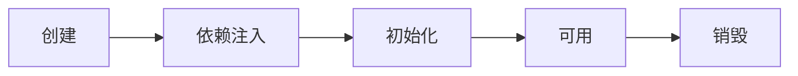

创建前后的增强

* postProcessBeforeInstantiation
  * 这里返回的对象若不为 null 会替换掉原本的 bean，并且仅会走 postProcessAfterInitialization 流程
* postProcessAfterInstantiation
  * 这里如果返回 false 会跳过依赖注入阶段

依赖注入前的增强

* postProcessProperties
  * 如 @Autowired、@Value、@Resource 

初始化前后的增强

* postProcessBeforeInitialization
  * 这里返回的对象会替换掉原本的 bean
  * 如 @PostConstruct、@ConfigurationProperties
* postProcessAfterInitialization 
  * 这里返回的对象会替换掉原本的 bean
  * 如代理增强

销毁之前的增强

* postProcessBeforeDestruction
  * 如 @PreDestroy 


1. Spring bean 生命周期各个阶段
2. 模板设计模式, 指大流程已经固定好了, 通过接口回调（bean 后处理器）在一些关键点前后提供扩展


#### MyBeanPostProcessor

```java
@Component
public class MyBeanPostProcessor implements InstantiationAwareBeanPostProcessor, DestructionAwareBeanPostProcessor {

    @Override
    public void postProcessBeforeDestruction(Object bean, String beanName) throws BeansException {
        if (beanName.equals("lifeCycleBean"))
            System.out.println("<<<<<< 销毁之前执行, 如 @PreDestroy");
    }

    @Override
    public Object postProcessBeforeInstantiation(Class<?> beanClass, String beanName) throws BeansException {
        if (beanName.equals("lifeCycleBean"))
            System.out.println("<<<<<< 实例化之前执行, 这里返回的对象会替换掉原本的 bean");
        return null;
    }

    @Override
    public boolean postProcessAfterInstantiation(Object bean, String beanName) throws BeansException {
        if (beanName.equals("lifeCycleBean")) {
            System.out.println("<<<<<< 实例化之后执行, 这里如果返回 false 会跳过依赖注入阶段");
//            return false;
        }
        return true;
    }

    @Override
    public PropertyValues postProcessProperties(PropertyValues pvs, Object bean, String beanName) throws BeansException {
        if (beanName.equals("lifeCycleBean"))
            System.out.println("<<<<<< 依赖注入阶段执行, 如 @Autowired、@Value、@Resource");
        return pvs;
    }

    @Override
    public Object postProcessBeforeInitialization(Object bean, String beanName) throws BeansException {
        if (beanName.equals("lifeCycleBean"))
            System.out.println("<<<<<< 初始化之前执行, 这里返回的对象会替换掉原本的 bean, 如 @PostConstruct、@ConfigurationProperties");
        return bean;
    }

    @Override
    public Object postProcessAfterInitialization(Object bean, String beanName) throws BeansException {
        if (beanName.equals("lifeCycleBean"))
            System.out.println("<<<<<< 初始化之后执行, 这里返回的对象会替换掉原本的 bean, 如代理增强");
        return bean;
    }
}
```


#### LifeCycleBean

```java
@Component
public class LifeCycleBean {

    public LifeCycleBean(){
        System.out.println("构造");
    }

    /**
     * String 类型使用 @Autowired 不会进行注入，使用 @Value 进行注入
     */
    @Autowired
    public void autowired(@Value("${Path}") String value){
        System.out.printf("依赖注入：%s\n", value);
    }

    @PostConstruct
    public void init(){
        System.out.println("初始化");
    }

    @PreDestroy
    public void destroy(){
        System.out.println("销毁");
    }

}

```


#### Application

```java
@SpringBootApplication
public class Application {

    public static void main(String[] args) {
        ConfigurableApplicationContext context = SpringApplication.run(Application.class, args);
//        context.addBeanFactoryPostProcessor();
        context.close();
    }


}
```


### Bean 后处理器

#### 作用

为 Bean 生命周期各个阶段提供扩展


#### 常见的后处理器

1. @Autowired 等注解的解析属于 bean 生命周期阶段（依赖注入, 初始化）的扩展功能，这些扩展功能由 bean 后处理器来完成
2. 每个后处理器各自增强什么功能
   * AutowiredAnnotationBeanPostProcessor 解析 @Autowired 与 @Value
   * CommonAnnotationBeanPostProcessor 解析 @Resource、@PostConstruct、@PreDestroy
   * ConfigurationPropertiesBindingPostProcessor 解析 @ConfigurationProperties
3. 另外 ContextAnnotationAutowireCandidateResolver 负责获取 @Value 的值，解析 @Qualifier、泛型、@Lazy 等

##### Bean1

```java
public class Bean1 {
    private static final Logger log = LoggerFactory.getLogger(Bean1.class);

    private Bean2 bean2;

    @Autowired
    public void setBean2(Bean2 bean2) {
        log.debug("@Autowired 生效: {}", bean2);
        this.bean2 = bean2;
    }

    @Autowired
    private Bean3 bean3;

    @Resource
    public void setBean3(Bean3 bean3) {
        log.debug("@Resource 生效: {}", bean3);
        this.bean3 = bean3;
    }

    private String home;

    @Autowired
    public void setHome(@Value("${JAVA_HOME}") String home) {
        log.debug("@Value 生效: {}", home);
        this.home = home;
    }

    @PostConstruct
    public void init() {
        log.debug("@PostConstruct 生效");
    }

    @PreDestroy
    public void destroy() {
        log.debug("@PreDestroy 生效");
    }

    @Override
    public String toString() {
        return "Bean1{" +
               "bean2=" + bean2 +
               ", bean3=" + bean3 +
               ", home='" + home + '\'' +
               '}';
    }
}

```


##### Bean2

```java
public class Bean2 {
}

```


##### Bean3

```java
public class Bean3 {
}

```


##### Bean4

```java
/*
    java.home=
    java.version=
 */
@ConfigurationProperties(prefix = "java")
public class Bean4 {

    private String home;

    private String version;

    public String getHome() {
        return home;
    }

    public void setHome(String home) {
        this.home = home;
    }

    public String getVersion() {
        return version;
    }

    public void setVersion(String version) {
        this.version = version;
    }

    @Override
    public String toString() {
        return "Bean4{" +
               "home='" + home + '\'' +
               ", version='" + version + '\'' +
               '}';
    }
}

```


##### Application

```java
@SpringBootApplication
public class Application {

    public static void main(String[] args) {
        // GenericApplicationContext 是一个【干净】的容器，没有添加额外的处理器
        GenericApplicationContext context = new GenericApplicationContext();

        // 用原始方法注册三个 bean
        context.registerBean("bean1", Bean1.class);
        context.registerBean("bean2", Bean2.class);
        context.registerBean("bean3", Bean3.class);
        context.registerBean("bean4", Bean4.class);

        context.getDefaultListableBeanFactory().setAutowireCandidateResolver(new ContextAnnotationAutowireCandidateResolver());
        context.registerBean(AutowiredAnnotationBeanPostProcessor.class); // @Autowired @Value

        context.registerBean(CommonAnnotationBeanPostProcessor.class); // @Resource @PostConstruct @PreDestroy

        ConfigurationPropertiesBindingPostProcessor.register(context.getDefaultListableBeanFactory()); // @ConfigurationProperties

        // 初始化容器
        context.refresh(); // 执行beanFactory后处理器, 添加bean后处理器, 初始化所有单例

        System.out.println(context.getBean(Bean1.class));
        System.out.println(context.getBean(Bean4.class));

        // 销毁容器
        context.close();

        /*
            学到了什么
                a. @Autowired 等注解的解析属于 bean 生命周期阶段(依赖注入, 初始化)的扩展功能
                b. 这些扩展功能由 bean 后处理器来完成
         */
    }

}
```


#### @Autowired Bean 后处理器执行分析

1. AutowiredAnnotationBeanPostProcessor.findAutowiringMetadata 用来获取某个 bean 上加了 @Value @Autowired 的成员变量，方法参数的信息，表示为 InjectionMetadata
2. InjectionMetadata 可以完成依赖注入
3. InjectionMetadata 内部根据成员变量，方法参数封装为 DependencyDescriptor 类型
4. 有了 DependencyDescriptor，就可以利用 beanFactory.doResolveDependency 方法进行基于类型的查找


```java
// AutowiredAnnotationBeanPostProcessor 运行分析
public class DigInAutowired {
    public static void main(String[] args) throws Throwable {
        DefaultListableBeanFactory beanFactory = new DefaultListableBeanFactory();
        beanFactory.registerSingleton("bean2", new Bean2()); // 此方法注册 bean 工厂不会再进行创建过程,依赖注入,初始化
        beanFactory.registerSingleton("bean3", new Bean3());
        beanFactory.setAutowireCandidateResolver(new ContextAnnotationAutowireCandidateResolver()); // @Value
        beanFactory.addEmbeddedValueResolver(new StandardEnvironment()::resolvePlaceholders); // ${} 的解析器

        // 1. 查找哪些属性、方法加了 @Autowired, 这称之为 InjectionMetadata
        AutowiredAnnotationBeanPostProcessor processor = new AutowiredAnnotationBeanPostProcessor();
        processor.setBeanFactory(beanFactory);

        Bean1 bean1 = new Bean1();
//        System.out.println(bean1);
//        processor.postProcessProperties(null, bean1, "bean1"); // 执行依赖注入 @Autowired @Value
//        System.out.println(bean1);

        Method findAutowiringMetadata = AutowiredAnnotationBeanPostProcessor.class.getDeclaredMethod("findAutowiringMetadata", String.class, Class.class, PropertyValues.class);
        findAutowiringMetadata.setAccessible(true);
        InjectionMetadata metadata = (InjectionMetadata) findAutowiringMetadata.invoke(processor, "bean1", Bean1.class, null);// 获取 Bean1 上加了 @Value @Autowired 的成员变量，方法参数信息
        System.out.println(metadata);

//         2. 调用 InjectionMetadata 来进行依赖注入, 注入时按类型查找值
        metadata.inject(bean1, "bean1", null);
        System.out.println(bean1);

        // metadata.inject 执行流程，如何按类型查找值
//        成员变量
//        Field bean3 = Bean1.class.getDeclaredField("bean3");
//        DependencyDescriptor dd1 = new DependencyDescriptor(bean3, false);
//        Object o = beanFactory.doResolveDependency(dd1, null, null, null);
//        System.out.println(o);
//
//        方法参数
//        Method setBean2 = Bean1.class.getDeclaredMethod("setBean2", Bean2.class);
//        DependencyDescriptor dd2 =
//                new DependencyDescriptor(new MethodParameter(setBean2, 0), true);
//        Object o1 = beanFactory.doResolveDependency(dd2, null, null, null);
//        System.out.println(o1);
//
//        值注入
//        Method setHome = Bean1.class.getDeclaredMethod("setHome", String.class);
//        DependencyDescriptor dd3 = new DependencyDescriptor(new MethodParameter(setHome, 0), true);
//        Object o2 = beanFactory.doResolveDependency(dd3, null, null, null);
//        System.out.println(o2);

    }
}

```


### BeanFactory 后处理器

#### 作用

为 BeanFactory 提供扩展


#### 常见的后处理器


* ConfigurationClassPostProcessor 可以解析
  * @ComponentScan
  * @Bean
  * @Import
  * @ImportResource
* MapperScannerConfigurer 可以解析
  * Mapper 接口


1. @ComponentScan, @Bean, @Mapper 等注解的解析属于核心容器（即 BeanFactory）的扩展功能
2. 这些扩展功能由不同的 BeanFactory 后处理器来完成，其实主要就是补充了一些 bean 定义


##### 示例

###### Config

```java
@Configuration
@ComponentScan(basePackages = "cn.example.uums.test.a05.component")
public class Config {
    @Bean
    public Bean1 bean1() {
        return new Bean1();
    }

    @Bean
    public SqlSessionFactoryBean sqlSessionFactoryBean(DataSource dataSource) {
        SqlSessionFactoryBean sqlSessionFactoryBean = new SqlSessionFactoryBean();
        sqlSessionFactoryBean.setDataSource(dataSource);
        return sqlSessionFactoryBean;
    }

    @Bean(initMethod = "init")
    public DruidDataSource dataSource() {
        DruidDataSource dataSource = new DruidDataSource();
        dataSource.setUrl("jdbc:mysql://192.168.31.100:3306/test");
        dataSource.setUsername("root");
        dataSource.setPassword("mysql");
        return dataSource;
    }
}
```

###### Bean1

```java
public class Bean1 {

    private static final Logger log = LoggerFactory.getLogger(Bean1.class);

    public Bean1() {
        log.debug("我被 Spring 管理啦");
    }
}

```

###### Bean2

```java
@Component
public class Bean2 {

    private static final Logger log = LoggerFactory.getLogger(Bean2.class);

    public Bean2() {
        log.debug("我被 Spring 管理啦");
    }
}
```

###### Bean3

```java
@Controller
public class Bean3 {

    private static final Logger log = LoggerFactory.getLogger(Bean3.class);

    public Bean3() {
        log.debug("我被 Spring 管理啦");
    }
}
```

###### Mapper1

```java
@Mapper
public interface Mapper1 {
}
```

###### Mapper2

```java
@Mapper
public interface Mapper2 {
}
```

###### Application

```java
public class Application {
    public static void main(String[] args) throws IOException {

        // GenericApplicationContext 是一个【干净】的容器
        GenericApplicationContext context = new GenericApplicationContext();
        context.registerBean("config", Config.class);
        context.registerBean(ConfigurationClassPostProcessor.class); // @ComponentScan @Bean @Import @ImportResource
        context.registerBean(MapperScannerConfigurer.class, bd -> { // @MapperScanner
            bd.getPropertyValues().add("basePackage", "cn.example.uums.test.a05.mapper");
        });

        // 初始化容器
        context.refresh();

        for (String name : context.getBeanDefinitionNames()) {
            System.out.println(name);
        }

        // 销毁容器
        context.close();
    }
}

```


##### ConfigurationClassPostProcessor

1. Spring 操作元数据的工具类 CachingMetadataReaderFactory
2. 通过注解元数据（AnnotationMetadata）获取直接或间接标注的注解信息
3. 通过类元数据（ClassMetadata）获取类名，AnnotationBeanNameGenerator 生成 bean 名
4. 解析元数据是基于 ASM 技术


###### 实现原理

```java
public class Application {
    public static void main(String[] args) throws IOException {

        // GenericApplicationContext 是一个【干净】的容器
        GenericApplicationContext context = new GenericApplicationContext();
        context.registerBean("config", Config.class);
        // 后处理器 ConfigurationClassPostProcessor 原理示例
        CachingMetadataReaderFactory metadataReaderFactory = new CachingMetadataReaderFactory();
        AnnotationBeanNameGenerator beanNameGenerator = new AnnotationBeanNameGenerator();
        if(Config.class.isAnnotationPresent(ComponentScan.class)){
            ComponentScan componentScan = Config.class.getAnnotation(ComponentScan.class);
            for (String basePackage : componentScan.basePackages()) {
                System.out.println(basePackage);
                // cn.example.uums.test.a05.component classpath*:cn/example/uums/test/a05/component/**/*.class
                String path = "classpath*:".concat(basePackage.replace('.','/')).concat("/**/*.class");
                System.out.println(path);
                Resource[] resources = context.getResources(path);
                for(Resource resource:resources){
//                    System.out.println(resource);
                    MetadataReader reader = metadataReaderFactory.getMetadataReader(resource);
                    System.out.println("类名:"+reader.getClassMetadata().getClassName());
                    System.out.println("Component:"+reader.getAnnotationMetadata().hasAnnotation(Component.class.getName()));
                    System.out.println("Component 派生:"+reader.getAnnotationMetadata().hasMetaAnnotation(Component.class.getName()));
                    if(reader.getAnnotationMetadata().hasAnnotation(Component.class.getName())
                    || reader.getAnnotationMetadata().hasMetaAnnotation(Component.class.getName())){
                        AbstractBeanDefinition abd = BeanDefinitionBuilder.genericBeanDefinition(reader.getClassMetadata().getClassName()).getBeanDefinition();
                        DefaultListableBeanFactory beanFactory = context.getDefaultListableBeanFactory();
                        String beanName = beanNameGenerator.generateBeanName(abd, beanFactory);
                        beanFactory.registerBeanDefinition(beanName, abd);
                    }
                }
            }
        }
        // 初始化容器
        context.refresh();
        for (String name : context.getBeanDefinitionNames()) {
            System.out.println(name);
        }
        // 销毁容器
        context.close();
    }
}
```


###### 自定义后处理器

```java
public class ComponentScanPostProcessor implements BeanDefinitionRegistryPostProcessor {

    // context.refresh(); 调用时会回调该方法
    @Override
    public void postProcessBeanDefinitionRegistry(BeanDefinitionRegistry beanFactory) throws BeansException {
        // 后处理器 ConfigurationClassPostProcessor 原理示例
        CachingMetadataReaderFactory metadataReaderFactory = new CachingMetadataReaderFactory();
        AnnotationBeanNameGenerator beanNameGenerator = new AnnotationBeanNameGenerator();
        if(Config.class.isAnnotationPresent(ComponentScan.class)){
            ComponentScan componentScan = Config.class.getAnnotation(ComponentScan.class);
            for (String basePackage : componentScan.basePackages()) {
                System.out.println(basePackage);
                // cn.example.uums.test.a05.component classpath*:cn/example/uums/test/a05/component/**/*.class
                String path = "classpath*:".concat(basePackage.replace('.','/')).concat("/**/*.class");
                System.out.println(path);
                try{
                    Resource[] resources = new PathMatchingResourcePatternResolver().getResources(path);
                    for(Resource resource:resources){
//                    System.out.println(resource);
                        MetadataReader reader = metadataReaderFactory.getMetadataReader(resource);
                        System.out.println("类名:"+reader.getClassMetadata().getClassName());
                        System.out.println("Component:"+reader.getAnnotationMetadata().hasAnnotation(Component.class.getName()));
                        System.out.println("Component 派生:"+reader.getAnnotationMetadata().hasMetaAnnotation(Component.class.getName()));
                        if(reader.getAnnotationMetadata().hasAnnotation(Component.class.getName())
                                || reader.getAnnotationMetadata().hasMetaAnnotation(Component.class.getName())){
                            AbstractBeanDefinition abd = BeanDefinitionBuilder.genericBeanDefinition(reader.getClassMetadata().getClassName()).getBeanDefinition();
                            String beanName = beanNameGenerator.generateBeanName(abd, beanFactory);
                            beanFactory.registerBeanDefinition(beanName, abd);

                        }
                    }
                } catch (IOException e){
                    e.printStackTrace();
                }

            }
        }

    }
    @Override
    public void postProcessBeanFactory(ConfigurableListableBeanFactory configurableListableBeanFactory) throws BeansException {

    }
}

```

```java
public class Application {
    public static void main(String[] args) throws IOException {

        // GenericApplicationContext 是一个【干净】的容器
        GenericApplicationContext context = new GenericApplicationContext();
        context.registerBean("config", Config.class);

        context.registerBean(ComponentScanPostProcessor.class); // 解析 @ComponentScan

        // 初始化容器
        context.refresh();

        for (String name : context.getBeanDefinitionNames()) {
            System.out.println(name);
        }

        // 销毁容器
        context.close();

    }
}
```


#### @Bean 实现

##### 实现原理

```java
public class Application {

    public static void main(String[] args) throws IOException {

        // GenericApplicationContext 是一个【干净】的容器
        GenericApplicationContext context = new GenericApplicationContext();
        context.registerBean("config", Config.class);
        // 后处理器 ConfigurationClassPostProcessor 原理示例
        CachingMetadataReaderFactory metadataReaderFactory = new CachingMetadataReaderFactory();
        AnnotationBeanNameGenerator beanNameGenerator = new AnnotationBeanNameGenerator();
        MetadataReader reader = metadataReaderFactory.getMetadataReader(new ClassPathResource("cn/example/uums/test/a05/Config.class"));
        Set<MethodMetadata> methodMetadataSet = reader.getAnnotationMetadata().getAnnotatedMethods(Bean.class.getName());
        for(MethodMetadata methodMetadata:methodMetadataSet){
            System.out.println(methodMetadata.getMethodName());
            String initMethod = methodMetadata.getAnnotationAttributes(Bean.class.getName()).get("initMethod").toString();

            BeanDefinitionBuilder builder = BeanDefinitionBuilder.genericBeanDefinition()
                    .setFactoryMethodOnBean(methodMetadata.getMethodName(), "config")
                    // 配置自动装配模式，需要参数的方法能自动装配,构造方法/工厂方法选择 AUTOWIRE_CONSTRUCTOR
                    .setAutowireMode(AbstractBeanDefinition.AUTOWIRE_CONSTRUCTOR);
            if(null != initMethod){
                builder.setInitMethodName(initMethod);
            }

            AbstractBeanDefinition abd = builder.getBeanDefinition();
            DefaultListableBeanFactory beanFactory = context.getDefaultListableBeanFactory();
            String beanName = methodMetadata.getMethodName();
            beanFactory.registerBeanDefinition(beanName, abd);
        }

        // 初始化容器
        context.refresh();

        for (String name : context.getBeanDefinitionNames()) {
            System.out.println(name);
        }

        // 销毁容器
        context.close();

    }
}
```


##### 自定义后处理器

```java
public class BeanPostProcessor implements BeanDefinitionRegistryPostProcessor {
    @Override
    public void postProcessBeanDefinitionRegistry(BeanDefinitionRegistry beanFactory) throws BeansException {
        CachingMetadataReaderFactory metadataReaderFactory = new CachingMetadataReaderFactory();
        MetadataReader reader = null;
        try {
            reader = metadataReaderFactory.getMetadataReader(new ClassPathResource("cn/example/uums/test/a05/Config.class"));
        } catch (IOException e) {
            e.printStackTrace();
        }
        Set<MethodMetadata> methodMetadataSet = reader.getAnnotationMetadata().getAnnotatedMethods(Bean.class.getName());
        for(MethodMetadata methodMetadata:methodMetadataSet){
            System.out.println(methodMetadata.getMethodName());
            String initMethod = methodMetadata.getAnnotationAttributes(Bean.class.getName()).get("initMethod").toString();

            BeanDefinitionBuilder builder = BeanDefinitionBuilder.genericBeanDefinition()
                    .setFactoryMethodOnBean(methodMetadata.getMethodName(), "config")
                    // 配置自动装配模式，需要参数的方法能自动装配,构造方法/工厂方法选择 AUTOWIRE_CONSTRUCTOR
                    .setAutowireMode(AbstractBeanDefinition.AUTOWIRE_CONSTRUCTOR);
            if(null != initMethod){
                builder.setInitMethodName(initMethod);
            }

            AbstractBeanDefinition abd = builder.getBeanDefinition();
            String beanName = methodMetadata.getMethodName();
            beanFactory.registerBeanDefinition(beanName, abd);
        }
    }
    @Override
    public void postProcessBeanFactory(ConfigurableListableBeanFactory configurableListableBeanFactory) throws BeansException {

    }
}
```

```java
public class Application {
    public static void main(String[] args) throws IOException {

        // GenericApplicationContext 是一个【干净】的容器
        GenericApplicationContext context = new GenericApplicationContext();
        context.registerBean("config", Config.class);
        // 后处理器 ConfigurationClassPostProcessor 原理示例

        context.registerBean(BeanPostProcessor.class); // 解析 @Bean

        // 初始化容器
        context.refresh();

        for (String name : context.getBeanDefinitionNames()) {
            System.out.println(name);
        }

        // 销毁容器
        context.close();

    }
}
```


#### Mapper 实现


##### 自定义后处理器

1. Mapper 接口被 Spring 管理的本质：实际是被作为 MapperFactoryBean 注册到容器中
2. Spring 的诡异做法，根据接口生成的 BeanDefinition 仅为根据接口名生成 bean 名

```java
public class MapperPostProcessor implements BeanDefinitionRegistryPostProcessor {

    @Override
    public void postProcessBeanDefinitionRegistry(BeanDefinitionRegistry beanFactory) throws BeansException {
        try {
            PathMatchingResourcePatternResolver resolver = new PathMatchingResourcePatternResolver();
            Resource[] resources = resolver.getResources("classpath:cn/example/uums/test/a05/mapper/**/*.class");
            AnnotationBeanNameGenerator generator = new AnnotationBeanNameGenerator();
            CachingMetadataReaderFactory factory = new CachingMetadataReaderFactory();
            for (Resource resource : resources) {
                MetadataReader reader = factory.getMetadataReader(resource);
                ClassMetadata classMetadata = reader.getClassMetadata();
                if (classMetadata.isInterface()) {
                    AbstractBeanDefinition bd = BeanDefinitionBuilder.genericBeanDefinition(MapperFactoryBean.class)
                            .addConstructorArgValue(classMetadata.getClassName())
                            .setAutowireMode(AbstractBeanDefinition.AUTOWIRE_BY_TYPE)
                            .getBeanDefinition();
                    String name = generator.generateBeanName(
                            BeanDefinitionBuilder.genericBeanDefinition(classMetadata.getClassName()).getBeanDefinition(),
                            beanFactory);
                    beanFactory.registerBeanDefinition(name, bd);
                }
            }
        } catch (IOException e) {
            e.printStackTrace();
        }

    }

    @Override
    public void postProcessBeanFactory(ConfigurableListableBeanFactory beanFactory) throws BeansException {

    }
}
```


```java
public class A05 {
    private static final Logger log = LoggerFactory.getLogger(A05.class);

    public static void main(String[] args) throws IOException {

        // GenericApplicationContext 是一个【干净】的容器
        GenericApplicationContext context = new GenericApplicationContext();
        context.registerBean("config", Config.class);
        // 后处理器 MapperScannerConfigurer 原理示例

        context.registerBean(BeanPostProcessor.class); // 解析 @Bean
        context.registerBean(MapperPostProcessor.class); // 解析 Mapper 接口

        // 初始化容器
        context.refresh();

        for (String name : context.getBeanDefinitionNames()) {
            System.out.println(name);
        }

        // 销毁容器
        context.close();

    }
}

```


### Aware 接口

#### Aware 接口及 InitializingBean 接口

1. Aware 接口提供了一种【内置】 的注入手段，例如
   * BeanNameAware 注入 bean 的名字
   * BeanFactoryAware 注入 BeanFactory 容器
   * ApplicationContextAware 注入 ApplicationContext 容器
   * EmbeddedValueResolverAware 注入 ${} 解析器
2. InitializingBean 接口提供了一种【内置】的初始化手段
3. 对比
   * 内置的注入和初始化不受扩展功能的影响，总会被执行
   * 而扩展功能受某些情况影响可能会失效
   * 因此 Spring 框架内部的类常用内置注入和初始化


MyBean

```java
public class MyBean implements BeanNameAware, ApplicationContextAware, InitializingBean {

    private static final Logger log = LoggerFactory.getLogger(MyBean.class);

    @Override
    public void setBeanName(String name) {
        log.debug("当前bean " + this + " 名字叫:" + name);
    }

    @Override
    public void setApplicationContext(ApplicationContext applicationContext) throws BeansException {
        log.debug("当前bean " + this + " 容器是:" + applicationContext);
    }

    @Override
    public void afterPropertiesSet() throws Exception {
        log.debug("当前bean " + this + " 初始化");
    }

    @Autowired
    public void aaa(ApplicationContext applicationContext) {
        log.debug("当前bean " + this + " 使用@Autowired 容器是:" + applicationContext);
    }

    @PostConstruct
    public void init() {
        log.debug("当前bean " + this + " 使用@PostConstruct 初始化");
    }
}
```


Application

```java
/*
    Aware 接口及 InitializingBean 接口
 */
public class Application {
    public static void main(String[] args) {
        /*
            1. Aware 接口用于注入一些与容器相关信息, 例如
                a. BeanNameAware 注入 bean 的名字
                b. BeanFactoryAware 注入 BeanFactory 容器
                c. ApplicationContextAware 注入 ApplicationContext 容器
                d. EmbeddedValueResolverAware ${}
         */
        GenericApplicationContext context = new GenericApplicationContext();
        context.registerBean("myBean", MyBean.class);
        context.registerBean(AutowiredAnnotationBeanPostProcessor.class);

        /*
            2. 有同学说: b、c、d 的功能用 @Autowired 就能实现啊, 为啥还要用 Aware 接口呢
            简单地说:
                a. @Autowired 的解析需要用到 bean 后处理器, 属于扩展功能
                b. 而 Aware 接口属于内置功能, 不加任何扩展, Spring 就能识别
            某些情况下, 扩展功能会失效, 而内置功能不会失效
         */

        context.refresh(); // 1. beanFactory 后处理器,  2. 添加 bean 后处理器, 3. 初始化单例
        context.close();

        /*
            a. Aware 接口提供了一种【内置】 的注入手段, 可以注入 BeanFactory, ApplicationContext
            b. InitializingBean 接口提供了一种【内置】的初始化手段
            c. 内置的注入和初始化不受扩展功能的影响, 总会被执行, 因此 Spring 框架内部的类常用它们
         */
    }
}
```


#### 配置类 @Autowired 失效分析

Java 配置类不包含 BeanFactoryPostProcessor 的情况

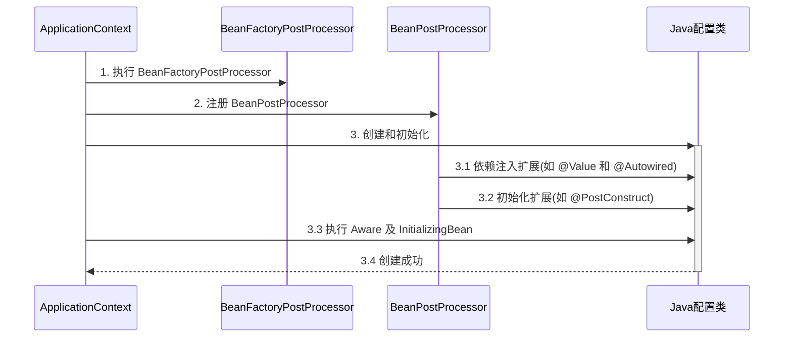

Java 配置类包含 BeanFactoryPostProcessor 的情况，因此要创建其中的 BeanFactoryPostProcessor 必须提前创建 Java 配置类，而此时的 BeanPostProcessor 还未准备好，导致 @Autowired 等注解失效

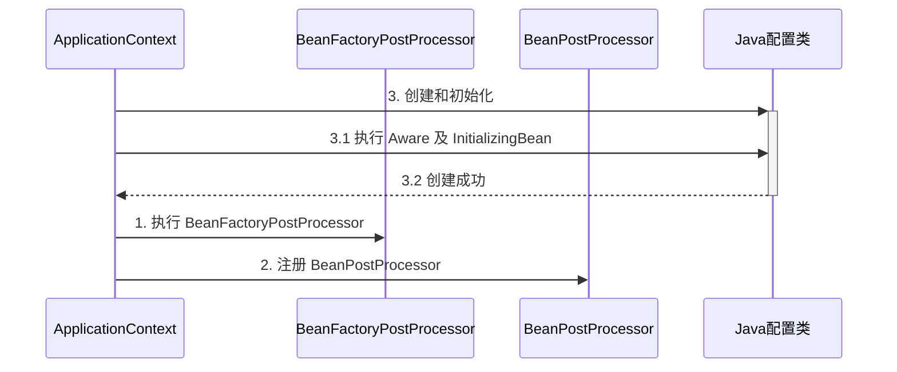

MyConfig1

```java
@Configuration
public class MyConfig1 {

    private static final Logger log = LoggerFactory.getLogger(MyConfig1.class);

    @Autowired
    public void setApplicationContext(ApplicationContext applicationContext) {
        log.debug("注入 ApplicationContext");
    }

    @PostConstruct
    public void init() {
        log.debug("初始化");
    }

    @Bean //  beanFactory 后处理器
    public BeanFactoryPostProcessor processor1() {
        return beanFactory -> {
            log.debug("执行 processor1");
        };
    }

}
```


Application

```java
/*
    Aware 接口及 InitializingBean 接口
 */
public class Application {
    public static void main(String[] args) {
        GenericApplicationContext context = new GenericApplicationContext();
        context.registerBean("myConfig1", MyConfig1.class);
        context.registerBean(AutowiredAnnotationBeanPostProcessor.class);
        context.registerBean(CommonAnnotationBeanPostProcessor.class);
        context.registerBean(ConfigurationClassPostProcessor.class);

        /*
            你会发现用 Aware 注入 ApplicationContext 成功, 而 @Autowired 注入 ApplicationContext 失败
         */

        context.refresh(); // 1. beanFactory 后处理器,  2. 添加 bean 后处理器, 3. 初始化单例
        context.close();
    }
}
```


> ***注意***
>
> 解决方法：
>
> * 用内置依赖注入和初始化取代扩展依赖注入和初始化
> * 用静态工厂方法代替实例工厂方法，避免工厂对象提前被创建


### 初始化与销毁

Bean1

```java
public class Bean1 implements InitializingBean {
    private static final Logger log = LoggerFactory.getLogger(Bean1.class);

    @PostConstruct
    public void init1() {
        log.debug("初始化1");
    }

    @Override
    public void afterPropertiesSet() throws Exception {
        log.debug("初始化2");
    }

    public void init3() {
        log.debug("初始化3");
    }
}

```

Bean2

```java
public class Bean2 implements DisposableBean {
    private static final Logger log = LoggerFactory.getLogger(Bean2.class);

    @PreDestroy
    public void destroy1() {
        log.debug("销毁1");
    }

    @Override
    public void destroy() throws Exception {
        log.debug("销毁2");
    }

    public void destroy3() {
        log.debug("销毁3");
    }
}
```

Application

```java
/*
    初始化和销毁的执行顺序
 */
@SpringBootApplication
public class Application {

    public static void main(String[] args) {
        ConfigurableApplicationContext context = SpringApplication.run(Application.class, args);
        context.close();
        /*
            学到了什么
                a. Spring 提供了多种初始化和销毁手段
                b. Spring 的面试有多么地卷
         */
    }

    @Bean(initMethod = "init3")
    public Bean1 bean1() {
        return new Bean1();
    }

    @Bean(destroyMethod = "destroy3")
    public Bean2 bean2() {
        return new Bean2();
    }
}
```


#### 多种初始化手段

Spring 提供了多种初始化手段，除了 @PostConstruct，@Bean(initMethod) 之外，还可以实现 InitializingBean 接口来进行初始化，如果同一个 bean 用了以上手段声明了 3 个初始化方法，那么它们的执行顺序是

1. @PostConstruct 标注的初始化方法
2. InitializingBean 接口的初始化方法
3. @Bean(initMethod) 指定的初始化方法

#### 执行顺序


与初始化类似，Spring 也提供了多种销毁手段，执行顺序为

1. @PreDestroy 标注的销毁方法
2. DisposableBean 接口的销毁方法
3. @Bean(destroyMethod) 指定的销毁方法


### Scope 

#### Scope 类型

在当前版本(5.3.10)的 Spring 和 Spring Boot 程序中，支持五种 Scope

* singleton，容器启动时创建（未设置延迟），容器关闭时销毁
* prototype，每次使用时创建，不会自动销毁，需要调用 DefaultListableBeanFactory.destroyBean(bean) 销毁
* request，每次请求用到此 bean 时创建，请求结束时销毁
* session，每个会话用到此 bean 时创建，会话结束时销毁
* application，web 容器用到此 bean 时创建，容器停止时销毁

有些文章提到有 globalSession 这一 Scope，也是陈旧的说法，目前 Spring 中已废弃


但要注意，如果在 singleton 注入其它 scope 都会有问题，解决方法有

* @Lazy
* @Scope(proxyMode = ScopedProxyMode.TARGET_CLASS)
* ObjectFactory
* ApplicationContext.getBean


BeanForSession

```java
@Scope("session")
@Component
public class BeanForSession {
    private static final Logger log = LoggerFactory.getLogger(BeanForSession.class);

    @PreDestroy
    public void destroy() {
        log.debug("destroy");
    }
}
```

BeanForRequest

```java
@Scope("request")
@Component
public class BeanForRequest {
    private static final Logger log = LoggerFactory.getLogger(BeanForRequest.class);

    @PreDestroy
    public void destroy() {
        log.debug("destroy");
    }

}
```

BeanForApplication

```java
@Scope("application")
@Component
public class BeanForApplication {
    private static final Logger log = LoggerFactory.getLogger(BeanForApplication.class);

    @PreDestroy
    public void destroy() {
        log.debug("destroy");
    }
}
```

MyController

```java
@RestController
public class MyController {

    @Lazy
    @Autowired
    private BeanForRequest beanForRequest;

    @Lazy
    @Autowired
    private BeanForSession beanForSession;

    @Lazy
    @Autowired
    private BeanForApplication beanForApplication;

    @GetMapping(value = "/test", produces = "text/html")
    public String test(HttpServletRequest request, HttpSession session) {
        ServletContext sc = request.getServletContext();
        String sb = "<ul>" +
                    "<li>" + "request scope:" + beanForRequest + "</li>" +
                    "<li>" + "session scope:" + beanForSession + "</li>" +
                    "<li>" + "application scope:" + beanForApplication + "</li>" +
                    "</ul>";
        return sb;
    }

}
```

Application

```java
/*
    singleton, prototype, request, session, application

    jdk >= 9 如果反射调用 jdk 中方法
    jdk <= 8 不会有问题

    演示 request, session, application 作用域
    打开不同的浏览器, 刷新 http://localhost:8080/test 即可查看效果
    如果 jdk > 8, 运行时请添加 --add-opens java.base/java.lang=ALL-UNNAMED
 */
@SpringBootApplication
public class Application {
    public static void main(String[] args) {
        SpringApplication.run(A08.class, args);
        /*
            学到了什么
                a. 有几种 scope
                b. 在 singleton 中使用其它几种 scope 的方法
                c. 其它 scope 的销毁
                    1. 可以将通过 server.servlet.session.timeout=10s 观察 session bean 的销毁
                    2. ServletContextScope 销毁机制疑似实现有误
         */
    }
}
```

* 打开不同的浏览器, 刷新 http://localhost:8080/test 即可查看效果
* 如果 jdk > 8, 运行时请添加 --add-opens java.base/java.lang=ALL-UNNAMED


1. 有几种 scope
2. 在 singleton 中使用其它几种 scope 的方法
3. 其它 scope 的销毁时机
   * 可以将通过 server.servlet.session.timeout=30s 观察 session bean 的销毁
   * ServletContextScope 销毁机制疑似实现有误


#### singleton 注入其它 scope 失效

以单例注入多例为例

有一个单例对象 E

```java
@Component
public class E {
    private static final Logger log = LoggerFactory.getLogger(E.class);

    private F f;

    public E() {
        log.info("E()");
    }

    @Autowired
    public void setF(F f) {
        this.f = f;
        log.info("setF(F f) {}", f.getClass());
    }

    public F getF() {
        return f;
    }
}
```

要注入的对象 F 期望是多例

```java
@Component
@Scope("prototype")
public class F {
    private static final Logger log = LoggerFactory.getLogger(F.class);

    public F() {
        log.info("F()");
    }
}
```

测试

```java
E e = context.getBean(E.class);
F f1 = e.getF();
F f2 = e.getF();
System.out.println(f1);
System.out.println(f2);
```

输出

```
com.itheima.demo.cycle.F@6622fc65
com.itheima.demo.cycle.F@6622fc65
```

发现它们是同一个对象，而不是期望的多例对象


对于单例对象来讲，依赖注入仅发生了一次，后续再没有用到多例的 F，因此 E 用的始终是第一次依赖注入的 F

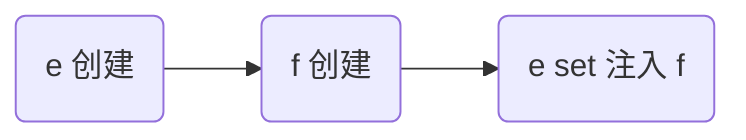

解决

* 仍然使用 @Lazy 生成代理
* 代理对象虽然还是同一个，但当每次**使用代理对象的任意方法**时，由代理创建新的 f 对象

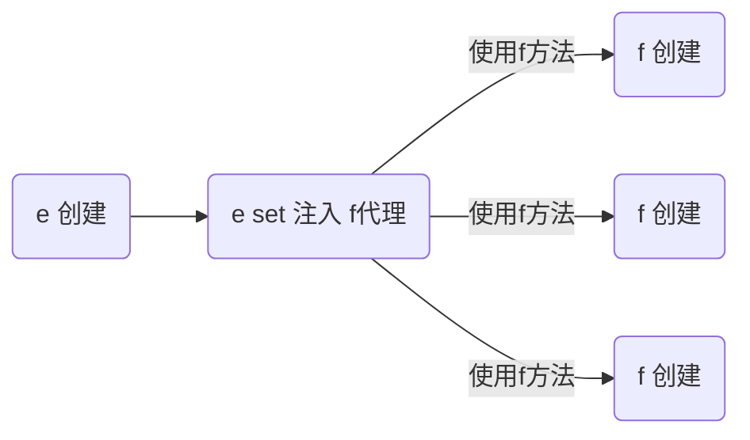

```java
@Component
public class E {

    @Autowired
    @Lazy
    public void setF(F f) {
        this.f = f;
        log.info("setF(F f) {}", f.getClass());
    }

    // ...
}
```

> ***注意***
>
> * @Lazy 加在也可以加在成员变量上，但加在 set 方法上的目的是可以观察输出，加在成员变量上就不行了
> * @Autowired 加在 set 方法的目的类似

输出

```
E: setF(F f) class com.itheima.demo.cycle.F$$EnhancerBySpringCGLIB$$8b54f2bc
F: F()
com.itheima.demo.cycle.F@3a6f2de3
F: F()
com.itheima.demo.cycle.F@56303b57
```

从输出日志可以看到调用 setF 方法时，f 对象的类型是代理类型


#### 解决失效的4种方法


* 如果 jdk > 8, 运行时请添加 --add-opens java.base/java.lang=ALL-UNNAMED

1. 单例注入其它 scope 的四种解决方法
   * @Lazy
   * @Scope(value = "prototype", proxyMode = ScopedProxyMode.TARGET_CLASS)
   * ObjectFactory
   * ApplicationContext
2. 解决方法虽然不同，但理念上殊途同归: 都是推迟其它 scope bean 的获取

F1

```java
@Scope("prototype")
@Component
public class F1 {
}
```

F2

```java
@Scope(value = "prototype", proxyMode = ScopedProxyMode.TARGET_CLASS)
@Component
public class F2 {
}
```

F3

```java
@Scope("prototype")
@Component
public class F3 {
}
```

F4

```java
@Scope("prototype")
@Component
public class F4 {
}
```

E

```java
@Component
public class E {

    @Lazy
    @Autowired
    private F1 f1;

    @Autowired
    private F2 f2;

    @Autowired
    private ObjectFactory<F3> f3;

    @Autowired
    private ApplicationContext context;

    public F1 getF1() {
        return f1;
    }

    public F2 getF2() {
        return f2;
    }

    public F3 getF3() {
        return f3.getObject();
    }

    public F4 getF4() {
        return context.getBean(F4.class);
    }
}
```

Application

```java
@ComponentScan("cn.example.uums.test.a08.sub")
public class Application {

    private static final Logger log = LoggerFactory.getLogger(Application.class);

    public static void main(String[] args) {
        AnnotationConfigApplicationContext context =
                new AnnotationConfigApplicationContext(A08_1.class);

        E e = context.getBean(E.class);
        log.debug("{}", e.getF1().getClass());
        log.debug("{}", e.getF1());
        log.debug("{}", e.getF1());
        log.debug("{}", e.getF1());

        log.debug("{}", e.getF2().getClass());
        log.debug("{}", e.getF2());
        log.debug("{}", e.getF2());
        log.debug("{}", e.getF2());

        log.debug("{}", e.getF3());
        log.debug("{}", e.getF3());

        log.debug("{}", e.getF4());
        log.debug("{}", e.getF4());

        context.close();
        /*
            学到了什么
                a. 单例注入其它 scope 的四种解决方法
                b. 解决方法虽然不同, 但理念上殊途同归: 都是推迟其它 scope bean 的获取
         */
    }
}
```


## AOP

AOP 底层实现方式之一是代理，由代理结合通知和目标，提供增强功能

除此以外，aspectj 提供了两种另外的 AOP 底层实现：

* 第一种是通过 ajc 编译器在**编译** class 类文件时，就把通知的增强功能，织入到目标类的字节码中

* 第二种是通过 agent 在**加载**目标类时，修改目标类的字节码，织入增强功能
* 作为对比，之前学习的代理是**运行**时生成新的字节码

简单比较的话：

* aspectj 在编译和加载时，修改目标字节码，性能较高
* aspectj 因为不用代理，能突破一些技术上的限制，例如对构造、对静态方法、对 final 也能增强
* 但 aspectj 侵入性较强，且需要学习新的 aspectj 特有语法，因此没有广泛流行


### AOP - ajc 编译器

1. 编译器也能修改 class 实现增强
2. 编译器增强能突破代理仅能通过方法重写增强的限制：可以对构造方法、静态方法等实现增强

```xml
<?xml version="1.0" encoding="UTF-8"?>
<project xmlns="http://maven.apache.org/POM/4.0.0"
         xmlns:xsi="http://www.w3.org/2001/XMLSchema-instance"
         xsi:schemaLocation="http://maven.apache.org/POM/4.0.0 http://maven.apache.org/xsd/maven-4.0.0.xsd">
    <modelVersion>4.0.0</modelVersion>

    <groupId>cn.example.uums</groupId>
    <artifactId>uums</artifactId>
    <version>1.0-SNAPSHOT</version>

    <properties>
        <maven.compiler.source>1.8</maven.compiler.source>
        <maven.compiler.target>1.8</maven.compiler.target>
    </properties>

    <!-- 引入Spring Boot依赖 -->
    <parent>
        <groupId>org.springframework.boot</groupId>
        <artifactId>spring-boot-starter-parent</artifactId>
        <version>2.3.12.RELEASE</version>
    </parent>
    <dependencies>
        <!-- 引入Web场景依赖启动器 -->
        <dependency>
            <groupId>org.springframework.boot</groupId>
            <artifactId>spring-boot-starter-web</artifactId>
        </dependency>

        <dependency>
            <groupId>org.aspectj</groupId>
            <artifactId>aspectjweaver</artifactId>
        </dependency>

        <dependency>
            <groupId>org.aspectj</groupId>
            <artifactId>aspectjrt</artifactId>
        </dependency>

    </dependencies>
    <build>
        <plugins>
            <plugin>
                <groupId>org.springframework.boot</groupId>
                <artifactId>spring-boot-maven-plugin</artifactId>
            </plugin>
            <plugin>
                <groupId>org.codehaus.mojo</groupId>
                <artifactId>aspectj-maven-plugin</artifactId>
                <version>1.14.0</version>
                <configuration>
                    <complianceLevel>1.8</complianceLevel>
                    <source>8</source>
                    <target>8</target>
                    <showWeaveInfo>true</showWeaveInfo>
                    <verbose>true</verbose>
                    <Xlint>ignore</Xlint>
                    <encoding>UTF-8</encoding>
                </configuration>
                <executions>
                    <execution>
                        <goals>
                            <!-- use this goal to weave all your main classes -->
                            <goal>compile</goal>
                            <!-- use this goal to weave all your test classes -->
                            <goal>test-compile</goal>
                        </goals>
                    </execution>
                </executions>
            </plugin>
        </plugins>
    </build>
</project>
```

```java
@Service
public class MyService {

    public static void foo() {
        System.out.println("foo()");
    }
}
```

```java
@Aspect // 注意此切面并未被 Spring 管理
public class MyAspect {

    @Before("execution(* cn.example.uums.test.aop_01.service.MyService.foo())")
    public void before() {
        System.out.println("before()");
    }
}
```

```java
/*
    注意几点
    1. 版本选择了 java 8, 因为目前的 aspectj-maven-plugin 1.14.0 最高只支持到 java 16
    2. 一定要用 maven 的 compile 来编译, idea 不会调用 ajc 编译器
 */
@SpringBootApplication
public class Application {

    public static void main(String[] args) {
//        ConfigurableApplicationContext context = SpringApplication.run(Application.class, args);
//        MyService service = context.getBean(MyService.class);
//
//        System.out.printf("service class: %s \n", service.getClass());
//        service.foo();
//
//        context.close();

        new MyService().foo();

        /*
            学到了什么
            1. aop 的原理并非代理一种, 编译器也能玩出花样
         */
    }
}
```


> ***注意***
>
> * 版本选择了 java 8, 因为目前的 aspectj-maven-plugin 1.14.0 最高只支持到 java 16
> * 一定要用 maven 的 compile 来编译, idea 不会调用 ajc 编译器


### AOP - agent 类加载

1. 类加载时可以通过 agent 修改 class 实现增强

```xml
<dependency>
    <groupId>org.aspectj</groupId>
    <artifactId>aspectjweaver</artifactId>
</dependency>

<dependency>
    <groupId>org.aspectj</groupId>
    <artifactId>aspectjrt</artifactId>
</dependency>
```

```java
@Service
public class MyService {

    final public void foo() {
        System.out.println("foo()");
        this.bar();
    }

    public void bar() {
        System.out.println("bar()");
    }
}
```

```java
@Aspect // 注意此切面并未被 Spring 管理
public class MyAspect {

    @Before("execution(* cn.example.uums.test.aop_02.service.MyService.*())")
    public void before() {
        System.out.println("before()");
    }
}
```

```java
/*
    注意几点
    1. 版本选择了 java 8, 因为目前的 aspectj-maven-plugin 1.14.0 最高只支持到 java 16
    2. 运行时需要在 VM options 里加入 -javaagent:C:/Users/manyh/.m2/repository/org/aspectj/aspectjweaver/1.9.7/aspectjweaver-1.9.7.jar
        把其中 C:/Users/manyh/.m2/repository 改为你自己 maven 仓库起始地址
 */
@SpringBootApplication
public class Application {

    public static void main(String[] args) {
        ConfigurableApplicationContext context = SpringApplication.run(Application.class, args);
        MyService service = context.getBean(MyService.class);

        // MyService 并非代理, 但 foo 方法也被增强了, 做增强的 java agent, 在加载类时, 修改了 class 字节码
        System.out.printf("service class: %s \n", service.getClass());
        service.foo();

//        context.close();

        /*
            学到了什么
            1. aop 的原理并非代理一种, agent 也能, 只要字节码变了, 行为就变了
         */
    }
}
```

通过 arthas 反编译 MyAspect 类可以看到，在类加载阶段修改字节码达到增强的效果


### AOP - proxy

#### JDK 动态代理

##### 示例

```java
public class JdkProxyDemo {

    interface Foo {
        void foo();
    }

    static final class Target implements Foo {
        public void foo() {
            System.out.println("target foo");
        }
    }

    // JDK 只能针对接口代理
    // cglib
    public static void main(String[] param) throws IOException {
        // 目标对象
        Target target = new Target();

        ClassLoader loader = JdkProxyDemo.class.getClassLoader(); // 用来加载在运行期间动态生成的字节码
        Foo proxy = (Foo) Proxy.newProxyInstance(loader, new Class[]{Foo.class}, new InvocationHandler() {
            @Override
            public Object invoke(Object proxy, Method method, Object[] args) throws Throwable {
                System.out.println("before...");
                // 目标.方法(参数)
                // 方法.invoke(目标, 参数);
                Object result = method.invoke(target, args);
                System.out.println("after....");
                return result; // 让代理也返回目标方法执行的结果
            }
        });

        System.out.println(proxy.getClass());

        proxy.foo();

        System.in.read();
    }
}
```

运行结果

```
proxy before...
target foo
proxy after...
```

* JDK 动态代理要求目标**必须**实现接口，生成的代理类实现相同接口，因此代理与目标之间是平级兄弟关系


##### 原理

代理无非就是利用了多态、反射的知识

1. 方法重写可以增强逻辑，只不过这【增强逻辑】千变万化，不能写死在代理内部
2. 通过接口回调将【增强逻辑】置于代理类之外
3. 配合接口方法反射（是多态调用），就可以再联动调用目标方法
4. 会用 arthas 的 jad 工具反编译代理类
5. 限制：代理增强是借助多态来实现，因此成员变量、静态方法、final 方法均不能通过代理实现

```java
public interface Foo {
    void foo();
    int bar();
}
```

```java
public class Target implements Foo {
    public void foo() {
        System.out.println("target foo");
    }

    @Override
    public int bar() {
        System.out.println("target bar");
        return 100;
    }
}
```

```java
public class $Proxy0 extends Proxy implements Foo {

    public $Proxy0(InvocationHandler h) {
        super(h);
    }
    @Override
    public void foo() {
        try {
            h.invoke(this, foo, new Object[0]);
        } catch (RuntimeException | Error e) {
            throw e;
        } catch (Throwable e) {
            throw new UndeclaredThrowableException(e);
        }
    }

    @Override
    public int bar() {
        try {
            Object result = h.invoke(this, bar, new Object[0]);
            return (int) result;
        } catch (RuntimeException | Error e) {
            throw e;
        } catch (Throwable e) {
            throw new UndeclaredThrowableException(e);
        }
    }

    static Method foo;
    static Method bar;
    static {
        try {
            foo = Foo.class.getMethod("foo");
            bar = Foo.class.getMethod("bar");
        } catch (NoSuchMethodException e) {
            throw new NoSuchMethodError(e.getMessage());
        }
    }
}
```

```java
public class A12 {

    /*interface InvocationHandler {
        Object invoke(Object proxy, Method method, Object[] args) throws Throwable;
    }*/

    public static void main(String[] param) {
        Foo proxy = new $Proxy0(new InvocationHandler() {
            @Override
            public Object invoke(Object proxy, Method method, Object[] args) throws Throwable{
                // 1. 功能增强
                System.out.println("before...");
                // 2. 调用目标
//                new Target().foo();
                return method.invoke(new Target(), args);
            }
        });
        proxy.foo();
        proxy.bar();
    }
}
```


##### 源码

使用 arthas 反编译示例的代理类字节码

`jad cn.example.uums.test.a11.$Proxy0`

```java
/*
 * Decompiled with CFR.
 *
 * Could not load the following classes:
 *  cn.example.uums.test.a11.JdkProxyDemo$Foo
 */
package cn.example.uums.test.a11;

import cn.example.uums.test.a11.JdkProxyDemo;
import java.lang.invoke.MethodHandles;
import java.lang.reflect.InvocationHandler;
import java.lang.reflect.Method;
import java.lang.reflect.Proxy;
import java.lang.reflect.UndeclaredThrowableException;

final class $Proxy0
extends Proxy
implements JdkProxyDemo.Foo {
    private static final Method m0;
    private static final Method m1;
    private static final Method m2;
    private static final Method m3;

    public $Proxy0(InvocationHandler invocationHandler) {
        super(invocationHandler);
    }

    static {
        try {
            m0 = Class.forName("java.lang.Object").getMethod("hashCode", new Class[0]);
            m1 = Class.forName("java.lang.Object").getMethod("equals", Class.forName("java.lang.Object"));
            m2 = Class.forName("java.lang.Object").getMethod("toString", new Class[0]);
            m3 = Class.forName("cn.example.uums.test.a11.JdkProxyDemo$Foo").getMethod("foo", new Class[0]);
            return;
        }
        catch (NoSuchMethodException noSuchMethodException) {
            throw new NoSuchMethodError(noSuchMethodException.getMessage());
        }
        catch (ClassNotFoundException classNotFoundException) {
            throw new NoClassDefFoundError(classNotFoundException.getMessage());
        }
    }

    public final boolean equals(Object object) {
        try {
            return (Boolean)this.h.invoke(this, m1, new Object[]{object});
        }
        catch (Error | RuntimeException throwable) {
            throw throwable;
        }
        catch (Throwable throwable) {
            throw new UndeclaredThrowableException(throwable);
        }
    }

    public final String toString() {
        try {
            return (String)this.h.invoke(this, m2, null);
        }
        catch (Error | RuntimeException throwable) {
            throw throwable;
        }
        catch (Throwable throwable) {
            throw new UndeclaredThrowableException(throwable);
        }
    }

    public final int hashCode() {
        try {
            return (Integer)this.h.invoke(this, m0, null);
        }
        catch (Error | RuntimeException throwable) {
            throw throwable;
        }
        catch (Throwable throwable) {
            throw new UndeclaredThrowableException(throwable);
        }
    }

    public final void foo() {
        try {
            this.h.invoke(this, m3, null);
            return;
        }
        catch (Error | RuntimeException throwable) {
            throw throwable;
        }
        catch (Throwable throwable) {
            throw new UndeclaredThrowableException(throwable);
        }
    }

    private static MethodHandles.Lookup proxyClassLookup(MethodHandles.Lookup lookup) throws IllegalAccessException {
        if (lookup.lookupClass() == Proxy.class && lookup.hasFullPrivilegeAccess()) {
            return MethodHandles.lookup();
        }
        throw new IllegalAccessException(lookup.toString());
    }
}
```


##### ASM

JDK 代理是程序运行时直接生成代理类的字节码，生成字节码的技术叫 ASM，在 JDK 代理中，生成代理类字节码使用的是字节码指令生成的。

下面展示的是使用插件生成代理类字节码

idea 安装插件 ASM Bytecode Outline

以原理中的代理类为例，右键 -> show Bytecode outline -> ASMified

就生成了生成代理类字节码的代码。

```java
package cn.example.uums.test.a12;

import java.util.*;

import aj.org.objectweb.asm.*;

public class $Proxy0Dump implements Opcodes {

    public static byte[] dump() throws Exception {

        ClassWriter cw = new ClassWriter(0);
        FieldVisitor fv;
        MethodVisitor mv;
        AnnotationVisitor av0;

        cw.visit(52, ACC_PUBLIC + ACC_SUPER, "cn/example/uums/test/a12/$Proxy0", null, "java/lang/reflect/Proxy", new String[]{"cn/example/uums/test/a12/Foo"});

        cw.visitSource("$Proxy0.java", null);

        {
            fv = cw.visitField(ACC_STATIC, "foo", "Ljava/lang/reflect/Method;", null, null);
            fv.visitEnd();
        }
        {
            fv = cw.visitField(ACC_STATIC, "bar", "Ljava/lang/reflect/Method;", null, null);
            fv.visitEnd();
        }
        {
            mv = cw.visitMethod(ACC_PUBLIC, "<init>", "(Ljava/lang/reflect/InvocationHandler;)V", null, null);
            mv.visitParameter("h", 0);
            mv.visitCode();
            Label l0 = new Label();
            mv.visitLabel(l0);
            mv.visitLineNumber(13, l0);
            mv.visitVarInsn(ALOAD, 0);
            mv.visitVarInsn(ALOAD, 1);
            mv.visitMethodInsn(INVOKESPECIAL, "java/lang/reflect/Proxy", "<init>", "(Ljava/lang/reflect/InvocationHandler;)V", false);
            Label l1 = new Label();
            mv.visitLabel(l1);
            mv.visitLineNumber(14, l1);
            mv.visitInsn(RETURN);
            Label l2 = new Label();
            mv.visitLabel(l2);
            mv.visitLocalVariable("this", "Lcn/example/uums/test/a12/$Proxy0;", null, l0, l2, 0);
            mv.visitLocalVariable("h", "Ljava/lang/reflect/InvocationHandler;", null, l0, l2, 1);
            mv.visitMaxs(2, 2);
            mv.visitEnd();
        }
        {
            mv = cw.visitMethod(ACC_PUBLIC, "foo", "()V", null, null);
            mv.visitCode();
            Label l0 = new Label();
            Label l1 = new Label();
            Label l2 = new Label();
            mv.visitTryCatchBlock(l0, l1, l2, "java/lang/RuntimeException");
            mv.visitTryCatchBlock(l0, l1, l2, "java/lang/Error");
            Label l3 = new Label();
            mv.visitTryCatchBlock(l0, l1, l3, "java/lang/Throwable");
            mv.visitLabel(l0);
            mv.visitLineNumber(18, l0);
            mv.visitVarInsn(ALOAD, 0);
            mv.visitFieldInsn(GETFIELD, "cn/example/uums/test/a12/$Proxy0", "h", "Ljava/lang/reflect/InvocationHandler;");
            mv.visitVarInsn(ALOAD, 0);
            mv.visitFieldInsn(GETSTATIC, "cn/example/uums/test/a12/$Proxy0", "foo", "Ljava/lang/reflect/Method;");
            mv.visitInsn(ICONST_0);
            mv.visitTypeInsn(ANEWARRAY, "java/lang/Object");
            mv.visitMethodInsn(INVOKEINTERFACE, "java/lang/reflect/InvocationHandler", "invoke", "(Ljava/lang/Object;Ljava/lang/reflect/Method;[Ljava/lang/Object;)Ljava/lang/Object;", true);
            mv.visitInsn(POP);
            mv.visitLabel(l1);
            mv.visitLineNumber(23, l1);
            Label l4 = new Label();
            mv.visitJumpInsn(GOTO, l4);
            mv.visitLabel(l2);
            mv.visitLineNumber(19, l2);
            mv.visitFrame(Opcodes.F_SAME1, 0, null, 1, new Object[]{"java/lang/Throwable"});
            mv.visitVarInsn(ASTORE, 1);
            Label l5 = new Label();
            mv.visitLabel(l5);
            mv.visitLineNumber(20, l5);
            mv.visitVarInsn(ALOAD, 1);
            mv.visitInsn(ATHROW);
            mv.visitLabel(l3);
            mv.visitLineNumber(21, l3);
            mv.visitFrame(Opcodes.F_SAME1, 0, null, 1, new Object[]{"java/lang/Throwable"});
            mv.visitVarInsn(ASTORE, 1);
            Label l6 = new Label();
            mv.visitLabel(l6);
            mv.visitLineNumber(22, l6);
            mv.visitTypeInsn(NEW, "java/lang/reflect/UndeclaredThrowableException");
            mv.visitInsn(DUP);
            mv.visitVarInsn(ALOAD, 1);
            mv.visitMethodInsn(INVOKESPECIAL, "java/lang/reflect/UndeclaredThrowableException", "<init>", "(Ljava/lang/Throwable;)V", false);
            mv.visitInsn(ATHROW);
            mv.visitLabel(l4);
            mv.visitLineNumber(24, l4);
            mv.visitFrame(Opcodes.F_SAME, 0, null, 0, null);
            mv.visitInsn(RETURN);
            Label l7 = new Label();
            mv.visitLabel(l7);
            mv.visitLocalVariable("e", "Ljava/lang/Throwable;", null, l5, l3, 1);
            mv.visitLocalVariable("e", "Ljava/lang/Throwable;", null, l6, l4, 1);
            mv.visitLocalVariable("this", "Lcn/example/uums/test/a12/$Proxy0;", null, l0, l7, 0);
            mv.visitMaxs(4, 2);
            mv.visitEnd();
        }
        {
            mv = cw.visitMethod(ACC_PUBLIC, "bar", "()I", null, null);
            mv.visitCode();
            Label l0 = new Label();
            Label l1 = new Label();
            Label l2 = new Label();
            mv.visitTryCatchBlock(l0, l1, l2, "java/lang/RuntimeException");
            mv.visitTryCatchBlock(l0, l1, l2, "java/lang/Error");
            Label l3 = new Label();
            mv.visitTryCatchBlock(l0, l1, l3, "java/lang/Throwable");
            mv.visitLabel(l0);
            mv.visitLineNumber(29, l0);
            mv.visitVarInsn(ALOAD, 0);
            mv.visitFieldInsn(GETFIELD, "cn/example/uums/test/a12/$Proxy0", "h", "Ljava/lang/reflect/InvocationHandler;");
            mv.visitVarInsn(ALOAD, 0);
            mv.visitFieldInsn(GETSTATIC, "cn/example/uums/test/a12/$Proxy0", "bar", "Ljava/lang/reflect/Method;");
            mv.visitInsn(ICONST_0);
            mv.visitTypeInsn(ANEWARRAY, "java/lang/Object");
            mv.visitMethodInsn(INVOKEINTERFACE, "java/lang/reflect/InvocationHandler", "invoke", "(Ljava/lang/Object;Ljava/lang/reflect/Method;[Ljava/lang/Object;)Ljava/lang/Object;", true);
            mv.visitVarInsn(ASTORE, 1);
            Label l4 = new Label();
            mv.visitLabel(l4);
            mv.visitLineNumber(30, l4);
            mv.visitVarInsn(ALOAD, 1);
            mv.visitTypeInsn(CHECKCAST, "java/lang/Integer");
            mv.visitMethodInsn(INVOKEVIRTUAL, "java/lang/Integer", "intValue", "()I", false);
            mv.visitLabel(l1);
            mv.visitInsn(IRETURN);
            mv.visitLabel(l2);
            mv.visitLineNumber(31, l2);
            mv.visitFrame(Opcodes.F_SAME1, 0, null, 1, new Object[]{"java/lang/Throwable"});
            mv.visitVarInsn(ASTORE, 1);
            Label l5 = new Label();
            mv.visitLabel(l5);
            mv.visitLineNumber(32, l5);
            mv.visitVarInsn(ALOAD, 1);
            mv.visitInsn(ATHROW);
            mv.visitLabel(l3);
            mv.visitLineNumber(33, l3);
            mv.visitFrame(Opcodes.F_SAME1, 0, null, 1, new Object[]{"java/lang/Throwable"});
            mv.visitVarInsn(ASTORE, 1);
            Label l6 = new Label();
            mv.visitLabel(l6);
            mv.visitLineNumber(34, l6);
            mv.visitTypeInsn(NEW, "java/lang/reflect/UndeclaredThrowableException");
            mv.visitInsn(DUP);
            mv.visitVarInsn(ALOAD, 1);
            mv.visitMethodInsn(INVOKESPECIAL, "java/lang/reflect/UndeclaredThrowableException", "<init>", "(Ljava/lang/Throwable;)V", false);
            mv.visitInsn(ATHROW);
            Label l7 = new Label();
            mv.visitLabel(l7);
            mv.visitLocalVariable("result", "Ljava/lang/Object;", null, l4, l2, 1);
            mv.visitLocalVariable("e", "Ljava/lang/Throwable;", null, l5, l3, 1);
            mv.visitLocalVariable("e", "Ljava/lang/Throwable;", null, l6, l7, 1);
            mv.visitLocalVariable("this", "Lcn/example/uums/test/a12/$Proxy0;", null, l0, l7, 0);
            mv.visitMaxs(4, 2);
            mv.visitEnd();
        }
        {
            mv = cw.visitMethod(ACC_STATIC, "<clinit>", "()V", null, null);
            mv.visitCode();
            Label l0 = new Label();
            Label l1 = new Label();
            Label l2 = new Label();
            mv.visitTryCatchBlock(l0, l1, l2, "java/lang/NoSuchMethodException");
            mv.visitLabel(l0);
            mv.visitLineNumber(42, l0);
            mv.visitLdcInsn(Type.getType("Lcn/example/uums/test/a12/Foo;"));
            mv.visitLdcInsn("foo");
            mv.visitInsn(ICONST_0);
            mv.visitTypeInsn(ANEWARRAY, "java/lang/Class");
            mv.visitMethodInsn(INVOKEVIRTUAL, "java/lang/Class", "getMethod", "(Ljava/lang/String;[Ljava/lang/Class;)Ljava/lang/reflect/Method;", false);
            mv.visitFieldInsn(PUTSTATIC, "cn/example/uums/test/a12/$Proxy0", "foo", "Ljava/lang/reflect/Method;");
            Label l3 = new Label();
            mv.visitLabel(l3);
            mv.visitLineNumber(43, l3);
            mv.visitLdcInsn(Type.getType("Lcn/example/uums/test/a12/Foo;"));
            mv.visitLdcInsn("bar");
            mv.visitInsn(ICONST_0);
            mv.visitTypeInsn(ANEWARRAY, "java/lang/Class");
            mv.visitMethodInsn(INVOKEVIRTUAL, "java/lang/Class", "getMethod", "(Ljava/lang/String;[Ljava/lang/Class;)Ljava/lang/reflect/Method;", false);
            mv.visitFieldInsn(PUTSTATIC, "cn/example/uums/test/a12/$Proxy0", "bar", "Ljava/lang/reflect/Method;");
            mv.visitLabel(l1);
            mv.visitLineNumber(46, l1);
            Label l4 = new Label();
            mv.visitJumpInsn(GOTO, l4);
            mv.visitLabel(l2);
            mv.visitLineNumber(44, l2);
            mv.visitFrame(Opcodes.F_SAME1, 0, null, 1, new Object[]{"java/lang/NoSuchMethodException"});
            mv.visitVarInsn(ASTORE, 0);
            Label l5 = new Label();
            mv.visitLabel(l5);
            mv.visitLineNumber(45, l5);
            mv.visitTypeInsn(NEW, "java/lang/NoSuchMethodError");
            mv.visitInsn(DUP);
            mv.visitVarInsn(ALOAD, 0);
            mv.visitMethodInsn(INVOKEVIRTUAL, "java/lang/NoSuchMethodException", "getMessage", "()Ljava/lang/String;", false);
            mv.visitMethodInsn(INVOKESPECIAL, "java/lang/NoSuchMethodError", "<init>", "(Ljava/lang/String;)V", false);
            mv.visitInsn(ATHROW);
            mv.visitLabel(l4);
            mv.visitLineNumber(47, l4);
            mv.visitFrame(Opcodes.F_SAME, 0, null, 0, null);
            mv.visitInsn(RETURN);
            mv.visitLocalVariable("e", "Ljava/lang/NoSuchMethodException;", null, l5, l4, 0);
            mv.visitMaxs(3, 1);
            mv.visitEnd();
        }
        cw.visitEnd();

        return cw.toByteArray();
    }
}

```

将自己编写的代理类注释掉后执行测试

```java
public class A12 {

    /*interface InvocationHandler {
        Object invoke(Object proxy, Method method, Object[] args) throws Throwable;
    }*/

    public static void main(String[] param) throws Exception {
//        Foo proxy = new $Proxy0(new InvocationHandler() {
//            @Override
//            public Object invoke(Object proxy, Method method, Object[] args) throws Throwable{
//                // 1. 功能增强
//                System.out.println("before...");
//                // 2. 调用目标
////                new Target().foo();
//                return method.invoke(new Target(), args);
//            }
//        });
//        proxy.foo();
//        proxy.bar();
//        /*
//            学到了什么: 代理一点都不难, 无非就是利用了多态、反射的知识
//                1. 方法重写可以增强逻辑, 只不过这【增强逻辑】千变万化, 不能写死在代理内部
//                2. 通过接口回调将【增强逻辑】置于代理类之外
//                3. 配合接口方法反射(也是多态), 就可以再联动调用目标方法
//         */

        byte[] dump = $Proxy0Dump.dump();

        /*FileOutputStream os = new FileOutputStream("$Proxy0.class");
        os.write(dump, 0, dump.length);
        os.close();*/

        ClassLoader loader = new ClassLoader() {
            @Override
            protected Class<?> findClass(String name) throws ClassNotFoundException {
                return super.defineClass(name, dump, 0, dump.length);
            }
        };
        Class<?> proxyClass = loader.loadClass("cn.example.uums.test.a12.$Proxy0");

        Constructor<?> constructor = proxyClass.getConstructor(InvocationHandler.class);
        Foo proxy = (Foo) constructor.newInstance(new InvocationHandler() {
            @Override
            public Object invoke(Object proxy, Method method, Object[] args) throws Throwable {
                System.out.println("before...");
                System.out.println("调用目标");
                return null;
            }
        });

        proxy.foo();
    }
}
```


#### cglib 代理

##### 示例

```java
public class CglibProxyDemo {

    static class Target {
        public void foo() {
            System.out.println("target foo");
        }
    }

    // 代理是子类型, 目标是父类型
    public static void main(String[] param) {
//        Target target = new Target();

        Target proxy = (Target) Enhancer.create(Target.class, (MethodInterceptor) (p, method, args, methodProxy) -> {
            System.out.println("before...");
//            Object result = method.invoke(target, args); // 用方法反射调用目标
            // methodProxy 它可以避免反射调用
//            Object result = methodProxy.invoke(target, args); // 内部没有用反射, 需要目标 （spring）
            Object result = methodProxy.invokeSuper(p, args); // 内部没有用反射, 需要代理
            System.out.println("after...");
            return result;
        });

        proxy.foo();

    }
}
```

运行结果与 jdk 动态代理相同


* cglib 不要求目标实现接口，它生成的代理类是目标的子类，因此代理与目标之间是子父关系
* 限制：根据上述分析 final 类无法被 cglib 增强


##### 原理

和 jdk 动态代理原理查不多

1. 回调的接口换了一下，InvocationHandler 改成了 MethodInterceptor
2. 调用目标时有所改进，见下面代码片段
   1. method.invoke 是反射调用，必须调用到足够次数才会进行优化
   2. methodProxy.invoke 是不反射调用，它会正常（间接）调用目标对象的方法（Spring 采用）
   3. methodProxy.invokeSuper 也是不反射调用，它会正常（间接）调用代理对象的方法，可以省略目标对象

```java
public class Target {
    public void save() {
        System.out.println("save()");
    }

    public void save(int i) {
        System.out.println("save(int)");
    }

    public void save(long j) {
        System.out.println("save(long)");
    }
}
```

```java
public class Proxy extends Target {

    private MethodInterceptor methodInterceptor;

    public void setMethodInterceptor(MethodInterceptor methodInterceptor) {
        this.methodInterceptor = methodInterceptor;
    }

    static Method save0;
    static Method save1;
    static Method save2;
    static MethodProxy save0Proxy;
    static MethodProxy save1Proxy;
    static MethodProxy save2Proxy;
    static {
        try {
            save0 = Target.class.getMethod("save");
            save1 = Target.class.getMethod("save", int.class);
            save2 = Target.class.getMethod("save", long.class);
            // name1: 带增强功能的方法名
            // name2: 带原始功能的方法名
            save0Proxy = MethodProxy.create(Target.class, Proxy.class, "()V", "save", "saveSuper");
            save1Proxy = MethodProxy.create(Target.class, Proxy.class, "(I)V", "save", "saveSuper");
            save2Proxy = MethodProxy.create(Target.class, Proxy.class, "(J)V", "save", "saveSuper");
        } catch (NoSuchMethodException e) {
            throw new NoSuchMethodError(e.getMessage());
        }
    }

    // >>>>>>>>>>>>>>>>>>>>>>>>>>>>>>> 带原始功能的方法
    public void saveSuper() {
        super.save();
    }
    public void saveSuper(int i) {
        super.save(i);
    }
    public void saveSuper(long j) {
        super.save(j);
    }
    // >>>>>>>>>>>>>>>>>>>>>>>>>>>>>>> 带增强功能的方法
    @Override
    public void save() {
        try {
            methodInterceptor.intercept(this, save0, new Object[0], save0Proxy);
        } catch (Throwable e) {
            throw new UndeclaredThrowableException(e);
        }
    }

    @Override
    public void save(int i) {
        try {
            methodInterceptor.intercept(this, save1, new Object[]{i}, save1Proxy);
        } catch (Throwable e) {
            throw new UndeclaredThrowableException(e);
        }
    }

    @Override
    public void save(long j) {
        try {
            methodInterceptor.intercept(this, save2, new Object[]{j}, save2Proxy);
        } catch (Throwable e) {
            throw new UndeclaredThrowableException(e);
        }
    }
}
```

```java
public class Application {

    public static void main(String[] args) {
        Proxy proxy = new Proxy();
        Target target = new Target();
        proxy.setMethodInterceptor(new MethodInterceptor() {
            @Override
            public Object intercept(Object p, Method method, Object[] args,
                                    MethodProxy methodProxy) throws Throwable {
                System.out.println("before...");
//                return method.invoke(target, args); // 反射调用
                // MethodProxy 内部使用 FastClass 避免反射调用
//                return methodProxy.invoke(target, args); // 内部无反射, 结合目标用
                return methodProxy.invokeSuper(p, args); // 内部无反射, 结合代理用
            }
        });

        proxy.save();
        proxy.save(1);
        proxy.save(2L);
    }
}
```


> ***注意***
>
> * 调用 Object 的方法, 后两种在 jdk >= 9 时都有问题, 需要 --add-opens java.base/java.lang=ALL-UNNAMED


##### MethodProxy 如何避免反射调用

1. 当调用 MethodProxy 的 invoke 或 invokeSuper 方法时, 会动态生成两个代理类，这两个代理类都继承自 FastClass
   * TargetFastClass 目标类的代理类，配合目标对象使用，直接调用目标类的方法, 避免反射 (Spring 用的这种)
   * ProxyFastClass 代理类的代理类，配合代理对象使用，直接调用代理类的原始功能方法(saveSuper)，避免反射
2. TargetFastClass 记录了 Target 中方法与编号的对应关系
   - save(long) 编号 2
   - save(int) 编号 1
   - save() 编号 0
   - 首先根据方法名和参数个数、类型, 用 switch 和 if 找到这些方法编号
   - 然后再根据编号去调用目标方法, 又用了一大堆 switch 和 if, 但避免了反射
3. ProxyFastClass 记录了 Proxy 中方法与编号的对应关系，不过 Proxy 额外提供了下面几个方法
   * saveSuper(long) 编号 2，不增强，仅是调用 super.save(long)
   * saveSuper(int) 编号 1，不增强, 仅是调用 super.save(int)
   * saveSuper() 编号 0，不增强, 仅是调用 super.save()
   * 查找方式与 TargetFastClass 类似
4. 为什么有这么麻烦的一套东西呢？
   * 避免反射, 提高性能, 代价是一个代理类配两个 FastClass 类, 代理类中还得增加仅调用 super 的一堆方法
   * 用编号处理方法对应关系比较省内存, 另外, 最初获得方法顺序是不确定的, 这个过程没法固定死

```java
package org.springframework.cglib.reflect;

public abstract class FastClass {
    private Class type;

	// ......

    public abstract int getIndex(String var1, Class[] var2);

    public abstract int getIndex(Class[] var1);

    public abstract Object invoke(int var1, Object var2, Object[] var3) throws InvocationTargetException;

    public abstract Object newInstance(int var1, Object[] var2) throws InvocationTargetException;

    public abstract int getIndex(Signature var1);

    public abstract int getMaxIndex();

   // ......
}
```

模拟两个代理类

```java
public class TargetFastClass {
    static Signature s0 = new Signature("save", "()V");
    static Signature s1 = new Signature("save", "(I)V");
    static Signature s2 = new Signature("save", "(J)V");

    // 获取目标方法的编号
    /*
        Target
            save()              0
            save(int)           1
            save(long)          2
        signature 包括方法名字、参数返回值
     */
    public int getIndex(Signature signature) {
        if (s0.equals(signature)) {
            return 0;
        } else if (s1.equals(signature)) {
            return 1;
        } else if (s2.equals(signature)) {
            return 2;
        }
        return -1;
    }

    // 根据方法编号, 正常调用目标对象方法
    public Object invoke(int index, Object target, Object[] args) {
        if (index == 0) {
            ((Target) target).save();
            return null;
        } else if (index == 1) {
            ((Target) target).save((int) args[0]);
            return null;
        } else if (index == 2) {
            ((Target) target).save((long) args[0]);
            return null;
        } else {
            throw new RuntimeException("无此方法");
        }
    }

    public static void main(String[] args) {
        TargetFastClass fastClass = new TargetFastClass();
        int index = fastClass.getIndex(new Signature("save", "(I)V"));
        System.out.println(index);
        fastClass.invoke(index, new Target(), new Object[]{100});
    }
}
```


```java
public class ProxyFastClass {
    static Signature s0 = new Signature("saveSuper", "()V");
    static Signature s1 = new Signature("saveSuper", "(I)V");
    static Signature s2 = new Signature("saveSuper", "(J)V");

    // 获取代理方法的编号
    /*
        Proxy
            saveSuper()              0
            saveSuper(int)           1
            saveSuper(long)          2
        signature 包括方法名字、参数返回值
     */
    public int getIndex(Signature signature) {
        if (s0.equals(signature)) {
            return 0;
        } else if (s1.equals(signature)) {
            return 1;
        } else if (s2.equals(signature)) {
            return 2;
        }
        return -1;
    }

    // 根据方法编号, 正常调用目标对象方法
    public Object invoke(int index, Object proxy, Object[] args) {
        if (index == 0) {
            ((Proxy) proxy).saveSuper();
            return null;
        } else if (index == 1) {
            ((Proxy) proxy).saveSuper((int) args[0]);
            return null;
        } else if (index == 2) {
            ((Proxy) proxy).saveSuper((long) args[0]);
            return null;
        } else {
            throw new RuntimeException("无此方法");
        }
    }

    public static void main(String[] args) {
        ProxyFastClass fastClass = new ProxyFastClass();
        int index = fastClass.getIndex(new Signature("saveSuper", "()V"));
        System.out.println(index);

        fastClass.invoke(index, new Proxy(), new Object[0]);
    }
}
```


##### 与 JDK 动态代理对比


### AOP -Spring

#### 示例

```java
public class Target {
    public void foo(){
        System.out.println("target foo");
    }

    public void bar(){
        System.out.println("target bar");
    }
}
```

```java
@Aspect
public class MyAspect {
    @Before("execution(* foo())")
    public void before() {
        System.out.println("before");
    }

    @After("execution(* foo())")
    public void after() {
        System.out.println("after");
    }
}
```

```java
@Configuration
public class MyConfig {

    // 低级 Advisor 切面
    @Bean
    public Advisor advisor(MethodInterceptor advice){
        // 切点
        AspectJExpressionPointcut pointcut = new AspectJExpressionPointcut();
        pointcut.setExpression("execution(* foo())");
        DefaultPointcutAdvisor advisor = new DefaultPointcutAdvisor(pointcut, advice);
        return advisor;
    }

    // 通知
    @Bean
    public MethodInterceptor advice(){
        return invocation -> {
            System.out.println("advice before...");
            Object result = invocation.proceed(); // 调用目标
            System.out.println("advice after...");
            return result;
        };
    }

    @Bean
    public Target tagrget(){
        return new Target();
    }
}
```

```java
public class Application {
    public static void main(String[]args) {
        GenericApplicationContext context = new GenericApplicationContext();
        context.registerBean("myConfig", MyConfig.class);
        context.registerBean(ConfigurationClassPostProcessor.class);
        context.registerBean("myAspect", MyAspect.class);
        context.registerBean(AnnotationAwareAspectJAutoProxyCreator.class);
        context.refresh();

        Target proxyTarget = context.getBean(Target.class);
        proxyTarget.foo();
        proxyTarget.bar();
    }
}

// 输出
// advice before...
// before
// target foo
// after
// advice after...
// target bar
```


### JDK 代理 和 cglib 代理在 Spring 中的统一

#### 示例

```java
public interface I1 {
    void foo();

    void bar();
}

public class Target1 implements I1 {
    public void foo() {
        System.out.println("target1 foo");
    }

    public void bar() {
        System.out.println("target1 bar");
    }
}

public class Target2 {
    public void foo() {
        System.out.println("target2 foo");
    }

    public void bar() {
        System.out.println("target2 bar");
    }
}
```

```java
public class Application {
    public static void main(String[] args) {
        /*
            两个切面概念
            aspect =
                通知1(advice) +  切点1(pointcut)
                通知2(advice) +  切点2(pointcut)
                通知3(advice) +  切点3(pointcut)
                ...
            advisor = 更细粒度的切面，包含一个通知和切点
         */

        // 1. 备好切点
        AspectJExpressionPointcut pointcut = new AspectJExpressionPointcut();
        pointcut.setExpression("execution(* foo())");
        // 2. 备好通知
        MethodInterceptor advice = invocation -> {
            System.out.println("before...");
            Object result = invocation.proceed(); // 调用目标
            System.out.println("after...");
            return result;
        };
        // 3. 备好切面
        DefaultPointcutAdvisor advisor = new DefaultPointcutAdvisor(pointcut, advice);

        /*
           4. 创建代理
                a. proxyTargetClass = false, 目标实现了接口, 用 jdk 实现
                b. proxyTargetClass = false,  目标没有实现接口, 用 cglib 实现
                c. proxyTargetClass = true, 总是使用 cglib 实现
         */
        ProxyFactory factory = new ProxyFactory();
        factory.addAdvisor(advisor);

        Target1 target1 = new Target1();
        factory.setTarget(target1);
        factory.setInterfaces(target1.getClass().getInterfaces());
        factory.setProxyTargetClass(false);
        I1 proxy1 = (I1) factory.getProxy();
        System.out.println(proxy1.getClass());
        proxy1.foo();
        proxy1.bar();

        factory.setProxyTargetClass(true);
        proxy1 = (I1) factory.getProxy();
        System.out.println(proxy1.getClass());
        proxy1.foo();
        proxy1.bar();

        Target2 target2 = new Target2();
        factory.setTarget(target2);
        factory.setInterfaces(target2.getClass().getInterfaces());
        factory.setProxyTargetClass(false);
        Target2 proxy2 = (Target2) factory.getProxy();
        System.out.println(proxy2.getClass());
        proxy2.foo();
        proxy2.bar();
    }
}
```


#### 切点、通知、切面

Spring 中对切点、通知、切面的抽象如下

* 切点：接口 Pointcut，典型实现 AspectJExpressionPointcut
* 通知：典型接口为 MethodInterceptor 代表环绕通知
* 切面：Advisor，包含一个 Advice 通知，PointcutAdvisor 包含一个 Advice 通知和一个 Pointcut

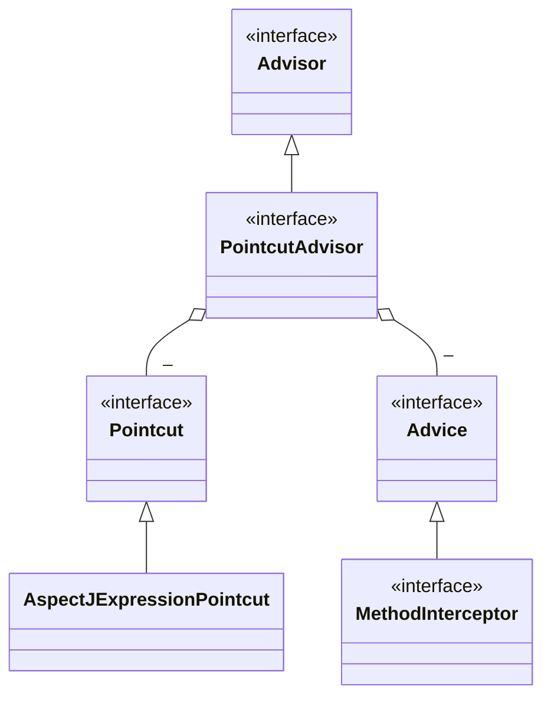

#### 代理相关类图

代理相关类图

* AopProxyFactory 根据 proxyTargetClass 等设置选择 AopProxy 实现
* AopProxy 通过 getProxy 创建代理对象
* 图中 Proxy 都实现了 Advised 接口，能够获得关联的切面集合与目标（其实是从 ProxyFactory 取得）
* 调用代理方法时，会借助 ProxyFactory 将通知统一转为环绕通知：MethodInterceptor

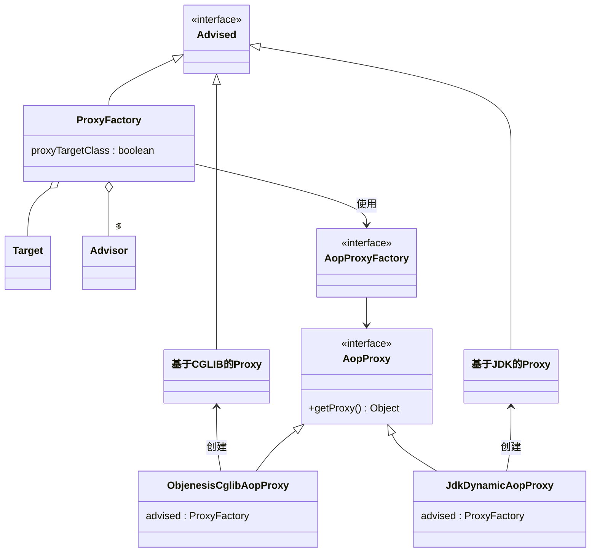


#### 总结

1. 底层的切点实现
2. 底层的通知实现
3. 底层的切面实现
4. ProxyFactory 用来创建代理
   * 如果指定了接口，且 proxyTargetClass = false，使用 JdkDynamicAopProxy
   * 如果没有指定接口，或者 proxyTargetClass = true，使用 ObjenesisCglibAopProxy
     * 例外：如果目标是接口类型或已经是 Jdk 代理，使用 JdkDynamicAopProxy

> ***注意***
>
> * 要区分本章节提到的 MethodInterceptor(org.aopalliance.intercept)，它与之前 cglib 中用的的 MethodInterceptor 是不同的接口


### 切点匹配

#### 示例

```java
public class T1 {
    @Transactional
    public void foo() {
    }
    public void bar() {
    }
}

@Transactional
public class T2 {
    public void foo() {
    }
}

@Transactional
public interface I3 {
    void foo();
}
public class T3 implements I3 {
    public void foo() {
    }
}
```

```java
public class Application {
    public static void main(String[] args) throws NoSuchMethodException {
        // 根据方法名匹配方法
//        AspectJExpressionPointcut pt1 = new AspectJExpressionPointcut();
//        pt1.setExpression("execution(* bar())");
//        System.out.println(pt1.matches(T1.class.getMethod("foo"), T1.class));
//        System.out.println(pt1.matches(T1.class.getMethod("bar"), T1.class));

        // 根据方法注解匹配方法
//        AspectJExpressionPointcut pt2 = new AspectJExpressionPointcut();
//        pt2.setExpression("@annotation(org.springframework.transaction.annotation.Transactional)");
//        System.out.println(pt2.matches(T1.class.getMethod("foo"), T1.class));
//        System.out.println(pt2.matches(T1.class.getMethod("bar"), T1.class));

        // @Transactional 以上两种方法均不是事务实现的方式。
        // 因为他们只能根据方法名或者方法上的注解匹配，
        // 而 @Transactional 可以加在类或接口上，此时使用切点表达式无法进行匹配
        // 下面模拟事务增强的匹配
        StaticMethodMatcherPointcut pt3 = new StaticMethodMatcherPointcut() {
            @Override
            public boolean matches(Method method, Class<?> targetClass) {
                // 检查方法上是否加了 Transactional 注解
                MergedAnnotations annotations = MergedAnnotations.from(method);
                if (annotations.isPresent(Transactional.class)) {
                    return true;
                }
                // 查看类上是否加了 Transactional 注解
                // 默认查找本类上的注解
                // MergedAnnotations.SearchStrategy.TYPE_HIERARCHY 本类、父类上的注解都查找
                annotations = MergedAnnotations.from(targetClass, MergedAnnotations.SearchStrategy.TYPE_HIERARCHY);
                if (annotations.isPresent(Transactional.class)) {
                    return true;
                }
                return false;
            }
        };

        System.out.println(pt3.matches(T1.class.getMethod("foo"), T1.class));
        System.out.println(pt3.matches(T1.class.getMethod("bar"), T1.class));
        System.out.println(pt3.matches(T2.class.getMethod("foo"), T2.class));
        System.out.println(pt3.matches(T3.class.getMethod("foo"), T3.class));
    }
}
```


#### 总结

1. 常见 aspectj 切点用法
2. 底层切点实现是如何匹配的: 调用了 aspectj 的匹配方法
3. 比较关键的是它实现了 MethodMatcher 接口, 用来执行方法的匹配
4. aspectj 切点的局限性，实际的 @Transactional 切点实现


### 代理对象的创建时机

#### 示例

```java
public class Target1 {
    public void foo() {

    }

    public Target1() {
        System.out.println("Target1()");
    }

//    @Autowired
//    public void setTarget1(Target1 target1) {
//        System.out.println("Target2 setTarget1(target1) class is: " + target1.getClass());
//    }

    @PostConstruct
    public void init() {
        System.out.println("Target1 init()");
    }
}

public class Target2 {
    public Target2() {
        System.out.println("Target2()");
    }

    @Autowired
    public void setTarget1(Target1 target1) {
        System.out.println("Target2 setTarget1(target1) class is: " + target1.getClass());
    }

    @PostConstruct
    public void init() {
        System.out.println("Target2 init()");
    }
}
```


```java
@Configuration
public class MyConfig {

    @Bean // 解析 @Aspect、产生代理
    public AnnotationAwareAspectJAutoProxyCreator annotationAwareAspectJAutoProxyCreator() {
        return new AnnotationAwareAspectJAutoProxyCreator();
    }

    @Bean // 解析 @Autowired
    public AutowiredAnnotationBeanPostProcessor autowiredAnnotationBeanPostProcessor() {
        return new AutowiredAnnotationBeanPostProcessor();
    }

    @Bean // 解析 @PostConstruct
    public CommonAnnotationBeanPostProcessor commonAnnotationBeanPostProcessor() {
        return new CommonAnnotationBeanPostProcessor();
    }

    @Bean
    public Advisor advisor(MethodInterceptor advice) {
        AspectJExpressionPointcut pointcut = new AspectJExpressionPointcut();
        pointcut.setExpression("execution(* foo())");
        return new DefaultPointcutAdvisor(pointcut, advice);
    }

    @Bean
    public MethodInterceptor advice() {
        return (MethodInvocation invocation) -> {
            System.out.println("before...");
            return invocation.proceed();
        };
    }

    @Bean
    public Target1 target1() {
        return new Target1();
    }

    @Bean
    public Target2 target2() {
        return new Target2();
    }

}
```

```java
public class Application {
    public static void main(String[]args){
        GenericApplicationContext context = new GenericApplicationContext();
        context.registerBean(ConfigurationClassPostProcessor.class);
        context.registerBean(MyConfig.class);
        context.refresh();
        context.close();
        // 
        /*
            学到了什么
                a. 代理的创建时机
                    1. 初始化之后 (无循环依赖时)
                    2. 实例创建后, 依赖注入前 (有循环依赖时), 并暂存于二级缓存
                b. 依赖注入与初始化不应该被增强, 仍应被施加于原始对象
         */
    }
}
```


#### 总结

创建 -> (`*`) 依赖注入 -> 初始化 (`*`)

1. 代理的创建时机
   * 初始化之后 (无循环依赖时)
   * 实例创建后, 依赖注入前 (有循环依赖时), 并暂存于二级缓存
2. 依赖注入与初始化不应该被增强, 仍应被施加于原始对象


### 切面的顺序控制

#### 示例
```java
public class Target {
    public void foo(){
        System.out.println("target foo");
    }
}

// 高级 @Aspect 切面
@Aspect
@Order(1)
public class Aspect1 {
    @Before("execution(* foo())")
    public void before(){
        System.out.println("Aspect1 before");
    }

    @After("execution(* foo())")
    public void after(){
        System.out.println("Aspect1 after");
    }
}

```

```java
@Configuration
public class MyConfig {

    // 低级 Advisor 切面
    @Bean
    public Advisor advisor(MethodInterceptor advice){
        // 切点
        AspectJExpressionPointcut pointcut = new AspectJExpressionPointcut();
        pointcut.setExpression("execution(* foo())");
        DefaultPointcutAdvisor advisor = new DefaultPointcutAdvisor(pointcut, advice);
        advisor.setOrder(2);
        return advisor;
    }

    // 通知
    @Bean
    public MethodInterceptor advice(){
        return invocation -> {
            System.out.println("advice before...");
            Object result = invocation.proceed(); // 调用目标
            System.out.println("advice after...");
            return result;
        };
    }

    @Bean
    public Target tagrget(){
        return new Target();
    }
}
```

```java
public class Application {
    public static void main(String[]args){
        GenericApplicationContext context = new GenericApplicationContext();
        context.registerBean("myConfig", MyConfig.class);
        context.registerBean(ConfigurationClassPostProcessor.class);
        context.registerBean("aspect1", Aspect1.class);
        context.registerBean(AnnotationAwareAspectJAutoProxyCreator.class);
        context.refresh();

        Target proxy1 = context.getBean(Target.class);
        proxy1.foo();
    }
}
```


#### 总结

1.默认情况下低级的 advisor 比高级的 aspect 优先级高

2.可以在切面类上使用 `@Order` 注解指定该切面类所有 aspect  切面的优先级，advisor 切面可以调用 `setOrder` 方法设置。数值越小优先级越高

3.`@Order`加在切面方法上是无效的

### 后处理器 AnnotationAwareAspectJAutoProxyCreator

该后处理器的两个作用

1. 找到 Bean 中的 Advisor 切面和 Aspect 切面，并将找到的 Aspect 切面转换为 Advisor 切面
2. 在合适的时机创建代理


#### 示例

```java
public class Target {
    public void foo(){
        System.out.println("target foo");
    }

    public void bar(){
        System.out.println("target bar");
    }
}
```

```java
@Aspect
public class MyAspect {
    @Before("execution(* foo())")
    public void before() {
        System.out.println("before");
    }

    @After("execution(* foo())")
    public void after() {
        System.out.println("after");
    }
}
```

```java
@Configuration
public class MyConfig {

    // 低级 Advisor 切面
    @Bean
    public Advisor advisor(MethodInterceptor advice){
        // 切点
        AspectJExpressionPointcut pointcut = new AspectJExpressionPointcut();
        pointcut.setExpression("execution(* foo())");
        DefaultPointcutAdvisor advisor = new DefaultPointcutAdvisor(pointcut, advice);
        return advisor;
    }

    // 通知
    @Bean
    public MethodInterceptor advice(){
        return invocation -> {
            System.out.println("advice before...");
            Object result = invocation.proceed(); // 调用目标
            System.out.println("advice after...");
            return result;
        };
    }
}
```

```java
// 包名为了方便调用 protected 方法 findEligibleAdvisors、wrapIfNecessary
package org.springframework.aop.framework.autoproxy;

public class Application {
    public static void main(String[]args) {
        GenericApplicationContext context = new GenericApplicationContext();
        context.registerBean("myConfig", MyConfig.class);
        context.registerBean(ConfigurationClassPostProcessor.class);
        context.registerBean("myAspect", MyAspect.class);
        context.registerBean(AnnotationAwareAspectJAutoProxyCreator.class);
        context.refresh();

        /**
         * 第一个重要的方法 findEligibleAdvisors 找到有资格的 Advisors
         * 1.有资格的 Advisors 一部分是低级的，可以由自己编写，如例中的 advisor
         * 2.有资格的 Advisors 另一部分是高级的，由 AnnotationAwareAspectJAutoProxyCreator 解析 @Aspect 获得
         */
        AnnotationAwareAspectJAutoProxyCreator creator = context.getBean(AnnotationAwareAspectJAutoProxyCreator.class);
        // 获得和 Target 类方法有资格的 Advisor
        List<Advisor> advisors = creator.findEligibleAdvisors(Target.class, "target");
        /**
         * 获得四个切面
         * 1.Spring 为所有 Bean 创建的切面
         * 2. 两个 @Aspect 切面
         * 3. 一个 低级 Advisor 切面
         */
        for(Advisor advisor:advisors){
            System.out.println(advisor);
        }

        // 第二个重要的方法 wrapIfNecessary 内部调用 findEligibleAdvisors 检查对象是否有切面并创建代理
        Target proxy = (Target) creator.wrapIfNecessary(new Target(), "target", "target");
        System.out.println(proxy.getClass());
        proxy.foo();
    }
}
```


#### 方法一：findEligibleAdvisors

findEligibleAdvisors 找到有资格的 Advisors

* 有资格的 Advisors 一部分是低级的，可以由自己编写，如例中的 advisor
* 有资格的 Advisors 另一部分是高级的，由 AnnotationAwareAspectJAutoProxyCreator 解析 @Aspect 获得

过程如下

1. 找到所有 Advisor 切面
2. 找到所有 Aspect 切面并转换为 Advisor 切面
3. 找到适合当前 Bean 的所有 Advisor 切面


##### 源码

```java
public abstract class AbstractAdvisorAutoProxyCreator extends AbstractAutoProxyCreator {
    protected List<Advisor> findEligibleAdvisors(Class<?> beanClass, String beanName) {
        /**
         * 调用子类方法
         * 找到所有 Advisor 切面
         * 找到所有 Aspect 切面并转换为 Advisor 切面
         */
        List<Advisor> candidateAdvisors = this.findCandidateAdvisors();
        // 找到适合当前 Bean 的所有 Advisor 切面
        List<Advisor> eligibleAdvisors = this.findAdvisorsThatCanApply(candidateAdvisors, beanClass, beanName);
        this.extendAdvisors(eligibleAdvisors);
        if (!eligibleAdvisors.isEmpty()) {
            eligibleAdvisors = this.sortAdvisors(eligibleAdvisors);
        }

        return eligibleAdvisors;
    }
}
```


###### 找到所有 Advisor 切面

该方法从 BeanFactory 中获取所有 Advisor 类型的对象

```java
public class BeanFactoryAdvisorRetrievalHelper {
    public List<Advisor> findAdvisorBeans() {
        String[] advisorNames = this.cachedAdvisorBeanNames;
        if (advisorNames == null) {
            advisorNames = BeanFactoryUtils.beanNamesForTypeIncludingAncestors(this.beanFactory, Advisor.class, true, false);
            this.cachedAdvisorBeanNames = advisorNames;
        }

        if (advisorNames.length == 0) {
            return new ArrayList();
        } else {
            List<Advisor> advisors = new ArrayList();
            String[] var3 = advisorNames;
            int var4 = advisorNames.length;

            for(int var5 = 0; var5 < var4; ++var5) {
                String name = var3[var5];
                if (this.isEligibleBean(name)) {
                    if (this.beanFactory.isCurrentlyInCreation(name)) {
                        if (logger.isTraceEnabled()) {
                            logger.trace("Skipping currently created advisor '" + name + "'");
                        }
                    } else {
                        try {
                            advisors.add(this.beanFactory.getBean(name, Advisor.class));
                        } catch (BeanCreationException var11) {
                            Throwable rootCause = var11.getMostSpecificCause();
                            if (rootCause instanceof BeanCurrentlyInCreationException) {
                                BeanCreationException bce = (BeanCreationException)rootCause;
                                String bceBeanName = bce.getBeanName();
                                if (bceBeanName != null && this.beanFactory.isCurrentlyInCreation(bceBeanName)) {
                                    if (logger.isTraceEnabled()) {
                                        logger.trace("Skipping advisor '" + name + "' with dependency on currently created bean: " + var11.getMessage());
                                    }
                                    continue;
                                }
                            }

                            throw var11;
                        }
                    }
                }
            }

            return advisors;
        }
    }
}
```


###### 找到所有 Aspect 切面并转换为 Advisor 切面

1. 从 BeanFactory 中获取所有对象
2. 判断是否为 Aspect 切面对象
3. 如果是 Aspect 切面对象就使用 Aspect 切面方法的信息生成 Advisor 切面


```java
public class BeanFactoryAspectJAdvisorsBuilder {
    public List<Advisor> buildAspectJAdvisors() {
        List<String> aspectNames = this.aspectBeanNames;
        if (aspectNames == null) {
            synchronized(this) {
                aspectNames = this.aspectBeanNames;
                if (aspectNames == null) {
                    List<Advisor> advisors = new ArrayList();
                    List<String> aspectNames = new ArrayList();
                    String[] beanNames = BeanFactoryUtils.beanNamesForTypeIncludingAncestors(this.beanFactory, Object.class, true, false);
                    String[] var18 = beanNames;
                    int var19 = beanNames.length;

                    for(int var7 = 0; var7 < var19; ++var7) {
                        String beanName = var18[var7];
                        if (this.isEligibleBean(beanName)) {
                            Class<?> beanType = this.beanFactory.getType(beanName, false);
                            if (beanType != null && this.advisorFactory.isAspect(beanType)) {
                                aspectNames.add(beanName);
                                AspectMetadata amd = new AspectMetadata(beanType, beanName);
                                if (amd.getAjType().getPerClause().getKind() == PerClauseKind.SINGLETON) {
                                    MetadataAwareAspectInstanceFactory factory = new BeanFactoryAspectInstanceFactory(this.beanFactory, beanName);
                                    List<Advisor> classAdvisors = this.advisorFactory.getAdvisors(factory);
                                    if (this.beanFactory.isSingleton(beanName)) {
                                        this.advisorsCache.put(beanName, classAdvisors);
                                    } else {
                                        this.aspectFactoryCache.put(beanName, factory);
                                    }

                                    advisors.addAll(classAdvisors);
                                } else {
                                    if (this.beanFactory.isSingleton(beanName)) {
                                        throw new IllegalArgumentException("Bean with name '" + beanName + "' is a singleton, but aspect instantiation model is not singleton");
                                    }

                                    MetadataAwareAspectInstanceFactory factory = new PrototypeAspectInstanceFactory(this.beanFactory, beanName);
                                    this.aspectFactoryCache.put(beanName, factory);
                                    advisors.addAll(this.advisorFactory.getAdvisors(factory));
                                }
                            }
                        }
                    }

                    this.aspectBeanNames = aspectNames;
                    return advisors;
                }
            }
        }

        if (aspectNames.isEmpty()) {
            return Collections.emptyList();
        } else {
            List<Advisor> advisors = new ArrayList();
            Iterator var3 = aspectNames.iterator();

            while(var3.hasNext()) {
                String aspectName = (String)var3.next();
                List<Advisor> cachedAdvisors = (List)this.advisorsCache.get(aspectName);
                if (cachedAdvisors != null) {
                    advisors.addAll(cachedAdvisors);
                } else {
                    MetadataAwareAspectInstanceFactory factory = (MetadataAwareAspectInstanceFactory)this.aspectFactoryCache.get(aspectName);
                    advisors.addAll(this.advisorFactory.getAdvisors(factory));
                }
            }

            return advisors;
        }
    }
}
```


###### 找到适合当前 Bean 的所有 Advisor 切面

1. 将所有 Advisor 切面与目标 Bean 进行匹配，获取目标 Bean 的 Advisor 切面


```java
public abstract class AopUtils {
    public static List<Advisor> findAdvisorsThatCanApply(List<Advisor> candidateAdvisors, Class<?> clazz) {
        if (candidateAdvisors.isEmpty()) {
            return candidateAdvisors;
        } else {
            List<Advisor> eligibleAdvisors = new ArrayList();
            Iterator var3 = candidateAdvisors.iterator();

            while(var3.hasNext()) {
                Advisor candidate = (Advisor)var3.next();
                if (candidate instanceof IntroductionAdvisor && canApply(candidate, clazz)) {
                    eligibleAdvisors.add(candidate);
                }
            }

            boolean hasIntroductions = !eligibleAdvisors.isEmpty();
            Iterator var7 = candidateAdvisors.iterator();

            while(var7.hasNext()) {
                Advisor candidate = (Advisor)var7.next();
                if (!(candidate instanceof IntroductionAdvisor) && canApply(candidate, clazz, hasIntroductions)) {
                    eligibleAdvisors.add(candidate);
                }
            }

            return eligibleAdvisors;
        }
    }
}
```


##### 示例

```java
public class Target1 {
    public void foo(){
        System.out.println("target1 foo");
    }
}

public class Target2 {
    public void bar(){
        System.out.println("target2 bar");
    }
}
```

```java
@Aspect
public class MyAspect {
    @Before("execution(* foo())")
    public void fooBefore() {
        System.out.println("foo before");
    }

    @After("execution(* foo())")
    public void fooAfter() {
        System.out.println("foo after");
    }

    @Before("execution(* bar())")
    public void barBefore() {
        System.out.println("bar before");
    }

    @After("execution(* bar())")
    public void barAfter() {
        System.out.println("bar after");
    }
}
```

```java
@Configuration
public class MyConfig {

    // 低级 Advisor 切面
    @Bean
    public Advisor fooAdvisor(MethodInterceptor advice){
        // 切点
        AspectJExpressionPointcut pointcut = new AspectJExpressionPointcut();
        pointcut.setExpression("execution(* foo())");
        DefaultPointcutAdvisor advisor = new DefaultPointcutAdvisor(pointcut, advice);
        return advisor;
    }

    // 低级 Advisor 切面
    @Bean
    public Advisor barAdvisor(MethodInterceptor advice){
        // 切点
        AspectJExpressionPointcut pointcut = new AspectJExpressionPointcut();
        pointcut.setExpression("execution(* bar())");
        DefaultPointcutAdvisor advisor = new DefaultPointcutAdvisor(pointcut, advice);
        return advisor;
    }

    // 通知
    @Bean
    public MethodInterceptor advice(){
        return invocation -> {
            System.out.println("advice before...");
            Object result = invocation.proceed(); // 调用目标
            System.out.println("advice after...");
            return result;
        };
    }
}
```


```java
public class Application {
    public static void main(String[]args) {
        GenericApplicationContext context = new GenericApplicationContext();
        context.registerBean("myConfig", MyConfig.class);
        context.registerBean(ConfigurationClassPostProcessor.class);
        context.registerBean("myAspect", MyAspect.class);
        context.registerBean(AnnotationAwareAspectJAutoProxyCreator.class);
        context.refresh();

        List<Advisor> candidateAdvisors = findAdvisorBeans(context.getDefaultListableBeanFactory());
        candidateAdvisors.addAll(buildAspectJAdvisors());
        List<Advisor> eligibleAdvisors = findAdvisorsThatCanApply(candidateAdvisors, Target1.class);

        System.out.println("排序");
        AnnotationAwareOrderComparator.sort(eligibleAdvisors);
        printAdvisor(eligibleAdvisors);
    }

    private static List<Advisor> findAdvisorBeans(DefaultListableBeanFactory beanFactory){
        System.out.println("找到所有 Advisor 切面");
        List<Advisor> candidateAdvisors = new ArrayList<>(beanFactory.getBeansOfType(Advisor.class).values());
        printAdvisor(candidateAdvisors);
        return candidateAdvisors;
    }

    private static List<Advisor> buildAspectJAdvisors(){
        System.out.println("找到所有 Aspect 切面并转换为 Advisor 切面");
        AspectInstanceFactory factory = new SingletonAspectInstanceFactory(new MyAspect());
        List<Advisor> aspectAdvisors = new ArrayList<>();
        for(Method method:MyAspect.class.getDeclaredMethods()){
            /**
             *   @Before 前置通知会被转换为下面原始的 AspectJMethodBeforeAdvice 形式, 该对象包含了如下信息
             *       a. 通知代码从哪儿来
             *       b. 切点是什么
             *       c. 通知对象如何创建, 本例共用同一个 Aspect 对象
             *   类似的通知还有
             *       1. AspectJAroundAdvice (环绕通知)
             *       2. AspectJAfterReturningAdvice
             *       3. AspectJAfterThrowingAdvice (环绕通知)
             *       4. AspectJAfterAdvice (环绕通知)
             */
            if (method.isAnnotationPresent(Before.class)) {
                // 解析切点
                AspectJExpressionPointcut pointcut = new AspectJExpressionPointcut();
                pointcut.setExpression(method.getAnnotation(Before.class).value());
                // 通知类
                // 切面
                Advisor advisor = new DefaultPointcutAdvisor(pointcut, new AspectJMethodBeforeAdvice(method, pointcut, factory));
                aspectAdvisors.add(advisor);
            } else if (method.isAnnotationPresent(After.class)) {
                AspectJExpressionPointcut pointcut = new AspectJExpressionPointcut();
                pointcut.setExpression(method.getAnnotation(After.class).value());
                Advisor advisor = new DefaultPointcutAdvisor(pointcut,  new AspectJAfterAdvice(method, pointcut, factory));
                aspectAdvisors.add(advisor);
            } else if (method.isAnnotationPresent(AfterReturning.class)) {
                AspectJExpressionPointcut pointcut = new AspectJExpressionPointcut();
                pointcut.setExpression(method.getAnnotation(AfterReturning.class).value());
                Advisor advisor = new DefaultPointcutAdvisor(pointcut,  new AspectJAfterReturningAdvice(method, pointcut, factory));
                aspectAdvisors.add(advisor);
            } else if (method.isAnnotationPresent(Around.class)) {
                AspectJExpressionPointcut pointcut = new AspectJExpressionPointcut();
                pointcut.setExpression(method.getAnnotation(Around.class).value());
                Advisor advisor = new DefaultPointcutAdvisor(pointcut, new AspectJAroundAdvice(method, pointcut, factory));
                aspectAdvisors.add(advisor);
            }
        }
        printAdvisor(aspectAdvisors);
        return aspectAdvisors;
    }

    private static List<Advisor> findAdvisorsThatCanApply(List<Advisor> candidateAdvisors, Class<?> clazz){
        System.out.println("找到适合当前 Bean 的所有 Advisor 切面");
        List<Advisor> eligibleAdvisors = new ArrayList<>();
        for (Advisor advisor : candidateAdvisors) {
            for(Method method:Target1.class.getDeclaredMethods()){
                if(((PointcutAdvisor)advisor).getPointcut().getMethodMatcher().matches(method, clazz)){
                    eligibleAdvisors.add(advisor);
                    break;
                }
            }
        }
        printAdvisor(eligibleAdvisors);
        return eligibleAdvisors;
    }

    private static void printAdvisor(List<Advisor> advisors){
        for(Advisor advisor:advisors){
            System.out.println(advisor);
        }
    }
}
```


##### 总结

1. @Before 前置通知会被转换为原始的 AspectJMethodBeforeAdvice 形式, 该对象包含了如下信息
   1. 通知代码从哪儿来
   2. 切点是什么(这里为啥要切点, 后面解释)
   3. 通知对象如何创建, 本例共用同一个 Aspect 对象
2. 类似的还有
   1. AspectJAroundAdvice (环绕通知)
   2. AspectJAfterReturningAdvice
   3. AspectJAfterThrowingAdvice (环绕通知)
   4. AspectJAfterAdvice (环绕通知)


#### 方法二：wrapIfNecessary

* 它内部调用 findEligibleAdvisors, 只要返回集合不空, 则表示需要创建代理
* 它的调用时机通常在原始对象初始化后执行, 但碰到循环依赖会提前至依赖注入之前执行


##### 源码

```java
public abstract class AbstractAutoProxyCreator extends ProxyProcessorSupport implements SmartInstantiationAwareBeanPostProcessor, BeanFactoryAware {
    protected Object wrapIfNecessary(Object bean, String beanName, Object cacheKey) {
        if (StringUtils.hasLength(beanName) && this.targetSourcedBeans.contains(beanName)) {
            return bean;
        } else if (Boolean.FALSE.equals(this.advisedBeans.get(cacheKey))) {
            return bean;
        } else if (!this.isInfrastructureClass(bean.getClass()) && !this.shouldSkip(bean.getClass(), beanName)) {
            // 调用 findEligibleAdvisors
            Object[] specificInterceptors = this.getAdvicesAndAdvisorsForBean(bean.getClass(), beanName, (TargetSource)null);
            if (specificInterceptors != DO_NOT_PROXY) {
                this.advisedBeans.put(cacheKey, Boolean.TRUE);
                Object proxy = this.createProxy(bean.getClass(), beanName, specificInterceptors, new SingletonTargetSource(bean));
                this.proxyTypes.put(cacheKey, proxy.getClass());
                return proxy;
            } else {
                this.advisedBeans.put(cacheKey, Boolean.FALSE);
                return bean;
            }
        } else {
            this.advisedBeans.put(cacheKey, Boolean.FALSE);
            return bean;
        }
    }
    
    protected Object createProxy(Class<?> beanClass, @Nullable String beanName, @Nullable Object[] specificInterceptors, TargetSource targetSource) {
        if (this.beanFactory instanceof ConfigurableListableBeanFactory) {
            AutoProxyUtils.exposeTargetClass((ConfigurableListableBeanFactory)this.beanFactory, beanName, beanClass);
        }

        ProxyFactory proxyFactory = new ProxyFactory();
        proxyFactory.copyFrom(this);
        if (!proxyFactory.isProxyTargetClass()) {
            if (this.shouldProxyTargetClass(beanClass, beanName)) {
                proxyFactory.setProxyTargetClass(true);
            } else {
                this.evaluateProxyInterfaces(beanClass, proxyFactory);
            }
        }

        Advisor[] advisors = this.buildAdvisors(beanName, specificInterceptors);
        proxyFactory.addAdvisors(advisors);
        proxyFactory.setTargetSource(targetSource);
        this.customizeProxyFactory(proxyFactory);
        proxyFactory.setFrozen(this.freezeProxy);
        if (this.advisorsPreFiltered()) {
            proxyFactory.setPreFiltered(true);
        }

        return proxyFactory.getProxy(this.getProxyClassLoader());
    }
}
```


##### 示例

```java
public class Target1 {
    public void foo(){
        System.out.println("target1 foo");
    }
}
```

```java
public class Target2 {
    public void bar(){
        System.out.println("target2 bar");
    }
}
```

```java
@Aspect
public class MyAspect {
    @Before("execution(* foo())")
    public void fooBefore() {
        System.out.println("foo before");
    }

    @After("execution(* foo())")
    public void fooAfter() {
        System.out.println("foo after");
    }

    @Before("execution(* bar())")
    public void barBefore() {
        System.out.println("bar before");
    }

    @After("execution(* bar())")
    public void barAfter() {
        System.out.println("bar after");
    }
}
```

```java
@Configuration
public class MyConfig {

    // 低级 Advisor 切面
    @Bean
    public Advisor fooAdvisor(MethodInterceptor advice){
        // 切点
        AspectJExpressionPointcut pointcut = new AspectJExpressionPointcut();
        pointcut.setExpression("execution(* foo())");
        DefaultPointcutAdvisor advisor = new DefaultPointcutAdvisor(pointcut, advice);
        return advisor;
    }

    // 低级 Advisor 切面
    @Bean
    public Advisor barAdvisor(MethodInterceptor advice){
        // 切点
        AspectJExpressionPointcut pointcut = new AspectJExpressionPointcut();
        pointcut.setExpression("execution(* bar())");
        DefaultPointcutAdvisor advisor = new DefaultPointcutAdvisor(pointcut, advice);
        return advisor;
    }

    // 通知
    @Bean
    public MethodInterceptor advice(){
        return invocation -> {
            System.out.println("advice before...");
            Object result = invocation.proceed(); // 调用目标
            System.out.println("advice after...");
            return result;
        };
    }
}
```

```java
public class Application {
    public static void main(String[]args) {
        GenericApplicationContext context = new GenericApplicationContext();
        context.registerBean("myConfig", MyConfig.class);
        context.registerBean(ConfigurationClassPostProcessor.class);
        context.registerBean("myAspect", MyAspect.class);
        context.registerBean(AnnotationAwareAspectJAutoProxyCreator.class);
        context.refresh();
        Target1 proxy1 = (Target1) Application.wrapIfNecessary(new Target1(), context.getDefaultListableBeanFactory());

        proxy1.foo();
    }

    /**
     * 创建代理
     *  a. proxyTargetClass = false, 目标实现了接口, 用 jdk 实现
     *  b. proxyTargetClass = false,  目标没有实现接口, 用 cglib 实现
     *  c. proxyTargetClass = true, 总是使用 cglib 实现
     */
    private static Object wrapIfNecessary(Object bean, DefaultListableBeanFactory beanFactory){
        List<Advisor> eligibleAdvisors = Application.findEligibleAdvisors(bean.getClass(), beanFactory);
        ProxyFactory factory = new ProxyFactory();
        factory.addAdvice(ExposeInvocationInterceptor.INSTANCE);
        factory.addAdvisors(eligibleAdvisors);

        factory.setTarget(bean);
        factory.setInterfaces(bean.getClass().getInterfaces());
        factory.setProxyTargetClass(false);
        return factory.getProxy(Thread.currentThread().getContextClassLoader());
    }

    private static List<Advisor> findEligibleAdvisors(Class<?> clazz, DefaultListableBeanFactory beanFactory){
        List<Advisor> candidateAdvisors = findAdvisorBeans(beanFactory);
        candidateAdvisors.addAll(buildAspectJAdvisors());
        return findAdvisorsThatCanApply(candidateAdvisors, clazz);
    }

    private static List<Advisor> findAdvisorBeans(DefaultListableBeanFactory beanFactory){
        System.out.println("找到所有 Advisor 切面");
        List<Advisor> candidateAdvisors = new ArrayList<>(beanFactory.getBeansOfType(Advisor.class).values());
        printAdvisor(candidateAdvisors);
        return candidateAdvisors;
    }

    private static List<Advisor> buildAspectJAdvisors(){
        System.out.println("找到所有 Aspect 切面并转换为 Advisor 切面");
        AspectInstanceFactory factory = new SingletonAspectInstanceFactory(new MyAspect());
        List<Advisor> aspectAdvisors = new ArrayList<>();
        for(Method method:MyAspect.class.getDeclaredMethods()){
            /**
             *   @Before 前置通知会被转换为下面原始的 AspectJMethodBeforeAdvice 形式, 该对象包含了如下信息
             *       a. 通知代码从哪儿来
             *       b. 切点是什么
             *       c. 通知对象如何创建, 本例共用同一个 Aspect 对象
             *   类似的通知还有
             *       1. AspectJAroundAdvice (环绕通知)
             *       2. AspectJAfterReturningAdvice
             *       3. AspectJAfterThrowingAdvice (环绕通知)
             *       4. AspectJAfterAdvice (环绕通知)
             */
            if (method.isAnnotationPresent(Before.class)) {
                // 解析切点
                AspectJExpressionPointcut pointcut = new AspectJExpressionPointcut();
                pointcut.setExpression(method.getAnnotation(Before.class).value());
                // 通知类
                // 切面
                Advisor advisor = new DefaultPointcutAdvisor(pointcut, new AspectJMethodBeforeAdvice(method, pointcut, factory));
                aspectAdvisors.add(advisor);
            } else if (method.isAnnotationPresent(After.class)) {
                AspectJExpressionPointcut pointcut = new AspectJExpressionPointcut();
                pointcut.setExpression(method.getAnnotation(After.class).value());
                Advisor advisor = new DefaultPointcutAdvisor(pointcut,  new AspectJAfterAdvice(method, pointcut, factory));
                aspectAdvisors.add(advisor);
            } else if (method.isAnnotationPresent(AfterReturning.class)) {
                AspectJExpressionPointcut pointcut = new AspectJExpressionPointcut();
                pointcut.setExpression(method.getAnnotation(AfterReturning.class).value());
                Advisor advisor = new DefaultPointcutAdvisor(pointcut,  new AspectJAfterReturningAdvice(method, pointcut, factory));
                aspectAdvisors.add(advisor);
            } else if (method.isAnnotationPresent(Around.class)) {
                AspectJExpressionPointcut pointcut = new AspectJExpressionPointcut();
                pointcut.setExpression(method.getAnnotation(Around.class).value());
                Advisor advisor = new DefaultPointcutAdvisor(pointcut, new AspectJAroundAdvice(method, pointcut, factory));
                aspectAdvisors.add(advisor);
            }
        }
        printAdvisor(aspectAdvisors);
        return aspectAdvisors;
    }

    private static List<Advisor> findAdvisorsThatCanApply(List<Advisor> candidateAdvisors, Class<?> clazz){
        System.out.println("找到适合当前 Bean 的所有 Advisor 切面");
        List<Advisor> eligibleAdvisors = new ArrayList<>();
        for (Advisor advisor : candidateAdvisors) {
            for(Method method:Target1.class.getDeclaredMethods()){
                if(((PointcutAdvisor)advisor).getPointcut().getMethodMatcher().matches(method, clazz)){
                    eligibleAdvisors.add(advisor);
                    break;
                }
            }
        }
        printAdvisor(eligibleAdvisors);
        return eligibleAdvisors;
    }

    private static void printAdvisor(List<Advisor> advisors){
        for(Advisor advisor:advisors){
            System.out.println(advisor);
        }
    }
}
```


### 静态通知调用

代理对象调用流程如下（以 JDK 动态代理实现为例）

* 从 ProxyFactory 获得 Target 和环绕通知链，根据他俩创建 MethodInvocation，简称 mi
* 首次执行 mi.proceed() 发现有下一个环绕通知，调用它的 invoke(mi)
* 进入环绕通知1，执行前增强，再次调用 mi.proceed() 发现有下一个环绕通知，调用它的 invoke(mi)
* 进入环绕通知2，执行前增强，调用 mi.proceed() 发现没有环绕通知，调用 mi.invokeJoinPoint() 执行目标方法
* 目标方法执行结束，将结果返回给环绕通知2，执行环绕通知2 的后增强
* 环绕通知2继续将结果返回给环绕通知1，执行环绕通知1 的后增强
* 环绕通知1返回最终的结果

图中不同颜色对应一次环绕通知或目标的调用起始至终结

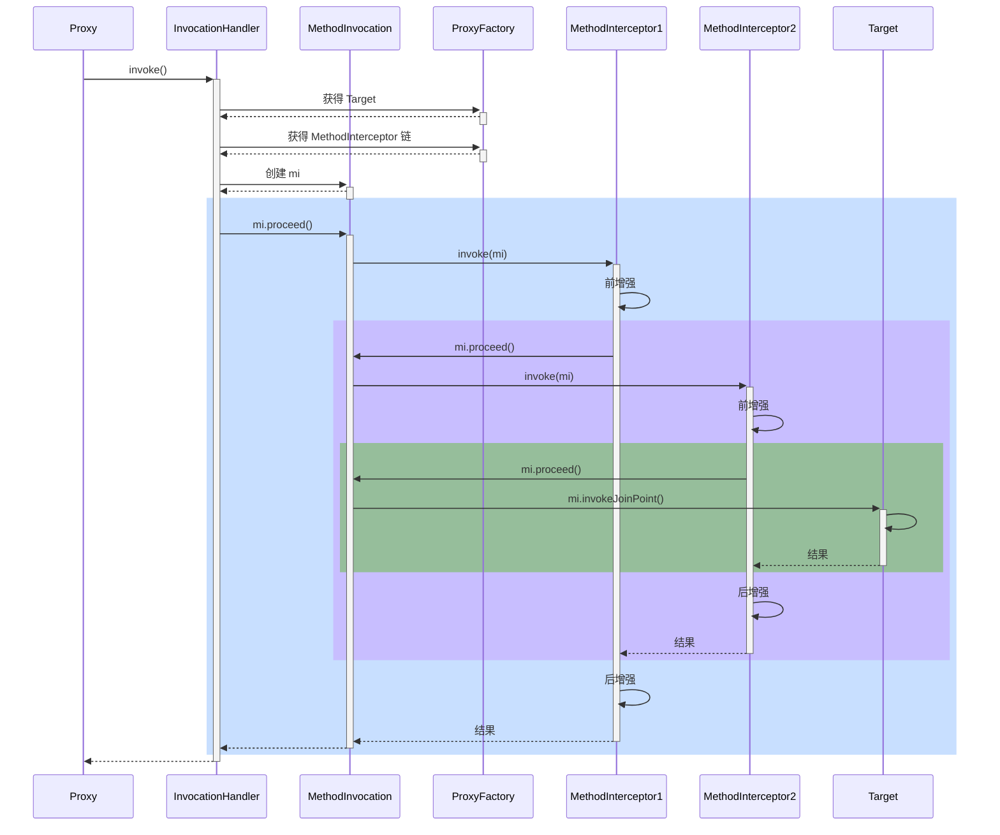


#### 通知调用过程

##### 示例

```java
public class Target1{
    public void foo(){
        System.out.println("target1 foo");
    }
}
public class Target2 {
    public void bar(){
        System.out.println("target2 bar");
    }
}

```

```java
@Aspect
public class MyAspect {
    @Before("execution(* foo())")
    public void fooBefore() {
        System.out.println("foo before");
    }

    @After("execution(* foo())")
    public void fooAfter() {
        System.out.println("foo after");
    }

    @Before("execution(* bar())")
    public void barBefore() {
        System.out.println("bar before");
    }

    @After("execution(* bar())")
    public void barAfter() {
        System.out.println("bar after");
    }
}
```

```java
@Configuration
public class MyConfig {

    // 低级 Advisor 切面
    @Bean
    public Advisor fooAdvisor(MethodInterceptor advice){
        // 切点
        AspectJExpressionPointcut pointcut = new AspectJExpressionPointcut();
        pointcut.setExpression("execution(* foo())");
        DefaultPointcutAdvisor advisor = new DefaultPointcutAdvisor(pointcut, advice);
        return advisor;
    }

    // 低级 Advisor 切面
    @Bean
    public Advisor barAdvisor(MethodInterceptor advice){
        // 切点
        AspectJExpressionPointcut pointcut = new AspectJExpressionPointcut();
        pointcut.setExpression("execution(* bar())");
        DefaultPointcutAdvisor advisor = new DefaultPointcutAdvisor(pointcut, advice);
        return advisor;
    }

    // 通知
    @Bean
    public MethodInterceptor advice(){
        return invocation -> {
            System.out.println("advice before...");
            Object result = invocation.proceed(); // 调用目标
            System.out.println("advice after...");
            return result;
        };
    }
}
```

```java
package org.springframework.aop.framework;

public class Application {
    public static void main(String[]args) throws Throwable {
        GenericApplicationContext context = new GenericApplicationContext();
        context.registerBean("myConfig", MyConfig.class);
        context.registerBean(ConfigurationClassPostProcessor.class);
        context.registerBean("myAspect", MyAspect.class);
        context.registerBean(AnnotationAwareAspectJAutoProxyCreator.class);
        context.refresh();
        Target1 target1 = new Target1();

        List<Advisor> eligibleAdvisors = findEligibleAdvisors(target1.getClass(), context.getDefaultListableBeanFactory());

        ProxyFactory factory = new ProxyFactory();
        factory.addAdvice(ExposeInvocationInterceptor.INSTANCE);
        factory.addAdvisors(eligibleAdvisors);

        factory.setTarget(target1);
        factory.setInterfaces(target1.getClass().getInterfaces());
        factory.setProxyTargetClass(false);

        /*

            其实无论 ProxyFactory 基于哪种方式创建代理, 最后干活(调用 advice)的是一个 MethodInvocation 对象
                a. 因为 advisor 有多个, 且一个套一个调用, 因此需要一个调用链对象, 即 MethodInvocation
                b. MethodInvocation 要知道 advice 有哪些, 还要知道目标, 调用次序如下

                将 MethodInvocation 放入当前线程
                    |-> before1 ----------------------------------- 从当前线程获取 MethodInvocation
                    |                                             |
                    |   |-> before2 --------------------          | 从当前线程获取 MethodInvocation
                    |   |                              |          |
                    |   |   |-> target ------ 目标   advice2    advice1
                    |   |                              |          |
                    |   |-> after2 ---------------------          |
                    |                                             |
                    |-> after1 ------------------------------------
                c. 从上图看出, 环绕通知才适合作为 advice, 因此其他 before、afterReturning 都会被转换成环绕通知
                d. 统一转换为环绕通知, 体现的是设计模式中的适配器模式
                    - 对外是为了方便使用要区分 before、afterReturning
                    - 对内统一都是环绕通知, 统一用 MethodInterceptor 表示

            此步获取所有执行时需要的 advice (静态)
                a. 即统一转换为 MethodInterceptor 环绕通知, 这体现在方法名中的 Interceptors 上
                b. 适配如下
                  - MethodBeforeAdviceAdapter 将 @Before AspectJMethodBeforeAdvice 适配为 MethodBeforeAdviceInterceptor
                  - AfterReturningAdviceAdapter 将 @AfterReturning AspectJAfterReturningAdvice 适配为 AfterReturningAdviceInterceptor
         */

        System.out.println("把所有通知转换为环绕通知");
        Method method = target1.getClass().getMethod("foo");
        List<Object> methodInterceptorList = factory.getInterceptorsAndDynamicInterceptionAdvice(method, target1.getClass());
        for (Object o : methodInterceptorList) {
            System.out.println(o);
        }

        System.out.println("创建并执行调用链 (环绕通知s + 目标)");
        MethodInvocation methodInvocation = new ReflectiveMethodInvocation(
                null, target1, method, new Object[0], target1.getClass(), methodInterceptorList
        );
        methodInvocation.proceed();

        /*
            学到了什么
                a. 无参数绑定的通知如何被调用
                b. MethodInvocation 编程技巧: 拦截器、过滤器等等实现都与此类似
                c. 适配器模式在 Spring 中的体现
         */
    }

    /**
     * 创建代理
     *  a. proxyTargetClass = false, 目标实现了接口, 用 jdk 实现
     *  b. proxyTargetClass = false,  目标没有实现接口, 用 cglib 实现
     *  c. proxyTargetClass = true, 总是使用 cglib 实现
     */
    private static Object wrapIfNecessary(Object bean, DefaultListableBeanFactory beanFactory){
        List<Advisor> eligibleAdvisors = Application.findEligibleAdvisors(bean.getClass(), beanFactory);
        ProxyFactory factory = new ProxyFactory();
        // 把这个 Advice 把 MethodInvocation 放入当前线程，因为有些 advice 需要使用到 MethodInvocation
        factory.addAdvice(ExposeInvocationInterceptor.INSTANCE);
        factory.addAdvisors(eligibleAdvisors);

        factory.setTarget(bean);
        factory.setInterfaces(bean.getClass().getInterfaces());
        factory.setProxyTargetClass(false);
        return factory.getProxy(Thread.currentThread().getContextClassLoader());
    }

    private static List<Advisor> findEligibleAdvisors(Class<?> clazz, DefaultListableBeanFactory beanFactory){
        List<Advisor> candidateAdvisors = findAdvisorBeans(beanFactory);
        candidateAdvisors.addAll(buildAspectJAdvisors());
        return findAdvisorsThatCanApply(candidateAdvisors, clazz);
    }

    private static List<Advisor> findAdvisorBeans(DefaultListableBeanFactory beanFactory){
        System.out.println("找到所有 Advisor 切面");
        List<Advisor> candidateAdvisors = new ArrayList<>(beanFactory.getBeansOfType(Advisor.class).values());
        printAdvisor(candidateAdvisors);
        return candidateAdvisors;
    }

    private static List<Advisor> buildAspectJAdvisors(){
        System.out.println("找到所有 Aspect 切面并转换为 Advisor 切面");
        AspectInstanceFactory factory = new SingletonAspectInstanceFactory(new MyAspect());
        List<Advisor> aspectAdvisors = new ArrayList<>();
        for(Method method:MyAspect.class.getDeclaredMethods()){
            /**
             *   @Before 前置通知会被转换为下面原始的 AspectJMethodBeforeAdvice 形式, 该对象包含了如下信息
             *       a. 通知代码从哪儿来
             *       b. 切点是什么
             *       c. 通知对象如何创建, 本例共用同一个 Aspect 对象
             *   类似的通知还有
             *       1. AspectJAroundAdvice (环绕通知)
             *       2. AspectJAfterReturningAdvice
             *       3. AspectJAfterThrowingAdvice (环绕通知)
             *       4. AspectJAfterAdvice (环绕通知)
             */
            if (method.isAnnotationPresent(Before.class)) {
                // 解析切点
                AspectJExpressionPointcut pointcut = new AspectJExpressionPointcut();
                pointcut.setExpression(method.getAnnotation(Before.class).value());
                // 通知类
                // 切面
                Advisor advisor = new DefaultPointcutAdvisor(pointcut, new AspectJMethodBeforeAdvice(method, pointcut, factory));
                aspectAdvisors.add(advisor);
            } else if (method.isAnnotationPresent(After.class)) {
                AspectJExpressionPointcut pointcut = new AspectJExpressionPointcut();
                pointcut.setExpression(method.getAnnotation(After.class).value());
                Advisor advisor = new DefaultPointcutAdvisor(pointcut,  new AspectJAfterAdvice(method, pointcut, factory));
                aspectAdvisors.add(advisor);
            } else if (method.isAnnotationPresent(AfterReturning.class)) {
                AspectJExpressionPointcut pointcut = new AspectJExpressionPointcut();
                pointcut.setExpression(method.getAnnotation(AfterReturning.class).value());
                Advisor advisor = new DefaultPointcutAdvisor(pointcut,  new AspectJAfterReturningAdvice(method, pointcut, factory));
                aspectAdvisors.add(advisor);
            } else if (method.isAnnotationPresent(Around.class)) {
                AspectJExpressionPointcut pointcut = new AspectJExpressionPointcut();
                pointcut.setExpression(method.getAnnotation(Around.class).value());
                Advisor advisor = new DefaultPointcutAdvisor(pointcut, new AspectJAroundAdvice(method, pointcut, factory));
                aspectAdvisors.add(advisor);
            }
        }
        printAdvisor(aspectAdvisors);
        return aspectAdvisors;
    }

    private static List<Advisor> findAdvisorsThatCanApply(List<Advisor> candidateAdvisors, Class<?> clazz){
        System.out.println("找到适合当前 Bean 的所有 Advisor 切面");
        List<Advisor> eligibleAdvisors = new ArrayList<>();
        for (Advisor advisor : candidateAdvisors) {
            for(Method method:Target1.class.getDeclaredMethods()){
                if(((PointcutAdvisor)advisor).getPointcut().getMethodMatcher().matches(method, clazz)){
                    eligibleAdvisors.add(advisor);
                    break;
                }
            }
        }
        printAdvisor(eligibleAdvisors);
        return eligibleAdvisors;
    }

    private static void printAdvisor(List<Advisor> advisors){
        for(Advisor advisor:advisors){
            System.out.println(advisor);
        }
    }
}
```


##### 总结

代理方法执行时会做如下工作

1. 通过 proxyFactory 的 getInterceptorsAndDynamicInterceptionAdvice() 将其他通知统一转换为 MethodInterceptor 环绕通知
   - MethodBeforeAdviceAdapter 将 @Before AspectJMethodBeforeAdvice 适配为 MethodBeforeAdviceInterceptor
   - AfterReturningAdviceAdapter 将 @AfterReturning AspectJAfterReturningAdvice 适配为 AfterReturningAdviceInterceptor
   - 这体现的是适配器设计模式
2. 所谓静态通知，体现在上面方法的 Interceptors 部分，这些通知调用时无需再次检查切点，直接调用即可
3. 结合目标与环绕通知链，创建 MethodInvocation 对象，通过它完成整个调用


#### 模拟 MethodInvocation

##### 示例

```java
static class Target {
    public void foo() {
        System.out.println("Target.foo()");
    }
}
```

```java
static class Advice1 implements MethodInterceptor {
    public Object invoke(MethodInvocation invocation) throws Throwable {
        System.out.println("Advice1.before()");
        Object result = invocation.proceed();// 调用下一个通知或目标
        System.out.println("Advice1.after()");
        return result;
    }
}

static class Advice2 implements MethodInterceptor {
    public Object invoke(MethodInvocation invocation) throws Throwable {
        System.out.println("Advice2.before()");
        Object result = invocation.proceed();// 调用下一个通知或目标
        System.out.println("Advice2.after()");
        return result;
    }
}
```

```java
static class MyInvocation implements MethodInvocation {
    private Object target;  // 1
    private Method method;
    private Object[] args;
    List<MethodInterceptor> methodInterceptorList; // 2
    private int count = 1; // 调用次数

    public MyInvocation(Object target, Method method, Object[] args, List<MethodInterceptor> methodInterceptorList) {
        this.target = target;
        this.method = method;
        this.args = args;
        this.methodInterceptorList = methodInterceptorList;
    }

    @Override
    public Method getMethod() {
        return method;
    }

    @Override
    public Object[] getArguments() {
        return args;
    }

    @Override
    public Object proceed() throws Throwable { // 调用每一个环绕通知, 调用目标
        if (count > methodInterceptorList.size()) {
            // 调用目标， 返回并结束递归
            return method.invoke(target, args);
        }
        // 逐一调用通知, count + 1
        MethodInterceptor methodInterceptor = methodInterceptorList.get(count++ - 1);
        return methodInterceptor.invoke(this);
    }

    @Override
    public Object getThis() {
        return target;
    }

    @Override
    public AccessibleObject getStaticPart() {
        return method;
    }
}
```

```java
public static void main(String[] args) throws Throwable {
    Target target = new Target();
    List<MethodInterceptor> list = List.of(
            new Advice1(),
            new Advice2()
    );
    MyInvocation invocation = new MyInvocation(target, Target.class.getMethod("foo"), new Object[0], list);
    invocation.proceed();
}
```


##### 总结

1. proceed() 方法调用链中下一个环绕通知
2. 每个环绕通知内部继续调用 proceed()
3. 调用到没有更多通知了, 就调用目标方法

MethodInvocation 的编程技巧在实现拦截器、过滤器时能用上


### 动态通知调用

#### 示例

```java
public class Target{
    public void foo(){
        System.out.println("target1 foo");
    }

    public void foo(int x) {
        System.out.printf("target1 foo(%d)%n", x);
    }
}
```

```java
@Aspect
public class MyAspect {
    @Before("execution(* foo(..))") // 静态通知调用，不带参数绑定，执行时不需要切点
    public void before1() {
        System.out.println("before1");
    }

    @Before("execution(* foo(..)) && args(x)") // 动态通知调用，需要参数绑定，执行时还需要切点对象
    public void before2(int x) {
        System.out.printf("before2(%d)%n", x);
    }
}
```

```java
public class Application {
    public static void main(String[]args) throws Throwable {
        GenericApplicationContext context = new GenericApplicationContext();
        context.registerBean(ConfigurationClassPostProcessor.class);
        context.registerBean("myAspect", MyAspect.class);
        context.registerBean(AnnotationAwareAspectJAutoProxyCreator.class);
        context.refresh();

        AnnotationAwareAspectJAutoProxyCreator creator = context.getBean(AnnotationAwareAspectJAutoProxyCreator.class);
        List<Advisor> advisors = creator.findEligibleAdvisors(Target.class, "target");

        Target target = new Target();
        ProxyFactory factory = new ProxyFactory();
        factory.setTarget(target);
        factory.addAdvisors(advisors);
        Object proxy = factory.getProxy(); // 获取代理

        List<Object> interceptorList = factory.getInterceptorsAndDynamicInterceptionAdvice(Target.class.getMethod("foo", int.class), Target.class);
        for (Object o : interceptorList) {
            showDetail(o);
        }

        System.out.println(">>>>>>>>>>>>>>>>>>>>>>>>>>");
        ReflectiveMethodInvocation invocation = new ReflectiveMethodInvocation(
                proxy, target, Target.class.getMethod("foo", int.class), new Object[]{100}, Target.class, interceptorList
        ) {};

        invocation.proceed();

        /*
            学到了什么
                a. 有参数绑定的通知调用时还需要切点，对参数进行匹配及绑定
                b. 复杂程度高, 性能比无参数绑定的通知调用低
         */
    }

    public static void showDetail(Object o) {
        try {
            Class<?> clazz = Class.forName("org.springframework.aop.framework.InterceptorAndDynamicMethodMatcher");
            if (clazz.isInstance(o)) {
                Field methodMatcher = clazz.getDeclaredField("methodMatcher");
                methodMatcher.setAccessible(true);
                Field methodInterceptor = clazz.getDeclaredField("interceptor");
                methodInterceptor.setAccessible(true);
                System.out.println("环绕通知和切点：" + o);
                System.out.println("\t切点为：" + methodMatcher.get(o));
                System.out.println("\t通知为：" + methodInterceptor.get(o));
            } else {
                System.out.println("普通环绕通知：" + o);
            }
        } catch (Exception e) {
            e.printStackTrace();
        }
    }
}
```


#### 总结

1. 通过 proxyFactory 的 getInterceptorsAndDynamicInterceptionAdvice() 将其他通知统一转换为 MethodInterceptor 环绕通知
2. 所谓动态通知，体现在上面方法的 DynamicInterceptionAdvice 部分，这些通知调用时因为要为通知方法绑定参数，还需再次利用切点表达式
3. 动态通知调用复杂程度高，性能较低


## Spring MVC

### RequestMappingHandlerMapping 与 RequestMappingHandlerAdapter

RequestMappingHandlerMapping 与 RequestMappingHandlerAdapter 俩是一对，分别用来

* 处理 @RequestMapping 映射
* 调用控制器方法、并处理方法参数与方法返回值


#### 依赖配置

```xml
<?xml version="1.0" encoding="UTF-8"?>
<project xmlns="http://maven.apache.org/POM/4.0.0"
         xmlns:xsi="http://www.w3.org/2001/XMLSchema-instance"
         xsi:schemaLocation="http://maven.apache.org/POM/4.0.0 http://maven.apache.org/xsd/maven-4.0.0.xsd">
    <modelVersion>4.0.0</modelVersion>

    <groupId>cn.example</groupId>
    <artifactId>example</artifactId>
    <version>1.0-SNAPSHOT</version>


    <properties>
        <maven.compiler.source>1.8</maven.compiler.source>
        <maven.compiler.target>1.8</maven.compiler.target>
    </properties>

    <!-- 引入Spring Boot依赖 -->
    <parent>
        <groupId>org.springframework.boot</groupId>
        <artifactId>spring-boot-starter-parent</artifactId>
        <version>2.3.12.RELEASE</version>
    </parent>
    <dependencies>
        <dependency>
            <groupId>org.springframework.boot</groupId>
            <artifactId>spring-boot-starter</artifactId>
        </dependency>
        <!-- 引入Web场景依赖启动器 -->
        <dependency>
            <groupId>org.springframework.boot</groupId>
            <artifactId>spring-boot-starter-web</artifactId>
        </dependency>

        <dependency>
            <groupId>org.springframework</groupId>
            <artifactId>spring-test</artifactId>
        </dependency>

    </dependencies>

    <build>
        <plugins>
            <plugin>
                <groupId>org.apache.maven.plugins</groupId>
                <artifactId>maven-compiler-plugin</artifactId>
                <configuration>
                    <source>1.8</source>
                    <target>1.8</target>
                </configuration>
            </plugin>
        </plugins>
    </build>
</project>
```

```properties
server.port=8081
spring.mvc.servlet.load-on-startup=1
```


#### DispatcherServlet 初始化


##### 示例


```java
@Configuration
@ComponentScan
@PropertySource("classpath:application.properties")
@EnableConfigurationProperties({WebMvcProperties.class, ServerProperties.class})
/**
 * WebMvcProperties 以 spring.mvc 开头的配置
 * 类似的还有
 * WebMvcProperties 以 spring.web 开头的配置
 * ServerProperties 以 server 开头的配置
 */
public class WebConfig {
    /**
     * 内嵌 web 容器工厂
     */
    @Bean
    public TomcatServletWebServerFactory tomcatServletWebServerFactory(ServerProperties serverProperties) {
        return new TomcatServletWebServerFactory(serverProperties.getPort());
    }

    /**
     * 创建 DispatcherServlet
     */
    @Bean
    public DispatcherServlet dispatcherServlet() {
        return new DispatcherServlet();
    }

    /**
     * 注册 DispatcherServlet, Spring MVC 的入口
     */
    @Bean
    public DispatcherServletRegistrationBean dispatcherServletRegistrationBean(
            DispatcherServlet dispatcherServlet, WebMvcProperties webMvcProperties) {
        DispatcherServletRegistrationBean registrationBean = new DispatcherServletRegistrationBean(dispatcherServlet, "/");
        /**
         * 设置 Servlet 一启动时就初始化，参数对应不用 Servlet 启动优先级，优先级从小到大逐渐降低
         * 或者在 Spring 的配置文件配置 spring.mvc.servlet.load-on-startup=1
         * registrationBean.setLoadOnStartup(1);
         */
        registrationBean.setLoadOnStartup(webMvcProperties.getServlet().getLoadOnStartup());
        return registrationBean;
    }

    /**
     * 如果用 DispatcherServlet 初始化时默认添加的组件, 并不会作为 bean 添加到 Spring 容器中, 给测试带来困扰
     * 1. 加入 RequestMappingHandlerMapping
     */
    @Bean
    public RequestMappingHandlerMapping requestMappingHandlerMapping() {
        return new RequestMappingHandlerMapping();
    }

    /**
     * 2. 继续加入RequestMappingHandlerAdapter, 会替换掉 DispatcherServlet 默认的 4 个 HandlerAdapter
     */
    @Bean
    public MyRequestMappingHandlerAdapter requestMappingHandlerAdapter() {
        MyRequestMappingHandlerAdapter handlerAdapter = new MyRequestMappingHandlerAdapter();
        return handlerAdapter;
    }
}
```

```java
@Controller
public class MyController {

    private static final Logger log = LoggerFactory.getLogger(MyController.class);

    @GetMapping("/test1")
    public ModelAndView test1() throws Exception {
        log.debug("test1()");
        return null;
    }
    
    @PostMapping("/test2")
    public ModelAndView test2(@RequestParam("name") String name) {
        log.debug("test2({})", name);
        return null;
    }
}
```

```java
/**
 * 为了调用父类的受保护方法，所以写一个子类重写为 public
 */
public class MyRequestMappingHandlerAdapter extends RequestMappingHandlerAdapter {
    @Override
    public ModelAndView invokeHandlerMethod(HttpServletRequest request, HttpServletResponse response, HandlerMethod handlerMethod) throws Exception {
        return super.invokeHandlerMethod(request, response, handlerMethod);
    }
}
```

```java
public class Application {
    private static final Logger log = LoggerFactory.getLogger(Application.class);

    public static void main(String[] args) throws Exception {
        AnnotationConfigServletWebServerApplicationContext context =
                new AnnotationConfigServletWebServerApplicationContext(WebConfig.class);

        // 作用 解析 @RequestMapping 以及派生注解，生成路径与控制器方法的映射关系, 在初始化时就生成
        RequestMappingHandlerMapping handlerMapping = context.getBean(RequestMappingHandlerMapping.class);

        // 获取映射结果
        Map<RequestMappingInfo, HandlerMethod> handlerMethods = handlerMapping.getHandlerMethods();
        handlerMethods.forEach((k, v) -> {
            System.out.println(k + "=" + v);
        });

        // 请求来了，获取控制器方法  返回处理器执行链对象
        MockHttpServletRequest request = new MockHttpServletRequest("GET", "/test1");
        request.setLocalPort(8081);
        // request.setParameter("name", "张三");
        // request.addHeader("token", "某个令牌");
        MockHttpServletResponse response = new MockHttpServletResponse();
        HandlerExecutionChain chain = handlerMapping.getHandler(request);
        System.out.println(chain);

        System.out.println(">>>>>>>>>>>>>>>>>>>>>");
        // HandlerAdapter 作用: 调用控制器方法
        MyRequestMappingHandlerAdapter handlerAdapter = context.getBean(MyRequestMappingHandlerAdapter.class);
        handlerAdapter.invokeHandlerMethod(request, response, (HandlerMethod) chain.getHandler());

        // 检查响应
        byte[] content = response.getContentAsByteArray();
        System.out.println("结果：" + new String(content, StandardCharsets.UTF_8));
    }
}
```


##### 源码

```java
protected void onRefresh(ApplicationContext context) {
    this.initStrategies(context);
}

protected void initStrategies(ApplicationContext context) {
    // 初始化文件解析器
    this.initMultipartResolver(context);
    // 初始化本地化解析器
    this.initLocaleResolver(context);
    // 初始化模板解析器
    this.initThemeResolver(context);
    // 初始化路径映射器
    this.initHandlerMappings(context);
    // 初始化控制器适配器
    this.initHandlerAdapters(context);
    // 初始化异常解析器
    this.initHandlerExceptionResolvers(context);
    this.initRequestToViewNameTranslator(context);
    this.initViewResolvers(context);
    this.initFlashMapManager(context);
}

private void initHandlerMappings(ApplicationContext context) {
    this.handlerMappings = null;
    // 是否检测包括父子容器的所有 HandlerMapping
    if (this.detectAllHandlerMappings) {
        Map<String, HandlerMapping> matchingBeans = BeanFactoryUtils.beansOfTypeIncludingAncestors(context, HandlerMapping.class, true, false);
        if (!matchingBeans.isEmpty()) {
            this.handlerMappings = new ArrayList(matchingBeans.values());
            AnnotationAwareOrderComparator.sort(this.handlerMappings);
        }
    } else {
        try {
            HandlerMapping hm = (HandlerMapping)context.getBean("handlerMapping", HandlerMapping.class);
            this.handlerMappings = Collections.singletonList(hm);
        } catch (NoSuchBeanDefinitionException var3) {
        }
    }

    // 容器中没有找到 HandlerMapping，则获取默认的 HandlerMapping
    if (this.handlerMappings == null) {
        this.handlerMappings = this.getDefaultStrategies(context, HandlerMapping.class);
        if (this.logger.isTraceEnabled()) {
            this.logger.trace("No HandlerMappings declared for servlet '" + this.getServletName() + "': using default strategies from DispatcherServlet.properties");
        }
    }

}
```


#### 参数与返回值处理器

##### 示例

```java
public class Application {
    private static final Logger log = LoggerFactory.getLogger(Application.class);

    public static void main(String[] args) {
        AnnotationConfigServletWebServerApplicationContext context =
                new AnnotationConfigServletWebServerApplicationContext(WebConfig.class);

        // HandlerAdapter 作用: 调用控制器方法
        MyRequestMappingHandlerAdapter handlerAdapter = context.getBean(MyRequestMappingHandlerAdapter.class);
		/**
		 * 不同的参数由不同的参数解析器来解析
		 */
        System.out.println(">>>>>>>>>>>>>>>>>>>>> 所有参数解析器");
        for (HandlerMethodArgumentResolver resolver : handlerAdapter.getArgumentResolvers()) {
            System.out.println(resolver);
        }

		/**
		 * 不同的返回值由不同的返回值解析器来解析
		 */
        System.out.println(">>>>>>>>>>>>>>>>>>>>> 所有返回值解析器");
        for (HandlerMethodReturnValueHandler handler : handlerAdapter.getReturnValueHandlers()) {
            System.out.println(handler);
        }
    }
}
```


##### 自定义解析器

```java
/**
 * 例如经常需要用到请求头中的 token 信息, 用下面注解来标注由哪个参数来获取它
 * token=令牌
 */
@Target(ElementType.PARAMETER)
@Retention(RetentionPolicy.RUNTIME)
public @interface Token {
}
```

```java
/**
 * 自定义参数解析器
 */
public class TokenArgumentResolver implements HandlerMethodArgumentResolver {
    /**
     * 是否支持某个参数
     */
    @Override
    public boolean supportsParameter(MethodParameter parameter) {
        Token token = parameter.getParameterAnnotation(Token.class);
        return token != null;
    }

    /**
     * 解析参数
     */
    @Override
    public Object resolveArgument(MethodParameter parameter, ModelAndViewContainer mavContainer,
                                  NativeWebRequest webRequest, WebDataBinderFactory binderFactory) {
        return webRequest.getHeader("token");
    }
}
```

```java
/**
 * 自定义返回值解析器
 */
public class YmlReturnValueHandler implements HandlerMethodReturnValueHandler {
    /**
     * 是否支持某个返回值
     */
    @Override
    public boolean supportsReturnType(MethodParameter returnType) {
        Yml yml = returnType.getMethodAnnotation(Yml.class);
        return yml != null;
    }

    /**
     * 解析返回值
     */
    @Override
    public void handleReturnValue(Object returnValue, MethodParameter returnType,
                                  ModelAndViewContainer mavContainer, NativeWebRequest webRequest) throws Exception {
        // 1. 转换返回结果为 yaml 字符串
        String str = new Yaml().dump(returnValue);

        // 2. 将 yaml 字符串写入响应
        HttpServletResponse response = webRequest.getNativeResponse(HttpServletResponse.class);
        response.setContentType("text/plain;charset=utf-8");
        response.getWriter().print(str);

        // 3. 设置请求已经处理完毕
        mavContainer.setRequestHandled(true);
    }
}
```

```java
@Configuration
@ComponentScan
@PropertySource("classpath:application.properties")
@EnableConfigurationProperties({WebMvcProperties.class, ServerProperties.class})
/**
 * WebMvcProperties 以 spring.mvc 开头的配置
 * 类似的还有
 * WebMvcProperties 以 spring.web 开头的配置
 * ServerProperties 以 server 开头的配置
 */
public class WebConfig {
    /**
     * 内嵌 web 容器工厂
     */
    @Bean
    public TomcatServletWebServerFactory tomcatServletWebServerFactory(ServerProperties serverProperties) {
        return new TomcatServletWebServerFactory(serverProperties.getPort());
    }

    /**
     * 创建 DispatcherServlet
     */
    @Bean
    public DispatcherServlet dispatcherServlet() {
        return new DispatcherServlet();
    }

    /**
     * 注册 DispatcherServlet, Spring MVC 的入口
     */
    @Bean
    public DispatcherServletRegistrationBean dispatcherServletRegistrationBean(
            DispatcherServlet dispatcherServlet, WebMvcProperties webMvcProperties) {
        DispatcherServletRegistrationBean registrationBean = new DispatcherServletRegistrationBean(dispatcherServlet, "/");
        /**
         * 设置 Servlet 一启动时就初始化，参数对应不用 Servlet 启动优先级，优先级从小到大逐渐降低
         * 或者在 Spring 的配置文件配置 spring.mvc.servlet.load-on-startup=1
         * registrationBean.setLoadOnStartup(1);
         */
        registrationBean.setLoadOnStartup(webMvcProperties.getServlet().getLoadOnStartup());
        return registrationBean;
    }

    /**
     * 如果用 DispatcherServlet 初始化时默认添加的组件, 并不会作为 bean 添加到 Spring 容器中, 给测试带来困扰
     * 1. 加入 RequestMappingHandlerMapping
     */
    @Bean
    public RequestMappingHandlerMapping requestMappingHandlerMapping() {
        return new RequestMappingHandlerMapping();
    }

    /**
     * 2. 继续加入RequestMappingHandlerAdapter, 会替换掉 DispatcherServlet 默认的 4 个 HandlerAdapter
     */
    @Bean
    public MyRequestMappingHandlerAdapter requestMappingHandlerAdapter() {
        TokenArgumentResolver tokenArgumentResolver = new TokenArgumentResolver();
        YmlReturnValueHandler ymlReturnValueHandler = new YmlReturnValueHandler();
        MyRequestMappingHandlerAdapter handlerAdapter = new MyRequestMappingHandlerAdapter();
        /**
         * 加入自定义参数解析器和返回值解析器
         */
        handlerAdapter.setCustomArgumentResolvers(Collections.singletonList(tokenArgumentResolver));
        handlerAdapter.setCustomReturnValueHandlers(Collections.singletonList(ymlReturnValueHandler));
        return handlerAdapter;
    }
}
```

```java
@Controller
public class MyController {

    private static final Logger log = LoggerFactory.getLogger(MyController.class);
    @PutMapping("/test3")
    @Yml
    public User test3(@Token String token) {
        log.debug("test3({})", token);
        return new User("张三", 18);
    }

    public static class User {
        private String name;
        private int age;

        public User(String name, int age) {
            this.name = name;
            this.age = age;
        }

        public String getName() {
            return name;
        }

        public int getAge() {
            return age;
        }

        public void setName(String name) {
            this.name = name;
        }

        public void setAge(int age) {
            this.age = age;
        }
    }
}
```

```java
public class Application {
    private static final Logger log = LoggerFactory.getLogger(Application.class);

    public static void main(String[] args) throws Exception {
        AnnotationConfigServletWebServerApplicationContext context =
                new AnnotationConfigServletWebServerApplicationContext(WebConfig.class);


        // 作用 解析 @RequestMapping 以及派生注解，生成路径与控制器方法的映射关系, 在初始化时就生成
        RequestMappingHandlerMapping handlerMapping = context.getBean(RequestMappingHandlerMapping.class);

        // HandlerAdapter 作用: 调用控制器方法
        MyRequestMappingHandlerAdapter handlerAdapter = context.getBean(MyRequestMappingHandlerAdapter.class);

        // 请求来了，获取控制器方法  返回处理器执行链对象
        MockHttpServletRequest request = new MockHttpServletRequest("PUT", "/test3");
        request.setParameter("token", "token");
        request.addHeader("token", "某个令牌");
        MockHttpServletResponse response = new MockHttpServletResponse();
        HandlerExecutionChain chain = handlerMapping.getHandler(request);
        System.out.println(chain);

        System.out.println(">>>>>>>>>>>>>>>>>>>>>");
        handlerAdapter.invokeHandlerMethod(request, response, (HandlerMethod) chain.getHandler());

        // 检查响应
        byte[] content = response.getContentAsByteArray();
        System.out.println("结果：" + new String(content, StandardCharsets.UTF_8));
    }
}
```


#### 总结

1. DispatcherServlet 是在第一次被访问时执行初始化, 也可以通过配置修改为 Tomcat 启动后就初始化
2. 在初始化时会从 Spring 容器中找一些 Web 需要的组件, 如 HandlerMapping、HandlerAdapter 等，并逐一调用它们的初始化
3. RequestMappingHandlerMapping 初始化时，会收集所有 @RequestMapping 映射信息，封装为 Map，其中
   * key 是 RequestMappingInfo 类型，包括请求路径、请求方法等信息
   * value 是 HandlerMethod 类型，包括控制器方法对象、控制器对象
   * 有了这个 Map，就可以在请求到达时，快速完成映射，找到 HandlerMethod 并与匹配的拦截器一起返回给 DispatcherServlet
4. RequestMappingHandlerAdapter 初始化时，会准备 HandlerMethod 调用时需要的各个组件，如：
   * HandlerMethodArgumentResolver 解析控制器方法参数
   * HandlerMethodReturnValueHandler 处理控制器方法返回值


### 参数解析器

#### 常见参数解析器

```java
org.springframework.web.method.annotation.RequestParamMethodArgumentResolver@abbc908
org.springframework.web.method.annotation.RequestParamMapMethodArgumentResolver@44afefd5
org.springframework.web.servlet.mvc.method.annotation.PathVariableMethodArgumentResolver@9a7a808
org.springframework.web.servlet.mvc.method.annotation.PathVariableMapMethodArgumentResolver@72209d93
org.springframework.web.servlet.mvc.method.annotation.MatrixVariableMethodArgumentResolver@2687f956
org.springframework.web.servlet.mvc.method.annotation.MatrixVariableMapMethodArgumentResolver@1ded7b14
org.springframework.web.servlet.mvc.method.annotation.ServletModelAttributeMethodProcessor@29be7749
org.springframework.web.servlet.mvc.method.annotation.RequestResponseBodyMethodProcessor@5f84abe8
org.springframework.web.servlet.mvc.method.annotation.RequestPartMethodArgumentResolver@4650a407
org.springframework.web.method.annotation.RequestHeaderMethodArgumentResolver@30135202
org.springframework.web.method.annotation.RequestHeaderMapMethodArgumentResolver@6a4d7f76
org.springframework.web.servlet.mvc.method.annotation.ServletCookieValueMethodArgumentResolver@10ec523c
org.springframework.web.method.annotation.ExpressionValueMethodArgumentResolver@53dfacba
org.springframework.web.servlet.mvc.method.annotation.SessionAttributeMethodArgumentResolver@79767781
org.springframework.web.servlet.mvc.method.annotation.RequestAttributeMethodArgumentResolver@78411116
org.springframework.web.servlet.mvc.method.annotation.ServletRequestMethodArgumentResolver@aced190
org.springframework.web.servlet.mvc.method.annotation.ServletResponseMethodArgumentResolver@245a060f
org.springframework.web.servlet.mvc.method.annotation.HttpEntityMethodProcessor@6edaa77a
org.springframework.web.servlet.mvc.method.annotation.RedirectAttributesMethodArgumentResolver@1e63d216
org.springframework.web.method.annotation.ModelMethodProcessor@62ddd21b
org.springframework.web.method.annotation.MapMethodProcessor@16c3ca31
org.springframework.web.method.annotation.ErrorsMethodArgumentResolver@2d195ee4
org.springframework.web.method.annotation.SessionStatusMethodArgumentResolver@2d6aca33
org.springframework.web.servlet.mvc.method.annotation.UriComponentsBuilderMethodArgumentResolver@21ab988f
org.springframework.web.servlet.mvc.method.annotation.PrincipalMethodArgumentResolver@29314cc9
org.springframework.web.method.annotation.RequestParamMethodArgumentResolver@4e38d975
org.springframework.web.servlet.mvc.method.annotation.ServletModelAttributeMethodProcessor@35f8a9d3
```


#### 示例

```java
public class User {
    private String name;
    private int age;

    public String getName() {
        return name;
    }

    public void setName(String name) {
        this.name = name;
    }

    public int getAge() {
        return age;
    }

    public void setAge(int age) {
        this.age = age;
    }

    @Override
    public String toString() {
        return "User{" +
                "name='" + name + '\'' +
                ", age=" + age +
                '}';
    }
}
```

```java
public class MyController {
    public void test(
            @RequestParam("name1") String name1, // name1=张三
            String name2,                        // name2=李四
            @RequestParam("age") int age,        // age=18
            @RequestParam(name = "home", defaultValue = "${JAVA_HOME}") String home1, // spring 获取数据
            @RequestParam("file") MultipartFile file, // 上传文件
            @PathVariable("id") int id,               //  /test/124   /test/{id}
            @RequestHeader("Content-Type") String header,
            @CookieValue("token") String token,
            @Value("${JAVA_HOME}") String home2, // spring 获取数据  ${} #{}
            HttpServletRequest request,          // request, response, session ...
            @ModelAttribute("abc") User user1,          // name=zhang&age=18
            User user2,                          // name=zhang&age=18
            @RequestBody User user3              // json
    ) {
    }
}
```

```java
public class Application {

    public static void main(String[] args) throws Exception {
        AnnotationConfigApplicationContext context = new AnnotationConfigApplicationContext(WebConfig.class);
        DefaultListableBeanFactory beanFactory = context.getDefaultListableBeanFactory();
        // 准备测试 Request
        HttpServletRequest request = mockRequest();

        // 要点1. 控制器方法被封装为 HandlerMethod
        HandlerMethod handlerMethod = new HandlerMethod(new MyController(), MyController.class.getMethod("test", String.class, String.class, int.class, String.class, MultipartFile.class, int.class, String.class, String.class, String.class, HttpServletRequest.class, User.class, User.class, User.class));

        // 要点2. 准备对象绑定与类型转换
        ServletRequestDataBinderFactory factory = new ServletRequestDataBinderFactory(null, null);

        // 要点3. 准备 ModelAndViewContainer 用来存储中间 Model 结果
        ModelAndViewContainer container = new ModelAndViewContainer();

        // 要点4. 解析每个参数值
        for (MethodParameter parameter : handlerMethod.getMethodParameters()) {
            // 多个解析器组合
            HandlerMethodArgumentResolverComposite composite = new HandlerMethodArgumentResolverComposite();
            composite.addResolvers(
                    //                                          false 表示必须有 @RequestParam
                    new RequestParamMethodArgumentResolver(beanFactory, false),
                    new PathVariableMethodArgumentResolver(),
                    new RequestHeaderMethodArgumentResolver(beanFactory),
                    new ServletCookieValueMethodArgumentResolver(beanFactory),
                    new ExpressionValueMethodArgumentResolver(beanFactory),
                    new ServletRequestMethodArgumentResolver(),
                    new ServletModelAttributeMethodProcessor(false), // 必须有 @ModelAttribute
                    new RequestResponseBodyMethodProcessor(Collections.singletonList(new MappingJackson2HttpMessageConverter())),
                    new ServletModelAttributeMethodProcessor(true), // 省略了 @ModelAttribute
                    new RequestParamMethodArgumentResolver(beanFactory, true) // 省略 @RequestParam
            );

            String annotations = Arrays.stream(parameter.getParameterAnnotations()).map(a -> a.annotationType().getSimpleName()).collect(Collectors.joining());
            String str = annotations.length() > 0 ? " @" + annotations + " " : " ";
            parameter.initParameterNameDiscovery(new DefaultParameterNameDiscoverer());

            if (composite.supportsParameter(parameter)) {
                // 支持此参数
                Object v = composite.resolveArgument(parameter, container, new ServletWebRequest(request), factory);
//                System.out.println(v.getClass());
                System.out.println(String.format("[%d] %s %s %s -> %s", parameter.getParameterIndex(), str, parameter.getParameterType().getSimpleName(), parameter.getParameterName(), v));
                System.out.println("模型数据为：" + container.getModel());
            } else {
                System.out.println(String.format("[%d] %s %s %s", parameter.getParameterIndex(), str, parameter.getParameterType().getSimpleName(), parameter.getParameterName()));
            }
        }
    }

    private static HttpServletRequest mockRequest() {
        MockHttpServletRequest request = new MockHttpServletRequest();
        request.setParameter("name1", "zhangsan");
        request.setParameter("name2", "lisi");
        request.addPart(new MockPart("file", "abc", "hello".getBytes(StandardCharsets.UTF_8)));
        Map<String, String> map = new AntPathMatcher().extractUriTemplateVariables("/test/{id}", "/test/123");
        System.out.println(map);
        request.setAttribute(HandlerMapping.URI_TEMPLATE_VARIABLES_ATTRIBUTE, map);
        request.setContentType("application/json");
        request.setCookies(new Cookie("token", "123456"));
        request.setParameter("name", "张三");
        request.setParameter("age", "18");
        request.setContent("{\"nam\":\"李四\",\"ag\":20}".getBytes(StandardCharsets.UTF_8));

        return new StandardServletMultipartResolver().resolveMultipart(request);
    }
}
```


#### 总结

1. 初步了解 RequestMappingHandlerAdapter 的调用过程
   1. 控制器方法被封装为 HandlerMethod
   2. 准备对象绑定与类型转换
   3. 准备 ModelAndViewContainer 用来存储中间 Model 结果
   4. 解析每个参数值
2. 解析参数依赖的就是各种参数解析器，它们都有两个重要方法
   * supportsParameter 判断是否支持方法参数
   * resolveArgument 解析方法参数
3. 常见参数的解析
   * @RequestParam
   * 省略 @RequestParam
   * @RequestParam(defaultValue)
   * MultipartFile
   * @PathVariable
   * @RequestHeader
   * @CookieValue
   * @Value
   * HttpServletRequest 等
   * @ModelAttribute
   * 省略 @ModelAttribute
   * @RequestBody
4. 组合模式在 Spring 中的体现
5. @RequestParam, @CookieValue 等注解中的参数名、默认值, 都可以写成活的, 即从 ${ } #{ }中获取


### 参数名解析

#### 问题

方法的参数经过编译器编译之后不再是源码中的参数名

```java
// 源码
public class Bean{
    public void foo(String name, int age){

    }
}

// javac ./Bean.java 编译
// 使用 idea 查看 class 文件
public class Bean {
    public Bean() {
    }

    public void foo(String var1, int var2) {
    }
}

// javap -c -v ./Bean.class 反编译查看字节码
public void foo(java.lang.String, int);
	descriptor: (Ljava/lang/String;I)V
    flags: ACC_PUBLIC
    Code:
        stack=0, locals=3, args_size=3
            0: return
        LineNumberTable:
            line 6: 0
```


#### 解决方法

##### 使用参数 `-parameters`编译

```java
// javac -parameters ./Bean.java 编译
// 使用 idea 查看 class 文件
public class Bean {
    public Bean() {
    }

    public void foo(String name, int age) {
    }
}

// javap -c -v ./Bean.class 反编译查看字节码
public void foo(java.lang.String, int);
	descriptor: (Ljava/lang/String;I)V
    flags: ACC_PUBLIC
    Code:
        stack=0, locals=3, args_size=3
            0: return
        LineNumberTable:
            line 6: 0
        MethodParameters:
            Name                           Flags
            name
            age
```

##### 使用参数 `-g`编译

```java
// javac -parameters ./Bean.java 编译
// 使用 idea 查看 class 文件
public class Bean {
    public Bean() {
    }

    public void foo(String name, int age) {
    }
}

// javap -c -v ./Bean.class 反编译查看字节码
public void foo(java.lang.String, int);
	descriptor: (Ljava/lang/String;I)V
    flags: ACC_PUBLIC
    Code:
        stack=0, locals=3, args_size=3
            0: return
        LineNumberTable:
            line 6: 0
        LocalVariableTable:
            Start  Length  Slot  Name   Signature
                0       1     0  this   Lcom/example/vo/Bean;
                0       1     1  name   Ljava/lang/String;
                0       1     2   age   I
```


##### 区别

 `-parameters`与`-g`的区别

- `-parameters`方法参数名存在方法参数表中，可以通过反射获取方法参数名
- `-g`方法参数名存在本地变量表中，不可以通过反射获取方法参数名，但是能通过 ASM 技术获取
- Spring 中同时支持这两个方式获取变量名


#### Spring 的参数名获取

- Spring Boot 会在编译时加入 `-parameters`
- 大部分 IDE 会在编译时加入 `-g`


1. 在 Spring 项目的 src 同级目录添加下面的源码（避免 Idea 自动编译）

```java
public class MyBean{
    public void foo(String name, int age){

    }
}
```

2. File -> Project Structure -> Project Settings -> Modules -> 选择当前项目 -> Dependencies -> 添加 JARs or Directories -> 添加 MyBean 目录

3. 使用不同编译方式编译 MyBean 之后运行测试代码查看运行结果

```java
public class Application {
    public static void main(String[] args) throws NoSuchMethodException {
        System.out.println("反射获取的变量名：");
        Method foo = MyBean.class.getMethod("foo", String.class, int.class);
        for(Parameter parameter:foo.getParameters()){
            System.out.println(parameter.getName());
        }

        System.out.println("本地变量表的变量名：");
        LocalVariableTableParameterNameDiscoverer nameDiscoverer = new LocalVariableTableParameterNameDiscoverer();
        String[] parameterNames = nameDiscoverer.getParameterNames(foo);
        if(null != parameterNames){
            for(String parameterName:parameterNames){
                System.out.println(parameterName);
            }
        }

        System.out.println("Spring 获取的的变量名：");
        DefaultParameterNameDiscoverer defaultNameDiscoverer = new DefaultParameterNameDiscoverer();
        parameterNames = defaultNameDiscoverer.getParameterNames(foo);
        if(null != parameterNames){
            for(String parameterName:parameterNames){
                System.out.println(parameterName);
            }
        }
    }
}
```


**DefaultParameterNameDiscoverer 结合了方法参数变量表和本地变量表参数名的获取方法**

```java
public class DefaultParameterNameDiscoverer extends PrioritizedParameterNameDiscoverer {
    public DefaultParameterNameDiscoverer() {
        if (KotlinDetector.isKotlinReflectPresent() && !GraalDetector.inImageCode()) {
            this.addDiscoverer(new KotlinReflectionParameterNameDiscoverer());
        }
		
        // 根据反射获取方法参数变量名
        this.addDiscoverer(new StandardReflectionParameterNameDiscoverer());
        // 根据本地变量表获取方法参数名
        this.addDiscoverer(new LocalVariableTableParameterNameDiscoverer());
    }
}
```


#### 总结

1. 如果编译时添加了 -parameters 可以生成参数表, 反射时就可以拿到参数名
2. 如果编译时添加了 -g 可以生成调试信息, 但分为两种情况
   * 普通类, 会包含局部变量表, 用 asm 可以拿到参数名
   * 接口, 不会包含局部变量表, 无法获得参数名
     * 这也是 MyBatis 在实现 Mapper 接口时为何要提供 @Param 注解来辅助获得参数名


### 对象绑定与类型转换

#### 底层第一套转换接口与实现

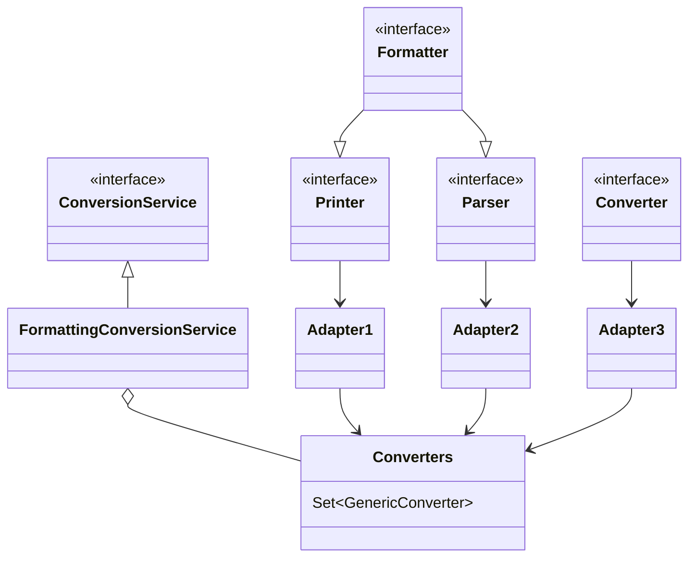

* Printer 把其它类型转为 String
* Parser 把 String 转为其它类型
* Formatter 综合 Printer 与 Parser 功能
* Converter 把类型 S 转为类型 T
* Printer、Parser、Converter 经过适配转换成 GenericConverter 放入 Converters 集合
* FormattingConversionService 利用其它们实现转换


#### 底层第二套转换接口

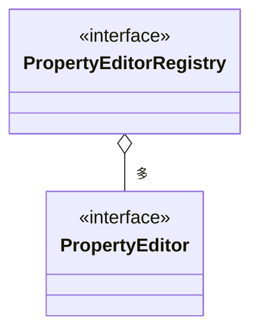

* PropertyEditor 把 String 与其它类型相互转换
* PropertyEditorRegistry 可以注册多个 PropertyEditor 对象
* 与第一套接口直接可以通过 FormatterPropertyEditorAdapter 来进行适配


#### 高层接口与实现

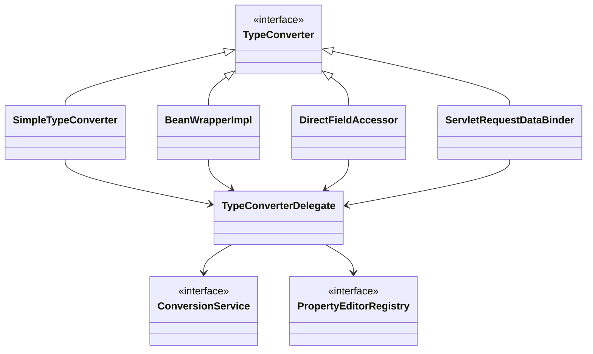

* 它们都实现了 TypeConverter 这个高层转换接口，在转换时，会用到 TypeConverter Delegate 委派ConversionService 与 PropertyEditorRegistry 真正执行转换（Facade 门面模式）
  * 首先看是否有自定义转换器, @InitBinder 添加的即属于这种 (用了适配器模式把 Formatter 转为需要的 PropertyEditor)
  * 再看有没有 ConversionService 转换
  * 再利用默认的 PropertyEditor 转换
  * 最后有一些特殊处理
* SimpleTypeConverter 仅做类型转换
* BeanWrapperImpl 为 bean 的属性赋值，当需要时做类型转换，走 Property
* DirectFieldAccessor 为 bean 的属性赋值，当需要时做类型转换，走 Field
* ServletRequestDataBinder 为 bean 的属性执行绑定，当需要时做类型转换，根据 directFieldAccess 选择走 Property 还是 Field，具备校验与获取校验结果功能


#### 类型转换与数据绑定

##### 示例

###### SimpleTypeConverter

```java
public class TestSimpleConverter {
    public static void main(String[] args) {
        // 仅有类型转换的功能
        SimpleTypeConverter typeConverter = new SimpleTypeConverter();
        Integer number = typeConverter.convertIfNecessary("13", int.class);
        Date date = typeConverter.convertIfNecessary("1999/03/04", Date.class);
        System.out.println(number);
        System.out.println(date);
    }
}
```

###### BeanWrapperImpl

```java
public class TestBeanWrapper {
    public static void main(String[] args) {
        // 利用反射原理, 为 bean 的属性赋值
        MyBean target = new MyBean();
        BeanWrapperImpl wrapper = new BeanWrapperImpl(target);
        wrapper.setPropertyValue("a", "10");
        wrapper.setPropertyValue("b", "hello");
        wrapper.setPropertyValue("c", "1999/03/04");
        System.out.println(target);
    }

    static class MyBean {
        private int a;
        private String b;
        private Date c;

        public int getA() {
            return a;
        }

        public void setA(int a) {
            this.a = a;
        }

        public String getB() {
            return b;
        }

        public void setB(String b) {
            this.b = b;
        }

        public Date getC() {
            return c;
        }

        public void setC(Date c) {
            this.c = c;
        }

        @Override
        public String toString() {
            return "MyBean{" +
                   "a=" + a +
                   ", b='" + b + '\'' +
                   ", c=" + c +
                   '}';
        }
    }
}
```

###### DirectFieldAccessor

```java
public class TestFieldAccessor {
    public static void main(String[] args) {
        // 利用反射原理, 为 bean 的属性赋值
        MyBean target = new MyBean();
        DirectFieldAccessor accessor = new DirectFieldAccessor(target);
        accessor.setPropertyValue("a", "10");
        accessor.setPropertyValue("b", "hello");
        accessor.setPropertyValue("c", "1999/03/04");
        System.out.println(target);
    }

    static class MyBean {
        private int a;
        private String b;
        private Date c;
        @Override
        public String toString() {
            return "MyBean{" +
                   "a=" + a +
                   ", b='" + b + '\'' +
                   ", c=" + c +
                   '}';
        }
    }
}
```

###### DataBinder

```java
public class TestDataBinder {

    public static void main(String[] args) {
        // 执行数据绑定
        MyBean target = new MyBean();
        DataBinder dataBinder = new DataBinder(target);
        // 设置走 Property 还是 Field
        dataBinder.initDirectFieldAccess();
        MutablePropertyValues pvs = new MutablePropertyValues();
        pvs.add("a", "10");
        pvs.add("b", "hello");
        pvs.add("c", "1999/03/04");
        dataBinder.bind(pvs);
        System.out.println(target);
    }

    static class MyBean {
        private int a;
        private String b;
        private Date c;

        @Override
        public String toString() {
            return "MyBean{" +
                   "a=" + a +
                   ", b='" + b + '\'' +
                   ", c=" + c +
                   '}';
        }
    }
}
```

###### ServletRequestDataBinder

```java
public class TestServletDataBinder {

    public static void main(String[] args) {
        // web 环境下数据绑定
        MyBean target = new MyBean();
        ServletRequestDataBinder dataBinder = new ServletRequestDataBinder(target);
        MockHttpServletRequest request = new MockHttpServletRequest();
        request.setParameter("a", "10");
        request.setParameter("b", "hello");
        request.setParameter("c", "1999/03/04");

        dataBinder.bind(new ServletRequestParameterPropertyValues(request));

        System.out.println(target);
    }

    static class MyBean {
        private int a;
        private String b;
        private Date c;

        public int getA() {
            return a;
        }

        public void setA(int a) {
            this.a = a;
        }

        public String getB() {
            return b;
        }

        public void setB(String b) {
            this.b = b;
        }

        public Date getC() {
            return c;
        }

        public void setC(Date c) {
            this.c = c;
        }

        @Override
        public String toString() {
            return "MyBean{" +
                   "a=" + a +
                   ", b='" + b + '\'' +
                   ", c=" + c +
                   '}';
        }
    }
}
```


#### 数据绑定工厂

##### 示例

```java
public class MyDateFormatter implements Formatter<Date> {
    private static final Logger log = LoggerFactory.getLogger(MyDateFormatter.class);
    private final String desc;

    public MyDateFormatter(String desc) {
        this.desc = desc;
    }

    @Override
    public String print(Date date, Locale locale) {
        SimpleDateFormat sdf = new SimpleDateFormat("yyyy|MM|dd");
        return sdf.format(date);
    }

    @Override
    public Date parse(String text, Locale locale) throws ParseException {
        log.debug(">>>>>> 进入了: {}", desc);
        SimpleDateFormat sdf = new SimpleDateFormat("yyyy|MM|dd");
        return sdf.parse(text);
    }
}
```

```java
public class TestServletDataBinderFactory {
    public static void main(String[] args) throws Exception {
        MockHttpServletRequest request = new MockHttpServletRequest();
        request.setParameter("birthday", "1999|01|02");
        request.setParameter("address.name", "西安");

        User target = new User();
//         "1. 用工厂, 无转换功能"
//        ServletRequestDataBinderFactory factory = new ServletRequestDataBinderFactory(null, null);

//         "2. 用 @InitBinder 转换"          PropertyEditorRegistry PropertyEditor
//        InvocableHandlerMethod method = new InvocableHandlerMethod(new MyController(), MyController.class.getMethod("testInitBinder", WebDataBinder.class));
//        ServletRequestDataBinderFactory factory = new ServletRequestDataBinderFactory(Collections.singletonList(method), null);

//         "3. 用 ConversionService 转换"    ConversionService Formatter
//        FormattingConversionService service = new FormattingConversionService();
//        service.addFormatter(new MyDateFormatter("用 ConversionService 方式扩展转换功能"));
//        ConfigurableWebBindingInitializer initializer = new ConfigurableWebBindingInitializer();
//        initializer.setConversionService(service);
//        ServletRequestDataBinderFactory factory = new ServletRequestDataBinderFactory(null, initializer);

//         "4. 同时加了 @InitBinder 和 ConversionService" 使用了 @InitBinder
//        ServletRequestDataBinderFactory factory = new ServletRequestDataBinderFactory(Collections.singletonList(method), initializer);

//         "5. 使用默认 ConversionService 转换" 需要配合 Spring 的容器格式化注解 @DateTimeFormat
//        非 Spring Boot 程序可以使用 DefaultFormattingConversionService，Spring Boot 程序可以使用 ApplicationConversionService，
        DefaultFormattingConversionService service = new DefaultFormattingConversionService();
//        ApplicationConversionService service = new ApplicationConversionService();
        ConfigurableWebBindingInitializer initializer = new ConfigurableWebBindingInitializer();
        initializer.setConversionService(service);
        ServletRequestDataBinderFactory factory = new ServletRequestDataBinderFactory(null, initializer);

        WebDataBinder dataBinder = factory.createBinder(new ServletWebRequest(request), target, "user");
        dataBinder.bind(new ServletRequestParameterPropertyValues(request));
        System.out.println(target);
    }

    static class MyController {
        @InitBinder
        public void testInitBinder(WebDataBinder dataBinder) {
            // 扩展 dataBinder 的转换器
            dataBinder.addCustomFormatter(new MyDateFormatter("用 @InitBinder 方式扩展的"));
        }
    }

    public static class User {
        @DateTimeFormat(pattern = "yyyy|MM|dd")
        private Date birthday;
        private Address address;

        public Address getAddress() {
            return address;
        }

        public void setAddress(Address address) {
            this.address = address;
        }

        public Date getBirthday() {
            return birthday;
        }

        public void setBirthday(Date birthday) {
            this.birthday = birthday;
        }

        @Override
        public String toString() {
            return "User{" +
                   "birthday=" + birthday +
                   ", address=" + address +
                   '}';
        }
    }

    public static class Address {
        private String name;

        public String getName() {
            return name;
        }

        public void setName(String name) {
            this.name = name;
        }

        @Override
        public String toString() {
            return "Address{" +
                   "name='" + name + '\'' +
                   '}';
        }
    }
}
```


##### 总结

ServletRequestDataBinderFactory 的用法和扩展点

1. 可以解析控制器的 @InitBinder 标注方法作为扩展点，添加自定义转换器
   * 控制器私有范围
2. 可以通过 ConfigurableWebBindingInitializer 配置 ConversionService 作为扩展点，添加自定义转换器
   * 公共范围
3. 同时加了 @InitBinder 和 ConversionService 的转换优先级
   1. 优先采用 @InitBinder 的转换器
   2. 其次使用 ConversionService 的转换器
   3. 使用默认转换器
   4. 特殊处理（例如有参构造）


#### 获取泛型参数

##### 示例

```java
public class TestGenericType {
    public static void main(String[] args) {
//         小技巧
//         1. java api
        System.out.println(">>>>>>>>>>>>>>>>>>>>>>>");
        Type type = TeacherDao.class.getGenericSuperclass();
        System.out.println(type);

//        判断父类型是否是泛型
        if (type instanceof ParameterizedType) {
            ParameterizedType parameterizedType = (ParameterizedType) type;
            System.out.println(parameterizedType.getActualTypeArguments()[0]);
        }

//         2. spring api 1
        System.out.println(">>>>>>>>>>>>>>>>>>>>>>>");
        Class<?> t = GenericTypeResolver.resolveTypeArgument(TeacherDao.class, BaseDao.class);
        System.out.println(t);

//         3. spring api 2
        System.out.println(">>>>>>>>>>>>>>>>>>>>>>>");
        System.out.println(ResolvableType.forClass(TeacherDao.class).getSuperType().getGeneric().resolve());
    }

}
```


### @ControllerAdvice 

对 Controller 提供增强功能

- @InitBinder 补充自定义参数转换器

- @ModelAttribute 方法的返回值会作为模型数据补充到控制器的执行过程中
- @ExceptionHandler 统一处理异样


#### @InitBinder

- 可以加在 `@ControllerAdvice` 的方法上，作用范围是全局的，对所有 `@Controller` 都生效
- 可以加在 `@Controller` 的方法上，作用范围是当前 `@Controller`，只对当前 `@Controller` 生效


##### 示例

**准备 @InitBinder** 在整个 HandlerAdapter 调用过程中所处的位置

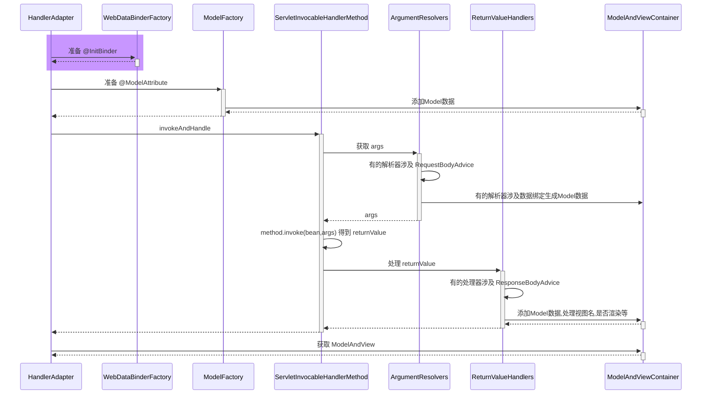

* RequestMappingHandlerAdapter 在图中缩写为 HandlerAdapter
* HandlerMethodArgumentResolverComposite 在图中缩写为 ArgumentResolvers
* HandlerMethodReturnValueHandlerComposite 在图中缩写为 ReturnValueHandlers


```java
public class MyDateFormatter implements Formatter<Date> {
    private static final Logger log = LoggerFactory.getLogger(MyDateFormatter.class);
    private final String desc;

    public MyDateFormatter(String desc) {
        this.desc = desc;
    }

    @Override
    public String print(Date date, Locale locale) {
        SimpleDateFormat sdf = new SimpleDateFormat("yyyy|MM|dd");
        return sdf.format(date);
    }

    @Override
    public Date parse(String text, Locale locale) throws ParseException {
        log.debug(">>>>>> 进入了: {}", desc);
        SimpleDateFormat sdf = new SimpleDateFormat("yyyy|MM|dd");
        return sdf.parse(text);
    }
}
```

```java
@Configuration
public class WebConfig {

    @ControllerAdvice
    static class MyControllerAdvice {
        @InitBinder
        public void binder3(WebDataBinder webDataBinder) {
            webDataBinder.addCustomFormatter(new MyDateFormatter("binder3 转换器"));
        }
    }

    @Controller
    static class Controller1 {
        @InitBinder
        public void binder1(WebDataBinder webDataBinder) {
            webDataBinder.addCustomFormatter(new MyDateFormatter("binder1 转换器"));
        }

        public void foo() {

        }
    }

    @Controller
    static class Controller2 {
        @InitBinder
        public void binder21(WebDataBinder webDataBinder) {
            webDataBinder.addCustomFormatter(new MyDateFormatter("binder21 转换器"));
        }

        @InitBinder
        public void binder22(WebDataBinder webDataBinder) {
            webDataBinder.addCustomFormatter(new MyDateFormatter("binder22 转换器"));
        }

        public void bar() {

        }
    }

}
```

```java
public class Application {

    private static final Logger log = LoggerFactory.getLogger(Application.class);

    public static void main(String[] args) throws Exception {
        /*
            @InitBinder 的来源有两个
            1. @ControllerAdvice 中 @InitBinder 标注的方法，由 RequestMappingHandlerAdapter 在初始化时解析并记录
            2. @Controller 中 @InitBinder 标注的方法，由 RequestMappingHandlerAdapter 会在控制器方法首次执行时解析并记录
         */
        AnnotationConfigApplicationContext context =
                new AnnotationConfigApplicationContext(WebConfig.class);

        RequestMappingHandlerAdapter handlerAdapter = new RequestMappingHandlerAdapter();
        handlerAdapter.setApplicationContext(context);
        handlerAdapter.afterPropertiesSet();

        log.debug("1. 刚开始...");
        showBindMethods(handlerAdapter);

        Method getDataBinderFactory = RequestMappingHandlerAdapter.class.getDeclaredMethod("getDataBinderFactory", HandlerMethod.class);
        getDataBinderFactory.setAccessible(true);

        log.debug("2. 模拟调用 Controller1 的 foo 方法时 ...");
        getDataBinderFactory.invoke(handlerAdapter, new HandlerMethod(new WebConfig.Controller1(), WebConfig.Controller1.class.getMethod("foo")));
        showBindMethods(handlerAdapter);

        log.debug("3. 模拟调用 Controller2 的 bar 方法时 ...");
        getDataBinderFactory.invoke(handlerAdapter, new HandlerMethod(new WebConfig.Controller2(), WebConfig.Controller2.class.getMethod("bar")));
        showBindMethods(handlerAdapter);

        context.close();

        /*
            a. Method 对象的获取利用了缓存来进行加速
            b. 绑定器工厂的扩展点(advice 之一), 通过 @InitBinder 扩展类型转换器
         */
    }

    @SuppressWarnings("all")
    private static void showBindMethods(RequestMappingHandlerAdapter handlerAdapter) throws NoSuchFieldException, IllegalAccessException {
        Field initBinderAdviceCache = RequestMappingHandlerAdapter.class.getDeclaredField("initBinderAdviceCache");
        initBinderAdviceCache.setAccessible(true);
        Map<ControllerAdviceBean, Set<Method>> globalMap = (Map<ControllerAdviceBean, Set<Method>>) initBinderAdviceCache.get(handlerAdapter);
        log.debug("全局的 @InitBinder 方法 {}",
                globalMap.values().stream()
                        .flatMap(ms -> ms.stream().map(m -> m.getName()))
                        .collect(Collectors.toList())
        );

        Field initBinderCache = RequestMappingHandlerAdapter.class.getDeclaredField("initBinderCache");
        initBinderCache.setAccessible(true);
        Map<Class<?>, Set<Method>> controllerMap = (Map<Class<?>, Set<Method>>) initBinderCache.get(handlerAdapter);
        log.debug("控制器的 @InitBinder 方法 {}",
                controllerMap.entrySet().stream()
                        .flatMap(e -> e.getValue().stream().map(v -> e.getKey().getSimpleName() + "." + v.getName()))
                        .collect(Collectors.toList())
        );
    }
}
```


##### 总结

1. RequestMappingHandlerAdapter 初始化时会解析 @ControllerAdvice 中的 @InitBinder 方法
2. RequestMappingHandlerAdapter 会以类为单位，在该类首次使用时，解析此类的 @InitBinder 方法
3. 以上两种 @InitBinder 的解析结果都会缓存来避免重复解析
4. 控制器方法调用时，会综合利用本类的 @InitBinder 方法和 @ControllerAdvice 中的 @InitBinder 方法创建绑定工厂


#### 控制器方法执行流程

##### 图1

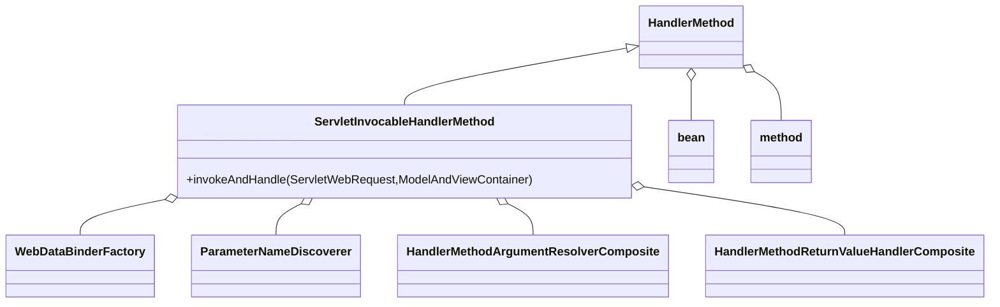

HandlerMethod 需要

* bean 即是哪个 Controller
* method 即是 Controller 中的哪个方法

ServletInvocableHandlerMethod 需要

* WebDataBinderFactory 负责对象绑定、类型转换
* ParameterNameDiscoverer 负责参数名解析
* HandlerMethodArgumentResolverComposite 负责解析参数
* HandlerMethodReturnValueHandlerComposite 负责处理返回值


##### 图2

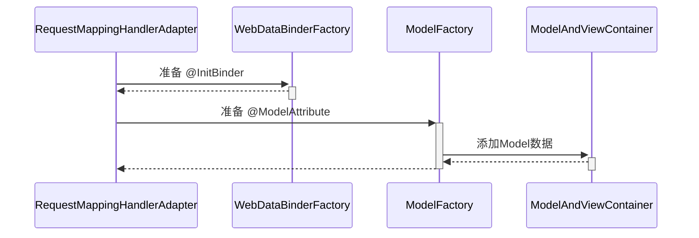

- WebDataBinderFactory 数据绑定工厂
- ModelFactory 模型工厂，用来创建模型数据
- ModelAndViewContainer 存放临时模型数据，`@ControllerAdvice` 的 `@ModelAttribute` 产生的临时数据


##### 图3

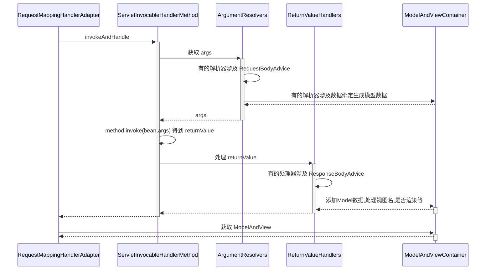


- RequestMappingHandlerAdapter
- ServletInvocableHandlerMethod 反射调用控制器方法
- ArgumentResolvers HandlerMethodArgumentResolverComposite 参数解析器，准备参数
- ReturnValueHandlers HandlerMethodReturnValueHandlerComposite  返回值处理器，处理返回值
- ModelAndViewContainer


#### @ModelAttribute

**准备 @ModelAttribute** 在整个 HandlerAdapter 调用过程中所处的位置

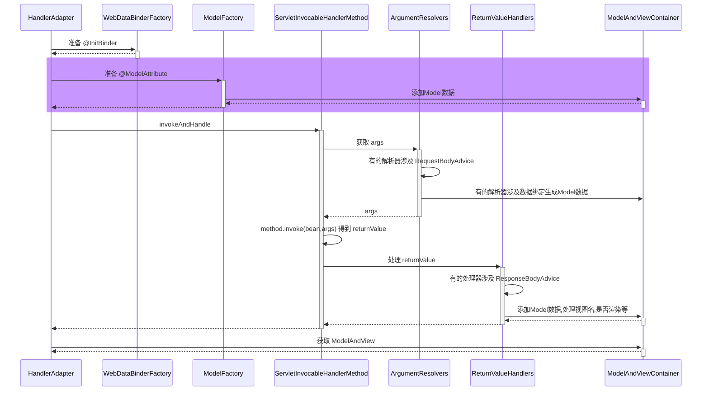


##### 示例

```java
@Configuration
public class WebConfig {

    @ControllerAdvice
    static class MyControllerAdvice {
        @ModelAttribute("a")
        public String aa() {
            return "aa";
        }
    }

    @Controller
    static class Controller1 {
        @ModelAttribute("b")
        public String aa() {
            return "bb";
        }

        // 使用 @ResponseStatus 为了方便测试，不需要实现 HandlerMethodReturnValueHandlerComposite
        @ResponseStatus(HttpStatus.OK)
        public ModelAndView foo(@ModelAttribute("u") User user) {
            System.out.println("foo");
            return null;
        }
    }

    static class User {
        private String name;

        public void setName(String name) {
            this.name = name;
        }

        public String getName() {

            return name;
        }

        @Override
        public String toString() {
            return "User{" +
                   "name='" + name + '\'' +
                   '}';
        }
    }
}
```

```java
public class Application {

    public static void main(String[] args) throws Exception {
        AnnotationConfigApplicationContext context =
                new AnnotationConfigApplicationContext(WebConfig.class);

        RequestMappingHandlerAdapter adapter = new RequestMappingHandlerAdapter();
        adapter.setApplicationContext(context);
        adapter.afterPropertiesSet();

        MockHttpServletRequest request = new MockHttpServletRequest();
        request.setParameter("name", "张三");
        /*
            现在可以通过 ServletInvocableHandlerMethod 把这些整合在一起, 并完成控制器方法的调用, 如下
         */
        ServletInvocableHandlerMethod handlerMethod = new ServletInvocableHandlerMethod(
                new WebConfig.Controller1(), WebConfig.Controller1.class.getMethod("foo", WebConfig.User.class));

        ServletRequestDataBinderFactory factory = new ServletRequestDataBinderFactory(null, null);

        handlerMethod.setDataBinderFactory(factory);
        handlerMethod.setParameterNameDiscoverer(new DefaultParameterNameDiscoverer());
        handlerMethod.setHandlerMethodArgumentResolvers(getArgumentResolvers(context));

        ModelAndViewContainer container = new ModelAndViewContainer();

        // 获取模型工厂方法
        Method getModelFactory = RequestMappingHandlerAdapter.class.getDeclaredMethod("getModelFactory", HandlerMethod.class, WebDataBinderFactory.class);
        getModelFactory.setAccessible(true);
        ModelFactory modelFactory = (ModelFactory) getModelFactory.invoke(adapter, handlerMethod, factory);

        // 初始化模型数据
        modelFactory.initModel(new ServletWebRequest(request), container, handlerMethod);

        handlerMethod.invokeAndHandle(new ServletWebRequest(request), container);

        System.out.println(container.getModel());

        context.close();

        /*
            a. 控制器方法是如何调用的
            b. 模型数据如何产生
            c. advice 之二, @ModelAttribute 补充模型数据
         */
    }

    public static HandlerMethodArgumentResolverComposite getArgumentResolvers(AnnotationConfigApplicationContext context) {
        HandlerMethodArgumentResolverComposite composite = new HandlerMethodArgumentResolverComposite();
        composite.addResolvers(
                new RequestParamMethodArgumentResolver(context.getDefaultListableBeanFactory(), false),
                new PathVariableMethodArgumentResolver(),
                new RequestHeaderMethodArgumentResolver(context.getDefaultListableBeanFactory()),
                new ServletCookieValueMethodArgumentResolver(context.getDefaultListableBeanFactory()),
                new ExpressionValueMethodArgumentResolver(context.getDefaultListableBeanFactory()),
                new ServletRequestMethodArgumentResolver(),
                new ServletModelAttributeMethodProcessor(false),
                new RequestResponseBodyMethodProcessor(Collections.singletonList(new MappingJackson2HttpMessageConverter())),
                new ServletModelAttributeMethodProcessor(true),
                new RequestParamMethodArgumentResolver(context.getDefaultListableBeanFactory(), true)
        );
        return composite;
    }

}
```


##### 总结

1. RequestMappingHandlerAdapter 初始化时会解析 @ControllerAdvice 中的 @ModelAttribute 方法
2. RequestMappingHandlerAdapter 会以类为单位，在该类首次使用时，解析此类的 @ModelAttribute 方法
3. 以上两种 @ModelAttribute 的解析结果都会缓存来避免重复解析
4. 控制器方法调用时，会综合利用本类的 @ModelAttribute 方法和 @ControllerAdvice 中的 @ModelAttribute 方法创建模型工厂


#### ResponseBodyAdvice

##### 示例

**ResponseBodyAdvice 增强** 在整个 HandlerAdapter 调用过程中所处的位置

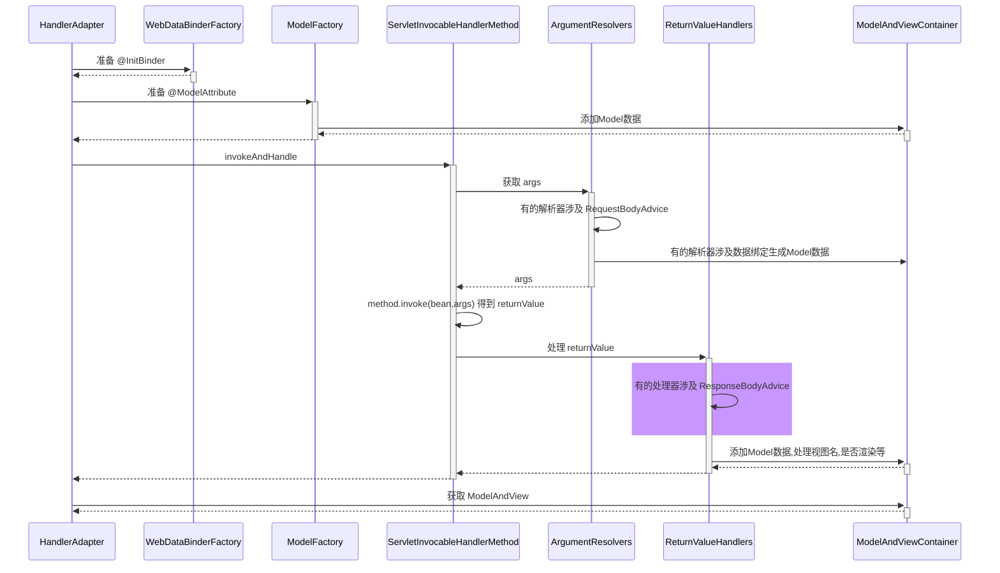

```java
@Configuration
public class WebConfig {

    @ControllerAdvice
    static class MyControllerAdvice implements ResponseBodyAdvice<Object> {
        // 满足条件才转换
        public boolean supports(MethodParameter returnType, Class<? extends HttpMessageConverter<?>> converterType) {
            /**
             * @ResponseBody
             * @RestController
             */
            if (returnType.getMethodAnnotation(ResponseBody.class) != null ||
                AnnotationUtils.findAnnotation(returnType.getContainingClass(), ResponseBody.class) != null) {
                return true;
            }
            return false;
        }

        // 将 User 或其它类型统一为 Result 类型
        public Object beforeBodyWrite(Object body, MethodParameter returnType, MediaType selectedContentType, Class<? extends HttpMessageConverter<?>> selectedConverterType, ServerHttpRequest request, ServerHttpResponse response) {
            if (body instanceof Result) {
                return body;
            }
            return Result.ok(body);
        }
    }

    // @Controller
    // @ResponseBody
    @RestController
    public static class MyController {
        public User user() {
            return new User("王五", 18);
        }
    }

    public static class User {
        private String name;
        private int age;

        public User(String name, int age) {
            this.name = name;
            this.age = age;
        }

        public String getName() {
            return name;
        }

        public void setName(String name) {
            this.name = name;
        }

        public int getAge() {
            return age;
        }

        public void setAge(int age) {
            this.age = age;
        }
    }
}
```

```java
@JsonInclude(JsonInclude.Include.NON_NULL)
public class Result {
    private int code;
    private String msg;
    private Object data;

    public int getCode() {
        return code;
    }

    public void setCode(int code) {
        this.code = code;
    }

    public String getMsg() {
        return msg;
    }

    public void setMsg(String msg) {
        this.msg = msg;
    }

    public Object getData() {
        return data;
    }

    public void setData(Object data) {
        this.data = data;
    }

    @JsonCreator
    private Result(@JsonProperty("code") int code, @JsonProperty("data") Object data) {
        this.code = code;
        this.data = data;
    }

    private Result(int code, String msg) {
        this.code = code;
        this.msg = msg;
    }

    public static Result ok() {
        return new Result(200, null);
    }

    public static Result ok(Object data) {
        return new Result(200, data);
    }

    public static Result error(String msg) {
        return new Result(500, "服务器内部错误:" + msg);
    }
}
```

```java
public class Application {

    public static void main(String[] args) throws Exception {
        AnnotationConfigApplicationContext context =
                new AnnotationConfigApplicationContext(WebConfig.class);

        ServletInvocableHandlerMethod handlerMethod = new ServletInvocableHandlerMethod(
                context.getBean(WebConfig.MyController.class),
                WebConfig.MyController.class.getMethod("user")
        );
        handlerMethod.setDataBinderFactory(new ServletRequestDataBinderFactory(Collections.emptyList(), null));
        handlerMethod.setParameterNameDiscoverer(new DefaultParameterNameDiscoverer());
        handlerMethod.setHandlerMethodArgumentResolvers(getArgumentResolvers(context));
        handlerMethod.setHandlerMethodReturnValueHandlers(getReturnValueHandlers(context));

        MockHttpServletRequest request = new MockHttpServletRequest();
        MockHttpServletResponse response = new MockHttpServletResponse();
        ModelAndViewContainer container = new ModelAndViewContainer();
        handlerMethod.invokeAndHandle(new ServletWebRequest(request, response), container);

        System.out.println(new String(response.getContentAsByteArray(), StandardCharsets.UTF_8));
    }

    public static HandlerMethodArgumentResolverComposite getArgumentResolvers(AnnotationConfigApplicationContext context) {
        HandlerMethodArgumentResolverComposite composite = new HandlerMethodArgumentResolverComposite();
        composite.addResolvers(
                new RequestParamMethodArgumentResolver(context.getDefaultListableBeanFactory(), false),
                new PathVariableMethodArgumentResolver(),
                new RequestHeaderMethodArgumentResolver(context.getDefaultListableBeanFactory()),
                new ServletCookieValueMethodArgumentResolver(context.getDefaultListableBeanFactory()),
                new ExpressionValueMethodArgumentResolver(context.getDefaultListableBeanFactory()),
                new ServletRequestMethodArgumentResolver(),
                new ServletModelAttributeMethodProcessor(false),
                new RequestResponseBodyMethodProcessor(Collections.singletonList(new MappingJackson2HttpMessageConverter())),
                new ServletModelAttributeMethodProcessor(true),
                new RequestParamMethodArgumentResolver(context.getDefaultListableBeanFactory(), true)
        );
        return composite;
    }

    public static HandlerMethodReturnValueHandlerComposite getReturnValueHandlers(AnnotationConfigApplicationContext context) {
        // 添加 advice
        List<ControllerAdviceBean> annotatedBeans = ControllerAdviceBean.findAnnotatedBeans(context);
        List<Object> collect = annotatedBeans.stream().filter(b -> ResponseBodyAdvice.class.isAssignableFrom(b.getBeanType()))
                .collect(Collectors.toList());

        HandlerMethodReturnValueHandlerComposite composite = new HandlerMethodReturnValueHandlerComposite();
        composite.addHandler(new ModelAndViewMethodReturnValueHandler());
        composite.addHandler(new ViewNameMethodReturnValueHandler());
        composite.addHandler(new ServletModelAttributeMethodProcessor(false));
        composite.addHandler(new HttpEntityMethodProcessor(Collections.singletonList(new MappingJackson2HttpMessageConverter())));
        composite.addHandler(new HttpHeadersReturnValueHandler());
        composite.addHandler(new RequestResponseBodyMethodProcessor(Collections.singletonList(new MappingJackson2HttpMessageConverter()), collect));
        composite.addHandler(new ServletModelAttributeMethodProcessor(true));
        return composite;
    }
}
```


##### 总结

1. ResponseBodyAdvice 返回响应体前包装


#### 异常处理

##### @ExceptionHandler

ExceptionHandlerExceptionResolver

###### 异常处理器调用过程

```java
public class DispatcherServlet extends FrameworkServlet {
       protected void doDispatch(HttpServletRequest request, HttpServletResponse response) throws Exception {
        HttpServletRequest processedRequest = request;
        HandlerExecutionChain mappedHandler = null;
        try {
            try {
                try {
                    processedRequest = this.checkMultipart(request);
                    mappedHandler = this.getHandler(processedRequest);
                    HandlerAdapter ha = this.getHandlerAdapter(mappedHandler.getHandler());
                    // 控制器方法调用
                    mv = ha.handle(processedRequest, response, mappedHandler.getHandler());
                } catch (Exception var20) {
                    dispatchException = var20;
                } catch (Throwable var21) {
                    dispatchException = new NestedServletException("Handler dispatch failed", var21);
                }
				// 处理调用结果
                this.processDispatchResult(processedRequest, response, mappedHandler, mv, (Exception)dispatchException);
            } catch (Exception var22) {
			// ...
            } catch (Throwable var23) {
			// ...
            }

        } finally {
			// ...
        }
    }
    
    private void processDispatchResult(HttpServletRequest request, HttpServletResponse response, @Nullable HandlerExecutionChain mappedHandler, @Nullable ModelAndView mv, @Nullable Exception exception) throws Exception {
        boolean errorView = false;
        // 发生异常，进行异常处理
        if (exception != null) {
            if (exception instanceof ModelAndViewDefiningException) {
                this.logger.debug("ModelAndViewDefiningException encountered", exception);
                mv = ((ModelAndViewDefiningException)exception).getModelAndView();
            } else {
                Object handler = mappedHandler != null ? mappedHandler.getHandler() : null;
                mv = this.processHandlerException(request, response, handler, exception);
                errorView = mv != null;
            }
        }

        // ...
    }
    
    @Nullable
    protected ModelAndView processHandlerException(HttpServletRequest request, HttpServletResponse response, @Nullable Object handler, Exception ex) throws Exception {
        request.removeAttribute(HandlerMapping.PRODUCIBLE_MEDIA_TYPES_ATTRIBUTE);
        ModelAndView exMv = null;
        // 查找异常处理器来处理异常
        if (this.handlerExceptionResolvers != null) {
            Iterator var6 = this.handlerExceptionResolvers.iterator();

            while(var6.hasNext()) {
                HandlerExceptionResolver resolver = (HandlerExceptionResolver)var6.next();
                exMv = resolver.resolveException(request, response, handler, ex);
                if (exMv != null) {
                    break;
                }
            }
        }
		// ...
    }
}
```


###### 示例

异常处理器 ExceptionHandlerExceptionResolver

该异常处理器用来处理 `@ExceptionHandler` 的异常方法

```java
public class Application {
    public static void main(String[] args) throws NoSuchMethodException {
        ExceptionHandlerExceptionResolver resolver = new ExceptionHandlerExceptionResolver();
        resolver.setMessageConverters(Collections.singletonList(new MappingJackson2HttpMessageConverter()));
        // 添加参数、返回值处理器
        resolver.afterPropertiesSet();
        MockHttpServletRequest request = new MockHttpServletRequest();
        MockHttpServletResponse response = new MockHttpServletResponse();

        System.out.println("1.测试 json");
        HandlerMethod handlerMethod = new HandlerMethod(new Controller1(), Controller1.class.getMethod("foo"));
        Exception e = new ArithmeticException("被零除");
        resolver.resolveException(request, response, handlerMethod, e);
        System.out.println(new String(response.getContentAsByteArray(), StandardCharsets.UTF_8));

        System.out.println("2.测试 mav");
        handlerMethod = new HandlerMethod(new Controller2(), Controller2.class.getMethod("foo"));
        e = new ArithmeticException("被零除");
        ModelAndView mav = resolver.resolveException(request, response, handlerMethod, e);
        System.out.println(mav.getModel());
        System.out.println(mav.getViewName());

        System.out.println("3.测试嵌套异常");
        handlerMethod = new HandlerMethod(new Controller3(), Controller3.class.getMethod("foo"));
        e = new Exception("e1", new RuntimeException("e2", new IOException("e3")));
        resolver.resolveException(request, response, handlerMethod, e);
        System.out.println(new String(response.getContentAsByteArray(), StandardCharsets.UTF_8));

        System.out.println("4.测试异常处理方法参数解析");

        handlerMethod = new HandlerMethod(new Controller4(), Controller4.class.getMethod("foo"));
        e = new Exception("e1");
        resolver.resolveException(request, response, handlerMethod, e);
        System.out.println(new String(response.getContentAsByteArray(), StandardCharsets.UTF_8));
    }

    static class Controller1 {
        public void foo() {

        }
        @ExceptionHandler
        @ResponseBody
        public Map<String, Object> handle(ArithmeticException e) {
            Map<String, Object> map = new HashMap<>(1);
            map.put("error", e.getMessage());
            return map;
        }
    }

    static class Controller2 {
        public void foo() {

        }
        @ExceptionHandler
        public ModelAndView handle(ArithmeticException e) {
            Map<String, Object> map = new HashMap<>(1);
            map.put("error", e.getMessage());
            return new ModelAndView("test2", map);
        }
    }

    static class Controller3 {
        public void foo() {

        }
        @ExceptionHandler
        @ResponseBody
        public Map<String, Object> handle(IOException e) {
            Map<String, Object> map = new HashMap<>(1);
            map.put("error", e.getMessage());
            return map;
        }
    }

    static class Controller4 {
        public void foo() {}
        @ExceptionHandler
        @ResponseBody
        public Map<String, Object> handler(Exception e, HttpServletRequest request) {
            System.out.println(request);
            Map<String, Object> map = new HashMap<>(1);
            map.put("error", e.getMessage());
            return map;
        }
    }
}
```


###### afterPropertiesSet()

Spring 初始化时调用

```java
public void afterPropertiesSet() {
    // 缓存解析器
    this.initExceptionHandlerAdviceCache();
    List handlers;
    // 添加常用参数解析器
    if (this.argumentResolvers == null) {
        handlers = this.getDefaultArgumentResolvers();
        this.argumentResolvers = (new HandlerMethodArgumentResolverComposite()).addResolvers(handlers);
    }

    // 添加常用返回值处理器
    if (this.returnValueHandlers == null) {
        handlers = this.getDefaultReturnValueHandlers();
        this.returnValueHandlers = (new HandlerMethodReturnValueHandlerComposite()).addHandlers(handlers);
    }

}

private void initExceptionHandlerAdviceCache() {
    if (this.getApplicationContext() != null) {
        List<ControllerAdviceBean> adviceBeans = ControllerAdviceBean.findAnnotatedBeans(this.getApplicationContext());
        Iterator var2 = adviceBeans.iterator();

        while(var2.hasNext()) {
            ControllerAdviceBean adviceBean = (ControllerAdviceBean)var2.next();
            Class<?> beanType = adviceBean.getBeanType();
            // ... 
            ExceptionHandlerMethodResolver resolver = new ExceptionHandlerMethodResolver(beanType);
            if (resolver.hasExceptionMappings()) {
                this.exceptionHandlerAdviceCache.put(adviceBean, resolver);
            }

            if (ResponseBodyAdvice.class.isAssignableFrom(beanType)) {
                this.responseBodyAdvice.add(adviceBean);
            }
            // ...
        }
    }
}
```


###### 总结

1. ExceptionHandlerExceptionResolver 能够重用参数解析器、返回值处理器，实现组件重用
2. 能够支持嵌套异常，在解析异常时会将嵌套的异常展开为数组


##### 全局@ExceptionHandler

当我们没有在 Controller 中使用 `@ExceptionHandler` 进行异常处理时，希望有一个可以进行全局处理异常的 `@ExceptionHandler`

###### 示例

```java
@Configuration
public class WebConfig {
    @ControllerAdvice
    static class MyControllerAdvice {
        @ExceptionHandler
        @ResponseBody
        public Map<String, Object> handle(Exception e) {
            Map<String, Object> map = new HashMap<>();
            map.put("error", e.getMessage());
            return map;
        }
    }

    @Bean
    public ExceptionHandlerExceptionResolver resolver() {
        List list = new ArrayList();
        list.add(new MappingJackson2HttpMessageConverter());
        ExceptionHandlerExceptionResolver resolver = new ExceptionHandlerExceptionResolver();
        resolver.setMessageConverters(list);
        return resolver;
    }
}
```

```java
public class Application {
    public static void main(String[] args) throws NoSuchMethodException {
        MockHttpServletRequest request = new MockHttpServletRequest();
        MockHttpServletResponse response = new MockHttpServletResponse();

//        ExceptionHandlerExceptionResolver resolver = new ExceptionHandlerExceptionResolver();
//        resolver.setMessageConverters(List.of(new MappingJackson2HttpMessageConverter()));
//        resolver.afterPropertiesSet();

        AnnotationConfigApplicationContext context = new AnnotationConfigApplicationContext(WebConfig.class);
        ExceptionHandlerExceptionResolver resolver = context.getBean(ExceptionHandlerExceptionResolver.class);

        HandlerMethod handlerMethod = new HandlerMethod(new Controller5(), Controller5.class.getMethod("foo"));
        Exception e = new Exception("e1");
        resolver.resolveException(request, response, handlerMethod, e);
        System.out.println(new String(response.getContentAsByteArray(), StandardCharsets.UTF_8));
    }

    static class Controller5 {
        public void foo() {

        }
    }
}
```


###### 总结

1. ExceptionHandlerExceptionResolver 初始化时会解析 @ControllerAdvice 中的 @ExceptionHandler 方法
2. ExceptionHandlerExceptionResolver 会以类为单位，在该类首次处理异常时，解析此类的 @ExceptionHandler 方法
3. 以上两种 @ExceptionHandler 的解析结果都会缓存来避免重复解析


### 返回值处理器

#### 常见返回值处理器

```java
org.springframework.web.servlet.mvc.method.annotation.ModelAndViewMethodReturnValueHandler@4c9e38
org.springframework.web.method.annotation.ModelMethodProcessor@5d1e09bc
org.springframework.web.servlet.mvc.method.annotation.ViewMethodReturnValueHandler@4bdc8b5d
org.springframework.web.servlet.mvc.method.annotation.ResponseBodyEmitterReturnValueHandler@3bcd426c
org.springframework.web.servlet.mvc.method.annotation.StreamingResponseBodyReturnValueHandler@5f14a673
org.springframework.web.servlet.mvc.method.annotation.HttpEntityMethodProcessor@726a17c4
org.springframework.web.servlet.mvc.method.annotation.HttpHeadersReturnValueHandler@5dc3fcb7
org.springframework.web.servlet.mvc.method.annotation.CallableMethodReturnValueHandler@c4c0b41
org.springframework.web.servlet.mvc.method.annotation.DeferredResultMethodReturnValueHandler@76911385
org.springframework.web.servlet.mvc.method.annotation.AsyncTaskMethodReturnValueHandler@5467eea4
org.springframework.web.servlet.mvc.method.annotation.ServletModelAttributeMethodProcessor@160396db
org.springframework.web.servlet.mvc.method.annotation.RequestResponseBodyMethodProcessor@7a799159
org.springframework.web.servlet.mvc.method.annotation.ViewNameMethodReturnValueHandler@40ab8a8
org.springframework.web.method.annotation.MapMethodProcessor@6ff37443
org.springframework.web.servlet.mvc.method.annotation.ServletModelAttributeMethodProcessor@65cc8228
```


#### 示例

> `Spring Boot` 版本为 `2.5.5`

```java
@Configuration
public class WebConfig {

    @Bean
    public FreeMarkerConfigurer freeMarkerConfigurer() throws IOException {
        FreeMarkerConfigurer configurer = new FreeMarkerConfigurer();
        configurer.setDefaultEncoding("utf-8");
        configurer.setTemplateLoaderPath("classpath:templates");
        return configurer;
    }

    @Bean // FreeMarkerView 在借助 Spring 初始化时，会要求 web 环境才会走 setConfiguration, 这里想办法去掉了 web 环境的约束
    public FreeMarkerViewResolver viewResolver(FreeMarkerConfigurer configurer) {
        FreeMarkerViewResolver resolver = new FreeMarkerViewResolver(){
//            @Override
            protected AbstractUrlBasedView instantiateView() {
                FreeMarkerView view = new FreeMarkerView() {
                    @Override
                    protected boolean isContextRequired() {
                        return false;
                    }
                };
                view.setConfiguration(configurer.getConfiguration());
                return view;
            }
        };
        resolver.setContentType("text/html;charset=utf-8");
        resolver.setPrefix("/");
        resolver.setSuffix(".ftl");
        resolver.setExposeSpringMacroHelpers(false);
        return resolver;
    }

}
```

```java
public class Application {
    private static final Logger log = LoggerFactory.getLogger(Application.class);

    public static void main(String[] args) throws Exception {
        AnnotationConfigApplicationContext context =
                new AnnotationConfigApplicationContext(WebConfig.class);
        // 1. 测试返回值类型为 ModelAndView
        test(context, "test1", null);

        // 2. 测试返回值类型为 String 时, 把它当做视图名
        test(context, "test2", null);

        // 3. 测试返回值添加了 @ModelAttribute 注解时, 此时需找到默认视图名
        test(context, "test3", "/test3");

        // 4. 测试返回值不加 @ModelAttribute 注解且返回非简单类型时, 此时需找到默认视图名
        test(context, "test4", "/test4");

        // 5. 测试返回值类型为 ResponseEntity 时, 此时不走视图流程
        test(context, "test5", null);

        // 6. 测试返回值类型为 HttpHeaders 时, 此时不走视图流程
        test(context, "test6", null);

        // 7. 测试返回值添加了 @ResponseBody 注解时, 此时不走视图流程
        test(context, "test7", null);
    }

    private static void test(AnnotationConfigApplicationContext context, String methodName, String uri) throws Exception {
        Method method = Controller.class.getMethod(methodName);
        Controller controller = new Controller();
        Object returnValue = method.invoke(controller); // 获取返回值

        HandlerMethod methodHandle = new HandlerMethod(controller, method);

        ModelAndViewContainer container = new ModelAndViewContainer();
        HandlerMethodReturnValueHandlerComposite composite = getReturnValueHandler();
        MockHttpServletRequest request = new MockHttpServletRequest();
        MockHttpServletResponse response = new MockHttpServletResponse();
        if(null != uri){
            request.setRequestURI(uri);
            // 将请求 uri 存入 request 域，当没有找到视图名时将获取 uri 作为视图名
            UrlPathHelper.defaultInstance.resolveAndCacheLookupPath(request);
        }
        ServletWebRequest webRequest = new ServletWebRequest(request, response);
        if (composite.supportsReturnType(methodHandle.getReturnType())) { // 检查是否支持此类型的返回值
            composite.handleReturnValue(returnValue, methodHandle.getReturnType(), container, webRequest);
            System.out.println(container.getModel());
            System.out.println(container.getViewName());
            // 返回值为 ResponseEntity、HttpHeaders、@ResponseBody 的处理器中 `handleReturnValue` 方法内 `mavContainer.setRequestHandled(true);` 设置了不需要视图解析
            if (!container.isRequestHandled()) {
                renderView(context, container, webRequest); // 渲染视图
            } else {
                for (String name : response.getHeaderNames()) {
                    System.out.println(name + "=" + response.getHeader(name));
                }
                System.out.println(new String(response.getContentAsByteArray(), StandardCharsets.UTF_8));
            }
        }
    }

    public static HandlerMethodReturnValueHandlerComposite getReturnValueHandler() {
        HandlerMethodReturnValueHandlerComposite composite = new HandlerMethodReturnValueHandlerComposite();
        composite.addHandler(new ModelAndViewMethodReturnValueHandler());
        composite.addHandler(new ViewNameMethodReturnValueHandler());
        composite.addHandler(new ServletModelAttributeMethodProcessor(false));
        composite.addHandler(new HttpEntityMethodProcessor(Collections.singletonList(new MappingJackson2HttpMessageConverter())));
        composite.addHandler(new HttpHeadersReturnValueHandler());
        composite.addHandler(new RequestResponseBodyMethodProcessor(Collections.singletonList(new MappingJackson2HttpMessageConverter())));
        composite.addHandler(new ServletModelAttributeMethodProcessor(true));
        return composite;
    }

    @SuppressWarnings("all")
    private static void renderView(AnnotationConfigApplicationContext context, ModelAndViewContainer container,
                                   ServletWebRequest webRequest) throws Exception {
        log.debug(">>>>>> 渲染视图");
        FreeMarkerViewResolver resolver = context.getBean(FreeMarkerViewResolver.class);
        String viewName = container.getViewName() != null ? container.getViewName() : new DefaultRequestToViewNameTranslator().getViewName(webRequest.getRequest());
        log.debug("没有获取到视图名, 采用默认视图名: {}", viewName);
        // 每次渲染时, 会产生新的视图对象, 它并非被 Spring 所管理, 但确实借助了 Spring 容器来执行初始化
        View view = resolver.resolveViewName(viewName, Locale.getDefault());
        view.render(container.getModel(), webRequest.getRequest(), webRequest.getResponse());
        System.out.println(new String(((MockHttpServletResponse) webRequest.getResponse()).getContentAsByteArray(), StandardCharsets.UTF_8));
    }

    static class Controller {
        private static final Logger log = LoggerFactory.getLogger(Controller.class);

        public ModelAndView test1() {
            log.debug("test1()");
            ModelAndView mav = new ModelAndView("view1");
            mav.addObject("name", "张三");
            return mav;
        }

        public String test2() {
            log.debug("test2()");
            return "view2";
        }

        @ModelAttribute
//        @RequestMapping("/test3")
        // 返回值缺少视图名，找不到视图名时会使用路径作为视图名
        public User test3() {
            log.debug("test3()");
            return new User("李四", 20);
        }

        public User test4() {
            log.debug("test4()");
            return new User("王五", 30);
        }

        public HttpEntity<User> test5() {
            log.debug("test5()");
            return new HttpEntity<>(new User("赵六", 40));
        }

        public HttpHeaders test6() {
            log.debug("test6()");
            HttpHeaders headers = new HttpHeaders();
            headers.add("Content-Type", "text/html");
            return headers;
        }

        @ResponseBody
        public User test7() {
            log.debug("test7()");
            return new User("钱七", 50);
        }
    }

    // 必须用 public 修饰, 否则 freemarker 渲染其 name, age 属性时失败
    public static class User {
        private String name;
        private int age;

        public User(String name, int age) {
            this.name = name;
            this.age = age;
        }

        public String getName() {
            return name;
        }

        public void setName(String name) {
            this.name = name;
        }

        public int getAge() {
            return age;
        }

        public void setAge(int age) {
            this.age = age;
        }

        @Override
        public String toString() {
            return "User{" +
                   "name='" + name + '\'' +
                   ", age=" + age +
                   '}';
        }
    }
}
```


#### 总结

1. 常见的返回值处理器
   * ModelAndView，分别获取其模型和视图名，放入 ModelAndViewContainer
   * 返回值类型为 String 时，把它当做视图名，放入 ModelAndViewContainer
   * 返回值添加了 @ModelAttribute 注解时，将返回值作为模型，放入 ModelAndViewContainer
     * 此时需找到默认视图名（使用路径作为视图名）
   * 返回值省略 @ModelAttribute 注解且返回非简单类型时，将返回值作为模型，放入 ModelAndViewContainer
     * 此时需找到默认视图名（使用路径作为视图名）
   * 返回值类型为 ResponseEntity 时
     * 不走视图相应流程，此时走 MessageConverter，并设置 ModelAndViewContainer.requestHandled 为 true
     * 处理器中 `handleReturnValue` 方法内 `mavContainer.setRequestHandled(true);` 设置了不需要视图解析
   * 返回值类型为 HttpHeaders 时
     * 不走视图相应流程，会设置 ModelAndViewContainer.requestHandled 为 true
     * 处理器中 `handleReturnValue` 方法内 `mavContainer.setRequestHandled(true);` 设置了不需要视图解析
   * 返回值添加了 @ResponseBody 注解时
     * 不走视图相应流程，此时走 MessageConverter，并设置 ModelAndViewContainer.requestHandled 为 true
     * 处理器中 `handleReturnValue` 方法内 `mavContainer.setRequestHandled(true);` 设置了不需要视图解析
2. 组合模式在 Spring 中的体现 + 1


### MessageConverter

#### 示例

```java
public class Application {
    public static void main(String[] args) throws IOException, NoSuchMethodException, HttpMediaTypeNotAcceptableException {
        test1();
        test2();
        test3();
        test4();
    }

    private static void test4() throws IOException, HttpMediaTypeNotAcceptableException, NoSuchMethodException {
        MockHttpServletRequest request = new MockHttpServletRequest();
        MockHttpServletResponse response = new MockHttpServletResponse();
        ServletWebRequest webRequest = new ServletWebRequest(request, response);

        request.addHeader("Accept", "application/xml");
        response.setContentType("application/json");
        List messageConverterList = new ArrayList<>(2);
        messageConverterList.add(new MappingJackson2HttpMessageConverter());
        messageConverterList.add(new MappingJackson2XmlHttpMessageConverter());
        RequestResponseBodyMethodProcessor processor = new RequestResponseBodyMethodProcessor(messageConverterList);
        processor.handleReturnValue(
                new User("张三", 18),
                new MethodParameter(Application.class.getMethod("user"), -1),
                new ModelAndViewContainer(),
                webRequest
        );
        System.out.println(new String(response.getContentAsByteArray(), StandardCharsets.UTF_8));
    }

    @ResponseBody
    @RequestMapping(produces = "application/json")
    public User user() {
        return null;
    }

    /**
     * json 字符串转 java 对象
     */
    private static void test3() throws IOException {
        MockHttpInputMessage message = new MockHttpInputMessage("{\"name\":\"李四\",\"age\":20}".getBytes(StandardCharsets.UTF_8));
        MappingJackson2HttpMessageConverter converter = new MappingJackson2HttpMessageConverter();
        if (converter.canRead(User.class, MediaType.APPLICATION_JSON)) {
            Object read = converter.read(User.class, message);
            System.out.println(read);
        }
    }

    /**
     * java 对象转 xml 格式字符串
     */
    private static void test2() throws IOException {
        MockHttpOutputMessage message = new MockHttpOutputMessage();
        MappingJackson2XmlHttpMessageConverter converter = new MappingJackson2XmlHttpMessageConverter();
        if (converter.canWrite(User.class, MediaType.APPLICATION_XML)) {
            converter.write(new User("李四", 20), MediaType.APPLICATION_XML, message);
            System.out.println(message.getBodyAsString());
        }
    }

    /**
     * java 对象转 json 格式字符串
     */
    public static void test1() throws IOException {
        MockHttpOutputMessage message = new MockHttpOutputMessage();
        MappingJackson2HttpMessageConverter converter = new MappingJackson2HttpMessageConverter();
        if (converter.canWrite(User.class, MediaType.APPLICATION_JSON)) {
            converter.write(new User("张三", 18), MediaType.APPLICATION_JSON, message);
            System.out.println(message.getBodyAsString());
        }
    }

    public static class User {
        private String name;
        private int age;

        @JsonCreator
        public User(@JsonProperty("name") String name, @JsonProperty("age") int age) {
            this.name = name;
            this.age = age;
        }

        public String getName() {
            return name;
        }

        public void setName(String name) {
            this.name = name;
        }

        public int getAge() {
            return age;
        }

        public void setAge(int age) {
            this.age = age;
        }

        @Override
        public String toString() {
            return "User{" +
                   "name='" + name + '\'' +
                   ", age=" + age +
                   '}';
        }
    }
}
```


#### 总结

1. MessageConverter 的作用
   * @ResponseBody 是返回值处理器解析的
   * 但具体转换工作是 MessageConverter 做的
2. 如何选择 MediaType
   * 首先看 @RequestMapping 上有没有指定
   * 其次看 request 的 Accept 头有没有指定
   * 最后按 MessageConverter 的顺序, 谁能谁先转换


### Tomcat 异常处理

* 我们知道 @ExceptionHandler 只能处理发生在 mvc 流程中的异常，例如控制器内、拦截器内，那么如果是 Filter 出现了异常，如何进行处理呢？

* 在 Spring Boot 中，是这么实现的：
  1. 因为内嵌了 Tomcat 容器，因此可以配置 Tomcat 的错误页面，Filter 与 错误页面之间是通过请求转发跳转的，可以在这里做手脚
  2. 先通过 ErrorPageRegistrarBeanPostProcessor 这个后处理器配置错误页面地址，默认为 `/error` 也可以通过 `${server.error.path}` 进行配置
  3. 当 Filter 发生异常时，不会走 Spring 流程，但会走 Tomcat 的错误处理，于是就希望转发至 `/error` 这个地址
     * 当然，如果没有 @ExceptionHandler，那么最终也会走到 Tomcat 的错误处理
  4. Spring Boot 又提供了一个 BasicErrorController，它就是一个标准 @Controller，@RequestMapping 配置为 `/error`，所以处理异常的职责就又回到了 Spring
  5. 异常信息由于会被 Tomcat 放入 request 作用域，因此 BasicErrorController 里也能获取到
  6. 具体异常信息会由 DefaultErrorAttributes 封装好
  7. BasicErrorController 通过 Accept 头判断需要生成哪种 MediaType 的响应
     * 如果要的不是 text/html，走 MessageConverter 流程
     * 如果需要 text/html，走 mvc 流程，此时又分两种情况
       * 配置了 ErrorViewResolver，根据状态码去找 View
       * 没配置或没找到，用 BeanNameViewResolver 根据一个固定为 error 的名字找到 View，即所谓的 WhitelabelErrorView


#### 示例基础代码

```java
@Configuration
public class WebConfig {
    @Bean
    public TomcatServletWebServerFactory servletWebServerFactory() {
        return new TomcatServletWebServerFactory();
    }

    @Bean
    public DispatcherServlet dispatcherServlet() {
        return new DispatcherServlet();
    }

    @Bean
    public DispatcherServletRegistrationBean servletRegistrationBean(DispatcherServlet dispatcherServlet) {
        DispatcherServletRegistrationBean registrationBean = new DispatcherServletRegistrationBean(dispatcherServlet, "/");
        registrationBean.setLoadOnStartup(1);
        return registrationBean;
    }

    @Bean // @RequestMapping
    public RequestMappingHandlerMapping requestMappingHandlerMapping() {
        return new RequestMappingHandlerMapping();
    }

    @Bean // 注意默认的 RequestMappingHandlerAdapter 不会带 jackson 转换器
    public RequestMappingHandlerAdapter requestMappingHandlerAdapter() {
        RequestMappingHandlerAdapter handlerAdapter = new RequestMappingHandlerAdapter();
        List list = new ArrayList();
        list.add(new MappingJackson2HttpMessageConverter());
        handlerAdapter.setMessageConverters(list);
        return handlerAdapter;
    }

    @Controller
    public static class MyController {
        @RequestMapping("test")
        public ModelAndView test() {
            int i = 1 / 0;
            return null;
        }
}
```

```java
public class Application {

    public static void main(String[] args) throws NoSuchFieldException, IllegalAccessException {
        AnnotationConfigServletWebServerApplicationContext context =
                new AnnotationConfigServletWebServerApplicationContext(WebConfig.class);
        RequestMappingHandlerMapping handlerMapping = context.getBean(RequestMappingHandlerMapping.class);
        handlerMapping.getHandlerMethods().forEach((RequestMappingInfo k, HandlerMethod v) -> {
            System.out.println("映射路径:" + k + "\t方法信息:" + v);
        });
    }
}
```


#### 示例 - Tomcat 的错误页处理

```java
// 自定义错误处理 1.修改了 Tomcat 服务器默认错误地址
// ErrorPageRegistrar 是 TomcatServletWebServerFactory 的父接口
@Bean
public ErrorPageRegistrar errorPageRegistrar() {
    // 出现错误，会使用请求转发 forward 跳转到 error 地址
    // error 地址可以是 servlet 地址、静态页面地址、Controller 地址
    return webServerFactory -> webServerFactory.addErrorPages(new ErrorPage("/error"));
}

// 自定义错误处理 2.添加后处理器
// TomcatServletWebServerFactory 初始化前调用用它增强，注册所有 ErrorPageRegistrar
@Bean
public ErrorPageRegistrarBeanPostProcessor errorPageRegistrarBeanPostProcessor() {
    return new ErrorPageRegistrarBeanPostProcessor();
}

@Controller
public static class MyController {
//   自定义错误处理 3.异常展示
    @RequestMapping("/error")
    @ResponseBody
    public Map<String, Object> error(HttpServletRequest request) {
        // 出现异常时 tomcat 会把异常存储到 request 作用域中
        Throwable e = (Throwable) request.getAttribute(RequestDispatcher.ERROR_EXCEPTION);
        Map<String, Object> map = new HashMap<>();
        map.put("error", e.getMessage());
        return map;
    }
}
```


#### 示例 - Spring Boot 的 BasicErrorController

```java
// 自定义错误处理 1.修改了 Tomcat 服务器默认错误地址
// ErrorPageRegistrar 是 TomcatServletWebServerFactory 的父接口
@Bean
public ErrorPageRegistrar errorPageRegistrar() {
    // 出现错误，会使用请求转发 forward 跳转到 error 地址
    // error 地址可以是 servlet 地址、静态页面地址、Controller 地址
    return webServerFactory -> webServerFactory.addErrorPages(new ErrorPage("/error"));
}

// 自定义错误处理 2.添加后处理器
// TomcatServletWebServerFactory 初始化前调用用它增强，注册所有 ErrorPageRegistrar
@Bean
public ErrorPageRegistrarBeanPostProcessor errorPageRegistrarBeanPostProcessor() {
    return new ErrorPageRegistrarBeanPostProcessor();
}

//    自定义错误处理 3.SpringBoot 中的 BasicErrorController
@Bean
public BasicErrorController basicErrorController() {
    ErrorProperties errorProperties = new ErrorProperties();
    errorProperties.setIncludeException(true);
    return new BasicErrorController(new DefaultErrorAttributes(), errorProperties);
}

//    提供视图
@Bean
public View error() {
    return new View() {
        @Override
        public void render(Map<String, ?> model, HttpServletRequest request, HttpServletResponse response) throws Exception {
            System.out.println(model);
            response.setContentType("text/html;charset=utf-8");
            response.getWriter().print("<h3>服务器内部错误</h3>");
        }
    };
}

//    视图解析器
@Bean
public ViewResolver viewResolver() {
    // 按照视图名找到对应名字的视图对象
    return new BeanNameViewResolver();
}
```


### BeanNameUrlHandlerMapping 与 SimpleControllerHandlerAdapter

路径映射和控制器方法调用，属于 Spring MVC 早期的实现

#### 示例

```java
@Configuration
public class WebConfig {
    @Bean // 内嵌 web 容器工厂
    public TomcatServletWebServerFactory servletWebServerFactory() {
        return new TomcatServletWebServerFactory(8080);
    }

    @Bean // 创建 DispatcherServlet
    public DispatcherServlet dispatcherServlet() {
        return new DispatcherServlet();
    }

    @Bean // 注册 DispatcherServlet, Spring MVC 的入口
    public DispatcherServletRegistrationBean servletRegistrationBean(DispatcherServlet dispatcherServlet) {
        return new DispatcherServletRegistrationBean(dispatcherServlet, "/");
    }

    // /c1  -->  /c1
    // /c2  -->  /c2
    @Bean
    public BeanNameUrlHandlerMapping beanNameUrlHandlerMapping() {
        return new BeanNameUrlHandlerMapping();
    }

    @Bean
    public SimpleControllerHandlerAdapter simpleControllerHandlerAdapter() {
        return new SimpleControllerHandlerAdapter();
    }

    @Component("/c1")
    public static class Controller1 implements Controller {
        @Override
        public ModelAndView handleRequest(HttpServletRequest request, HttpServletResponse response) throws Exception {
            response.getWriter().print("this is c1");
            return null;
        }
    }

    @Component("/c2")
    public static class Controller2 implements Controller {
        @Override
        public ModelAndView handleRequest(HttpServletRequest request, HttpServletResponse response) throws Exception {
            response.getWriter().print("this is c2");
            return null;
        }
    }

    @Bean("/c3")
    public Controller controller3() {
        return (request, response) -> {
            response.getWriter().print("this is c3");
            return null;
        };
    }
}
```

```java
public class Application {
    public static void main(String[] args) {
        AnnotationConfigServletWebServerApplicationContext context
                = new AnnotationConfigServletWebServerApplicationContext(WebConfig.class);
    }
}
```


#### 自定义 HandlerMapping 和 HandlerAdapter

将上例中创建 HandlerMapping 和 HandlerAdapter 的方法改为如下

```java
// /c1  -->  /c1
// /c2  -->  /c2
@Component
static class MyHandlerMapping implements HandlerMapping {
    @Override
    public HandlerExecutionChain getHandler(HttpServletRequest request) throws Exception {
        String key = request.getRequestURI();
        Controller controller = collect.get(key);
        if (controller == null) {
            return null;
        }
        return new HandlerExecutionChain(controller);
    }

    @Autowired
    private ApplicationContext context;
    private Map<String, Controller> collect;

    @PostConstruct
    public void init() {
        collect = context.getBeansOfType(Controller.class).entrySet()
                .stream().filter(e -> e.getKey().startsWith("/"))
                .collect(Collectors.toMap(e -> e.getKey(), e -> e.getValue()));
        System.out.println(collect);
    }
}

@Component
static class MyHandlerAdapter implements HandlerAdapter {

    @Override
    public boolean supports(Object handler) {
        return handler instanceof Controller;
    }

    @Override
    public ModelAndView handle(HttpServletRequest request, HttpServletResponse response, Object handler) throws Exception {
        if (handler instanceof Controller) {
            Controller controller = (Controller) handler;
            controller.handleRequest(request, response);
        }
        return null;
    }

    @Override
    public long getLastModified(HttpServletRequest request, Object handler) {
        return -1;
    }
}
```


#### 总结

1. BeanNameUrlHandlerMapping，以  `/` 开头的 bean 的名字会被当作映射路径
2. 这些 bean 本身当作 handler，要求实现 Controller 接口
3. SimpleControllerHandlerAdapter，调用 handler
4. 模拟实现这组映射器和适配器
5. 对比 RequestMappingHandlerMapping 与 RequestMappingHandlerAdapter
	- RequestMappingHandlerAdapter, 以 @RequestMapping 作为映射路径
	- 控制器的具体方法会被当作 handler
	- RequestMappingHandlerAdapter, 调用 handler


### RouterFunctionMapping 与 HandlerFunctionAdapter

Spring 5.2 开始才引入

#### 示例

```java
@Configuration
public class WebConfig {
    @Bean // 内嵌 web 容器工厂
    public TomcatServletWebServerFactory servletWebServerFactory() {
        return new TomcatServletWebServerFactory(8080);
    }

    @Bean // 创建 DispatcherServlet
    public DispatcherServlet dispatcherServlet() {
        return new DispatcherServlet();
    }

    @Bean // 注册 DispatcherServlet, Spring MVC 的入口
    public DispatcherServletRegistrationBean servletRegistrationBean(DispatcherServlet dispatcherServlet) {
        return new DispatcherServletRegistrationBean(dispatcherServlet, "/");
    }

    // RouterFunctionMapping 初始化时会收集所有 RouterFunction 建立映射
    // 请求到达之后根据请求信息找到对应 HandlerFunction
    @Bean
    public RouterFunctionMapping routerFunctionMapping() {
        return new RouterFunctionMapping();
    }

    // 找到 HandlerFunction 之后调用 HandlerFunction
    @Bean
    public HandlerFunctionAdapter handlerFunctionAdapter() {
        return new HandlerFunctionAdapter();
    }

    @Bean
    public RouterFunction<ServerResponse> r1() {
        return RouterFunctions.route(RequestPredicates.GET("/r1"), new HandlerFunction<ServerResponse>() {
            @Override
            public ServerResponse handle(ServerRequest serverRequest) throws Exception {
                return ServerResponse.ok().body("this is r1");
            }
        });
    }

    @Bean
    public RouterFunction<ServerResponse> r2() {
        return route(GET("/r2"), request -> ok().body("this is r2"));
    }

}
```

```java
public class Application {
    public static void main(String[] args) {
        AnnotationConfigServletWebServerApplicationContext context =
                new AnnotationConfigServletWebServerApplicationContext(WebConfig.class);
    }
}
```


#### 总结

1. RouterFunctionMapping, 通过 RequestPredicate 条件映射
2. handler 要实现 HandlerFunction 接口
3. HandlerFunctionAdapter, 调用 handler
4. 对比 RequestMappingHandlerMapping 与 RequestMappingHandlerAdapter
   - RequestMappingHandlerAdapter, 以 @RequestMapping 作为映射路径
   - 控制器的具体方法会被当作 handler
   - RequestMappingHandlerAdapter, 调用 handler


### SimpleUrlHandlerMapping 与 HttpRequestHandlerAdapter

静态资源处理

#### 示例

```java
@Configuration
public class WebConfig {
    @Bean // 内嵌 web 容器工厂
    public TomcatServletWebServerFactory servletWebServerFactory() {
        return new TomcatServletWebServerFactory(8080);
    }

    @Bean // 创建 DispatcherServlet
    public DispatcherServlet dispatcherServlet() {
        return new DispatcherServlet();
    }

    @Bean // 注册 DispatcherServlet, Spring MVC 的入口
    public DispatcherServletRegistrationBean servletRegistrationBean(DispatcherServlet dispatcherServlet) {
        return new DispatcherServletRegistrationBean(dispatcherServlet, "/");
    }

    /**
     * 映射路径
     */
    @Bean
    public SimpleUrlHandlerMapping simpleUrlHandlerMapping(ApplicationContext context) {
        SimpleUrlHandlerMapping handlerMapping = new SimpleUrlHandlerMapping();
        Map<String, ResourceHttpRequestHandler> map = context.getBeansOfType(ResourceHttpRequestHandler.class);
        handlerMapping.setUrlMap(map);
        System.out.println(map);
        return handlerMapping;
    }

    /**
     * 调用 handler
     */
    @Bean
    public HttpRequestHandlerAdapter httpRequestHandlerAdapter() {
        return new HttpRequestHandlerAdapter();
    }

    /**
     * 作为静态资源 handler
     *
     * /** ->
     *       /index.html
     *       /r1.html
     *       /r2.html
     */
    @Bean("/**")
    public ResourceHttpRequestHandler handler1() {
        ResourceHttpRequestHandler handler = new ResourceHttpRequestHandler();
        List classPathResourceList = new ArrayList();
        List resourceResolver = new ArrayList();
        classPathResourceList.add(new ClassPathResource("static/"));
        // 用于缓存静态资源，第一次从磁盘读取静态资源后缓存下来
        resourceResolver.add(new CachingResourceResolver(new ConcurrentMapCache("cache1")));
        // 用于读取压缩静态资源，需要先将静态资源压缩，例：initGzip
        resourceResolver.add(new EncodedResourceResolver());
        resourceResolver.add(new PathResourceResolver());
        handler.setLocations(classPathResourceList);
        handler.setResourceResolvers(resourceResolver);
        return handler;
    }

    /**
     * /img/** ->
     *          /img/1.jpg
     *          /img/2.jpg
     *          /img/3.jpg
     */
    @Bean("/img/**")
    public ResourceHttpRequestHandler handler2() {
        ResourceHttpRequestHandler handler = new ResourceHttpRequestHandler();
        List classPathResourceList = new ArrayList();
        classPathResourceList.add(new ClassPathResource("images/"));
        handler.setLocations(classPathResourceList);
        return handler;
    }

    /**
     * 欢迎页
     * WelcomePageHandlerMapping 由 Spring Boot 提供
     * 可以映射到静态资源和 Controller
     *
     * a. WelcomePageHandlerMapping, 映射欢迎页(即只映射 '/')
     *     - 它内置了 handler ParameterizableViewController 作用是不执行逻辑, 仅根据视图名找视图
     *     - 视图名固定为 forward:index.html       /**
     * b. SimpleControllerHandlerAdapter, 调用 handler
     *     - 转发至 /index.html
     *     - 处理 /index.html 又会走上面的静态资源处理流程
     */
    @Bean
    public WelcomePageHandlerMapping welcomePageHandlerMapping(ApplicationContext context) {
        Resource resource = context.getResource("classpath:static/index.html");
        return new WelcomePageHandlerMapping(null, context, resource, "/**");
        // 生成实现了 Controller 接口的处理器
    }

    /**
     * 识别调用 Controller 接口的处理器
     */
    @Bean
    public SimpleControllerHandlerAdapter simpleControllerHandlerAdapter() {
        return new SimpleControllerHandlerAdapter();
    }

    /**
     * 压缩静态资源
     */
    @PostConstruct
    @SuppressWarnings("all")
    public void initGzip() throws IOException {
        Resource resource = new ClassPathResource("static");
        File dir = resource.getFile();
        for (File file : dir.listFiles(pathname -> pathname.getName().endsWith(".html"))) {
            System.out.println(file);
            try (FileInputStream fis = new FileInputStream(file); GZIPOutputStream fos = new GZIPOutputStream(new FileOutputStream(file.getAbsoluteFile() + ".gz"))) {
                byte[] bytes = new byte[8 * 1024];
                int len;
                while ((len = fis.read(bytes)) != -1) {
                    fos.write(bytes, 0, len);
                }
            }
        }
    }
}
```

```java
public class Application {
    public static void main(String[] args) {
        AnnotationConfigServletWebServerApplicationContext context
                = new AnnotationConfigServletWebServerApplicationContext(WebConfig.class);
    }
}
```


#### 总结

##### 静态资源处理

1. SimpleUrlHandlerMapping 不会在初始化时收集映射信息，需要手动收集
2. SimpleUrlHandlerMapping 映射路径
3. ResourceHttpRequestHandler 作为静态资源 handler
4. HttpRequestHandlerAdapter, 调用 handler


##### 静态资源解析优化

1. 责任链模式体现
2. 压缩文件需要手动生成


##### 欢迎页

1. 欢迎页支持静态欢迎页与动态欢迎页
2. WelcomePageHandlerMapping 映射欢迎页（即只映射 '/'）
   * 它内置的 handler ParameterizableViewController 作用是不执行逻辑，仅根据视图名找视图
   * 视图名固定为 forward:index.html
3. SimpleControllerHandlerAdapter, 调用 handler
   * 转发至 /index.html
   * 处理 /index.html 又会走上面的静态资源处理流程


#### 映射器与适配器小结

1. HandlerMapping 负责建立请求与控制器之间的映射关系
   * RequestMappingHandlerMapping (与 @RequestMapping 匹配)
   * WelcomePageHandlerMapping    (/)
   * BeanNameUrlHandlerMapping    (与 bean 的名字匹配 以 / 开头)
   * RouterFunctionMapping        (函数式 RequestPredicate, HandlerFunction)
   * SimpleUrlHandlerMapping      (静态资源 通配符 /** /img/**)
   * 之间也会有顺序问题, boot 中默认顺序如上
2. HandlerAdapter 负责实现对各种各样的 handler 的适配调用
   * RequestMappingHandlerAdapter 处理：@RequestMapping 方法
     * 参数解析器、返回值处理器体现了组合模式
   * SimpleControllerHandlerAdapter 处理：Controller 接口
   * HandlerFunctionAdapter 处理：HandlerFunction 函数式接口
   * HttpRequestHandlerAdapter 处理：HttpRequestHandler 接口 (静态资源处理)
   * 这也是典型适配器模式体现


### MVC 处理流程

当浏览器发送一个请求 `http://localhost:8080/hello` 后，请求到达服务器，其处理流程是：

1. 服务器提供了 DispatcherServlet，它使用的是标准 Servlet 技术

   * 路径：默认映射路径为 `/`，即会匹配到所有请求 URL，可作为请求的统一入口，也被称之为**前控制器**
     * jsp 不会匹配到 DispatcherServlet
     * 其它有路径的 Servlet 匹配优先级也高于 DispatcherServlet
   * 创建：在 Boot 中，由 DispatcherServletAutoConfiguration 这个自动配置类提供 DispatcherServlet 的 bean
   * 初始化：DispatcherServlet 初始化时会优先到容器里寻找各种组件，作为它的成员变量
     * HandlerMapping，初始化时记录映射关系
     * HandlerAdapter，初始化时准备参数解析器、返回值处理器、消息转换器
     * HandlerExceptionResolver，初始化时准备参数解析器、返回值处理器、消息转换器
     * ViewResolver
2. DispatcherServlet 会利用 RequestMappingHandlerMapping 查找控制器方法

   * 例如根据 /hello 路径找到 @RequestMapping("/hello") 对应的控制器方法

   * 控制器方法会被封装为 HandlerMethod 对象，并结合匹配到的拦截器一起返回给 DispatcherServlet 

   * HandlerMethod 和拦截器合在一起称为 HandlerExecutionChain（调用链）对象
3. DispatcherServlet 接下来会：

   1. 调用拦截器的 preHandle 方法
   2. RequestMappingHandlerAdapter 调用 handle 方法，准备数据绑定工厂、模型工厂、ModelAndViewContainer、将 HandlerMethod 完善为 ServletInvocableHandlerMethod
      * @ControllerAdvice 全局增强点1️⃣：补充模型数据
      * @ControllerAdvice 全局增强点2️⃣：补充自定义类型转换器
      * 使用 HandlerMethodArgumentResolver 准备参数
        * @ControllerAdvice 全局增强点3️⃣：RequestBody 增强
      * 调用 ServletInvocableHandlerMethod 
      * 使用 HandlerMethodReturnValueHandler 处理返回值
        * @ControllerAdvice 全局增强点4️⃣：ResponseBody 增强
      * 根据 ModelAndViewContainer 获取 ModelAndView
        * 如果返回的 ModelAndView 为 null，不走第 4 步视图解析及渲染流程
          * 例如，有的返回值处理器调用了 HttpMessageConverter 来将结果转换为 JSON，这时 ModelAndView 就为 null
        * 如果返回的 ModelAndView 不为 null，会在第 4 步走视图解析及渲染流程
   3. 调用拦截器的 postHandle 方法
   4. 处理异常或视图渲染
      * 如果 1~3 出现异常，走 ExceptionHandlerExceptionResolver 处理异常流程
        * @ControllerAdvice 全局增强点5️⃣：@ExceptionHandler 异常处理
      * 正常，走视图解析及渲染流程
   5. 调用拦截器的 afterCompletion 方法


## Spring Boot

### Boot 骨架项目

如果是 linux 环境，用以下命令即可获取 spring boot 的骨架 pom.xml

```shell
curl -G https://start.spring.io/pom.xml -d dependencies=web,mysql,mybatis -o pom.xml
```

也可以使用 Postman 等工具实现

若想获取更多用法，请参考

```shell
curl https://start.spring.io
```


### Boot War项目

步骤1：创建模块，区别在于打包方式选择 war


接下来勾选 Spring Web 支持


步骤2：编写控制器

```java
@Controller
public class MyController {

    @RequestMapping("/hello")
    public String abc() {
        System.out.println("进入了控制器");
        return "hello";
    }
}
```

步骤3：编写 jsp 视图，新建 webapp 目录和一个 hello.jsp 文件，注意文件名与控制器方法返回的视图逻辑名一致

```
src
	|- main
		|- java
		|- resources
		|- webapp
			|- hello.jsp
```

步骤4：配置视图路径，打开 application.properties 文件

```properties
spring.mvc.view.prefix=/
spring.mvc.view.suffix=.jsp
```

> 将来 prefix + 控制器方法返回值 + suffix 即为视图完整路径


#### 测试

如果用 mvn 插件 `mvn spring-boot:run` 或 main 方法测试

* 必须添加如下依赖，因为此时用的还是内嵌 tomcat，而内嵌 tomcat 默认不带 jasper（用来解析 jsp）

```xml
<dependency>
    <groupId>org.apache.tomcat.embed</groupId>
    <artifactId>tomcat-embed-jasper</artifactId>
    <scope>provided</scope>
</dependency>
```

也可以使用 Idea 配置 tomcat 来测试，此时用的是外置 tomcat

* 骨架生成的代码中，多了一个 ServletInitializer，它的作用就是配置外置 Tomcat 使用的，在外置 Tomcat 启动后，去调用它创建和运行 SpringApplication


#### 启示

对于 jar 项目，若要支持 jsp，也可以在加入 jasper 依赖的前提下，把 jsp 文件置入 `META-INF/resources` 


### Boot 启动过程


#### 启动过程

##### 阶段一：SpringApplication 构造

1. 记录 BeanDefinition 源
2. 推断应用类型
3. 记录 ApplicationContext 初始化器
4. 记录监听器
5. 推断主启动类


###### 源码

```java
public SpringApplication(ResourceLoader resourceLoader, Class<?>... primarySources) {
    this.sources = new LinkedHashSet();
    this.bannerMode = Mode.CONSOLE;
    this.logStartupInfo = true;
    this.addCommandLineProperties = true;
    this.addConversionService = true;
    this.headless = true;
    this.registerShutdownHook = true;
    this.additionalProfiles = new HashSet();
    this.isCustomEnvironment = false;
    this.lazyInitialization = false;
    this.resourceLoader = resourceLoader;
    Assert.notNull(primarySources, "PrimarySources must not be null");
    // 获取 Bean Definition 源，Bean 可以来自配置类，配置文件...
    this.primarySources = new LinkedHashSet(Arrays.asList(primarySources));
    // 推断应用类型，Spring Boot 支持三种应用类型。非 WEB 应用程序，基于 Servlet 的应用程序，基于 reactive 的应用程序
    // 后续需要根据不同应用类型创建不同类型的 ApplicationConetxt
    this.webApplicationType = WebApplicationType.deduceFromClasspath();
    // 添加 ApplicationContext 初始化器
    // 		作用
    // 		调用 SpringApplication.run 的时候创建 ApplicationContext
    // 		调用初始化器，对 ApplicationContext 进行扩展
    // 		调用 ApplicationContext.reflush 完成 ApplicationContext 初始化
    this.setInitializers(this.getSpringFactoriesInstances(ApplicationContextInitializer.class));
    // 监听器与事件
    //		作用
    //		Spring Boot 程序启动和运行过程中会发布一些事件，监听器就是用来相应这些事件并且做出处理
    this.setListeners(this.getSpringFactoriesInstances(ApplicationListener.class));
    // 主类推断。获取 main 方法所在类
    this.mainApplicationClass = this.deduceMainApplicationClass();
}
```


###### 演示

```xml
<?xml version="1.0" encoding="UTF-8"?>
<beans xmlns="http://www.springframework.org/schema/beans"
       xmlns:xsi="http://www.w3.org/2001/XMLSchema-instance"
       xsi:schemaLocation="http://www.springframework.org/schema/beans http://www.springframework.org/schema/beans/spring-beans.xsd">

    <bean id="bean1" class="cn.example.uums.test.a39.Application.Bean1"/>

</beans>
```


```java
@Configuration
public class Application {

    public static void main(String[] args) throws Exception {
        System.out.println("1. 演示获取 Bean Definition 源");
        SpringApplication spring = new SpringApplication(Application.class);
        Set sourcesSet = new HashSet();
        sourcesSet.add("classpath:b01.xml");
        spring.setSources(sourcesSet);

        System.out.println("2. 演示推断应用类型");
        Method deduceFromClasspath = WebApplicationType.class.getDeclaredMethod("deduceFromClasspath");
        deduceFromClasspath.setAccessible(true);
        System.out.println("\t应用类型为:"+deduceFromClasspath.invoke(null));

        System.out.println("3. 演示 ApplicationContext 初始化器");
        spring.addInitializers(new ApplicationContextInitializer<ConfigurableApplicationContext>() {
            @Override
            public void initialize(ConfigurableApplicationContext configurableApplicationContext) {
                if (configurableApplicationContext instanceof GenericApplicationContext) {
                    GenericApplicationContext gac = (GenericApplicationContext) configurableApplicationContext;
                    gac.registerBean("bean3", Bean3.class);
                }
            }
        });
        System.out.println("4. 演示监听器与事件");
        spring.addListeners(event -> System.out.println("\t事件为:" + event.getClass()));
        System.out.println("5. 演示主类推断");
        Method deduceMainApplicationClass = SpringApplication.class.getDeclaredMethod("deduceMainApplicationClass");
        deduceMainApplicationClass.setAccessible(true);
        System.out.println("\t主类是："+deduceMainApplicationClass.invoke(spring));

        ConfigurableApplicationContext context = spring.run(args);

        // 创建 ApplicationContext
        // 调用初始化器 对 ApplicationContext 做扩展
        // ApplicationContext.refresh
        for (String name : context.getBeanDefinitionNames()) {
            System.out.println("name: " + name + " 来源：" + context.getBeanFactory().getBeanDefinition(name).getResourceDescription());
        }
        context.close();
    }

    static class Bean1 {

    }

    static class Bean2 {

    }

    static class Bean3 {

    }

    @Bean
    public Bean2 bean2() {
        return new Bean2();
    }

    @Bean
    public TomcatServletWebServerFactory servletWebServerFactory() {
        return new TomcatServletWebServerFactory();
    }
}
```


##### 阶段二：执行 run 方法

12 个步骤，7个事件

1. 得到 SpringApplicationRunListeners，名字取得不好，实际是事件发布器

   * 发布 application starting 事件1️⃣

2. 封装启动 args

3. 准备 Environment 添加命令行参数（*）

4. ConfigurationPropertySources 处理（*）

   * 发布 application environment 已准备事件2️⃣

5. 通过 EnvironmentPostProcessorApplicationListener 进行 env 后处理（*）
   * application.properties，由 StandardConfigDataLocationResolver 解析
   * spring.application.json

6. 绑定 spring.main 到 SpringApplication 对象（*）

7. 打印 banner（*）

8. 创建容器

9. 准备容器

   * 发布 application context 已初始化事件3️⃣

10. 加载 bean 定义

    * 发布 application prepared 事件4️⃣

11. refresh 容器

    * 发布 application started 事件5️⃣

12. 执行 runner

    * 发布 application ready 事件6️⃣

    * 这其中有异常，发布 application failed 事件7️⃣

> 带 * 的有独立的示例


###### 源码

```java
public class SpringApplication {
	public ConfigurableApplicationContext run(String... args) {
        StopWatch stopWatch = new StopWatch();
        stopWatch.start();
        ConfigurableApplicationContext context = null;
        this.configureHeadlessProperty();
        // s1.
        SpringApplicationRunListeners listeners = this.getRunListeners(args);
        listeners.starting();

        try {
            ApplicationArguments applicationArguments = new DefaultApplicationArguments(args);
            ConfigurableEnvironment environment = this.prepareEnvironment(listeners, applicationArguments);
            this.configureIgnoreBeanInfo(environment);
            Banner printedBanner = this.printBanner(environment);
            // s8.
            context = this.createApplicationContext();
            this.prepareContext(context, environment, listeners, applicationArguments, printedBanner);
            this.refreshContext(context);
            this.afterRefresh(context, applicationArguments);
            stopWatch.stop();
            if (this.logStartupInfo) {
                (new StartupInfoLogger(this.mainApplicationClass)).logStarted(this.getApplicationLog(), stopWatch);
            }

            listeners.started(context);
            this.callRunners(context, applicationArguments);
        } catch (Throwable var9) {
            this.handleRunFailure(context, var9, listeners);
            throw new IllegalStateException(var9);
        }

        try {
            listeners.running(context);
            return context;
        } catch (Throwable var8) {
            this.handleRunFailure(context, var8, (SpringApplicationRunListeners)null);
            throw new IllegalStateException(var8);
        }
    }
}
```


###### 第1步，7 个事件

```java
public class Application {
    public static void main(String[] args) throws Exception{

        System.out.println("----------------step 1 添加 app 监听器--------------------");
        SpringApplication app = new SpringApplication();
        app.addListeners(e -> System.out.println(e.getClass()));

        // 获取事件发送器实现类名
        // 如何读取 spring.factories 中的配置
        List<String> names = SpringFactoriesLoader.loadFactoryNames(SpringApplicationRunListener.class, Application.class.getClassLoader());
        for (String name : names) {
            System.out.println(name);
            Class<?> clazz = Class.forName(name);
            Constructor<?> constructor = clazz.getConstructor(SpringApplication.class, String[].class);
            SpringApplicationRunListener publisher = (SpringApplicationRunListener) constructor.newInstance(app, args);

            // 发布事件
            // DefaultBootstrapContext 需要 Spring Boot 版本 2.5.5
            DefaultBootstrapContext bootstrapContext = new DefaultBootstrapContext();
            // spring boot 开始启动
        	System.out.println("----------------e1.发布 application starting 事件--------------------");
            publisher.starting(bootstrapContext);
            // 环境信息准备完毕
        	System.out.println("----------------e2.发布 application environment 已准备事件--------------------");
            publisher.environmentPrepared(bootstrapContext, new StandardEnvironment());
            // 在 spring 容器创建，并调用初始化器之后，发送此事件
        	System.out.println("----------------e3.发布 application context 已初始化事件--------------------");
            GenericApplicationContext context = new GenericApplicationContext();
            publisher.contextPrepared(context);
            // 所有 bean definition 加载完毕
        	System.out.println("----------------e4.发布 application prepared 事件--------------------");
            publisher.contextLoaded(context);
            context.refresh();
            // spring 容器初始化完成(refresh 方法调用完毕)
        	System.out.println("----------------e5.发布 application started 事件--------------------");
            publisher.started(context);
            // spring boot 启动完毕
            System.out.println("----------------e6.发布 application ready 事件--------------------");
            publisher.running(context);
            // spring boot 启动出错
            System.out.println("----------------e7.这其中有异常，发布 application failed 事件--------------------");
            publisher.failed(context, new Exception("出错了"));
        }
    }
}
```


###### 第2、8到12步

```xml
<?xml version="1.0" encoding="UTF-8"?>
<beans xmlns="http://www.springframework.org/schema/beans"
       xmlns:xsi="http://www.w3.org/2001/XMLSchema-instance"
       xsi:schemaLocation="http://www.springframework.org/schema/beans http://www.springframework.org/schema/beans/spring-beans.xsd">

    <bean id="bean4" class="cn.example.uums.test.a39.Application.Bean4"/>

</beans>
```


```java
@Component
public class Bean7 {
}
```


```java
// 运行时请添加运行参数 --server.port=8080 debug
public class Application {
    @SuppressWarnings("all")
    public static void main(String[] args) throws Exception {
        SpringApplication app = new SpringApplication();
        app.addInitializers(new ApplicationContextInitializer<ConfigurableApplicationContext>() {
            @Override
            public void initialize(ConfigurableApplicationContext applicationContext) {
                System.out.println("执行初始化器增强...");
            }
        });

        System.out.println("----------------step 2 封装启动 args--------------------");
        DefaultApplicationArguments arguments = new DefaultApplicationArguments(args);

        System.out.println("----------------step 8 创建容器--------------------");
        GenericApplicationContext context = createApplicationContext(WebApplicationType.SERVLET);

        System.out.println("----------------step 9 准备容器--------------------");
        for (ApplicationContextInitializer initializer : app.getInitializers()) {
            initializer.initialize(context);
        }

        System.out.println("----------------step 10 加载 bean definition--------------------");
        DefaultListableBeanFactory beanFactory = context.getDefaultListableBeanFactory();
        AnnotatedBeanDefinitionReader reader1 = new AnnotatedBeanDefinitionReader(beanFactory);
        XmlBeanDefinitionReader reader2 = new XmlBeanDefinitionReader(beanFactory);
        ClassPathBeanDefinitionScanner scanner = new ClassPathBeanDefinitionScanner(beanFactory);

        reader1.register(Config.class);
        reader2.loadBeanDefinitions(new ClassPathResource("b03.xml"));
        scanner.scan("cn.example.uums.test.a39.sub");

        System.out.println("----------------step 11 refresh 容器--------------------");
        context.refresh();

        for (String name : context.getBeanDefinitionNames()) {
            System.out.println("name:" + name + " 来源：" + beanFactory.getBeanDefinition(name).getResourceDescription());
        }

        System.out.println("----------------step 12 执行 runner--------------------");
        // runner 是实现了特定接口的 Bean
        for (CommandLineRunner runner : context.getBeansOfType(CommandLineRunner.class).values()) {
            runner.run(args);
        }

        for (ApplicationRunner runner : context.getBeansOfType(ApplicationRunner.class).values()) {
            runner.run(arguments);
        }

        /*
            学到了什么
            a. 创建容器、加载 bean 定义、refresh, 对应的步骤

         */
    }

    /**
     * SpringApplication 构造时已经推断出了应用类型，需要根据不同应用类型创建不同类型的 ApplicationConetxt
     */
    private static GenericApplicationContext createApplicationContext(WebApplicationType type) {
        GenericApplicationContext context = null;
        switch (type) {
            case SERVLET:
                context = new AnnotationConfigServletWebServerApplicationContext();
            case REACTIVE:
                context = new AnnotationConfigReactiveWebServerApplicationContext();
            case NONE:
                context = new AnnotationConfigApplicationContext();
        }
        return context;
    }

    static class Bean4 {

    }

    static class Bean5 {

    }

    static class Bean6 {

    }

    @Configuration
    static class Config {
        @Bean
        public Bean5 bean5() {
            return new Bean5();
        }

        @Bean
        public ServletWebServerFactory servletWebServerFactory() {
            return new TomcatServletWebServerFactory();
        }

        @Bean
        public CommandLineRunner commandLineRunner() {
            return new CommandLineRunner() {
                @Override
                public void run(String... args) throws Exception {
                    System.out.println("commandLineRunner()..." + Arrays.toString(args));
                }
            };
        }

        @Bean
        public ApplicationRunner applicationRunner() {
            return new ApplicationRunner() {
                @Override
                public void run(ApplicationArguments args) throws Exception {
                    System.out.println("applicationRunner()..." + Arrays.toString(args.getSourceArgs()));
                    System.out.println(args.getOptionNames());
                    System.out.println(args.getOptionValues("server.port"));
                    System.out.println(args.getNonOptionArgs());
                }
            };
        }
    }
}
```


###### 第3到7步

step3.properties

```properties
server.port=8080
```

step4.properties

```properties
user.first-name=George
user.middle_name=Walker
user.lastName=Bush
```

step6.properties

```properties
spring.main.banner-mode=off
spring.main.lazy-initialization=true
```

banner1.txt

```txt
  _____            _             ____              _
 / ____|          (_)           |  _ \            | |
| (___  _ __  _ __ _ _ __   __ _| |_) | ___   ___ | |_
 \___ \| '_ \| '__| | '_ \ / _` |  _ < / _ \ / _ \| __|
 ____) | |_) | |  | | | | | (_| | |_) | (_) | (_) | |_
|_____/| .__/|_|  |_|_| |_|\__, |____/ \___/ \___/ \__|
       | |                  __/ |
       |_|                 |___/
```

[banner2.png](../pictures/20230507/003.png)

```java
public class Application {
    public static void main(String[] args) throws IOException {
        step3(args);
        step4();
        step5(args);
        step6();
        step7();
    }

    private static void step3(String[] args) throws IOException {
        System.out.println("----------------step 3 准备 Environment 添加命令行参数--------------------");
        ApplicationEnvironment env = new ApplicationEnvironment(); // 系统环境变量, properties, yaml
        env.getPropertySources().addLast(new ResourcePropertySource(new ClassPathResource("step3.properties")));
        env.getPropertySources().addFirst(new SimpleCommandLinePropertySource(args));
        // 环境变量来源
        for (PropertySource<?> ps : env.getPropertySources()) {
            System.out.println(ps);
        }
        System.out.println(env.getProperty("JAVA_HOME"));
        System.out.println(env.getProperty("server.port"));
    }

    private static void step4() throws IOException {
        System.out.println("----------------step 4 ConfigurationPropertySources 处理--------------------");
        ApplicationEnvironment env = new ApplicationEnvironment();
        env.getPropertySources().addLast(
                new ResourcePropertySource("step4", new ClassPathResource("step4.properties"))
        );
        ConfigurationPropertySources.attach(env);
        for (PropertySource<?> ps : env.getPropertySources()) {
            System.out.println(ps);
        }

        System.out.println(env.getProperty("user.first-name"));
        System.out.println(env.getProperty("user.middle-name"));
        System.out.println(env.getProperty("user.last-name"));
    }

    private static void step5(String[] args){
        System.out.println("----------------step 5 通过 EnvironmentPostProcessorApplicationListener 进行 env 后处理--------------------");
        // application.properties 在这步被添加到环境
        ApplicationEnvironment env = new ApplicationEnvironment();
        SpringApplication app = new SpringApplication();
        app.addListeners(new EnvironmentPostProcessorApplicationListener());

        /*List<String> names = SpringFactoriesLoader.loadFactoryNames(EnvironmentPostProcessor.class, Application.class.getClassLoader());
        for (String name : names) {
            System.out.println(name);
        }*/

        EventPublishingRunListener publisher = new EventPublishingRunListener(app, args);
        System.out.println(">>>>>>>>>>>>>>>>>>>>>>>>> 增强前");
        for (PropertySource<?> ps : env.getPropertySources()) {
            System.out.println(ps);
        }
        publisher.environmentPrepared(new DefaultBootstrapContext(), env);
        System.out.println(">>>>>>>>>>>>>>>>>>>>>>>>> 增强后");
        for (PropertySource<?> ps : env.getPropertySources()) {
            System.out.println(ps);
        }
        step5Test();
    }

    private static void step6() throws IOException {
        System.out.println("----------------step 6 绑定 spring.main 前缀的 key value 至 SpringApplication--------------------");
        SpringApplication application = new SpringApplication();
        ApplicationEnvironment env = new ApplicationEnvironment();
        env.getPropertySources().addLast(new ResourcePropertySource("step4", new ClassPathResource("step4.properties")));
        env.getPropertySources().addLast(new ResourcePropertySource("step6", new ClassPathResource("step6.properties")));

//        User user = Binder.get(env).bind("user", User.class).get();
//        System.out.println(user);

//        User user = new User();
//        Binder.get(env).bind("user", Bindable.ofInstance(user));
//        System.out.println(user);

        // 属性为 SpringApplication 的私有属性, 请通过 debug 查看
        System.out.println(application);
        Binder.get(env).bind("spring.main", Bindable.ofInstance(application));
        System.out.println(application);
    }

    private static void step7(){
        System.out.println("----------------step 7 打印 banner--------------------");
        ApplicationEnvironment env = new ApplicationEnvironment();
        SpringApplicationBannerPrinter printer = new SpringApplicationBannerPrinter(
                new DefaultResourceLoader(),
                new SpringBootBanner()
        );
        // 测试文字 banner
//        env.getPropertySources().addLast(new MapPropertySource("custom", Map.of("spring.banner.location","banner1.txt")));
        // 测试图片 banner
//        env.getPropertySources().addLast(new MapPropertySource("custom", Map.of("spring.banner.image.location","banner2.png")));
        // 版本号的获取
        System.out.println(SpringBootVersion.getVersion());
        printer.print(env, Application.class, System.out);
    }

    private static void step5Test() {
        SpringApplication app = new SpringApplication();
        ApplicationEnvironment env = new ApplicationEnvironment();

        System.out.println(">>>>>>>>>>>>>>>>>>>>>>>>> 增强前");
        for (PropertySource<?> ps : env.getPropertySources()) {
            System.out.println(ps);
        }
        ConfigDataEnvironmentPostProcessor postProcessor1 = new ConfigDataEnvironmentPostProcessor(new DeferredLogs(), new DefaultBootstrapContext());
        postProcessor1.postProcessEnvironment(env, app);
        System.out.println(">>>>>>>>>>>>>>>>>>>>>>>>> 增强后");
        for (PropertySource<?> ps : env.getPropertySources()) {
            System.out.println(ps);
        }
        RandomValuePropertySourceEnvironmentPostProcessor postProcessor2 = new RandomValuePropertySourceEnvironmentPostProcessor(new DeferredLog());
        postProcessor2.postProcessEnvironment(env, app);
        System.out.println(">>>>>>>>>>>>>>>>>>>>>>>>> 增强后");
        for (PropertySource<?> ps : env.getPropertySources()) {
            System.out.println(ps);
        }
        System.out.println(env.getProperty("server.port"));
        System.out.println(env.getProperty("random.int"));
        System.out.println(env.getProperty("random.int"));
        System.out.println(env.getProperty("random.int"));
        System.out.println(env.getProperty("random.uuid"));
        System.out.println(env.getProperty("random.uuid"));
        System.out.println(env.getProperty("random.uuid"));
    }

    static class User {
        private String firstName;
        private String middleName;
        private String lastName;
        public String getFirstName() {
            return firstName;
        }
        public void setFirstName(String firstName) {
            this.firstName = firstName;
        }
        public String getMiddleName() {
            return middleName;
        }
        public void setMiddleName(String middleName) {
            this.middleName = middleName;
        }
        public String getLastName() {
            return lastName;
        }
        public void setLastName(String lastName) {
            this.lastName = lastName;
        }
        @Override
        public String toString() {
            return "User{" +
                    "firstName='" + firstName + '\'' +
                    ", middleName='" + middleName + '\'' +
                    ", lastName='" + lastName + '\'' +
                    '}';
        }
    }
}
```


#### 收获

1. SpringApplication 构造方法中所做的操作
   * 可以有多种源用来加载 bean 定义
   * 应用类型推断
   * 添加容器初始化器
   * 添加监听器
   * 演示主类推断
2. 如何读取 spring.factories 中的配置
3. 从配置中获取重要的事件发布器：SpringApplicationRunListeners
4. 容器的创建、初始化器增强、加载 bean 定义等
5. CommandLineRunner、ApplicationRunner 的作用
6. 环境对象
   1. 命令行 PropertySource
   2. ConfigurationPropertySources 规范环境键名称
   3. EnvironmentPostProcessor 后处理增强
      * 由 EventPublishingRunListener 通过监听事件2️⃣来调用
   4. 绑定 spring.main 前缀的 key value 至 SpringApplication
7. Banner 


### Tomcat 内嵌容器

Tomcat 基本结构

```
Server
└───Service
    ├───Connector (协议, 端口)
    └───Engine
        └───Host(虚拟主机 localhost)
            ├───Context1 (应用1, 可以设置虚拟路径, / 即 url 起始路径; 项目磁盘路径, 即 docBase )
            │   │   index.html
            │   └───WEB-INF
            │       │   web.xml (servlet, filter, listener) 3.0
            │       ├───classes (servlet, controller, service ...)
            │       ├───jsp
            │       └───lib (第三方 jar 包)
            └───Context2 (应用2)
                │   index.html
                └───WEB-INF
                        web.xml
```

#### Tomcat 内嵌容器


```java
public class TestTomcat {
    @SuppressWarnings("all")
    public static void main(String[] args) throws LifecycleException, IOException {
        // 1.创建 Tomcat 对象
        Tomcat tomcat = new Tomcat();
        tomcat.setBaseDir("tomcat");

        // 2.创建项目文件夹, 即 docBase 文件夹
        File docBase = Files.createTempDirectory("boot.").toFile();
        docBase.deleteOnExit();

        // 3.创建 Tomcat 项目, 在 Tomcat 中称为 Context
        Context context = tomcat.addContext("test/", docBase.getAbsolutePath());
        
        // 4.编程添加 Servlet
        context.addServletContainerInitializer(new ServletContainerInitializer() {
            @Override
            public void onStartup(Set<Class<?>> c, ServletContext ctx) throws ServletException {
                HelloServlet helloServlet = new HelloServlet();
                ctx.addServlet("aaa", helloServlet).addMapping("/hello");
            }
        }, Collections.emptySet());

        // 5.启动 Tomcat
        tomcat.start();

        // 6.创建连接器, 设置监听端口
        Connector connector = new Connector(new Http11Nio2Protocol());
        connector.setPort(8080);
        tomcat.setConnector(connector);
    }
}
```


```java
public class HelloServlet extends HttpServlet {

    @Override
    protected void doGet(HttpServletRequest req, HttpServletResponse resp) throws ServletException, IOException {
        resp.setContentType("text/html;charset=utf-8");
        resp.getWriter().print("<h3>hello</h3>");
    }
}
```


#### 集成 Spring 容器

##### Tomcat 在 Spring 容器中的初始化

创建 Spring 容器时执行 refresh 方法会初始化 Tomcat

```java
public abstract class AbstractApplicationContext extends DefaultResourceLoader implements ConfigurableApplicationContext {
    public void refresh() throws BeansException, IllegalStateException {
        synchronized(this.startupShutdownMonitor) {
            StartupStep contextRefresh = this.applicationStartup.start("spring.context.refresh");
            this.prepareRefresh();
            ConfigurableListableBeanFactory beanFactory = this.obtainFreshBeanFactory();
            this.prepareBeanFactory(beanFactory);

            try {
                this.postProcessBeanFactory(beanFactory);
                StartupStep beanPostProcess = this.applicationStartup.start("spring.context.beans.post-process");
                this.invokeBeanFactoryPostProcessors(beanFactory);
                this.registerBeanPostProcessors(beanFactory);
                beanPostProcess.end();
                this.initMessageSource();
                this.initApplicationEventMulticaster();
                // onRefresh 创建 Tomcat 步骤 1、2、3、4
                this.onRefresh();
                this.registerListeners();
                this.finishBeanFactoryInitialization(beanFactory);
                // 启动 Tomcat 步骤 5、6
                this.finishRefresh();
            } catch (BeansException var10) {
                if (this.logger.isWarnEnabled()) {
                    this.logger.warn("Exception encountered during context initialization - cancelling refresh attempt: " + var10);
                }

                this.destroyBeans();
                this.cancelRefresh(var10);
                throw var10;
            } finally {
                this.resetCommonCaches();
                contextRefresh.end();
            }

        }
    }
}
```


##### 示例

```java
@Configuration
static class Config {
    @Bean
    public DispatcherServletRegistrationBean registrationBean(DispatcherServlet dispatcherServlet) {
        return new DispatcherServletRegistrationBean(dispatcherServlet, "/");
    }

    @Bean
    // 这个例子中必须为 DispatcherServlet 提供 AnnotationConfigWebApplicationContext, 否则会选择 XmlWebApplicationContext 实现
    public DispatcherServlet dispatcherServlet(WebApplicationContext applicationContext) {
        return new DispatcherServlet(applicationContext);
    }

    @Bean
    public RequestMappingHandlerAdapter requestMappingHandlerAdapter() {
        RequestMappingHandlerAdapter handlerAdapter = new RequestMappingHandlerAdapter();
        List list = new ArrayList();
        list.add(new MappingJackson2HttpMessageConverter());
        handlerAdapter.setMessageConverters(list);
        return handlerAdapter;
    }

    @RestController
    static class MyController {
        @GetMapping("hello2")
        public Map<String,Object> hello() {
            Map<String, Object> map = new HashMap<>();
            map.put("hello2", "hello2, spring!");
            return map;
        }
    }
}
```


```java
public class TestTomcat {
    @SuppressWarnings("all")
    public static void main(String[] args) throws LifecycleException, IOException {
        // 1.创建 Tomcat 对象
        Tomcat tomcat = new Tomcat();
        tomcat.setBaseDir("tomcat");

        // 2.创建项目文件夹, 即 docBase 文件夹
        File docBase = Files.createTempDirectory("boot.").toFile();
        docBase.deleteOnExit();

        // 3.创建 Tomcat 项目, 在 Tomcat 中称为 Context
        Context context = tomcat.addContext("test/", docBase.getAbsolutePath());

        WebApplicationContext springContext = getApplicationContext();

        // 4.编程添加 Servlet
        context.addServletContainerInitializer(new ServletContainerInitializer() {
            @Override
            public void onStartup(Set<Class<?>> c, ServletContext ctx) throws ServletException {
                HelloServlet helloServlet = new HelloServlet();
                ctx.addServlet("aaa", helloServlet).addMapping("/hello");

//                DispatcherServlet dispatcherServlet = springContext.getBean(DispatcherServlet.class);
//                ctx.addServlet("dispatcherServlet", dispatcherServlet).addMapping("/");
                for (ServletRegistrationBean registrationBean : springContext.getBeansOfType(ServletRegistrationBean.class).values()) {
                    registrationBean.onStartup(ctx);
                }
            }
        }, Collections.emptySet());

        // 5.启动 Tomcat
        tomcat.start();

        // 6.创建连接器, 设置监听端口
        Connector connector = new Connector(new Http11Nio2Protocol());
        connector.setPort(8080);
        tomcat.setConnector(connector);
    }

    public static WebApplicationContext getApplicationContext() {
//        AnnotationConfigServletWebServerApplicationContext
        AnnotationConfigWebApplicationContext context = new AnnotationConfigWebApplicationContext();
        context.register(Config.class);
        context.refresh();
        return context;
    }
}
```


### Boot 自动配置

#### AopAutoConfiguration

Spring Boot 是利用了自动配置类来简化了 aop 相关配置

* AOP 自动配置类为 `org.springframework.boot.autoconfigure.aop.AopAutoConfiguration`
* 可以通过 `spring.aop.auto=false` 禁用 aop 自动配置
* AOP 自动配置的本质是通过 `@EnableAspectJAutoProxy` 来开启了自动代理，如果在引导类上自己添加了 `@EnableAspectJAutoProxy` 那么以自己添加的为准
* `@EnableAspectJAutoProxy` 的本质是向容器中添加了 `AnnotationAwareAspectJAutoProxyCreator` 这个 bean 后处理器，它能够找到容器中所有切面，并为匹配切点的目标类创建代理，创建代理的工作一般是在 bean 的初始化阶段完成的


##### 源码

```java
@Configuration(
    proxyBeanMethods = false
)
@ConditionalOnProperty(
    prefix = "spring.aop",
    name = {"auto"},
    havingValue = "true",
    matchIfMissing = true
)
public class AopAutoConfiguration {
    public AopAutoConfiguration() {
    }

    @Configuration(
        proxyBeanMethods = false
    )
    @ConditionalOnMissingClass({"org.aspectj.weaver.Advice"})
    @ConditionalOnProperty(
        prefix = "spring.aop",
        name = {"proxy-target-class"},
        havingValue = "true",
        matchIfMissing = true
    )
    static class ClassProxyingConfiguration {
        ClassProxyingConfiguration() {
        }

        @Bean
        static BeanFactoryPostProcessor forceAutoProxyCreatorToUseClassProxying() {
            return (beanFactory) -> {
                if (beanFactory instanceof BeanDefinitionRegistry) {
                    BeanDefinitionRegistry registry = (BeanDefinitionRegistry)beanFactory;
                    AopConfigUtils.registerAutoProxyCreatorIfNecessary(registry);
                    AopConfigUtils.forceAutoProxyCreatorToUseClassProxying(registry);
                }

            };
        }
    }

    @Configuration(
        proxyBeanMethods = false
    )
    @ConditionalOnClass({Advice.class})
    static class AspectJAutoProxyingConfiguration {
        AspectJAutoProxyingConfiguration() {
        }

        @Configuration(
            proxyBeanMethods = false
        )
        @EnableAspectJAutoProxy(
            proxyTargetClass = true
        )
        @ConditionalOnProperty(
            prefix = "spring.aop",
            name = {"proxy-target-class"},
            havingValue = "true",
            matchIfMissing = true
        )
        static class CglibAutoProxyConfiguration {
            CglibAutoProxyConfiguration() {
            }
        }

        @Configuration(
            proxyBeanMethods = false
        )
        @EnableAspectJAutoProxy(
            proxyTargetClass = false
        )
        @ConditionalOnProperty(
            prefix = "spring.aop",
            name = {"proxy-target-class"},
            havingValue = "false"
        )
        static class JdkDynamicAutoProxyConfiguration {
            JdkDynamicAutoProxyConfiguration() {
            }
        }
    }
}
```


##### 示例

```java
public class TestAopAuto {
    public static void main(String[] args) {
        GenericApplicationContext context = new GenericApplicationContext();
        StandardEnvironment env = new StandardEnvironment();
//        env.getPropertySources().addLast(new SimpleCommandLinePropertySource("--spring.aop.auto=false"));
        context.setEnvironment(env);
        // 注册常见的后处理器
        AnnotationConfigUtils.registerAnnotationConfigProcessors(context.getDefaultListableBeanFactory());
        context.registerBean(Config.class);
        context.refresh();
        for (String name : context.getBeanDefinitionNames()) {
            System.out.println(name);
        }
        System.out.println(">>>>>>>>>>>>>>>");
        AnnotationAwareAspectJAutoProxyCreator creator = context.getBean(
                "org.springframework.aop.config.internalAutoProxyCreator", AnnotationAwareAspectJAutoProxyCreator.class);
        System.out.println(creator.isProxyTargetClass());

    }

    @Configuration
    @Import(MyImportSelector.class)
    static class Config {

    }

    static class MyImportSelector implements DeferredImportSelector {
        @Override
        public String[] selectImports(AnnotationMetadata importingClassMetadata) {
            return new String[]{AopAutoConfiguration.class.getName()};
        }
    }
}
```


#### DataSourceAutoConfiguration

* 对应的自动配置类为：org.springframework.boot.autoconfigure.jdbc.DataSourceAutoConfiguration
* 它内部采用了条件装配，通过检查容器的 bean，以及类路径下的 class，来决定该 @Bean 是否生效

简单说明一下，Spring Boot 支持两大类数据源：

* EmbeddedDatabase - 内嵌数据库连接池
* PooledDataSource - 非内嵌数据库连接池

PooledDataSource 又支持如下数据源

* hikari 提供的 HikariDataSource
* tomcat-jdbc 提供的 DataSource
* dbcp2 提供的 BasicDataSource
* oracle 提供的 PoolDataSourceImpl

如果知道数据源的实现类类型，即指定了 `spring.datasource.type`，理论上可以支持所有数据源，但这样做的一个最大问题是无法订制每种数据源的详细配置（如最大、最小连接数等）


##### 源码

```java
@Configuration(
    proxyBeanMethods = false
)
@ConditionalOnClass({DataSource.class, EmbeddedDatabaseType.class})
@ConditionalOnMissingBean(
    type = {"io.r2dbc.spi.ConnectionFactory"}
)
@EnableConfigurationProperties({DataSourceProperties.class})
@Import({DataSourcePoolMetadataProvidersConfiguration.class, InitializationSpecificCredentialsDataSourceInitializationConfiguration.class, SharedCredentialsDataSourceInitializationConfiguration.class})
public class DataSourceAutoConfiguration {
    public DataSourceAutoConfiguration() {
    }

    static class EmbeddedDatabaseCondition extends SpringBootCondition {
        private static final String DATASOURCE_URL_PROPERTY = "spring.datasource.url";
        private final SpringBootCondition pooledCondition = new DataSourceAutoConfiguration.PooledDataSourceCondition();

        EmbeddedDatabaseCondition() {
        }

        public ConditionOutcome getMatchOutcome(ConditionContext context, AnnotatedTypeMetadata metadata) {
            Builder message = ConditionMessage.forCondition("EmbeddedDataSource", new Object[0]);
            if (this.hasDataSourceUrlProperty(context)) {
                return ConditionOutcome.noMatch(message.because("spring.datasource.url is set"));
            } else if (this.anyMatches(context, metadata, new Condition[]{this.pooledCondition})) {
                return ConditionOutcome.noMatch(message.foundExactly("supported pooled data source"));
            } else {
                EmbeddedDatabaseType type = EmbeddedDatabaseConnection.get(context.getClassLoader()).getType();
                return type == null ? ConditionOutcome.noMatch(message.didNotFind("embedded database").atAll()) : ConditionOutcome.match(message.found("embedded database").items(new Object[]{type}));
            }
        }

        private boolean hasDataSourceUrlProperty(ConditionContext context) {
            Environment environment = context.getEnvironment();
            if (environment.containsProperty("spring.datasource.url")) {
                try {
                    return StringUtils.hasText(environment.getProperty("spring.datasource.url"));
                } catch (IllegalArgumentException var4) {
                }
            }

            return false;
        }
    }

    static class PooledDataSourceAvailableCondition extends SpringBootCondition {
        PooledDataSourceAvailableCondition() {
        }

        public ConditionOutcome getMatchOutcome(ConditionContext context, AnnotatedTypeMetadata metadata) {
            Builder message = ConditionMessage.forCondition("PooledDataSource", new Object[0]);
            return DataSourceBuilder.findType(context.getClassLoader()) != null ? ConditionOutcome.match(message.foundExactly("supported DataSource")) : ConditionOutcome.noMatch(message.didNotFind("supported DataSource").atAll());
        }
    }

    static class PooledDataSourceCondition extends AnyNestedCondition {
        PooledDataSourceCondition() {
            super(ConfigurationPhase.PARSE_CONFIGURATION);
        }

        @Conditional({DataSourceAutoConfiguration.PooledDataSourceAvailableCondition.class})
        static class PooledDataSourceAvailable {
            PooledDataSourceAvailable() {
            }
        }

        @ConditionalOnProperty(
            prefix = "spring.datasource",
            name = {"type"}
        )
        static class ExplicitType {
            ExplicitType() {
            }
        }
    }

    @Configuration(
        proxyBeanMethods = false
    )
    @Conditional({DataSourceAutoConfiguration.PooledDataSourceCondition.class})
    @ConditionalOnMissingBean({DataSource.class, XADataSource.class})
    @Import({Hikari.class, Tomcat.class, Dbcp2.class, OracleUcp.class, Generic.class, DataSourceJmxConfiguration.class})
    protected static class PooledDataSourceConfiguration {
        protected PooledDataSourceConfiguration() {
        }
    }

    @Configuration(
        proxyBeanMethods = false
    )
    @Conditional({DataSourceAutoConfiguration.EmbeddedDatabaseCondition.class})
    @ConditionalOnMissingBean({DataSource.class, XADataSource.class})
    @Import({EmbeddedDataSourceConfiguration.class})
    protected static class EmbeddedDatabaseConfiguration {
        protected EmbeddedDatabaseConfiguration() {
        }
    }
}
```


##### 示例

```java
public class TestDataSourceAuto {
    @SuppressWarnings("all")
    public static void main(String[] args) {
        GenericApplicationContext context = new GenericApplicationContext();
        StandardEnvironment env = new StandardEnvironment();
        env.getPropertySources().addLast(new SimpleCommandLinePropertySource(
                "--spring.datasource.url=jdbc:mysql://localhost:3306/test",
                "--spring.datasource.username=root",
                "--spring.datasource.password=root"
        ));
        context.setEnvironment(env);
        AnnotationConfigUtils.registerAnnotationConfigProcessors(context.getDefaultListableBeanFactory());
        context.registerBean(Config.class);

        context.refresh();
        for (String name : context.getBeanDefinitionNames()) {
            String resourceDescription = context.getBeanDefinition(name).getResourceDescription();
            if (resourceDescription != null)
                System.out.println(name + " 来源:" + resourceDescription);
        }
    }

    @Configuration
    @Import(MyImportSelector.class)
    static class Config {

    }

    static class MyImportSelector implements DeferredImportSelector {
        @Override
        public String[] selectImports(AnnotationMetadata importingClassMetadata) {
            return new String[]{
                    DataSourceAutoConfiguration.class.getName()
            };
        }
    }
}
```


#### MybatisAutoConfiguration

* MyBatis 自动配置类为 `org.mybatis.spring.boot.autoconfigure.MybatisAutoConfiguration`
* 它主要配置了两个 bean
  * SqlSessionFactory - MyBatis 核心对象，用来创建 SqlSession
  * SqlSessionTemplate - SqlSession 的实现，此实现会与当前线程绑定
  * 用 ImportBeanDefinitionRegistrar 的方式扫描所有标注了 @Mapper 注解的接口
  * 用 AutoConfigurationPackages 来确定扫描的包
* 还有一个相关的 bean：MybatisProperties，它会读取配置文件中带 `mybatis.` 前缀的配置项进行定制配置

@MapperScan 注解的作用与 MybatisAutoConfiguration 类似，会注册 MapperScannerConfigurer 有如下区别

* @MapperScan 扫描具体包（当然也可以配置关注哪个注解）
* @MapperScan 如果不指定扫描具体包，则会把引导类范围内，所有接口当做 Mapper 接口
* MybatisAutoConfiguration 关注的是所有标注 @Mapper 注解的接口，会忽略掉非 @Mapper 标注的接口

这里有同学有疑问，之前介绍的都是将具体类交给 Spring 管理，怎么到了 MyBatis 这儿，接口就可以被管理呢？

* 其实并非将接口交给 Spring 管理，而是每个接口会对应一个 MapperFactoryBean，是后者被 Spring 所管理，接口只是作为 MapperFactoryBean 的一个属性来配置


##### 源码

```java
@Configuration
@ConditionalOnClass({SqlSessionFactory.class, SqlSessionFactoryBean.class})
@ConditionalOnSingleCandidate(DataSource.class)
@EnableConfigurationProperties({MybatisProperties.class})
@AutoConfigureAfter({DataSourceAutoConfiguration.class, MybatisLanguageDriverAutoConfiguration.class})
public class MybatisAutoConfiguration implements InitializingBean {
    private static final Logger logger = LoggerFactory.getLogger(MybatisAutoConfiguration.class);
    private final MybatisProperties properties;
    private final Interceptor[] interceptors;
    private final TypeHandler[] typeHandlers;
    private final LanguageDriver[] languageDrivers;
    private final ResourceLoader resourceLoader;
    private final DatabaseIdProvider databaseIdProvider;
    private final List<ConfigurationCustomizer> configurationCustomizers;

    public MybatisAutoConfiguration(MybatisProperties properties, ObjectProvider<Interceptor[]> interceptorsProvider, ObjectProvider<TypeHandler[]> typeHandlersProvider, ObjectProvider<LanguageDriver[]> languageDriversProvider, ResourceLoader resourceLoader, ObjectProvider<DatabaseIdProvider> databaseIdProvider, ObjectProvider<List<ConfigurationCustomizer>> configurationCustomizersProvider) {
        this.properties = properties;
        this.interceptors = (Interceptor[])interceptorsProvider.getIfAvailable();
        this.typeHandlers = (TypeHandler[])typeHandlersProvider.getIfAvailable();
        this.languageDrivers = (LanguageDriver[])languageDriversProvider.getIfAvailable();
        this.resourceLoader = resourceLoader;
        this.databaseIdProvider = (DatabaseIdProvider)databaseIdProvider.getIfAvailable();
        this.configurationCustomizers = (List)configurationCustomizersProvider.getIfAvailable();
    }

    public void afterPropertiesSet() {
        this.checkConfigFileExists();
    }

    private void checkConfigFileExists() {
        if (this.properties.isCheckConfigLocation() && StringUtils.hasText(this.properties.getConfigLocation())) {
            Resource resource = this.resourceLoader.getResource(this.properties.getConfigLocation());
            Assert.state(resource.exists(), "Cannot find config location: " + resource + " (please add config file or check your Mybatis configuration)");
        }

    }

    @Bean
    @ConditionalOnMissingBean
    public SqlSessionFactory sqlSessionFactory(DataSource dataSource) throws Exception {
        SqlSessionFactoryBean factory = new SqlSessionFactoryBean();
        factory.setDataSource(dataSource);
        factory.setVfs(SpringBootVFS.class);
        if (StringUtils.hasText(this.properties.getConfigLocation())) {
            factory.setConfigLocation(this.resourceLoader.getResource(this.properties.getConfigLocation()));
        }

        this.applyConfiguration(factory);
        if (this.properties.getConfigurationProperties() != null) {
            factory.setConfigurationProperties(this.properties.getConfigurationProperties());
        }

        if (!ObjectUtils.isEmpty(this.interceptors)) {
            factory.setPlugins(this.interceptors);
        }

        if (this.databaseIdProvider != null) {
            factory.setDatabaseIdProvider(this.databaseIdProvider);
        }

        if (StringUtils.hasLength(this.properties.getTypeAliasesPackage())) {
            factory.setTypeAliasesPackage(this.properties.getTypeAliasesPackage());
        }

        if (this.properties.getTypeAliasesSuperType() != null) {
            factory.setTypeAliasesSuperType(this.properties.getTypeAliasesSuperType());
        }

        if (StringUtils.hasLength(this.properties.getTypeHandlersPackage())) {
            factory.setTypeHandlersPackage(this.properties.getTypeHandlersPackage());
        }

        if (!ObjectUtils.isEmpty(this.typeHandlers)) {
            factory.setTypeHandlers(this.typeHandlers);
        }

        if (!ObjectUtils.isEmpty(this.properties.resolveMapperLocations())) {
            factory.setMapperLocations(this.properties.resolveMapperLocations());
        }

        Set<String> factoryPropertyNames = (Set)Stream.of((new BeanWrapperImpl(SqlSessionFactoryBean.class)).getPropertyDescriptors()).map(FeatureDescriptor::getName).collect(Collectors.toSet());
        Class<? extends LanguageDriver> defaultLanguageDriver = this.properties.getDefaultScriptingLanguageDriver();
        if (factoryPropertyNames.contains("scriptingLanguageDrivers") && !ObjectUtils.isEmpty(this.languageDrivers)) {
            factory.setScriptingLanguageDrivers(this.languageDrivers);
            if (defaultLanguageDriver == null && this.languageDrivers.length == 1) {
                defaultLanguageDriver = this.languageDrivers[0].getClass();
            }
        }

        if (factoryPropertyNames.contains("defaultScriptingLanguageDriver")) {
            factory.setDefaultScriptingLanguageDriver(defaultLanguageDriver);
        }

        return factory.getObject();
    }

    private void applyConfiguration(SqlSessionFactoryBean factory) {
        org.apache.ibatis.session.Configuration configuration = this.properties.getConfiguration();
        if (configuration == null && !StringUtils.hasText(this.properties.getConfigLocation())) {
            configuration = new org.apache.ibatis.session.Configuration();
        }

        if (configuration != null && !CollectionUtils.isEmpty(this.configurationCustomizers)) {
            Iterator var3 = this.configurationCustomizers.iterator();

            while(var3.hasNext()) {
                ConfigurationCustomizer customizer = (ConfigurationCustomizer)var3.next();
                customizer.customize(configuration);
            }
        }

        factory.setConfiguration(configuration);
    }

    @Bean
    @ConditionalOnMissingBean
    public SqlSessionTemplate sqlSessionTemplate(SqlSessionFactory sqlSessionFactory) {
        ExecutorType executorType = this.properties.getExecutorType();
        return executorType != null ? new SqlSessionTemplate(sqlSessionFactory, executorType) : new SqlSessionTemplate(sqlSessionFactory);
    }

    @Configuration
    @Import({MybatisAutoConfiguration.AutoConfiguredMapperScannerRegistrar.class})
    @ConditionalOnMissingBean({MapperFactoryBean.class, MapperScannerConfigurer.class})
    public static class MapperScannerRegistrarNotFoundConfiguration implements InitializingBean {
        public MapperScannerRegistrarNotFoundConfiguration() {
        }

        public void afterPropertiesSet() {
            MybatisAutoConfiguration.logger.debug("Not found configuration for registering mapper bean using @MapperScan, MapperFactoryBean and MapperScannerConfigurer.");
        }
    }

    public static class AutoConfiguredMapperScannerRegistrar implements BeanFactoryAware, ImportBeanDefinitionRegistrar {
        private BeanFactory beanFactory;

        public AutoConfiguredMapperScannerRegistrar() {
        }

        public void registerBeanDefinitions(AnnotationMetadata importingClassMetadata, BeanDefinitionRegistry registry) {
            if (!AutoConfigurationPackages.has(this.beanFactory)) {
                MybatisAutoConfiguration.logger.debug("Could not determine auto-configuration package, automatic mapper scanning disabled.");
            } else {
                MybatisAutoConfiguration.logger.debug("Searching for mappers annotated with @Mapper");
                List<String> packages = AutoConfigurationPackages.get(this.beanFactory);
                if (MybatisAutoConfiguration.logger.isDebugEnabled()) {
                    packages.forEach((pkg) -> {
                        MybatisAutoConfiguration.logger.debug("Using auto-configuration base package '{}'", pkg);
                    });
                }

                BeanDefinitionBuilder builder = BeanDefinitionBuilder.genericBeanDefinition(MapperScannerConfigurer.class);
                builder.addPropertyValue("processPropertyPlaceHolders", true);
                builder.addPropertyValue("annotationClass", Mapper.class);
                builder.addPropertyValue("basePackage", StringUtils.collectionToCommaDelimitedString(packages));
                BeanWrapper beanWrapper = new BeanWrapperImpl(MapperScannerConfigurer.class);
                Set<String> propertyNames = (Set)Stream.of(beanWrapper.getPropertyDescriptors()).map(FeatureDescriptor::getName).collect(Collectors.toSet());
                if (propertyNames.contains("lazyInitialization")) {
                    builder.addPropertyValue("lazyInitialization", "${mybatis.lazy-initialization:false}");
                }

                if (propertyNames.contains("defaultScope")) {
                    builder.addPropertyValue("defaultScope", "${mybatis.mapper-default-scope:}");
                }

                registry.registerBeanDefinition(MapperScannerConfigurer.class.getName(), builder.getBeanDefinition());
            }
        }

        public void setBeanFactory(BeanFactory beanFactory) {
            this.beanFactory = beanFactory;
        }
    }
}
```


##### 示例

```java
public class TestDataSourceAuto {
    @SuppressWarnings("all")
    public static void main(String[] args) {
        GenericApplicationContext context = new GenericApplicationContext();
        StandardEnvironment env = new StandardEnvironment();
        env.getPropertySources().addLast(new SimpleCommandLinePropertySource(
                "--spring.datasource.url=jdbc:mysql://localhost:3306/test",
                "--spring.datasource.username=root",
                "--spring.datasource.password=root"
        ));
        context.setEnvironment(env);
        AnnotationConfigUtils.registerAnnotationConfigProcessors(context.getDefaultListableBeanFactory());
        context.registerBean(Config.class);

        // 注册要扫描的包范围
        String packageName = TestDataSourceAuto.class.getPackage().getName();
        System.out.println("当前包名:" + packageName);
        AutoConfigurationPackages.register(context.getDefaultListableBeanFactory(),
                packageName);

        context.refresh();
        for (String name : context.getBeanDefinitionNames()) {
            String resourceDescription = context.getBeanDefinition(name).getResourceDescription();
            if (resourceDescription != null)
                System.out.println(name + " 来源:" + resourceDescription);
        }
    }

    @Configuration
    @Import(MyImportSelector.class)
    static class Config {

    }

    static class MyImportSelector implements DeferredImportSelector {
        @Override
        public String[] selectImports(AnnotationMetadata importingClassMetadata) {
            return new String[]{
                    DataSourceAutoConfiguration.class.getName(),
                    MybatisAutoConfiguration.class.getName()
            };
        }
    }
}
```


#### TransactionAutoConfiguration

##### 源码

```java
@Configuration(
    proxyBeanMethods = false
)
@Role(2)
public class ProxyTransactionManagementConfiguration extends AbstractTransactionManagementConfiguration {
    public ProxyTransactionManagementConfiguration() {
    }

    @Bean(
        name = {"org.springframework.transaction.config.internalTransactionAdvisor"}
    )
    @Role(2)
    public BeanFactoryTransactionAttributeSourceAdvisor transactionAdvisor(TransactionAttributeSource transactionAttributeSource, TransactionInterceptor transactionInterceptor) {
        BeanFactoryTransactionAttributeSourceAdvisor advisor = new BeanFactoryTransactionAttributeSourceAdvisor();
        advisor.setTransactionAttributeSource(transactionAttributeSource);
        advisor.setAdvice(transactionInterceptor);
        if (this.enableTx != null) {
            advisor.setOrder((Integer)this.enableTx.getNumber("order"));
        }

        return advisor;
    }

    @Bean
    @Role(2)
    public TransactionAttributeSource transactionAttributeSource() {
        return new AnnotationTransactionAttributeSource();
    }

    @Bean
    @Role(2)
    public TransactionInterceptor transactionInterceptor(TransactionAttributeSource transactionAttributeSource) {
        TransactionInterceptor interceptor = new TransactionInterceptor();
        interceptor.setTransactionAttributeSource(transactionAttributeSource);
        if (this.txManager != null) {
            interceptor.setTransactionManager(this.txManager);
        }

        return interceptor;
    }
}
```


##### 示例

```java
public class TestDataSourceAuto {
    @SuppressWarnings("all")
    public static void main(String[] args) {
        GenericApplicationContext context = new GenericApplicationContext();
        StandardEnvironment env = new StandardEnvironment();
        env.getPropertySources().addLast(new SimpleCommandLinePropertySource(
                "--spring.datasource.url=jdbc:mysql://localhost:3306/test",
                "--spring.datasource.username=root",
                "--spring.datasource.password=root"
        ));
        context.setEnvironment(env);
        AnnotationConfigUtils.registerAnnotationConfigProcessors(context.getDefaultListableBeanFactory());
        context.registerBean(Config.class);

        context.refresh();
        for (String name : context.getBeanDefinitionNames()) {
            String resourceDescription = context.getBeanDefinition(name).getResourceDescription();
            if (resourceDescription != null)
                System.out.println(name + " 来源:" + resourceDescription);
        }
    }

    @Configuration
    @Import(MyImportSelector.class)
    static class Config {

    }

    static class MyImportSelector implements DeferredImportSelector {
        @Override
        public String[] selectImports(AnnotationMetadata importingClassMetadata) {
            return new String[]{
                    DataSourceAutoConfiguration.class.getName(),
                    DataSourceTransactionManagerAutoConfiguration.class.getName(),
                    TransactionAutoConfiguration.class.getName()
            };
        }
    }
}
```


* 事务自动配置类有两个：
  * `org.springframework.boot.autoconfigure.jdbc.DataSourceTransactionManagerAutoConfiguration`
  * `org.springframework.boot.autoconfigure.transaction.TransactionAutoConfiguration`

* 前者配置了 DataSourceTransactionManager 用来执行事务的提交、回滚操作
* 后者功能上对标 @EnableTransactionManagement，包含以下三个 bean
  * BeanFactoryTransactionAttributeSourceAdvisor 事务切面类，包含通知和切点
  * TransactionInterceptor 事务通知类，由它在目标方法调用前后加入事务操作
  * AnnotationTransactionAttributeSource 会解析 @Transactional 及事务属性，也包含了切点功能
* 如果自己配置了 DataSourceTransactionManager 或是在引导类加了 @EnableTransactionManagement，则以自己配置的为准


#### ServletWebServerFactoryAutoConfiguration

* 提供 ServletWebServerFactory


#### DispatcherServletAutoConfiguration

* 提供 DispatcherServlet
* 提供 DispatcherServletRegistrationBean


#### WebMvcAutoConfiguration

* 配置 DispatcherServlet 的各项组件，提供的 bean 见过的有
  * 多项 HandlerMapping
  * 多项 HandlerAdapter
  * HandlerExceptionResolver


#### ErrorMvcAutoConfiguration

* 提供的 bean 有 BasicErrorController


#### MultipartAutoConfiguration

* 它提供了 org.springframework.web.multipart.support.StandardServletMultipartResolver
* 该 bean 用来解析 multipart/form-data 格式的数据


#### HttpEncodingAutoConfiguration

* POST 请求参数如果有中文，无需特殊设置，这是因为 Spring Boot 已经配置了 org.springframework.boot.web.servlet.filter.OrderedCharacterEncodingFilter
* 对应配置 server.servlet.encoding.charset=UTF-8，默认就是 UTF-8
* 当然，它只影响非 json 格式的数据


#### 自动配置类原理

##### 示例

假设已有第三方的两个自动配置类

```java
// @Configuration // 第三方的配置类
public class AutoConfiguration1 {
    @Bean
    @ConditionalOnMissingBean
    public Bean1 bean1() {
        return new Bean1("第三方");
    }
}

// @Configuration // 第三方的配置类
public class AutoConfiguration2 {
    @Bean
    public Bean2 bean2() {
        return new Bean2();
    }
}
```

提供一个配置文件 META-INF/spring.factories，key 为导入器类名，值为多个自动配置类名，用逗号分隔

```properties
cn.example.uums.test.a41.MyImportSelector=\
cn.example.uums.test.a41.AutoConfiguration1,\
cn.example.uums.test.a41.AutoConfiguration2
```


引入自动配置

```java
@Configuration // 本项目的配置类
// @Import({AutoConfiguration1.class, AutoConfiguration2.class})
@Import(MyImportSelector.class)
public class Config {
    @Bean
    public Bean1 bean1() {
        return new Bean1("本项目");
    }
}

public class MyImportSelector implements DeferredImportSelector { // ImportSelector
    // 该方法从 META-INF/spring.factories 读取自动配置类名，返回的 String[] 即为要导入的配置类
    @Override
    public String[] selectImports(AnnotationMetadata importingClassMetadata) {
        // return new String[]{AutoConfiguration1.class.getName(), AutoConfiguration2.class.getName()};

        System.out.println(">>>>>>>>>>>>>>>>>>>>> 自动配置类 >>>>>>>>>>>>>>>>>>>>>>>");
        for (String name : SpringFactoriesLoader.loadFactoryNames(EnableAutoConfiguration.class, null)) {
            System.out.println(name);
        }
        System.out.println(">>>>>>>>>>>>>>>>>>>>>>>>>>>>>>>>>>>>>>>>>>>>");

        List<String> names = SpringFactoriesLoader.loadFactoryNames(MyImportSelector.class, null);
        return names.toArray(new String[0]);
    }
}
```


```java
public class Application {

    @SuppressWarnings("all")
    public static void main(String[] args) throws IOException {
        GenericApplicationContext context = new GenericApplicationContext();
        context.getDefaultListableBeanFactory().setAllowBeanDefinitionOverriding(false);
        context.registerBean("config", Config.class);
        context.registerBean(ConfigurationClassPostProcessor.class);
        context.refresh();

        for (String name : context.getBeanDefinitionNames()) {
            System.out.println(name);
        }
        System.out.println(">>>>>>>>>>>>>>>>>>>>>>>>>");
        System.out.println(context.getBean(Bean1.class));
    }
}
```


#### 总结

1. 自动配置类本质上就是一个配置类而已，只是用 META-INF/spring.factories 管理，与应用配置类解耦
2. @Enable 打头的注解本质是利用了 @Import
3. @Import 配合 DeferredImportSelector 即可实现导入，selectImports 方法的返回值即为要导入的配置类名
4. DeferredImportSelector 的导入会在最后执行，为的是让其它配置优先解析


### 条件装配底层

#### 基础

条件装配的底层是本质上是 @Conditional 与 @Condition，这两个注解。引入自动配置类时，期望满足一定条件才能被 Spring 管理，不满足则不管理，怎么做呢？

比如条件是【类路径下必须有 dataSource】这个 bean ，怎么做呢？

首先编写条件判断类，它实现 Condition 接口，编写条件判断逻辑

其次，在要导入的自动配置类上添加 `@Conditional(MyCondition1.class)`，将来此类被导入时就会做条件检查

```java
@Configuration // 第三方的配置类
@Conditional(MyCondition1.class)
public class AutoConfiguration1 {
    @Bean
    public Bean1 bean1() {
        return new Bean1();
    }
}

@Configuration // 第三方的配置类
@Conditional(MyCondition2.class)
public class AutoConfiguration2 {
    @Bean
    public Bean2 bean2() {
        return new Bean2();
    }
}

public class MyCondition1 implements Condition { // 存在 Druid 依赖
    @Override
    public boolean matches(ConditionContext context, AnnotatedTypeMetadata metadata) {
        return ClassUtils.isPresent("com.alibaba.druid.pool.DruidDataSource", null);
    }
}

public class MyCondition2 implements Condition { // 不存在 Druid 依赖
    @Override
    public boolean matches(ConditionContext context, AnnotatedTypeMetadata metadata) {
        return !ClassUtils.isPresent("com.alibaba.druid.pool.DruidDataSource", null);
    }
}

public class Bean1 {}
public class Bean2 {}
```


```java
@Configuration // 本项目的配置类
@Import(MyImportSelector.class)
public class Config {
}

public class MyImportSelector implements DeferredImportSelector {
    @Override
    public String[] selectImports(AnnotationMetadata importingClassMetadata) {
        return new String[]{AutoConfiguration1.class.getName(), AutoConfiguration2.class.getName()};
    }
}
```


```java
public class Application {

    @SuppressWarnings("all")
    public static void main(String[] args) throws IOException {
        GenericApplicationContext context = new GenericApplicationContext();
        context.registerBean("config", Config.class);
        context.registerBean(ConfigurationClassPostProcessor.class);
        context.refresh();

        for (String name : context.getBeanDefinitionNames()) {
            System.out.println(name);
        }
    }
}
```

分别测试加入和去除 druid 依赖，观察 bean1 是否存在于容器

```xml
<dependency>
    <groupId>com.alibaba</groupId>
    <artifactId>druid</artifactId>
    <version>1.1.17</version>
</dependency>
```

##### 总结

1. 学习一种特殊的 if - else


#### 进阶

```java
@Configuration // 第三方的配置类
@ConditionalOnClass(className = "com.alibaba.druid.pool.DruidDataSource", exists = false)
public class AutoConfiguration1 {
    @Bean
    public Bean1 bean1() {
        return new Bean1();
    }
}

@Configuration // 第三方的配置类
@ConditionalOnClass(className = "com.alibaba.druid.pool.DruidDataSource", exists = true)
public class AutoConfiguration2 {
    @Bean
    public Bean2 bean2() {
        return new Bean2();
    }
}

@Retention(RetentionPolicy.RUNTIME)
@Target({ElementType.METHOD, ElementType.TYPE})
@Conditional(MyCondition.class)
@interface ConditionalOnClass {
    boolean exists(); // true 判断存在 false 判断不存在

    String className(); // 要判断的类名
}

public class MyCondition implements Condition { // 存在 Druid 依赖
    @Override
    public boolean matches(ConditionContext context, AnnotatedTypeMetadata metadata) {
        Map<String, Object> attributes = metadata.getAnnotationAttributes(ConditionalOnClass.class.getName());
        String className = attributes.get("className").toString();
        boolean exists = (boolean) attributes.get("exists");
        boolean present = ClassUtils.isPresent(className, null);
        return exists ? present : !present;
    }
}

public class Bean1 {}
public class Bean2 {}
```


```java
@Configuration // 本项目的配置类
@Import(MyImportSelector.class)
public class Config {
}

public class MyImportSelector implements DeferredImportSelector {
    @Override
    public String[] selectImports(AnnotationMetadata importingClassMetadata) {
        return new String[]{AutoConfiguration1.class.getName(), AutoConfiguration2.class.getName()};
    }
}
```


```java
public class Application {

    @SuppressWarnings("all")
    public static void main(String[] args) throws IOException {
        GenericApplicationContext context = new GenericApplicationContext();
        context.registerBean("config", Config.class);
        context.registerBean(ConfigurationClassPostProcessor.class);
        context.refresh();

        for (String name : context.getBeanDefinitionNames()) {
            System.out.println(name);
        }
    }
}
```


## 其它

### FactoryBean

#### 示例


```java
@Component
public class Bean2 {
}

public class Bean1 implements BeanFactoryAware {
    private static final Logger log = LoggerFactory.getLogger(Bean1.class);

    private Bean2 bean2;

    @Autowired
    public void setBean2(Bean2 bean2) {
        log.debug("setBean2({})", bean2);
        this.bean2 = bean2;
    }

    public Bean2 getBean2() {
        return bean2;
    }

    @PostConstruct
    public void init() {
        log.debug("init");
    }

    @Override
    public void setBeanFactory(BeanFactory beanFactory) throws BeansException {
        log.debug("setBeanFactory({})", beanFactory);
    }
}
```


```java
@Component("bean1")
public class Bean1FactoryBean implements FactoryBean<Bean1> {

    private static final Logger log = LoggerFactory.getLogger(Bean1FactoryBean.class);

    // 决定了根据【类型】获取或依赖注入能否成功
    @Override
    public Class<?> getObjectType() {
        return Bean1.class;
    }

    // 决定了 getObject() 方法被调用一次还是多次
    @Override
    public boolean isSingleton() {
        return true;
    }

    @Override
    public Bean1 getObject() throws Exception {
        Bean1 bean1 = new Bean1();
        log.debug("create bean: {}", bean1);
        return bean1;
    }
}
```


```java
@Component
public class Bean1PostProcessor implements BeanPostProcessor {

    private static final Logger log = LoggerFactory.getLogger(Bean1PostProcessor.class);

    @Override
    public Object postProcessBeforeInitialization(Object bean, String beanName) throws BeansException {
        if (beanName.equals("bean1") && bean instanceof Bean1) {
            log.debug("before [{}] init", beanName);
        }
        return bean;
    }

    @Override
    public Object postProcessAfterInitialization(Object bean, String beanName) throws BeansException {
        if (beanName.equals("bean1") && bean instanceof Bean1) {
            log.debug("after [{}] init", beanName);
        }
        return bean;
    }
}
```


```java
@ComponentScan
public class Application {

    public static void main(String[] args) {
        AnnotationConfigApplicationContext context = new AnnotationConfigApplicationContext(Application.class);

        Bean1 bean1 = (Bean1) context.getBean("bean1");
        Bean1 bean2 = (Bean1) context.getBean("bean1");
        Bean1 bean3 = (Bean1) context.getBean("bean1");
        System.out.println(bean1);
        System.out.println(bean2);
        System.out.println(bean3);

        System.out.println(context.getBean(Bean1.class));

        System.out.println(context.getBean(Bean1FactoryBean.class));
        System.out.println(context.getBean("&bean1"));

        context.close();
    }

}
```


#### 总结

一个在 Spring 发展阶段中重要, 但目前已经很鸡肋的接口 FactoryBean 的使用要点
说它鸡肋有两点:

1. 它的作用是用制造创建过程较为复杂的产品, 如 SqlSessionFactory, 但 @Bean 已具备等价功能
2. 使用上较为古怪, 一不留神就会用错
   1. 被 FactoryBean 创建的产品
      * 会认为创建、依赖注入、Aware 接口回调、前初始化这些都是 FactoryBean 的职责, 这些流程都不会走
      * 唯有后初始化的流程会走, 也就是产品可以被代理增强
      * 单例的产品不会存储于 BeanFactory 的 singletonObjects 成员中, 而是另一个 factoryBeanObjectCache 成员中
   2. 按名字去获取时, 拿到的是产品对象, 名字前面加 & 获取的是工厂对象

但目前此接口的实现仍被大量使用, 想被全面废弃很难


### @Indexed 原理

真实项目中，只需要加入以下依赖即可

```xml
<dependency>
    <groupId>org.springframework</groupId>
    <artifactId>spring-context-indexer</artifactId>
    <optional>true</optional>
</dependency>
```


#### 示例

```java
@Component
public class Bean1 {
}
@Component
public class Bean2 {
}
@Component
public class Bean3 {
}

```


```java
public class Application {
    public static void main(String[] args) throws IOException, NoSuchMethodException, InvocationTargetException, IllegalAccessException {
        DefaultListableBeanFactory beanFactory = new DefaultListableBeanFactory();
        // 组件扫描的核心类
        ClassPathBeanDefinitionScanner scanner = new ClassPathBeanDefinitionScanner(beanFactory);

        scanner.scan(A44.class.getPackage().getName());

        for (String name : beanFactory.getBeanDefinitionNames()) {
            System.out.println(name);
        }
    }
}
```


#### 总结

1. 在编译时就根据 @Indexed 生成 META-INF/spring.components 文件
2. 扫描时
   * 如果发现 META-INF/spring.components 存在, 以它为准加载 bean definition
   * 否则, 会遍历包下所有 class 资源 (包括 jar 内的)
3. 解决的问题，在编译期就找到 @Component 组件，节省运行期间扫描 @Component 的时间


### 代理进一步理解

#### 示例

```java

@Component
public class Bean2 {
}

@Component
public class Bean1 {

    private static final Logger log = LoggerFactory.getLogger(Bean1.class);

    protected Bean2 bean2;

    protected boolean initialized;

    @Autowired
    public void setBean2(Bean2 bean2) {
        log.debug("setBean2(Bean2 bean2)");
        this.bean2 = bean2;
    }

    @PostConstruct
    public void init() {
        log.debug("init");
        initialized = true;
    }

    public Bean2 getBean2() {
        log.debug("getBean2()");
        return bean2;
    }

    public boolean isInitialized() {
        log.debug("isInitialized()");
        return initialized;
    }

    public void m1() {
        System.out.println("m1() 成员方法");
    }

    final public void m2() {
        System.out.println("m2() final 方法");
    }

    static public void m3() {
        System.out.println("m3() static 方法");
    }

    private void m4() {
        System.out.println("m4() private 方法");
    }

}
```


```java
@Aspect
@Component
public class MyAspect {

    // 故意对所有方法增强
    @Before("execution(* cn.example.uums.test.a45.Bean1.*(..))")
    public void before() {
        System.out.println("before");
    }
}
```


```java
@SpringBootApplication
public class Application {

    public static void main(String[] args) throws Exception {
        ConfigurableApplicationContext context = SpringApplication.run(Application.class, args);

        Bean1 proxy = context.getBean(Bean1.class);


        /*
            1.演示 spring 代理的设计特点
                依赖注入和初始化影响的是原始对象
                代理与目标是两个对象，二者成员变量并不共用数据
         */
        showProxyAndTarget(proxy);

        System.out.println(">>>>>>>>>>>>>>>>>>>");
        System.out.println(proxy.getBean2());
        System.out.println(proxy.isInitialized());

        /*
            2.演示 static 方法、final 方法、private 方法均无法增强
         */

        proxy.m1();
        proxy.m2();
        proxy.m3();
        Method m4 = Bean1.class.getDeclaredMethod("m4");
        m4.setAccessible(true);
        m4.invoke(proxy);

        context.close();
    }


    public static void showProxyAndTarget(Bean1 proxy) throws Exception {
        System.out.println(">>>>> 代理中的成员变量");
        System.out.println("\tinitialized=" + proxy.initialized);
        System.out.println("\tbean2=" + proxy.bean2);

        if (proxy instanceof Advised) {
            Advised advised = (Advised) proxy;
            System.out.println(">>>>> 目标中的成员变量");
            Bean1 target = (Bean1) advised.getTargetSource().getTarget();
            System.out.println("\tinitialized=" + target.initialized);
            System.out.println("\tbean2=" + target.bean2);
        }
    }

}
```


#### 总结

1. spring 代理的设计特点

   * 依赖注入和初始化影响的是原始对象
     * 因此 cglib 不能用 MethodProxy.invokeSuper()

   * 代理与目标是两个对象，二者成员变量并不共用数据

2. static 方法、final 方法、private 方法均无法增强

   * 进一步理解代理增强基于方法重写


### @Value 装配底层

#### 按类型装配的步骤

1. 查看需要的类型是否为 Optional，是，则进行封装（非延迟），否则向下走
2. 查看需要的类型是否为 ObjectFactory 或 ObjectProvider，是，则进行封装（延迟），否则向下走
3. 查看需要的类型（成员或参数）上是否用 @Lazy 修饰，是，则返回代理，否则向下走
4. 解析 @Value 的值
   1. 如果需要的值是字符串，先解析 ${ }，再解析 #{ }
   2. 不是字符串，需要用 TypeConverter 转换
5. 看需要的类型是否为 Stream、Array、Collection、Map，是，则按集合处理，否则向下走
6. 在 BeanFactory 的 resolvableDependencies 中找有没有类型合适的对象注入，没有向下走
7. 在 BeanFactory 及父工厂中找类型匹配的 bean 进行筛选，筛选时会考虑 @Qualifier 及泛型
8. 结果个数为 0 抛出 NoSuchBeanDefinitionException 异常 
9. 如果结果 > 1，再根据 @Primary 进行筛选
10. 如果结果仍 > 1，再根据成员名或变量名进行筛选
11. 结果仍 > 1，抛出 NoUniqueBeanDefinitionException 异常


#### 示例

```java
@Configuration
@SuppressWarnings("all")
public class Application {

    public static void main(String[] args) throws Exception {
        AnnotationConfigApplicationContext context = new AnnotationConfigApplicationContext(Application.class);
        DefaultListableBeanFactory beanFactory = context.getDefaultListableBeanFactory();

        ContextAnnotationAutowireCandidateResolver resolver = new ContextAnnotationAutowireCandidateResolver();
        resolver.setBeanFactory(beanFactory);

        System.out.println(">>>>>>>>>>>>>>>@Value(\"${MAVEN_HOME}\")");
        test1(context, resolver, Bean1.class.getDeclaredField("home"));
        System.out.println(">>>>>>>>>>>>>>>@Value(\"18\")");
        test2(context, resolver, Bean1.class.getDeclaredField("age"));
        System.out.println(">>>>>>>>>>>>>>>@Value(\"#{@bean3}\")");
        test3(context, resolver, Bean2.class.getDeclaredField("bean3"));
        System.out.println(">>>>>>>>>>>>>>>@Value(\"#{'hello, ' + '${MAVEN_HOME}'}\")");
        test3(context, resolver, Bean4.class.getDeclaredField("value"));
    }

    private static void test3(AnnotationConfigApplicationContext context, ContextAnnotationAutowireCandidateResolver resolver, Field field) {
        DependencyDescriptor dd1 = new DependencyDescriptor(field, false);
        // 获取 @Value 的内容
        String value = resolver.getSuggestedValue(dd1).toString();
        System.out.println(value);

        // 解析 ${}
        value = context.getEnvironment().resolvePlaceholders(value);
        System.out.println(value);
        System.out.println(value.getClass());

        // 解析 #{} @bean3
        Object bean3 = context.getBeanFactory().getBeanExpressionResolver().evaluate(value, new BeanExpressionContext(context.getBeanFactory(), null));

        // 类型转换
        Object result = context.getBeanFactory().getTypeConverter().convertIfNecessary(bean3, dd1.getDependencyType());
        System.out.println(result);
    }

    private static void test2(AnnotationConfigApplicationContext context, ContextAnnotationAutowireCandidateResolver resolver, Field field) {
        DependencyDescriptor dd1 = new DependencyDescriptor(field, false);
        // 获取 @Value 的内容
        String value = resolver.getSuggestedValue(dd1).toString();
        System.out.println(value);

        // 解析 ${}
        value = context.getEnvironment().resolvePlaceholders(value);
        System.out.println(value);
        System.out.println(value.getClass());
        Object age = context.getBeanFactory().getTypeConverter().convertIfNecessary(value, dd1.getDependencyType());
        System.out.println(age.getClass());
    }

    private static void test1(AnnotationConfigApplicationContext context, ContextAnnotationAutowireCandidateResolver resolver, Field field) {
        DependencyDescriptor dd1 = new DependencyDescriptor(field, false);
        // 获取 @Value 的内容
        String value = resolver.getSuggestedValue(dd1).toString();
        System.out.println(value);

        // 解析 ${}
        value = context.getEnvironment().resolvePlaceholders(value);
        System.out.println(value);
    }

    public class Bean1 {
        @Value("${MAVEN_HOME}")
        private String home;
        @Value("18")
        private int age;
    }

    public class Bean2 {
        @Value("#{@bean3}") // SpringEL       #{SpEL}
        private Bean3 bean3;
    }

    @Component("bean3")
    public class Bean3 {
    }

    static class Bean4 {
        @Value("#{'hello, ' + '${MAVEN_HOME}'}")
        private String value;
    }
}
```


#### 总结

1. ContextAnnotationAutowireCandidateResolver 作用之一，获取 @Value 的值
2. 了解 ${ } 对应的解析器
3. 了解 #{ } 对应的解析器
4. TypeConvert 的一项体现


### 47) @Autowired 装配底层

#### 示例

```java
@Configuration
public class Application {
    public static void main(String[] args) throws NoSuchFieldException, NoSuchMethodException {
        AnnotationConfigApplicationContext context = new AnnotationConfigApplicationContext(Application.class);
        DefaultListableBeanFactory beanFactory = context.getDefaultListableBeanFactory();
        System.out.println(">>>>>>>>>>>>>>>>>>>>>>>>>>>>>>>>>>>>>>>>");
        // 1. 根据成员变量的类型注入
        DependencyDescriptor dd1 = new DependencyDescriptor(Bean1.class.getDeclaredField("bean2"), false);
        System.out.println(beanFactory.doResolveDependency(dd1, "bean1", null, null));
        System.out.println(">>>>>>>>>>>>>>>>>>>>>>>>>>>>>>>>>>>>>>>>");
        // 2. 根据参数的类型注入
        Method setBean2 = Bean1.class.getDeclaredMethod("setBean2", Bean2.class);
        DependencyDescriptor dd2 = new DependencyDescriptor(new MethodParameter(setBean2, 0), false);
        System.out.println(beanFactory.doResolveDependency(dd2, "bean1", null, null));
        System.out.println(">>>>>>>>>>>>>>>>>>>>>>>>>>>>>>>>>>>>>>>>");
        // 3. 结果包装为 Optional<Bean2>
        DependencyDescriptor dd3 = new DependencyDescriptor(Bean1.class.getDeclaredField("bean3"), false);
        if (dd3.getDependencyType() == Optional.class) {
            dd3.increaseNestingLevel();
            Object result = beanFactory.doResolveDependency(dd3, "bean1", null, null);
            System.out.println(Optional.ofNullable(result));
        }
        System.out.println(">>>>>>>>>>>>>>>>>>>>>>>>>>>>>>>>>>>>>>>>");
        // 4. 结果包装为 ObjectProvider,ObjectFactory
        DependencyDescriptor dd4 = new DependencyDescriptor(Bean1.class.getDeclaredField("bean4"), false);
        if (dd4.getDependencyType() == ObjectFactory.class) {
            dd4.increaseNestingLevel();
            ObjectFactory objectFactory = new ObjectFactory() {
                @Override
                public Object getObject() throws BeansException {
                    return beanFactory.doResolveDependency(dd4, "bean1", null, null);
                }
            };
            System.out.println(objectFactory.getObject());
        }
        System.out.println(">>>>>>>>>>>>>>>>>>>>>>>>>>>>>>>>>>>>>>>>");
        // 5. 对 @Lazy 的处理
        DependencyDescriptor dd5 = new DependencyDescriptor(Bean1.class.getDeclaredField("bean5"), false);
        ContextAnnotationAutowireCandidateResolver resolver = new ContextAnnotationAutowireCandidateResolver();
        resolver.setBeanFactory(beanFactory);
        Object proxy = resolver.getLazyResolutionProxyIfNecessary(dd5, "bean1");
        // module java.base does not open java.lang to unnamed module
        // jdk 1.8+ VM Options --add-opens java.base/java.lang=ALL-UNNAMED
        // 或者被注入的类型重写 toString 方法
        System.out.println(proxy);
        System.out.println(proxy.getClass());
        /*
            1. Optional 及 ObjectFactory 对于内嵌类型的处理, 源码参考 ResolvableType
            2. ObjectFactory 懒惰的思想
            3. @Lazy 懒惰的思想
         */
    }

    static class Bean1 {
        @Autowired private Bean2 bean2;
        @Autowired public void setBean2(Bean2 bean2) {
            this.bean2 = bean2;
        }
        @Autowired private Optional<Bean2> bean3;
        @Autowired private ObjectFactory<Bean2> bean4;
        @Autowired @Lazy private Bean2 bean5;
    }

    @Component("bean2")
    static class Bean2 {
//        @Override
//        public String toString() {
//            return super.toString();
//        }
    }
}
```


#### 总结

1. @Autowired 本质上是根据成员变量或方法参数的类型进行装配
2. 如果待装配类型是 Optional，需要根据 Optional 泛型找到 bean，再封装为 Optional 对象装配
3. 如果待装配的类型是 ObjectFactory，需要根据 ObjectFactory 泛型创建 ObjectFactory 对象装配
   * 此方法可以延迟 bean 的获取
4. 如果待装配的成员变量或方法参数上用 @Lazy 标注，会创建代理对象装配
   * 此方法可以延迟真实 bean 的获取
   * 被装配的代理不作为 bean
5. 如果待装配类型是数组，需要获取数组元素类型，根据此类型找到多个 bean 进行装配
6. 如果待装配类型是 Collection 或其子接口，需要获取 Collection 泛型，根据此类型找到多个 bean
7. 如果待装配类型是 ApplicationContext 等特殊类型
   * 会在 BeanFactory 的 resolvableDependencies 成员按类型查找装配
   * resolvableDependencies 是 map 集合，key 是特殊类型，value 是其对应对象
   * 不能直接根据 key 进行查找，而是用 isAssignableFrom 逐一尝试右边类型是否可以被赋值给左边的 key 类型
8. 如果待装配类型有泛型参数
   * 需要利用 ContextAnnotationAutowireCandidateResolver 按泛型参数类型筛选
9. 如果待装配类型有 @Qualifier
   * 需要利用 ContextAnnotationAutowireCandidateResolver 按注解提供的 bean 名称筛选
10. 有 @Primary 标注的 @Component 或 @Bean 的处理
11. 与成员变量名或方法参数名同名 bean 的处理


### 48) 事件监听器

#### 演示 - 事件监听器

##### 代码参考

**com.itheima.a48** 包

#### 收获💡

事件监听器的两种方式

1. 实现 ApplicationListener 接口
   * 根据接口泛型确定事件类型
2. @EventListener 标注监听方法
   * 根据监听器方法参数确定事件类型
   * 解析时机：在 SmartInitializingSingleton（所有单例初始化完成后），解析每个单例 bean


### 49) 事件发布器

#### 演示 - 事件发布器

##### 代码参考

**com.itheima.a49** 包

#### 收获💡

事件发布器模拟实现

1. addApplicationListenerBean 负责收集容器中的监听器
   * 监听器会统一转换为 GenericApplicationListener 对象，以支持判断事件类型
2. multicastEvent 遍历监听器集合，发布事件
   * 发布前先通过 GenericApplicationListener.supportsEventType 判断支持该事件类型才发事件
   * 可以利用线程池进行异步发事件优化
3. 如果发送的事件对象不是 ApplicationEvent 类型，Spring 会把它包装为 PayloadApplicationEvent 并用泛型技术解析事件对象的原始类型
   * 视频中未讲解

