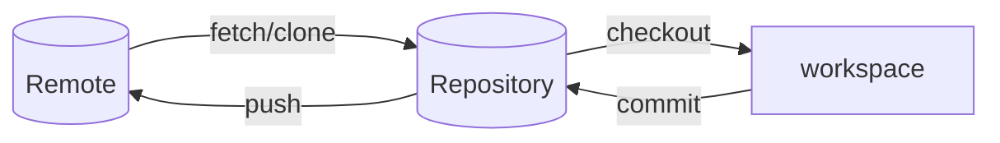
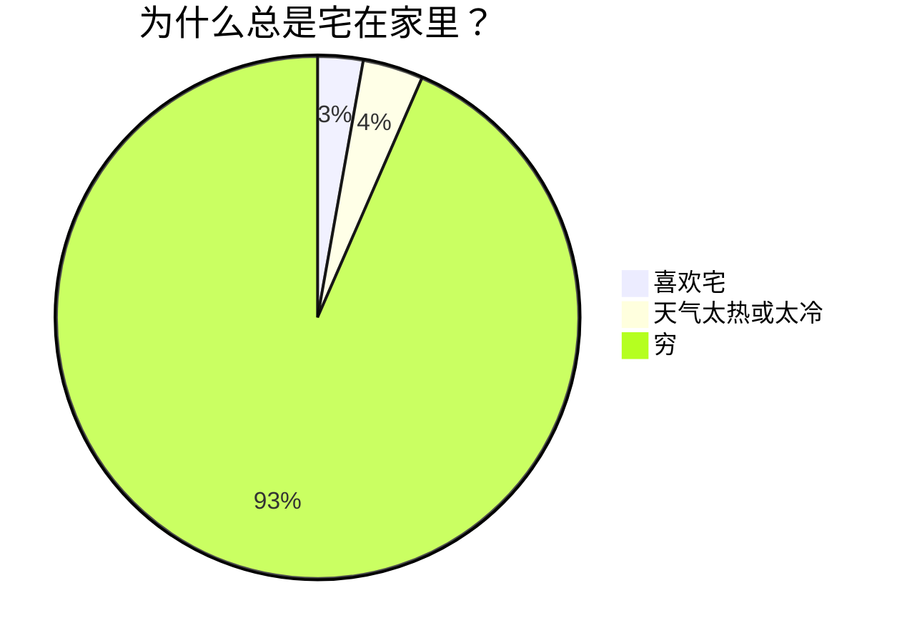
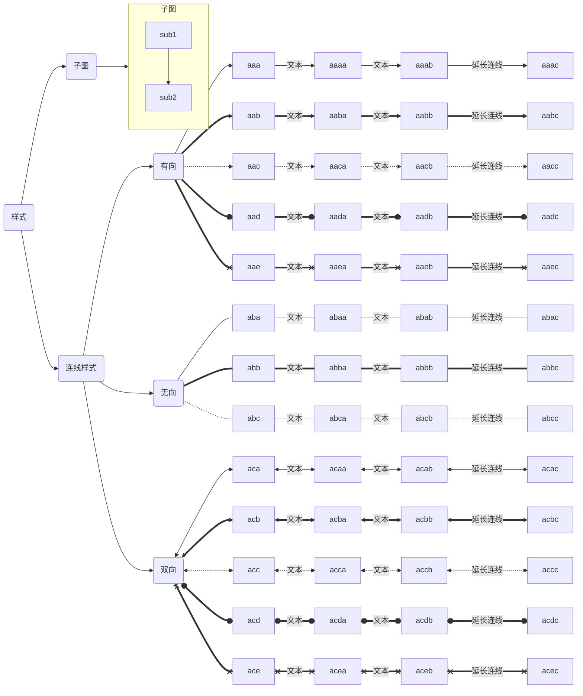
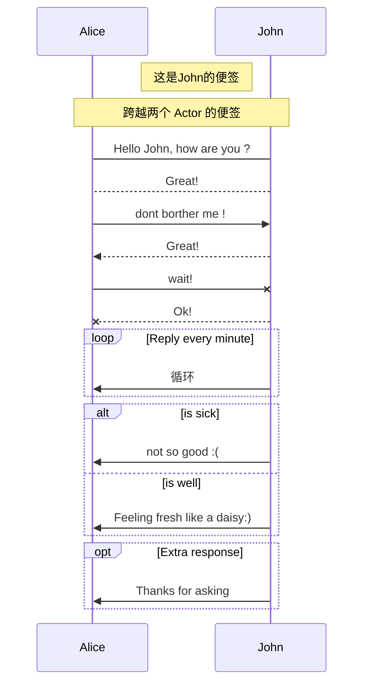
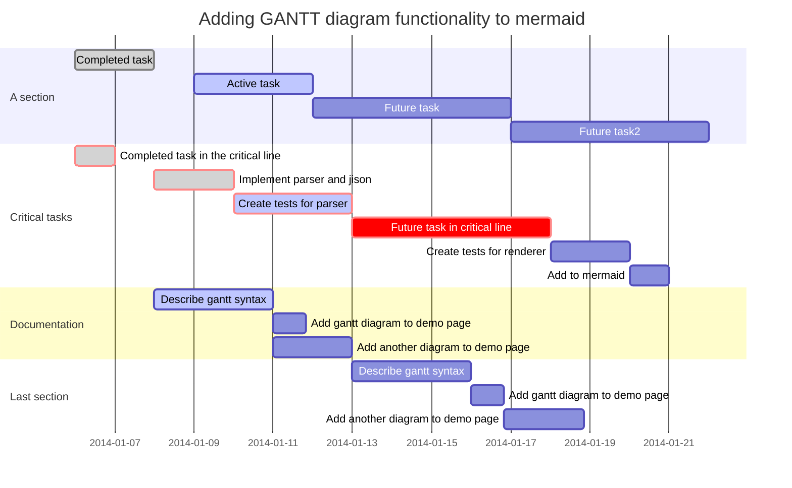
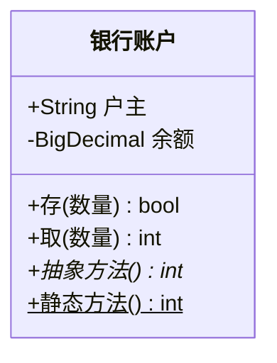
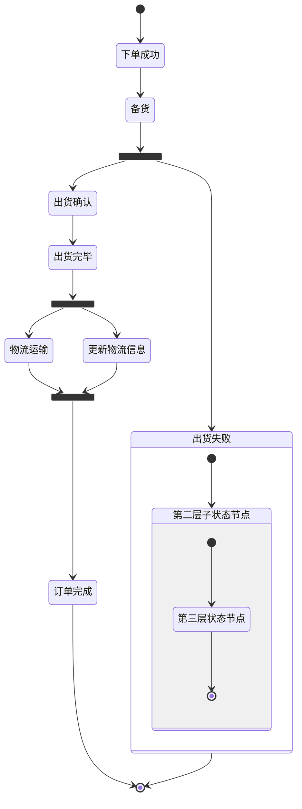
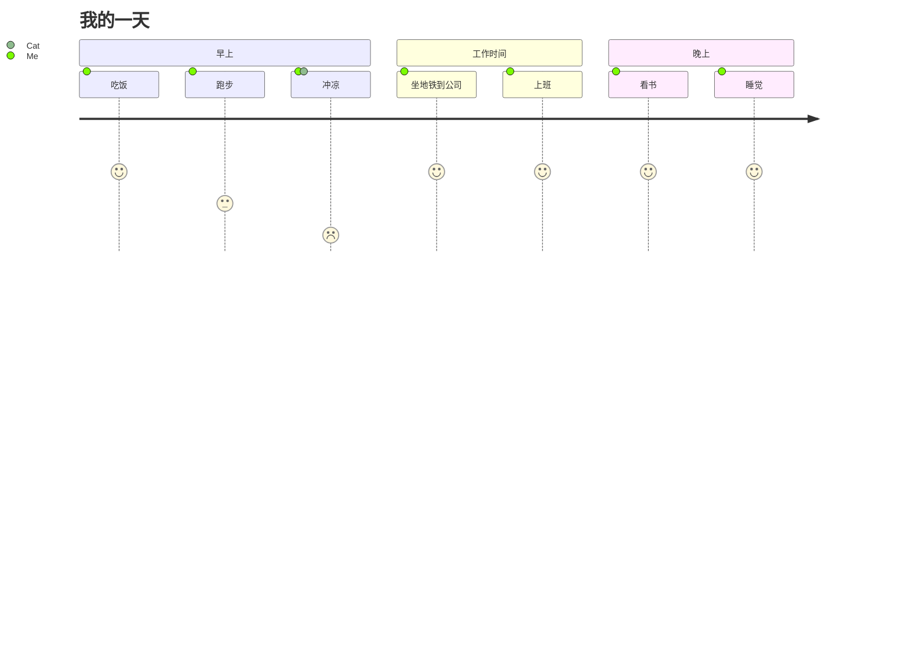

# Linux

### 文件

#### 

```shell
# 一次创建多个文件
touch filename1 filename2 filename3

# 查看当前文件夹下文件个数（不包括子目录下的文件）
ls -l | grep "^-" | wc -l
# 查看当前文件夹下文件个数（包括子目录下的文件）
ls -lR| grep "^-" | wc -l
# 查看当前目录下文目录的个数（包括子目录）
ls -lR | grep "^d" | wc -l

# wc
# -c 统计字节数
# -l 统计行数
# -w 统计字数
wc -l ./text.log
wc -l ./*.log

# 查看文件内容
# 前 num 行
cat test.log | head -n num
# 后 num 行
cat test.log | tail -n num

# -E 可选，多个筛选条件 OR，筛选条件使用 | 分隔，| 的转译字符为 \|
# -A 展示筛选结果后 num 行
# -B 展示筛选结果前 num 行
# -C -A + -B
cat test.log | grep [-E] 'filter1 | filter2' [-A/-B/-C num]
# 多个筛选条件 AND
cat test.log | grep 'filter1' | grep 'filter2'

```


# 数据库

## Mysql

#### 连续的数字、字符、时间


## Oracle

#### 常用 SQL

```sql
-- 表改名
ALTER TABLE table_name RENAME TO new_table_name;
-- 列改名
ALTER TABLE table_name RENAME COLUMN column_name TO new_column_name;
-- 修改空字段的数据类型
ALTER TABLE table_name MODIFY column_name TYPE;
-- 普通用户修改密码
alter user 用户名 identified by 新密码 replace 旧密码 ;
-- 排序时 NULL 排在最后
ORDER BY 字段 DESC NULLS LAST
```


#### 数据备份

##### 复制数据

```sql
-- 只复制数据，不复制主键及索引
CREATE TABLE 备份表 AS SELECT * FROM 原表;
```


#### 时间

##### 时间加减

```sql
-- 加减 1 秒(86400)，分钟(1440)，小时(24)，天(1)
to_date('2022-01-01 00:00:00','yyyy-mm-dd hh24:mi:ss') + 1/86400

-- 加减小时
to_date('2022-03-31 23:59:59','yyyy-mm-dd hh24:mi:ss') + INTERVAL '-1' HOUR
-- 加减天
to_date('2022-03-31 23:59:59','yyyy-mm-dd hh24:mi:ss') + INTERVAL '-1' DAY
-- 加减月(如下月日期不存在会报错，1月31日加1个月会报错)
to_date('2022-04-01 23:59:59','yyyy-mm-dd hh24:mi:ss') + INTERVAL '-1' MONTH

-- numtodsinterval 常用的单位有 ('day','hour','minute','second')
to_date('2022-03-31 23:59:59','yyyy-mm-dd hh24:mi:ss')-numtodsinterval(1,'hour')
-- numtoyminterval 常用的单位有 ('year','month')，(如下月日期不存在会报错，1月31日加1个月会报错)
to_date('2022-03-31 23:59:59','yyyy-mm-dd hh24:mi:ss')+numtoyminterval(1,'month')

-- 加减月(1月31日加1个月不会报错)
add_months(to_date('2022-01-31 23:59:59','yyyy-mm-dd hh24:mi:ss'),1)
```


##### 字符串转时间

```sql
to_date('2022-03-31 23:59:59','yyyy-mm-dd hh24:mi:ss')
to_date(20220331235959,'yyyy-mm-dd hh24:mi:ss')
to_timestamp('2022-08-25 10:07:41.433000', 'syyyy-mm-dd hh24:mi:ss:ff6')
```


##### 时间转字符串

```sql
to_char(created_time,'yyyy-mm-dd hh24:mi:ss')
```


##### 时间转时间戳(13位)

```sql
round((to_date('2022081913', 'yyyymmddhh24') - to_date('1970-01-01 08:00:00', 'syyyy-mm-dd hh24:mi:ss')) * (1000 * 24 * 60 * 60))
```


##### 时间戳转时间

```sql
to_date('1970-01-01 08:00:00', 'syyyy-mm-dd hh24:mi:ss') + 1660885200000 / (1000 * 24 * 60 * 60)
```


##### 随机时间

```sql
# 缺点：可能会产生不存在的时间，例如：如果日随机1-30，则可能会产生：2月30号天只能随机
# 优点：可以对年、月、日、小时、分钟、秒单独进行控制
SELECT 
    DBMS_RANDOM.VALUE(2022,2022) || '-' ||
    lpad(TRUNC(DBMS_RANDOM.VALUE(1,12)), 2, '0') || '-' ||
    lpad(TRUNC(DBMS_RANDOM.VALUE(1,28)), 2, '0') || ' ' ||
    lpad(TRUNC(DBMS_RANDOM.VALUE(0,23)), 2, '0') || ':' ||
    lpad(TRUNC(DBMS_RANDOM.VALUE(0,59)), 2, '0') || ':' ||
    lpad(TRUNC(DBMS_RANDOM.VALUE(0,59)), 2, '0')
FROM DUAL;

# 缺点：不能单独控制年、月、日，只能是两个日期之间的日期
# 优点：可以避免产生不存在的时间，例如：2月30号
SELECT 
    to_date(
        TRUNC(
            DBMS_RANDOM.VALUE(
                to_number(to_char(to_date('20220701','yyyymmdd'),'J')),
            )
        ),'J') +
    DBMS_RANDOM.VALUE(1,86400)/86400
FROM DUAL;
```


#### 连续的数字、字符、时间

##### generate_series

```sql
-- sys.odcinumberlist 是 Oracle 预定义的变长数组类型；PIPELINED 表示定义管道表函数
CREATE OR REPLACE FUNCTION generate_series (pstart IN NUMBER, pstop IN NUMBER, pstep IN NUMBER DEFAULT 1)
RETURN sys.odcinumberlist DETERMINISTIC PIPELINED
AS
BEGIN
  IF (pstep = 0) THEN
    raise_application_error(-20001, 'step size cannot equal zero!');
  END IF;
  
  IF (pstart > pstop AND pstep > 0) OR (pstart < pstop AND pstep < 0) THEN
    RETURN;
  END IF;
  
  FOR i IN 0 .. floor(abs((pstop-pstart)/pstep)) LOOP
    PIPE ROW (pstart + i * pstep);
  END LOOP;
    
  RETURN;
END generate_series;

```


##### 数字

```sql
-- 1-6
SELECT ROWNUM FROM DUAL CONNECT BY LEVEL <= 6;
-- 或
SELECT * FROM TABLE(generate_series(1, 6));
-- 或，通用表表达式（Common Table Expression）的递归调用可以用于生成各种数列
WITH t(n) AS (
  SELECT 1 FROM DUAL 
	UNION ALL
  SELECT n+1 FROM t WHERE n < 6
)
SELECT n FROM t;

-- 3-6
SELECT LEVEL FROM DUAL WHERE LEVEL >=3 CONNECT BY LEVEL <= 6;

-- 2-15 的等差数列
SELECT LEVEL FROM DUAL WHERE LEVEL >=2 AND MOD(LEVEL-2, 3) = 0 CONNECT BY LEVEL <= 15;

-- 15 - 1.4 的等差数列
SELECT ((LEVEL-1) * -2.5 + 15) FROM DUAL WHERE LEVEL >= 1 CONNECT BY ((LEVEL-1) * -2.5 + 15) >= 1.4;
SELECT * FROM TABLE(generate_series(15, 1.4, -2.5));
```


##### 字符

```sql
SELECT CHR(ROWNUM + 64) FROM DUAL CONNECT BY LEVEL <= 5;
-- 或
SELECT CHR(column_value) FROM TABLE(generate_series(65, 70));
-- 或
WITH t(n) AS (
  SELECT 65 FROM DUAL
  UNION ALL
  SELECT n+1 FROM t WHERE n <= 70
)
SELECT CHR(n) FROM t;
```


##### 时间

```sql
SELECT 
	to_date('2020-01-01 00:00:00','yyyy-mm-dd hh24:mi:ss') + ((LEVEL - 1) / 24)
FROM DUAL
CONNECT BY LEVEL <= 12;
-- 或
SELECT to_date('2020-01-01 00:00:00','yyyy-mm-dd hh24:mi:ss') + ((column_value - 1) / 24)
FROM TABLE(generate_series(1, 12));
-- 或
WITH ts(v) AS (
  SELECT TIMESTAMP '2020-01-01 00:00:00' FROM DUAL
  UNION ALL
  SELECT v + 1/24 FROM ts WHERE v < TIMESTAMP '2020-01-01 12:00:00'
)
SELECT v FROM ts;
```


#### 序列

```sql
-- 查询序列
select sequence_name ,last_number, min_value,max_value,increment_by from user_sequences where sequence_name = '';

-- 当刚创建好序列后，不能用 currval 直接查询当前序列的值，必须先用 nextval 查询下一个序列的值，之后才可以使用currval查询当前序列的值
select 序列名.currval from dual;

-- 查询下一个序列的值,并且序列增长到下一个值
select 序列名.nextval from dual;

-- 设置序列为当前ID最大值+1
declare
  MAX_ID number(10);
  CURRENT_VALUE number(10);
BEGIN
	SELECT MAX(ID) INTO MAX_ID FROM 表;
	loop
  		select 序列名.nextval INTO CURRENT_VALUE from dual;
  		exit when CURRENT_VALUE >= MAX_ID;
	end loop;
END ;

-- 设置序列值
alter sequence 序列名 increment by 20 nocache;
select 序列名.nextval from dual;
alter sequence 序列名 increment by 1 nocache;
```


#### 分组

```sql
select * from(
        select gar_logs.*, row_number() OVER (partition by username ORDER BY created_time desc) as rownum from gar_logs
)t where rownum = 1
```


#### 分组合并非分组字段

```sql

```


#### 临时代码块

```sql
declare
    VAR_TIME number(10);
    VAR_DAY number(10);
    VAR_HOUR number(10);
    VAR_MIN number(12);
begin
    VAR_TIME := 20221100;
    for i in 1 .. 31 loop
        VAR_DAY := VAR_TIME + i;
        DBMS_OUTPUT.PUT_LINE('天：'||VAR_DAY);
        for i in 0 .. 23 loop
            VAR_HOUR := VAR_DAY||'00' + i;
            DBMS_OUTPUT.PUT_LINE('小时：'||VAR_HOUR);
            for i in 0 .. 11 loop
                VAR_MIN := VAR_HOUR||'00' + (i * 5);
                DBMS_OUTPUT.PUT_LINE('5分钟：'||VAR_MIN);
            end loop;
        end loop;
    end loop;
end;
```


#### 空间统计

```sql
-- 统计表占用大小
select segment_name,sum(bytes)/1024/1024 from User_Extents group by segment_name;

-- 查看表的分区
select partition_name from user_tab_partitions where table_name='表名';

-- 统计表分区占用大小
select segment_name,partition_name,Sum(bytes)/1024/1024 from user_segments where segment_name= '表名' and partition_name ='分区名' group by segment_name,partition_name;

-- 统计表空间占用大小
select tablespace_name，sum(bytes)/1024/1024/1024 from user_segments group by tablespace_name; 
```


#### 查看连接数据库连接数

```sql
SELECT MACHINE,count(1) FROM (
    select LOGON_TIME,MACHINE,OSUSER from V$SESSION where username is not NULL  ORDER BY LOGON_TIME DESC
)
GROUP BY MACHINE;
```


#### 修改数据非空字段的数据类型，并且不更改字段位置

```sql
alter table tb add name_bak NUMBER(19,4);

update tb set name_bak=name;

update tb set name=NULL;

alter table tb modify (name NUMBER(19,4));

update tb set name=name_bak;

alter table tb drop column name_bak;
```


#### 存储过程定义使用数组

```sql
DECLARE
  /**
   *声明一个最多容纳100个数的varry数组，注意，它的下标是从1开始的。
   *即 binary_integer
   */
  type array_type is varray(100) of varchar(100);
  /**
   *分别定义一个直接赋值的和两个未赋值的数组。
   *注意：一定要初始化，但可以不赋值。对于没有赋值的这种数组，在用之前
   *也一定要先确定容量。
   */
  v_val_array array_type := array_type('one','two');
  v_val_array2 array_type := array_type();
  v_val_array3 array_type := array_type();
BEGIN
   /**
    *获取第一个varry数组中的值
    *varry的下标从1开始
    */
    dbms_output.put_line('v_val_array中下标1的值：'||v_val_array(1));
    dbms_output.put_line('v_val_array中下标2的值：'||v_val_array(2));


   /**
    *获取第二个varry数组中的值
    *因为第二个varry没有初始化长度，所以通过extend方法，
    *为该数组加一个空位
    */
    v_val_array2.extend;
    v_val_array2(1) :='aaa';
    v_val_array2.extend;
    v_val_array2(2) :='bbb';
    v_val_array2.extend;
    v_val_array2(3) :='ccc';
    dbms_output.put_line('v_val_array2中下标1的值：'||v_val_array2(1));
    dbms_output.put_line('v_val_array2中下标2的值：'||v_val_array2(2));
    dbms_output.put_line('v_val_array2中下标3的值：'||v_val_array2(3));

     /**
    *获取第三个varry数组中的值
    *因为第三个varry没有初始化长度，所以通过extend方法
    *初始化空位
    */

  /**
    *获取第二个varry数组中的值
    *因为第二个varry没有初始化长度，所以通过extend方法，
    *为该数组初始化长度
    */
    v_val_array3.extend(v_val_array2.count());
    v_val_array3(1) :='ddd';
    v_val_array3(2) :='eee';
    v_val_array3(3) :='fff';
    dbms_output.put_line('v_val_array3中下标1的值：'||v_val_array3(1));
    dbms_output.put_line('v_val_array3中下标2的值：'||v_val_array3(2));
    dbms_output.put_line('v_val_array3中下标3的值：'||v_val_array3(3));
END;
```


#### 批量插入数据

```sql
INSERT ALL
INTO 表 (字段1, 字段2) VALUES (1, 'a')
INTO 表 (字段1, 字段2) VALUES (2, 'b')
SELECT 1 FROM DUAL;
-- insert all into其实是根据子查询执行了每个insert into子句，注意到上面SQL中每个into子句用的值都是字面量，子查询"select 1 from dual"返回1条记录，支持每个insert into子句插入指定的1条记录
```


#### CONNECT BY

```sql
-- 假设 T 表里有 N 条数据
SELECT ID,LEVEL FROM T CONNECT BY LEVEL < M;
-- 那么会生成 N 棵高度为 M 的子树，然后先根遍历

-- 生成 1 - M
SELECT ROWNUM FROM DUAL CONNECT BY LEVEL <= M;
```


#### 补充数字前导0

```sql
SELECT TO_CHAR(1, 'FM09') FROM DUAL;
SELECT lpad(1,2,'0') FROM DUAL;
```


## Pg


#### 常用 SQL

```sql
-- 增加字段
ALTER TABLE table_name ADD COLUMN column_name text NOT NULL DEFAULT '';
```


#### 时间


##### 字符串转时间戳

```sql
to_timestamp('2022-03-31 23:59:59.999', 'yyyy-mm-dd hh24:mi:ss.ms')
```


##### 时间戳转字符串

```sql
to_char(created_time,'yyyy-mm-dd hh24:mi:ss.ms')
```


#### 序列

```sql
-- 查看序列
select * from gar_users_id_seq;
-- 设置序列到某个值
select setval('gar_users_id_seq',2200);
```


#### 分组

```sql
select * from(
        select gar_logs.*, row_number() OVER (partition by username ORDER BY created_time desc) as rownum from gar_logs
)t where rownum = 1
```


#### 查看数据库账号

```sql
select u.usename, u.usesysid, 
	case 
		when u.usesuper and u.usecreatedb then 'superuser, create database'
		when u.usesuper then 'superuser'
		when u.usecreatedb then 'create database'
	end as attributes 
from pg_catalog.pg_user u
```


## H2

### 数据类型

| 类型描述               | 对应数据库中类型   | 值范围                                                       | 对应 Java 范围                        | 说明                               |
| ---------------------- | ------------------ | ------------------------------------------------------------ | ------------------------------------- | ---------------------------------- |
| 整数                   | INT                | -2147483648 到 2147483647                                    | Integer                               |                                    |
| 布尔型                 | BOOLEAN            | TRUE 或 FALSE                                                | Boolean                               |                                    |
| 微整数                 | TINYINT            | -128 到 127                                                  | Byte                                  |                                    |
| 小整数                 | SMALLINT           | -32768 到 32767                                              | Short                                 |                                    |
| 大整数                 | BIGINT             | -9223372036854775808 到 9223372036854775807                  | Long                                  |                                    |
| 标识符                 | IDENTITY           | -9223372036854775808 到 9223372036854775807                  | Long                                  | 使用的值不能再重用，即使事务回滚。 |
| 货币数                 | DECIMAL            | 固定整数位和小数位。这个数据类型经常用于存储货币等类型的值。 | BigDecimal                            |                                    |
| 双精度实数             | DOUBLE             | 浮点数。不能应用到表示货币等值，因为有四舍五入的问题。       | Double                                |                                    |
| 实数                   | REAL               | 单精度浮点数。不能应用到表示货币等值，因为有四舍五入的问题。 | Float                                 |                                    |
| 时间                   | TIME               | 格式为 hh:mm:ss                                              | Time                                  |                                    |
| 日期                   | DATE               | 格式为 yyyy-MM-dd                                            | Date                                  |                                    |
| 时间戳                 | TIMESTAMP          | 格式为 yyyy-MM-dd hh:mm:ss[.nnnnnnnnn]                       | Timestamp(Date 也支持)                |                                    |
| 二进制                 | BINARY             | 表示一个字节数组。针对更长的数组，使用 BLOB 类型。最大的尺寸为 2 GB，当使用这种数据类型时，整个对象都会保存在内存中，在内存中的尺寸是一个精确的指定值，只有实际的数据会被持久化。对于大的文本数据，还是使用 BLOB 和 CLOB 更合适。 | byte[]                                |                                    |
| 其他类型               | OTHER              | 这个类型允许存储可序列化的JAVA对象。在内部，使用的是一个字节数组。序列化和反序列化只在客户端端完成。反序列化仅在 getObject 被调用时才被调用。JAVA操作因为安全的原因并不能在数据库引擎内被执行。可以使用 PreparedStatement.setObject 存储对象。 | Object (或者是任何子类)               |                                    |
| 可变字符串             | VARCHAR            | Unicode 字符串。使用两个单引号(’’) 表示一个引用。最大的长度是Integer.MAX_VALUE，字符串的实际长度是精确指定的，仅实际的数据会被持久化。当使用这种数据类型时，整个文本都会保存在内存中。更多的文本数据，使用 CLOB 更合适。 | String                                |                                    |
| 不区分大小写可变字符串 | VARCHAR_IGNORECASE | 与 VARCHAR 类型类似，只是在比较时不区分大小写。存储时是混合大小写存储的。当使用这种数据类型时，整个文本都会保存在内存中。更多的文本数据，使用 CLOB 更合适。 | String                                |                                    |
| 字符                   | CHAR               | 这个类型支持是针对其他数据库或老的应用的兼容性。与VARCHAR 的不同是尾空格将被忽略并且不会被持久化。 Unicode 字符串。使用两个单引号(’’) 表示一个引用。最大的长度是Integer.MAX_VALUE，字符串的实际长度是精确指定的，仅实际的数据会被持久化。当使用这种数据类型时，整个文本都会保存在内存中。更多的文本数据，使用 CLOB 更合适。 | String                                |                                    |
| 二进制大对象           | BLOB               | 类似于BINARY，但是针对的是非常大的值如文件或是图片。跟BINARY不同的是，大对象并不完全保存在内存中。使用 PreparedStatement.setBinaryStream 存储对象，详细请参见 CLOB 和 高级 / 大对象。 | Blob (java.io.InputStream 也支持)     |                                    |
| 文本大对象             | CLOB               | CLOB类似于 VARCHAR，但是针对的是非常大的值。与 VARCHAR不同的是，CLOB 对象并不完全保存在内存中，而是使用的流。CLOB 可以用于文档或文本，如果XML、HTML文档，文本文件、未限制尺寸的备忘录等。使用 PreparedStatement.setCharacterStream 存储对象。详细请参见 高级 / 大对象。VARCHAR 用于相对较小的文本（如200个字符以内）。小的 CLOB 值被就地存储，但是也比 VARCHAR 要大。 | Clob (java.io.Reader 也支持)          |                                    |
| 通用唯一标识符         | UUID               | UUID（Universally unique identifier），是一个128BIT的值，使用 PreparedStatement.setBytes 或 setString 去存储值。 | UUID                                  |                                    |
| 数组                   | ARRAY              | 一组值，可以使用值列表 (1, 2) 或 PreparedStatement.setObject(…, new Object[] {…}) 存储对象。 | Object[] (没有任何原始类型数组被支持) |                                    |


# MyBatis


## 主键自增

```java
@Data
@EqualsAndHashCode()
@TableName("TASK")
public class TaskDO implements Serializable {

    /**
     * 任务id
     */
    @TableField("ID")
    @TableId(type = IdType.AUTO)
    private Long id;
}
```


```java
@Repository
@Mapper
public interface TaskMapper extends BaseMapper<TaskDO> {
    Long insertTask(@Param("params") TaskDO params);
}
```


```xml
<insert id="insertTask" useGeneratedKeys="true" parameterType="TaskDO">
    <selectKey  keyProperty="params.id" resultType="java.lang.Long" order="BEFORE">
        select TASK_SEQ_ID.nextval from dual
    </selectKey>
    insert into TASK(
    ID,
    USER_ID,
    STATUS,
    ERROR_MSG,
    PATROL_TIME,
    START_TIME,
    END_TIME,
    ENV
    )
    values (
    #{params.id, jdbcType=BIGINT},
    #{params.userId, jdbcType=BIGINT},
    #{params.status, jdbcType=VARCHAR},
    #{params.errorMsg, jdbcType=VARCHAR},
    #{params.patrolTime, jdbcType=TIMESTAMP},
    #{params.startTime, jdbcType=TIMESTAMP},
    #{params.endTime, jdbcType=TIMESTAMP},
    #{params.env, jdbcType=VARCHAR}
    )
</insert>
```


## QueryWrapper

```java
List<RuleVO> listAlarmRule(@Param(Constants.WRAPPER) Wrapper<RulePO> wrapper);

IPage<RuleVO> listAlarmRule(IPage<RulePO> page, @Param(Constants.WRAPPER) Wrapper<RulePO> wrapper);
```


```java
<?xml version="1.0" encoding="UTF-8"?>

<!DOCTYPE mapper PUBLIC "-//mybatis.org//DTD Mapper 3.0//EN" "http://mybatis.org/dtd/mybatis-3-mapper.dtd">
<mapper namespace="RuleMapper">

    <select id="listRule" resultType="RuleVO">
        SELECT
            ID,
            NAME,
            CITY_OID,
            CITY_NAME,
            APP_SUB_TYPE,
            APP_SUB_NAME,
            ALGORITHMS,
            GRANULARITY,
            MONITOR_CYCLE,
            QOE_THRESHOLD,
            ACC_DEPTH,
            ACC_THRESHOLD,
            BQ_THRESHOLD,
            RULE,
            STATUS,
            CREATE_USER,
            CREATE_TIME,
            UPDATE_USER,
            UPDATE_TIME
        FROM RULE
        <if test="ew.emptyOfWhere == false">
            ${ew.customSqlSegment}
        </if>
    </select>
</mapper>
```


```java
// id != {id} and (name ={name} or (cityOid = {cityOid} and appSubType = {appSubType} and status = {status}))
int sameCount = count(Wrappers.<RulePO>lambdaQuery()
        .ne(null != id, RulePO::getId, id)
        .and(wrapper -> wrapper
                .eq(RulePO::getName, name)
                .or( wrapper2 -> wrapper2
                        .eq(RulePO::getCityOid, cityOid)
                        .eq(RulePO::getAppSubType, appSubType)
                        .eq(RulePO::getStatus, status)
                )
        ));
```


## ResultMap


```xml
<!DOCTYPE mapper PUBLIC "-//mybatis.org//DTD Mapper 3.0//EN" "http://mybatis.org/dtd/mybatis-3-mapper.dtd">
<mapper namespace="mapper.package">

    <resultMap id="resultMapId" type="vo.package">
        <id column="ID" jdbcType="BIGINT" property="id" />
        <result column="NAME" jdbcType="VARCHAR" property="name" />
        <!-- 一对一 -->
        <association property="wife" javaType="wife.vo.package">
            <id column="WIFE_ID" jdbcType="BIGINT" property="id"/>
            <result column="WIFE_NAME" jdbcType="VARCHAR" property="name"/>
        </association>
        <!-- 一对多 -->
        <collection property="carList" column="{PEOPLE_ID=ID}" javaType="ArrayList"
                    select="listCar" />
    </resultMap>

    <select id="list" resultMap="resultMapId">
        select
            people_join.ID,
            people_join.NAME,
            wife_join.ID as WIFE_ID,
            wife_join.NAME as WIFE_NAME
        from PEOPLE people_join
        left join WIFE wife_join
            on people_join.ID=wife_join.HUSBAND_ID
    </select>

    <select id="listCar" resultMType="vo.package">
        select 
        	ID as id,
        	BRAND as brand
        from CAR where PEOPLE_ID = #{ID}
    </select>
</mapper>
```

```xml
<!DOCTYPE mapper
        PUBLIC "-//mybatis.org//DTD Mapper 3.0//EN"
        "http://mybatis.org/dtd/mybatis-3-mapper.dtd">
<mapper namespace="com.richstonedt.cmgde2eas.cs.mapper.report.group.GroupServiceSupportApiKpiReportMapper">
    
    <resultMap id="listMap" type="com.richstonedt.cmgde2eas.commons.vo.report.group.GroupServiceSupportApiKpiReportVO">
        <result column="DAY_ID" jdbcType="VARCHAR" property="timeId"/>
        <result column="CITY" jdbcType="VARCHAR" property="cityName"/>
        <result column="CITY" jdbcType="VARCHAR" property="cityName"/>
        <result column="ATTRIBUTE1" jdbcType="VARCHAR" property="attribute1"/>
        <result column="ATTRIBUTE2" jdbcType="VARCHAR" property="attribute2"/>
        <collection property="indicator" javaType="ArrayList" ofType="java.util.Map">
            <result column="INDICATOR_NAME" jdbcType="VARCHAR" property="indicatorName"/>
            <result column="INDICATOR_VALUE" jdbcType="VARCHAR" property="indicatorValue"/>
        </collection>
    </resultMap>

    <select id="list" resultMap="listMap">
        SELECT
            to_char(to_date(DAY_ID, 'yyyy-MM-dd'), 'yyyy-MM-dd') AS DAY_ID,
            CITY,
            ATTRIBUTE1,
            ATTRIBUTE2,
            INDICATOR_NAME,
            INDICATOR_VALUE
        FROM GDSIGNAL.F_GD_DPI_KPI_D
        WHERE #{params.beginTime} &lt;= DAY_ID AND DAY_ID &lt;= #{params.endTime}
        <if test="null != params.cityNameList and !params.cityNameList.isEmpty()">
            <foreach item="item" collection="params.cityNameList" separator="," open="AND CITY IN(" close=")" index="">
                #{item}
            </foreach>
        </if>
    </select>
</mapper>
```

# SpringBoot

## 异常处理

#### 基本类

##### 断言接口

```java
/**
 * <b><code>Assert</code></b>
 * <p/>
 * 异常断言接口
 * <p/>
 * <b>Creation Time:</b> 2022/8/24 上午11:37.
 *
 * @author yang xiong
 */
public interface IAssert {

    /**
     * @description: 断言对象非空，如果对象为空，则抛出异常
     * @param obj 待判断对象
     * @return
     * @throws
     * @author yang xiong
     * @date 2022/8/24 上午11:55
     */
    void assertNotNull(Object obj) throws BaseException;

    /**
     * @description:
     * 断言对象非空，如果对象为空，则抛出异常
     * 异常信息支持传递参数方式，避免在判断之前进行字符串拼接操作
     *
     * @param obj 待判断对象
     * @param args message占位符对应的参数列表
     * @return
     * @throws
     * @author yang xiong
     * @date 2022/8/24 上午11:56
     */
    void assertNotNull(Object obj, Object... args) throws BaseException;

    /**
     * @description: 断言对象为 false，如果对象为空或true，则抛出异常
     * @param obj 待判断对象
     * @return
     * @throws
     * @author yang xiong
     * @date 2022/8/24 上午11:56
     */
    void assertFalse(Boolean obj) throws BaseException;

    /**
     * @description:
     * 断言对象为 false，如果对象为空或true，则抛出异常
     * 异常信息支持传递参数方式，避免在判断之前进行字符串拼接操作
     * @param obj 待判断对象
     * @param args message占位符对应的参数列表
     * @return
     * @throws
     * @author yang xiong
     * @date 2022/8/24 上午11:59
     */
    void assertFalse(Boolean obj, Object... args) throws BaseException;
}
```


##### 创建异常接口

```java
/**
 * <b><code>IBaseException</code></b>
 * <p/>
 * 创建异常接口
 * <p/>
 * <b>Creation Time:</b> 2022/8/24 上午11:53.
 *
 * @author yang xiong
 */
public interface IExceptionFactory {
    /**
     * @description: 创建异常
     * @param args
     * @return {@link BaseException}
     * @throws
     * @author yang xiong
     * @date 2022/8/24 上午11:38
     */
    BaseException newException(Object... args);

    /**
     * @description: 创建异常
     * @param t
     * @param args
     * @return {@link BaseException}
     * @throws
     * @author yang xiong
     * @date 2022/8/24 上午11:38
     */
    BaseException newException(Throwable t, Object... args);
}
```


##### 断言接口默认实现类

```java
/**
 * <b><code>AbstractAssert</code></b>
 * <p/>
 * 异常断言接口默认实现类， 由于枚举不能继承，所以不能使用抽象类
 * <p/>
 * <b>Creation Time:</b> 2022/8/24 上午11:51.
 *
 * @author yang xiong
 */
public interface BaseAssert extends IExceptionFactory, IAssert {
    @Override
    default void assertNotNull(Object obj) throws BaseException {
        if (obj == null) {
            throw newException(obj);
        }
    }

    @Override
    default void assertNotNull(Object obj, Object... args) throws BaseException {
        if (obj == null) {
            throw newException(args);
        }
    }

    @Override
    default void assertFalse(Boolean obj) throws BaseException {
        if (!Boolean.FALSE.equals(obj)) {
            throw newException(obj);
        }
    }

    @Override
    default void assertFalse(Boolean obj, Object... args) throws BaseException {
        if (!Boolean.FALSE.equals(obj)) {
            throw newException(args);
        }
    }
}

```


##### 响应枚举值接口

```java
/**
 * <b><code>IResponseEnum</code></b>
 * <p/>
 * 响应枚举值接口
 * <p/>
 * <b>Creation Time:</b> 2022/8/24 下午12:05.
 *
 * @author yang xiong
 */
public interface IExceptionAssertResponseEnum {
    int getCode();
    String getMessage();
}

```


##### 基础异常类

```java
/**
 * <b><code>BaseException</code></b>
 * <p/>
 * 基础异常类
 * <p/>
 * <b>Creation Time:</b> 2022/8/24 下午12:31.
 *
 * @author yang xiong
 */
@Getter
public abstract class BaseException extends Exception {
    private IExceptionAssertResponseEnum exceptionAssertResponseEnum;
    private Object[] args;
    private String message;
    private Throwable cause;

    public BaseException(IExceptionAssertResponseEnum exceptionAssertResponseEnum, Object[] args, String message){
        this.exceptionAssertResponseEnum = exceptionAssertResponseEnum;
        this.args = args;
        this.message = message;
    }

    public BaseException(IExceptionAssertResponseEnum exceptionAssertResponseEnum, Object[] args, String message, Throwable cause) {
        this.exceptionAssertResponseEnum = exceptionAssertResponseEnum;
        this.args = args;
        this.message = message;
        this.cause = cause;
    }
}
```


#### 具体业务异常处理


##### 断言接口实现类

```java
/**
 * <b><code>BusinessExceptionAssert</code></b>
 * <p/>
 * 异常断言接口实现类， 由于枚举不能继承，所以不能使用抽象类
 * <p/>
 * <b>Creation Time:</b> 2022/8/24 下午2:17.
 *
 * @author yang xiong
 */
public interface BaseBusinessAssert extends BaseAssert {
}

```


##### 创建异常接口实现类

```java
/**
 * <b><code>AbstractBusinessExceptionAssert</code></b>
 * <p/>
 * 创建异常接口实现类，由于枚举不能继承，所以不能使用抽象类
 * <p/>
 * <b>Creation Time:</b> 2022/8/24 下午12:09.
 *
 * @author yang xiong
 */
public interface BaseBusinessExceptionFactory extends IExceptionAssertResponseEnum, BaseBusinessAssert {
    @Override
    default BaseException newException(Object... args) {
        String msg = MessageFormat.format(this.getMessage(), args);

        return new BusinessException(this, args, msg);
    }

    @Override
    default BaseException newException(Throwable t, Object... args) {
        String msg = MessageFormat.format(this.getMessage(), args);

        return new BusinessException(this, args, msg, t);
    }
}

```


##### 业务异常类

```java
/**
 * <b><code>BusinessException</code></b>
 * <p/>
 * 业务异常
 * <p/>
 * <b>Creation Time:</b> 2022/8/24 下午12:34.
 *
 * @author yang xiong
 */
public class BusinessException extends BaseException {

    private static final long serialVersionUID = 1L;

    public BusinessException(IExceptionAssertResponseEnum exceptionAssertResponseEnum, Object[] args, String message) {
        super(exceptionAssertResponseEnum, args, message);
    }

    public BusinessException(IExceptionAssertResponseEnum exceptionAssertResponseEnum, Object[] args, String message, Throwable cause) {
        super(exceptionAssertResponseEnum, args, message, cause);
    }
}

```


##### 业务异常断言响应枚举

```java
/**
 * <b><code>BusinessExceptionAssertResponseEnum</code></b>
 * <p/>
 * 业务异常断言响应枚举
 * <p/>
 * <b>Creation Time:</b> 2022/8/24 下午12:19.
 *
 * @author yang xiong
 */
@Getter
@AllArgsConstructor
public enum BusinessExceptionAssertResponseEnum implements BaseBusinessExceptionAssert {

    /**
     * 业务指标字段未找到
     */
    L3_BQA_INDICATOR_FIELD_NOT_FOUND(1001, "业务指标字段未找到."),

    /**
     * 业务策略配置未找到
     */
    L3_BQA_STRATEGY_NOT_FOUND(1001, "业务策略配置未找到.");

    /**
     * 返回码
     */
    private int code;

    /**
     * 返回消息
     */
    private String message;
}

```


#### 全局异常处理

```java
@Slf4j
@RestControllerAdvice
public class GlobalExceptionHandler {

    /**
     * @description: 自定义异常类-业务异常
     * @param e
     * @return {@link ResponseResult< Integer>}
     * @throws
     * @author yang xiong
     * @date 2022/9/8 上午11:30
     */
    @ExceptionHandler({
            BaseException.class,
            BusinessException.class
    })
    @ResponseStatus(HttpStatus.INTERNAL_SERVER_ERROR)
    public ResponseResult<Integer> businessException(BaseException e) {
        log.error(e.getMessage(), e);
        return ResponseResult.failed(e.getExceptionAssertResponseEnum().getCode(),e.getMessage());
    }
}
```


## SpringBoot 使用 Jackson 全局序列化配置

```xml
<dependency>
    <groupId>com.fasterxml.jackson.core</groupId>
    <artifactId>jackson-core</artifactId>
    <version>2.10.0</version>
</dependency>

<dependency>
    <groupId>com.fasterxml.jackson.core</groupId>
    <artifactId>jackson-databind</artifactId>
    <version>2.10.0</version>
</dependency>
<dependency>
    <groupId>com.fasterxml.jackson.core</groupId>
    <artifactId>jackson-annotations</artifactId>
    <version>2.10.0</version>
</dependency>

```

### 方式一

```java
/**
 * 全局序列化配置类
 */
@Configuration
public class JacksonConfig {
 
    /**
     * 创建Jackson对象映射器
     *
     * @param builder Jackson对象映射器构建器
     * @return ObjectMapper
     */
    @Bean
    public ObjectMapper getJacksonObjectMapper(Jackson2ObjectMapperBuilder builder) {
        ObjectMapper objectMapper = builder.createXmlMapper(false).build();
        //序列换成json时,将所有的long变成string.因为js中得数字类型不能包含所有的java long值，超过16位后会出现精度丢失
        SimpleModule simpleModule = new SimpleModule();
        simpleModule.addSerializer(Long.class, com.fasterxml.jackson.databind.ser.std.ToStringSerializer.instance);
        simpleModule.addSerializer(Long.TYPE, com.fasterxml.jackson.databind.ser.std.ToStringSerializer.instance);
        objectMapper.registerModule(simpleModule);
        //反序列化的时候如果多了其他属性,不抛出异常
        objectMapper.configure(DeserializationFeature.FAIL_ON_UNKNOWN_PROPERTIES, false);
        //日期格式处理
        objectMapper.setDateFormat(new SimpleDateFormat("yyyy-MM-dd HH:mm:ss"));
        return objectMapper;
    }
}

```


### 方式二

```java
/**
 * 全局序列化配置类
 */
@Configuration
@EnableWebMvc
public class HttpMessageConverterConfig implements WebMvcConfigurer {
 
    /**
     * 全局序列化方式
     *
     * @param converters
     */
    @Override
    public void configureMessageConverters(List<HttpMessageConverter<?>> converters) {
        //Jackson的全局序列化方式
        configureJacksonHttpMessageConverter(converters);
    }
 
    /**
     * Jackson的全局序列化方式
     *
     * @param converters
     */
    private void configureJacksonHttpMessageConverter(List<HttpMessageConverter<?>> converters) {
        MappingJackson2HttpMessageConverter converter = new MappingJackson2HttpMessageConverter();
        ObjectMapper objectMapper = new ObjectMapper();
        //序列换成json时,将所有的long变成string.因为js中得数字类型不能包含所有的java long值，超过16位后会出现精度丢失
        SimpleModule simpleModule = new SimpleModule();
        simpleModule.addSerializer(Long.class, com.fasterxml.jackson.databind.ser.std.ToStringSerializer.instance);
        simpleModule.addSerializer(Long.TYPE, com.fasterxml.jackson.databind.ser.std.ToStringSerializer.instance);
        objectMapper.registerModule(simpleModule);
        //反序列化的时候如果多了其他属性,不抛出异常
        objectMapper.configure(DeserializationFeature.FAIL_ON_UNKNOWN_PROPERTIES, false);
        //日期格式处理
        objectMapper.setDateFormat(new SimpleDateFormat("yyyy-MM-dd HH:mm:ss"));
        converter.setObjectMapper(objectMapper);
        converters.add(converter);
        converters.add(new StringHttpMessageConverter(StandardCharsets.UTF_8));
    }
}

```


# Java


## 集合


##### List 转 Map

```java
public Map<Long, String> getIdNameMap(List<User> users) {
    return accounts.stream().collect(Collectors.toMap(User::getId, User::getUserName));
}
//第二种：将id和实体Bean做为K,V account -> account是一个返回本身的lambda表达式，后面的使用Function接口中的一个默认方法代替，使整个方法更简洁优雅。
public Map<Long, Account> getIdAccountMap(List<Account> accounts) {
    return accounts.stream().collect(Collectors.toMap(Account::getId, account -> account));
}
public Map<Long, Account> getIdAccountMap(List<Account> accounts) {
    return accounts.stream().collect(Collectors.toMap(Account::getId, Function.identity()));
}
//第三种： key存在重复记录时处理,如果使用第一种方法会出错，所以这里只是简单的使用后者覆盖前者来解决key重复问题
public Map<String, Account> getNameAccountMap(List<Account> accounts) {
    return accounts.stream().collect(Collectors.toMap(Account::getUsername, Function.identity(), (key1, key2) -> key2));
}
//第四种： 使用某个具体的Map类来保存，如保存时使用LinkedHashMap
public Map<String, Account> getNameAccountMap(List<Account> accounts) {
    return accounts.stream().collect(Collectors.toMap(Account::getUsername, Function.identity(), (key1, key2) -> key2, LinkedHashMap::new));
}
```


##### List 转 Map 当value值为空时会报空指针异常解决方案

```java
//解决方案一，使用Optional类处理null
public Map<String, String> getNameAccountMap(List<Account> accounts) {
    return accounts.stream().collect(Collectors.toMap(s -> Optional.ofNullable(s.getUsername()).orElse(null), s -> Optional.ofNullable(s.getPassword()).orElse("unknown"), (key1, key2) -> key2, HashMap::new));
}

//解决方案二，直接使用collect()方法进行规约操作
public Map<String, String> getNameAccountMap(List<Account> accounts) {
    return accounts.stream().collect(HashMap::new, (map, item) -> map.put(item.getUsername(), item.getPassword()), HashMap::putAll);
}
```


##### 取对象 List 中的某个属性为属性 List

```java
List<String> names=list.stream().map(PersonData::getName).collect(Collectors.toList());
```


## 时间

#### 时间格式

```java
// yyyy-MM-dd HH:mm:ss
```


#### Date

##### 字符串转 Date

```java
SimpleDateFormat sdf = new SimpleDateFormat("yyyy-MM-dd HH:mm:ss");
Date date = sdf.parse("2022-09-01 12:00:00");
```


##### Date 格式化为字符串

```java
Date date = new Date();
SimpleDateFormat sdf = new SimpleDateFormat("yyyy-MM-dd HH:mm:ss");
String dateStr = sdf.format(date);
```


#### LocalDate


##### 比较日期大小

```java
LocalDate startDateOfMonth = month.with(TemporalAdjusters.firstDayOfMonth());
LocalDate endDateOfMonth = month.with(TemporalAdjusters.lastDayOfMonth());
// startDateOfMonth > endDateOfMonth 结果大于 0
// startDateOfMonth = endDateOfMonth 结果等于 0
// startDateOfMonth < endDateOfMonth 结果小于 0
startDateOfMonth.compareTo(endDateOfMonth)
```


##### 获取当前一周的开始、结束日期

```java
LocalDate nowDate = LocalDate.now();
LocalDate startDateOfWeek = nowDate.minusDays(nowDate.getDayOfWeek().getValue() - 1);
LocalDate endDateOfWeek = nowDate.plusDays(7 - nowDate.getDayOfWeek().getValue());
```


##### 获取一个月的所有周的开始、结束日期

```java
public static List<PairValueVO<LocalDate, LocalDate>> weeksBoundOfMonth(LocalDate month){
    if(null == month){
        return Collections.emptyList();
    }
    List<PairValueVO<LocalDate, LocalDate>> weeksOfMonthList = new ArrayList<>(6);
    LocalDate startDateOfMonth = month.with(TemporalAdjusters.firstDayOfMonth());
    LocalDate endDateOfMonth = month.with(TemporalAdjusters.lastDayOfMonth());
    LocalDate startDateOfWeek = startDateOfMonth;
    int endDateOfWeekOffset = 7 - startDateOfMonth.getDayOfWeek().getValue();
    while (startDateOfWeek.compareTo(endDateOfMonth) <= 0){
        LocalDate endDateOfWeek = startDateOfWeek.plusDays(endDateOfWeekOffset);
        if(endDateOfWeek.compareTo(endDateOfMonth) > 0){
            endDateOfWeek = endDateOfMonth;
        }
        weeksOfMonthList.add(new PairValueVO(startDateOfWeek, endDateOfWeek));
        startDateOfWeek = endDateOfWeek.plusDays(1);
        endDateOfWeekOffset = 6;
    }
    return weeksOfMonthList;
}
```


##### 获取一个月间隔为7天的开始、结束日期

```java
public static List<PairValueVO<LocalDate, LocalDate>> weeksBoundOfMonth(LocalDate month){
    if(null == month){
        return Collections.emptyList();
    }
    List<PairValueVO<LocalDate, LocalDate>> weeksOfMonthList = new ArrayList<>(6);
    LocalDate startDateOfMonth = month.with(TemporalAdjusters.firstDayOfMonth());
    LocalDate endDateOfMonth = month.with(TemporalAdjusters.lastDayOfMonth());
    LocalDate startDate = startDateOfMonth;
    while (startDate.compareTo(endDateOfMonth) <= 0){
        LocalDate endDate = startDate.plusDays(6);
        if(endDate.compareTo(endDateOfMonth) > 0){
            endDate = endDateOfMonth;
        }
        weeksOfMonthList.add(new PairValueVO(startDate, endDate));
        startDate = endDate.plusDays(1);
    }
    return weeksOfMonthList;
}
```


##### 获取日期范围内的每天日期

```java
public static List<LocalDate> dates(LocalDate startDate, LocalDate endDate){
    if(null == startDate || null == endDate){
        return Collections.emptyList();
    }
    List<LocalDate> dateList = new ArrayList<>();
    LocalDate date = startDate;
    while (date.compareTo(endDate) <= 0){
        dateList.add(date);
        date = date.plusDays(1);
    }
    return dateList;
}
```


#### LocalDateTime


##### 比较时间大小

```java
LocalDateTime startTime = LocalDateTime.now().with(LocalTime.MIN);
LocalDateTime endTime = LocalDateTime.now().with(LocalTime.MAX);
// startTime > endTime 结果大于 0
// startTime = endTime 结果等于 0
// startTime < endTime 结果小于 0
startTime.compareTo(endTime)
```


##### 字符串转 LocalDateTime

```java
// 包含日期+时间
DateTimeFormatter dtf = DateTimeFormatter.ofPattern("yyyy-MM-dd HH:mm:ss");
LocalDateTime ldt = LocalDateTime.parse("2022-09-01 12:00:00", dtf);

//只包含日期
DateTimeFormatter dtf = DateTimeFormatter.ofPattern("yyyy-MM-dd");
LocalDateTime ldt = LocalDate.parse("2022-09-01", dtf).atStartOfDay();
```


##### LocalDateTime 格式化为字符串

```java
LocalDateTime ldt = LocalDateTime.now();
DateTimeFormatter dtf = DateTimeFormatter.ofPattern("yyyy-MM-dd HH:mm:ss");
String dateTimeStr = dtf.format(ldt);
```


##### 获取一天的开始、结束时间

```java
LocalDateTime now = LocalDateTime.now();
LocalDateTime startTime = now.with(LocalTime.MIN);
LocalDateTime endTime = now.with(LocalTime.MAX);
```


##### 获取一个月的开始、结束时间

```java
LocalDateTime now = LocalDateTime.now();

LocalDateTime startTime = now.with(TemporalAdjusters.firstDayOfMonth()).with(LocalTime.MIN);

LocalDateTime endTime = now.with(TemporalAdjusters.lastDayOfMonth()).with(LocalTime.MAX);

System.out.println("一个月的开始时间："+ startTime + "， 一个月的结束时间："+endTime);
```


#### Date、LocalDateTime 互转

```java
// Date 转 LocalDateTime
// 方法一
Date date = new Date();
LocalDateTime ldt = date.toInstant().atZone(ZoneId.systemDefault()).toLocalDateTime();
//方法二
 Date date = new Date();
LocalDateTime localDateTime = LocalDateTime.ofInstant(date.toInstant(), ZoneId.systemDefault());

// LocalDateTime 转 Date
LocalDateTime ldt = LocalDateTime.now();
Date date = Date.from(ldt.atZone(ZoneId.systemDefault()).toInstant());
```


#### LocalDateTime、LocalDate 互转

```java
// LocalDateTime 转 LocalDate
LocalDate nowDate = LocalDateTime.now().toLocalDate();

// LocalDate 转 LocalDateTime
LocalDate nowDate = LocalDate.now();
LocalDateTime ldt1 = LocalDateTime.of(nowDate, LocalTime.now());
LocalDateTime ldt2 = LocalDateTime.of(nowDate, LocalTime.MIN);
LocalDateTime ldt3 = LocalDateTime.of(nowDate, LocalTime.MAX);
LocalDateTime ldt4 = LocalDateTime.of(nowDate, LocalTime.of(8,20,33));
```


## 工具


### @FieldMark

#### FieldMark 注解

```java
/**
 * <b><code>FieldMark</code></b>
 * <p/>
 * 字段标记注解
 * <p/>
 * <b>Creation Time:</b> 2022/8/23 下午2:42.
 *
 * @author yang xiong
 * @since 
 */
@Target(ElementType.FIELD)
@Retention(RetentionPolicy.RUNTIME)
@Inherited
public @interface FieldMark {

    String[] types() default {};

    String alias() default "";
}

```


#### FieldMarkUtils

```java

/**
 * <b><code>FieldMarkUtils</code></b>
 * <p/>
 * 字段标记注解工具
 * <p/>
 * <b>Creation Time:</b> 2022/8/23 下午3:02.
 *
 * @author yang xiong
 * @since 
 */
@Slf4j
public class FieldMarkUtils {

    /**
     * @description: 获取注解FieldRemark上的types属性作为key,字段名Set作为value的map
     * @param clazz
     * @return {@link Map< String, Set< String>>}
     * @throws
     * @author yang xiong
     * @date 2022/9/21 上午9:05
     */
    public static Map<String, Set<String>> getMarkTypeFieldNameSetMap(Class<?> clazz){
        Map<String, Set<String>> columnMap = new HashMap<>();
        Field[] declaredFields = clazz.getDeclaredFields();
        for (Field declaredField : declaredFields) {
            if(declaredField.isAnnotationPresent(FieldMark.class)) {
                FieldMark annotation = declaredField.getAnnotation(FieldMark.class);
                String[] types = annotation.types();
                if (null != types) {
                    String fieldName = declaredField.getName();
                    for (String dimension : types) {
                        columnMap.computeIfAbsent(dimension, k -> new HashSet<>()).add(fieldName);
                    }
                }
            }
        }
        return columnMap;
    }

    /**
     * @description: 获取注解FieldMark上的types属性作为key,字段作为value的map
     * @param clazz
     * @return {@link Map<String, Field>}
     * @throws
     * @author yang xiong
     * @date 2022/6/8 下午3:42
     */
    public static Map<String, Field> getTypeFieldMap(Class<?> clazz){
        Map<String, Field> fieldListMap = new HashMap<>();
        Field[] declaredFields = clazz.getDeclaredFields();
        for (Field declaredField : declaredFields) {
            if(declaredField.isAnnotationPresent(FieldMark.class)) {
                FieldMark annotation = declaredField.getAnnotation(FieldMark.class);
                String[] types = annotation.types();
                if (null != types) {
                    for (String type: types) {
                        if(StringUtils.hasText(type)){
                            ReflectionUtils.makeAccessible(declaredField);
                            fieldListMap.put(type, declaredField);
                        }
                    }
                }
            }
        }
        return fieldListMap;
    }

    /**
     * @description: 获取注解FieldMark上的types属性作为key,字段List作为value的map
     * @param clazz
     * @return {@link Map<String, List<Field>>}
     * @throws
     * @author yang xiong
     * @date 2022/6/8 下午3:42
     */
    public static Map<String, List<Field>> getTypeFieldListMap(Class<?> clazz){
        Map<String, List<Field>> fieldListMap = new HashMap<>();
        Field[] declaredFields = clazz.getDeclaredFields();
        for (Field declaredField : declaredFields) {
            if(declaredField.isAnnotationPresent(FieldMark.class)) {
                FieldMark annotation = declaredField.getAnnotation(FieldMark.class);
                String[] types = annotation.types();
                if (null != types) {
                    for (String type: types) {
                        if(StringUtils.hasText(type)){
                            ReflectionUtils.makeAccessible(declaredField);
                            fieldListMap.computeIfAbsent(type, k -> new ArrayList<>()).add(declaredField);
                        }
                    }
                }
            }
        }
        return fieldListMap;
    }
}

```


#### 使用

```java
public class Vo implements Serializable {
    @FieldMark(types = {"GAME", "WEB", "VR"})
    private String timeId;
}


private Map<String, Set<String>> typeFieldNameSetMap = FieldMarkUtils.getMarkTypeFieldNameSetMap(Vo.class);
```


### PageInfoUtils

```java
import com.github.pagehelper.PageInfo;

/**
 * <b><code>PageInfoUtils</code></b>
 * <p/>
 * 分页组件
 * <p/>
 * <b>Creation Time:</b> 2021/2/24 上午11:17.
 *
 * @author yang xiong
 * @version 1.0.0
 */
@Slf4j
public final class PageInfoUtils {
    private PageInfoUtils(){}

    /**
     * @description: 复制分页对象的属性
     * @param oldPage
     * @param list
     * @return {@link PageInfo<T>}
     * @throws
     * @author yang xiong
     * @date 2022/9/20 下午4:39
     */
    public static <T> PageInfo<T> clonePage(PageInfo oldPage,List<T> list){
        PageInfo<T> newPage = PageInfo.of(list);
        // 数据总数
        newPage.setTotal(oldPage.getTotal());
        // 当前页数
        newPage.setPageNum(oldPage.getPageNum());
        // 每页大小
        newPage.setPageSize(oldPage.getPageSize());
        // 当前页数据数
        newPage.setSize(oldPage.getSize());
        // 页总数
        newPage.setPages(oldPage.getPages());
        newPage.setPrePage(oldPage.getPrePage());
        newPage.setNextPage(oldPage.getNextPage());
        return newPage;
    }
    
    public static <T> PageInfo<T> emptyPage(PageInfo<T> page, int current, int size) {
        page.setList(Collections.emptyList());
        page.setTotal(0);
        page.setPageNum(current);
        page.setPageSize(size);
        page.setSize(0);
        page.setPages(0);
        return page;
    }
}
```


### FileUtils

```java
public final class FileUtils {
    /**
     * @description: 获取目录下符合条件的文件
     * @param path
     * @param filter
     * @return {@link File[]}
     * @throws
     * @author yang xiong
     * @date 2022/11/10 下午2:39
     */
    public static File[] listFiles(final String dir, final String filter){
        if(null == dir || null == filter){
            return null;
        }
        return new File(dir).listFiles((d, s) -> s.contains(filter));
    }
    
        /**
     * @description: 获取目录及子目录下所有文件和目录
     * @param dir
     * @return
     * @throws
     * @author yang xiong
     * @date 2022/11/10 下午2:46
     */
    public static void listFiles(String dir) throws IOException {
        Path path = Paths.get(dir);
        if(Files.exists(path)){
            Files.walkFileTree(path, new SimplePathVisitor() {
                @Override
                public FileVisitResult visitFile(Path file, BasicFileAttributes attrs) throws IOException {
//                    Files.delete(file);
                    System.out.println("file: " + file.getParent().toString() + File.separator + file.getFileName().toString());
                    return FileVisitResult.CONTINUE;
                }

                @Override
                public FileVisitResult postVisitDirectory(Path dir, IOException exc) throws IOException {
//                    Files.delete(dir);
                    System.out.println("dir: " + dir.getParent().toString() + File.separator + dir.getFileName().toString());
                    return FileVisitResult.CONTINUE;
                }
            });
        }
    }
}
```


## JackSon

### 自定义 Convertor

```java
/**
 * 使用 @JsonComponent 注释会自动被注册到 Jackson 中.
 **/
@JsonComponent
public class JacksonJdbcClobSerializer extends JsonSerializer<JdbcClob> {

    @SneakyThrows
    @Override
    public void serialize(JdbcClob jdbcClob, JsonGenerator jsonGenerator, SerializerProvider serializerProvider) {
        String readLine;
        StringBuilder sb = new StringBuilder();
        BufferedReader br = new BufferedReader(jdbcClob.getCharacterStream());
        while ((readLine = br.readLine()) != null) {
            sb.append(readLine);
        }
        jsonGenerator.writeString(sb.toString());
    }
}

```


## EasyExcel

### Converter

#### Converter

```java
public class ExcelLocalDateTimeConverter implements Converter<LocalDateTime> {

    private String defaultFormat = DateConstants.FORMAT;

    @Override
    public Class supportJavaTypeKey() {
        return LocalDateTime.class;
    }

    @Override
    public CellDataTypeEnum supportExcelTypeKey() {
        return CellDataTypeEnum.STRING;
    }

    @Override
    public LocalDateTime convertToJavaData(CellData cellData, ExcelContentProperty excelContentProperty, GlobalConfiguration globalConfiguration) {
        DateTimeFormat annotation = excelContentProperty.getField().getAnnotation(DateTimeFormat.class);
        String pattern = null == annotation ? defaultFormat : annotation.pattern();
        return LocalDateTime.parse(cellData.getStringValue(), DateTimeFormatter.ofPattern(StringUtils.hasText(pattern) ? pattern : defaultFormat));
    }

    @Override
    public CellData convertToExcelData(LocalDateTime localDateTime, ExcelContentProperty excelContentProperty, GlobalConfiguration globalConfiguration) {
        JsonFormat annotation = excelContentProperty.getField().getAnnotation(JsonFormat.class);
        String pattern = null == annotation ? defaultFormat : annotation.pattern();
        DateTimeFormatter formatter = DateTimeFormatter.ofPattern(StringUtils.hasText(pattern) ? pattern : defaultFormat);
        String format = formatter.format(localDateTime);
        return new CellData<LocalDateTime>(format);
    }
}
```


#### 用法一

```java
public class ReserveExcelVO {

    @ExcelProperty(value = {"添加日期"}, converter = ExcelLocalDateTimeConverter.class)
    private LocalDateTime createTime;
 
}
```


#### 用法二

```java
ExcelWriter writer = EasyExcel.write(response.getOutputStream()).needHead(true).excelType(ExcelTypeEnum.XLSX)
          .registerConverter(new ExcelLocalDateTimeConverter())
          .build();
```


## JDBC 数据类型与 Java 数据类型映射关系

例：`<result property="a" column="a" jdbcType="DATE"/>`


| Java Type                  | JDBC Type                   | 说明 |
| -------------------------- | --------------------------- | ---- |
| LocalDate                  | DATE                        |      |
| LocalTime                  | TIME                        |      |
| LocalDateTime              | TIMESTAMP                   |      |
| Date                       | DATE 或 TIME DATE TIMESTAMP |      |
| Array                      | ARRAY                       |      |
| boolean                    | BIT                         |      |
| byte                       | TINYINT                     |      |
| short                      | SMALLINT                    |      |
| Integer                    | INTEGER                     |      |
| long                       | BIGINT                      |      |
| double                     | FLOAT                       |      |
| float                      | REAL                        |      |
| double                     | DOUBLE                      |      |
| BigDecimal                 | NUMERIC                     |      |
| BigDecimal                 | DECIMAL                     |      |
| String                     | CHAR                        |      |
| String                     | VARCHAR                     |      |
| String                     | LONGVARCHAR                 |      |
| byte[]                     | BINARY                      |      |
| byte[]                     | VARBINARY                   |      |
| byte[]                     | LONGVARBINARY               |      |
|                            | NULL                        |      |
|                            | OTHER                       |      |
| Blob                       | BLOB                        |      |
| Clob                       | CLOB                        |      |
| boolean                    | BOOLEAN                     |      |
|                            | CURSOR                      |      |
|                            | UNDEFINED                   |      |
|                            | NVARCHAR                    |      |
|                            | NCHAR                       |      |
|                            | NCLOB                       |      |
| Struct                     | STRUCT                      |      |
|                            | JAVA_OBJECT                 |      |
| mapping of underlying type | DISTINCT                    |      |
| Ref                        | REF                         |      |
| URL                        | DATALINK                    |      |
|                            | ROWID                       |      |
|                            | LONGNVARCHAR                |      |
|                            | SQLXML                      |      |
|                            | DATETIMEOFFSET              |      |
|                            | TIME_WITH_TIMEZONE          |      |
|                            | TIMESTAMP_WITH_TIMEZONE     |      |


## 反射


### 获取父类类型

```java
// 获取带泛型的父类
Object.class.getGenericSuperclass();
// 获取不带泛型的父类
Object.class.getSuperclass();
```


### 获取父类泛型

```java
Type[] types = ((ParameterizedType)Object.class.getGenericSuperclass()).getActualTypeArguments();
Class<?> poClazz = (Class)types[1];
```


# Git


### 名词





- Workspace：工作区
- Index / Stage：暂存区
- Repository：仓库区（或本地仓库）
- Remote：远程仓库


### 新建代码库

```shell
# 在当前目录新建一个Git代码库
git init

# 新建一个目录，将其初始化为Git代码库
git init [project-name]

# 下载一个项目和它的整个代码历史
git clone [url] 
```


### 配置

Git的设置文件为`.gitconfig`，它可以在用户主目录下（全局配置），也可以在项目目录下（项目配置）。

```shell
# 显示当前的Git配置
git config --list

# 编辑Git配置文件
git config -e [--global]

# 设置提交代码时的用户信息
git config [--global] user.name "[name]"
git config [--global] user.email "[email address]"
```


### 增加/删除文件

```shell
# 添加指定文件到暂存区
git add [file1] [file2] ...

# 添加指定目录到暂存区，包括子目录
git add [dir]

# 添加当前目录的所有文件到暂存区
git add .

# 添加每个变化前，都会要求确认
# 对于同一个文件的多处变化，可以实现分次提交
git add -p

# 删除工作区文件，并且将这次删除放入暂存区
git rm [file1] [file2] ...

# 停止追踪指定文件，但该文件会保留在工作区
git rm --cached [file]

# 改名文件，并且将这个改名放入暂存区
git mv [file-original] [file-renamed]
```


### 代码提交

```shell
# 提交暂存区到仓库区
git commit -m [message]

# 提交暂存区的指定文件到仓库区
git commit [file1] [file2] ... -m [message]

# 提交工作区自上次commit之后的变化，直接到仓库区
git commit -a

# 提交时显示所有diff信息
git commit -v

# 使用一次新的commit，替代上一次提交
# 如果代码没有任何新变化，则用来改写上一次commit的提交信息
git commit --amend -m [message]

# 重做上一次commit，并包括指定文件的新变化
git commit --amend [file1] [file2] ...
```


### 分支

```shell
# 列出所有本地分支
git branch

# 列出所有远程分支
git branch -r

# 列出所有本地分支和远程分支
git branch -a

# 新建一个分支，但依然停留在当前分支
git branch [branch-name]

# 新建一个分支，并切换到该分支
git checkout -b [branch]

# 新建一个分支，指向指定commit
git branch [branch] [commit]

# 新建一个分支，与指定的远程分支建立追踪关系
git branch --track [branch] [remote-branch]

# 切换到指定分支，并更新工作区
git checkout [branch-name]

# 切换到上一个分支
git checkout -

# 建立追踪关系，在现有分支与指定的远程分支之间
git branch --set-upstream [branch] [remote-branch]

# 合并指定分支到当前分支
git merge [branch]

# 选择一个commit，合并进当前分支
git cherry-pick [commit]

# 删除分支
git branch -d [branch-name]

# 删除远程分支
git push origin --delete [branch-name]
git branch -dr [remote/branch]

# 对已经存在的branch重命名，如果newbranch名字已经存在，则需要使用-M强制重命名，否则，使用-m进行重命名。
git branch -m|-M oldbranch  newbranch
```


### 标签

```shell
# 列出所有tag
git tag

# 新建一个tag在当前commit
git tag [tag]

# 新建一个tag在指定commit
git tag [tag] [commit]

# 删除本地tag
git tag -d [tag]

# 删除远程tag
git push origin :refs/tags/[tagName]

# 查看tag信息
git show [tag]

# 提交指定tag
git push [remote] [tag]

# 提交所有tag
git push [remote] --tags

# 新建一个分支，指向某个tag
git checkout -b [branch] [tag]
```


### 查看信息

```shell
# 显示有变更的文件
git status

# 显示当前分支的版本历史
git log

# 显示commit历史，以及每次commit发生变更的文件
git log --stat

# 搜索提交历史，根据关键词
git log -S [keyword]

# 显示某个commit之后的所有变动，每个commit占据一行
git log [tag] HEAD --pretty=format:%s

# 显示某个commit之后的所有变动，其"提交说明"必须符合搜索条件
git log [tag] HEAD --grep feature

# 显示某个文件的版本历史，包括文件改名
git log --follow [file]
git whatchanged [file]

# 显示指定文件相关的每一次diff
git log -p [file]

# 显示过去5次提交
git log -5 --pretty --oneline

# 显示所有提交过的用户，按提交次数排序
git shortlog -sn

# 显示指定文件是什么人在什么时间修改过
git blame [file]

# 显示暂存区和工作区的差异
git diff

# 显示暂存区和上一个commit的差异
git diff --cached [file]

# 显示工作区与当前分支最新commit之间的差异
git diff HEAD

# 显示两次提交之间的差异
git diff [first-branch]...[second-branch]

# 显示今天你写了多少行代码
git diff --shortstat "@{0 day ago}"

# 显示某次提交的元数据和内容变化
git show [commit]

# 显示某次提交发生变化的文件
git show --name-only [commit]

# 显示某次提交时，某个文件的内容
git show [commit]:[filename]

# 显示当前分支的最近几次提交
git reflog
```


### 远程同步

```shell
# 下载远程仓库的所有变动
git fetch [remote]

# 显示所有远程仓库
git remote -v

# 显示某个远程仓库的信息
git remote show [remote]

# 增加一个新的远程仓库，并命名
git remote add [shortname] [url]

# 取回远程仓库的变化，并与本地分支合并
git pull [remote] [branch]

# 上传本地指定分支到远程仓库
git push <远程主机名> <本地分支名>:<远程分支名>

# 地分支名与远程分支名相同，则可以省略冒号：
git push <远程主机名> <本地分支名>

# 强行推送当前分支到远程仓库，即使有冲突
git push --force <远程主机名> <本地分支名>

# 推送所有分支到远程仓库
git push --all <远程主机名>

git push [remote] 
```


### 撤销

```shell
# 恢复暂存区的指定文件到工作区
git checkout [file]

# 恢复某个commit的指定文件到暂存区和工作区
git checkout [commit] [file]

# 恢复暂存区的所有文件到工作区
git checkout .

# 重置暂存区的指定文件，与上一次commit保持一致，但工作区不变
git reset [file]

# 重置暂存区与工作区，与上一次commit保持一致
git reset --hard

# 重置当前分支的指针为指定commit，同时重置暂存区，但工作区不变
git reset [commit]

# 重置当前分支的HEAD为指定commit，同时重置暂存区和工作区，与指定commit一致
git reset --hard [commit]

# 重置当前HEAD为指定commit，但保持暂存区和工作区不变
git reset --keep [commit]

# 新建一个commit，用来撤销指定commit
# 后者的所有变化都将被前者抵消，并且应用到当前分支
git revert [commit]

# 暂时将未提交的变化移除，稍后再移入
git stash
git stash pop
```


### 其他

```shell
# 生成一个可供发布的压缩包
git archive
```


### 一般提交流程

```shell
git add [dir]/[file1] [file2] ...
git commit -a -m [message]
git push <远程主机名> <本地分支名>
```


### SSH 免密登录 github

1. 如果没有安装 OpenSSH 的先安装
1. ssh-keygen -t rsa -b 4096 -C "*your_email@example.com*"
1. cat ~/.ssh/id_rsa.pub
1. github -> settings -> SSH keys 添加公钥
1. 测试 ssh -T git@github.com


# Excel

##### 关联

=VLOOKUP(当前关键字列,目标数据表,目标结果列序列,FALSE)


# 正则

## 转义序列

| 元字符       | 描述                                                         |
| ------------ | ------------------------------------------------------------ |
| \            | 将下一个字符标记符、或一个向后引用、或一个八进制转义符。例如，“\\n”匹配\n。“\n”匹配换行符。序列“\\”匹配“\”而“\(”则匹配“(”。即相当于多种编程语言中都有的“转义字符”的概念。 |
| ^            | 匹配输入字行首。如果设置了RegExp对象的Multiline属性，^也匹配“\n”或“\r”之后的位置。要匹配 ^ 字符本身，请使用 `\^`。 |
| $            | 匹配输入行尾。如果设置了RegExp对象的Multiline属性，$也匹配“\n”或“\r”之前的位置。要匹配 $ 字符本身，请使用 `\$`。 |
| *            | 匹配前面的子表达式任意次。例如，`zo*` 能匹配 `z`，也能匹配 `zo`以及 `zoo`。`*` 等价于`{0,}`。要匹配 `*` 字符，请使用`\*`。 |
| +            | 匹配前面的子表达式一次或多次(大于等于1次）。例如，“zo+”能匹配“zo”以及“zoo”，但不能匹配“z”。+等价于{1,}。要匹配 + 字符，请使用 `\+`。 |
| ?            | 匹配前面的子表达式零次或一次。例如，“do(es)?”可以匹配“do”或“does”。?等价于{0,1}。 |
| {n}          | n是一个非负整数。匹配确定的n次。例如，“o{2}”不能匹配“Bob”中的“o”，但是能匹配“food”中的两个o。要匹配 {，请使用 `\{`。 |
| {n,}         | n是一个非负整数。至少匹配n次。例如，“o{2,}”不能匹配“Bob”中的“o”，但能匹配“foooood”中的所有o。“o{1,}”等价于“o+”。“o{0,}”则等价于“o*”。 |
| {n,m}        | m和n均为非负整数，其中n<=m。最少匹配n次且最多匹配m次。例如，“o{1,3}”将匹配“fooooood”中的前三个o为一组，后三个o为一组。“o{0,1}”等价于“o?”。请注意在逗号和两个数之间不能有空格。 |
| ?            | 当该字符紧跟在任何一个其他限制符（*,+,?，{n}，{n,}，{n,m}）后面时，匹配模式是非贪婪的。非贪婪模式尽可能少地匹配所搜索的字符串，而默认的贪婪模式则尽可能多地匹配所搜索的字符串。例如，对于字符串“oooo”，“o+”将尽可能多地匹配“o”，得到结果[“oooo”]，而“o+?”将尽可能少地匹配“o”，得到结果 ['o', 'o', 'o', 'o']。要匹配 ? 字符，请使用 `\?`。 |
| .            | 匹配除“\n”和"\r"之外的任何单个字符。要匹配包括“\n”和"\r"在内的任何字符，请使用像“[\s\S]”的模式。要匹配 .，请使用 `\.`。 |
| (pattern)    | 匹配pattern并获取这一匹配。所获取的匹配可以从产生的Matches集合得到，在VBScript中使用SubMatches集合，在JScript中则使用$0…$9属性。要匹配圆括号字符，请使用“\(”或“\)”。 |
| (?:pattern)  | 非获取匹配，匹配pattern但不获取匹配结果，不进行存储供以后使用。这在使用或字符“(\|)”来组合一个模式的各个部分时很有用。例如“industr(?:y\|ies)”就是一个比“industry\|industries”更简略的表达式。 |
| (?=pattern)  | 非获取匹配，正向肯定预查，在任何匹配pattern的字符串开始处匹配查找字符串，该匹配不需要获取供以后使用。例如，“Windows(?=95\|98\|NT\|2000)”能匹配“Windows2000”中的“Windows”，但不能匹配“Windows3.1”中的“Windows”。预查不消耗字符，也就是说，在一个匹配发生后，在最后一次匹配之后立即开始下一次匹配的搜索，而不是从包含预查的字符之后开始。 |
| (?!pattern)  | 非获取匹配，正向否定预查，在任何不匹配pattern的字符串开始处匹配查找字符串，该匹配不需要获取供以后使用。例如“Windows(?!95\|98\|NT\|2000)”能匹配“Windows3.1”中的“Windows”，但不能匹配“Windows2000”中的“Windows”。 |
| (?<=pattern) | 非获取匹配，反向肯定预查，与正向肯定预查类似，只是方向相反。例如，“(?<=95\|98\|NT\|2000)Windows”能匹配“2000Windows”中的“Windows”，但不能匹配“3.1Windows”中的“Windows”。 *python的正则表达式没有完全按照正则表达式规范实现，所以一些高级特性建议使用其他语言如java、scala等 |
| (?<!pattern) | 非获取匹配，反向否定预查，与正向否定预查类似，只是方向相反。例如“(?<!95\|98\|NT\|2000)Windows”能匹配“3.1Windows”中的“Windows”，但不能匹配“2000Windows”中的“Windows”。 *python的正则表达式没有完全按照正则表达式规范实现，所以一些高级特性建议使用其他语言如java、scala等 |
| x\|y         | 匹配x或y。例如，“z\|food”能匹配“z”或“food”(此处请谨慎)。“[z\|f]ood”则匹配“zood”或“food”。 |
| [xyz]        | 字符集合。匹配所包含的任意一个字符。例如，“[abc]”可以匹配“plain”中的“a”。要匹配 [，请使用 `\[`。 |
| [^xyz]       | 负值字符集合。匹配未包含的任意字符。例如，“[^abc]”可以匹配“plain”中的“plin”任一字符。 |
| [a-z]        | 字符范围。匹配指定范围内的任意字符。例如，“[a-z]”可以匹配“a”到“z”范围内的任意小写字母字符。 注意:只有连字符在字符组内部时,并且出现在两个字符之间时,才能表示字符的范围; 如果出字符组的开头,则只能表示连字符本身. |
| [^a-z]       | 负值字符范围。匹配任何不在指定范围内的任意字符。例如，“[^a-z]”可以匹配任何不在“a”到“z”范围内的任意字符。 |
| \b           | 匹配一个单词的边界，也就是指单词和空格间的位置（即正则表达式的“匹配”有两种概念，一种是匹配字符，一种是匹配位置，这里的\b就是匹配位置的）。例如，“er\b”可以匹配“never”中的“er”，但不能匹配“verb”中的“er”；“\b1_”可以匹配“1_23”中的“1_”，但不能匹配“21_3”中的“1_”。 |
| \B           | 匹配非单词边界。“er\B”能匹配“verb”中的“er”，但不能匹配“never”中的“er”。 |
| \cx          | 匹配由x指明的控制字符。例如，\cM匹配一个Control-M或回车符。x的值必须为A-Z或a-z之一。否则，将c视为一个原义的“c”字符。 |
| \d           | 匹配一个数字字符。等价于[0-9]。grep 要加上-P，perl正则支持   |
| \D           | 匹配一个非数字字符。等价于[^0-9]。grep要加上-P，perl正则支持 |
| \f           | 匹配一个换页符。等价于\x0c和\cL。                            |
| \n           | 匹配一个换行符。等价于\x0a和\cJ。                            |
| \r           | 匹配一个回车符。等价于\x0d和\cM。                            |
| \s           | 匹配任何不可见字符，包括空格、制表符、换页符等等。等价于[ \f\n\r\t\v]。 |
| \S           | 匹配任何可见字符。等价于[^ \f\n\r\t\v]。                     |
| \t           | 匹配一个制表符。等价于\x09和\cI。                            |
| \v           | 匹配一个垂直制表符。等价于\x0b和\cK。                        |
| \w           | 匹配包括下划线的任何单词字符。类似但不等价于“[A-Za-z0-9_]”，这里的"单词"字符使用Unicode字符集。 |
| \W           | 匹配任何非单词字符。等价于“[^A-Za-z0-9_]”。                  |
| \xn          | 匹配n，其中n为十六进制转义值。十六进制转义值必须为确定的两个数字长。例如，“\x41”匹配“A”。“\x041”则等价于“\x04&1”。正则表达式中可以使用ASCII编码。 |
| \num         | 匹配num，其中num是一个正整数。对所获取的匹配的引用。例如，“(.)\1”匹配两个连续的相同字符。 |
| \n           | 标识一个八进制转义值或一个向后引用。如果\n之前至少n个获取的子表达式，则n为向后引用。否则，如果n为八进制数字（0-7），则n为一个八进制转义值。 |
| \nm          | 标识一个八进制转义值或一个向后引用。如果\nm之前至少有nm个获得子表达式，则nm为向后引用。如果\nm之前至少有n个获取，则n为一个后跟文字m的向后引用。如果前面的条件都不满足，若n和m均为八进制数字（0-7），则\nm将匹配八进制转义值nm。 |
| \nml         | 如果n为八进制数字（0-7），且m和l均为八进制数字（0-7），则匹配八进制转义值nml。 |
| \un          | 匹配n，其中n是一个用四个十六进制数字表示的Unicode字符。例如，\u00A9匹配版权符号（&copy;）。 |
| \p{P}        | 小写 p 是 property 的意思，表示 Unicode 属性，用于 Unicode 正表达式的前缀。中括号内的“P”表示Unicode 字符集七个字符属性之一：标点字符。 其他六个属性： L：字母； M：标记符号（一般不会单独出现）； Z：分隔符（比如空格、换行等）； S：符号（比如数学符号、货币符号等）； N：数字（比如阿拉伯数字、罗马数字等）； C：其他字符。 *注：此语法部分语言不支持，例：javascript。 |
| \\<<br/>\\>  | 匹配词（word）的开始（\\<）和结束（\\>）。例如正则表达式\<the\>能够匹配字符串"for the wise"中的"the"，但是不能匹配字符串"otherwise"中的"the"。注意：这个元字符不是所有的软件都支持的。 |
| ( )          | 将( 和 ) 之间的表达式定义为“组”（group），并且将匹配这个表达式的字符保存到一个临时区域（一个正则表达式中最多可以保存9个），它们可以用 \1 到\9 的符号来引用。要匹配这些字符，请使用` \(` 和` \)`。 |
| \|           | 将两个匹配条件进行逻辑“或”（or）运算。例如正则表达式(him\|her) 匹配"it belongs to him"和"it belongs to her"，但是不能匹配"it belongs to them."。注意：这个元字符不是所有的软件都支持的。要匹配 `|`，请使用 `\|`。 |


## 常用正则

| 正则                             | 说明                                                   |
| -------------------------------- | ------------------------------------------------------ |
| `a.*`                            | 从第一个a开始到一行结束                                |
| `^.*?a`                          | 从一行开始到第一个a结束                                |
| `^.*a`                           | 从一行开始到最后一个a结束                              |
| `a.*?b`                          | 从a开始到b结束（包括开始结束字符）                     |
| `a.*b`                           | 从第一个a开始到最后一个b结束（包括开始结束字符）       |
| `(?<=a).*?(?=b)`                 | 从a开始到b结束（不包括开始结束字符）                   |
| `(?<=a).*(?=b)`                  | 从第一个a开始到最后一个b结束（不包括开始结束字符）     |
| `[0-9]+([.]{1}[0-9]+){0,1}`      | 匹配小数                                               |
| `^\s*$`                          | 匹配空行                                               |
| `(?<=.*)\n\s*\n(?=.*)`           | 匹配空行（包括第一个空行前的换行和最后一个空行的换行） |
| `[\u4e00-\u9fa5_a-zA-Z0-9]`      | 匹配中文、英文字母、数字和_                            |
| `[1-9]`                          | 匹配1-9                                                |
| `[1-9][0-9]`                     | 匹配10-99                                              |
| `[1-9][0-9]*`                    | 匹配大于0                                              |
| `[1-9]|[1-9][0-9]|[1-3][0-9]{2}` | 匹配大于0小于400                                       |


# MD 画图

## 饼状图



## 流程图

- `graph`或`graph TB`或`graph TD`：从上往下
- `graph BT`：从下往上
- `graph LR`：从左往右
- `graph RL`：从右往左
- 无名字的结点：直接写内容，此时结点边框为方形；节点内容不支持空格
- 有名字的结点：节点名后书写内容，内容左右有特定符号，结点边框由符号决定；节点内容可以有空格

双层：叶子节点239，总结点10+239(249)

三层：叶子节点219，总结点3+8+219(230)

四层：叶子节点171，总结点1+1+7+171(180)

五层：叶子节点140，总结点1+1+1+6+140(149)

### graph


### flowchart

flowchart和graph比连线变得平滑了些许，而且flowchart有更多的连线类型




## 序列图




## 甘特图


## 类图



## 状态图



## 用户旅程图

