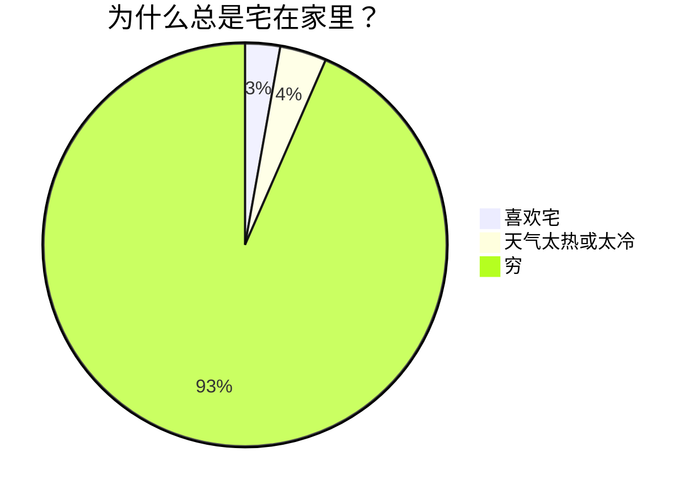
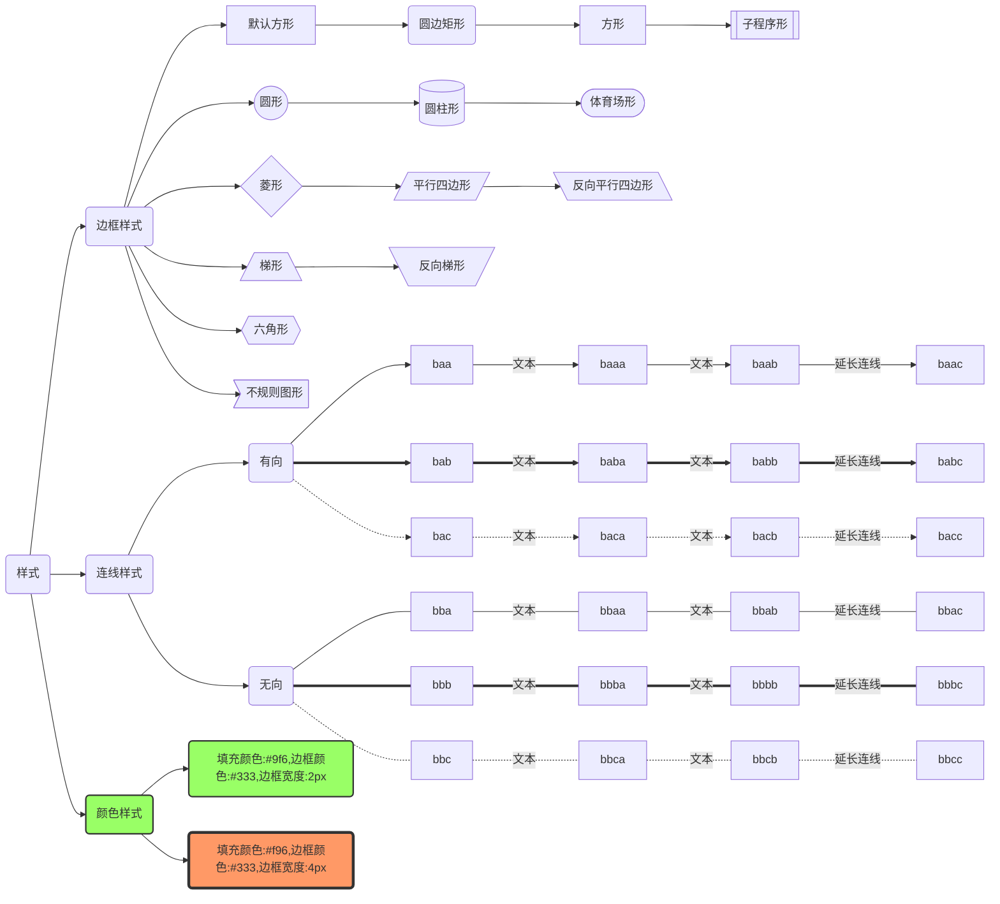
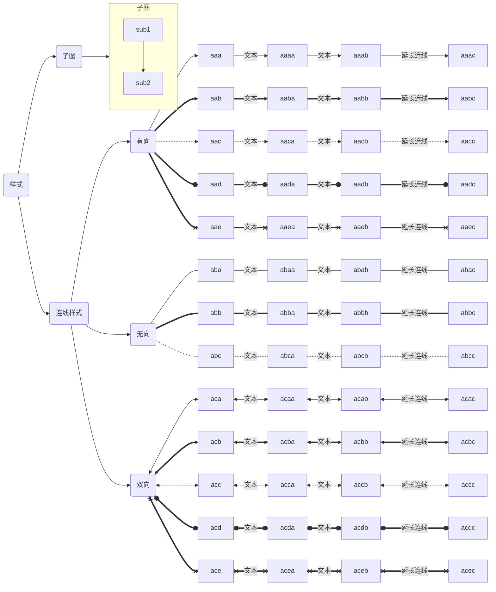
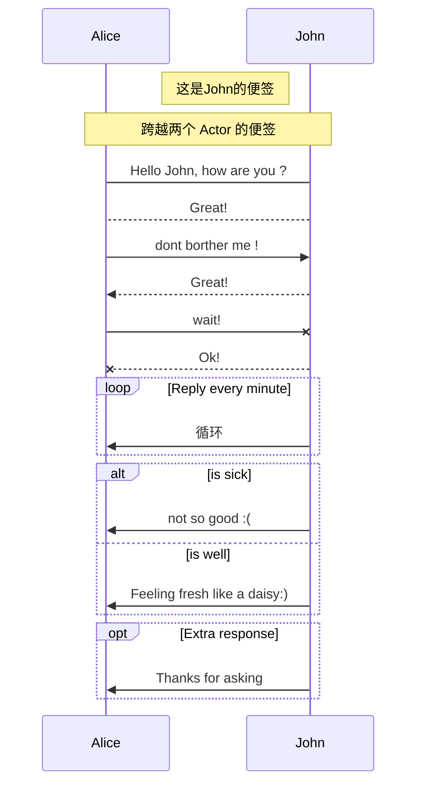
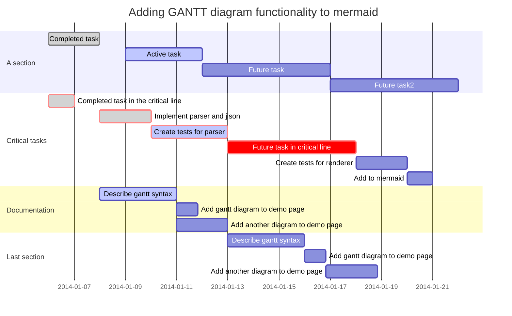
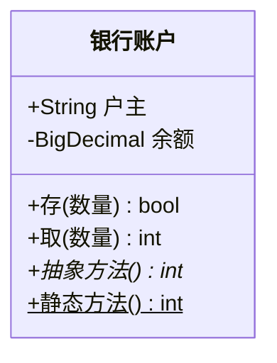
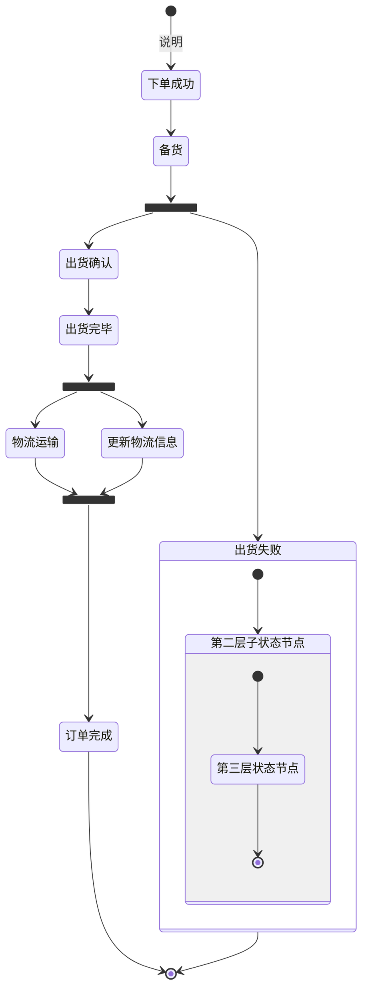
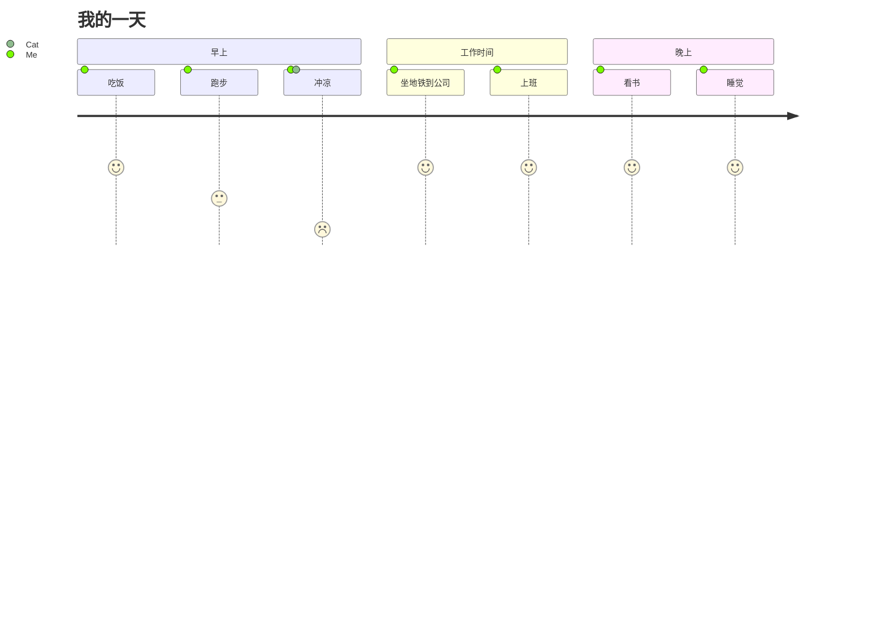

# Linux

### 文件

#### 

```shell
# 一次创建多个文件
touch filename1 filename2 filename3

# 查看当前文件夹下文件个数（不包括子目录下的文件）
ls -l | grep "^-" | wc -l
# 查看当前文件夹下文件个数（包括子目录下的文件）
ls -lR| grep "^-" | wc -l
# 查看当前目录下文目录的个数（包括子目录）
ls -lR | grep "^d" | wc -l

# wc
# -c 统计字节数
# -l 统计行数
# -w 统计字数
wc -l ./text.log
wc -l ./*.log

# 查看文件内容
# 前 num 行
cat test.log | head -n num
# 后 num 行
cat test.log | tail -n num

# grep：支持基本正则表达式
# egrep：支持扩展正则表达式，相当于grep -E
# fgrep：不支持正则表达式，只能匹配写死的字符串，但是速度奇快，效率高，fastgrep

# -E 可选，多个筛选条件 OR，筛选条件使用 | 分隔，| 的转译字符为 \|
# -A 展示筛选结果后 num 行
# -B 展示筛选结果前 num 行
# -C -A + -B
cat test.log | grep [-E] 'filter1 | filter2' [-A/-B/-C num]
# 多个筛选条件 AND
cat test.log | grep 'filter1' | grep 'filter2'

# 查找文件
find / -name mysql.sock
```


# 数据库

## Mysql

#### 连续的数字、字符、时间


#### 分组合并非分组字段

```sql
group_concat(distinct apn separator '、')
```


## Oracle

#### 常用 SQL

```sql
-- 表改名
ALTER TABLE table_name RENAME TO new_table_name;
-- 列改名
ALTER TABLE table_name RENAME COLUMN column_name TO new_column_name;
-- 修改空字段的数据类型
ALTER TABLE table_name MODIFY column_name TYPE;
-- 普通用户修改密码
alter user 用户名 identified by 新密码 replace 旧密码;
-- 排序时 NULL 排在最后
ORDER BY 字段 DESC NULLS LAST
```


#### 数据备份

##### 复制数据

```sql
-- 只复制数据，不复制主键及索引
CREATE TABLE 备份表 AS SELECT * FROM 原表;
```


#### 时间

##### 时间加减

```sql
-- 加减 1 秒(86400)，分钟(1440)，小时(24)，天(1)
to_date('2022-01-01 00:00:00','yyyy-mm-dd hh24:mi:ss') + 1/86400

-- 加减小时
to_date('2022-03-31 23:59:59','yyyy-mm-dd hh24:mi:ss') + INTERVAL '-1' HOUR
-- 加减天
to_date('2022-03-31 23:59:59','yyyy-mm-dd hh24:mi:ss') + INTERVAL '-1' DAY
-- 加减月(如下月日期不存在会报错，1月31日加1个月会报错)
to_date('2022-04-01 23:59:59','yyyy-mm-dd hh24:mi:ss') + INTERVAL '-1' MONTH

-- numtodsinterval 常用的单位有 ('day','hour','minute','second')
to_date('2022-03-31 23:59:59','yyyy-mm-dd hh24:mi:ss')-numtodsinterval(1,'hour')
-- numtoyminterval 常用的单位有 ('year','month')，(如下月日期不存在会报错，1月31日加1个月会报错)
to_date('2022-03-31 23:59:59','yyyy-mm-dd hh24:mi:ss')+numtoyminterval(1,'month')

-- 加减月(1月31日加1个月不会报错)
add_months(to_date('2022-01-31 23:59:59','yyyy-mm-dd hh24:mi:ss'),1)
```


##### 字符串转时间

```sql
to_date('2022-03-31 23:59:59','yyyy-mm-dd hh24:mi:ss')
to_date(20220331235959,'yyyy-mm-dd hh24:mi:ss')
to_timestamp('2022-08-25 10:07:41.433000', 'syyyy-mm-dd hh24:mi:ss:ff6')
```


##### 时间转字符串

```sql
to_char(created_time,'yyyy-mm-dd hh24:mi:ss')
```


##### 时间转时间戳(13位)

```sql
round((to_date('2022081913', 'yyyymmddhh24') - to_date('1970-01-01 08:00:00', 'syyyy-mm-dd hh24:mi:ss')) * (1000 * 24 * 60 * 60))
```


##### 时间戳转时间

```sql
to_date('1970-01-01 08:00:00', 'syyyy-mm-dd hh24:mi:ss') + 1660885200000 / (1000 * 24 * 60 * 60)
```


##### 随机时间

```sql
# 缺点：可能会产生不存在的时间，例如：如果日随机1-30，则可能会产生：2月30号天只能随机
# 优点：可以对年、月、日、小时、分钟、秒单独进行控制
SELECT 
    DBMS_RANDOM.VALUE(2022,2022) || '-' ||
    lpad(TRUNC(DBMS_RANDOM.VALUE(1,12)), 2, '0') || '-' ||
    lpad(TRUNC(DBMS_RANDOM.VALUE(1,28)), 2, '0') || ' ' ||
    lpad(TRUNC(DBMS_RANDOM.VALUE(0,23)), 2, '0') || ':' ||
    lpad(TRUNC(DBMS_RANDOM.VALUE(0,59)), 2, '0') || ':' ||
    lpad(TRUNC(DBMS_RANDOM.VALUE(0,59)), 2, '0')
FROM DUAL;

# 缺点：不能单独控制年、月、日，只能是两个日期之间的日期
# 优点：可以避免产生不存在的时间，例如：2月30号
SELECT 
    to_date(
        TRUNC(
            DBMS_RANDOM.VALUE(
                to_number(to_char(to_date('20220701','yyyymmdd'),'J')),
                to_number(to_char(to_date('20221001','yyyymmdd'),'J'))
            )
        ),'J') +
    DBMS_RANDOM.VALUE(1,86400)/86400
FROM DUAL;
```


#### 连续的数字、字符、时间

##### generate_series

```sql
-- sys.odcinumberlist 是 Oracle 预定义的变长数组类型；PIPELINED 表示定义管道表函数
CREATE OR REPLACE FUNCTION generate_series (pstart IN NUMBER, pstop IN NUMBER, pstep IN NUMBER DEFAULT 1)
RETURN sys.odcinumberlist DETERMINISTIC PIPELINED
AS
BEGIN
  IF (pstep = 0) THEN
    raise_application_error(-20001, 'step size cannot equal zero!');
  END IF;
  
  IF (pstart > pstop AND pstep > 0) OR (pstart < pstop AND pstep < 0) THEN
    RETURN;
  END IF;
  
  FOR i IN 0 .. floor(abs((pstop-pstart)/pstep)) LOOP
    PIPE ROW (pstart + i * pstep);
  END LOOP;
    
  RETURN;
END generate_series;

```


##### 数字

```sql
-- 1-6
SELECT ROWNUM FROM DUAL CONNECT BY LEVEL <= 6;
-- 或
SELECT * FROM TABLE(generate_series(1, 6));
-- 或，通用表表达式（Common Table Expression）的递归调用可以用于生成各种数列
WITH t(n) AS (
  SELECT 1 FROM DUAL 
	UNION ALL
  SELECT n+1 FROM t WHERE n < 6
)
SELECT n FROM t;

-- 3-6
SELECT LEVEL FROM DUAL WHERE LEVEL >=3 CONNECT BY LEVEL <= 6;

-- 2-15 的等差数列
SELECT LEVEL FROM DUAL WHERE LEVEL >=2 AND MOD(LEVEL-2, 3) = 0 CONNECT BY LEVEL <= 15;

-- 15 - 1.4 的等差数列
SELECT ((LEVEL-1) * -2.5 + 15) FROM DUAL WHERE LEVEL >= 1 CONNECT BY ((LEVEL-1) * -2.5 + 15) >= 1.4;
SELECT * FROM TABLE(generate_series(15, 1.4, -2.5));
```


##### 字符

```sql
SELECT CHR(ROWNUM + 64) FROM DUAL CONNECT BY LEVEL <= 5;
-- 或
SELECT CHR(column_value) FROM TABLE(generate_series(65, 70));
-- 或
WITH t(n) AS (
  SELECT 65 FROM DUAL
  UNION ALL
  SELECT n+1 FROM t WHERE n <= 70
)
SELECT CHR(n) FROM t;
```


##### 时间

```sql
SELECT 
	to_date('2020-01-01 00:00:00','yyyy-mm-dd hh24:mi:ss') + ((LEVEL - 1) / 24)
FROM DUAL
CONNECT BY LEVEL <= 12;
-- 或
SELECT to_date('2020-01-01 00:00:00','yyyy-mm-dd hh24:mi:ss') + ((column_value - 1) / 24)
FROM TABLE(generate_series(1, 12));
-- 或
WITH ts(v) AS (
  SELECT TIMESTAMP '2020-01-01 00:00:00' FROM DUAL
  UNION ALL
  SELECT v + 1/24 FROM ts WHERE v < TIMESTAMP '2020-01-01 12:00:00'
)
SELECT v FROM ts;
```


#### 序列

```sql
-- 查询序列
select sequence_name ,last_number, min_value,max_value,increment_by from user_sequences where sequence_name = '';

-- 当刚创建好序列后，不能用 currval 直接查询当前序列的值，必须先用 nextval 查询下一个序列的值，之后才可以使用currval查询当前序列的值
select 序列名.currval from dual;

-- 查询下一个序列的值,并且序列增长到下一个值
select 序列名.nextval from dual;

-- 设置序列为当前ID最大值+1
declare
  MAX_ID number(10);
  CURRENT_VALUE number(10);
BEGIN
	SELECT MAX(ID) INTO MAX_ID FROM 表;
	loop
  		select 序列名.nextval INTO CURRENT_VALUE from dual;
  		exit when CURRENT_VALUE >= MAX_ID;
	end loop;
END ;

-- 设置序列值
alter sequence 序列名 increment by 20 nocache;
select 序列名.nextval from dual;
alter sequence 序列名 increment by 1 nocache;
```


#### 分组

```sql
select * from(
        select gar_logs.*, row_number() OVER (partition by username ORDER BY created_time desc) as rownum from gar_logs
)t where rownum = 1
```


#### 分组合并非分组字段

```sql
LISTAGG(INDICATOR_NAME, '、' ) WITHIN GROUP (ORDER BY INDICATOR_NAME NULLS LAST )AS INDICATOR_NAMES
```


#### LISTAGG 拼接结果过长

```sql
CREATE TYPE tab_varchar2 AS TABLE OF VARCHAR2(4000);

CREATE OR REPLACE FUNCTION concat_array(p tab_varchar2) RETURN CLOB IS
l_result CLOB;
BEGIN
	FOR cc IN (SELECT column_value FROM TABLE(p) ORDER BY column_value) LOOP
		l_result := l_result ||'、'|| cc.column_value;
	END LOOP;
	return l_result;
END;

SELECT
	TABLE_NAME,
	concat_array(CAST(COLLECT(COMMENTS) AS tab_varchar2)) COMMENTS
FROM all_col_comments
WHERE TABLE_NAME IN ()
GROUP BY TABLE_NAME;
```


#### 获取表注释

```sql
-- 表注释
select * from user_tab_comments;
-- 表字段注释
select * from user_col_comments;
-- 以上两个只能获取自己用户的表的注释信息，如果要访问自己能够访问的其他用户的表，则需要使用：
-- 表注释
select * from all_tab_comments;
-- 表字段注释
select * from all_col_comments;
```


#### 临时代码块

```sql
declare
    VAR_TIME number(10);
    VAR_DAY number(10);
    VAR_HOUR number(10);
    VAR_COUNT number(10);
begin
    VAR_TIME := 20230501;
    for i in 1 .. 10 loop
        VAR_DAY := VAR_TIME + i;
        DBMS_OUTPUT.PUT_LINE('天：'||VAR_DAY);
        for i in 0 .. 23 loop
            VAR_HOUR := VAR_DAY||'00' + i;
            DBMS_OUTPUT.PUT_LINE('小时：'||VAR_HOUR);
            SELECT COUNT(1) INTO VAR_COUNT FROM F_HX_N1N2_CITY_H WHERE HOUR_ID = VAR_HOUR;
            	IF VAR_COUNT <= 0 THEN
            		PROC_F_HX_N1N2_CITY_H(VAR_HOUR);
            END IF;
        end loop;
    end loop;
end;
```


#### 空间统计

```sql
-- 统计表占用大小
select segment_name,sum(bytes)/1024/1024 from User_Extents group by segment_name;

-- 查看表的分区
select partition_name from user_tab_partitions where table_name='表名';

-- 统计表分区占用大小
select segment_name,partition_name,Sum(bytes)/1024/1024 from user_segments where segment_name= '表名' and partition_name ='分区名' group by segment_name,partition_name;

-- 统计表空间占用大小
select tablespace_name，sum(bytes)/1024/1024/1024 from user_segments group by tablespace_name; 
```


#### 查看连接数据库连接数

```sql
SELECT MACHINE,count(1) FROM (
    select LOGON_TIME,MACHINE,OSUSER from V$SESSION where username is not NULL  ORDER BY LOGON_TIME DESC
)
GROUP BY MACHINE;
```


#### 修改数据非空字段的数据类型，并且不更改字段位置

```sql
alter table tb add name_bak NUMBER(19,4);

update tb set name_bak=name;

update tb set name=NULL;

alter table tb modify (name NUMBER(19,4));

update tb set name=name_bak;

alter table tb drop column name_bak;
```


#### 存储过程定义使用数组

```sql
DECLARE
  /**
   *声明一个最多容纳100个数的varry数组，注意，它的下标是从1开始的。
   *即 binary_integer
   */
  type array_type is varray(100) of varchar(100);
  /**
   *分别定义一个直接赋值的和两个未赋值的数组。
   *注意：一定要初始化，但可以不赋值。对于没有赋值的这种数组，在用之前
   *也一定要先确定容量。
   */
  v_val_array array_type := array_type('one','two');
  v_val_array2 array_type := array_type();
  v_val_array3 array_type := array_type();
BEGIN
   /**
    *获取第一个varry数组中的值
    *varry的下标从1开始
    */
    dbms_output.put_line('v_val_array中下标1的值：'||v_val_array(1));
    dbms_output.put_line('v_val_array中下标2的值：'||v_val_array(2));


   /**
    *获取第二个varry数组中的值
    *因为第二个varry没有初始化长度，所以通过extend方法，
    *为该数组加一个空位
    */
    v_val_array2.extend;
    v_val_array2(1) :='aaa';
    v_val_array2.extend;
    v_val_array2(2) :='bbb';
    v_val_array2.extend;
    v_val_array2(3) :='ccc';
    dbms_output.put_line('v_val_array2中下标1的值：'||v_val_array2(1));
    dbms_output.put_line('v_val_array2中下标2的值：'||v_val_array2(2));
    dbms_output.put_line('v_val_array2中下标3的值：'||v_val_array2(3));

     /**
    *获取第三个varry数组中的值
    *因为第三个varry没有初始化长度，所以通过extend方法
    *初始化空位
    */

  /**
    *获取第二个varry数组中的值
    *因为第二个varry没有初始化长度，所以通过extend方法，
    *为该数组初始化长度
    */
    v_val_array3.extend(v_val_array2.count());
    v_val_array3(1) :='ddd';
    v_val_array3(2) :='eee';
    v_val_array3(3) :='fff';
    dbms_output.put_line('v_val_array3中下标1的值：'||v_val_array3(1));
    dbms_output.put_line('v_val_array3中下标2的值：'||v_val_array3(2));
    dbms_output.put_line('v_val_array3中下标3的值：'||v_val_array3(3));
END;
```


#### 批量插入数据

```sql
INSERT ALL
INTO 表 (字段1, 字段2) VALUES (1, 'a')
INTO 表 (字段1, 字段2) VALUES (2, 'b')
SELECT 1 FROM DUAL;
-- insert all into其实是根据子查询执行了每个insert into子句，注意到上面SQL中每个into子句用的值都是字面量，子查询"select 1 from dual"返回1条记录，支持每个insert into子句插入指定的1条记录
```


#### CONNECT BY

```sql
-- 假设 T 表里有 N 条数据
SELECT ID,LEVEL FROM T CONNECT BY LEVEL < M;
-- 那么会生成 N 棵高度为 M 的子树，然后先根遍历

-- 生成 1 - M
SELECT ROWNUM FROM DUAL CONNECT BY LEVEL <= M;
```


#### 补充数字前导0

```sql
SELECT TO_CHAR(1, 'FM09') FROM DUAL;
SELECT lpad(1,2,'0') FROM DUAL;
```


#### 插入数据时自增 id

```sql
CREATE SEQUENCE TASK_SEQ_ID
    MINVALUE 1
    NOMAXVALUE
    INCREMENT BY 1
    START WITH 1
NOCACHE;

CREATE OR REPLACE TRIGGER TASK_AUTO_ID BEFORE INSERT ON TASK_TABLE FOR EACH ROW WHEN(NEW.ID IS NULL)
BEGIN
    SELECT TASK_SEQ_ID.nextval INTO :NEW.ID FROM DUAL;
END;
```


#### 插入数据时更新时间

```sql
CREATED_TIME DATE DEFAULT SYSDATE,
UPDATE_TIME DATE,

CREATE OR REPLACE TRIGGER F_HX_OATZET_ALARM_CONFIG_IUD BEFORE INSERT OR UPDATE ON F_HX_OATZET_ALARM_CONFIG FOR EACH ROW
BEGIN
    IF INSERTING THEN
        :NEW.CREATED_TIME := SYSDATE;
    ELSIF UPDATING THEN
        :NEW.UPDATE_TIME := SYSDATE;
END IF;
END;
```


#### 删除索引

```sql
DROP INDEX F_HX_ASS_IND_POST_TASK_PK;
ALTER TABLE F_HX_ASS_IND_POST_TASK DROP CONSTRAINT F_HX_ASS_IND_POST_TASK_PK;
```


#### to_char


```sql
select TRIM(to_char(TRUNC(2355/100), '09')) || ':' || TRIM(to_char(MOD(2355, 100), '09')) from dual;
```


## Pg


#### 常用 SQL

```sql
-- 增加字段
ALTER TABLE table_name ADD COLUMN column_name text NOT NULL DEFAULT '';
```


#### 时间


##### 字符串转时间戳

```sql
to_timestamp('2022-03-31 23:59:59.999', 'yyyy-mm-dd hh24:mi:ss.ms')
```


##### 时间戳转字符串

```sql
to_char(created_time,'yyyy-mm-dd hh24:mi:ss.ms')
```


#### 序列

```sql
-- 查看序列
select * from gar_users_id_seq;
-- 设置序列到某个值
select setval('gar_users_id_seq',2200);
```


#### 分组

```sql
select * from(
        select gar_logs.*, row_number() OVER (partition by username ORDER BY created_time desc) as rownum from gar_logs
)t where rownum = 1
```


#### 分组合并非分组字段

```sql
string_agg(roles_permissions_join.permission_name, ',') as permission_name
```


#### 查看数据库账号

```sql
select u.usename, u.usesysid, 
	case 
		when u.usesuper and u.usecreatedb then 'superuser, create database'
		when u.usesuper then 'superuser'
		when u.usecreatedb then 'create database'
	end as attributes 
from pg_catalog.pg_user u
```


## H2

### 数据类型

| 类型描述               | 对应数据库中类型   | 值范围                                                       | 对应 Java 范围                        | 说明                               |
| ---------------------- | ------------------ | ------------------------------------------------------------ | ------------------------------------- | ---------------------------------- |
| 整数                   | INT                | -2147483648 到 2147483647                                    | Integer                               |                                    |
| 布尔型                 | BOOLEAN            | TRUE 或 FALSE                                                | Boolean                               |                                    |
| 微整数                 | TINYINT            | -128 到 127                                                  | Byte                                  |                                    |
| 小整数                 | SMALLINT           | -32768 到 32767                                              | Short                                 |                                    |
| 大整数                 | BIGINT             | -9223372036854775808 到 9223372036854775807                  | Long                                  |                                    |
| 标识符                 | IDENTITY           | -9223372036854775808 到 9223372036854775807                  | Long                                  | 使用的值不能再重用，即使事务回滚。 |
| 货币数                 | DECIMAL            | 固定整数位和小数位。这个数据类型经常用于存储货币等类型的值。 | BigDecimal                            |                                    |
| 双精度实数             | DOUBLE             | 浮点数。不能应用到表示货币等值，因为有四舍五入的问题。       | Double                                |                                    |
| 实数                   | REAL               | 单精度浮点数。不能应用到表示货币等值，因为有四舍五入的问题。 | Float                                 |                                    |
| 时间                   | TIME               | 格式为 hh:mm:ss                                              | Time                                  |                                    |
| 日期                   | DATE               | 格式为 yyyy-MM-dd                                            | Date                                  |                                    |
| 时间戳                 | TIMESTAMP          | 格式为 yyyy-MM-dd hh:mm:ss[.nnnnnnnnn]                       | Timestamp(Date 也支持)                |                                    |
| 二进制                 | BINARY             | 表示一个字节数组。针对更长的数组，使用 BLOB 类型。最大的尺寸为 2 GB，当使用这种数据类型时，整个对象都会保存在内存中，在内存中的尺寸是一个精确的指定值，只有实际的数据会被持久化。对于大的文本数据，还是使用 BLOB 和 CLOB 更合适。 | byte[]                                |                                    |
| 其他类型               | OTHER              | 这个类型允许存储可序列化的JAVA对象。在内部，使用的是一个字节数组。序列化和反序列化只在客户端端完成。反序列化仅在 getObject 被调用时才被调用。JAVA操作因为安全的原因并不能在数据库引擎内被执行。可以使用 PreparedStatement.setObject 存储对象。 | Object (或者是任何子类)               |                                    |
| 可变字符串             | VARCHAR            | Unicode 字符串。使用两个单引号(’’) 表示一个引用。最大的长度是Integer.MAX_VALUE，字符串的实际长度是精确指定的，仅实际的数据会被持久化。当使用这种数据类型时，整个文本都会保存在内存中。更多的文本数据，使用 CLOB 更合适。 | String                                |                                    |
| 不区分大小写可变字符串 | VARCHAR_IGNORECASE | 与 VARCHAR 类型类似，只是在比较时不区分大小写。存储时是混合大小写存储的。当使用这种数据类型时，整个文本都会保存在内存中。更多的文本数据，使用 CLOB 更合适。 | String                                |                                    |
| 字符                   | CHAR               | 这个类型支持是针对其他数据库或老的应用的兼容性。与VARCHAR 的不同是尾空格将被忽略并且不会被持久化。 Unicode 字符串。使用两个单引号(’’) 表示一个引用。最大的长度是Integer.MAX_VALUE，字符串的实际长度是精确指定的，仅实际的数据会被持久化。当使用这种数据类型时，整个文本都会保存在内存中。更多的文本数据，使用 CLOB 更合适。 | String                                |                                    |
| 二进制大对象           | BLOB               | 类似于BINARY，但是针对的是非常大的值如文件或是图片。跟BINARY不同的是，大对象并不完全保存在内存中。使用 PreparedStatement.setBinaryStream 存储对象，详细请参见 CLOB 和 高级 / 大对象。 | Blob (java.io.InputStream 也支持)     |                                    |
| 文本大对象             | CLOB               | CLOB类似于 VARCHAR，但是针对的是非常大的值。与 VARCHAR不同的是，CLOB 对象并不完全保存在内存中，而是使用的流。CLOB 可以用于文档或文本，如果XML、HTML文档，文本文件、未限制尺寸的备忘录等。使用 PreparedStatement.setCharacterStream 存储对象。详细请参见 高级 / 大对象。VARCHAR 用于相对较小的文本（如200个字符以内）。小的 CLOB 值被就地存储，但是也比 VARCHAR 要大。 | Clob (java.io.Reader 也支持)          |                                    |
| 通用唯一标识符         | UUID               | UUID（Universally unique identifier），是一个128BIT的值，使用 PreparedStatement.setBytes 或 setString 去存储值。 | UUID                                  |                                    |
| 数组                   | ARRAY              | 一组值，可以使用值列表 (1, 2) 或 PreparedStatement.setObject(…, new Object[] {…}) 存储对象。 | Object[] (没有任何原始类型数组被支持) |                                    |


# MyBatis


## 主键自增

```java
@Data
@EqualsAndHashCode()
@TableName("TASK")
public class TaskDO implements Serializable {

    /**
     * 任务id
     */
    @TableField("ID")
    @TableId(type = IdType.AUTO)
    private Long id;
}
```


```java
@Repository
@Mapper
public interface TaskMapper extends BaseMapper<TaskDO> {
    Long insertTask(@Param("params") TaskDO params);
}
```


```xml
<insert id="insertTask" useGeneratedKeys="true" parameterType="TaskDO">
    <selectKey  keyProperty="params.id" resultType="java.lang.Long" order="BEFORE">
        select TASK_SEQ_ID.nextval from dual
    </selectKey>
    insert into TASK(
    ID,
    USER_ID,
    STATUS,
    ERROR_MSG,
    PATROL_TIME,
    START_TIME,
    END_TIME,
    ENV
    )
    values (
    #{params.id, jdbcType=BIGINT},
    #{params.userId, jdbcType=BIGINT},
    #{params.status, jdbcType=VARCHAR},
    #{params.errorMsg, jdbcType=VARCHAR},
    #{params.patrolTime, jdbcType=TIMESTAMP},
    #{params.startTime, jdbcType=TIMESTAMP},
    #{params.endTime, jdbcType=TIMESTAMP},
    #{params.env, jdbcType=VARCHAR}
    )
</insert>
```


## QueryWrapper

```java
List<RuleVO> listAlarmRule(@Param(Constants.WRAPPER) Wrapper<RulePO> wrapper);

IPage<RuleVO> listAlarmRule(IPage<RulePO> page, @Param(Constants.WRAPPER) Wrapper<RulePO> wrapper);
```


```java
<?xml version="1.0" encoding="UTF-8"?>

<!DOCTYPE mapper PUBLIC "-//mybatis.org//DTD Mapper 3.0//EN" "http://mybatis.org/dtd/mybatis-3-mapper.dtd">
<mapper namespace="RuleMapper">

    <select id="listRule" resultType="RuleVO">
        SELECT
            ID,
            NAME,
            CITY_OID,
            CITY_NAME,
            APP_SUB_TYPE,
            APP_SUB_NAME,
            ALGORITHMS,
            GRANULARITY,
            MONITOR_CYCLE,
            QOE_THRESHOLD,
            ACC_DEPTH,
            ACC_THRESHOLD,
            BQ_THRESHOLD,
            RULE,
            STATUS,
            CREATE_USER,
            CREATE_TIME,
            UPDATE_USER,
            UPDATE_TIME
        FROM RULE
        <if test="ew.emptyOfWhere == false">
            ${ew.customSqlSegment}
        </if>
    </select>
</mapper>
```


```java
// id != {id} and (name ={name} or (cityOid = {cityOid} and appSubType = {appSubType} and status = {status}))
int sameCount = count(Wrappers.<RulePO>lambdaQuery()
        .ne(null != id, RulePO::getId, id)
        .and(wrapper -> wrapper
                .eq(RulePO::getName, name)
                .or( wrapper2 -> wrapper2
                        .eq(RulePO::getCityOid, cityOid)
                        .eq(RulePO::getAppSubType, appSubType)
                        .eq(RulePO::getStatus, status)
                )
        ));
```


## ResultMap


```xml
<!DOCTYPE mapper PUBLIC "-//mybatis.org//DTD Mapper 3.0//EN" "http://mybatis.org/dtd/mybatis-3-mapper.dtd">
<mapper namespace="mapper.package">

    <resultMap id="resultMapId" type="vo.package">
        <id column="ID" jdbcType="BIGINT" property="id" />
        <result column="NAME" jdbcType="VARCHAR" property="name" />
        <!-- 一对一 -->
        <association property="wife" javaType="wife.vo.package">
            <id column="WIFE_ID" jdbcType="BIGINT" property="id"/>
            <result column="WIFE_NAME" jdbcType="VARCHAR" property="name"/>
        </association>
        <!-- 一对多 -->
        <collection property="carList" column="{PEOPLE_ID=ID}" javaType="ArrayList"
                    select="listCar" />
    </resultMap>

    <select id="list" resultMap="resultMapId">
        select
            people_join.ID,
            people_join.NAME,
            wife_join.ID as WIFE_ID,
            wife_join.NAME as WIFE_NAME
        from PEOPLE people_join
        left join WIFE wife_join
            on people_join.ID=wife_join.HUSBAND_ID
    </select>

    <select id="listCar" resultMType="vo.package">
        select 
        	ID as id,
        	BRAND as brand
        from CAR where PEOPLE_ID = #{ID}
    </select>
</mapper>
```

```xml
<!DOCTYPE mapper
        PUBLIC "-//mybatis.org//DTD Mapper 3.0//EN"
        "http://mybatis.org/dtd/mybatis-3-mapper.dtd">
<mapper namespace="com.richstonedt.cmgde2eas.cs.mapper.report.group.GroupServiceSupportApiKpiReportMapper">
    
    <resultMap id="listMap" type="com.richstonedt.cmgde2eas.commons.vo.report.group.GroupServiceSupportApiKpiReportVO">
        <result column="DAY_ID" jdbcType="VARCHAR" property="timeId"/>
        <result column="CITY" jdbcType="VARCHAR" property="cityName"/>
        <result column="CITY" jdbcType="VARCHAR" property="cityName"/>
        <result column="ATTRIBUTE1" jdbcType="VARCHAR" property="attribute1"/>
        <result column="ATTRIBUTE2" jdbcType="VARCHAR" property="attribute2"/>
        <!--对象数组-->
        <collection property="indicator" javaType="ArrayList" ofType="java.util.Map">
            <result column="INDICATOR_NAME" jdbcType="VARCHAR" property="indicatorName"/>
            <result column="INDICATOR_VALUE" jdbcType="VARCHAR" property="indicatorValue"/>
        </collection>
        <!--字符串数组-->
        <collection property="indicatorList" javaType="ArrayList" ofType="java.lang.String">
            <constructor>
                <arg column="INDICATOR"/>
            </constructor>
        </collection>
    </resultMap>

    <select id="list" resultMap="listMap">
        SELECT
            to_char(to_date(DAY_ID, 'yyyy-MM-dd'), 'yyyy-MM-dd') AS DAY_ID,
            CITY,
            ATTRIBUTE1,
            ATTRIBUTE2,
            INDICATOR_NAME,
            INDICATOR_VALUE,
        	INDICATOR
        FROM GDSIGNAL.F_GD_DPI_KPI_D
        WHERE #{params.beginTime} &lt;= DAY_ID AND DAY_ID &lt;= #{params.endTime}
        <if test="null != params.cityNameList and !params.cityNameList.isEmpty()">
            <foreach item="item" collection="params.cityNameList" separator="," open="AND CITY IN(" close=")" index="">
                #{item}
            </foreach>
        </if>
    </select>
</mapper>
```


## 批量插入

### Mapper

```java
public interface UserMapper extends BaseMapper<User> {
    Integer insertBatchSomeColumn(List<User> entityList);
}
```


### 配置

```java
@Configuration
@MapperScan(basePackages = "", sqlSessionFactoryRef = "db1SqlSessionFactory")
public class DataSource1MyBatisConfig {
    
    @Bean(name = "db1SqlSessionFactory")
    @Primary
    public SqlSessionFactory db1SqlSessionFactory(@Qualifier("easySqlInjector") DefaultSqlInjector easySqlInjector)
            throws Exception {
        MybatisSqlSessionFactoryBean mybatisSqlSessionFactoryBean = new MybatisSqlSessionFactoryBean();
        
        // ....

        GlobalConfig globalConfig = GlobalConfigUtils.defaults();
        GlobalConfig.DbConfig globalConfigDbConfig = new GlobalConfig.DbConfig();
        globalConfig.setDbConfig(globalConfigDbConfig);
        globalConfig.setSqlInjector(easySqlInjector);
        mybatisSqlSessionFactoryBean.setGlobalConfig(globalConfig);

        return mybatisSqlSessionFactoryBean.getObject();
    }
    
    @Bean("easySqlInjector")
    public DefaultSqlInjector easySqlInjector(){
        DefaultSqlInjector easySqlInjector = new DefaultSqlInjector(){
            @Override
            public List<AbstractMethod> getMethodList(Class<?> mapperClass) {
                List<AbstractMethod> methodList = super.getMethodList(mapperClass);
                methodList.add(new InsertBatchSomeColumn(i -> i.getField().isAnnotationPresent(TableField.class) && i.getField().getAnnotation(TableField.class).exist()));
                return methodList;
            }
        };
        return easySqlInjector;
    }
}
```


### 使用

```java
mapper.insertBatchSomeColumn(dataList);
```


## 读取数据库数据

参考

https://www.codingsky.com/doc/2021/11/25/801.html

https://blog.csdn.net/qq_20919883/article/details/129637023


JDBC三种读取方式：

1.  一次全部（默认）：一次获取全部； 
2. 流式：多次获取，一次一行；
3. 游标：多次获取，一次多行；

> mybatis默认采取第一种。

流式查询、游标查询可以避免 OOM，**数据量大可以考虑此方案**。但是这两种方式会占用数据库连接，使用中不会释放，所以线上针对大数据量业务用到游标和流式操作，**一定要进行并发控制。**


### 默认


### 流式


#### Mapper

fetchSize 设置为 Integer.MIN_VALUE

```xml
<select id="list" resultType="com.example.vo" resultSetType="FORWARD_ONLY" fetchSize="-2147483648">
    
</select>
```

```java
@Repository
@Mapper
public interface ListMapper {
	void list(@Param("id") Integer id, ResultHandler<Vo> handler);
}
```


#### Service

```java
public List<Vo> List(Integer id) {
    final List<Vo> list = new ArrayList<>();
    mapper.list(id, new ResultHandler<o>() {
        @Override
        public void handleResult(ResultContext<? extends Vo> resultContext) {
            /**回调处理逻辑 */
            list.add(resultContext.getResultObject());
        }
    });
    return list;
  }
```


### 游标

设置连接属性 `useCursorFetch=true`


#### Mapper

fetchSize 设置为想要的值

```xml
<select id="list" resultType="com.example.vo" resultSetType="FORWARD_ONLY" fetchSize="1000">
    
</select>
```

```java
@Repository
@Mapper
public interface ListMapper {
	Cursor<Vo> list(@Param("id") Integer id);
}
```


#### Service

```java
// 注意点：获取数据时要保证数据库连接没有被回收，这里使用了 @Transactional 保证
@Transactional
public void List(Integer id) {
    Cursor<Vo> cursor = mapper.list(id);
    for(Vo vo:cursor){
        /**数据处理逻辑 */
    }
  }
```


## 存储过程调用

```xml
<select id="initSegment">
    declare
        PART_COUNT NUMBER;
        PART_NAME VARCHAR(30);
    BEGIN
        PART_NAME := 'PART_'||#{targetTime};
        SELECT COUNT(*) INTO PART_COUNT FROM USER_TAB_PARTITIONS WHERE TABLE_NAME='F_HX_L4_SA_GAME_BQA_5M' AND PARTITION_NAME=PART_NAME;
        if PART_COUNT>0 then
            execute immediate 'ALTER TABLE F_HX_L4_SA_GAME_BQA_5M DROP PARTITION '||PART_NAME;
        end if;
        execute immediate 'ALTER TABLE F_HX_L4_SA_GAME_BQA_5M ADD PARTITION '||PART_NAME||' VALUES ('||#{targetTime}||')';
    END;
</select>
```


```xml
<select id="callBqaHourProc" statementType="CALLABLE">
    {CALL PROC_HX_L4_SA_GAME_BQA_H(
    	#{targetTime, jdbcType=NUMERIC, mode=IN}
    )}
</select>
```


# SpringBoot

## SpringBoot 和 SpringFramework 版本依赖关系

[查询方式](https://docs.spring.io/spring-boot/docs/3.0.2/reference/html/getting-started.html#getting)

[所有版本号](https://docs.spring.io/spring-boot/docs/)

**查询时切换版本号即可**


### 1.x

| SpringBoot版本 | SpringFramework版本 | 发布时间 |
| -------------- | ------------------- | -------- |
| 1.0.0.RELEASE  | 4.0.3.RELEASE       | 2014.04  |
| 1.0.1.RELEASE  | 4.0.3.RELEASE       | 2014.04  |
| 1.0.2.RELEASE  | 4.0.3.RELEASE       | 2014.04  |
| 1.1.0.RELEASE  | 4.0.5.RELEASE       | 2014.06  |
| 1.1.1.RELEASE  | 4.0.5.RELEASE       | 2014.06  |
| 1.1.2.RELEASE  | 4.0.5.RELEASE       | 2014.06  |
| 1.1.3.RELEASE  | 4.0.5.RELEASE       | 2014.06  |
| 1.1.4.RELEASE  | 4.0.6.RELEASE       | 2014.07  |
| 1.1.5.RELEASE  | 4.0.6.RELEASE       | 2014.08  |
| 1.1.6.RELEASE  | 4.0.6.RELEASE       | 2014.09  |
| 1.1.7.RELEASE  | 4.0.7.RELEASE       | 2014.09  |
| 1.1.8.RELEASE  | 4.0.7.RELEASE       | 2014.10  |
| 1.1.9.RELEASE  | 4.0.8.RELEASE       | 2014.11  |
| 1.1.10.RELEASE | 4.0.8.RELEASE       | 2014.12  |
| 1.1.11.RELEASE | 4.0.9.RELEASE       | 2015.02  |
| 1.1.12.RELEASE | 4.0.9.RELEASE       | 2015.03  |
| 1.2.0.RELEASE  | 4.1.3.RELEASE       | 2014.12  |
| 1.2.1.RELEASE  | 4.1.4.RELEASE       | 2015.01  |
| 1.2.2.RELEASE  | 4.1.5.RELEASE       | 2015.02  |
| 1.2.3.RELEASE  | 4.1.6.RELEASE       | 2015.03  |
| 1.2.4.RELEASE  | 4.1.6.RELEASE       | 2015.06  |
| 1.2.5.RELEASE  | 4.1.7.RELEASE       | 2015.07  |
| 1.2.6.RELEASE  | 4.1.8.RELEASE       | 2015.09  |
| 1.2.7.RELEASE  | 4.1.3.RELEASE       | 2015.10  |
| 1.2.8.RELEASE  | 4.1.9.RELEASE       | 2015.12  |
| 1.3.0.RELEASE  | 4.2.3.RELEASE       | 2015.11  |
| 1.3.1.RELEASE  | 4.2.4.RELEASE       | 2015.12  |
| 1.3.2.RELEASE  | 4.2.4.RELEASE       | 2016.01  |
| 1.3.3.RELEASE  | 4.2.5.RELEASE       | 2016.02  |
| 1.3.4.RELEASE  | 4.2.6.RELEASE       | 2016.05  |
| 1.3.5.RELEASE  | 4.2.6.RELEASE       | 2016.05  |
| 1.3.6.RELEASE  | 4.2.7.RELEASE       | 2016.06  |
| 1.3.7.RELEASE  | 4.2.7.RELEASE       | 2016.06  |
| 1.3.8.RELEASE  | 4.2.8.RELEASE       | 2016.09  |
| 1.4.0.RELEASE  | 4.3.2.RELEASE       | 2016.07  |
| 1.4.1.RELEASE  | 4.3.3.RELEASE       | 2016.09  |
| 1.4.2.RELEASE  | 4.3.4.RELEASE       | 2016.11  |
| 1.4.3.RELEASE  | 4.3.5.RELEASE       | 2016.12  |
| 1.4.4.RELEASE  | 4.3.6.RELEASE       | 2017.01  |
| 1.4.5.RELEASE  | 4.3.7.RELEASE       | 2017.03  |
| 1.4.6.RELEASE  | 4.3.8.RELEASE       | 2017.04  |
| 1.4.7.RELEASE  | 4.3.9.RELEASE       | 2017.06  |
| 1.5.0.RELEASE  | 4.3.6.RELEASE       | 2017.01  |
| 1.5.1.RELEASE  | 4.3.6.RELEASE       | 2017.01  |
| 1.5.2.RELEASE  | 4.3.7.RELEASE       | 2017.03  |
| 1.5.3.RELEASE  | 4.3.8.RELEASE       | 2017.04  |
| 1.5.4.RELEASE  | 4.3.9.RELEASE       | 2017.06  |
| 1.5.5.RELEASE  | 4.3.10.RELEASE      | 2017.07  |
| 1.5.6.RELEASE  | 4.3.10.RELEASE      | 2017.07  |
| 1.5.7.RELEASE  | 4.3.11.RELEASE      | 2017.09  |
| 1.5.8.RELEASE  | 4.3.12.RELEASE      | 2017.10  |
| 1.5.9.RELEASE  | 4.3.13.RELEASE      | 2017.11  |
| 1.5.10.RELEASE | 4.3.14.RELEASE      | 2018.01  |
| 1.5.11.RELEASE | 4.3.15.RELEASE      | 2018.04  |
| 1.5.12.RELEASE | 4.3.16.RELEASE      | 2018.04  |
| 1.5.13.RELEASE | 4.3.17.RELEASE      | 2018.05  |
| 1.5.14.RELEASE | 4.3.18.RELEASE      | 2018.06  |
| 1.5.15.RELEASE | 4.3.18.RELEASE      | 2018.07  |
| 1.5.16.RELEASE | 4.3.19.RELEASE      | 2018.09  |
| 1.5.17.RELEASE | 4.3.20.RELEASE      | 2018.10  |
| 1.5.18.RELEASE | 4.3.21.RELEASE      | 2018.11  |
| 1.5.19.RELEASE | 4.3.22.RELEASE      | 2019.01  |
| 1.5.20.RELEASE | 4.3.23.RELEASE      | 2019.04  |
| 1.5.21.RELEASE | 4.3.24.RELEASE      | 2019.05  |
| 1.5.22.RELEASE | 4.3.25.RELEASE      | 2019.08  |

### 2.x
| SpringBoot版本 | SpringFramework版本 | 发布时间 |
| -------------- | ------------------- | -------- |
| 2.0.0.RELEASE  | 5.0.4.RELEASE       | 2018.03  |
| 2.0.1.RELEASE  | 5.0.5.RELEASE       | 2018.04  |
| 2.0.2.RELEASE  | 5.0.6.RELEASE       | 2018.05  |
| 2.0.3.RELEASE  | 5.0.7.RELEASE       | 2018.06  |
| 2.0.4.RELEASE  | 5.0.8.RELEASE       | 2018.07  |
| 2.0.5.RELEASE  | 5.0.9.RELEASE       | 2018.09  |
| 2.0.6.RELEASE  | 5.0.10.RELEASE      | 2018.10  |
| 2.0.7.RELEASE  | 5.0.11.RELEASE      | 2018.11  |
| 2.0.8.RELEASE  | 5.0.12.RELEASE      | 2019.01  |
| 2.0.9.RELEASE  | 5.0.13.RELEASE      | 2019.04  |
| 2.1.0.RELEASE  | 5.1.2.RELEASE       | 2018.10  |
| 2.1.1.RELEASE  | 5.1.3.RELEASE       | 2018.11  |
| 2.1.2.RELEASE  | 5.1.4.RELEASE       | 2019.01  |
| 2.1.3.RELEASE  | 5.1.5.RELEASE       | 2019.02  |
| 2.1.4.RELEASE  | 5.1.6.RELEASE       | 2019.04  |
| 2.1.5.RELEASE  | 5.1.7.RELEASE       | 2019.05  |
| 2.1.6.RELEASE  | 5.1.8.RELEASE       | 2019.06  |
| 2.1.7.RELEASE  | 5.1.9.RELEASE       | 2019.08  |
| 2.1.8.RELEASE  | 5.1.9.RELEASE       | 2019.09  |
| 2.1.9.RELEASE  | 5.1.10.RELEASE      | 2019.10  |
| 2.1.10.RELEASE | 5.1.11.RELEASE      | 2019.11  |
| 2.1.11.RELEASE | 5.1.12.RELEASE      | 2019.12  |
| 2.1.12.RELEASE | 5.1.13.RELEASE      | 2020.01  |
| 2.1.13.RELEASE | 5.1.14.RELEASE      | 2020.02  |
| 2.1.14.RELEASE | 5.1.15.RELEASE      | 2020.05  |
| 2.1.15.RELEASE | 5.1.16.RELEASE      | 2020.06  |
| 2.1.16.RELEASE | 5.1.17.RELEASE      | 2020.07  |
| 2.1.17.RELEASE | 5.1.18.RELEASE      | 2020.09  |
| 2.1.18.RELEASE | 5.1.19.RELEASE      | 2020.10  |
| 2.2.0.RELEASE  | 5.2.0.RELEASE       | 2019.10  |
| 2.2.1.RELEASE  | 5.2.1.RELEASE       | 2019.11  |
| 2.2.2.RELEASE  | 5.2.2.RELEASE       | 2019.12  |
| 2.2.3.RELEASE  | 5.2.3.RELEASE       | 2020.01  |
| 2.2.4.RELEASE  | 5.2.3.RELEASE       | 2020.01  |
| 2.2.5.RELEASE  | 5.2.4.RELEASE       | 2020.02  |
| 2.2.6.RELEASE  | 5.2.5.RELEASE       | 2020.03  |
| 2.2.7.RELEASE  | 5.2.6.RELEASE       | 2020.05  |
| 2.2.8.RELEASE  | 5.2.7.RELEASE       | 2020.06  |
| 2.2.9.RELEASE  | 5.2.8.RELEASE       | 2020.07  |
| 2.2.10.RELEASE | 5.2.9.RELEASE       | 2020.09  |
| 2.2.11.RELEASE | 5.2.10.RELEASE      | 2020.10  |
| 2.2.12.RELEASE | 5.2.12.RELEASE      | 2020.11  |
| 2.2.13.RELEASE | 5.2.12.RELEASE      |          |
| 2.3.0.RELEASE  | 5.2.6.RELEASE       | 2020.05  |
| 2.3.1.RELEASE  | 5.2.7.RELEASE       | 2020.06  |
| 2.3.2.RELEASE  | 5.2.8.RELEASE       | 2020.07  |
| 2.3.3.RELEASE  | 5.2.8.RELEASE       | 2020.08  |
| 2.3.4.RELEASE  | 5.2.9.RELEASE       | 2020.09  |
| 2.3.5.RELEASE  | 5.2.10.RELEASE      | 2020.10  |
| 2.3.6.RELEASE  | 5.2.11.RELEASE      | 2020.11  |
| 2.3.7.RELEASE  | 5.2.12.RELEASE      | 2020.12  |
| 2.3.8.RELEASE  | 5.2.12.RELEASE      |          |
| 2.3.9.RELEASE  | 5.2.13.RELEASE      |          |
| 2.3.10.RELEASE | 5.2.14.RELEASE      |          |
| 2.3.11.RELEASE | 5.2.15.RELEASE      |          |
| 2.3.12.RELEASE | 5.2.15.RELEASE      |          |
| 2.4.0	         | 5.3.1               | 2020.11  |
| 2.4.1	         | 5.3.2               | 2020.12  |
| 2.4.2	         | 5.3.3               | 2021.01  |
| 2.4.3	         | 5.3.4               | 2021.02  |
| 2.4.4	         | 5.3.5               | 2021.03  |
| 2.4.5	         | 5.3.6               | 2021.04  |
| 2.4.6	         | 5.3.7               | 2021.05  |
| 2.4.7	         | 5.3.8               | 2021.06  |
| 2.4.8	         | 5.3.8               | 2021.06  |
| 2.4.9	         | 5.3.9               | 2021.07  |
| 2.4.10         | 5.3.9               | 2021.08  |
| 2.4.11         | 5.3.10              | 2021.09  |
| 2.4.12         | 5.3.12              | 2021.10  |
| 2.4.13         | 5.3.13              | 2021.11  |
| 2.5.0	         | 5.3.7               | 2021.05  |
| 2.5.1	         | 5.3.8               | 2021.06  |
| 2.5.2	         | 5.3.8               | 2021.06  |
| 2.5.3	         | 5.3.9               | 2021.07  |
| 2.5.4	         | 5.3.9               | 2021.08  |
| 2.5.5	         | 5.3.10              | 2021.09  |
| 2.5.6	         | 5.3.12              | 2021.10  |
| 2.5.7	         | 5.3.13              | 2021.11  |
| 2.5.8	         | 5.3.14              | 2021.12  |
| 2.6.0	         | 5.3.13              | 2021.11  |
| 2.6.1	         | 5.3.13              | 2021.11  |
| 2.6.2	         | 5.3.14              | 2021.12  |
| 2.6.3	         | 5.3.15              | 2022.01  |
| 2.6.4	         | 5.3.16              | 2022.02  |
| 2.6.5	         | 5.3.17              | 2022.03  |
| 2.6.6	         | 5.3.18              | 2022.03  |
| 2.6.7	         | 5.3.19              | 2022.04  |
| 2.6.8	         | 5.3.20              | 2022.05  |
| 2.6.9	         | 5.3.21              | 2022.06  |
| 2.7.0	         | 5.3.20              | 2022.05  |
| 2.7.1	         | 5.3.21              | 2022.06  |
| 2.7.2	         | 5.3.22              | 2022.07  |
| 2.7.3	         | 5.3.22              | 2022.08  |
| 2.7.4	         | 5.3.23              | 2022.09  |
| 2.7.5	         | 5.3.23              | 2022.10  |
| 2.7.6	         | 5.3.24              | 2022.11  |
| 2.7.7	         | 5.3.24              | 2022.12  |
| 2.7.8	         | 5.3.25              | 2023.01  |

### 3.x
| SpringBoot版本 | SpringFramework版本 | 发布时间 |
| -------------- | ------------------- | -------- |
| 3.0.0	         | 6.0.2              | 2022.11   |
| 3.0.1	         | 6.0.3              | 2022.12   |
| 3.0.2	         | 6.0.4              | 2023.01   |


## SpringCloud 和 SpringBoot 版本依赖关系

[start.spring.io/actuator/info](https://start.spring.io/actuator/info)

[SpringBoot、SpringCloud、Spring Cloud Alibaba版本对照表（详细准确） - 知乎 (zhihu.com)](https://zhuanlan.zhihu.com/p/643508351?utm_id=0)

https://mvnrepository.com/artifact/org.springframework.cloud/spring-cloud-dependencies

https://mvnrepository.com/artifact/org.springframework.boot/spring-boot-starter-parent


## SpringCloudAlibaba 和 SpringBoot 版本依赖关系

[spring-cloud-alibaba](https://github.com/alibaba/spring-cloud-alibaba)


## Jackson 配置


```yml
spring:
  jackson:
    property-naming-strategy: SNAKE_CASE
    date-format: yyyy-MM-dd HH:mm:ss
    locale: zh_CN
    time-zone: GMT+8
    default-property-inclusion: NON_NULL
    visibility:
      GETTER: non_private
    serialization:
      WRAP_ROOT_VALUE: false
    deserialization:
      USE_BIG_DECIMAL_FOR_FLOATS: false
    mapper:
      USE_ANNOTATIONS: true
    parser:
      AUTO_CLOSE_SOURCE: true
    generator:
      AUTO_CLOSE_TARGET: true
```


## SpringBoot 使用 Jackson 全局序列化配置


```java
@Configuration
// @EnableWebMvc 不需要加
// 1.存在 WebMvcConfigurationSupport 这个类型的 bean 时，Spring Boot 的自动配置不会生效(类 WebMvcAutoConfiguration 上的注解 @ConditionalOnMissingBean({WebMvcConfigurationSupport.class}))
// 2.使用 @EnableWebMvc 会自动引入 DelegatingWebMvcConfiguration 这个 WebMvcConfigurationSupport 的子类来加载所有实现了 WebMvcConfigurer 接口的 Configuration
// 3.不要直接去继承 WebMvcConfigurationSupport，起码应该是继承它的子类DelegatingWebMvcConfiguration，因为里面包含了加载所有实现了 WebMvcConfigurer 接口的 Configuration
public class HttpMessageConverterConfig implements WebMvcConfigurer {

    @Autowired
    private ObjectMapper objectMapper;

    /**
     * @param converters
     */
    @Override
    public void extendMessageConverters(List<HttpMessageConverter<?>> converters) {
        for(HttpMessageConverter converter:converters){
            if(converter instanceof MappingJackson2HttpMessageConverter){
                ((MappingJackson2HttpMessageConverter)converter).setObjectMapper(objectMapper);
                break;
            }
        }
    }
}
```


## 参数校验

https://zhuanlan.zhihu.com/p/97555913


### 引入依赖

```xml
<dependency>
    <groupId>javax.validation</groupId>
    <artifactId>validation-api</artifactId>
    <version>2.0.1.Final</version>
</dependency>
<dependency>
    <groupId>org.hibernate.validator</groupId>
    <artifactId>hibernate-validator</artifactId>
    <version>6.2.5.Final</version>
</dependency>
```


### 校验注解

#### validator内置注解

| 注解                        | 说明                                                     |
| --------------------------- | -------------------------------------------------------- |
| @Null                       | 被注释的元素必须为 `null`                                |
| @NotNull                    | 被注释的元素必须不为 `null`                              |
| @AssertTrue                 | 被注释的元素必须为 `true`                                |
| @AssertFalse                | 被注释的元素必须为 `false`                               |
| @Min(value)                 | 被注释的元素必须是一个数字，其值必须大于等于指定的最小值 |
| @Max(value)                 | 被注释的元素必须是一个数字，其值必须小于等于指定的最大值 |
| @DecimalMin(value)          | 被注释的元素必须是一个数字，其值必须大于等于指定的最小值 |
| @DecimalMax(value)          | 被注释的元素必须是一个数字，其值必须小于等于指定的最大值 |
| @Size(max, min)             | 被注释的元素的大小必须在指定的范围内                     |
| @Digits (integer, fraction) | 被注释的元素必须是一个数字，其值必须在可接受的范围内     |
| @Past                       | 被注释的元素必须是一个过去的日期                         |
| @Future                     | 被注释的元素必须是一个将来的日期                         |
| @Pattern(value)             | 被注释的元素必须符合指定的正则表达式                     |


#### Hibernate Validator 附加的 constraint

| 注解      | 说明                                                   |
| --------- | ------------------------------------------------------ |
| @Email    | 被注释的元素必须是电子邮箱地址                         |
| @Length   | 被注释的字符串的大小必须在指定的范围内                 |
| @NotEmpty | 被注释的String、集合、数组不能为 null 且长度必须大于 0 |
| @Range    | 被注释的元素必须在合适的范围内                         |
| @NotBlank | 验证字符串非 null，且调用trim()后长度必须大于 0        |


### 实体类

```java
import javax.validation.constraints.NotBlank;
import javax.validation.constraints.NotEmpty;
import javax.validation.constraints.NotNull;
import javax.validation.constraints.Pattern;

public class ClassInfoVo {
    @Pattern(regexp = "^.{0,100}$", message = "班级id最长为100个字符")
    private String classId;

    @Pattern(regexp = "^.{0,100}$", message = "班级名最长为100个字符")
    @NotNull(message = "缺少必要的参数规则name")
    @NotBlank(message = "班级名不能为null，或者只包含空格")
    @NotEmpty(message = "班级name不能为null或者长度为0")
    private String className;
}
```

### 嵌套实体

```java
public class SchoolInfo {
    private String schoolName;
    private String schoolId;
 
//    在对象属性上使用@Valid注解
    @Valid
    private List<ClassInfoVo> rules;
}
 
public class ClassInfoVo {
    @Pattern(regexp = "^.{0,100}$", message = "班级id最长为100个字符")
    private String classId;

    @Pattern(regexp = "^.{0,100}$", message = "班级名最长为100个字符")
    @NotNull(message = "缺少必要的参数规则name")
    @NotBlank(message = "班级名不能为null，或者只包含空格")
    @NotEmpty(message = "班级name不能为null或者长度为0")
    private String className;
}
```

控制层

```java
@RestController
@RequestMapping(value = "/school")
public class Controller {
	@Autowired
    private SchoolService schoolService;
 
    @PostMapping(value = "/query")
    public BaseResponse query(@RequestBody @Valid SchoolInfo infoVo) {
        return schoolService.query(infoVo);
    }
}
```


### 在控制层方法上校验

1. 在类上添加注解 `@Validated`
2. 校验方法参数 `@NotEmpty(message = "不能为空")`


```java
@RestController
@RequestMapping(value = "/school")
@Validated
public class Controller {
	@Autowired
    private SchoolService schoolService;
 
    @PostMapping(value = "/save")
    public BaseResponse save(@RequestBody @NotEmpty(message = "不能为空") List<SchoolInfo> infoVoList) {
        return schoolService.save(infoVoList);
    }
}
```


[通过实现ResponseBodyAdvice接口做统一响应格式处理的时候，controller的返回值为String类型的时候报格式转换异常_beforebodywrite处理异常_丶我兜里有糖的博客-CSDN博客](https://blog.csdn.net/weixin_48640132/article/details/125370413)


# Jackson

```xml
<dependency>
    <groupId>com.fasterxml.jackson.core</groupId>
    <artifactId>jackson-core</artifactId>
    <version>2.10.0</version>
</dependency>

<dependency>
    <groupId>com.fasterxml.jackson.core</groupId>
    <artifactId>jackson-databind</artifactId>
    <version>2.10.0</version>
</dependency>
<dependency>
    <groupId>com.fasterxml.jackson.core</groupId>
    <artifactId>jackson-annotations</artifactId>
    <version>2.10.0</version>
</dependency>
```


## 配置

### 配置类

```java
@Configuration
public class JacksonConfig {
    @Bean
    public ObjectMapper objectMapper(Jackson2ObjectMapperBuilder builder) {
        ObjectMapper objectMapper = builder.createXmlMapper(false).build();
        objectMapper.setPropertyNamingStrategy(PropertyNamingStrategy.SNAKE_CASE);
        objectMapper.setDateFormat(new SimpleDateFormat("yyyy-MM-dd HH:mm:ss"));
        objectMapper.setLocale(Locale.CHINA);
        objectMapper.setTimeZone(TimeZone.getTimeZone("GMT+8"));
        objectMapper.setDefaultPropertyInclusion(JsonInclude.Include.NON_NULL);
        objectMapper.setVisibility(PropertyAccessor.ALL, JsonAutoDetect.Visibility.NONE);
        objectMapper.configure(SerializationFeature.WRAP_ROOT_VALUE, false);
        objectMapper.configure(DeserializationFeature.FAIL_ON_UNKNOWN_PROPERTIES, false);
        objectMapper.configure(MapperFeature.ACCEPT_CASE_INSENSITIVE_PROPERTIES, false);
        objectMapper.configure(JsonParser.Feature.ALLOW_SINGLE_QUOTES, false);
        objectMapper.configure(JsonGenerator.Feature.IGNORE_UNKNOWN, false);
        objectMapper.registerModule(getModule());
        return objectMapper;
    }

    private SimpleModule getModule(){
        SimpleModule simpleModule = new SimpleModule();
        simpleModule.addSerializer(JdbcClob.class, new JacksonJdbcClobSerializer());
        return simpleModule;
    }
}

/**
 * Spring 中使用 @JsonComponent 注释会自动被注册到 Jackson 中.
 **/
// @JsonComponent
@Slf4j
public class JacksonJdbcClobSerializer extends JsonSerializer<JdbcClob> {

    @SneakyThrows
    @Override
    public void serialize(JdbcClob jdbcClob, JsonGenerator jsonGenerator, SerializerProvider serializerProvider) {
        try (BufferedReader br = new BufferedReader(jdbcClob.getCharacterStream())){
            String readLine;
            StringBuilder sb = new StringBuilder();
            while ((readLine = br.readLine()) != null) {
                sb.append(readLine);
            }
            jsonGenerator.writeString(sb.toString());
        }catch (Exception e){
            log.error(e.getMessage());
        }
    }
}
```


### 配置

#### property-naming-strategy

属性命名策略,对应 Jackson 下 `PropertyNamingStrategy` 中的常量值

- `SNAKE_CASE` 序列化时驼峰式转小写下划线式，反序列化时小写下划线式转驼峰式。例如：snake_case
- `UPPER_CAMEL_CASE` 大写字母开头的驼峰式。例如：UpperCamelCase
- `LOWER_CAMEL_CASE` 小写字母开头的驼峰式。例如：lowerCamelCase
- `LOWER_CASE` 所有的字母小写，没有分隔符。例如：lowercase
- `KEBAB_CASE` 所有的字母小写，`-`作为分隔符。例如：kebab-case
- `LOWER_DOT_CASE` 所有的字母小写，`.`作为分隔符。例如：lower.dot.case


#### date-format

全局设置 @JsonFormat 的格式pattern


#### locale

设置地区


#### time-zone

设置全局时区


#### default-property-inclusion

全局设置 pojo 或被 @JsonInclude 注解的属性的序列化方式，对应 `JsonInclude.Include` 的枚举值


- `ALWAYS ` 默认策略，任何情况都执行序列化
- `NON_NULL` 值为 null 的字段不序列化
- `NON_ABSENT` 值为 null 的字段不会序列化，但如果类型是 AtomicReference，依然会被序列化
- `NON_EMPTY` 值为 null、空集合数组、空字符串等的字段，都不会被序列化
- `NON_DEFAULT` 如果字段是默认值，不会被序列化
- `CUSTOM` 此时要指定 valueFilter 属性，该属性对应一个类，用来自定义判断被 JsonInclude 修饰的字段是否序列化
- `USE_DEFAULTS` 当 JsonInclude 在类和字段上都有时，优先使用字段上的注解，此时如果在序列化的 get 方法上使用了 JsonInclude，并设置为 USE_DEFAULTS，就会使用类注解的设置 


#### visibility

GETTER,
SETTER,
CREATOR,
FIELD,
IS_GETTER,
NONE,
ALL


ANY,
NON_PRIVATE,
PROTECTED_AND_PUBLIC,
PUBLIC_ONLY,
NONE,
DEFAULT;


##### GETTER

符合该可见范围内的 getter 方法对应的字段会被序列化


##### SETTER

符合该可见范围内的 setter 方法对应的字段会被反序列化


##### CREATOR

静态工厂方法的反序列化


##### FIELD

字段


##### IS_GETTER

布尔的序列化


##### NONE

所有类型(即 GETTER、SETTER、 FIELD）不受影响,无意义


##### ALL

所有类型(即 GETTER、SETTER、 FIELD）都受其影响（慎用）


#### serialization

枚举类 SerializationFeature 中的枚举属性为 key，值为 boolean 设置 jackson 序列化特性,具体 key 请看 SerializationFeature 源码


- `WRAP_ROOT_VALUE` 默认值：`false`，反序列化是否有根节点
- `INDENT_OUTPUT` 默认值：`false`，是否使用缩进，格式化输出
- `FAIL_ON_EMPTY_BEANS` 默认值：`true`，对象不含任何字段时是否报错
- `FAIL_ON_SELF_REFERENCES` 默认值：`true`，循环引用报错
- `WRAP_EXCEPTIONS` 默认值：`true`，是否包装异常
- `FAIL_ON_UNWRAPPED_TYPE_IDENTIFIERS` 默认值：`true`，JsonUnwrapped 标记的类有类型信息是否报错
- `WRITE_SELF_REFERENCES_AS_NULL` 默认值：`false`，循环引用返回null
- `CLOSE_CLOSEABLE` 默认值：`false`，若对象实现了 CLOSEABLE 接口，在序列化后是否调用Close方法
- `FLUSH_AFTER_WRITE_VALUE` 默认值：`true`，流对象序列化之后是否强制刷新
- `WRITE_DATES_AS_TIMESTAMPS` 默认值：`true`，返回的 java.util.date 转换成时间戳
- `WRITE_DATE_KEYS_AS_TIMESTAMPS` 默认值：`false`，
- `WRITE_DATES_WITH_ZONE_ID` 默认值：`false`，2011-12-03T10:15:30+01:00[Europe/Paris]带时区id
- `WRITE_DURATIONS_AS_TIMESTAMPS` 默认值：`true`，将 DURATIONS 转换成时间戳
- `WRITE_CHAR_ARRAYS_AS_JSON_ARRAYS` 默认值：`false`，是否字符数组输出 json 数组 (false则输出字符串)
- `WRITE_ENUMS_USING_TO_STRING` 默认值：`false`，将枚举输出 toString
- `WRITE_ENUMS_USING_INDEX` 默认值：`false`，枚举下标
- `WRITE_ENUM_KEYS_USING_INDEX` 默认值：`false`，枚举key类似
- `WRITE_SINGLE_ELEM_ARRAYS_UNWRAPPED` 默认值：`false`，是否将单个元素的集合展开，（即：去除数组符号"[]"）
- `WRITE_DATE_TIMESTAMPS_AS_NANOSECONDS` 默认值：`true`，将 timestamp 输出为纳秒
- `ORDER_MAP_ENTRIES_BY_KEYS` 默认值：`false`，map 序列化后，是否用 key 对其排序
- `EAGER_SERIALIZER_FETCH` 默认值：`true`，是否马上获取序列化器
- `USE_EQUALITY_FOR_OBJECT_ID` 默认值：`false`，是否使用objectId比较是否相等（在ORM框架Hibernate中有应用）


#### deserialization

枚举类DeserializationFeature中的枚举属性为key，值为boolean设置jackson反序列化特性,具体key请看DeserializationFeature源码


- `USE_BIG_DECIMAL_FOR_FLOATS` 默认值：`false`，将浮点数反序列化为BIG_DECIMAL
- `USE_BIG_INTEGER_FOR_INTS` 默认值：`false`，将整数反序列化为BIG_INTEGER
- `USE_LONG_FOR_INTS` 默认值：`false`，将整型反序列化为长整
- `USE_JAVA_ARRAY_FOR_JSON_ARRAY` 默认值：`false`，无明确类型时，是否将json数组反序列化为java数组（若是true，就对应Object[] ,反之就是List<?>）
- `FAIL_ON_UNKNOWN_PROPERTIES` 默认值：`true`，json中含pojo不存在属性时是否失败报错
- `FAIL_ON_NULL_FOR_PRIMITIVES` 默认值：`false`，将null反序列化为基本数据类型是否报错
- `FAIL_ON_NUMBERS_FOR_ENUMS` 默认值：`false`，用整数反序列化为枚举是否报错
- `FAIL_ON_INVALID_SUBTYPE` 默认值：`true`，找不至合适的子类否报错 （如注解JsonTypeInfo指定的子类型）
- `FAIL_ON_READING_DUP_TREE_KEY` 默认值：`false`，出现重复的json字段是否报错
- `FAIL_ON_IGNORED_PROPERTIES` 默认值：`false`，如果json中出现了java实体字段中已显式标记应当忽略的字段，是否报错
- `FAIL_ON_UNRESOLVED_OBJECT_IDS` 默认值：`true`，如果反序列化发生了不可解析的ObjectId是否报错
- `FAIL_ON_MISSING_CREATOR_PROPERTIES` 默认值：`false`，如果缺少静态工厂方法的参数是否报错（false,则使用null代替需要的参数）
- `FAIL_ON_NULL_CREATOR_PROPERTIES` 默认值：`false`，将空值绑定到构造方法或静态工厂方法的参数是否报错
- `FAIL_ON_MISSING_EXTERNAL_TYPE_ID_PROPERTY` 默认值：`true`，注解JsonTypeInfo.As#EXTERNAL_PROPERTY标记的属性缺失，是否报错
- `FAIL_ON_TRAILING_TOKENS` 默认值：`false`，出现尾随令牌是否报错（如果是true,则调用JsonParser#nextToken，检查json的完整性）
- `WRAP_EXCEPTIONS` 默认值：`true`，是否包装反序列化出现的异常
- `ACCEPT_SINGLE_VALUE_AS_ARRAY` 默认值：`false`，反序列化时是否将一个对象封装成单元素数组
- `UNWRAP_SINGLE_VALUE_ARRAYS` 默认值：`false`，反序列化时是否将单元素数组展开为一个对象
- `UNWRAP_ROOT_VALUE` 默认值：`false`，是否将取消根节点的包装
- `ACCEPT_EMPTY_STRING_AS_NULL_OBJECT` 默认值：`false`，是否将空字符("")串当作null对象
- `ACCEPT_EMPTY_ARRAY_AS_NULL_OBJECT` 默认值：`false`，是否接受将空数组("[]")作为null
- `ACCEPT_FLOAT_AS_INT` 默认值：`true`，是否接受将浮点数作为整数
- `READ_ENUMS_USING_TO_STRING` 默认值：`false`，按照枚举toString()方法读取，（false则按枚举的name()方法读取）
- `READ_UNKNOWN_ENUM_VALUES_AS_NULL` 默认值：`false`，读取到未知的枚举当作null
- `READ_UNKNOWN_ENUM_VALUES_USING_DEFAULT_VALUE` 默认值：`false`，读取到未知的枚举,将其当作被JsonEnumDefaultValue注解标记的枚举
- `READ_DATE_TIMESTAMPS_AS_NANOSECONDS` 默认值：`true`，将时间戳视为纳秒(false,则视为毫秒)
- `ADJUST_DATES_TO_CONTEXT_TIME_ZONE` 默认值：`true`，反序列化是否会适应DeserializationContext#getTimeZone()提供的时区 （此特性仅对java8的时间/日期有效）
- `EAGER_DESERIALIZER_FETCH` 默认值：`true`，是否马上获取反序列化器


#### mapper

枚举类 MapperFeature 中的枚举属性为 key，值为 boolean 设置 jackson ObjectMapper 特性

ObjectMapper 在jackson 中负责 json 的读写、json 与 pojo 的互转、json tree 的互转,具体特性请看MapperFeature，常规默认即可


- `USE_ANNOTATIONS` 默认值：`true`，是否使用注解自省（检查JsonProperties这些）
- `USE_GETTERS_AS_SETTERS` 默认值：`true`，使用getter取代setter探测属性，这是针对集合类型，可以直接修改集合的属性
- `PROPAGATE_TRANSIENT_MARKER` 默认值：`false`，如何处理transient字段，如果true(不能访问此属性) ，若是false则不能通过字段访问（还是可以使用getter和setter访问）
- `AUTO_DETECT_CREATORS` 默认值：`true`，是否自动检测构造方法或单参且名为valueOf的静态工厂方法
- `AUTO_DETECT_FIELDS` 默认值：`true`，是否自动检测字段 （若true,则将所有public实例字段视为为属性）
- `AUTO_DETECT_GETTERS` 默认值：`true`，确定是否根据标准 Bean 命名约定自动检测常规“getter”方法的（不包括is getter）
- `AUTO_DETECT_IS_GETTERS` 默认值：`true`，确定是否根据标准 Bean 命名约定自动检测“is getter”方法
- `AUTO_DETECT_SETTERS` 默认值：`true`，确定是否根据标准 Bean 命名约定自动检测“setter”方法
- `REQUIRE_SETTERS_FOR_GETTERS` 默认值：`false`，getter方法必需要有对应的setter或字段或构造方法参数，才能视为一个属性
- `ALLOW_FINAL_FIELDS_AS_MUTATORS` 默认值：`true`，是否可以修改final成员字段
- `INFER_PROPERTY_MUTATORS` 默认值：`true`，是否能推断属性，(即使用字段和setter是不可见的，但getter可见即可推断属性)
- `INFER_CREATOR_FROM_CONSTRUCTOR_PROPERTIES` 默认值：`true`，是否自动推断ConstructorProperties注解
- `CAN_OVERRIDE_ACCESS_MODIFIERS` 默认值：`true`，调用AccessibleObject#setAccessible设为true .将原来不可见的属性，变为可见
- `OVERRIDE_PUBLIC_ACCESS_MODIFIERS` 默认值：`true`，对所有的属性调用AccessibleObject#setAccessible设为true .（即使用是公共的）
- `USE_STATIC_TYPING` 默认值：`false`，序列化使用声明的静态类型还是动态类型  JsonSerialize#typing注解可覆盖它
- `USE_BASE_TYPE_AS_DEFAULT_IMPL` 默认值：`false`，反序列化是否使用基本类作为默实现 @JsonTypeInfo.defaultImpl
- `DEFAULT_VIEW_INCLUSION` 默认值：`true`，没有JsonView注解标记的属性是否会被包含在json序列化视图中
- `SORT_PROPERTIES_ALPHABETICALLY` 默认值：`false`，按字母表顺序序列化字段（若false，按字段声明的顺序）
- `ACCEPT_CASE_INSENSITIVE_PROPERTIES` 默认值：`false`，反序列化属性时不区分大小写 （true时，会影响性能）
- `ACCEPT_CASE_INSENSITIVE_ENUMS` 默认值：`false`，枚举反序列化不区别大小写
- `ACCEPT_CASE_INSENSITIVE_VALUES` 默认值：`false`，允许解析一些枚举的基于文本的值类型但忽略反序列化值的大小写 如日期/时间类型反序列化器
- `USE_WRAPPER_NAME_AS_PROPERTY_NAME` 默认值：`false`，使用包装器名称覆盖属性名称 AnnotationIntrospector#findWrapperName指定的
- `USE_STD_BEAN_NAMING` 默认值：`false`，是否以强制与 Bean 名称自省严格兼容的功能，若开启后（getURL()）变成URL （jackson默认false, url）
- `ALLOW_EXPLICIT_PROPERTY_RENAMING` 默认值：`false`，是否允许 JsonProperty 注解覆盖PropertyNamingStrategy
- `ALLOW_COERCION_OF_SCALARS` 默认值：`true`，是否允许强制使用文本标题 ，即将字符串的"true"当作布尔的true ,字符串的"1.0"当作"double"
- `IGNORE_DUPLICATE_MODULE_REGISTRATIONS` 默认值：`true`，如果模块相同（Module#getTypeId() 返回值相同），只有第一次能会真正调用注册方法
- `IGNORE_MERGE_FOR_UNMERGEABLE` 默认值：`true`，在合并不能合并的属性时是否忽略错误
- `BLOCK_UNSAFE_POLYMORPHIC_BASE_TYPES` 默认值：`false`，阻止不安全的基类（如 Object Closeable Cloneable AutoCloseable Serializable）


#### parser

枚举类 JsonParser.Feature 中的枚举属性为 key，值为 boolean 设置 jackson 序列化特性,具体 key 请看 JsonParser.Feature 源码


- `AUTO_CLOSE_SOURCE` 默认值：`true`，是否自动关闭不属于解析器的底层输入流
- `ALLOW_COMMENTS` 默认值：`false`，是否允许 json 注解（Json 规范是不能加注释的，但这里可以配置）
- `ALLOW_YAML_COMMENTS` 默认值：`false`，是否允许出现 yaml 注释
- `ALLOW_UNQUOTED_FIELD_NAMES` 默认值：`false`，是否允许出现字段名不带引号
- `ALLOW_SINGLE_QUOTES` 默认值：`false`，是否允许出现单引号
- `STRICT_DUPLICATE_DETECTION` 默认值：`false`，是否启用严格的字段名重复检查（开启后会增加20-30%左右的性能开销）
- `IGNORE_UNDEFINED` 默认值：`false`，属性定义未找到是否报错（这不是针对 json,是针对 Avro, protobuf 等需要Schema的格式）
- `INCLUDE_SOURCE_IN_LOCATION` 默认值：`true`，是否包含其源信息（如总字节数，总字符数 行号 列号 ）


#### generator

枚举类 JsonGenerator.Feature 中的枚举属性为 key，值为 boolean 设置 jackson 序列化特性,具体 key 请看 JsonGenerator.Feature 源码


- `AUTO_CLOSE_TARGET` 默认值：`true`，是否自动关闭不属于生成器的底层输出流
- `AUTO_CLOSE_JSON_CONTENT` 默认值：`true`，是否自动补全 json (当有不匹配的 JsonToken#START_ARRAY JsonToken#START_OBJECT 时)
- `FLUSH_PASSED_TO_STREAM` 默认值：`true`，是否刷新 generator
- `WRITE_BIGDECIMAL_AS_PLAIN` 默认值：`false`，按 BigDecimal 的 toPlainString() 输出
- `STRICT_DUPLICATE_DETECTION` 默认值：`false`，是否启用严格的字段名重复检查
- `IGNORE_UNKNOWN` 默认值：`false`，属性定义未找到是否报错（这不是针对 json,是针对 Avro, protobuf 等需要 Schema 的格式）


### 基础注解


| 注解                     | 用于                               | 用法                                                         | 示例                                                         |
| ------------------------ | ---------------------------------- | ------------------------------------------------------------ | ------------------------------------------------------------ |
| @JsonProperty            | 属性                               | 把属性的名称序列化时转换为另外一个名称。                     | @JsonProperty("birth_date") private Date birthDate           |
| @JsonIgnore              | 构造函数参数、getter、setter、属性 | 使相应字段不参与序列化和反序列化。                           |                                                              |
| @JsonIgnoreProperties    | 类                                 | 使相应字段不参与序列化和反序列化。                           | @JsonIgnoreProperties({"password","id"}) public class Person |
| @JsonFormat              | 方法、属性                         | 把属性的格式序列化时转换成指定的格式。                       | @JsonFormat(timezone = "GMT+8", pattern = "yyyy-MM-dd HH:mm") public Date getBirthDate() |
| @JsonPropertyOrder       | 类                                 | 和 @JsonProperty 的 index 属性类似，指定属性在序列化时 json 中的顺序。 | @JsonPropertyOrder({ "birth_Date", "name" }) public class Person |
| @JsonCreator             | 构造方法                           | 和 @JsonProperty 配合使用，适用有参数的构造方法。            | @JsonCreator public Person(@JsonProperty("name")String name) {…} |
| @JsonAnySetter           | 方法、属性                         | 设置未反序列化的属性名和值作为键值存储到 map 中。            | @JsonAnySetter public void set(String key, Object value) { map.put(key, value); } |
| @JsonAnyGetter           | 方法、属性                         | 获取所有未序列化的属性。                                     | public Map<String, Object> any() { return map; }             |
| @JsonSetter              | 方法、属性                         | 指定反序列化的字段名。                                       | @JsonSetter("_id") public String setId(String id) { return this.id=id; } |
| @JsonGetter              | 方法、属性                         | 指定序列化的字段名。                                         | @JsonGetter("_id") public String getId() { return id; }      |
| @JsonNaming              | 类                                 | 序列化的时候该注解可将驼峰命名的字段名转换为下划线分隔的小写字母命名方式。反序列化的时候可以将下划线分隔的小写字母转换为驼峰命名的字段名。 | @JsonNaming(PropertyNamingStrategy.SnakeCaseStrategy.class)  |
| @JsonRootName            | 类                                 | 需开启mapper.enable(SerializationFeature.WRAP_ROOT_VALUE)，用于序列化时输出带有根属性名称的JSON串，形式如 {"root_name":{"id":1,"name":"zhangsan"}}。 |                                                              |
| @JsonAutoDetect          |                                    | 指定属性（反）序列化范围。                                   |                                                              |
| @JsonIgnoreType          |                                    | 将忽略这个类型的（反）序列化                                 |                                                              |
| @JsonInclude             |                                    | 对空值如何序列化                                             |                                                              |
| @JsonPropertyDescription |                                    | json 的 schema 描述                                          |                                                              |
| @JsonUnwrapped           |                                    | 将其属性上拉一个层级展开                                     |                                                              |
| @JsonView                |                                    | 不同接口下返回不同的属性。                                   |                                                              |
| @JacksonInject           |                                    | json 字段有一些缺少的属性，抓换成实体类的时候没有的属性将为 null，但是我们在某些需求当中需要将为 null 的属性都设置为默认。 |                                                              |
| @JsonEnumDefaultValue    |                                    | 反序列化时未知时的枚举值                                     |                                                              |
| @JsonRawValue            |                                    | 使用原始值,而不会进行转义 eg:`"content":"Test content"`,而不是`\"content\":\"Test content\"` |                                                              |
| @JsonValue               | 属性                               | 最多能用于类的一个属性(多个属性应用此注解将抛出异常)，并将此属性上拉一个层级展开，其他字段不参与（反）序列化 |                                                              |
| @JsonKey                 | 属性                               | 最多能用于类的一个属性(多个属性应用此注解将抛出异常)，这个类型对象作为Map数据结构的Key时，标记此注解的属性值将作为json字符串的字段名 |                                                              |
| @JsonFilter              | 属性                               | 过滤属性                                                     | @JsonFilter("non-pwd") private char[] password = new char[]{'0', '\u0343', '&'}; mapper.setFilterProvider(new SimpleFilterProvider().addFilter("non-pwd", SimpleBeanPropertyFilter.serializeAllExcept("password"))); |
| @JsonAlias               | 属性                               | 反序列化时多个候选字段名能够映射到同一个属性上               |                                                              |
| @JsonMerge               | 属性                               | 反序列化时集合类型属性时，将 Json 中的元素与字段中的默认元素融合 | @JsonMerge private List<String> hobbies = new ArrayList<>(Collections.singletonList("篮球")); |


### 多态类型处理注解

| 注解          | 用于           | 用法                                                         |
| ------------- | -------------- | ------------------------------------------------------------ |
| @JsonSubTypes | 类             | 用于指示注解类型的子类型； 使用逻辑类型名称（而不是类名称）指定反序列化多态类型。 |
| @JsonTypeId   | 类、方法、属性 | 用于指示属性值应该用作对象的 Type Id ，而不是使用类名或外部类型名。 |
| @JsonTypeInfo | 类、属性       | 用于指示序列化中包含哪些类型信息以及如何包含在内的详细信息。 |
| @JsonTypeName | 类             | 用于定义用于注释类的逻辑类型名称；类型名称可以用作Type Id（取决于@JsonTypeInfo的设置） Java Jackson @JsonTypeInfo 多态类型处理 |


### 对象双向引用及对象ID

| 注解                                      | 用于     | 用法                                                         |
| ----------------------------------------- | -------- | ------------------------------------------------------------ |
| @JsonManagedReference、@JsonBackReference |          | 这对注解，用于指示和处理用一对匹配属性表示的父/子关系 (双向引用将导致无限递归)。 |
| @JsonIdentityInfo                         | 类、属性 | 用于指示在序列化/反序列化值时要使用“对象标识id”，以便可以正确反序列化对单个 Java 对象的多个引用。 |


## 反序列化泛型对象


# EasyExcel

## Converter

### Converter

```java
public class ExcelLocalDateTimeConverter implements Converter<LocalDateTime> {

    private String defaultFormat = DateConstants.FORMAT;

    @Override
    public Class supportJavaTypeKey() {
        return LocalDateTime.class;
    }

    @Override
    public CellDataTypeEnum supportExcelTypeKey() {
        return CellDataTypeEnum.STRING;
    }

    @Override
    public LocalDateTime convertToJavaData(CellData cellData, ExcelContentProperty excelContentProperty, GlobalConfiguration globalConfiguration) {
        DateTimeFormat annotation = excelContentProperty.getField().getAnnotation(DateTimeFormat.class);
        String pattern = null == annotation ? defaultFormat : annotation.pattern();
        return LocalDateTime.parse(cellData.getStringValue(), DateTimeFormatter.ofPattern(StringUtils.hasText(pattern) ? pattern : defaultFormat));
    }

    @Override
    public CellData convertToExcelData(LocalDateTime localDateTime, ExcelContentProperty excelContentProperty, GlobalConfiguration globalConfiguration) {
        JsonFormat annotation = excelContentProperty.getField().getAnnotation(JsonFormat.class);
        String pattern = null == annotation ? defaultFormat : annotation.pattern();
        DateTimeFormatter formatter = DateTimeFormatter.ofPattern(StringUtils.hasText(pattern) ? pattern : defaultFormat);
        String format = formatter.format(localDateTime);
        return new CellData<LocalDateTime>(format);
    }
}
```


### 用法一

```java
public class ReserveExcelVO {

    @ExcelProperty(value = {"日期"}, converter = ExcelLocalDateTimeConverter.class)
    private LocalDateTime createTime;
 
}
```


### 用法二

```java
ExcelWriter writer = EasyExcel.write(response.getOutputStream()).needHead(true).excelType(ExcelTypeEnum.XLSX)
          .registerConverter(new ExcelLocalDateTimeConverter())
          .build();
```


# Maven

## 属性

### scope

Dependency Scope 

在POM 4中，`<dependency>` 中还引入了 `<scope>`，它主要管理依赖的部署。目前 `<scope>` 可以使用5个值： 

- `compile`，缺省值，适用于所有阶段，会随着项目一起发布。 
- `provided`，类似 `compile`，期望 JDK、容器或使用者会提供这个依赖。如 servlet.jar。 
- `runtime`，只在运行时使用，如 JDBC 驱动，适用运行和测试阶段。 
- `test`，只在测试时使用，用于编译和运行测试代码。不会随项目发布。 
- `system`，类似 `provided`，需要显式提供包含依赖的 jar，Maven不会在 Repository 中查找它。


依赖范围控制哪些依赖在哪些 classpath 中可用，哪些依赖包含在一个应用中。让我们详细看一下每一种范围：

**compile** **（编译范围）**

`compile`是默认的范围；如果没有提供一个范围，那该依赖的范围就是编译范围。编译范围依赖在所有的classpath 中可用，同时它们也会被打包。

**provided** **（已提供范围）**

provided 依赖只有在当 JDK 或者一个容器已提供该依赖之后才使用。例如， 如果你开发了一个 web 应用，你可能在编译 classpath 中需要可用的 Servlet API 来编译一个 servlet，但是你不会想要在打包好的 WAR 中包含这个Servlet API；这个 Servlet API JAR 由你的应用服务器或者 servlet 容器提供。已提供范围的依赖在编译 classpath （不是运行时）可用。它们不是传递性的，也不会被打包。

**runtime** **（运行时范围）**

runtime 依赖在运行和测试系统的时候需要，但在编译的时候不需要。比如，你可能在编译的时候只需要 JDBC API JAR，而只有在运行的时候才需要 JDBC
驱动实现。

**test** **（测试范围）**

`test` 范围依赖 在一般的编译和运行时都不需要，它们只有在测试编译和测试运行阶段可用。

**system** **（系统范围）**

`system` 范围依赖与 `provided` 类似，但是你必须显式的提供一个对于本地系统中 JAR 文件的路径。这么做是为了允许基于本地对象编译，而这些对象是系统类库的一部分。这样的构件应该是一直可用的，Maven 也不会在仓库中去寻找它。如果你将一个依赖范围设置成系统范围，你必须同时提供一个 systemPath 元素。注意该范围是不推荐使用的（你应该一直尽量去从公共或定制的 Maven 仓库中引用依赖）。


## 问题

### Reload Project 出现 Cannot Resolve 错误

1. 检查是否是网络原因，从而导致 Maven 加载资失败，可以切一下网络

2. lifeCycle -> Compile 重新编译代码，加载资源后 Reload Project

3. 若还是出现Cannot Resolve的情况，可以看一下具体的报错信息，再.m2中的Repository里找到这个文件所在的位置，然后查看它里面是否缺失.jar的类似文件，若缺失此类型的文件，我们可以先把这个这个文件给删除掉，然后再重新Reload Maven让它重新下载。（此方法适合少量的Cannot Resolve的错误，若是大量的这种错误可以参考第 4 种方法。）

4. 直接清一下 Idea 中的缓存并重启 Idea。这个在 Idea 中的左上角 FIle -> Invalidate Caches 点击重启 Idea 就行。


# Python

```shell
dict -- 字典
product -- 求多个可迭代对象的笛卡尔积 https://blog.51cto.com/u_16213359/7426298
pandas.DataFrame -- 二维表格型数据 https://www.runoob.com/pandas/pandas-dataframe.html
```


## 语法


## 数据库


### 连接数据库

```python
from datasync import dbopt, global_env
global_env.set_login_msg("litian2", "CMCC-GD-TYGZ-20240425-00084")
conn = dbopt.connect('zj_oracle')

sql = 'select count(1) as num from d_hx_city'
print(sql)
result = conn.execute(sql)
print(result)
print(result.loc[0,'num'])

sql = 'select * from d_hx_city'
print(sql)
result = conn.execute(sql)
print(result)
print(len(result))
```


# Excel

##### 关联

=VLOOKUP(当前关键字列,目标数据表,目标结果列序列,FALSE)


##### 日期时间格式

yyyy-mm-dd hh:mm:ss.000

计算时间差 `=TEXT(A1-B1,"hh:mm:ss.000")`


IP格式转换

```shell
# 十进制数字格式化
=INT(F2/16777216)&"."&INT(MOD(F2,16777216)/65536)&"."&INT(MOD(MOD(F2,16777216),65536)/256)&"."&MOD(MOD(MOD(F2,16777216),65536),256)

# 十六进制数字格式化
=INT(HEX2DEC(F2)/16777216)&"."&INT(MOD(HEX2DEC(F2),16777216)/65536)&"."&INT(MOD(MOD(HEX2DEC(F2),16777216),65536)/256)&"."&MOD(MOD(MOD(HEX2DEC(F2),16777216),65536),256)
```


# 正则

## 基本正则表达式与扩展正则表达式

基本正则表达式(*BRE*)和扩展正则表达式(*ERE*)的区别仅仅是**元字符**(*meta charactor*)的区别而已。(对，就是这么简单)

BRE: 只有 `^$.[]*` 是元字符

ERE: `^$.[]*+(){}?|`都是元字符


## 转义序列

[正则表达式常用操作符 - 老马奇遇记 (z197.com)](https://z197.com/blog/regular-expression-operator.html)

| 元字符       | 描述                                                         |
| ------------ | ------------------------------------------------------------ |
| \            | 将下一个字符标记符、或一个向后引用、或一个八进制转义符。例如，“\\n”匹配\n。“\n”匹配换行符。序列“\\”匹配“\”而“\(”则匹配“(”。即相当于多种编程语言中都有的“转义字符”的概念。 |
| ^            | 匹配输入字行首。如果设置了RegExp对象的Multiline属性，^也匹配“\n”或“\r”之后的位置。要匹配 ^ 字符本身，请使用 `\^`。 |
| $            | 匹配输入行尾。如果设置了RegExp对象的Multiline属性，$也匹配“\n”或“\r”之前的位置。要匹配 $ 字符本身，请使用 `\$`。 |
| *            | 匹配前面的子表达式任意次。例如，`zo*` 能匹配 `z`，也能匹配 `zo`以及 `zoo`。`*` 等价于`{0,}`。要匹配 `*` 字符，请使用`\*`。 |
| +            | 匹配前面的子表达式一次或多次(大于等于1次）。例如，“zo+”能匹配“zo”以及“zoo”，但不能匹配“z”。+等价于{1,}。要匹配 + 字符，请使用 `\+`。 |
| ?            | 匹配前面的子表达式零次或一次。例如，“do(es)?”可以匹配“do”或“does”。?等价于{0,1}。 |
| {n}          | n是一个非负整数。匹配确定的n次。例如，“o{2}”不能匹配“Bob”中的“o”，但是能匹配“food”中的两个o。要匹配 {，请使用 `\{`。 |
| {n,}         | n是一个非负整数。至少匹配n次。例如，“o{2,}”不能匹配“Bob”中的“o”，但能匹配“foooood”中的所有o。“o{1,}”等价于“o+”。“o{0,}”则等价于“o*”。 |
| {n,m}        | m和n均为非负整数，其中n<=m。最少匹配n次且最多匹配m次。例如，“o{1,3}”将匹配“fooooood”中的前三个o为一组，后三个o为一组。“o{0,1}”等价于“o?”。请注意在逗号和两个数之间不能有空格。 |
| ?            | 当该字符紧跟在任何一个其他限制符（*,+,?，{n}，{n,}，{n,m}）后面时，匹配模式是非贪婪的。非贪婪模式尽可能少地匹配所搜索的字符串，而默认的贪婪模式则尽可能多地匹配所搜索的字符串。例如，对于字符串“oooo”，“o+”将尽可能多地匹配“o”，得到结果[“oooo”]，而“o+?”将尽可能少地匹配“o”，得到结果 ['o', 'o', 'o', 'o']。要匹配 ? 字符，请使用 `\?`。 |
| .            | 匹配除“\n”和"\r"之外的任何单个字符。要匹配包括“\n”和"\r"在内的任何字符，请使用像“[\s\S]”的模式。要匹配 .，请使用 `\.`。 |
| (pattern)    | 匹配pattern并获取这一匹配。所获取的匹配可以从产生的Matches集合得到，在VBScript中使用SubMatches集合，在JScript中则使用$0…$9属性。要匹配圆括号字符，请使用“\(”或“\)”。 |
| (?:pattern)  | 非获取匹配，匹配pattern但不获取匹配结果，不进行存储供以后使用。这在使用或字符“(\|)”来组合一个模式的各个部分时很有用。例如“industr(?:y\|ies)”就是一个比“industry\|industries”更简略的表达式。 |
| (?=pattern)  | 非获取匹配，正向肯定预查，在任何匹配pattern的字符串开始处匹配查找字符串，该匹配不需要获取供以后使用。例如，“Windows(?=95\|98\|NT\|2000)”能匹配“Windows2000”中的“Windows”，但不能匹配“Windows3.1”中的“Windows”。预查不消耗字符，也就是说，在一个匹配发生后，在最后一次匹配之后立即开始下一次匹配的搜索，而不是从包含预查的字符之后开始。 |
| (?!pattern)  | 非获取匹配，正向否定预查，在任何不匹配pattern的字符串开始处匹配查找字符串，该匹配不需要获取供以后使用。例如“Windows(?!95\|98\|NT\|2000)”能匹配“Windows3.1”中的“Windows”，但不能匹配“Windows2000”中的“Windows”。 |
| (?<=pattern) | 非获取匹配，反向肯定预查，与正向肯定预查类似，只是方向相反。例如，“(?<=95\|98\|NT\|2000)Windows”能匹配“2000Windows”中的“Windows”，但不能匹配“3.1Windows”中的“Windows”。 *python的正则表达式没有完全按照正则表达式规范实现，所以一些高级特性建议使用其他语言如java、scala等 |
| (?<!pattern) | 非获取匹配，反向否定预查，与正向否定预查类似，只是方向相反。例如“(?<!95\|98\|NT\|2000)Windows”能匹配“3.1Windows”中的“Windows”，但不能匹配“2000Windows”中的“Windows”。 *python的正则表达式没有完全按照正则表达式规范实现，所以一些高级特性建议使用其他语言如java、scala等 |
| x\|y         | 匹配x或y。例如，“z\|food”能匹配“z”或“food”(此处请谨慎)。“[z\|f]ood”则匹配“zood”或“food”。 |
| [xyz]        | 字符集合。匹配所包含的任意一个字符。例如，“[abc]”可以匹配“plain”中的“a”。要匹配 [，请使用 `\[`。 |
| [^xyz]       | 负值字符集合。匹配未包含的任意字符。例如，“[^abc]”可以匹配“plain”中的“plin”任一字符。 |
| [a-z]        | 字符范围。匹配指定范围内的任意字符。例如，“[a-z]”可以匹配“a”到“z”范围内的任意小写字母字符。 注意:只有连字符在字符组内部时,并且出现在两个字符之间时,才能表示字符的范围; 如果出字符组的开头,则只能表示连字符本身. |
| [^a-z]       | 负值字符范围。匹配任何不在指定范围内的任意字符。例如，“[^a-z]”可以匹配任何不在“a”到“z”范围内的任意字符。 |
| \b           | 匹配一个单词的边界，也就是指单词和空格间的位置（即正则表达式的“匹配”有两种概念，一种是匹配字符，一种是匹配位置，这里的\b就是匹配位置的）。例如，“er\b”可以匹配“never”中的“er”，但不能匹配“verb”中的“er”；“\b1_”可以匹配“1_23”中的“1_”，但不能匹配“21_3”中的“1_”。 |
| \B           | 匹配非单词边界。“er\B”能匹配“verb”中的“er”，但不能匹配“never”中的“er”。 |
| \cx          | 匹配由x指明的控制字符。例如，\cM匹配一个Control-M或回车符。x的值必须为A-Z或a-z之一。否则，将c视为一个原义的“c”字符。 |
| \d           | 匹配一个数字字符。等价于[0-9]。grep 要加上-P，perl正则支持   |
| \D           | 匹配一个非数字字符。等价于[^0-9]。grep要加上-P，perl正则支持 |
| \f           | 匹配一个换页符。等价于\x0c和\cL。                            |
| \n           | 匹配一个换行符。等价于\x0a和\cJ。                            |
| \r           | 匹配一个回车符。等价于\x0d和\cM。                            |
| \s           | 匹配任何不可见字符，包括空格、制表符、换页符等等。等价于[ \f\n\r\t\v]。 |
| \S           | 匹配任何可见字符。等价于[^ \f\n\r\t\v]。                     |
| \t           | 匹配一个制表符。等价于\x09和\cI。                            |
| \v           | 匹配一个垂直制表符。等价于\x0b和\cK。                        |
| \w           | 匹配包括下划线的任何单词字符。类似但不等价于“[A-Za-z0-9_]”，这里的"单词"字符使用Unicode字符集。 |
| \W           | 匹配任何非单词字符。等价于“[^A-Za-z0-9_]”。                  |
| \xn          | 匹配n，其中n为十六进制转义值。十六进制转义值必须为确定的两个数字长。例如，“\x41”匹配“A”。“\x041”则等价于“\x04&1”。正则表达式中可以使用ASCII编码。 |
| \num         | 匹配num，其中num是一个正整数。对所获取的匹配的引用。例如，“(.)\1”匹配两个连续的相同字符。 |
| \n           | 标识一个八进制转义值或一个向后引用。如果\n之前至少n个获取的子表达式，则n为向后引用。否则，如果n为八进制数字（0-7），则n为一个八进制转义值。 |
| \nm          | 标识一个八进制转义值或一个向后引用。如果\nm之前至少有nm个获得子表达式，则nm为向后引用。如果\nm之前至少有n个获取，则n为一个后跟文字m的向后引用。如果前面的条件都不满足，若n和m均为八进制数字（0-7），则\nm将匹配八进制转义值nm。 |
| \nml         | 如果n为八进制数字（0-7），且m和l均为八进制数字（0-7），则匹配八进制转义值nml。 |
| \un          | 匹配n，其中n是一个用四个十六进制数字表示的Unicode字符。例如，\u00A9匹配版权符号（&copy;）。 |
| \p{P}        | 小写 p 是 property 的意思，表示 Unicode 属性，用于 Unicode 正表达式的前缀。中括号内的“P”表示Unicode 字符集七个字符属性之一：标点字符。 其他六个属性： L：字母； M：标记符号（一般不会单独出现）； Z：分隔符（比如空格、换行等）； S：符号（比如数学符号、货币符号等）； N：数字（比如阿拉伯数字、罗马数字等）； C：其他字符。 *注：此语法部分语言不支持，例：javascript。 |
| \\<<br/>\\>  | 匹配词（word）的开始（\\<）和结束（\\>）。例如正则表达式\<the\>能够匹配字符串"for the wise"中的"the"，但是不能匹配字符串"otherwise"中的"the"。注意：这个元字符不是所有的软件都支持的。 |
| ( )          | 将( 和 ) 之间的表达式定义为“组”（group），并且将匹配这个表达式的字符保存到一个临时区域（一个正则表达式中最多可以保存9个），它们可以用 \1 到\9 的符号来引用。要匹配这些字符，请使用` \(` 和` \)`。 |
| \|           | 将两个匹配条件进行逻辑“或”（or）运算。例如正则表达式(him\|her) 匹配"it belongs to him"和"it belongs to her"，但是不能匹配"it belongs to them."。注意：这个元字符不是所有的软件都支持的。要匹配 `|`，请使用 `\|`。 |


## 常用正则

| 正则                                                         | 说明                                                   |
| ------------------------------------------------------------ | ------------------------------------------------------ |
| `a.*`                                                        | 从第一个a开始到一行结束                                |
| `^.*?a`                                                      | 从一行开始到第一个a结束                                |
| `^.*a`                                                       | 从一行开始到最后一个a结束                              |
| `a.*?b`                                                      | 从a开始到b结束（包括开始结束字符）                     |
| `a.*b`                                                       | 从第一个a开始到最后一个b结束（包括开始结束字符）       |
| `(?<=a).*?(?=b)`                                             | 从a开始到b结束（不包括开始结束字符）                   |
| `(?<=a).*(?=b)`                                              | 从第一个a开始到最后一个b结束（不包括开始结束字符）     |
| `^\d+\.\d*|\d*\.\d+$`                                                           | 匹配小数                                               |
| `^\s*$`                                                      | 匹配空行                                               |
| `(?<=.*)\n\s*\n(?=.*)`                                       | 匹配空行（包括第一个空行前的换行和最后一个空行的换行） |
| `[\u4e00-\u9fa5_a-zA-Z0-9]`                                  | 匹配中文、英文字母、数字和_                            |
| `[1-9]`                                                      | 匹配1-9                                                |
| `[1-9][0-9]`                                                 | 匹配10-99                                              |
| `[1-9][0-9]*`                                                | 匹配大于0                                              |
| `[1-9]|[1-9][0-9]|[1-3][0-9]{2}`                             | 匹配大于0小于400                                       |
| `^.*/\*\*[\s\S]*?\*/\n`                                      | 匹配注释 `/**   */`                                    |
| `^(25[0-5]|2[0-4][0-9]|[01]?[0-9][0-9]?)\.(25[0-5]|2[0-4][0-9]|[01]?[0-9][0-9]?)\.(25[0-5]|2[0-4][0-9]|[01]?[0-9][0-9]?)\.(25[0-5]|2[0-4][0-9]|[01]?[0-9][0-9]?)$` |                                                        |


## Java 提取符合正则表达式的行

```java
public static void regexExtract() throws IOException {
    String fileName = "/home/fs-user/Desktop/项目资料/移动互联网端到端分析怕平台/项目文档/审计/2023(1)/188.5.75.158.soap_auth-2023(1).new.log";
    String newFileName = "/home/fs-user/Desktop/项目资料/移动互联网端到端分析怕平台/项目文档/审计/2023(1)/188.5.75.158.soap_auth-2023(1).new2.log";
    try (BufferedWriter bufferedWriter = new BufferedWriter(new FileWriter(newFileName))) {
        // 带缓冲的流读取，默认缓冲区8k
        try (BufferedReader br = new BufferedReader(new FileReader(fileName))){
            String line;
            while ((line = br.readLine()) != null) {
                if(line.matches("^.*Accepted password.*$")){
                    bufferedWriter.write(line);
                    bufferedWriter.write("\n");
                }
            }
        }
    }
}
```


## 提取符合正则表达式的内容

```java
public static List<String> regexExtract() throws IOException {
    Pattern pattern = Pattern.compile("<.*/>", Pattern.CASE_INSENSITIVE);
    String fileName = "source.txt";
    List<String> list = new ArrayList<>();
    // 带缓冲的流读取，默认缓冲区8k
    try (BufferedReader br = new BufferedReader(new FileReader(fileName))){
        String line;
        while ((line = br.readLine()) != null) {
            Matcher matcher = pattern.matcher(line);
            while (matcher.find()) {
                list.add(matcher.group());
            }
        }
    }
    for(String str:set){
        System.out.println(str);
    }
    return list;
}
```


# MD 画图

## 饼状图



## 流程图

- `graph`或`graph TB`或`graph TD`：从上往下
- `graph BT`：从下往上
- `graph LR`：从左往右
- `graph RL`：从右往左
- 无名字的结点：直接写内容，此时结点边框为方形；节点内容不支持空格
- 有名字的结点：节点名后书写内容，内容左右有特定符号，结点边框由符号决定；节点内容可以有空格

双层：叶子节点239，总结点10+239(249)

三层：叶子节点219，总结点3+8+219(230)

四层：叶子节点171，总结点1+1+7+171(180)

五层：叶子节点140，总结点1+1+1+6+140(149)

### graph





### flowchart

flowchart和graph比连线变得平滑了些许，而且flowchart有更多的连线类型




## 序列图




## 甘特图


## 类图



## 状态图



## 用户旅程图


# 其它

#### 时间戳转时间粒度

```
8小时毫秒: 28800000
24小时毫秒:86400000
1分钟：1702538679000 / (1 * 60 * 1000) * (1 * 60 * 1000)
1小时：1702538679000 / (60 * 60 * 1000) * (60 * 60 * 1000)
1天：(1702538679000 + 28800000) / (24 * 60 * 60 * 1000) * (24 * 60 * 60 * 1000) - 28800000
```